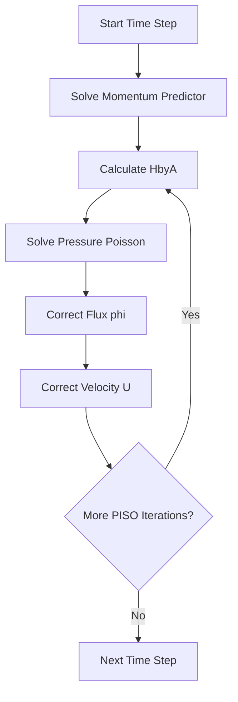

# icoFoam Walkthrough — Line by Line

ผ่าโค้ด Incompressible Laminar NS Solver

---

## Overview

> **icoFoam** = Incompressible, Laminar, Transient Navier-Stokes Solver
>
> ~100 lines of actual code — Perfect for learning!

<!-- IMAGE: IMG_10_001 -->
<!--
Purpose: เพื่อแสดงขั้นตอนของ PISO Algorithm อย่างละเอียด ให้ผู้อ่านเห็นภาพรวมของการทำงาน
Prompt: "Technical Flowchart of PISO Algorithm in CFD. **Layout:** Vertical flow. **Top:** 'Start Time Step'. **Block 1 (Blue):** 'Momentum Predictor' (Solve Matrix). **Block 2 (Green Container):** 'PISO Loop'. Inside: 'Pressure Solution' → 'Flux Correction' → 'Velocity Correction'. Curved arrow indicating loop repeats. **Bottom:** 'Next Time Step'. **Style:** Professional Engineering Schematic, flat design, white background, clear typography (Helvetica/Inter), pastel blue and green accents. High resolution."
-->


---

## Source Location

```bash
$FOAM_SOLVERS/incompressible/icoFoam/icoFoam.C
```

---

## Full Code with Annotations

### Part 1: Headers & Boilerplate (Lines 1-30)

```cpp
#include "fvCFD.H"  // Master header — includes EVERYTHING
                    // fvMesh, volFields, fvMatrices, etc.

int main(int argc, char *argv[])
{
    #include "setRootCaseLists.H"   // Parse -case, -parallel flags
    #include "createTime.H"         // Create runTime object
    #include "createMesh.H"         // Create mesh object
    #include "createFields.H"       // Create U, p, phi fields
    // ...
```

> [!NOTE]
> **ทำไมใช้ #include แทน explicit code?**
> - ทุก solver ใช้โค้ดเดียวกัน → avoid duplication
> - เปลี่ยนที่เดียว มีผลทุก solver

---

### Part 2: Field Creation (createFields.H)

```cpp
Info<< "Reading transportProperties\n" << endl;

IOdictionary transportProperties
(
    IOobject
    (
        "transportProperties",
        runTime.constant(),        // constant/ directory
        mesh,
        IOobject::MUST_READ_IF_MODIFIED,
        IOobject::NO_WRITE
    )
);

dimensionedScalar nu
(
    "nu",
    dimViscosity,                 // Dimension checking!
    transportProperties
);

Info<< "Reading field p\n" << endl;

volScalarField p
(
    IOobject
    (
        "p",
        runTime.timeName(),        // 0/, 0.1/, etc.
        mesh,
        IOobject::MUST_READ,
        IOobject::AUTO_WRITE
    ),
    mesh
);

Info<< "Reading field U\n" << endl;

volVectorField U
(
    IOobject
    (
        "U",
        runTime.timeName(),
        mesh,
        IOobject::MUST_READ,
        IOobject::AUTO_WRITE
    ),
    mesh
);

#include "createPhi.H"             // phi = flux = U dot Sf
```

> [!IMPORTANT]
> **Key Insight:** `phi` คือ **volumetric flux** (m³/s) ไม่ใช่ velocity!
> 
> $$\phi_f = \mathbf{U}_f \cdot \mathbf{S}_f$$

---

### Part 3: PISO Control

```cpp
#include "initContinuityErrs.H"    // Track mass conservation

pisoControl piso(mesh);            // PISO algorithm controller
                                   // Reads nCorrectors, nNonOrthogonalCorrectors
```

---

### Part 4: Time Loop

```cpp
Info<< "\nStarting time loop\n" << endl;

while (runTime.loop())             // Advance time step
{
    Info<< "Time = " << runTime.timeName() << nl << endl;

    #include "CourantNo.H"         // Calculate and report CFL
```

---

### Part 5: Momentum Predictor (THE CORE!)

```cpp
    fvVectorMatrix UEqn
    (
        fvm::ddt(U)                // Time derivative: ∂U/∂t
      + fvm::div(phi, U)           // Convection: ∇·(UU)
      - fvm::laplacian(nu, U)      // Diffusion: -ν∇²U
    );

    if (piso.momentumPredictor())
    {
        solve(UEqn == -fvc::grad(p));  // Solve with old pressure
    }
```

> [!TIP]
> **ทำไม `-fvc::grad(p)` ไม่ใช่ `fvm::grad(p)`?**
> - `fvc::` = explicit, ใช้ค่า p ที่รู้แล้ว
> - ไม่มี `fvm::grad()` ใน OpenFOAM!
> - Pressure gradient เป็น source term (RHS)

---

### Part 6: PISO Pressure Correction Loop

```cpp
    while (piso.correct())
    {
        // 1. Calculate momentum flux without pressure
        volScalarField rAU(1.0/UEqn.A());           // 1/a_P
        volVectorField HbyA(constrainHbyA(rAU*UEqn.H(), U, p));
        surfaceScalarField phiHbyA
        (
            "phiHbyA",
            fvc::flux(HbyA)
          + fvc::interpolate(rAU)*fvc::ddtCorr(U, phi)
        );
        
        adjustPhi(phiHbyA, U, p);                   // Fix BCs

        // 2. Non-orthogonal corrector loop
        while (piso.correctNonOrthogonal())
        {
            fvScalarMatrix pEqn
            (
                fvm::laplacian(rAU, p) == fvc::div(phiHbyA)
            );

            pEqn.setReference(pRefCell, pRefValue);
            pEqn.solve();

            if (piso.finalNonOrthogonalIter())
            {
                phi = phiHbyA - pEqn.flux();       // Correct flux
            }
        }

        // 3. Correct velocity
        U = HbyA - rAU*fvc::grad(p);
        U.correctBoundaryConditions();
```

> [!IMPORTANT]
> **Rhie-Chow Interpolation ซ่อนอยู่ที่ไหน?**
>
> ใน `constrainHbyA()` และการคำนวณ `phiHbyA` — ป้องกัน checkerboard pressure

<!-- IMAGE: IMG_10_002 -->
<!--
Purpose: เพื่ออธิบาย Rhie-Chow Interpolation ที่ป้องกันปัญหา Checkerboard Pressure
Prompt: "CFD Visualization of Rhie-Chow Interpolation. **Panel 1 (The Problem):** 'Checkerboard Pressure'. A 4x4 grid with cells colored alternately Red (High P) and Blue (Low P). Overlay arrows showing zero gradient (canceling out). Label: 'Numerical Oscillation'. **Panel 2 (The Solution):** 'Rhie-Chow Flux'. Close up of a cell face. Abstract visual of a smoothing filter or damping spring added to the face flux. Equation hint: 'φ = U_bar - D*grad(p)'. **Panel 3 (The Result):** 'Smooth Pressure Field'. The grid now shows a smooth gradient from Red to Blue. **Style:** Scientific illustration, 3-panel strip, clean vector graphics, heatmap visualization."
-->


---

### Part 7: Finalization

```cpp
        #include "continuityErrs.H"   // Report mass conservation
    }

    runTime.write();                  // Write output if needed

    runTime.printExecutionTime(Info);
}

Info<< "End\n" << endl;

return 0;
}
```

---

## Key Methods Explained

| Method | Returns | Purpose |
|:---|:---|:---|
| `UEqn.A()` | `volScalarField` | Diagonal coefficients ($a_P$) |
| `UEqn.H()` | `volVectorField` | Off-diagonal + sources ($H$) |
| `fvc::flux(U)` | `surfaceScalarField` | Face flux from velocity |
| `pEqn.flux()` | `surfaceScalarField` | Pressure-induced flux correction |

---

## PISO Algorithm Summary



---

## What Happens If... Scenarios

> **Learning through counterexamples** — Understanding why each step matters

### Scenario 1: What If You Skip Pressure Correction?

```cpp
// BAD: Without pressure correction
solve(UEqn == -fvc::grad(p));
U = HbyA - rAU*fvc::grad(p);
// MISSING: phi update!
```

**What happens:**
- ❌ Velocity field **doesn't satisfy continuity** (∇·U ≠ 0)
- ❌ Mass is created/destroyed randomly
- ❌ Solution blows up within few time steps

**Visualization:**
```
Without Pressure Correction:          With Pressure Correction:
Cell P:  +0.05 m³/s (mass gain)   →   Cell P:  0.00 m³/s ✓
Cell N:  -0.03 m³/s (mass loss)   →   Cell N:  0.00 m³/s ✓
```

---

### Scenario 2: What If Δt Is Too Large? (CFL Violation)

```cpp
// system/controlDict
deltaT  0.1;  // Too large for this mesh!
```

**CFL Number:**
$$\text{CFL} = \frac{U \Delta t}{\Delta x}$$

**When CFL > 1:**
- ❌ Information travels more than **one cell per time step**
- ❌ Solution becomes unstable/oscillatory
- ❌ May converge to wrong solution or diverge

**Rule of thumb:**
- **icoFoam:** CFL < 0.5 (explicit convection)
- **simpleFoam:** No CFL limit (steady-state)

**Example:**
```
Mesh: Δx = 0.01 m
Velocity: U = 1 m/s
Max stable Δt = 0.5 × 0.01 / 1 = 0.005 s

If Δt = 0.1 s:
→ CFL = 1 × 0.1 / 0.01 = 10 ❌ (Way too high!)
```

---

### Scenario 3: What If Mesh Is Highly Non-Orthogonal?

```
Skewed cell:  angle = 45° (should be > 70°)
```

**What happens without non-orthogonal correction:**
- ❌ Diffusion flux calculation error
- ❌ Solution may oscillate
- ❌ Wrong gradients

**Solution in icoFoam:**
```cpp
while (piso.correctNonOrthogonal())
{
    // Solve pressure equation multiple times
    // Each iteration improves accuracy on skewed meshes
}
```

**Visualization:**
```
Good Mesh (orthogonal):              Bad Mesh (non-orthogonal):
┌─────┐                                ╱────╲
│     │                                │     │
└─────┘                                ╲────╱
  face ⊥ grad(p)                        face ∦ grad(p)
  Accurate!                            Error!
```

---

### Scenario 4: What If You Don't Set Pressure Reference?

```cpp
// Missing: pEqn.setReference(pRefCell, pRefValue);
```

**What happens:**
- ❌ Pressure matrix is **singular** (rank deficient)
- ❌ Infinite solutions: p, p+1, p+100, ... all satisfy ∇²p = 0
- ❌ Solver may fail or return garbage

**Why pressure reference is needed:**
- Pressure appears as **gradient** in momentum equation: ∇p
- Adding constant to pressure doesn't change physics
- But numerical solver needs a unique solution

**Solution:**
```cpp
pEqn.setReference(500, 0);  // Fix cell 500 to p = 0 Pa
```

---

### Scenario 5: What Happens During Divergence?

**Symptoms to watch for:**

| Symptom | Cause | Fix |
|:---|:---|:---|
| Residuals increasing | Δt too large | Reduce deltaT |
| "NaN" in output | Division by zero | Check boundary conditions |
| Maximum iterations exceeded | Poor mesh quality | Refine mesh, check orthogonality |
| Pressure drifting | No reference cell | Add `setReference()` |

**Typical divergence pattern:**
```
Iteration 1:  Initial residual = 1.00000e+00
Iteration 2:  Initial residual = 1.00000e-01  ← Good
Iteration 3:  Initial residual = 5.00000e-01  ← Warning!
Iteration 4:  Initial residual = 2.00000e+00  ← Diverging!
Iteration 5:  Initial residual = nan         ← Crashed
```

---

## Concept Check

<details>
<summary><b>1. ทำไม `phi` ต้อง update หลัง pressure correction?</b></summary>

`phi` ที่คำนวณจาก momentum predictor **ไม่ satisfy continuity** (∇·U ≠ 0)

หลัง pressure correction:
$$\phi^{new} = \phi^{HbyA} - \left(\frac{1}{A}\right)_f (\nabla p)_f \cdot S_f$$

ทำให้ $\nabla \cdot \phi^{new} = 0$ (mass conserved)
</details>

<details>
<summary><b>2. `UEqn.A()` และ `UEqn.H()` หมายถึงอะไร?</b></summary>

จากสมการ momentum: $AU = H - \nabla p$

- **A:** Diagonal coefficient — รวม $\frac{\rho}{\Delta t}$ และ owner cell contribution
- **H:** Off-diagonal + sources — neighbor contributions และ source terms

Rearrange: $U = \frac{H}{A} - \frac{1}{A}\nabla p$
</details>

<details>
<summary><b>3. ทำไมใช้ `fvm::ddt(U)` ไม่ใช่ `fvc::ddt(U)`?</b></summary>

- `fvm::ddt(U)` สร้าง **matrix contribution** → U คือ unknown
- `fvc::ddt(U)` สร้าง **field** → ใช้เมื่อ U คือ known

ใน momentum equation, U คือสิ่งที่เราต้องการหา → ใช้ `fvm::`
</details>

---

## Exercise

1. **Add Source Term:** แก้โค้ดให้มี body force $\mathbf{g}$
2. **Change Time Scheme:** เปลี่ยนจาก Euler เป็น backward
3. **Debug Session:** ใช้ `gdb` ดูค่าของ `rAU` และ `HbyA`

---

## เอกสารที่เกี่ยวข้อง

- **ก่อนหน้า:** [Overview](00_Overview.md)
- **ถัดไป:** [simpleFoam Walkthrough](02_simpleFoam_Walkthrough.md)
