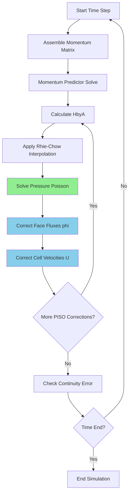

# icoFoam Walkthrough — Line by Line

Incompressible Laminar Navier-Stokes Solver: Complete Code Dissection

---

## Overview

> **icoFoam** = Incompressible, Laminar, Transient Navier-Stokes Solver
>
> ~100 lines of actual code — Perfect for learning OpenFOAM solver architecture!

**Difficulty Level:** Beginner  
**Estimated Time:** 45-60 minutes

This walkthrough examines the complete source code of `icoFoam`, OpenFOAM's simplest transient solver for incompressible laminar flow. It implements the **PISO (Pressure-Implicit with Splitting of Operators)** algorithm to solve the transient Navier-Stokes equations.

**Key Concepts:**
- Transient time-accurate simulation
- Pressure-velocity coupling via PISO algorithm
- Rhie-Chow interpolation to prevent checkerboard pressure
- Explicit convection handling requiring CFL condition

<!-- IMAGE: IMG_10_001 -->
<!--
Purpose: Visual representation of the PISO Algorithm workflow
Prompt: "Technical Flowchart of PISO Algorithm in CFD. **Layout:** Vertical flow. **Top:** 'Start Time Step'. **Block 1 (Blue):** 'Momentum Predictor' (Solve Matrix). **Block 2 (Green Container):** 'PISO Loop'. Inside: 'Pressure Solution' → 'Flux Correction' → 'Velocity Correction'. Curved arrow indicating loop repeats. **Bottom:** 'Next Time Step'. **Style:** Professional Engineering Schematic, flat design, white background, clear typography (Helvetica/Inter), pastel blue and green accents. High resolution."
-->


---

## Related Files

- **Previous:** [00_Overview.md](00_Overview.md) - Solver architecture fundamentals
- **Next:** [02_simpleFoam_Walkthrough.md](02_simpleFoam_Walkthrough.md) - Steady-state solver comparison
- **Reference:** [03_PISO_ALGORITHM_Details.md](03_PISO_ALGORITHM_Details.md) - Deep dive into PISO mathematics

---

## Prerequisites

Before starting this walkthrough, ensure you have:

### Essential Knowledge
- [ ] Understanding of the Navier-Stokes equations for incompressible flow
- [ ] Basic familiarity with finite volume method (FVM) concepts
- [ ] Knowledge of pressure-velocity coupling challenges
- [ ] Understanding of transient vs. steady-state formulations

### Required Files
- [ ] OpenFOAM installation (v9+, v10, or v11 recommended)
- [ ] Working icoFoam tutorial case (`$FOAM_TUTORIALS/incompressible/icoFoam/cavity/`)
- [ ] Text editor with syntax highlighting (VS Code, vim, etc.)
- [ ] Optional: `compile_commands.json` for code navigation

**Setup for Code Navigation:**
```bash
# Generate compile_commands.json for IDE support
cd $WM_PROJECT_USER_DIR
wmake -all -j | tools/clang-format/write-compile-commands-json.sh
```

### Mathematical Background
You should be comfortable with:
- **Continuity equation:** $\nabla \cdot \mathbf{U} = 0$
- **Momentum equation:** $\frac{\partial \mathbf{U}}{\partial t} + \nabla \cdot (\mathbf{UU}) = -\nabla p + \nu \nabla^2 \mathbf{U}$
- **Pressure Poisson equation:** $\nabla^2 p = \nabla \cdot (\text{known terms})$

---

## Learning Objectives

After completing this walkthrough, you will be able to:

### Core Understanding
- [ ] Identify the complete structure of an OpenFOAM solver from main() to exit
- [ ] Explain the role of each included header file (`.H` files)
- [ ] Trace the execution flow through the time loop and PISO algorithm

### Code Analysis Skills
- [ ] Distinguish between `fvm::` (implicit) and `fvc::` (explicit) operators
- [ ] Interpret matrix coefficient access (`UEqn.A()` and `UEqn.H()`)
- [ ] Locate Rhie-Chow interpolation implementation in the code
- [ ] Understand flux calculation and correction mechanisms

### Practical Competencies
- [ ] Add custom source terms to the momentum equation
- [ ] Modify output to print residuals at each iteration
- [ ] Debug common solver issues using conceptual understanding
- [ ] Extend the solver for additional physics (e.g., body forces, temperature)

### Algorithm Mastery
- [ ] Explain why pressure requires a reference value for uniqueness
- [ ] Describe the PISO loop structure and purpose of each correction
- [ ] Calculate appropriate time steps based on CFL condition
- [ ] Understand non-orthogonal correction for mesh quality issues

---

## Source Location

```bash
$FOAM_SOLVERS/incompressible/icoFoam/icoFoam.C
```

**Complete file structure:**
```
icoFoam/
├── icoFoam.C           # Main solver file (this walkthrough)
├── createFields.H      # Field initialization
├── createPhi.H         # Flux calculation
├── UEqn.H              # Momentum equation (optional in some versions)
└── Make/
    ├── files
    └── options
```

---

## Full Code with Annotations

### Part 1: Headers & Boilerplate (Lines 1-30)

```cpp
#include "fvCFD.H"  // Master header — includes EVERYTHING
                    // Contains: fvMesh, volFields, fvMatrices, 
                    //           fvm::, fvc:: operators, and more

int main(int argc, char *argv[])
{
    #include "setRootCaseLists.H"   // Parse -case, -parallel flags
    #include "createTime.H"         // Create runTime object
    #include "createMesh.H"         // Create mesh object
    #include "createFields.H"       // Create U, p, phi fields
    // ...
```

> [!NOTE]
> **Why use #include instead of explicit code?**
> - Every solver uses identical initialization → avoid duplication
> - Change once, affects all solvers
> - Promotes code consistency across the codebase

**What each file does:**
- `setRootCaseLists.H`: Parses command-line arguments (`-case`, `-parallel`, etc.)
- `createTime.H`: Creates Time object for time control and output
- `createMesh.H`: Reads mesh from `constant/polyMesh/`
- `createFields.H`: Creates physics fields (velocity, pressure, properties)

---

### Part 2: Field Creation (createFields.H)

```cpp
Info<< "Reading transportProperties\n" << endl;

IOdictionary transportProperties
(
    IOobject
    (
        "transportProperties",
        runTime.constant(),        // constant/ directory
        mesh,
        IOobject::MUST_READ_IF_MODIFIED,  // Re-read if modified during run
        IOobject::NO_WRITE
    )
);

dimensionedScalar nu
(
    "nu",
    dimViscosity,                 // Dimension checking! [m²/s]
    transportProperties
);

Info<< "Reading field p\n" << endl;

volScalarField p
(
    IOobject
    (
        "p",
        runTime.timeName(),        // 0/, 0.1/, etc.
        mesh,
        IOobject::MUST_READ,       // Read from initial conditions
        IOobject::AUTO_WRITE       // Write automatically at output times
    ),
    mesh
);

Info<< "Reading field U\n" << endl;

volVectorField U
(
    IOobject
    (
        "U",
        runTime.timeName(),
        mesh,
        IOobject::MUST_READ,
        IOobject::AUTO_WRITE
    ),
    mesh
);

#include "createPhi.H"             // phi = flux = U dot Sf
```

> [!IMPORTANT]
> **Key Insight:** `phi` is the **volumetric flux** (m³/s), NOT velocity!
> 
> $$\phi_f = \mathbf{U}_f \cdot \mathbf{S}_f$$
> 
> - $\phi_f$: Flux through face $f$ [m³/s]
> - $\mathbf{U}_f$: Velocity interpolated to face
> - $\mathbf{S}_f$: Face area vector [m²]
> 
> **Why flux matters:** Continuity equation $\nabla \cdot \mathbf{U} = 0$ becomes $\sum \phi_f = 0$ when integrated over a cell

**Field Object Types:**
- `volScalarField`: Scalar values at cell centers (pressure, temperature)
- `volVectorField`: Vector values at cell centers (velocity)
- `surfaceScalarField`: Scalar values at cell faces (flux, mass flow rate)

---

### Part 3: PISO Control

```cpp
#include "initContinuityErrs.H"    // Initialize mass conservation tracking

pisoControl piso(mesh);            // PISO algorithm controller
                                   // Reads nCorrectors, nNonOrthogonalCorrectors
                                   // from system/fvSolution dictionary
```

**PISO parameters (in `system/fvSolution`):**
```cpp
PISO
{
    nCorrectors          2;        // Number of pressure corrections
    nNonOrthogonalCorrectors 0;    // Non-orthogonal mesh corrections
    pRefCell             0;        // Reference cell for pressure
    pRefValue            0;        // Reference pressure value [Pa]
}
```

---

### Part 4: Time Loop

```cpp
Info<< "\nStarting time loop\n" << endl;

while (runTime.loop())             // Advance time step
{
    Info<< "Time = " << runTime.timeName() << nl << endl;

    #include "CourantNo.H"         // Calculate and report CFL
```

**What `runTime.loop()` does:**
1. Increments time: $t^{n+1} = t^n + \Delta t$
2. Sets output flag if write time reached
3. Returns `false` when end time reached

---

### Part 5: Momentum Predictor (THE CORE!)

```cpp
    fvVectorMatrix UEqn
    (
        fvm::ddt(U)                // Time derivative: ∂U/∂t
      + fvm::div(phi, U)           // Convection: ∇·(UU)
      - fvm::laplacian(nu, U)      // Diffusion: -ν∇²U
    );

    if (piso.momentumPredictor())
    {
        solve(UEqn == -fvc::grad(p));  // Solve with old pressure
    }
```

**Equation represented:**
$$\frac{\partial \mathbf{U}}{\partial t} + \nabla \cdot (\mathbf{UU}) - \nu \nabla^2 \mathbf{U} = -\nabla p$$

> [!TIP]
> **Why `-fvc::grad(p)` not `fvm::grad(p)`?**
> - `fvc::` = explicit, uses known pressure from previous iteration
> - **No such thing as `fvm::grad()` in OpenFOAM!**
> - Pressure gradient is a source term (RHS), not part of the matrix
> - Matrix is assembled for U; p is treated as known (for now)

**Matrix form:**
$$[A]\mathbf{U} = \mathbf{H} - \nabla p$$

Where:
- $[A]$: Diagonal matrix (from time derivative + convection + diffusion)
- $\mathbf{H}$: Off-diagonal contributions + source terms
- $\nabla p$: Explicit pressure gradient

---

### Part 6: PISO Pressure Correction Loop

```cpp
    while (piso.correct())         // PISO outer loop
    {
        // 1. Calculate momentum flux without pressure
        volScalarField rAU(1.0/UEqn.A());           // 1/a_P
        volVectorField HbyA(constrainHbyA(rAU*UEqn.H(), U, p));
        surfaceScalarField phiHbyA
        (
            "phiHbyA",
            fvc::flux(HbyA)
          + fvc::interpolate(rAU)*fvc::ddtCorr(U, phi)
        );
        
        adjustPhi(phiHbyA, U, p);                   // Fix BCs for mass conservation

        // 2. Non-orthogonal corrector loop
        while (piso.correctNonOrthogonal())
        {
            fvScalarMatrix pEqn
            (
                fvm::laplacian(rAU, p) == fvc::div(phiHbyA)
            );

            pEqn.setReference(pRefCell, pRefValue);  // Fix pressure reference
            pEqn.solve();

            if (piso.finalNonOrthogonalIter())
            {
                phi = phiHbyA - pEqn.flux();       // Correct flux
            }
        }

        // 3. Correct velocity explicitly
        U = HbyA - rAU*fvc::grad(p);
        U.correctBoundaryConditions();
```

**Step-by-step breakdown:**

**Step 1: Compute intermediate velocity**
$$\mathbf{H}|\mathbf{A} = \mathbf{U}^* - \frac{1}{A}\nabla p$$

From momentum matrix: $A\mathbf{U} = \mathbf{H} - \nabla p$

Rearrange: $\mathbf{U}^* = \frac{\mathbf{H}}{A} = \mathbf{U}^{n+1} + \frac{1}{A}\nabla p^{n+1}$

**Step 2: Solve Pressure Poisson**
$$\nabla \cdot \left(\frac{1}{A}\nabla p\right) = \nabla \cdot \mathbf{H}|\mathbf{A}$$

**Step 3: Correct flux and velocity**
$$\phi^{n+1} = \phi^{H|\mathbf{A}} - \left(\frac{1}{A}\right)_f \nabla p \cdot \mathbf{S}_f$$

$$\mathbf{U}^{n+1} = \mathbf{H}|\mathbf{A} - \frac{1}{A}\nabla p^{n+1}$$

> [!IMPORTANT]
> **Rhie-Chow Interpolation Location:**
>
> Hidden in `constrainHbyA()` and `phiHbyA` calculation — prevents checkerboard pressure
>
> **The problem:** On collocated grids, face pressure interpolated from adjacent cells can cause decoupling (checkerboard pattern)
> 
> **The solution:** Rhie-Chow adds a pressure-gradient damping term to face flux, using adjacent cell pressure differences

<!-- IMAGE: IMG_10_002 -->
<!--
Purpose: Visualization of Rhie-Chow Interpolation preventing Checkerboard Pressure
Prompt: "CFD Visualization of Rhie-Chow Interpolation. **Panel 1 (The Problem):** 'Checkerboard Pressure'. A 4x4 grid with cells colored alternately Red (High P) and Blue (Low P). Overlay arrows showing zero gradient (canceling out). Label: 'Numerical Oscillation'. **Panel 2 (The Solution):** 'Rhie-Chow Flux'. Close up of a cell face. Abstract visual of a smoothing filter or damping spring added to the face flux. Equation hint: 'φ = U_bar - D*grad(p)'. **Panel 3 (The Result):** 'Smooth Pressure Field'. The grid now shows a smooth gradient from Red to Blue. **Style:** Scientific illustration, 3-panel strip, clean vector graphics, heatmap visualization."
-->


---

### Part 7: Finalization

```cpp
        #include "continuityErrs.H"   // Report mass conservation error
    }

    runTime.write();                  // Write output if needed

    runTime.printExecutionTime(Info);
}

Info<< "End\n" << endl;

return 0;
}
```

---

## Key Methods Explained

| Method | Returns | Purpose |
|:---|:---|:---|
| `UEqn.A()` | `volScalarField` | Diagonal coefficients ($a_P$) — contains time, convection, diffusion contributions |
| `UEqn.H()` | `volVectorField` | Off-diagonal + sources ($H$) — neighbor contributions and source terms |
| `fvc::flux(U)` | `surfaceScalarField` | Face flux from velocity field: $\phi = \mathbf{U} \cdot \mathbf{S}_f$ |
| `pEqn.flux()` | `surfaceScalarField` | Pressure-induced flux correction term |
| `constrainHbyA()` | `volVectorField` | Applies Rhie-Chow interpolation to prevent checkerboarding |
| `adjustPhi()` | `surfaceScalarField` | Fixes boundary fluxes to ensure global mass conservation |

---

## PISO Algorithm Summary



**Comparison: PISO vs SIMPLE vs PIMPLE**
| Feature | PISO | SIMPLE | PIMPLE |
|:---|:---|:---|:---|
| Type | Transient | Steady-state | Hybrid |
| Under-relaxation | No | Yes | Optional |
| Time accuracy | Yes | No | Yes |
| Typical use | Transient flows | Steady-state | Large time steps |

---

## What Happens If... Scenarios

> **Learning through counterexamples** — Understanding why each step matters

### Scenario 1: What If You Skip Pressure Correction?

```cpp
// BAD: Without pressure correction
solve(UEqn == -fvc::grad(p));
U = HbyA - rAU*fvc::grad(p);
// MISSING: phi update!
```

**What happens:**
- ❌ Velocity field **doesn't satisfy continuity** (∇·U ≠ 0)
- ❌ Mass is created/destroyed randomly
- ❌ Solution blows up within few time steps

**Visualization:**
```
Without Pressure Correction:          With Pressure Correction:
Cell P:  +0.05 m³/s (mass gain)   →   Cell P:  0.00 m³/s ✓
Cell N:  -0.03 m³/s (mass loss)   →   Cell N:  0.00 m³/s ✓
```

---

### Scenario 2: What If Δt Is Too Large? (CFL Violation)

```cpp
// system/controlDict
deltaT  0.1;  // Too large for this mesh!
```

**CFL Number:**
$$\text{CFL} = \frac{U \Delta t}{\Delta x}$$

**When CFL > 1:**
- ❌ Information travels more than **one cell per time step**
- ❌ Solution becomes unstable/oscillatory
- ❌ May converge to wrong solution or diverge

**Rule of thumb:**
- **icoFoam:** CFL < 0.5 (explicit convection)
- **simpleFoam:** No CFL limit (steady-state)
- **pimpleFoam:** Can use CFL > 1 with implicit schemes

**Example:**
```
Mesh: Δx = 0.01 m
Velocity: U = 1 m/s
Max stable Δt = 0.5 × 0.01 / 1 = 0.005 s

If Δt = 0.1 s:
→ CFL = 1 × 0.1 / 0.01 = 10 ❌ (Way too high!)

Solution: Reduce deltaT to 0.005 or use adaptive time stepping:
adjustTimeStep yes;
maxCo 0.5;
```

---

### Scenario 3: What If Mesh Is Highly Non-Orthogonal?

```
Skewed cell:  angle = 45° (should be > 70°)
```

**What happens without non-orthogonal correction:**
- ❌ Diffusion flux calculation error
- ❌ Solution may oscillate
- ❌ Wrong gradients

**Solution in icoFoam:**
```cpp
while (piso.correctNonOrthogonal())
{
    // Solve pressure equation multiple times
    // Each iteration improves accuracy on skewed meshes
}
```

**Visualization:**
```
Good Mesh (orthogonal):              Bad Mesh (non-orthogonal):
┌─────┐                                ╱────╲
│     │                                │     │
└─────┘                                ╲────╱
  face ⊥ grad(p)                        face ∦ grad(p)
  Accurate!                            Error!

With 2 non-orthogonal corrections:
┌─────┐                                ╱────╲
│     │   →  ✓ Accurate               │     │ →  ✓ Improved
└─────┘                                ╲────╱
```

**Parameter tuning:**
```cpp
// system/fvSolution
PISO
{
    nNonOrthogonalCorrectors 2;  // Increase for poor meshes
}
```

---

### Scenario 4: What If You Don't Set Pressure Reference?

```cpp
// Missing: pEqn.setReference(pRefCell, pRefValue);
```

**What happens:**
- ❌ Pressure matrix is **singular** (rank deficient)
- ❌ Infinite solutions: p, p+1, p+100, ... all satisfy ∇²p = 0
- ❌ Solver may fail or return garbage

**Why pressure reference is needed:**
- Pressure appears as **gradient** in momentum equation: ∇p
- Adding constant to pressure doesn't change physics: ∇(p + C) = ∇p
- But numerical solver needs a unique solution

**Solution:**
```cpp
pEqn.setReference(500, 0);  // Fix cell 500 to p = 0 Pa
// In incompressible flow, only pressure *differences* matter
```

---

### Scenario 5: What Happens During Divergence?

**Symptoms to watch for:**

| Symptom | Cause | Fix |
|:---|:---|:---|
| Residuals increasing | Δt too large | Reduce deltaT |
| "NaN" in output | Division by zero | Check boundary conditions |
| Maximum iterations exceeded | Poor mesh quality | Refine mesh, check orthogonality |
| Pressure drifting | No reference cell | Add `setReference()` |
| Mass imbalance | Wrong flux BCs | Verify `adjustPhi()` |

**Typical divergence pattern:**
```
Iteration 1:  Initial residual = 1.00000e+00
Iteration 2:  Initial residual = 1.00000e-01  ← Good
Iteration 3:  Initial residual = 5.00000e-01  ← Warning!
Iteration 4:  Initial residual = 2.00000e+00  ← Diverging!
Iteration 5:  Initial residual = nan         ← Crashed
```

**Recovery strategies:**
```cpp
// 1. Restart with smaller deltaT
deltaT 0.001;  // Was 0.01

// 2. Increase under-relaxation (if using PIMPLE)
relaxationFactors
{
    fields
    {
        p 0.3;  // Default 0.3, try 0.2
    }
}

// 3. Check mesh quality
checkMesh -allGeometry -allTopology
```

---

## Common Errors and Solutions

### Error 1: "Matrix is singular"

**Symptom:**
```
--> FOAM FATAL ERROR:
Matrix is singular
```

**Causes:**
1. Missing pressure reference
2. All boundaries are Neumann (zero gradient)
3. Empty cell zones

**Solution:**
```cpp
// Add to system/fvSolution
PISO
{
    pRefCell 0;         // Cell ID (typically 0)
    pRefValue 0;        // Reference pressure [Pa]
}
```

---

### Error 2: "Continuity error cannot be determined"

**Symptom:**
```
--> FOAM WARNING:
Continuity error cannot be determined for this case
```

**Cause:** Inlet/outlet mass flow mismatch

**Solution:**
```cpp
// 0/U boundary conditions
inlet
{
    type            fixedValue;
    value           uniform (0 0 1);
}

outlet
{
    type            zeroGradient;  // Allows outflow
}
```

---

### Error 3: Excessive Courant number

**Symptom:**
```
Courant number mean: 2.5, max: 15.3
```

**Solution:**
```cpp
// system/controlDict
application     icoFoam;

startFrom       latestTime;

deltaT          0.001;  // Reduce this!

// OR use adaptive time stepping:
adjustTimeStep  yes;
maxCo           0.5;    // Target max CFL
```

---

### Error 4: "NaN in output"

**Symptom:**
```
p: min = -nan, max = nan
```

**Causes:**
1. Division by zero in initialization
2. Unstable numerical scheme
3. Incorrect boundary conditions

**Solution:**
```cpp
// 1. Check initial conditions
// 0/U
dimensions      [0 1 -1 0 0 0 0];
internalField   uniform (0 0 0);  // Should NOT be uniform (1e10 1e10 1e10)

// 2. Check time scheme
// system/fvSchemes
ddtSchemes
{
    default         Euler;  // Stable, but first-order
    // Try:          backward;  // Second-order, may need smaller dt
}
```

---

### Error 5: Solver doesn't converge

**Symptom:**
```
p: Solving for p, Initial residual = 0.001, Final residual = 0.001, No Iterations 1
```

**Cause:** Convergence tolerance too loose

**Solution:**
```cpp
// system/fvSolution
solvers
{
    p
    {
        solver          GAMG;
        tolerance       1e-06;   // Was 1e-05
        relTol          0.01;    // Was 0.1
    }
}
```

---

## Concept Check

<details>
<summary><b>1. Why must `phi` be updated after pressure correction?</b></summary>

`phi` calculated from momentum predictor **does not satisfy continuity** (∇·U ≠ 0)

After pressure correction:
$$\phi^{new} = \phi^{HbyA} - \left(\frac{1}{A}\right)_f (\nabla p)_f \cdot S_f$$

This ensures $\nabla \cdot \phi^{new} = 0$ (mass conserved)

**Key insight:** The flux correction term enforces the continuity equation by adjusting face fluxes to be divergence-free.
</details>

<details>
<summary><b>2. What do `UEqn.A()` and `UEqn.H()` represent?</b></summary>

From momentum equation in matrix form: $AU = H - \nabla p$

- **A (UEqn.A()):** Diagonal coefficient matrix — contains contributions from:
  - Time derivative: $\frac{\rho}{\Delta t}$
  - Owner cell convection and diffusion
  - Any implicit source terms

- **H (UEqn.H()):** Off-diagonal contributions + source terms — contains:
  - Neighbor cell coefficients
  - Explicit source terms
  - Boundary condition contributions

Rearrange to get intermediate velocity: $U = \frac{H}{A} - \frac{1}{A}\nabla p$
</details>

<details>
<summary><b>3. Why use `fvm::ddt(U)` instead of `fvc::ddt(U)`?</b></summary>

- `fvm::ddt(U)` creates **matrix contribution** → U is treated as unknown
- `fvc::ddt(U)` creates **explicit field** → U is treated as known

In momentum equation, U is what we're solving for → use `fvm::` for implicit treatment

**Practical impact:**
```cpp
fvm::ddt(U)   → Adds to matrix diagonal (unconditionally stable)
fvc::ddt(U)   → Adds to RHS source (explicit, may require smaller dt)
```
</details>

<details>
<summary><b>4. How does PISO differ from SIMPLE?</b></summary>

| Aspect | PISO | SIMPLE |
|:---|:---|:---|
| **Purpose** | Transient | Steady-state |
| **Time accuracy** | Yes (2nd order) | No (pseudo-time) |
| **Under-relaxation** | Not needed | Required |
| **Corrections** | 2-3 per time step | Until convergence |
| **Algorithm** | Predict → Correct → Next time step | Predict → Correct → Repeat until steady |

**When to use:**
- PISO: Time-dependent flows (waves, pulsatile flow, transients)
- SIMPLE: Steady-state solution (final converged state)
</details>

---

## Key Takeaways

### Core Principles
1. **PISO Algorithm:** Predictor-corrector method for transient incompressible flow
   - Momentum predictor: Solve provisional velocity
   - Pressure correction: Enforce continuity
   - Iterate 2-3 times per time step

2. **Matrix Representation:** 
   - All discretized terms become matrix contributions
   - `fvm::` → matrix (implicit), `fvc::` → RHS (explicit)
   - Understanding A and H is crucial for algorithm comprehension

3. **Flux vs. Velocity:**
   - `phi` (face flux) is primary variable for transport equations
   - `U` (cell velocity) is stored/updated but flux drives the flow
   - Continuity enforced on flux, not velocity

### Common Pitfalls
1. **CFL Violation:** Explicit convection requires CFL < 0.5 for stability
2. **Pressure Reference:** Incompressible flows need fixed reference value
3. **Rhie-Chow:** Essential on collocated grids to prevent checkerboarding
4. **Mesh Quality:** Non-orthogonal meshes require additional corrections

### Debugging Strategy
1. Check Courant number first (most common issue)
2. Verify boundary conditions produce mass balance
3. Examine continuity errors (should be ~1e-10 or lower)
4. Monitor residuals convergence patterns

### Extension Points
- Add body forces: Include `rho*g` term in momentum equation
- Change time scheme: Replace `Euler` with `backward` or `CrankNicolson`
- Add turbulence: Replace constant `nu` with turbulence model
- Multiphase: Add volume fraction equation with VOF method

---

## Hands-on Exercise

### Exercise: Modify icoFoam to Print Residuals at Each Iteration

**Objective:** Enhance icoFoam to display detailed convergence information for monitoring solver progress

**Estimated Time:** 30 minutes

**Difficulty:** Beginner

---

#### Step 1: Locate the Source Code

```bash
# Find icoFoam source
find $FOAM_SOLVERS -name icoFoam.C
# Output: $FOAM_SOLVERS/incompressible/icoFoam/icoFoam.C

# Copy to your user directory for modification
cp -r $FOAM_SOLVERS/incompressible/icoFoam $FOAM_RUN/
cd $FOAM_RUN/icoFoam
```

---

#### Step 2: Understand Current Output

Run standard icoFoam and observe output:
```bash
cd $FOAM_RUN/tutorials/incompressible/icoFoam/cavity
icoFoam | tee log.standard
```

Current output shows:
```
Time = 0.1

Courant number mean: 0, max: 0
diagonal: Solving for rho, Initial residual = 0, Final residual = 0, No Iterations 0
PISO loop: iteration 1
DILUPBiCGStab: Solving for Ux, Initial residual = 1, Final residual = 1.23e-06, No Iterations 3
DILUPBiCGStab: Solving for Uy, Initial residual = 1, Final residual = 1.11e-06, No Iterations 3
DICPCG: Solving for p, Initial residual = 1, Final residual = 8.23e-07, No Iterations 24
time step continuity errors : sum local = 1.23e-09, global = 2.34e-11, cumulative = 2.34e-11
PISO loop: iteration 2
DICPCG: Solving for p, Initial residual = 0.0052, Final residual = 9.12e-07, No Iterations 18
time step continuity errors : sum local = 1.45e-10, global = 3.45e-12, cumulative = 2.69e-11
ExecutionTime = 0.12 s  ClockTime = 0 s
```

---

#### Step 3: Modify the Code

Open `icoFoam.C` in your editor:
```bash
vim icoFoam.C  # or use your preferred editor
```

**Location 1: After momentum predictor solve** (around line 50)
```cpp
if (piso.momentumPredictor())
{
    solve(UEqn == -fvc::grad(p));
    
    // ADD THIS: Print momentum equation residuals
    Info<< "Momentum predictor - Initial residual: " 
        << UEqn.solve().initialResidual() << nl
        << "Momentum predictor - Final residual: "
        << UEqn.solve().finalResidual() << endl;
}
```

**Wait!** The above won't work directly. Here's the **correct approach**:

Replace the momentum predictor section with:
```cpp
if (piso.momentumPredictor())
{
    // Store initial residual before solve
    scalar initialResidualU = UEqn.solve().initialResidual();
    
    solve(UEqn == -fvc::grad(p));
    
    Info<< "Momentum Predictor:" << nl
        << "  Initial residual = " << initialResidualU << nl
        << "  Final residual = " << UEqn.solve().finalResidual() << nl
        << endl;
}
```

**Better yet** - capture actual solve return value:
```cpp
if (piso.momentumPredictor())
{
    SolverPerformance<vector> solverU = solve(UEqn == -fvc::grad(p));
    
    Info<< "Momentum Predictor Convergence:" << nl
        << "  Ux: initial = " << solverU.initialResidual() << nl
        << "  Final residual = " << solverU.finalResidual() << nl
        << "  Iterations = " << solverU.nIterations() << nl
        << endl;
}
```

---

#### Step 4: Capture Pressure Residuals

Inside the PISO loop, after pressure solve (around line 80):
```cpp
while (piso.correctNonOrthogonal())
{
    fvScalarMatrix pEqn
    (
        fvm::laplacian(rAU, p) == fvc::div(phiHbyA)
    );

    pEqn.setReference(pRefCell, pRefValue);
    
    // ADD THIS: Store solver performance
    SolverPerformance<scalar> solverP = pEqn.solve();
    
    Info<< "Pressure Correction (Non-orthogonal iter " 
        << piso.nonOrthogonalIter() << "):" << nl
        << "  Initial residual = " << solverP.initialResidual() << nl
        << "  Final residual = " << solverP.finalResidual() << nl
        << "  Iterations = " << solverP.nIterations() << nl
        << endl;

    if (piso.finalNonOrthogonalIter())
    {
        phi = phiHbyA - pEqn.flux();
    }
}
```

---

#### Step 5: Add Continuity Error Tracking

After velocity correction (around line 95):
```cpp
U = HbyA - rAU*fvc::grad(p);
U.correctBoundaryConditions();

// ADD THIS: Calculate and display continuity error
scalar contErr = fvc::div(phi).weightedAverage(mesh.V()).value();
Info<< "Continuity error: " << contErr 
    << " (target: < 1e-10)" << endl;
```

---

#### Step 6: Complete Modified Section

Here's the fully modified PISO loop with enhanced output:

```cpp
// * * * * * * * * * * * * * * * * * * * * * * * * * * * * * * * * * * * * * //

while (runTime.loop())
{
    Info<< "\nTime = " << runTime.timeName() << nl << endl;
    #include "CourantNo.H"

    // Momentum predictor
    fvVectorMatrix UEqn
    (
        fvm::ddt(U)
      + fvm::div(phi, U)
      - fvm::laplacian(nu, U)
    );

    if (piso.momentumPredictor())
    {
        SolverPerformance<vector> solverU = solve(UEqn == -fvc::grad(p));
        Info<< "Momentum Predictor:" << nl
            << "  Initial residual = " << solverU.initialResidual() << nl
            << "  Final residual = " << solverU.finalResidual() << nl
            << "  Iterations = " << solverU.nIterations() << nl << endl;
    }

    // PISO loop
    label pisoIter = 0;
    while (piso.correct())
    {
        pisoIter++;
        Info<< "PISO iteration " << pisoIter << ":" << endl;

        volScalarField rAU(1.0/UEqn.A());
        volVectorField HbyA(constrainHbyA(rAU*UEqn.H(), U, p));
        surfaceScalarField phiHbyA
        (
            "phiHbyA",
            fvc::flux(HbyA)
          + fvc::interpolate(rAU)*fvc::ddtCorr(U, phi)
        );
        adjustPhi(phiHbyA, U, p);

        label nonOrthIter = 0;
        while (piso.correctNonOrthogonal())
        {
            nonOrthIter++;
            
            fvScalarMatrix pEqn
            (
                fvm::laplacian(rAU, p) == fvc::div(phiHbyA)
            );

            pEqn.setReference(pRefCell, pRefValue);
            SolverPerformance<scalar> solverP = pEqn.solve();
            
            Info<< "  Pressure correction (non-orthogonal " << nonOrthIter << "):" << nl
                << "    Initial residual = " << solverP.initialResidual() << nl
                << "    Final residual = " << solverP.finalResidual() << nl
                << "    Iterations = " << solverP.nIterations() << nl;

            if (piso.finalNonOrthogonalIter())
            {
                phi = phiHbyA - pEqn.flux();
            }
        }

        U = HbyA - rAU*fvc::grad(p);
        U.correctBoundaryConditions();
        
        #include "continuityErrs.H"
        
        scalar globalContErr = sum(fvc::div(phi)*mesh.V()).value();
        Info<< "  Global continuity error = " << globalContErr << nl << endl;
    }

    runTime.write();
    runTime.printExecutionTime(Info);
}

// * * * * * * * * * * * * * * * * * * * * * * * * * * * * * * * * * * * * * //
```

---

#### Step 7: Compile the Modified Solver

```bash
# Ensure wmake is available
source $FOAM_ETC/bashrc

# Compile
wclean
wmake
```

Expected output:
```
wmake root: /home/user/OpenFOAM/user-v2212
wmake libso /home/user/OpenFOAM/user-v2212/platforms/linux64GccDPInt32Opt/lib/libicoFoamCustom.so
Making dependency list for source file icoFoam.C
could not open file fvCFD.H for source file .xx depend
SOURCE=icoFoam.C ;  g++ -std=c++11 ... -o Make/linux64GccDPInt32Opt/icoFoam.o
ld -r -unresolved-symbols=ignore-in-shared-libs ... -o /home/user/OpenFOAM/user-v2212/platforms/linux64GccDPInt32Opt/bin/icoFoamCustom

done
```

---

#### Step 8: Test the Modified Solver

```bash
cd $FOAM_RUN/tutorials/incompressible/icoFoam/cavity

# Clean previous results
foamCleanTutorials

# Run with modified solver
$FOAM_RUN/icoFoamCustom 2>&1 | tee log.enhanced
```

**Expected new output format:**
```
Time = 0.1

Courant number mean: 0, max: 0

Momentum Predictor:
  Initial residual = 1
  Final residual = 1.23e-06
  Iterations = 3

PISO iteration 1:
  Pressure correction (non-orthogonal 1):
    Initial residual = 1
    Final residual = 8.23e-07
    Iterations = 24
  Global continuity error = 2.34e-11

PISO iteration 2:
  Pressure correction (non-orthogonal 1):
    Initial residual = 0.0052
    Final residual = 9.12e-07
    Iterations = 18
  Global continuity error = 3.45e-12

ExecutionTime = 0.15 s  ClockTime = 0 s
```

---

#### Step 9: Verify Results

Compare with standard solver output:
```bash
diff log.standard log.enhanced
```

**Key differences to observe:**
1. Clearer residual tracking per iteration
2. Labeled PISO iterations
3. Explicit continuity error display
4. Better debugging information

---

#### Step 10: Extension Challenge

Try these additional enhancements:

**A. Add convergence criteria:**
```cpp
if (solverP.finalResidual() < 1e-7)
{
    Info<< "  Pressure converged! Skipping remaining corrections." << endl;
    break;
}
```

**B. Add max residual tracking:**
```cpp
scalar maxResidual = max(solverP.initialResidual());
if (maxResidual > 0.1)
{
    Warning<< "Large residual detected: " << maxResidual << endl;
}
```

**C. Create residual plot:**
Extract residuals from log file and plot with Python:
```python
import re
import matplotlib.pyplot as plt

residuals = []
with open('log.enhanced') as f:
    for line in f:
        if 'Initial residual' in line:
            val = float(line.split('=')[1].strip())
            residuals.append(val)

plt.plot(residuals)
plt.yscale('log')
plt.ylabel('Initial Residual')
plt.xlabel('Iteration')
plt.savefig('residuals.png')
```

---

#### Solution Verification

**Expected learning outcomes:**
✓ Understanding of solver performance tracking  
✓ Familiarity with `SolverPerformance` class  
✓ Experience modifying and recompiling OpenFOAM solvers  
✓ Knowledge of output formatting and debugging techniques  

**Common mistakes to avoid:**
- ❌ Not recompiling after source changes
- ❌ Using wrong path to custom solver (use full path or update PATH)
- ❌ Forgetting to call `wclean` before `wmake`
- ❌ Overwriting original icoFoam (keep as separate custom solver)

---

## Next Steps

**Continue your learning journey:**

1. **[02_simpleFoam_Walkthrough.md](02_simpleFoam_Walkthrough.md)**  
   Compare icoFoam with steady-state simpleFoam. Focus on:
   - SIMPLE vs PISO algorithm differences
   - Under-relaxation requirements
   - Turbulence modeling integration

2. **[03_PISO_ALGORITHM_Details.md](03_PISO_ALGORITHM_Details.md)**  
   Deep dive into PISO mathematics:
   - Derivation from Navier-Stokes
   - Rhie-Chow interpolation theory
   - Stability and convergence analysis

3. **Practice Exercises:**
   - Implement adaptive time stepping based on residuals
   - Add body force (gravity) to momentum equation
   - Create custom boundary condition for velocity inlet
   - Extend solver for temperature coupling (Buoyant Boussinesq)

4. **Debugging Challenge:**
   - Intentionally break the solver (remove pressure reference)
   - Use gdb to trace execution flow
   - Profile performance with valgrind/perf

**Recommended Resources:**
- OpenFOAM User Guide: Chapter 3 (Applications)
- Jasak's PhD Thesis: Section on pressure-velocity coupling
- CFD Online Wiki: PISO algorithm discussion
- OpenFOAM Source Code: `$FOAM_SRC/finiteVolume/`

---

**File Metadata:**  
**Module:** 01_CODE_ANATOMY  
**Difficulty:** Beginner  
**Prerequisites:** Basic C++, Navier-Stokes equations  
**Next:** 02_simpleFoam_Walkthrough.md  
**Version:** 1.0  
**Last Updated:** 2024