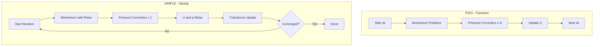

# simpleFoam Walkthrough

ผ่าโค้ด Steady-State Turbulent Incompressible Solver

---

## Overview

> **simpleFoam** = Steady-State, Turbulent, Incompressible NS Solver
>
> ใช้ SIMPLE algorithm แทน PISO

<!-- IMAGE: IMG_10_003 -->
<!--
Purpose: เพื่อแสดงความแตกต่างระหว่าง SIMPLE และ PISO algorithm อย่างชัดเจน
Prompt: "Split-screen infographic comparing PISO and SIMPLE CFD algorithms. **Left Side (PISO - Transient):** Vertical flow of stacked blocks representing time steps. Arrows flowing down. Label: 'Transient / Time-Accurate'. Color: Cool Blue. **Right Side (SIMPLE - Steady):** A large circular cycle representing iterations. Arrows looping continuously. Label: 'Steady-State / Iterative'. Color: Warm Orange. **Comparison Table at Bottom:** Minimalist icons for 'Time' (Clock vs Infinity), 'Relaxation' (None vs Required). **Style:** Modern technical infographic, clean isometric view, soft lighting, professional layout."
-->


---

## ความแตกต่างจาก icoFoam

| Feature | icoFoam | simpleFoam |
|:---|:---|:---|
| **Time** | Transient | Steady-State |
| **Turbulence** | Laminar only | RANS Models |
| **P-V Coupling** | PISO | SIMPLE |
| **Under-relaxation** | ไม่จำเป็น | **บังคับใช้** |
| **Time Loop** | `runTime.loop()` | `simple.loop()` (pseudo-time) |

---

## Source Location

```bash
$FOAM_SOLVERS/incompressible/simpleFoam/simpleFoam.C
```

---

## Key Code Sections

### 1. Turbulence Model Initialization

```cpp
#include "singlePhaseTransportModel.H"
#include "turbulentTransportModel.H"

// ...

singlePhaseTransportModel laminarTransport(U, phi);

autoPtr<incompressible::turbulenceModel> turbulence
(
    incompressible::turbulenceModel::New(U, phi, laminarTransport)
);
```

> [!NOTE]
> **RTS in Action!**
> 
> Model ถูกเลือกจาก `constant/turbulenceProperties`:
> ```cpp
> simulationType RAS;
> RAS { model kEpsilon; }
> ```

---

### 2. SIMPLE Control Object

```cpp
#include "simpleControl.H"

simpleControl simple(mesh);
```

`simpleControl` อ่านค่าจาก `system/fvSolution`:
```cpp
SIMPLE
{
    nNonOrthogonalCorrectors 1;
    residualControl
    {
        p       1e-4;
        U       1e-4;
    }
}
```

---

### 3. SIMPLE Loop (ไม่ใช่ Time Loop!)

```cpp
Info<< "\nStarting iteration loop\n" << endl;

while (simple.loop())   // NOT runTime.loop()!
{
    Info<< "Iteration = " << runTime.timeName() << nl << endl;
```

> [!IMPORTANT]
> **Pseudo-time Stepping**
> 
> `simple.loop()` ใช้ "iteration number" เป็น time index
> - ไม่มีความหมายทาง physics
> - ใช้แค่สำหรับ convergence tracking

---

### 4. Momentum Equation with Relaxation

```cpp
    // Momentum predictor
    tmp<fvVectorMatrix> tUEqn
    (
        fvm::div(phi, U)               // Convection
      + turbulence->divDevReff(U)      // Diffusion (laminar + turbulent)
      ==
        fvOptions(U)                   // Source terms
    );
    fvVectorMatrix& UEqn = tUEqn.ref();

    UEqn.relax();                      // CRITICAL: Under-relaxation!

    fvOptions.constrain(UEqn);

    if (simple.momentumPredictor())
    {
        solve(UEqn == -fvc::grad(p));
    }
```

> [!WARNING]
> **ทำไมต้อง `UEqn.relax()`?**
>
> SIMPLE algorithm ไม่ exact — ถ้าไม่ relax จะ oscillate/diverge
>
> $$U^{new} = \alpha U^{calculated} + (1-\alpha) U^{old}$$

<!-- IMAGE: IMG_10_004 -->
<!--
Purpose: เพื่อแสดงผลของ Under-Relaxation ต่อการ Convergence ของ SIMPLE algorithm
Prompt: "Scientific data visualization of Under-Relaxation in CFD. **Layout:** Three horizontal panels. **Left Panel (Instability):** Graph of 'Residual vs Iteration'. A red jagged line oscillating wildly and growing. Label: 'No Relaxation (Divergence)'. **Center Panel (The Mechanism):** Conceptual blending visualization. Two liquid streams merging: 'Computed Value' (New) and 'Previous Value' (Old) mixing to form 'Relaxed Value'. Formula: 'φ_new = α*φ_new + (1-α)*φ_old'. **Right Panel (Stability):** Graph showing a smooth blue curve decaying exponentially. Label: 'With Relaxation (Convergence)'. **Style:** High-contrast technical plots, white background, textbook quality illustration."
-->


---

### 5. turbulence->divDevReff(U) คืออะไร?

```cpp
// Returns: -div((νeff) grad(U)) - div((νeff) grad(U)^T)
//        = -div(νeff dev(2 S)) where S = 0.5(grad(U) + grad(U)^T)
```

แยกส่วน:
- `νeff = ν + νt` (laminar + turbulent viscosity)
- `dev()` = deviatoric part (subtract 1/3 trace)

---

### 6. Pressure Correction

```cpp
    // Pressure-velocity coupling
    {
        volScalarField rAU(1.0/UEqn.A());
        volVectorField HbyA(constrainHbyA(rAU*UEqn.H(), U, p));

        surfaceScalarField phiHbyA("phiHbyA", fvc::flux(HbyA));
        adjustPhi(phiHbyA, U, p);

        // Non-orthogonal pressure corrector loop
        while (simple.correctNonOrthogonal())
        {
            fvScalarMatrix pEqn
            (
                fvm::laplacian(rAU, p) == fvc::div(phiHbyA)
            );

            pEqn.setReference(pRefCell, pRefValue);
            pEqn.solve();

            if (simple.finalNonOrthogonalIter())
            {
                phi = phiHbyA - pEqn.flux();
            }
        }

        #include "continuityErrs.H"

        // Correct velocity
        U = HbyA - rAU*fvc::grad(p);
        U.correctBoundaryConditions();
    }
```

---

### 7. Pressure Relaxation

```cpp
    p.relax();     // Explicit field relaxation
```

> [!NOTE]
> **Equation Relaxation vs Field Relaxation**
> 
> | Type | What it does | When to use |
> |:---|:---|:---|
> | `UEqn.relax()` | Modifies matrix diagonal | Before solve |
> | `p.relax()` | Blends with old values | After solve |

---

### 8. Turbulence Update

```cpp
    laminarTransport.correct();
    turbulence->correct();      // Solve k and ε equations
```

`turbulence->correct()` ทำอะไร?
1. Calculate production term G
2. Solve k transport equation
3. Solve ε transport equation
4. Update νt = Cμ k²/ε

---

### 9. Residual Checking

```cpp
    runTime.write();
    
    Info<< "ExecutionTime = " << runTime.elapsedCpuTime() << " s\n\n";
}

// Loop exits when residuals < tolerance (set in fvSolution)
```

---

## SIMPLE vs PISO Comparison



---

## Convergence Behavior และการวินิจฉัยปัญหา

> **เข้าใจว่า SIMPLE converge อย่างไร** — และจะทำอย่างไรเมื่อมันไม่ converge

### "Convergence" หมายถึงอะไร?

ใน simpleFoam, convergence หมายถึง:
- Residuals ลดลงต่ำกว่า tolerance ที่กำหนด
- Solution ไม่เปลี่ยนแปลงมากระหว่าง iterations
- สมการ mass, momentum, และ turbulence สมดุลกัน

### Typical Convergence Pattern

```
Residual │
1.0e+00  │●
         │ ●
1.0e-01  │   ●
         │     ●
1.0e-02  │       ●
         │         ●
1.0e-03  │           ●
         │             ●
1.0e-04  │               ●
         │                 ●
1.0e-05  │                   ●
         └───────────────────────→ Iteration
           1   10  20  30  50  100
```

**Good convergence:** ลดลงอย่างราบรื่น (monotonic decay)
- Iteration 1: 1.00e+00
- Iteration 50: 1.00e-04
- Iteration 100: 1.00e-06 ✓ (Converged!)

---

### ทำไม Under-Relaxation ป้องกัน Oscillation ได้

**Physical intuition:**
- SIMPLE ทายค่า pressure จาก velocity
- Velocity ขึ้นกับ pressure gradient
- **Feedback loop!** Error เล็กๆ ถูกขยาย

**ไม่มี relaxation:**
```
Iteration 10:  p = 100 Pa    →  U = 1.0 m/s
Iteration 11:  p = 150 Pa ❌  →  U = 0.5 m/s  (แก้มากไป!)
Iteration 12:  p = 50 Pa ❌   →  U = 1.5 m/s  (แกว่งรุนแรง)
```

**มี relaxation (α = 0.7):**
```
Iteration 10:  p = 100 Pa  →  U = 1.0 m/s
Iteration 11:  p = 135 Pa  →  U = 0.85 m/s  (70% ใหม่ + 30% เก่า)
Iteration 12:  p = 115 Pa  →  U = 0.95 m/s  (เข้าสู่คำตอบราบรื่น!)
```

---

### ปัญหา Convergence และวิธีแก้

#### ปัญหา 1: Convergence ช้า

**อาการ:**
- Residuals ลดลง แต่ช้ามาก
- ใช้ 500+ iterations กว่าจะถึง 1e-4

**สาเหตุและวิธีแก้:**
| สาเหตุ | วิธีแก้ |
|:---|:---|
| Relaxation conservative เกินไป | เพิ่ม α_U เป็น 0.8 หรือ 0.9 |
| Initial guess ไม่ดี | รัน potentialFoam ก่อน |
| Mesh quality ไม่ดี | ตรวจ orthogonality, aspect ratio |

**ตัวอย่าง:**
```cpp
// ก่อน (ช้า):
relaxationFactors { fields { p 0.2; } equations { U 0.5; } }

// หลัง (เร็วขึ้น):
relaxationFactors { fields { p 0.3; } equations { U 0.7; } }
```

---

#### ปัญหา 2: Residuals แกว่ง (Oscillating)

**อาการ:**
```
Iteration 50:  p residual = 2.3e-04
Iteration 51:  p residual = 8.1e-04  ← กระโดดขึ้น!
Iteration 52:  p residual = 1.9e-04
Iteration 53:  p residual = 9.5e-04  ← แกว่ง!
```

**สาเหตุ:** Relaxation factors aggressive เกินไป

**วิธีแก้:**
```cpp
// ลด relaxation factors
relaxationFactors
{
    fields
    {
        p       0.2;    // เดิมเป็น 0.5
    }
    equations
    {
        U       0.5;    // เดิมเป็น 0.7
        k       0.5;
        epsilon 0.5;
    }
}
```

---

#### ปัญหา 3: Stagnation (Residuals หยุดนิ่ง)

**อาการ:**
```
Iteration 100:  U residual = 1.2e-03
Iteration 150:  U residual = 1.2e-03  ← ติดอยู่!
Iteration 200:  U residual = 1.2e-03
```

**สาเหตุและวิธีแก้:**

1. **Turbulence model ยังไม่ converge**
   ```cpp
   // ตรวจ k และ ε residuals
   // ถ้ายังไม่ converge ให้เพิ่ม:
   relaxationFactors
   {
       equations
       {
           k       0.5;    // ลดลง
           epsilon 0.5;
       }
   }
   ```

2. **Boundary condition ไม่สอดคล้องกัน**
   - ตรวจ inlet/outlet mass balance
   - ตรวจค่า turbulent quantities (k, ε, ω) ที่ inlet

3. **ต้องการ linear solver ที่ดีกว่า**
   ```cpp
   // system/fvSolution
   solvers
   {
       p
       {
           solver          GAMG;      // เดิมเป็น PCG
           tolerance       1e-06;
           relTol          0.01;      // เข้มงวดขึ้น!
       }
   }
   ```

---

### Residual Targets: ใช้ค่าเท่าไหร่ดี?

```cpp
// system/fvSolution
SIMPLE
{
    nNonOrthogonalCorrectors 1;
    residualControl
    {
        p       1e-05;   // เข้มงวดสำหรับ pressure
        U       1e-04;   // ปานกลางสำหรับ velocity
        k       1e-04;   // ปานกลางสำหรับ turbulence
        epsilon 1e-04;   // ปานกลาง
    }
}
```

**แนวทาง:**
- **Engineering accuracy:** 1e-4 เพียงพอโดยทั่วไป
- **Validation studies:** ใช้ 1e-5 หรือ 1e-6
- **ช่วง debugging:** เริ่มที่ 1e-3 แล้วเข้มงวดขึ้นทีหลัง

---

### Monitor Convergence แบบ Real-Time

```bash
# ดู residuals ขณะรัน
simpleFoam 2>&1 | grep "Initial residual"

# หรือใช้ pyFoam
pyFoamPlotRunner.py simpleFoam

# Output log แสดง:
# Time = 1
# smoothSolver:  Solving for Ux, Initial residual = 1.00000e+00, Final residual = 2.34567e-06, No Iterations 5
# GAMG:  Solving for p, Initial residual = 5.67890e-01, Final residual = 4.56789e-07, No Iterations 20
```

---

### เมื่อไหร่ควรหยุด?

**อัตโนมัติ (แนะนำ):**
- ใช้ `residualControl` ใน fvSolution
- Solver หยุดเมื่อ residuals ทั้งหมดต่ำกว่า targets

**Manual:**
- Monitor log file
- หยุดเมื่อ residuals หยุดนิ่งต่ำกว่าระดับที่ยอมรับได้
- ตรวจว่า physical quantities (lift, drag) stabilized แล้ว

**ตัวอย่าง:**
```
Iteration 500:
U residual:  8.5e-05  < 1e-04 ✓
p residual:  2.1e-05  < 1e-04 ✓
k residual:  5.3e-05  < 1e-04 ✓
Cl = 0.45 ± 0.001  ✓ (stable)
→ CONVERGED!
```

---

## Under-Relaxation Settings

```cpp
// system/fvSolution
relaxationFactors
{
    fields
    {
        p       0.3;    // Pressure: conservative
    }
    equations
    {
        U       0.7;    // Velocity: can be higher
        k       0.7;
        epsilon 0.7;
    }
}
```

> [!TIP]
> **Rules of Thumb:**
> - **p:** 0.3 สำหรับ high Re, 0.5-0.7 สำหรับ low Re
> - **U:** 0.7 โดยทั่วไป, ลดถ้า diverge
> - **k, ε:** เริ่มที่ 0.5-0.7

---

## Concept Check

<details>
<summary><b>1. ทำไม simpleFoam ไม่มี `fvm::ddt(U)`?</b></summary>

**Steady-state = ไม่มี time derivative!**

$$\cancelto{0}{\frac{\partial U}{\partial t}} + \nabla \cdot (UU) = -\nabla p + \nu \nabla^2 U$$

`runTime.timeName()` ใน simpleFoam คือ iteration number ไม่ใช่ physical time
</details>

<details>
<summary><b>2. `turbulence->correct()` ทำอะไร?</b></summary>

สำหรับ kEpsilon model:

1. **Calculate Production:** $G = \nu_t S^2$
2. **Solve k equation:** 
   $$\nabla \cdot (U k) - \nabla \cdot (\nu_{eff} \nabla k) = G - \epsilon$$
3. **Solve ε equation:**
   $$\nabla \cdot (U \epsilon) - \nabla \cdot (\nu_{eff} \nabla \epsilon) = C_1 \frac{\epsilon}{k} G - C_2 \frac{\epsilon^2}{k}$$
4. **Update νt:** $\nu_t = C_\mu \frac{k^2}{\epsilon}$
</details>

<details>
<summary><b>3. ทำไม SIMPLE ต้อง under-relax แต่ PISO ไม่ต้อง?</b></summary>

**PISO:**
- ใช้ multiple pressure corrections per time step
- แต่ละ correction แก้ไข non-linearity
- Time step เล็ก → changes เล็ก → stable

**SIMPLE:**
- ใช้ single pressure correction per iteration
- Non-linearity ไม่ได้ถูกแก้ไขเต็มที่
- ต้อง under-relax เพื่อ damp oscillations
</details>

---

## Exercise

1. **Change Turbulence Model:** เปลี่ยนจาก kEpsilon เป็น kOmegaSST
2. **Adjust Relaxation:** ทดลอง α = 0.9 และสังเกต convergence
3. **Add Custom Source:** เพิ่ม porous media resistance

---

## เอกสารที่เกี่ยวข้อง

- **ก่อนหน้า:** [icoFoam Walkthrough](01_icoFoam_Walkthrough.md)
- **ถัดไป:** [kEpsilon Model Anatomy](03_kEpsilon_Model_Anatomy.md)
