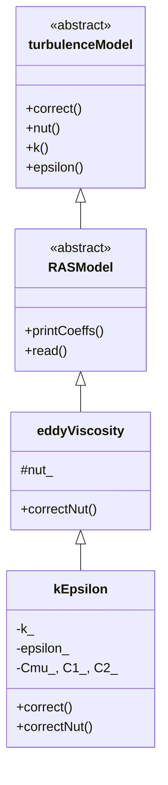

# kEpsilon Model Anatomy

ผ่าโค้ด Turbulence Model — เข้าใจ RTS และ Transport Equations

---

## Overview

> **เป้าหมาย:** เข้าใจว่า Turbulence Model ถูก implement อย่างไร
>
> ครอบคลุม: Class hierarchy, RTS registration, Transport equations

<!-- IMAGE: IMG_10_005 -->
<!--
Purpose: เพื่อแสดง Energy Cascade ใน Turbulent Flow และความสัมพันธ์ระหว่าง k และ ε
Prompt: "Artistic visualization of the Turbulent Energy Cascade. **Main Visual:** A fluid stream starting as large, swirling orange vortices on the left (Integral Scale), breaking down into smaller and smaller eddies, turning into fine blue noise on the right (Kolmogorov Scale). **Overlay Graph:** A semi-transparent line graph of Energy Spectrum E(κ) vs Wave Number κ (log-log) superimposed on the flow. Slope -5/3 indicated. **Annotations:** Arrows showing 'Energy Production' at large scales and 'Dissipation to Heat' at small scales. **Style:** Fusion of fluid simulation render and scientific graph, cinematic lighting, orange-to-blue gradient."
-->


---

## Mathematical Derivation: From RANS to k-ε

> **ทำไมเราถึงต้องการ k-ε model?** — Derivation เต็มรูปแบบ

### Step 1: Reynolds-Averaged Navier-Stokes (RANS)

เริ่มจาก incompressible Navier-Stokes:

$$\frac{\partial U_i}{\partial t} + U_j \frac{\partial U_i}{\partial x_j} = -\frac{1}{\rho}\frac{\partial p}{\partial x_i} + \nu \frac{\partial^2 U_i}{\partial x_j \partial x_j}$$

แยก velocity เป็นส่วน **mean** และ **fluctuating**:

$$U_i = \underbrace{\overline{U}_i}_{\text{mean}} + \underbrace{u'_i}_{\text{fluctuation}}$$

Average สมการ (Reynolds averaging):

$$\frac{\partial \overline{U}_i}{\partial t} + \overline{U}_j \frac{\partial \overline{U}_i}{\partial x_j} = -\frac{1}{\rho}\frac{\partial \overline{p}}{\partial x_i} + \nu \frac{\partial^2 \overline{U}_i}{\partial x_j \partial x_j} \underbrace{- \frac{\partial}{\partial x_j}(\overline{u'_i u'_j})}_{\text{Reynolds stress } \tau_{ij}^{turb}}$$

> **Key insight:** Turbulence ปรากฏเป็น **Reynolds stress term** $-\rho \overline{u'_i u'_j}$

---

### Step 2: Closure Problem

**ปัญหา:** มี 4 unknowns แต่มีแค่ 3 equations!

| Unknowns | Equations |
|:---|:---|
| $\overline{U}_1, \overline{U}_2, \overline{U}_3, \overline{p}$ (4) | 3 momentum + 1 continuity (4) |
| $\overline{u'_1 u'_1}, \overline{u'_1 u'_2}, \dots$ (6) | ❌ No equations! |

**ต้องการ:** Model สำหรับ Reynolds stress $\tau_{ij}^{turb} = -\rho \overline{u'_i u'_j}$

---

### Step 3: Eddy Viscosity Hypothesis (Boussinesq, 1877)

สมมติว่า turbulence ทำตัวเหมือน viscous effect:

$$\tau_{ij}^{turb} = \mu_t \left( \frac{\partial \overline{U}_i}{\partial x_j} + \frac{\partial \overline{U}_j}{\partial x_i} \right) - \frac{2}{3}\rho k \delta_{ij}$$

หรือในรูปแบบ kinematic viscosity:

$$-\overline{u'_i u'_j} = \nu_t \left( \frac{\partial \overline{U}_i}{\partial x_j} + \frac{\partial \overline{U}_j}{\partial x_i} \right) - \frac{2}{3}k \delta_{ij}$$

**ตอนนี้ปัญหาเปลี่ยนเป็น:** จะหา $\nu_t$ ได้อย่างไร?

---

### Step 4: Dimensional Analysis for νₜ

จาก dimensional consistency:

$$[\nu_t] = \frac{L^2}{T} \quad \text{(same as kinematic viscosity)}$$

Turbulence quantities ที่เกี่ยวข้อง:
- **TKE:** $k = \frac{1}{2}\overline{u'_i u'_i}$ → $[k] = \frac{L^2}{T^2}$
- **Dissipation:** $\varepsilon$ → $[\varepsilon] = \frac{L^2}{T^3}$

สร้าง $\nu_t$ จาก $k$ และ $\varepsilon$:

$$\nu_t \sim k^a \varepsilon^b$$

$$[\nu_t] = \left(\frac{L^2}{T^2}\right)^a \left(\frac{L^2}{T^3}\right)^b = \frac{L^{2a+2b}}{T^{2a+3b}}$$

Match dimensions:
- $L: 2a + 2b = 2$ → $a + b = 1$
- $T: 2a + 3b = 1$

Solve:
- $a = 2, b = -1$ ❌ (Negative exponent?)
- Wait... ต้องใช้ $\varepsilon$ ใน denominator!

$$\nu_t \sim \frac{k^a}{\varepsilon^b}$$

$$[\nu_t] = \frac{L^{2a}}{T^{2a}} \cdot \frac{T^{3b}}{L^{2b}} = \frac{L^{2a-2b}}{T^{2a-3b}}$$

Match dimensions:
- $L: 2a - 2b = 2$ → $a - b = 1$
- $T: 2a - 3b = 1$

Solve: **$a = 2, b = 1$**

$$\boxed{\nu_t = C_\mu \frac{k^2}{\varepsilon}}$$

$C_\mu$ คือ empirical constant (≈ 0.09)

---

### Step 5: Transport Equation for k (TKE)

พิสูจน์จาก exact Navier-Stokes (ละเอียดมาก!):

$$\frac{\partial k}{\partial t} + \overline{U}_j \frac{\partial k}{\partial x_j} = \underbrace{-\overline{u'_i u'_j} \frac{\partial \overline{U}_i}{\partial x_j}}_{P_k \text{ (Production)}} + \underbrace{\frac{\partial}{\partial x_j}\left[ \left(\nu + \frac{\nu_t}{\sigma_k}\right) \frac{\partial k}{\partial x_j} \right]}_{D_k \text{ (Diffusion)}} - \underbrace{\varepsilon}_{\Phi_k \text{ (Dissipation)}}$$

**Physical meaning of each term:**

| Term | ความหมาย | เครื่องหมาย |
|:---|:---|:---|
| $\frac{\partial k}{\partial t}$ | อัตราการเปลี่ยนแปลง | - |
| $\overline{U}_j \frac{\partial k}{\partial x_j}$ | Convection โดย mean flow | - |
| $P_k = -\overline{u'_i u'_j} \frac{\partial \overline{U}_i}{\partial x_j}$ | **Production** (mean shear → TKE) | ✚ Positive |
| $D_k$ | **Diffusion** (gradient transport) | ± |
| $\varepsilon$ | **Dissipation** (TKE → ความร้อน) | ➖ Negative |

> **Intuition:** พลังงานไหลจาก Mean Flow → Turbulence → ความร้อน

---

### Step 6: Transport Equation for ε (Dissipation)

Model (ไม่ใช่ exact equation):

$$\frac{\partial \varepsilon}{\partial t} + \overline{U}_j \frac{\partial \varepsilon}{\partial x_j} = \underbrace{C_{1\varepsilon} \frac{\varepsilon}{k} P_k}_{P_\varepsilon \text{ (Production)}} + \underbrace{\frac{\partial}{\partial x_j}\left[ \left(\nu + \frac{\nu_t}{\sigma_\varepsilon}\right) \frac{\partial \varepsilon}{\partial x_j} \right]}_{D_\varepsilon \text{ (Diffusion)}} - \underbrace{C_{2\varepsilon} \frac{\varepsilon^2}{k}}_{\Phi_\varepsilon \text{ (Destruction)}}$$

**Physical intuition:**
- **Production:** Proportional กับ $\frac{\varepsilon}{k} P_k$ → dissipation ตามติด production
- **Destruction:** $\propto \varepsilon^2/k$ → nonlinear decay

---

### Step 7: Model Constants

ค่า Empirical จาก experiments และ fitting:

| Constant | ค่า | ที่มา |
|:---|:---:|:---|
| $C_\mu$ | 0.09 | Log-law compliance |
| $C_{1\varepsilon}$ | 1.44 | Decay of grid turbulence |
| $C_{2\varepsilon}$ | 1.92 | Equilibrium shear flow |
| $\sigma_k$ | 1.0 | Turbulent diffusivity |
| $\sigma_\varepsilon$ | 1.3 | Turbulent diffusivity |

---

### Summary: From Physics to Code

```
Physical Problem (RANS)      →  Closure Problem (Reynolds stress)
                               ↓
                         Boussinesq Hypothesis (νₜ)
                               ↓
              Dimensional Analysis (k²/ε)
                               ↓
                 Transport Equations (k, ε)
                               ↓
            Discretization (fvm::ddt, div, laplacian)
                               ↓
              OpenFOAM Implementation (kEpsilon.C)
```

---

## Source Location

```bash
$FOAM_SRC/TurbulenceModels/turbulenceModels/RAS/kEpsilon/kEpsilon.C
$FOAM_SRC/TurbulenceModels/turbulenceModels/RAS/kEpsilon/kEpsilon.H
```

---

## Class Hierarchy



---

## Header File (kEpsilon.H)

```cpp
namespace Foam
{
namespace RASModels
{

template<class BasicTurbulenceModel>
class kEpsilon
:
    public eddyViscosity<RASModel<BasicTurbulenceModel>>
{
protected:
    // --- Model Coefficients ---
    dimensionedScalar Cmu_;
    dimensionedScalar C1_;
    dimensionedScalar C2_;
    dimensionedScalar sigmak_;
    dimensionedScalar sigmaEps_;

    // --- Fields ---
    volScalarField k_;
    volScalarField epsilon_;

    // --- Protected Methods ---
    virtual void correctNut();
    virtual tmp<fvScalarMatrix> kSource() const;
    virtual tmp<fvScalarMatrix> epsilonSource() const;

public:
    // --- Type Name for RTS ---
    TypeName("kEpsilon");

    // --- Constructors ---
    kEpsilon
    (
        const alphaField& alpha,
        const rhoField& rho,
        const volVectorField& U,
        const surfaceScalarField& alphaRhoPhi,
        const surfaceScalarField& phi,
        const transportModel& transport,
        const word& propertiesName = turbulencePropertiesName,
        const word& type = typeName
    );

    // --- Selectors ---
    virtual ~kEpsilon() = default;

    // --- Access ---
    virtual tmp<volScalarField> k() const { return k_; }
    virtual tmp<volScalarField> epsilon() const { return epsilon_; }

    // --- Solve ---
    virtual void correct();
};

} // End namespace RASModels
} // End namespace Foam
```

---

## RTS Registration (The Magic!)

```cpp
// kEpsilon.C

#include "kEpsilon.H"
#include "addToRunTimeSelectionTable.H"

namespace Foam
{
namespace RASModels
{

// Define the type name
defineTypeNameAndDebug(kEpsilon, 0);

// Add to run-time selection table
addToRunTimeSelectionTable
(
    RASModel,           // Base class
    kEpsilon,           // This class
    dictionary          // Constructor signature
);

}
}
```

> [!IMPORTANT]
> **บรรทัดนี้คือ "มนต์ดำ"!**
> 
> `addToRunTimeSelectionTable` ทำให้:
> - String "kEpsilon" ใน dictionary → map ไปที่ constructor
> - ไม่ต้องแก้โค้ด solver เมื่อเพิ่ม model ใหม่

---

## Constructor

```cpp
template<class BasicTurbulenceModel>
kEpsilon<BasicTurbulenceModel>::kEpsilon
(
    const alphaField& alpha,
    const rhoField& rho,
    const volVectorField& U,
    const surfaceScalarField& alphaRhoPhi,
    const surfaceScalarField& phi,
    const transportModel& transport,
    const word& propertiesName,
    const word& type
)
:
    eddyViscosity<RASModel<BasicTurbulenceModel>>
    (
        type, alpha, rho, U, alphaRhoPhi, phi, transport, propertiesName
    ),

    Cmu_
    (
        dimensioned<scalar>::getOrAddToDict("Cmu", coeffDict_, 0.09)
    ),
    C1_
    (
        dimensioned<scalar>::getOrAddToDict("C1", coeffDict_, 1.44)
    ),
    C2_
    (
        dimensioned<scalar>::getOrAddToDict("C2", coeffDict_, 1.92)
    ),
    sigmak_
    (
        dimensioned<scalar>::getOrAddToDict("sigmak", coeffDict_, 1.0)
    ),
    sigmaEps_
    (
        dimensioned<scalar>::getOrAddToDict("sigmaEps", coeffDict_, 1.3)
    ),

    k_
    (
        IOobject
        (
            IOobject::groupName("k", alphaRhoPhi.group()),
            runTime_.timeName(),
            mesh_,
            IOobject::MUST_READ,
            IOobject::AUTO_WRITE
        ),
        mesh_
    ),
    epsilon_
    (
        IOobject
        (
            IOobject::groupName("epsilon", alphaRhoPhi.group()),
            runTime_.timeName(),
            mesh_,
            IOobject::MUST_READ,
            IOobject::AUTO_WRITE
        ),
        mesh_
    )
{
    bound(k_, kMin_);
    bound(epsilon_, epsilonMin_);

    if (type == typeName)
    {
        printCoeffs(type);
    }
}
```

> [!NOTE]
> **`getOrAddToDict`:** อ่านค่าจาก dictionary หรือใช้ default ถ้าไม่มี

---

## The correct() Method — Transport Equations

```cpp
template<class BasicTurbulenceModel>
void kEpsilon<BasicTurbulenceModel>::correct()
{
    if (!turbulence_)
    {
        return;
    }

    // Call base class correct()
    eddyViscosity<RASModel<BasicTurbulenceModel>>::correct();

    // Calculate production term
    tmp<volScalarField> tG = GName();
    const volScalarField& G = tG();

    // Calc effective diffusivity
    volScalarField DkEff(nuEff()/sigmak_);
    volScalarField DepsilonEff(nuEff()/sigmaEps_);

    // --- Dissipation (epsilon) equation ---
    tmp<fvScalarMatrix> epsEqn
    (
        fvm::ddt(alpha_, rho_, epsilon_)
      + fvm::div(alphaRhoPhi_, epsilon_)
      - fvm::laplacian(alpha_*rho_*DepsilonEff, epsilon_)
     ==
        C1_*alpha_*rho_*G*epsilon_/k_              // Production
      - fvm::Sp(C2_*alpha_*rho_*epsilon_/k_, epsilon_)  // Destruction
      + epsilonSource()
    );

    epsEqn.ref().relax();
    fvConstraints_.constrain(epsEqn.ref());
    epsEqn.ref().boundaryManipulate(epsilon_.boundaryFieldRef());
    solve(epsEqn);
    fvConstraints_.constrain(epsilon_);
    bound(epsilon_, epsilonMin_);

    // --- Turbulent kinetic energy (k) equation ---
    tmp<fvScalarMatrix> kEqn
    (
        fvm::ddt(alpha_, rho_, k_)
      + fvm::div(alphaRhoPhi_, k_)
      - fvm::laplacian(alpha_*rho_*DkEff, k_)
     ==
        alpha_*rho_*G                              // Production
      - fvm::Sp(alpha_*rho_*epsilon_/k_, k_)       // Destruction
      + kSource()
    );

    kEqn.ref().relax();
    fvConstraints_.constrain(kEqn.ref());
    solve(kEqn);
    fvConstraints_.constrain(k_);
    bound(k_, kMin_);

    // Update eddy viscosity
    correctNut();
}
```

<!-- IMAGE: IMG_10_006 -->
<!--
Purpose: เพื่อแสดง Physical Meaning ของแต่ละ Term ใน k-ε Transport Equation
Prompt: "Anatomy of the k-epsilon Transport Equations. **Layout:** Two large, clear equation blocks. **Top Block (k-Equation):** The equation 'Dk/Dt = P_k - ε + div(D_k)'. Arrows pointing to terms with icons: 'Production' (Gear/Engine), 'Dissipation' (Heat/Fire), 'Diffusion' (Spreading mist). **Bottom Block (ε-Equation):** The equation for dissipation rate. Similar icons. **Visual Flow:** A connecting pipe showing 'Energy' flowing from Mean Flow → Production → k → Dissipation → Heat. **Style:** Clean modern infographic, large typography, icon-based term explanation, dark blue background with bright accents."
-->


---

## Understanding fvm::Sp vs fvm::SuSp

```cpp
// Destruction term in k equation
- fvm::Sp(alpha_*rho_*epsilon_/k_, k_)

// NOT:
// - alpha_*rho_*epsilon_  // This would be explicit
```

| Method | Meaning | When to use |
|:---|:---|:---|
| `fvm::Sp(coeff, k)` | Add `coeff` to diagonal | Destruction (negative source) |
| `fvm::SuSp(coeff, k)` | Split based on sign | Mixed source |
| Explicit term | Add to RHS | Production (positive source) |

> [!TIP]
> **Rule:** ถ้า coefficient เป็น negative → ใช้ `fvm::Sp` เพื่อ numerical stability

---

## correctNut() — Update Eddy Viscosity

```cpp
template<class BasicTurbulenceModel>
void kEpsilon<BasicTurbulenceModel>::correctNut()
{
    nut_ = Cmu_*sqr(k_)/epsilon_;
    nut_.correctBoundaryConditions();
}
```

$$\nu_t = C_\mu \frac{k^2}{\epsilon}$$

---

## Configuration (turbulenceProperties)

```cpp
// constant/turbulenceProperties
simulationType RAS;

RAS
{
    model           kEpsilon;

    turbulence      on;
    printCoeffs     on;

    kEpsilonCoeffs
    {
        Cmu         0.09;
        C1          1.44;
        C2          1.92;
        sigmak      1.0;
        sigmaEps    1.3;
    }
}
```

---

## Near-Wall Treatment

> **k-ε model ไม่ valid ใกล้ผนัง!** — ต้องใช้ wall functions

### The Problem: y⁺ and Viscous Sublayer

<!-- IMAGE: IMG_10_007 -->
<!--
Purpose: เพื่อแสดง Near-Wall Treatment และ Boundary Layers ใน Turbulent Flow
Prompt: "Detailed Turbulent Boundary Layer Diagram. **Plot:** Semi-log graph of u+ vs y+. **Regions:** Clearly shaded vertical zones: 'Viscous Sublayer' (Linear, y+ < 5), 'Buffer Layer' (Curved), 'Log-law Region' (Straight line). **Schematic:** Below the graph, a physical cross-section of flow near a wall. Tiny eddies near the wall, growing larger away from it. **Annotations:** Equations for each region (u+=y+, Log law). **Style:** Textbook illustration, precise plotting, clear region boundaries, white background."
-->


**ทำไมต้องใช้ wall functions?**
- k-ε model สมมติ **high Reynolds number**
- ใกล้ผนัง: viscous effects dominate, turbulence ถูก damp
- การ resolve viscous sublayer ต้องใช้ **mesh ละเอียดมาก** (y⁺ < 1)

**Wall function approach:**
- **ไม่ต้อง resolve** viscous sublayer
- ใช้ **empirical correlations** ที่ y⁺ ≈ 30-100
- mesh หยาบกว่าได้

### Boundary Conditions for k-ε

| Variable | At wall | At inlet | At outlet |
|:---|:---|:---|:---|
| **k** | `kqRWallFunction` or fixedGradient (0) | turbulentIntensityKineticEnergy | zeroGradient |
| **ε** | `epsilonWallFunction` | mixingLengthDissipationRate | zeroGradient |
| **νₜ** | calculated from k, ε | calculated | calculated |

**Example wall function (0/k):**
```cpp
// 0/k
boundaryField
{
    wall
    {
        type            compressible::kqRWallFunction;
        value           uniform 0;  // k = 0 at wall (no fluctuations)
    }
}
```

---

## Concept Check

<details>
<summary><b>1. `fvm::Sp` vs `fvm::SuSp` ต่างกันอย่างไร?</b></summary>

**`fvm::Sp(coeff, field)`:**
- เพิ่ม `coeff` เข้า diagonal โดยตรง
- ใช้เมื่อ `coeff` เป็น **negative** (destruction)

**`fvm::SuSp(coeff, field)`:**
- ถ้า `coeff > 0`: explicit (add to RHS)
- ถ้า `coeff < 0`: implicit (add to diagonal)
- ใช้เมื่อ sign ของ `coeff` อาจเปลี่ยน
</details>

<details>
<summary><b>2. ทำไม Production term ใช้ `==` (RHS) ไม่ใช่ `+` (LHS)?</b></summary>

Production ($G$) คือ **source** ที่:
- มีค่า **positive** เสมอ
- คำนวณจาก field ที่รู้ค่าแล้ว (strain rate)

การใส่ไว้ RHS (explicit) ทำให้:
- ไม่กระทบ matrix structure
- คำนวณได้ง่าย

ถ้าใส่ LHS จะต้อง linearize → ซับซ้อนขึ้นโดยไม่มีประโยชน์
</details>

<details>
<summary><b>3. `addToRunTimeSelectionTable` ทำงานอย่างไร?</b></summary>

1. **Macro Expansion:** สร้าง static object ที่ register ตัวเองตอน load
2. **Hash Table:** ชื่อ "kEpsilon" → func pointer ไปที่ constructor
3. **Lookup:** `RASModel::New()` อ่าน dict, ค้น hash table, เรียก constructor

```cpp
// Simplified pseudo-code
HashTable<constructorPtr> RASModel::constructorTable;

// At load time (static initialization)
registerModel("kEpsilon", &kEpsilon::New);

// At runtime
model = constructorTable["kEpsilon"](args...);
```
</details>

---

## Exercise

1. **Add Custom Model:** สร้าง `myKEpsilon` ที่ใช้ค่า Cmu ต่างจากเดิม
2. **Debug k Equation:** ใส่ `Info` เพื่อ print ค่า G ทุก iteration
3. **Trace RTS:** ใช้ debugger หา `constructorTable`

---

## เอกสารที่เกี่ยวข้อง

- **ก่อนหน้า:** [simpleFoam Walkthrough](02_simpleFoam_Walkthrough.md)
- **ถัดไป:** [fvMatrix Deep Dive](04_fvMatrix_Deep_Dive.md)
