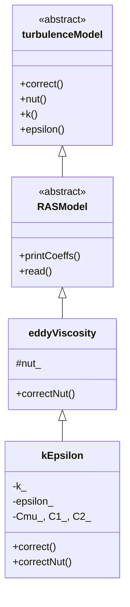

# k-Epsilon Model Anatomy

> **Difficulty:** Intermediate | **Time:** ~45 minutes

---

## Overview

> **Learning Goal:** Understand how OpenFOAM implements the standard k-ε turbulence model through Runtime Selection (RTS), transport equations, and wall boundary treatments.

**What you'll learn:**
- **Mathematical Foundation:** Complete derivation from RANS equations to k-ε closure
- **Implementation Details:** How transport equations map to OpenFOAM code
- **Runtime Selection:** The magic behind `addToRunTimeSelectionTable`
- **Near-Wall Treatment:** Why wall functions are necessary for k-ε models
- **Code Organization:** Class hierarchy and file structure

**Scope:** Class hierarchy, RTS registration, transport equations implementation, boundary conditions

**Prerequisites:**
- RANS (Reynolds-Averaged Navier-Stokes) fundamentals
- Understanding of turbulence modeling closure problem
- Basic C++ templates and inheritance
- OpenFOAM field types (volScalarField, surfaceScalarField)
- Finite Volume Method (discretization operators: fvm::ddt, div, laplacian)

---

## Learning Objectives

By the end of this document, you will be able to:

1. **Derive** the k-ε transport equations from RANS closure principles
2. **Map** each mathematical term to its OpenFOAM implementation line
3. **Explain** how Runtime Selection enables plug-and-play turbulence models
4. **Choose** appropriate boundary conditions for k and ε at walls
5. **Modify** the k-ε model implementation for custom applications

---

## Related Files

- **Previous:** [simpleFoam Walkthrough](../02_CODE_ANATOMY/02_simpleFoam_Walkthrough.md) — See how turbulence models integrate into RANS solvers
- **Next:** [fvMatrix Deep Dive](../02_CODE_ANATOMY/04_fvMatrix_Deep_Dive.md) — Deep dive into linear system assembly
- **Cross-Reference:** [Population Balance Modeling](../../../MODULE_06_ADVANCED_PHYSICS/CONTENT/01_COMPLEX_MULTIPHASE_PHENOMENA/03_Population_Balance_Modeling.md) — Compare transport equation structure

---

## Mathematical Derivation: From RANS to k-ε

> **Why do we need the k-ε model?** — Complete derivation from first principles

### Step 1: Reynolds-Averaged Navier-Stokes (RANS)

Start with incompressible Navier-Stokes:

$$\frac{\partial U_i}{\partial t} + U_j \frac{\partial U_i}{\partial x_j} = -\frac{1}{\rho}\frac{\partial p}{\partial x_i} + \nu \frac{\partial^2 U_i}{\partial x_j \partial x_j}$$

Decompose velocity into **mean** and **fluctuating** components:

$$U_i = \underbrace{\overline{U}_i}_{\text{mean}} + \underbrace{u'_i}_{\text{fluctuation}}$$

Apply Reynolds averaging:

$$\frac{\partial \overline{U}_i}{\partial t} + \overline{U}_j \frac{\partial \overline{U}_i}{\partial x_j} = -\frac{1}{\rho}\frac{\partial \overline{p}}{\partial x_i} + \nu \frac{\partial^2 \overline{U}_i}{\partial x_j \partial x_j} \underbrace{- \frac{\partial}{\partial x_j}(\overline{u'_i u'_j})}_{\text{Reynolds stress } \tau_{ij}^{turb}}$$

> **Key insight:** Turbulence appears as the **Reynolds stress term** $-\rho \overline{u'_i u'_j}$

---

### Step 2: Closure Problem

**Problem:** We have more unknowns than equations!

| Unknowns | Equations |
|:---|:---|
| $\overline{U}_1, \overline{U}_2, \overline{U}_3, \overline{p}$ (4) | 3 momentum + 1 continuity (4) |
| $\overline{u'_1 u'_1}, \overline{u'_1 u'_2}, \dots$ (6) | ❌ No equations! |

**Required:** A model for Reynolds stress $\tau_{ij}^{turb} = -\rho \overline{u'_i u'_j}$

---

### Step 3: Eddy Viscosity Hypothesis (Boussinesq, 1877)

Assume turbulence behaves like a viscous effect:

$$\tau_{ij}^{turb} = \mu_t \left( \frac{\partial \overline{U}_i}{\partial x_j} + \frac{\partial \overline{U}_j}{\partial x_i} \right) - \frac{2}{3}\rho k \delta_{ij}$$

Or in kinematic viscosity form:

$$-\overline{u'_i u'_j} = \nu_t \left( \frac{\partial \overline{U}_i}{\partial x_j} + \frac{\partial \overline{U}_j}{\partial x_i} \right) - \frac{2}{3}k \delta_{ij}$$

**Now the problem becomes:** How to determine $\nu_t$?

---

### Step 4: Dimensional Analysis for νₜ

From dimensional consistency:

$$[\nu_t] = \frac{L^2}{T} \quad \text{(same as kinematic viscosity)}$$

Relevant turbulence quantities:
- **TKE:** $k = \frac{1}{2}\overline{u'_i u'_i}$ → $[k] = \frac{L^2}{T^2}$
- **Dissipation:** $\varepsilon$ → $[\varepsilon] = \frac{L^2}{T^3}$

Construct $\nu_t$ from $k$ and $\varepsilon$:

$$\nu_t \sim \frac{k^a}{\varepsilon^b}$$

$$[\nu_t] = \frac{L^{2a}}{T^{2a}} \cdot \frac{T^{3b}}{L^{2b}} = \frac{L^{2a-2b}}{T^{2a-3b}}$$

Match dimensions:
- $L: 2a - 2b = 2$ → $a - b = 1$
- $T: 2a - 3b = 1$

Solve: **$a = 2, b = 1$**

$$\boxed{\nu_t = C_\mu \frac{k^2}{\varepsilon}}$$

$C_\mu$ is an empirical constant (≈ 0.09)

---

### Step 5: Transport Equation for k (TKE)

Derived from exact Navier-Stokes manipulation:

$$\frac{\partial k}{\partial t} + \overline{U}_j \frac{\partial k}{\partial x_j} = \underbrace{-\overline{u'_i u'_j} \frac{\partial \overline{U}_i}{\partial x_j}}_{P_k \text{ (Production)}} + \underbrace{\frac{\partial}{\partial x_j}\left[ \left(\nu + \frac{\nu_t}{\sigma_k}\right) \frac{\partial k}{\partial x_j} \right]}_{D_k \text{ (Diffusion)}} - \underbrace{\varepsilon}_{\Phi_k \text{ (Dissipation)}}$$

**Physical meaning of each term:**

| Term | Physical Meaning | Sign |
|:---|:---|:---|
| $\frac{\partial k}{\partial t}$ | Rate of change | - |
| $\overline{U}_j \frac{\partial k}{\partial x_j}$ | Convection by mean flow | - |
| $P_k = -\overline{u'_i u'_j} \frac{\partial \overline{U}_i}{\partial x_j}$ | **Production** (mean shear → TKE) | ✚ Positive |
| $D_k$ | **Diffusion** (gradient transport) | ± |
| $\varepsilon$ | **Dissipation** (TKE → heat) | ➖ Negative |

> **Intuition:** Energy flows: Mean Flow → Turbulence → Heat

---

### Step 6: Transport Equation for ε (Dissipation)

Modeled equation (not exact):

$$\frac{\partial \varepsilon}{\partial t} + \overline{U}_j \frac{\partial \varepsilon}{\partial x_j} = \underbrace{C_{1\varepsilon} \frac{\varepsilon}{k} P_k}_{P_\varepsilon \text{ (Production)}} + \underbrace{\frac{\partial}{\partial x_j}\left[ \left(\nu + \frac{\nu_t}{\sigma_\varepsilon}\right) \frac{\partial \varepsilon}{\partial x_j} \right]}_{D_\varepsilon \text{ (Diffusion)}} - \underbrace{C_{2\varepsilon} \frac{\varepsilon^2}{k}}_{\Phi_\varepsilon \text{ (Destruction)}}$$

**Physical intuition:**
- **Production:** Proportional to $\frac{\varepsilon}{k} P_k$ → dissipation follows production
- **Destruction:** $\propto \varepsilon^2/k$ → nonlinear decay

---

### Step 7: Model Constants

Empirical values from experiments and fitting:

| Constant | Value | Source |
|:---|:---:|:---|
| $C_\mu$ | 0.09 | Log-law compliance |
| $C_{1\varepsilon}$ | 1.44 | Decay of grid turbulence |
| $C_{2\varepsilon}$ | 1.92 | Equilibrium shear flow |
| $\sigma_k$ | 1.0 | Turbulent diffusivity |
| $\sigma_\varepsilon$ | 1.3 | Turbulent diffusivity |

---

### Summary: From Physics to Code

```
Physical Problem (RANS)      →  Closure Problem (Reynolds stress)
                               ↓
                         Boussinesq Hypothesis (νₜ)
                               ↓
              Dimensional Analysis (k²/ε)
                               ↓
                 Transport Equations (k, ε)
                               ↓
            Discretization (fvm::ddt, div, laplacian)
                               ↓
              OpenFOAM Implementation (kEpsilon.C)
```

<!-- IMAGE: IMG_10_005 -->
<!--
Purpose: Visualize the Energy Cascade in Turbulent Flow and the relationship between k and ε
Prompt: "Artistic visualization of the Turbulent Energy Cascade. **Main Visual:** A fluid stream starting as large, swirling orange vortices on the left (Integral Scale), breaking down into smaller and smaller eddies, turning into fine blue noise on the right (Kolmogorov Scale). **Overlay Graph:** A semi-transparent line graph of Energy Spectrum E(κ) vs Wave Number κ (log-log) superimposed on the flow. Slope -5/3 indicated. **Annotations:** Arrows showing 'Energy Production' at large scales and 'Dissipation to Heat' at small scales. **Style:** Fusion of fluid simulation render and scientific graph, cinematic lighting, orange-to-blue gradient."
-->


---

## Implementation Mapping: Equations to Code

> **How the math maps line-by-line to the implementation**

### k-Equation Mapping

| Mathematical Term | Code Line | Explanation |
|:---|:---:|:---|
| $\frac{\partial k}{\partial t}$ | `fvm::ddt(alpha_, rho_, k_)` | Transient term |
| $\overline{U}_j \frac{\partial k}{\partial x_j}$ | `fvm::div(alphaRhoPhi_, k_)` | Convection |
| $\frac{\partial}{\partial x_j}\left[ \left(\nu + \frac{\nu_t}{\sigma_k}\right) \frac{\partial k}{\partial x_j} \right]$ | `- fvm::laplacian(alpha_*rho_*DkEff, k_)` | Diffusion |
| $P_k$ | `alpha_*rho_*G` | Production (explicit RHS) |
| $-\varepsilon$ | `- fvm::Sp(alpha_*rho_*epsilon_/k_, k_)` | Destruction (implicit) |

### ε-Equation Mapping

| Mathematical Term | Code Line | Explanation |
|:---|:---:|:---|
| $\frac{\partial \varepsilon}{\partial t}$ | `fvm::ddt(alpha_, rho_, epsilon_)` | Transient term |
| $\overline{U}_j \frac{\partial \varepsilon}{\partial x_j}$ | `fvm::div(alphaRhoPhi_, epsilon_)` | Convection |
| $\frac{\partial}{\partial x_j}\left[ \left(\nu + \frac{\nu_t}{\sigma_\varepsilon}\right) \frac{\partial \varepsilon}{\partial x_j} \right]$ | `- fvm::laplacian(alpha_*rho_*DepsilonEff, epsilon_)` | Diffusion |
| $C_{1\varepsilon} \frac{\varepsilon}{k} P_k$ | `C1_*alpha_*rho_*G*epsilon_/k_` | Production |
| $-C_{2\varepsilon} \frac{\varepsilon^2}{k}$ | `- fvm::Sp(C2_*alpha_*rho_*epsilon_/k_, epsilon_)` | Destruction |

> **Key pattern:** Positive production → explicit RHS; Negative destruction → implicit diagonal

---

## Source Location

```bash
$FOAM_SRC/TurbulenceModels/turbulenceModels/RAS/kEpsilon/kEpsilon.C
$FOAM_SRC/TurbulenceModels/turbulenceModels/RAS/kEpsilon/kEpsilon.H
```

**To navigate with IDE support:**
```bash
# Generate compile_commands.json for code navigation
cd $WM_PROJECT_USER_DIR
wmake -all -j | bear
```

---

## Class Hierarchy



**Design pattern:** Template inheritance enables compile-time polymorphism for incompressible/compressible variants

---

## Header File (kEpsilon.H)

```cpp
namespace Foam
{
namespace RASModels
{

template<class BasicTurbulenceModel>
class kEpsilon
:
    public eddyViscosity<RASModel<BasicTurbulenceModel>>
{
protected:
    // --- Model Coefficients ---
    dimensionedScalar Cmu_;
    dimensionedScalar C1_;
    dimensionedScalar C2_;
    dimensionedScalar sigmak_;
    dimensionedScalar sigmaEps_;

    // --- Fields ---
    volScalarField k_;
    volScalarField epsilon_;

    // --- Protected Methods ---
    virtual void correctNut();
    virtual tmp<fvScalarMatrix> kSource() const;
    virtual tmp<fvScalarMatrix> epsilonSource() const;

public:
    // --- Type Name for RTS ---
    TypeName("kEpsilon");

    // --- Constructors ---
    kEpsilon
    (
        const alphaField& alpha,
        const rhoField& rho,
        const volVectorField& U,
        const surfaceScalarField& alphaRhoPhi,
        const surfaceScalarField& phi,
        const transportModel& transport,
        const word& propertiesName = turbulencePropertiesName,
        const word& type = typeName
    );

    // --- Selectors ---
    virtual ~kEpsilon() = default;

    // --- Access ---
    virtual tmp<volScalarField> k() const { return k_; }
    virtual tmp<volScalarField> epsilon() const { return epsilon_; }

    // --- Solve ---
    virtual void correct();
};

} // End namespace RASModels
} // End namespace Foam
```

**Key members:**
- `k_`, `epsilon_`: Transported fields
- `Cmu_`, `C1_`, `C2_`, etc.: Model coefficients from dictionary
- `correctNut()`: Updates νₜ = Cμ·k²/ε
- `TypeName("kEpsilon")`: Enables Runtime Selection

---

## Runtime Selection (RTS) Registration

```cpp
// kEpsilon.C

#include "kEpsilon.H"
#include "addToRunTimeSelectionTable.H"

namespace Foam
{
namespace RASModels
{

// Define the type name
defineTypeNameAndDebug(kEpsilon, 0);

// Add to run-time selection table
addToRunTimeSelectionTable
(
    RASModel,           // Base class
    kEpsilon,           // This class
    dictionary          // Constructor signature
);

}
}
```

> [!IMPORTANT]
> **This is the "magic" line!**
> 
> `addToRunTimeSelectionTable` enables:
> - String "kEpsilon" in dictionary → map to constructor
> - No solver code changes when adding new models

**How RTS works internally:**
```cpp
// Pseudo-code representation
class RASModel {
    static HashTable<constructorPtr> constructorTable_;
};

// At library load time (static initialization)
constructorTable_["kEpsilon"] = &kEpsilon::New;

// At runtime (simpleFoam reads dict)
auto model = RASModel::New(mesh);  // Looks up "kEpsilon"
```

---

## Constructor

```cpp
template<class BasicTurbulenceModel>
kEpsilon<BasicTurbulenceModel>::kEpsilon
(
    const alphaField& alpha,
    const rhoField& rho,
    const volVectorField& U,
    const surfaceScalarField& alphaRhoPhi,
    const surfaceScalarField& phi,
    const transportModel& transport,
    const word& propertiesName,
    const word& type
)
:
    eddyViscosity<RASModel<BasicTurbulenceModel>>
    (
        type, alpha, rho, U, alphaRhoPhi, phi, transport, propertiesName
    ),

    // Read coefficients from dict (with defaults)
    Cmu_
    (
        dimensioned<scalar>::getOrAddToDict("Cmu", coeffDict_, 0.09)
    ),
    C1_
    (
        dimensioned<scalar>::getOrAddToDict("C1", coeffDict_, 1.44)
    ),
    C2_
    (
        dimensioned<scalar>::getOrAddToDict("C2", coeffDict_, 1.92)
    ),
    sigmak_
    (
        dimensioned<scalar>::getOrAddToDict("sigmak", coeffDict_, 1.0)
    ),
    sigmaEps_
    (
        dimensioned<scalar>::getOrAddToDict("sigmaEps", coeffDict_, 1.3)
    ),

    // Initialize k field
    k_
    (
        IOobject
        (
            IOobject::groupName("k", alphaRhoPhi.group()),
            runTime_.timeName(),
            mesh_,
            IOobject::MUST_READ,
            IOobject::AUTO_WRITE
        ),
        mesh_
    ),
    // Initialize epsilon field
    epsilon_
    (
        IOobject
        (
            IOobject::groupName("epsilon", alphaRhoPhi.group()),
            runTime_.timeName(),
            mesh_,
            IOobject::MUST_READ,
            IOobject::AUTO_WRITE
        ),
        mesh_
    )
{
    // Apply bounds for numerical stability
    bound(k_, kMin_);
    bound(epsilon_, epsilonMin_);

    if (type == typeName)
    {
        printCoeffs(type);
    }
}
```

> [!NOTE]
> **`getOrAddToDict`:** Reads from dictionary or uses default if not specified

---

## The correct() Method — Transport Equations

```cpp
template<class BasicTurbulenceModel>
void kEpsilon<BasicTurbulenceModel>::correct()
{
    if (!turbulence_)
    {
        return;
    }

    // Call base class correct()
    eddyViscosity<RASModel<BasicTurbulenceModel>>::correct();

    // Calculate production term (G = nut * strainRateMag^2)
    tmp<volScalarField> tG = GName();
    const volScalarField& G = tG();

    // Effective diffusivity (molecular + turbulent)
    volScalarField DkEff(nuEff()/sigmak_);
    volScalarField DepsilonEff(nuEff()/sigmaEps_);

    // --- Dissipation (epsilon) equation ---
    tmp<fvScalarMatrix> epsEqn
    (
        fvm::ddt(alpha_, rho_, epsilon_)           // ∂ε/∂t
      + fvm::div(alphaRhoPhi_, epsilon_)           // Convection
      - fvm::laplacian(alpha_*rho_*DepsilonEff, epsilon_)  // Diffusion
     ==
        C1_*alpha_*rho_*G*epsilon_/k_              // Production
      - fvm::Sp(C2_*alpha_*rho_*epsilon_/k_, epsilon_)  // Destruction
      + epsilonSource()
    );

    epsEqn.ref().relax();
    fvConstraints_.constrain(epsEqn.ref());
    epsEqn.ref().boundaryManipulate(epsilon_.boundaryFieldRef());
    solve(epsEqn);
    fvConstraints_.constrain(epsilon_);
    bound(epsilon_, epsilonMin_);

    // --- Turbulent kinetic energy (k) equation ---
    tmp<fvScalarMatrix> kEqn
    (
        fvm::ddt(alpha_, rho_, k_)                 // ∂k/∂t
      + fvm::div(alphaRhoPhi_, k_)                 // Convection
      - fvm::laplacian(alpha_*rho_*DkEff, k_)      // Diffusion
     ==
        alpha_*rho_*G                              // Production
      - fvm::Sp(alpha_*rho_*epsilon_/k_, k_)       // Destruction
      + kSource()
    );

    kEqn.ref().relax();
    fvConstraints_.constrain(kEqn.ref());
    solve(kEqn);
    fvConstraints_.constrain(k_);
    bound(k_, kMin_);

    // Update eddy viscosity
    correctNut();
}
```

<!-- IMAGE: IMG_10_006 -->
<!--
Purpose: Show the Physical Meaning of each Term in the k-ε Transport Equation
Prompt: "Anatomy of the k-epsilon Transport Equations. **Layout:** Two large, clear equation blocks. **Top Block (k-Equation):** The equation 'Dk/Dt = P_k - ε + div(D_k)'. Arrows pointing to terms with icons: 'Production' (Gear/Engine), 'Dissipation' (Heat/Fire), 'Diffusion' (Spreading mist). **Bottom Block (ε-Equation):** The equation for dissipation rate. Similar icons. **Visual Flow:** A connecting pipe showing 'Energy' flowing from Mean Flow → Production → k → Dissipation → Heat. **Style:** Clean modern infographic, large typography, icon-based term explanation, dark blue background with bright accents."
-->


**Solution sequence:** ε solved first → then k → then νₜ (via `correctNut()`)

---

## Understanding fvm::Sp vs fvm::SuSp

```cpp
// Destruction term in k equation
- fvm::Sp(alpha_*rho_*epsilon_/k_, k_)

// NOT:
// - alpha_*rho_*epsilon_  // This would be explicit
```

| Method | Meaning | When to Use |
|:---|:---|:---|
| `fvm::Sp(coeff, k)` | Add `coeff` to diagonal | Destruction (negative source) |
| `fvm::SuSp(coeff, k)` | Split based on sign | Mixed source (sign may vary) |
| Explicit term | Add to RHS | Production (positive source) |

> [!TIP]
> **Rule:** If coefficient is negative → use `fvm::Sp` for numerical stability

**Why stability matters:**
- Negative diagonal coefficients cause matrix singularity
- `fvm::Sp` adds to diagonal, preserving diagonal dominance
- `fvm::SuSp` is safer when sign is unknown (e.g., in multiphase)

---

## correctNut() — Update Eddy Viscosity

```cpp
template<class BasicTurbulenceModel>
void kEpsilon<BasicTurbulenceModel>::correctNut()
{
    nut_ = Cmu_*sqr(k_)/epsilon_;
    nut_.correctBoundaryConditions();
}
```

$$\nu_t = C_\mu \frac{k^2}{\varepsilon}$$

**Called:** After solving k and ε equations in `correct()`

---

## Configuration (turbulenceProperties)

```cpp
// constant/turbulenceProperties
simulationType RAS;

RAS
{
    model           kEpsilon;

    turbulence      on;
    printCoeffs     on;

    kEpsilonCoeffs
    {
        Cmu         0.09;
        C1          1.44;
        C2          1.92;
        sigmak      1.0;
        sigmaEps    1.3;
    }
}
```

**Overriding coefficients:** Add to `constant/turbulenceProperties` → no recompilation needed

---

## Near-Wall Treatment

> **k-ε model is invalid near walls!** — Wall functions are required

### The Problem: y⁺ and Viscous Sublayer

<!-- IMAGE: IMG_10_007 -->
<!--
Purpose: Show Near-Wall Treatment and Boundary Layers in Turbulent Flow
Prompt: "Detailed Turbulent Boundary Layer Diagram. **Plot:** Semi-log graph of u+ vs y+. **Regions:** Clearly shaded vertical zones: 'Viscous Sublayer' (Linear, y+ < 5), 'Buffer Layer' (Curved), 'Log-law Region' (Straight line). **Schematic:** Below the graph, a physical cross-section of flow near a wall. Tiny eddies near the wall, growing larger away from it. **Annotations:** Equations for each region (u+=y+, Log law). **Style:** Textbook illustration, precise plotting, clear region boundaries, white background."
-->


**Why wall functions?**
- k-ε assumes **high Reynolds number**
- Near walls: viscous effects dominate, turbulence is damped
- Resolving viscous sublayer requires **extremely fine mesh** (y⁺ < 1)

**Wall function approach:**
- **Don't resolve** viscous sublayer
- Use **empirical correlations** at y⁺ ≈ 30-100
- Coarser mesh acceptable

### Boundary Conditions for k-ε

| Variable | At wall | At inlet | At outlet |
|:---|:---|:---|:---|
| **k** | `kqRWallFunction` or fixedGradient (0) | turbulentIntensityKineticEnergy | zeroGradient |
| **ε** | `epsilonWallFunction` | mixingLengthDissipationRate | zeroGradient |
| **νₜ** | calculated from k, ε | calculated | calculated |

**Example wall function (0/k):**
```cpp
// 0/k
boundaryField
{
    wall
    {
        type            compressible::kqRWallFunction;
        value           uniform 0;  // k = 0 at wall (no fluctuations)
    }
}
```

**Physical rationale:**
- k = 0: No velocity fluctuations at wall (no-slip condition)
- ε: Computed from wall function (based on local velocity and y⁺)

---

## Concept Check

<details>
<summary><b>1. What's the difference between `fvm::Sp` and `fvm::SuSp`?</b></summary>

**`fvm::Sp(coeff, field)`:**
- Adds `coeff` directly to diagonal
- Use when `coeff` is **always negative** (destruction)

**`fvm::SuSp(coeff, field)`:**
- If `coeff > 0`: explicit (add to RHS)
- If `coeff < 0`: implicit (add to diagonal)
- Use when sign of `coeff` may vary spatially/temporally
</details>

<details>
<summary><b>2. Why is the Production term on RHS (`==`) instead of LHS (`+`)?</b></summary>

Production ($G$) is a **source** term that:
- Is **always positive** (energy transfers from mean to turbulence)
- Is calculated from known fields (strain rate tensor)

Putting it on RHS (explicit):
- Doesn't affect matrix structure
- Simpler computation
- Avoids linearization complexity

If put on LHS, would require linearization → more complex without benefit
</details>

<details>
<summary><b>3. How does `addToRunTimeSelectionTable` work?</b></summary>

1. **Macro Expansion:** Creates static object that registers itself at library load
2. **Hash Table:** Name "kEpsilon" → function pointer to constructor
3. **Lookup:** `RASModel::New()` reads dict, searches hash table, calls constructor

```cpp
// Simplified pseudo-code
HashTable<constructorPtr> RASModel::constructorTable;

// At load time (static initialization)
registerModel("kEpsilon", &kEpsilon::New);

// At runtime
model = constructorTable["kEpsilon"](args...);
```
</details>

<details>
<summary><b>4. Why solve ε before k in the correct() method?</b></summary>

The ε equation depends on:
- k (in production and destruction terms)
- G (production from mean flow)

The k equation depends on:
- ε (in destruction term)

**Sequential solution:**
1. Solve ε using **old** k values
2. Solve k using **new** ε values
3. Update νₜ using both new fields

This is a **segregated solution** approach. For stronger coupling, you'd use outer iterations over both equations.
</details>

---

## Key Takeaways

✅ **Mathematical Foundation:** k-ε model closes RANS equations by introducing two transport equations for turbulent kinetic energy (k) and its dissipation rate (ε)

✅ **Eddy Viscosity:** νₜ = Cμ·k²/ε provides the link between turbulence and mean flow via the Boussinesq hypothesis

✅ **Runtime Selection:** `addToRunTimeSelectionTable` enables plug-and-play turbulence models without recompiling solvers

✅ **Numerical Stability:** Positive production → explicit RHS; Negative destruction → implicit diagonal (`fvm::Sp`)

✅ **Near-Wall Treatment:** k-ε requires wall functions due to invalidity in viscous sublayer (use `kqRWallFunction` and `epsilonWallFunction`)

✅ **Implementation Pattern:** Templates enable single codebase for incompressible/compressible variants through compile-time polymorphism

---

## Hands-on Exercise: Add Turbulent Viscosity Output

> **Objective:** Modify the k-ε model to output the turbulent viscosity field (νₜ) for visualization

**Steps:**

1. **Locate the source files:**
   ```bash
   cd $FOAM_SRC/TurbulenceModels/turbulenceModels/RAS/kEpsilon
   ls -la kEpsilon.C kEpsilon.H
   ```

2. **Create a custom model:**
   ```bash
   # Copy to your user directory
   mkdir -p $WM_PROJECT_USER_DIR/src/TurbulenceModels/kEpsilonWithNutOutput
   cp $FOAM_SRC/TurbulenceModels/turbulenceModels/RAS/kEpsilon/* \
      $WM_PROJECT_USER_DIR/src/TurbulenceModels/kEpsilonWithNutOutput/
   cd $WM_PROJECT_USER_DIR/src/TurbulenceModels/kEpsilonWithNutOutput
   ```

3. **Modify kEpsilon.H:**
   - Change `TypeName("kEpsilon")` to `TypeName("kEpsilonWithNutOutput")`

4. **Modify kEpsilon.C:**
   - Add to `correct()` method before `correctNut()`:
     ```cpp
     // Write turbulent viscosity field
     if (mesh_.time().outputTime())
     {
         nut_.write();
     }
     ```

5. **Compile the custom model:**
   ```bash
   # Create Make/files and Make/options
   wmake
   ```

6. **Test your model:**
   - Run a simple case (e.g., pitzDaily)
   - Check that νₜ appears in the results
   - Visualize in ParaView

**Expected outcomes:**
- νₜ field written at every output time
- Can visualize turbulence viscosity distribution
- Understand how to extend turbulence models

**Challenge:** Add output of production term G and turbulent Reynolds number (Reₜ = k²/(ν·ε))

---

## Next Steps

1. **Practice:** Implement a custom k-ω model following the same structure
2. **Explore:** Compare with low-Reynolds number k-ε variants that resolve the viscous sublayer
3. **Advanced:** Study how `fvMatrix` assembles the linear system in [fvMatrix Deep Dive](../02_CODE_ANATOMY/04_fvMatrix_Deep_Dive.md)
4. **Application:** Modify model constants for specific flow cases (e.g., jets, boundary layers)

---

## Related Files

- **Previous:** [simpleFoam Walkthrough](../02_CODE_ANATOMY/02_simpleFoam_Walkthrough.md) — Integration of turbulence models into RANS solvers
- **Next:** [fvMatrix Deep Dive](../02_CODE_ANATOMY/04_fvMatrix_Deep_Dive.md) — Linear system assembly
- **Cross-Reference:** [Population Balance Modeling](../../../MODULE_06_ADVANCED_PHYSICS/CONTENT/01_COMPLEX_MULTIPHASE_PHENOMENA/03_Population_Balance_Modeling.md) — Similar transport equation structure
- **Advanced:** [Fluid-Structure Interaction](../../../MODULE_06_ADVANCED_PHYSICS/CONTENT/02_COUPLED_PHYSICS/03_Fluid_Structure_Interaction.md) — Turbulence in coupled physics