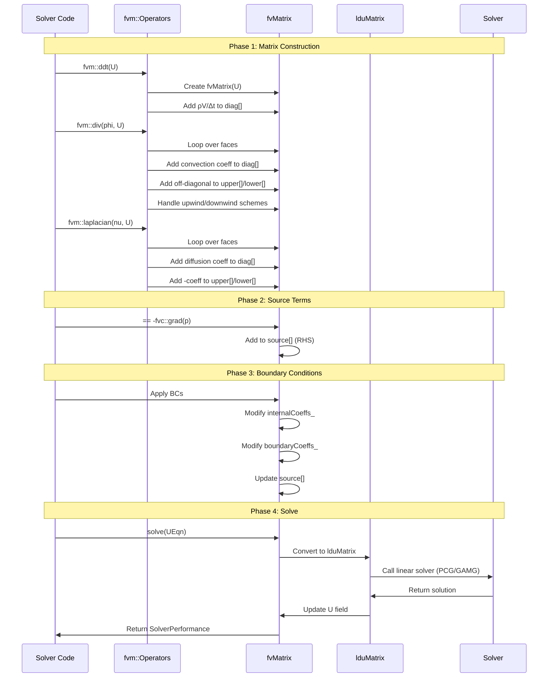
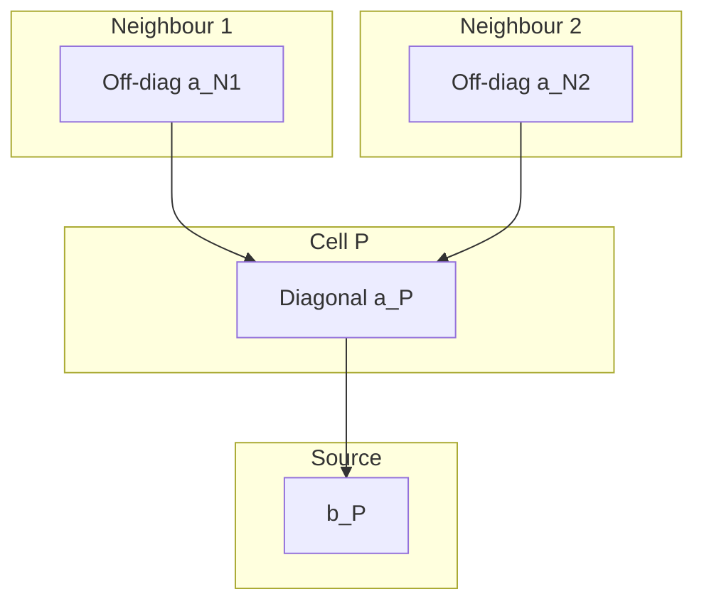
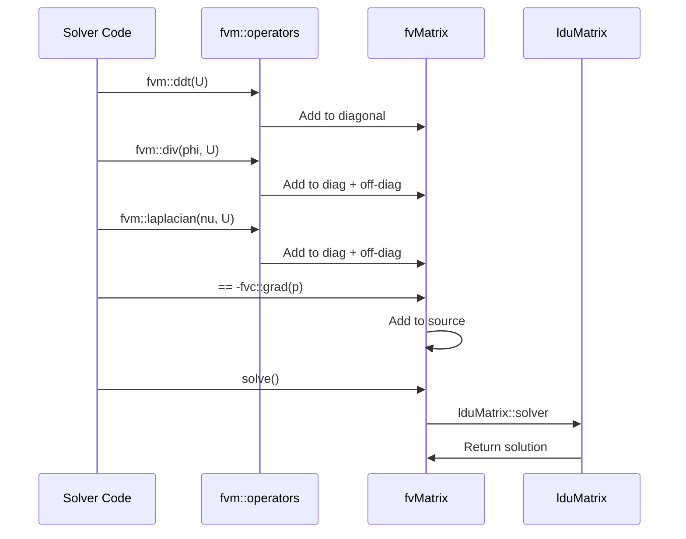

# fvMatrix Deep Dive

เข้าใจว่า Matrix ถูกประกอบขึ้นอย่างไร

---

## Overview

> **เป้าหมาย:** เข้าใจ internals ของ `fvMatrix`
> 
> ครอบคลุม: Matrix storage, Assembly process, LDU addressing

---

## What is fvMatrix?

`fvMatrix` ไม่ใช่แค่ matrix — มันคือ **สมการ discretized ทั้งระบบ**

```cpp
template<class Type>
class fvMatrix
{
    // The unknown field
    GeometricField<Type, fvPatchField, volMesh>& psi_;

    // Matrix storage
    scalarField diag_;          // Diagonal: a_P
    scalarField upper_;         // Upper triangle: a_N (owner)
    scalarField lower_;         // Lower triangle: a_N (neighbour)

    // Right-hand side
    Field<Type> source_;

    // Boundary contributions
    FieldField<Field, Type> internalCoeffs_;
    FieldField<Field, Type> boundaryCoeffs_;
};
```

<!-- IMAGE: IMG_10_008 -->
<!--
Purpose: เพื่อแสดงโครงสร้างของ fvMatrix Class และ LDU Storage Format
Prompt: "Data Structure Diagram of OpenFOAM fvMatrix. **Layout:** Split view connecting Code, Mesh, and Matrix. **Left (Code):** Class diagram of `fvMatrix` showing `diag`, `upper`, `lower`. **Center (Mesh):** A simple 3-cell mesh (Cells 0, 1, 2) connected by Faces. **Right (Matrix):** The resulting sparse matrix shown as a grid. **Connection:** Lines linking 'Face between 0 and 1' → 'Matrix Element (0,1)' → 'LDU Array Entry'. **Style:** Computer Science educational diagram, clean lines, monospaced font for code, pastel colors for memory blocks."
-->


---

## LDU Matrix Storage

```
Standard Matrix:          LDU Storage:
┌─────────────────┐
│ 4  -1   0   0  │       diag = [4, 4, 4, 4]
│-1   4  -1   0  │       upper = [-1, -1, -1]  
│ 0  -1   4  -1  │       lower = [-1, -1, -1]
│ 0   0  -1   4  │       
└─────────────────┘       owner = [0, 1, 2]
                          neighbour = [1, 2, 3]
```

> [!NOTE]
> **ทำไม LDU ไม่ใช่ CSR?**
> - FVM matrix มี structure พิเศษ: symmetric pattern
> - `owner[f]` และ `neighbour[f]` ให้ connectivity โดยตรง
> - Memory efficient สำหรับ sparse FVM matrices

---

## How fvm::laplacian Builds Matrix

```cpp
tmp<fvMatrix<Type>> fvm::laplacian
(
    const GeometricField<scalar, fvsPatchField, surfaceMesh>& gamma,
    const GeometricField<Type, fvPatchField, volMesh>& vf
)
{
    tmp<fvMatrix<Type>> tfvm(new fvMatrix<Type>(vf, dimArea*gamma.dimensions()));
    fvMatrix<Type>& fvm = tfvm.ref();

    // Loop over internal faces
    forAll(mesh.owner(), facei)
    {
        label own = mesh.owner()[facei];
        label nei = mesh.neighbour()[facei];

        scalar magSf = mesh.magSf()[facei];
        scalar delta = mesh.delta()[facei] & mesh.Sf()[facei]/magSf;

        // Diffusion coefficient at face
        scalar coeff = gamma[facei] * magSf / delta;

        // Add to matrix
        fvm.diag()[own] += coeff;    // a_P
        fvm.diag()[nei] += coeff;    // a_P for neighbour
        fvm.upper()[facei] = -coeff; // a_N (off-diagonal)
        fvm.lower()[facei] = -coeff; // a_N (symmetric)
    }

    // Handle boundary faces
    forAll(vf.boundaryField(), patchi)
    {
        // BC contributions to diagonal and source
    }

    return tfvm;
}
```

### Step-by-Step Assembly: ตัวอย่าง 1D Diffusion

พิจารณา 1D steady-state diffusion กับ 3 cells:

```
φ₀      φ₁      φ₂
│   C₀   │   C₁   │   C₂   │
└───────┴───────┴───────┘
   F₀      F₁
```

**Step 1: เตรียม matrix ว่าง**
```
diag  = [0, 0, 0]
upper = [_, _]  (2 faces)
lower = [_, _]
source = [0, 0, 0]
```

**Step 2: Process Face 0 (ระหว่าง Cell 0 และ Cell 1)**
```cpp
coeff = γ * A / Δx = 1.0 * 1.0 / 1.0 = 1.0

diag[0]  += 1.0   →  diag = [1.0, 0, 0]
diag[1]  += 1.0   →  diag = [1.0, 1.0, 0]
upper[0] = -1.0   →  upper = [-1.0, _]
lower[0] = -1.0   →  lower = [-1.0, _]
```

**Step 3: Process Face 1 (ระหว่าง Cell 1 และ Cell 2)**
```cpp
coeff = γ * A / Δx = 1.0 * 1.0 / 1.0 = 1.0

diag[1]  += 1.0   →  diag = [1.0, 2.0, 0]
diag[2]  += 1.0   →  diag = [1.0, 2.0, 1.0]
upper[1] = -1.0   →  upper = [-1.0, -1.0]
lower[1] = -1.0   →  lower = [-1.0, -1.0]
```

**Step 4: เพิ่ม boundary conditions**
```cpp
// Left boundary (Cell 0): fixedValue φ = 100
diag[0] += coeff          →  diag[0] = 2.0 (เพิ่มเป็น 2 เท่า!)
source[0] += coeff * 100  →  source[0] = 100

// Right boundary (Cell 2): zeroGradient
// ไม่มี contribution (flux = 0)
```

**Matrix สุดท้าย:**
```
[ 2.0  -1.0   0.0 ] [φ₀]   [100]
[ -1.0  2.0  -1.0 ] [φ₁] = [ 0 ]
[  0.0  -1.0  1.0 ] [φ₂]   [ 0 ]
```

---

## Matrix Assembly Animation



---

## Matrix Contributions Visualization



Final equation: $a_P \phi_P + \sum_{N} a_N \phi_N = b_P$

<!-- IMAGE: IMG_10_009 -->
<!--
Purpose: เพื่อเปรียบเทียบ LDU vs CSR Storage Format อย่างชัดเจน
Prompt: "Memory Layout Comparison: LDU vs CSR. **Top Half (Concept):** A sparse matrix with a symmetric pattern. **Bottom Left (CSR):** Three long arrays (Row Ptr, Col Ind, Val). Visualized as generic data blocks. **Bottom Right (LDU):** Five arrays (Diag, Upper, Lower, Owner, Neighbour). Visualized as specific mesh-related data. **Highlight:** 'Owner' and 'Neighbour' arrays connected to a mesh sketch. **Metric:** A bar chart showing 'LDU saves 50% memory' (due to symmetry). **Style:** Technical database architecture diagram, flat design, distinct color coding for different array types."
-->


---

## Boundary Condition Contributions

```cpp
// For fixedValue BC (Dirichlet)
internalCoeffs[patchi] = valueFraction;   // Goes to diagonal
boundaryCoeffs[patchi] = valueFraction * refValue;  // Goes to source

// For fixedGradient BC (Neumann)
internalCoeffs[patchi] = 0;   // No diagonal contribution
boundaryCoeffs[patchi] = gradient * deltaCoeffs;  // Goes to source

// For mixed BC
// Combination based on valueFraction
```

<!-- IMAGE: IMG_10_010 -->
<!--
Purpose: เพื่อแสดง Face-to-Cell Connectivity และ Boundary Condition Implementation
Prompt: "Geometric Detail of Finite Volume Face Connectivity. **Focus:** A single internal face shared by two cells, Owner (P) and Neighbour (N). **Vectors:** Face Area Vector S_f pointing from P to N. Distance vector d_PN. **Annotations:** Labels for 'Owner Cell P' and 'Neighbour Cell N'. Equation overlay: 'Flux = S_f dot U_f'. **Side Panel:** A Boundary Face example showing ghost cell or boundary condition application. **Style:** High-precision geometric illustration, 3D perspective of cells, clear vector arrows, engineering textbook style."
-->


---

## Key fvMatrix Methods

### A() — Diagonal Coefficients

```cpp
tmp<volScalarField> fvMatrix<Type>::A() const
{
    tmp<volScalarField> tA(new volScalarField(
        IOobject("A", ...),
        psi_.mesh(),
        dimensions_/dimVolume
    ));
    
    tA.ref().primitiveFieldRef() = diag()/psi_.mesh().V();
    
    return tA;
}
```

- Returns: $a_P / V_P$ (normalized diagonal)
- Used in: SIMPLE, PISO for momentum interpolation

---

### H() — Off-diagonal + Source

```cpp
tmp<GeometricField<Type, fvPatchField, volMesh>> fvMatrix<Type>::H() const
{
    tmp<GeometricField<Type, ...>> tH(new GeometricField<Type, ...>(...));
    GeometricField<Type, ...>& H = tH.ref();

    // Initialize with source
    H.primitiveFieldRef() = source_/psi_.mesh().V();

    // Subtract off-diagonal contributions
    const labelUList& own = lduAddr().lowerAddr();
    const labelUList& nei = lduAddr().upperAddr();

    forAll(own, facei)
    {
        H[own[facei]] -= lower_[facei]*psi_[nei[facei]];
        H[nei[facei]] -= upper_[facei]*psi_[own[facei]];
    }

    return tH;
}
```

- Returns: $(b - \sum_{N} a_N \phi_N) / V$
- Used in: Pressure equation setup

---

### solve() — Linear System Solution

```cpp
SolverPerformance<Type> fvMatrix<Type>::solve()
{
    // Get solver from fvSolution
    solver_ = lduMatrix::solver::New(
        psi_.name(),
        *this,
        solutionDict()
    );
    
    // Solve [A][x] = [b]
    SolverPerformance<Type> sp = solver_->solve(psi_, source_);
    
    // Update boundary conditions
    psi_.correctBoundaryConditions();
    
    return sp;
}
```

---

### relax() — Under-Relaxation

```cpp
void fvMatrix<Type>::relax(const scalar alpha)
{
    // Modify diagonal: A_new = A/alpha
    diag() /= alpha;
    
    // Modify source: b_new = b + (1-alpha)/alpha * A * x_old
    source() += (1.0 - alpha)/alpha * diag()*psi_.primitiveField();
}
```

Mathematically:
$$A_{new} \phi_{new} = b + \frac{1-\alpha}{\alpha} A_{diag} \phi_{old}$$

Which gives:
$$\phi_{new} = \alpha \phi_{calculated} + (1-\alpha) \phi_{old}$$

---

## flux() — Face Flux from Pressure Equation

```cpp
tmp<surfaceScalarField> fvMatrix<scalar>::flux() const
{
    // Returns: -coeff * grad(p) at faces
    // This is the pressure correction flux
}
```

Used after pressure solve:
```cpp
phi = phiHbyA - pEqn.flux();  // Correct mass flux
```

---

## Matrix Assembly Summary



---

## Concept Check

<details>
<summary><b>1. ทำไม OpenFOAM ใช้ LDU ไม่ใช่ CSR?</b></summary>

**LDU Advantages:**
- **Structure known:** FVM matrix มี pattern คงที่ (mesh connectivity)
- **Symmetry:** `lower = upper` สำหรับ Laplacian
- **Memory efficient:** ไม่ต้องเก็บ column indices ทุก entry
- **face-based:** ตรงกับ FVM discretization

**CSR Advantages:**
- More general (any sparse pattern)
- Better for matrix-vector multiply in some cases

OpenFOAM เลือก LDU เพราะ FVM-specific optimization
</details>

<details>
<summary><b>2. `internalCoeffs_` vs `boundaryCoeffs_` ต่างกันอย่างไร?</b></summary>

สำหรับ boundary face f ระหว่าง cell P และ boundary:

**`internalCoeffs_[f]`:**
- Contribution ไปที่ diagonal (A[P][P])
- เกี่ยวกับ cell value $\phi_P$

**`boundaryCoeffs_[f]`:**
- Contribution ไปที่ source (RHS)
- เกี่ยวกับ boundary value หรือ gradient

Example for **fixedValue** ($\phi_b = 100$):
- `internalCoeffs = coeff` (goes to diagonal)
- `boundaryCoeffs = coeff * 100` (goes to source)
</details>

<details>
<summary><b>3. UEqn.H() คำนวณอะไรกันแน่?</b></summary>

$$H = \frac{1}{V_P} \left( b_P - \sum_{N} a_{N} U_N \right)$$

Where:
- $b_P$ = source term (pressure gradient, body force, ...)
- $a_N U_N$ = neighbor contributions

**Physical meaning:** 
"Momentum that would result from neighbors and sources, normalized by diagonal"

Used for: $U = \frac{H}{A} - \frac{1}{A}\nabla p$ (velocity correction)
</details>

---

## Exercise

1. **Print Matrix:** เพิ่มโค้ดใน solver เพื่อ print `UEqn.diag()` และ `UEqn.source()`
2. **Trace Assembly:** ใช้ debugger ติดตามว่า `fvm::laplacian` เพิ่มค่าใน matrix อย่างไร
3. **Manual Check:** คำนวณ matrix entry ด้วยมือสำหรับ 2-cell mesh

---

## เอกสารที่เกี่ยวข้อง

- **ก่อนหน้า:** [kEpsilon Model Anatomy](03_kEpsilon_Model_Anatomy.md)
- **Section ถัดไป:** [Advanced Patterns](../02_ADVANCED_PATTERNS/00_Overview.md)
