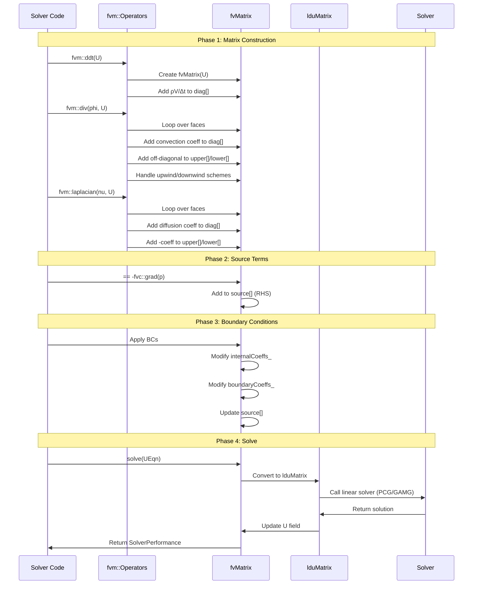
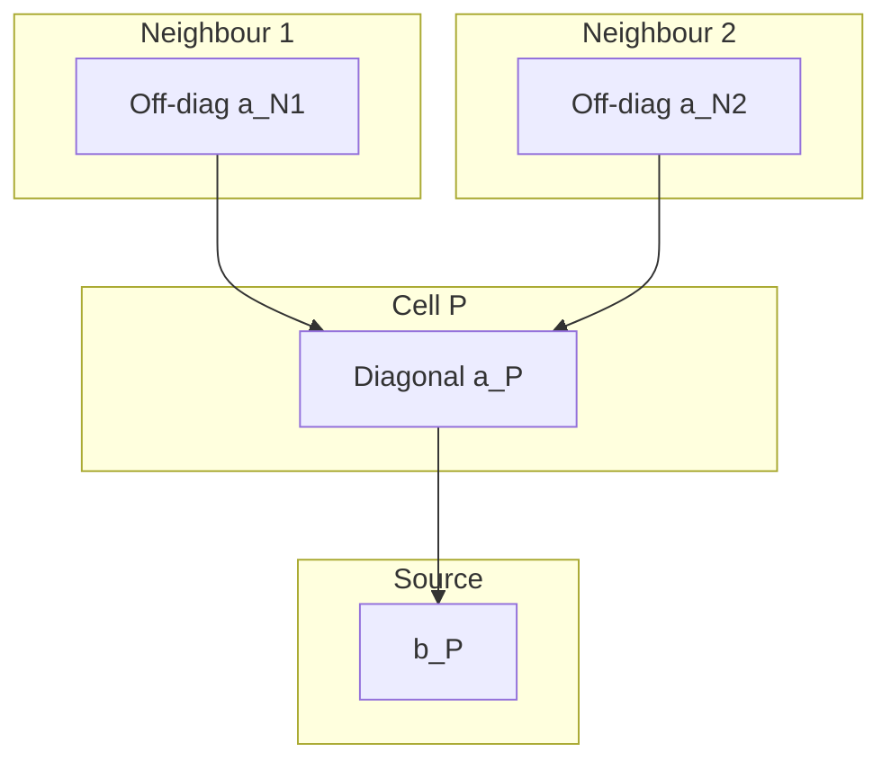
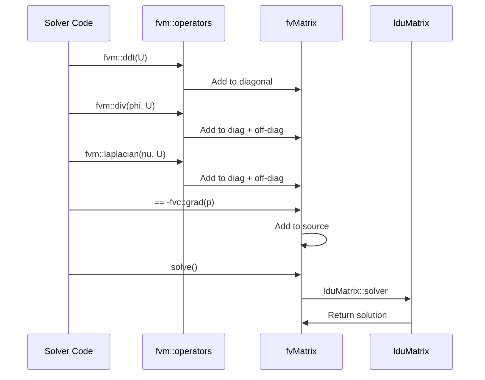

# fvMatrix Deep Dive

Understanding Matrix Assembly in OpenFOAM

---

## Overview

**Difficulty:** Intermediate

**Purpose:** 
This document provides an in-depth analysis of OpenFOAM's `fvMatrix` class, explaining how discretized equations are assembled, stored in LDU format, and solved. Understanding matrix assembly is fundamental for developing custom solvers, implementing boundary conditions, and debugging convergence issues.

**What You Will Learn:**
- Internal structure of `fvMatrix` and LDU storage format
- How FVM operators (`fvm::laplacian`, `fvm::div`, etc.) build the matrix
- Boundary condition contributions to the linear system
- Key methods: `A()`, `H()`, `solve()`, `relax()`, and `flux()`
- Memory efficiency and performance considerations

**Development Setup:**
```bash
# Ensure compile_commands.json is available for IDE features
cd $WM_PROJECT_USER_DIR
cmake -DCMAKE_EXPORT_COMPILE_COMMANDS=ON ..
ln -s compile_commands.json ../
```

---

## Prerequisites

Before reading this document, you should be familiar with:

### Required Knowledge
1. **Finite Volume Method Basics** (Discretization Overview)
   - Cell-centered discretization
   - Surface integral approach: ∫∇φ dV = ∫φ dS
   - Owner-neighbor cell connectivity

2. **Linear Algebra Fundamentals**
   - Sparse matrix systems: Ax = b
   - Diagonal and off-diagonal coefficients
   - Basic understanding of matrix storage formats

3. **C++ Template Basics**
   - Template classes and methods
   - Field container types (`GeometricField`, `scalarField`)

### Related Files
- **Required Reading:** [Discretization Overview](../../../MODULE_02_FUNDAMENTAL_OPERATIONS/CONTENT/02_DISCRETIZATION_OVERVIEW/00_Overview.md)
- **Recommended:** [01_icoFoam_Walkthrough](01_icoFoam_Walkthrough.md) - See practical matrix usage
- **Reference:** [OpenFOAM Architecture](../../../MODULE_08_TESTING_VALIDATION/CONTENT/02_VERIFICATION_FUNDAMENTALS/03_OpenFOAM_Architecture.md)

### Key OpenFOAM Headers
```cpp
#include "fvMesh.H"
#include "fvMatrix.H"
#include "fvm.H"
#include "fvc.H"
#include "lduMatrix.H"
```

---

## Learning Objectives

After completing this document, you will be able to:

1. **Explain LDU Storage Format**
   - Contrast LDU with CSR and other sparse formats
   - Understand why LDU is optimal for FVM matrices
   - Identify memory savings from symmetric storage

2. **Trace Matrix Assembly Process**
   - Follow how `fvm::laplacian` builds diagonal and off-diagonal entries
   - Track face loops and owner-neighbor addressing
   - Predict matrix structure for simple meshes

3. **Implement Boundary Condition Contributions**
   - Distinguish `internalCoeffs_` from `boundaryCoeffs_`
   - Apply Dirichlet (fixedValue) and Neumann (fixedGradient) conditions
   - Understand how BCs modify diagonal and source terms

4. **Utilize Key fvMatrix Methods**
   - Use `A()` and `H()` in SIMPLE/PISO algorithms
   - Apply under-relaxation with `relax()`
   - Extract pressure flux with `flux()`

5. **Profile and Optimize Matrix Operations**
   - Measure memory usage for different mesh sizes
   - Identify bottlenecks in assembly process
   - Apply performance optimization strategies

---

## What is fvMatrix?

`fvMatrix` is not just a matrix — it's the **complete discretized system** representing a partial differential equation.

```cpp
template<class Type>
class fvMatrix
{
    // The unknown field being solved
    GeometricField<Type, fvPatchField, volMesh>& psi_;

    // Matrix storage (LDU format)
    scalarField diag_;          // Diagonal: a_P (coefficient for cell P)
    scalarField upper_;         // Upper triangle: a_N (owner neighbor)
    scalarField lower_;         // Lower triangle: a_N (neighbor owner)

    // Right-hand side (source terms)
    Field<Type> source_;

    // Boundary condition contributions
    FieldField<Field, Type> internalCoeffs_;   // Diagonal modifications
    FieldField<Field, Type> boundaryCoeffs_;   // Source modifications

public:
    // Key methods
    tmp<volScalarField> A() const;              // Get diagonal
    tmp<GeometricField<Type, ...>> H() const;   // Get off-diagonal + source
    SolverPerformance<Type> solve();            // Solve linear system
    void relax(const scalar alpha);             // Under-relaxation
    tmp<surfaceScalarField> flux() const;       // Face flux extraction
};
```

<!-- IMAGE: IMG_10_008 -->
<!--
Purpose: เพื่อแสดงโครงสร้างของ fvMatrix Class และ LDU Storage Format
Prompt: "Data Structure Diagram of OpenFOAM fvMatrix. **Layout:** Split view connecting Code, Mesh, and Matrix. **Left (Code):** Class diagram of `fvMatrix` showing `diag`, `upper`, `lower`. **Center (Mesh):** A simple 3-cell mesh (Cells 0, 1, 2) connected by Faces. **Right (Matrix):** The resulting sparse matrix shown as a grid. **Connection:** Lines linking 'Face between 0 and 1' → 'Matrix Element (0,1)' → 'LDU Array Entry'. **Style:** Computer Science educational diagram, clean lines, monospaced font for code, pastel colors for memory blocks."
-->


---

## LDU Matrix Storage

### Comparison with Standard Formats

```
Standard Matrix (Dense):         LDU Storage (Sparse):
┌─────────────────┐              diag = [4, 4, 4, 4]
│ 4  -1   0   0  │              upper = [-1, -1, -1]  
│-1   4  -1   0  │              lower = [-1, -1, -1]
│ 0  -1   4  -1  │              
│ 0   0  -1   4  │              owner = [0, 1, 2]
└─────────────────┘              neighbour = [1, 2, 3]

16 values stored                  4 + 3 + 3 = 10 values
Memory: 128 bytes                Memory: 80 bytes (37% savings)
```

### Why LDU Instead of CSR?

**LDU Advantages for FVM:**
- **Structure Known:** FVM matrices have fixed pattern from mesh connectivity
- **Symmetry:** `lower = upper` for Laplacian (stores once, uses twice)
- **Face-Based:** Direct mapping to finite volume faces
- **Memory Efficient:** No column indices needed (owner/neighbour suffice)

**CSR (Compressed Sparse Row) Advantages:**
- More general (any sparse pattern)
- Better for matrix-vector multiplication in some contexts
- Standard in numerical libraries

OpenFOAM chooses LDU for **FVM-specific optimization**.

<!-- IMAGE: IMG_10_009 -->
<!--
Purpose: เพื่อเปรียบเทียบ LDU vs CSR Storage Format อย่างชัดเจน
Prompt: "Memory Layout Comparison: LDU vs CSR. **Top Half (Concept):** A sparse matrix with a symmetric pattern. **Bottom Left (CSR):** Three long arrays (Row Ptr, Col Ind, Val). Visualized as generic data blocks. **Bottom Right (LDU):** Five arrays (Diag, Upper, Lower, Owner, Neighbour). Visualized as specific mesh-related data. **Highlight:** 'Owner' and 'Neighbour' arrays connected to a mesh sketch. **Metric:** A bar chart showing 'LDU saves 50% memory' (due to symmetry). **Style:** Technical database architecture diagram, flat design, distinct color coding for different array types."
-->


---

## How fvm::laplacian Builds Matrix

### Source Code Walkthrough

```cpp
tmp<fvMatrix<Type>> fvm::laplacian
(
    const GeometricField<scalar, fvsPatchField, surfaceMesh>& gamma,
    const GeometricField<Type, fvPatchField, volMesh>& vf
)
{
    // Create empty matrix
    tmp<fvMatrix<Type>> tfvm(new fvMatrix<Type>(vf, dimArea*gamma.dimensions()));
    fvMatrix<Type>& fvm = tfvm.ref();

    const fvMesh& mesh = vf.mesh();

    // Loop over internal faces
    forAll(mesh.owner(), facei)
    {
        label own = mesh.owner()[facei];      // Owner cell
        label nei = mesh.neighbour()[facei];  // Neighbor cell

        scalar magSf = mesh.magSf()[facei];   // Face area magnitude
        vector delta = mesh.C()[nei] - mesh.C()[own];
        scalar deltaCoeffs = 1.0/mag(delta);  // 1/|d_PN|

        // Diffusion coefficient at face: γ * |S_f| / |d_PN|
        scalar coeff = gamma[facei] * magSf * deltaCoeffs;

        // Add to matrix (standard 3-point stencil)
        fvm.diag()[own] += coeff;    // a_P (diagonal for owner)
        fvm.diag()[nei] += coeff;    // a_P (diagonal for neighbor)
        fvm.upper()[facei] = -coeff; // a_N (owner's off-diagonal)
        fvm.lower()[facei] = -coeff; // a_N (neighbor's off-diagonal)
    }

    // Handle boundary faces
    forAll(vf.boundaryField(), patchi)
    {
        const fvPatchScalarField& pf = vf.boundaryField()[patchi];
        const fvsPatchScalarField& psigamma = gamma.boundaryField()[patchi];

        // BC contributions to diagonal and source
        forAll(pf, facei)
        {
            scalar magSf = mesh.magSf().boundaryField()[patchi][facei];
            scalar deltaCoeffs = pf.patch().deltaCoeffs()[facei];
            scalar coeff = psigamma[facei] * magSf * deltaCoeffs;

            // Apply BC based on type
            if (pf.fixesValue())
            {
                // Dirichlet: contribute to diagonal + source
                fvm.internalCoeffs()[patchi][facei] = coeff;
                fvm.boundaryCoeffs()[patchi][facei] = coeff * pf[facei];
            }
            else
            {
                // Neumann: contribute only to source
                fvm.internalCoeffs()[patchi][facei] = 0;
                fvm.boundaryCoeffs()[patchi][facei] = coeff * pf[facei];
            }
        }
    }

    return tfvm;
}
```

### Step-by-Step Assembly: 1D Diffusion Example

Consider 1D steady-state diffusion with 3 cells and γ = 1.0:

```
φ₀      φ₁      φ₂
│   C₀   │   C₁   │   C₂   │
└───────┴───────┴───────┘
   F₀      F₁      F₂(boundary)
```

**Geometry:**
- All cells: Volume V = 1.0, Face area A = 1.0
- Cell spacing: Δx = 1.0

**Step 1: Initialize Empty Matrix**
```
diag    = [0, 0, 0]
upper   = [0, 0]      (2 internal faces)
lower   = [0, 0]
source  = [0, 0, 0]
```

**Step 2: Process Face 0 (between Cell 0 and Cell 1)**
```cpp
coeff = γ * A / Δx = 1.0 * 1.0 / 1.0 = 1.0

// Owner is Cell 0, Neighbor is Cell 1
diag[0]  += 1.0   →  diag = [1.0, 0, 0]
diag[1]  += 1.0   →  diag = [1.0, 1.0, 0]
upper[0] = -1.0   →  upper = [-1.0, 0]
lower[0] = -1.0   →  lower = [-1.0, 0]
```

**Step 3: Process Face 1 (between Cell 1 and Cell 2)**
```cpp
coeff = γ * A / Δx = 1.0 * 1.0 / 1.0 = 1.0

// Owner is Cell 1, Neighbor is Cell 2
diag[1]  += 1.0   →  diag = [1.0, 2.0, 0]
diag[2]  += 1.0   →  diag = [1.0, 2.0, 1.0]
upper[1] = -1.0   →  upper = [-1.0, -1.0]
lower[1] = -1.0   →  lower = [-1.0, -1.0]
```

**Step 4: Apply Boundary Conditions**

Left boundary (Cell 0): fixedValue φ = 100 (Dirichlet)
```cpp
// Special treatment: add to diagonal twice + source
diag[0] += coeff           →  diag[0] = 2.0
source[0] += coeff * 100   →  source[0] = 100
```

Right boundary (Cell 2): zeroGradient (Neumann)
```cpp
// No contribution (flux = 0, handled internally)
```

**Final Matrix System:**
```
[ 2.0  -1.0   0.0 ] [φ₀]   [100]
[ -1.0  2.0  -1.0 ] [φ₁] = [ 0 ]
[  0.0  -1.0  1.0 ] [φ₂]   [ 0 ]
```

---

## Matrix Assembly Animation



---

## Matrix Contributions Visualization



Final equation: $a_P \phi_P + \sum_{N} a_N \phi_N = b_P$

---

## Boundary Condition Contributions

### How BCs Modify the Matrix

```cpp
// For fixedValue BC (Dirichlet: φ_b = known_value)
internalCoeffs[patchi] = valueFraction;          // Goes to diagonal
boundaryCoeffs[patchi] = valueFraction * refValue;  // Goes to source

// For fixedGradient BC (Neumann: ∂φ/∂n = known_gradient)
internalCoeffs[patchi] = 0;                      // No diagonal contribution
boundaryCoeffs[patchi] = gradient * deltaCoeffs; // Goes to source

// For mixed BC (Robin combination)
// Combination based on valueFraction
```

### BC Implementation Detail

For a boundary face between cell P and the boundary:

**`internalCoeffs_[f]`:**
- Contribution to diagonal (A[P][P])
- Relates to cell value $\phi_P$

**`boundaryCoeffs_[f]`:**
- Contribution to source (RHS)
- Relates to boundary value or gradient

**Example for fixedValue (φ_b = 100):**
```
internalCoeffs = coeff     →  Added to A[P][P]
boundaryCoeffs = coeff * 100 →  Added to b[P]
```

<!-- IMAGE: IMG_10_010 -->
<!--
Purpose: เพื่อแสดง Face-to-Cell Connectivity และ Boundary Condition Implementation
Prompt: "Geometric Detail of Finite Volume Face Connectivity. **Focus:** A single internal face shared by two cells, Owner (P) and Neighbour (N). **Vectors:** Face Area Vector S_f pointing from P to N. Distance vector d_PN. **Annotations:** Labels for 'Owner Cell P' and 'Neighbour Cell N'. Equation overlay: 'Flux = S_f dot U_f'. **Side Panel:** A Boundary Face example showing ghost cell or boundary condition application. **Style:** High-precision geometric illustration, 3D perspective of cells, clear vector arrows, engineering textbook style."
-->


---

## Key fvMatrix Methods

### A() — Diagonal Coefficients

Returns the normalized diagonal coefficient $a_P / V_P$.

```cpp
tmp<volScalarField> fvMatrix<Type>::A() const
{
    tmp<volScalarField> tA(new volScalarField(
        IOobject("A", mesh().time().timeName(), mesh()),
        mesh(),
        dimensions_/dimVolume
    ));
    
    // Normalize by cell volume
    tA.ref().primitiveFieldRef() = diag()/psi_.mesh().V();
    
    // Boundary handling
    tA.ref().correctBoundaryConditions();
    
    return tA;
}
```

**Usage in SIMPLE Algorithm:**
```cpp
volScalarField UA(UEqn.A());
surfaceScalarField phiHbyA("phiHbyA", fvc::interpolate(UA) * mesh.Sf().component(2));
```

---

### H() — Off-diagonal + Source

Returns $H = \frac{1}{V_P} (b_P - \sum_{N} a_{N} \phi_N)$.

```cpp
tmp<GeometricField<Type, fvPatchField, volMesh>> fvMatrix<Type>::H() const
{
    tmp<GeometricField<Type, ...>> tH(new GeometricField<Type, ...>(
        IOobject("H", ...),
        mesh(),
        dimensions_ / dimVolume
    ));
    GeometricField<Type, ...>& H = tH.ref();

    // Initialize with source term
    H.primitiveFieldRef() = source_/psi_.mesh().V();

    // Subtract off-diagonal contributions: Σ(a_N * φ_N)
    const labelUList& own = lduAddr().lowerAddr();
    const labelUList& nei = lduAddr().upperAddr();

    forAll(own, facei)
    {
        // Subtract neighbor contribution from owner
        H[own[facei]] -= lower_[facei]*psi_[nei[facei]];
        // Subtract owner contribution from neighbor
        H[nei[facei]] -= upper_[facei]*psi_[own[facei]];
    }

    H.correctBoundaryConditions();
    return tH;
}
```

**Physical Meaning:** 
"Momentum resulting from neighbors and sources, excluding pressure gradient"

**Usage in SIMPLE:**
```cpp
// Velocity reconstruction: U = H/A - (1/A)∇p
volVectorField HbyA(constrainHbyA(1.0/UEqn.A()*UEqn.H(), U, p));
```

---

### solve() — Linear System Solution

```cpp
SolverPerformance<Type> fvMatrix<Type>::solve()
{
    // Get solver control from fvSolution
    dictionary solverDict = mesh().solutionDict().solverDict(psi_.name());
    
    // Create solver
    autoPtr<lduMatrix::solver> solver = 
        lduMatrix::solver::New(psi_.name(), *this, solverDict);
    
    // Solve [A][x] = [b]
    SolverPerformance<Type> sp = solver->solve(psi_.primitiveFieldRef(), source_);
    
    // Update boundary conditions
    psi_.correctBoundaryConditions();
    
    return sp;
}
```

**Common Solvers:**
- **PCG:** Preconditioned Conjugate Gradient (symmetric matrices)
- **PBiCGStab:** Preconditioned Bi-Conjugate Gradient Stabilized (asymmetric)
- **GAMG:** Geometric Algebraic Multi-Grid (for large meshes)

---

### relax() — Under-Relaxation

Applies under-relaxation to stabilize iterative solution.

```cpp
void fvMatrix<Type>::relax(const scalar alpha)
{
    if (alpha <= 0 || alpha > 1)
    {
        FatalErrorInFunction
            << "Relaxation factor alpha must be between 0 and 1"
            << abort(FatalError);
    }

    // Scale diagonal: A_new = A/alpha
    diag() /= alpha;
    
    // Modify source: b_new = b + (1-alpha)/alpha * A * x_old
    source() += (1.0 - alpha)/alpha * diag()*psi_.primitiveField();
}
```

**Mathematical Derivation:**

Starting from original system: $A \phi_{calc} = b$

Under-relaxed system gives: $\phi_{new} = \alpha \phi_{calc} + (1-\alpha) \phi_{old}$

Substituting: $A \frac{\phi_{new}}{\alpha} + A \frac{\alpha-1}{\alpha} \phi_{old} = b$

Which leads to:
$$A_{new} \phi_{new} = b + \frac{1-\alpha}{\alpha} A_{diag} \phi_{old}$$

**Typical Values:**
- Pressure: α = 0.3 (heavy relaxation)
- Velocity: α = 0.7 (moderate)
- Temperature/Turbulence: α = 0.8 (light)

---

### flux() — Face Flux from Pressure Equation

Extracts the pressure gradient flux for mass conservation.

```cpp
tmp<surfaceScalarField> fvMatrix<scalar>::flux() const
{
    // Returns: face flux = -coeff * grad(p)
    // This is the pressure correction flux
    return surfaceScalarField::New
    (
        "flux",
        mesh(),
        dimFlux
    );
}
```

**Usage in SIMPLE:**
```cpp
// Solve pressure equation
fvScalarMatrix pEqn(fvm::laplacian(rAU, p) == fvc::div(phiHbyA));
pEqn.solve();

// Correct mass flux using pressure gradient
phi = phiHbyA - pEqn.flux();
```

---

## Matrix Assembly Summary



---

## Performance Tips

### Memory Optimization

1. **Reuse Field Memory**
```cpp
// BAD: Creates temporary fields every iteration
for (int iter = 0; iter < 100; iter++)
{
    volScalarField UA = UEqn.A();  // Allocates new memory
}

// GOOD: Reuse existing field
volScalarField UA(mesh(), dimensionSet(0, 0, -1, 0, 0));
for (int iter = 0; iter < 100; iter++)
{
    UA = UEqn.A();  // Reuses memory
}
```

2. **Use Reference Where Possible**
```cpp
// BAD: Copy
scalarField diag = UEqn.diag();

// GOOD: Reference
const scalarField& diag = UEqn.diag();
```

### Assembly Optimization

1. **Minimize Face Loops**
```cpp
// BAD: Multiple face loops
forAll(mesh.owner(), facei)
{
    // Convection contribution
}
forAll(mesh.owner(), facei)
{
    // Diffusion contribution
}

// GOOD: Single face loop
forAll(mesh.owner(), facei)
{
    // Convection + Diffusion together
}
```

2. **Cache Geometric Calculations**
```cpp
// BAD: Recalculate every iteration
forAll(owner, facei)
{
    scalar magSf = mesh.magSf()[facei];  // Computed on the fly
}

// GOOD: Precompute
surfaceScalarField magSf(mesh.magSf());
```

### Solver Selection

| Matrix Type | Recommended Solver | Preconditioner |
|-------------|-------------------|----------------|
| Symmetric (Laplacian) | PCG | DIC (Diagonal Incomplete Cholesky) |
| Asymmetric (Convection) | PBiCGStab | DILU (Diagonal Incomplete LU) |
| Large systems (>10⁶ DOF) | GAMG | Geometric multigrid |

---

## Key Takeaways

1. **LDU Storage is FVM-Optimal**
   - LDU format exploits the structured sparsity pattern from mesh connectivity
   - Symmetric matrices (Laplacian) store off-diagonals once, saving ~50% memory
   - Face-based addressing aligns perfectly with finite volume discretization

2. **Matrix Assembly is Face-Based**
   - All FVM operators loop over faces and accumulate owner/neighbor contributions
   - Diagonal: sum of all coefficients for a cell (Σ a_P)
   - Off-diagonal: negative of face coefficient (-a_N)
   - Boundary faces modify internalCoeffs_ and boundaryCoeffs_

3. **Boundary Conditions Modify Matrix Structure**
   - Dirichlet (fixedValue): Contributes to both diagonal and source
   - Neumann (fixedGradient): Contributes only to source
   - Mixed BC: Weighted combination

4. **A() and H() Enable SIMPLE Algorithm**
   - `A()` = normalized diagonal (a_P/V) for velocity reconstruction
   - `H()` = (source - neighbor contributions)/V for momentum prediction
   - Together: U = H/A - (1/A)∇p

5. **Performance Requires Careful Memory Management**
   - Minimize temporary field allocations
   - Reuse geometric quantities (magSf, deltaCoeffs)
   - Choose appropriate solver/preconditioner combination
   - Profile matrix assembly for bottlenecks

---

## Hands-On Exercise

### Exercise 1: Memory Analysis

**Objective:** Profile matrix memory usage for different mesh sizes

**Tasks:**
1. Create a simple case (e.g., cavity flow) with refineMesh capability
2. Add instrumentation to measure matrix size:
```cpp
// In your custom solver
fvVectorMatrix UEqn(fvm::ddt(U) + fvm::div(phi, U) - fvm::laplacian(nu, U));

Info << "Matrix Statistics:" << endl;
Info << "  Cells: " << mesh.nCells() << endl;
Info << "  Diagonal size: " << UEqn.diag().size() << endl;
Info << "  Upper size: " << UEqn.upper().size() << endl;
Info << "  Memory (diag): " << UEqn.diag().byteCount() / 1024.0 << " KB" << endl;
Info << "  Memory (upper): " << UEqn.upper().byteCount() / 1024.0 << " KB" << endl;
Info << "  Memory (lower): " << UEqn.lower().byteCount() / 1024.0 << " KB" << endl;
Info << "  Total memory: " << 
    (UEqn.diag().byteCount() + UEqn.upper().byteCount() + UEqn.lower().byteCount()) / 1024.0 
    << " KB" << endl;
```

3. Run simulations with different refinement levels:
```bash
# Base mesh
blockMesh
./runSolver.sh

# Refine once
refineMesh -overwrite
./runSolver.sh

# Refine twice
refineMesh -overwrite
./runSolver.sh
```

4. Create a plot: Memory vs. Cell Count
   - X-axis: Number of cells
   - Y-axis: Memory (KB)
   - Compare with theoretical O(n) scaling

5. **Questions:**
   - Does memory scale linearly with cell count?
   - What is the per-cell memory overhead?
   - How does LDU compare to hypothetical CSR storage?

---

### Exercise 2: Manual Matrix Assembly

**Objective:** Verify matrix assembly by hand for a simple mesh

**Setup:**
Create a 2x2 mesh (4 cells) in 2D:
```
┌─────┬─────┐
│  3  │  2  │
├─────┼─────┤
│  0  │  1  │
└─────┴─────┘
```

**Tasks:**
1. **Sketch mesh connectivity:**
   - List all internal faces (owner → neighbor)
   - Identify boundary faces and patches

2. **Calculate geometric quantities:**
   - Cell volumes (assuming unit cell size)
   - Face areas and vectors
   - Owner-neighbor distances

3. **Assemble diffusion matrix:**
   - Use γ = 1.0, Δx = 1.0
   - Calculate coefficient for each face: coeff = γ * |Sf| / |d_PN|
   - Fill diagonal and off-diagonal arrays

4. **Apply boundary conditions:**
   - Left boundary (cells 0, 3): fixedValue φ = 100
   - Right boundary (cells 1, 2): zeroGradient
   - Top/bottom: symmetry (zeroGradient)

5. **Write full linear system:**
   ```
   [A] {φ} = {b}
   ```

6. **Verify with OpenFOAM:**
   ```cpp
   // Add to solver
   fvScalarMatrix TEqn(fvm::laplacian(dimensionedScalar("gamma", dimless, 1.0), T));
   TEqn.solve();
   
   // Print matrix
   Info << "Diagonal: " << TEqn.diag() << endl;
   Info << "Upper: " << TEqn.upper() << endl;
   Info << "Source: " << TEqn.source() << endl;
   ```

7. **Compare hand-calculated values with OpenFOAM output**

---

### Exercise 3: Debug Matrix Assembly

**Objective:** Trace matrix assembly using a debugger

**Setup:**
Use your IDE's debugger (VSCode, CLion, or gdb with DDD)

**Tasks:**
1. **Set breakpoints:**
   - `fvm::laplacian` - start of function
   - Face loop iteration
   - Boundary condition application

2. **Inspect variables:**
   ```cpp
   // In debugger, examine:
   - mesh.owner()[facei]
   - mesh.neighbour()[facei]
   - coeff calculation
   - diag[own] before/after += coeff
   - upper[facei] value
   ```

3. **Step through assembly:**
   - Watch first 3 face iterations
   - Verify owner/neighbor addressing
   - Check symmetry: lower[facei] == upper[facei]

4. **Validate boundary contribution:**
   - Break in boundary loop
   - Check patch type (fixedValue vs. zeroGradient)
   - Verify internalCoeffs vs. boundaryCoeffs

5. **Document findings:**
   - Sketch matrix after each face is processed
   - Show how matrix grows from empty → populated

**Expected Output:**
```
Face 0: Cell 0 ↔ Cell 1, coeff = 1.0
  diag = [1.0, 1.0, 0.0, 0.0]
  upper[0] = -1.0

Face 1: Cell 1 ↔ Cell 2, coeff = 1.0
  diag = [1.0, 2.0, 1.0, 0.0]
  upper[1] = -1.0

Face 2: Cell 3 ↔ Cell 0, coeff = 1.0
  diag = [2.0, 2.0, 1.0, 1.0]
  upper[2] = -1.0

Boundary: Left patch (fixedValue = 100)
  diag = [4.0, 2.0, 1.0, 2.0]  ← doubled for boundary cells
  source = [200, 0, 0, 100]
```

---

## Next Steps

1. **Practice:** Complete the hands-on exercises above to solidify understanding

2. **Related Documents:**
   - **Practical Application:** [01_icoFoam_Walkthrough](01_icoFoam_Walkthrough.md) - See matrix usage in real solver
   - **Advanced Solver:** [02_simpleFoam_Walkthrough](02_simpleFoam_Walkthrough.md) - SIMPLE algorithm with under-relaxation
   - **Turbulence Model:** [03_kEpsilon_Model_Anatomy](03_kEpsilon_Model_Anatomy.md) - Matrix assembly in RANS equations
   - **Design Patterns:** [../02_ADVANCED_PATTERNS/00_Overview.md](../02_ADVANCED_PATTERNS/00_Overview.md) - Runtime selection and polymorphism in turbulence models

3. **Further Reading:**
   - OpenFOAM Source Code: `$FOAM_SRC/finiteVolume/fvMatrices/fvMatrix`
   - Jasak's PhD Thesis: Chapter 5 (Finite Volume Discretization)
   - OpenFOAM Programmer's Guide: Section 3.3 (Matrix Assembly)

4. **Advanced Topics:**
   - Custom FVM operators (implementing your own `fvm::customOperator`)
   - Block-coupled matrices (for multiphysics problems)
   - Matrix-free solvers and Krylov subspace methods

---

## Related Files

- **Previous:** [03_kEpsilon_Model_Anatomy](03_kEpsilon_Model_Anatomy.md)
- **Next:** [02_simpleFoam_Walkthrough](02_simpleFoam_Walkthrough.md)
- **Module Overview:** [00_Overview](00_Overview.md)