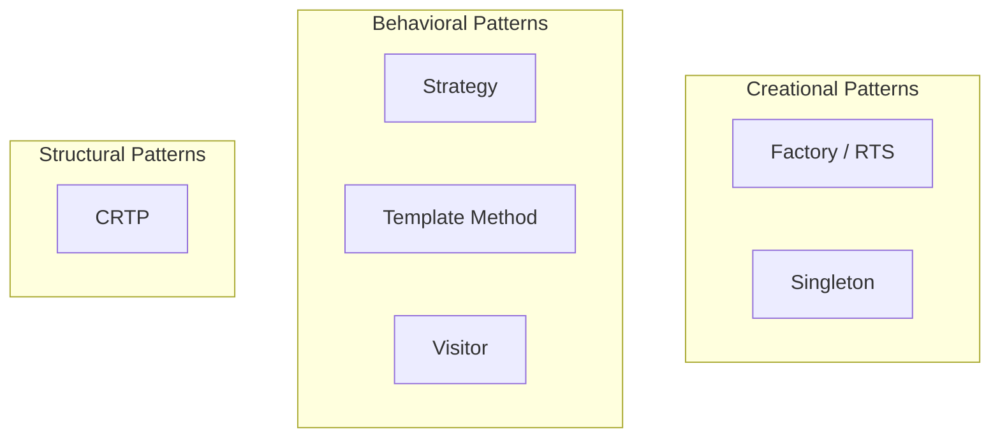

# Advanced Design Patterns — Overview

Design Patterns ที่ซ่อนอยู่ใน OpenFOAM

---

## เป้าหมาย

> **เห็น Patterns ที่ซ่อนอยู่** และสามารถนำไปใช้ใน Code ของตัวเอง

---

## ทำไมต้องเรียน Design Patterns?

1. **Understand existing code:** OpenFOAM ใช้ patterns เยอะมาก
2. **Write better code:** Patterns = proven solutions
3. **Communicate:** "ใช้ Factory Pattern" ชัดกว่า "ใช้ hash table map string ไป constructor"
4. **Prepare for own engine:** ต้องตัดสินใจ design เอง

---

## Patterns ที่จะเรียน

| Pattern | OpenFOAM Example | Purpose |
|:---|:---|:---|
| **Strategy** | `fvSchemes` | Swappable algorithms |
| **Template Method** | `turbulenceModel::correct()` | Fixed structure, variable steps |
| **Singleton** | `MeshObject` | Cached shared data |
| **Visitor** | Field operations | Separate operation from data |
| **CRTP** | `GeometricField` | Compile-time polymorphism |

---

## Pattern Categories

---

## บทเรียนในส่วนนี้

1. **Strategy in fvSchemes** — เลือก discretization scheme ได้
2. **Template Method** — turbulenceModel::correct()
3. **Singleton MeshObject** — Caching mechanism
4. **Visitor Pattern** — Field operations
5. **CRTP Pattern** — Compile-time polymorphism

---

## Prerequisite

ควรผ่าน:
- Module 09: Advanced C++ Topics (RTS)
- Section 01: Code Anatomy (เข้าใจโค้ด OpenFOAM)

---

## เอกสารที่เกี่ยวข้อง

- **ก่อนหน้า:** [fvMatrix Deep Dive](../01_CODE_ANATOMY/04_fvMatrix_Deep_Dive.md)
- **ถัดไป:** [Strategy in fvSchemes](01_Strategy_in_fvSchemes.md)
