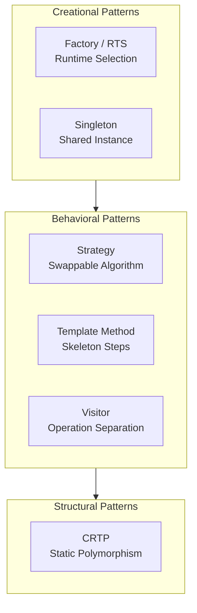

# Advanced Design Patterns — Overview
## Uncovering Hidden Patterns in OpenFOAM Architecture

---

**Estimated Reading Time:** 8-10 minutes

---

## Learning Objectives

By the end of this section, you will be able to:

- **Identify** the five key design patterns used throughout OpenFOAM's architecture
- **Understand** when and why each pattern is applied in real solver code
- **Apply** these patterns to create more maintainable and extensible CFD code
- **Recognize** pattern combinations in complex OpenFOAM components
- **Evaluate** which pattern best suits specific customization scenarios

---

## Key Takeaways

- OpenFOAM relies heavily on design patterns for extensibility and maintainability
- **Strategy Pattern** enables runtime algorithm selection (e.g., fvSchemes)
- **Template Method Pattern** defines skeleton algorithms with customizable steps
- **Singleton Pattern** provides efficient caching mechanisms via MeshObject
- **Visitor Pattern** separates operations from data structures in field manipulations
- **CRTP Pattern** achieves compile-time polymorphism with zero runtime overhead
- Understanding these patterns is essential for reading existing code and designing your own CFD engine

---

## 3W Framework: What, Why, How

### **What** Will You Learn?

This section reveals the architectural backbone of OpenFOAM by examining five fundamental design patterns:

| Pattern | OpenFOAM Example | Core Purpose |
|:---|:---|:---|
| **Strategy** | `fvSchemes` selectors | Swappable algorithms at runtime |
| **Template Method** | `turbulenceModel::correct()` | Fixed structure, variable implementation steps |
| **Singleton** | `MeshObject` | Cached shared data across mesh |
| **Visitor** | Field operations | Separate operations from data structures |
| **CRTP** | `GeometricField` | Compile-time polymorphism without virtual functions |

### **Why** Do Design Patterns Matter?

1. **Understand Existing Code**
   - OpenFOAM extensively uses patterns throughout its codebase
   - Recognition accelerates code comprehension and debugging

2. **Write Better Code**
   - Patterns represent proven, tested solutions to common problems
   - Avoid reinventing wheels; leverage established best practices

3. **Communicate Effectively**
   - "Uses Factory Pattern" conveys more than "hash table mapping strings to constructors"
   - Shared vocabulary improves team collaboration

4. **Prepare for Custom Engine Development**
   - Building your own solver requires deliberate architectural decisions
   - Patterns provide decision frameworks for scalable design

### **How** Will You Apply This Knowledge?

Each pattern lesson follows a consistent structure:
- **Real OpenFOAM Example:** Actual code from the codebase
- **Pattern Mechanics:** How the pattern works internally
- **Application Guidelines:** When to use (and when NOT to use)
- **Your Code:** Concrete CFD engine examples demonstrating application

---

## Pattern Landscape

---

## Learning Roadmap

This section consists of five detailed pattern explorations:

| # | Lesson | Focus | Practical Application |
|:---:|:---|:---|:---|
| 1 | **[Strategy in fvSchemes](01_Strategy_in_fvSchemes.md)** | Runtime algorithm selection | Custom discretization schemes |
| 2 | **[Template Method](02_Template_Method.md)** | Algorithm skeleton with customization steps | Custom turbulence models |
| 3 | **[Singleton MeshObject](03_Singleton_MeshObject.md)** | Efficient caching mechanisms | Derived field caching |
| 4 | **[Visitor Pattern](04_Visitor_Pattern.md)** | Operation-data separation | Field manipulation utilities |
| 5 | **[CRTP Pattern](05_CRTP_Pattern.md)** | Compile-time polymorphism | Performance-critical components |

---

## Prerequisites

Before proceeding, ensure you have completed:

- ✅ **Module 09: Advanced C++ Topics**
  - Runtime Selection System (RTS)
  - Template metaprogramming fundamentals
  
- ✅ **Module 10, Section 01: Code Anatomy**
  - Understanding OpenFOAM code structure
  - Familiarity with core classes (fvMesh, GeometricField, etc.)

---

## Quick Reference: Pattern Selection Guide

Use this guide when deciding which pattern to apply in your code:

| Scenario | Recommended Pattern | Example |
|:---|:---|:---|
| Need to swap algorithms at runtime | **Strategy** | Choosing between different convection schemes |
| Define workflow with pluggable steps | **Template Method** | Turbulence model correction sequence |
| Cache expensive computation results | **Singleton** | Mesh-derived geometric quantities |
| Apply operations across diverse data types | **Visitor** | Field statistics on different field types |
| Eliminate virtual function overhead | **CRTP** | Performance-critical field operations |

---

## Documentation Navigation

**Previous:** [fvMatrix Deep Dive](../01_CODE_ANATOMY/04_fvMatrix_Deep_Dive.md)

**Next:** [Strategy in fvSchemes](01_Strategy_in_fvSchemes.md)