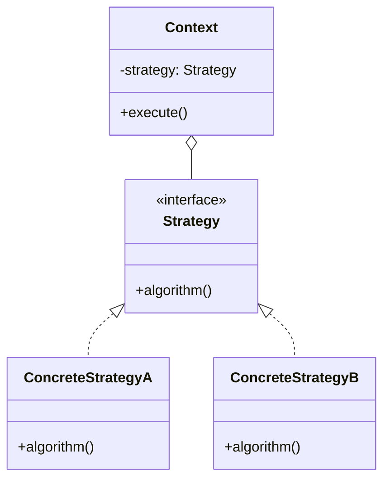
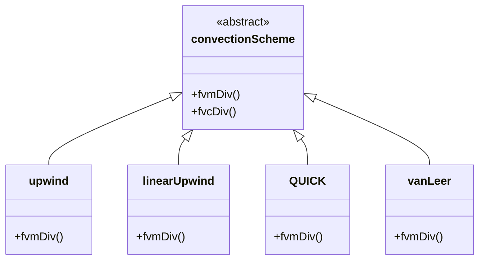

# Strategy Pattern in fvSchemes

Swappable Algorithms at Runtime

---

## The Pattern

> **Strategy Pattern:** กำหนด family of algorithms, encapsulate แต่ละตัว, และทำให้สลับกันได้



**Key Benefit:** เปลี่ยน algorithm โดยไม่ต้องแก้ client code

---

## OpenFOAM Implementation

### The Context: `fvm::div()`

```cpp
// src/finiteVolume/finiteVolume/fvm/fvmDiv.C

template<class Type>
tmp<fvMatrix<Type>> div
(
    const surfaceScalarField& flux,
    const GeometricField<Type, fvPatchField, volMesh>& vf,
    const word& name
)
{
    // Strategy selection happens here!
    return fv::convectionScheme<Type>::New
    (
        vf.mesh(),
        flux,
        vf.mesh().divScheme(name)    // Read from fvSchemes
    )().fvmDiv(flux, vf);            // Execute strategy
}
```

**ไม่มี hardcoding ว่าใช้ upwind หรือ QUICK!**

---

### The Strategies: Convection Schemes



---

### Strategy Selection (Configuration)

```cpp
// system/fvSchemes
divSchemes
{
    default         none;
    div(phi,U)      Gauss linearUpwind grad(U);
    div(phi,k)      Gauss upwind;
    div(phi,epsilon) Gauss upwind;
}
```

**`Gauss`** = interpolation method, **`linearUpwind`** = convection scheme

---

## How It Works

### 1. RTS Registration

```cpp
// upwind.C
defineTypeNameAndDebug(upwind, 0);
addToRunTimeSelectionTable(convectionScheme, upwind, Istream);
```

### 2. Factory Method

```cpp
// convectionScheme.C
template<class Type>
tmp<convectionScheme<Type>> convectionScheme<Type>::New
(
    const fvMesh& mesh,
    const surfaceScalarField& faceFlux,
    Istream& schemeData
)
{
    word schemeName(schemeData);
    
    // Look up in hash table
    auto* ctorPtr = IstreamConstructorTable(schemeName);
    
    return ctorPtr->New(mesh, faceFlux, schemeData);
}
```

### 3. Algorithm Execution

```cpp
// upwind::fvmDiv
template<class Type>
tmp<fvMatrix<Type>> upwind<Type>::fvmDiv
(
    const surfaceScalarField& faceFlux,
    const GeometricField<Type, fvPatchField, volMesh>& vf
) const
{
    // Upwind-specific implementation
    // ...
}
```

---

## Benefits for CFD

| Benefit | Example |
|:---|:---|
| **Flexibility** | ทดลอง scheme ต่างๆ ได้เร็ว |
| **Stability Control** | ใช้ upwind สำหรับ turbulence, high-order สำหรับ velocity |
| **No Recompile** | เปลี่ยน scheme แค่แก้ text file |
| **Extensibility** | เพิ่ม scheme ใหม่เป็น plugin |

---

## Real Example: Mixed Schemes

```cpp
divSchemes
{
    // Velocity: want accuracy
    div(phi,U)      Gauss linearUpwindV grad(U);
    
    // Turbulence: want stability
    div(phi,k)      Gauss upwind;
    div(phi,epsilon) Gauss upwind;
    
    // Scalar transport: TVD for boundedness
    div(phi,T)      Gauss limitedLinear 1;
}
```

---

## Comparison: Strategy vs If-Else

### Without Pattern (Bad)

```cpp
// Solver code (tightly coupled)
if (scheme == "upwind")
{
    // Upwind algorithm
}
else if (scheme == "QUICK")
{
    // QUICK algorithm
}
else if (scheme == "vanLeer")
{
    // vanLeer algorithm
}
// Adding new scheme = modify solver!
```

### With Strategy Pattern (Good)

```cpp
// Solver code (decoupled)
auto scheme = convectionScheme::New(mesh, phi, schemeName);
matrix = scheme->fvmDiv(phi, U);
// Adding new scheme = add new class, no solver change!
```

---

## Applying to Your Own Code

### Example: Time Integration Schemes

```cpp
// Define interface
class timeScheme
{
public:
    virtual tmp<volScalarField> advance(
        const volScalarField& phi,
        const volScalarField& dPhiDt,
        scalar dt
    ) = 0;
};

// Strategies
class eulerScheme : public timeScheme { ... };
class rungeKutta4 : public timeScheme { ... };
class adamsBashforth : public timeScheme { ... };

// Usage
auto scheme = timeScheme::New(schemeName);
phi = scheme->advance(phi, ddt, dt);
```

---

## Concept Check

<details>
<summary><b>1. ถ้าคุณต้องเขียน CFD Engine เอง จะใช้ Strategy Pattern กับอะไร?</b></summary>

**Good candidates:**
- **Discretization schemes:** Gradient, Divergence, Laplacian
- **Time integration:** Euler, RK4, BDF
- **Linear solvers:** CG, GMRES, Multigrid
- **Preconditioners:** ILU, Jacobi, SSOR
- **Flux limiters:** van Leer, Superbee, MC

**Pattern นี้เหมาะกับ:** "algorithm ที่มีหลาย variants และต้องเลือกตอน runtime"
</details>

<details>
<summary><b>2. Strategy vs Template Method ต่างกันอย่างไร?</b></summary>

| Aspect | Strategy | Template Method |
|:---|:---|:---|
| **Vary what** | Whole algorithm | Steps of algorithm |
| **Composition** | Uses delegation | Uses inheritance |
| **Change when** | Runtime | Compile time |
| **Example** | fvSchemes | turbulenceModel |

**Strategy:** "เลือก algorithm ทั้งตัว"
**Template Method:** "ใช้โครงสร้างเดิม แต่แก้ขั้นตอนบางอัน"
</details>

---

## Exercise

1. **Trace Selection:** ใช้ debugger ติดตามว่า "linearUpwind" string กลายเป็น class instance ได้อย่างไร
2. **Add Custom Scheme:** สร้าง `myUpwind` ที่เพิ่ม diffusion term เล็กน้อย
3. **Design Exercise:** ออกแบบ Strategy hierarchy สำหรับ linear solvers

---

## เอกสารที่เกี่ยวข้อง

- **ก่อนหน้า:** [Overview](00_Overview.md)
- **ถัดไป:** [Template Method Pattern](02_Template_Method_Pattern.md)
