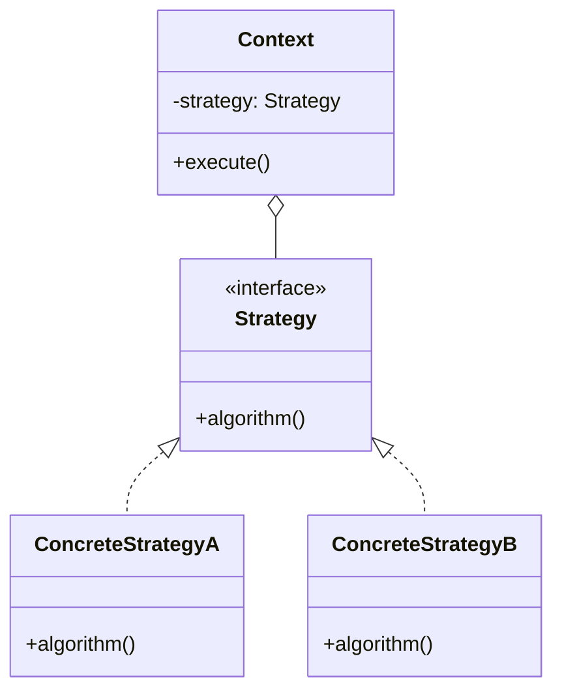
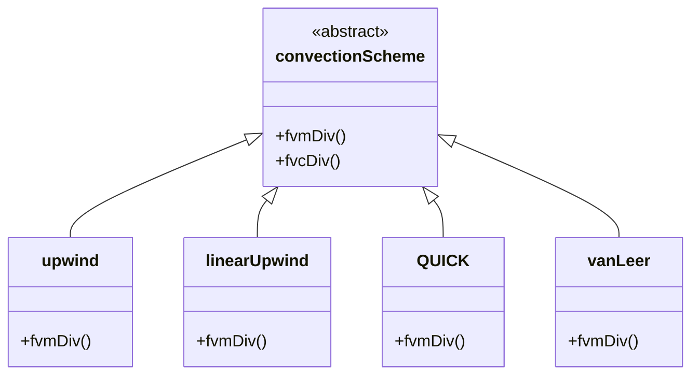

# Strategy Pattern in fvSchemes

Swappable Algorithms at Runtime

---

## Learning Objectives

By the end of this section, you will be able to:

1. **Identify** the Strategy Pattern structure in OpenFOAM's convection scheme implementation
2. **Explain** how the Run-Time Selection (RTS) tables enable runtime algorithm swapping
3. **Design** your own strategy hierarchies for CFD engine components
4. **Troubleshoot** common scheme selection and configuration issues

---

## The Pattern

> **Strategy Pattern:** Define a family of algorithms, encapsulate each one, and make them interchangeable at runtime



**Key Benefit:** Change algorithms without modifying client code - enables flexibility through configuration rather than recompilation

---

## OpenFOAM Implementation

### The Context: `fvm::div()`

```cpp
// src/finiteVolume/finiteVolume/fvm/fvmDiv.C

template<class Type>
tmp<fvMatrix<Type>> div
(
    const surfaceScalarField& flux,
    const GeometricField<Type, fvPatchField, volMesh>& vf,
    const word& name
)
{
    // Strategy selection happens here!
    return fv::convectionScheme<Type>::New
    (
        vf.mesh(),
        flux,
        vf.mesh().divScheme(name)    // Read from fvSchemes
    )().fvmDiv(flux, vf);            // Execute strategy
}
```

**No hardcoding of upwind vs QUICK - the scheme is determined entirely by configuration!**

---

### The Strategies: Convection Schemes



---

### Strategy Selection (Configuration)

```cpp
// system/fvSchemes
divSchemes
{
    default         none;
    div(phi,U)      Gauss linearUpwind grad(U);
    div(phi,k)      Gauss upwind;
    div(phi,epsilon) Gauss upwind;
}
```

**`Gauss`** = integration method (Gauss theorem), **`linearUpwind`** = convection scheme (the strategy)

---

## How It Works

### 1. RTS Registration

```cpp
// upwind.C
defineTypeNameAndDebug(upwind, 0);
addToRunTimeSelectionTable(convectionScheme, upwind, Istream);
```

Each concrete scheme registers itself with the runtime selection table at library load time.

### 2. Factory Method

```cpp
// convectionScheme.C
template<class Type>
tmp<convectionScheme<Type>> convectionScheme<Type>::New
(
    const fvMesh& mesh,
    const surfaceScalarField& faceFlux,
    Istream& schemeData
)
{
    word schemeName(schemeData);
    
    // Look up in hash table
    auto* ctorPtr = IstreamConstructorTable(schemeName);
    
    if (!ctorPtr)
    {
        FatalErrorInFunction
            << "Unknown convection scheme " << schemeName
            << exit(FatalError);
    }
    
    return ctorPtr->New(mesh, faceFlux, schemeData);
}
```

The factory looks up the scheme name and instantiates the appropriate concrete strategy.

### 3. Algorithm Execution

```cpp
// upwind::fvmDiv
template<class Type>
tmp<fvMatrix<Type>> upwind<Type>::fvmDiv
(
    const surfaceScalarField& faceFlux,
    const GeometricField<Type, fvPatchField, volMesh>& vf
) const
{
    // Upwind-specific implementation
    tmp<fvMatrix<Type>> tfvm
    (
        new fvMatrix<Type>
        (
            vf,
            faceFlux.dimensions()*vf.dimensions()
        )
    );
    
    fvMatrix<Type>& fvm = tfvm.ref();
    
    // Upwind interpolation logic
    surfaceScalarField::Internal& faceFluxCorr =
        tfaceFluxCorr.ref();
    
    forAll(faceFluxCorr, facei)
    {
        faceFluxCorr[facei] = faceFlux[facei] > 0 
            ? vf[owner[facei]] 
            : vf[neighbour[facei]];
    }
    
    // ... matrix assembly
    return tfvm;
}
```

Each strategy implements its own discretization algorithm.

---

## Benefits for CFD

| Benefit | Example | Impact |
|:---|:---|:---|
| **Flexibility** | Test different schemes rapidly | Faster convergence studies |
| **Stability Control** | Use upwind for turbulence, high-order for velocity | Optimized accuracy/stability balance |
| **No Recompile** | Change schemes via text file | Reduced development iteration time |
| **Extensibility** | Add new schemes as plugins | Custom discretization without core modification |
| **Field-Specific** | Different schemes per field | Tailored numerical treatment |

---

## Real Example: Mixed Schemes

### Scenario 1: High-Reynolds Number RANS

```cpp
divSchemes
{
    // Velocity: want accuracy on convective terms
    div(phi,U)      Gauss linearUpwindV grad(U);
    
    // Turbulence: want boundedness and stability
    div(phi,k)      Gauss upwind;
    div(phi,epsilon) Gauss upwind;
    div(phi,omega)  Gauss upwind;
    
    // Energy: use TVD for boundedness
    div(phi,h)      Gauss limitedLinearV 1;
}
```

**Rationale:** First-order schemes prevent negative turbulence values, while higher-order schemes preserve velocity accuracy.

### Scenario 2: LES with Dynamic Smagorinsky

```cpp
divSchemes
{
    // Velocity: symmetric schemes for LES
    div(phi,U)      Gauss linear;
    
    // Subgrid kinetic energy: bounded scheme
    div(phi,ksgs)   Gauss limitedLinear 1;
    
    // Passive scalars: TVD NVD for sharp gradients
    div(phi,T)      Gauss vanLeerV;
}
```

**Rationale:** LES requires symmetric discretization to preserve energy cascade properties.

### Scenario 3: Multiphase VOF

```cpp
divSchemes
{
    // Momentum: upwind for stability
    div(phi,U)      Gauss upwind;
    
    // VOF indicator: specialized compressive scheme
    div(phirb,alpha) Gauss interfaceCompression 1;
}
```

**Rationale:** Interface compression maintains sharp phase boundaries.

---

## Comparison: Strategy vs If-Else

### Without Pattern (Bad - Tightly Coupled)

```cpp
// Solver code (violates Open/Closed Principle)
tmp<fvMatrix<Type>> convectionTerm = ...;

if (schemeName == "upwind")
{
    // 50 lines of upwind algorithm
}
else if (schemeName == "QUICK")
{
    // 50 lines of QUICK algorithm
}
else if (schemeName == "vanLeer")
{
    // 50 lines of vanLeer algorithm
}
else if (schemeName == "limitedLinear")
{
    // 50 lines of limitedLinear algorithm
}
// Adding new scheme = modify solver source code!
```

**Problems:**
- Solver code becomes bloated
- Cannot add schemes without modifying core
- Difficult to test schemes independently
- Violates Single Responsibility Principle

### With Strategy Pattern (Good - Decoupled)

```cpp
// Solver code (clean and focused)
auto scheme = convectionScheme<Type>::New(mesh, phi, schemeData);
tmp<fvMatrix<Type>> convectionTerm = scheme->fvmDiv(phi, U);

// Adding new scheme = add new class, no solver change!
```

**Benefits:**
- Solver code remains clean
- Schemes are independently testable
- New schemes via plugins
- Follows Open/Closed Principle

---

## Applying to Your Own Code

### Example 1: Pressure-Velocity Coupling Strategies

```cpp
// Abstract strategy
class pressureVelocityCouplingStrategy
{
public:
    virtual void correct
    (
        volScalarField& p,
        volVectorField& U,
        surfaceScalarField& phi
    ) = 0;
    
    virtual ~pressureVelocityCouplingStrategy() = default;
};

// Concrete strategies
class simpleAlgorithm : public pressureVelocityCouplingStrategy
{
public:
    virtual void correct(volScalarField& p, volVectorField& U, 
                        surfaceScalarField& phi) override
    {
        // SIMPLE implementation
        U Eqn relax...
        solve(pEqn);
        correctBoundaryConditions();
    }
};

class simplecAlgorithm : public pressureVelocityCouplingStrategy
{
public:
    virtual void correct(volScalarField& p, volVectorField& U,
                        surfaceScalarField& phi) override
    {
        // SIMPLEC implementation with under-relaxation
    }
};

class pimpleAlgorithm : public pressureVelocityCouplingStrategy
{
public:
    virtual void correct(volScalarField& p, volVectorField& U,
                        surfaceScalarField& phi) override
    {
        // PIMPLE with outer correctors
        for (int corr=0; corr<nCorr; corr++)
        {
            // Multiple iterations
        }
    }
};

// Factory registration
defineTypeNameAndDebug(simpleAlgorithm, 0);
addToRunTimeSelectionTable(
    pressureVelocityCouplingStrategy, 
    simpleAlgorithm, 
    dictionary
);

// Usage in solver
auto couplingStrategy = pressureVelocityCouplingStrategy::New(mesh);
couplingStrategy->correct(p, U, phi);
```

### Example 2: Gradient Calculation Strategies

```cpp
// Strategy interface
class gradientSchemeStrategy
{
public:
    virtual tmp<volVectorField> calcGradient
    (
        const volScalarField& phi
    ) = 0;
};

// Gaussian divergence theorem (standard)
class gaussGradient : public gradientSchemeStrategy
{
    tmp<volVectorField> calcGradient(const volScalarField& phi) override
    {
        return fvc::grad(phi, "grad(phi)");
    }
};

// Least squares (better on unstructured)
class leastSquaresGradient : public gradientSchemeStrategy
{
    tmp<volVectorField> calcGradient(const volScalarField& phi) override
    {
        // LS reconstruction
    }
};

// Fourth-order (high accuracy)
class fourthOrderGradient : public gradientSchemeStrategy
{
    tmp<volVectorField> calcGradient(const volScalarField& phi) override
    {
        // Wide stencil, O(h^4)
    }
};
```

### Example 3: Boundary Condition Strategies

```cpp
// For time-varying inlet conditions
class inletVelocityStrategy
{
public:
    virtual vector operator()(scalar time, const point& faceCenter) = 0;
};

class pulsatileInlet : public inletVelocityStrategy
{
    scalar amplitude_;
    scalar frequency_;
    vector meanVelocity_;
    
public:
    pulsatileInlet(scalar amp, scalar freq, vector mean)
    : amplitude_(amp), frequency_(freq), meanVelocity_(mean)
    {}
    
    virtual vector operator()(scalar time, const point& faceCenter) override
    {
        return meanVelocity_ * (1 + amplitude_ * sin(2*PI*frequency_*time));
    }
};

class turbulentInlet : public inletVelocityStrategy
{
    // Synthetic turbulence generation
};
```

---

## Troubleshooting Common Issues

### Issue 1: Unknown Scheme Error

**Error Message:**
```
--> FOAM FATAL ERROR:
Unknown convection scheme 'linearUpwimd'
Valid schemes are: 
10(upwind linearUpwind QUICK vanLeer limitedLinear ...)
```

**Solution:**
- Check for typos in scheme name
- Verify scheme is compiled and linked
- Check `ldd $(which simpleFoam)` for loaded libraries

### Issue 2: Scheme Missing from Constructor Table

**Error Message:**
```
request for convectionScheme<volScalarField>::New
    failed for scheme "myCustomScheme"
```

**Solution:**
```cpp
// Ensure these macros are in your .C file:
defineTypeNameAndDebug(myCustomScheme, 0);
addToRunTimeSelectionTable(convectionScheme, myCustomScheme, Istream);

// And library is loaded in controlDict:
libs ("libmyCustomSchemes.so");
```

### Issue 3: Wrong Scheme Applied to Field

**Symptom:** Expected upwind behavior but getting different results

**Debug Steps:**
```cpp
// Add to solver code for debugging:
const word& schemeName = mesh.divSchemes().scheme(div(phi,k));
Info << "Using scheme: " << schemeName << endl;
```

**Common Causes:**
- `default` scheme overriding field-specific setting
- Wrong field name in dictionary (case-sensitive!)
- Scheme name syntax error (missing `grad(U)` argument)

### Issue 4: Runtime Performance Issues

**Symptom:** Simulation slows down after switching schemes

**Analysis:**
| Scheme | Relative Cost | Typical Speed Factor |
|--------|---------------|---------------------|
| upwind | 1x (baseline) | Fastest |
| linearUpwind | 1.5x | Requires gradient calculation |
| QUICK | 2x | Quadratic interpolation |
| vanLeer | 2.5x | Limiter calculations |

**Solutions:**
- Use upwind for initial iterations, switch to higher-order for final convergence
- Limit high-order schemes to critical fields only
- Cache gradient calculations if scheme requires them

---

## Concept Check

<details>
<summary><b>1. Where would you apply the Strategy Pattern in a custom CFD engine?</b></summary>

**Good candidates:**
- **Discretization schemes:** Gradient calculation, Divergence schemes, Laplacian schemes, Temporal schemes
- **Time integration:** Euler, Crank-Nicolson, Runge-Kutta, Adams-Bashforth, BDF
- **Linear solvers:** CG, GMRES, BiCGStab, Multigrid, MINRES
- **Preconditioners:** ILU(n), Jacobi, SSOR, Cholesky, AMG
- **Flux limiters:** van Leer, Superbee, MC, Sweby, minmod
- **Turbulence closures:** k-epsilon variants, k-omega, SAS, DES

**This pattern is ideal for:** "Algorithms with multiple variants requiring runtime selection without recompilation"
</details>

<details>
<summary><b>2. What is the key difference between Strategy and Template Method patterns?</b></summary>

**Key distinction:** Strategy uses delegation (composition), Template Method uses inheritance

**When to use Strategy:**
- Need to swap algorithms at runtime
- Want to avoid deep inheritance hierarchies
- Algorithms are independent and complete

**When to use Template Method:**
- Algorithm structure is fixed, but steps vary
- Want to enforce common skeleton
- Steps are related and share data

| Aspect | Strategy | Template Method |
|:---|:---|:---|
| **Vary what** | Whole algorithm | Steps of algorithm |
| **Composition** | Delegation (has-a) | Inheritance (is-a) |
| **Change when** | Runtime | Compile time |
| **OpenFOAM example** | fvSchemes | turbulenceModel |
| **Flexibility** | Higher | Lower (but more control) |
</details>

---

## Exercises

### Exercise 1: Trace Execution Flow

Use a debugger to trace how the string `"linearUpwind"` in `fvSchemes` becomes a class instance:

**Steps:**
1. Set breakpoint at `convectionScheme<Type>::New`
2. Run `simpleFoam` with `divSchemes { div(phi,U) Gauss linearUpwind grad(U); }`
3. Step through:
   - Dictionary lookup of scheme name
   - Hash table search in `IstreamConstructorTable`
   - Constructor call
   - Return of `tmp<convectionScheme>`

**Questions to answer:**
- Where is the scheme name parsed from the dictionary?
- How is the constructor function pointer retrieved?
- What happens if the scheme is not found?

### Exercise 2: Implement Custom Scheme

Create `blendedUpwind` scheme that blends upwind with central differencing:

```cpp
// blendedUpwind.H
template<class Type>
class blendedUpwind
:
    public convectionScheme<Type>
{
    scalar blendingFactor_;
    
public:
    blendedUpwind(const fvMesh& mesh, 
                 const surfaceScalarField& faceFlux,
                 Istream& is)
    :
        convectionScheme<Type>(mesh, faceFlux),
        blendingFactor_(readScalar(is))
    {}
    
    virtual tmp<fvMatrix<Type>> fvmDiv
    (
        const surfaceScalarField& faceFlux,
        const GeometricField<Type, fvPatchField, volMesh>& vf
    ) const;
};
```

**Tasks:**
1. Implement `fvmDiv` as weighted blend: `(1-β)*upwind + β*central`
2. Register with RTS table
3. Compile as shared library
4. Test with `div(phi,U) Gauss blendedUpwind 0.5;`

### Exercise 3: Design Strategy Hierarchy

Design a Strategy pattern hierarchy for **linear solvers** with the following requirements:

**Must support:**
- CG, GMRES, BiCGStab algorithms
- Different preconditioners (none, DIC, GAMG)
- Configurable tolerance and max iterations
- Asynchronous vs synchronous execution

**Deliverables:**
1. Class diagram showing strategy interfaces and concrete implementations
2. Example `fvSolution` dictionary syntax
3. C++ code for the abstract strategy interface
4. Registration macros for one concrete solver

---

## Key Takeaways

- **Runtime Flexibility:** The Strategy Pattern enables algorithm selection through configuration files rather than code modification
- **OpenFOAM Implementation:** Convection schemes (`upwind`, `linearUpwind`, `QUICK`, etc.) demonstrate the pattern via Run-Time Selection tables
- **Three Components:** Context (`fvm::div`), Strategy (`convectionScheme`), Concrete Strategies (`upwind`, `QUICK`)
- **Factory Pattern:** `New()` method instantiates appropriate scheme based on dictionary lookup
- **CFD Benefits:** Rapid scheme testing, field-specific discretization, stability/accuracy optimization, plugin extensibility
- **Applicable Areas:** Discretization schemes, time integration, linear solvers, preconditioners, flux limiters, pressure-velocity coupling
- **Design Trade-offs:** Strategy uses delegation (flexible), Template Method uses inheritance (structured control)

---

## Related Documents

- **Previous:** [Overview](00_Overview.md)
- **Next:** [Template Method Pattern](02_Template_Method_Pattern.md)
- **Pattern Comparison Guide:** [Design Patterns Comparison](../Design_Patterns_Comparison.md)