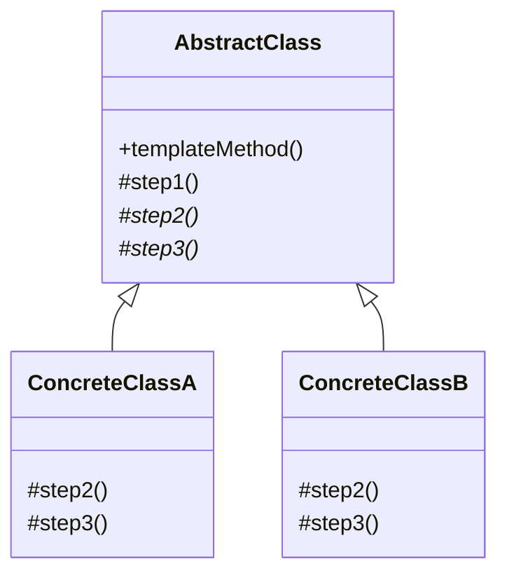
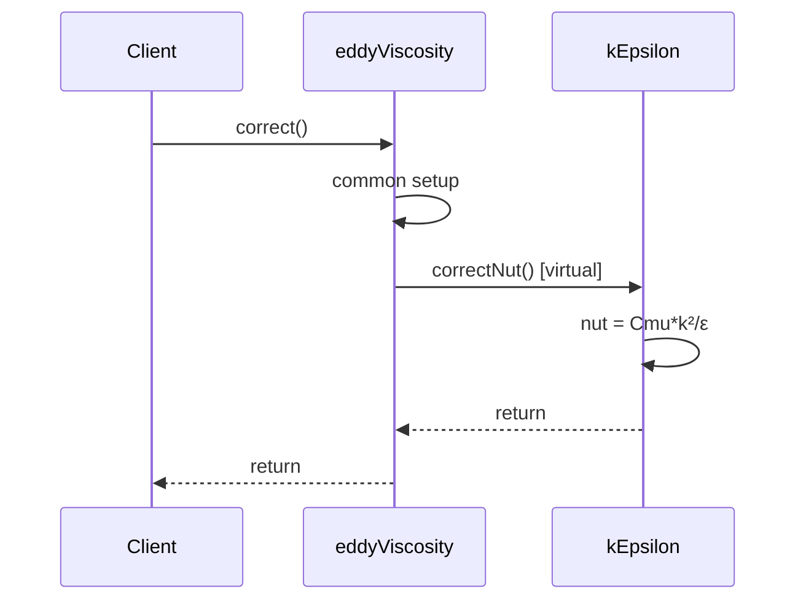
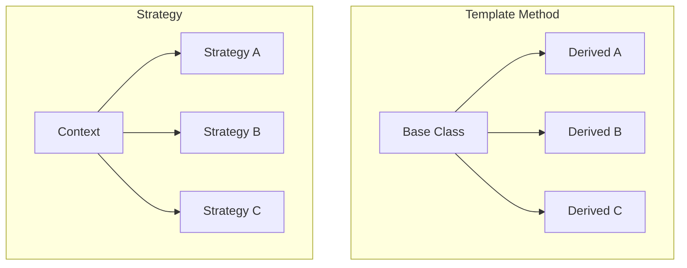

# Template Method Pattern

Fixed Structure, Variable Steps

---

## The Pattern

> **Template Method:** กำหนด skeleton ของ algorithm ใน base class, ให้ subclasses override บาง steps โดยไม่เปลี่ยนโครงสร้าง



**Key:** `templateMethod()` กำหนดลำดับ, subclasses implement details

---

## OpenFOAM Example: turbulenceModel::correct()

### Base Class Template

```cpp
// turbulenceModel.C
void turbulenceModel::correct()
{
    // Step 1: Common preprocessing (all models do this)
    if (mesh_.changing())
    {
        correctNut();
    }
}

// eddyViscosity.C (intermediate class)
void eddyViscosity::correct()
{
    // Call parent
    turbulenceModel::correct();
    
    // Step 2: Update nut (subclass implements)
    correctNut();   // <-- Hook method!
}
```

### Concrete Classes Override Hooks

```cpp
// kEpsilon.C
void kEpsilon::correct()
{
    // Step 1: Call parent chain
    eddyViscosity::correct();
    
    // Step 2: Solve transport equations (k-ε specific)
    solveKEquation();
    solveEpsilonEquation();
    
    // Step 3: Update nut (k-ε specific formula)
    correctNut();
}

void kEpsilon::correctNut()
{
    nut_ = Cmu_ * sqr(k_) / epsilon_;
    nut_.correctBoundaryConditions();
}
```

```cpp
// kOmega.C
void kOmega::correct()
{
    eddyViscosity::correct();
    
    // Different transport equations
    solveKEquation();
    solveOmegaEquation();
    
    correctNut();
}

void kOmega::correctNut()
{
    nut_ = k_ / omega_;   // Different formula!
    nut_.correctBoundaryConditions();
}
```

---

## The "Hook" Methods



**Hooks:** Virtual methods ที่ subclasses **ต้อง** หรือ **เลือก** override

---

## Types of Hook Methods

| Type | Pure Virtual | Default Impl | OpenFOAM Example |
|:---|:---:|:---:|:---|
| **Abstract** | ✅ | ❌ | `correctNut()` in eddyViscosity |
| **Hook** | ❌ | ✅ | `kSource()`, `epsilonSource()` |
| **Concrete** | ❌ | ✅ | `bound()`, `printCoeffs()` |

---

## Benefits for CFD

| Benefit | How It Helps |
|:---|:---|
| **Code Reuse** | Common code ใน base class (ไม่ต้อง duplicate) |
| **Consistency** | ทุก model ทำตามโครงสร้างเดียวกัน |
| **Extensibility** | เพิ่ม model ใหม่แค่ override hooks |
| **Maintenance** | แก้ common logic ที่เดียว มีผลทุก model |

---

## Another Example: fvPatchField

```cpp
// fvPatchField.H (Base)
class fvPatchField
{
public:
    // Template method
    virtual void evaluate()
    {
        if (!updated())
        {
            updateCoeffs();  // Hook 1
        }
        
        // Common: update field values
        Field<Type>::operator=
        (
            this->patchInternalField() 
          + gradient() * delta()  // Uses results from hooks
        );
    }
    
protected:
    // Hook: subclasses implement
    virtual void updateCoeffs() = 0;
    virtual tmp<Field<Type>> gradient() const;
};
```

```cpp
// fixedGradientFvPatchField.C
void fixedGradientFvPatchField::updateCoeffs()
{
    // Nothing to update for fixed gradient
}

tmp<Field<scalar>> fixedGradientFvPatchField::gradient() const
{
    return gradient_;  // User-specified gradient
}
```

---

## Comparison: Template Method vs Strategy



| Aspect | Template Method | Strategy |
|:---|:---|:---|
| **Relationship** | Inheritance | Composition |
| **Fixed** | Algorithm structure | Nothing |
| **Variable** | Some steps | Whole algorithm |
| **Decision time** | Compile-time | Runtime |

---

## Applying to Your Own Code

### Example: Boundary Condition Hierarchy

```cpp
class myBoundaryCondition
{
public:
    // Template method
    void apply()
    {
        validate();         // Common
        calculateCoeffs();  // Hook (pure virtual)
        updateField();      // Common
    }

protected:
    virtual void calculateCoeffs() = 0;  // Hook
    
    void validate() { /* common validation */ }
    void updateField() { /* common update */ }
};

class myDirichletBC : public myBoundaryCondition
{
protected:
    void calculateCoeffs() override
    {
        // Dirichlet-specific
        valueFraction_ = 1.0;
        refValue_ = fixedValue_;
    }
};

class myNeumannBC : public myBoundaryCondition
{
protected:
    void calculateCoeffs() override
    {
        // Neumann-specific
        valueFraction_ = 0.0;
        refGrad_ = specifiedGradient_;
    }
};
```

---

## Concept Check

<details>
<summary><b>1. Template Method vs Strategy: เมื่อไหร่ใช้อะไร?</b></summary>

**ใช้ Template Method เมื่อ:**
- โครงสร้าง algorithm คงที่
- แค่บาง steps ต่างกัน
- ต้องการ enforce ลำดับ

**ใช้ Strategy เมื่อ:**
- ต้องการเปลี่ยน algorithm ทั้งตัว
- ต้องการเปลี่ยนตอน runtime
- Algorithms ไม่มีโครงสร้างร่วมกัน
</details>

<details>
<summary><b>2. "Hollywood Principle" คืออะไร?</b></summary>

> "Don't call us, we'll call you."

Base class **เรียก** subclass methods, ไม่ใช่กลับกัน

```cpp
void Base::templateMethod()
{
    step1();              // Base calls
    step2();              // Base calls (virtual)
    step3();              // Base calls (virtual)
}
```

ไม่ใช่:
```cpp
void Derived::doSomething()
{
    base->step1();  // Derived calls base (wrong)
    myStep2();
    base->step3();
}
```
</details>

---

## Exercise

1. **Trace Calls:** ใช้ debugger ติดตาม `turbulence->correct()` ว่า method ไหนถูกเรียกบ้าง
2. **Add Hook:** เพิ่ม `preCorrect()` hook ใน turbulence model
3. **Design Exercise:** ออกแบบ Template Method hierarchy สำหรับ time stepping

---

## เอกสารที่เกี่ยวข้อง

- **ก่อนหน้า:** [Strategy in fvSchemes](01_Strategy_in_fvSchemes.md)
- **ถัดไป:** [Singleton MeshObject](03_Singleton_MeshObject.md)
