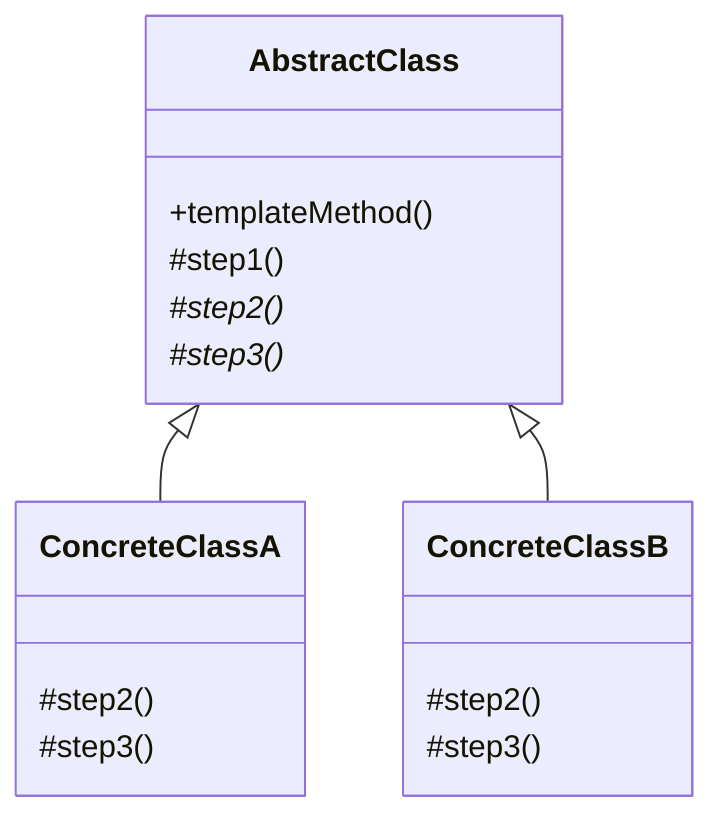
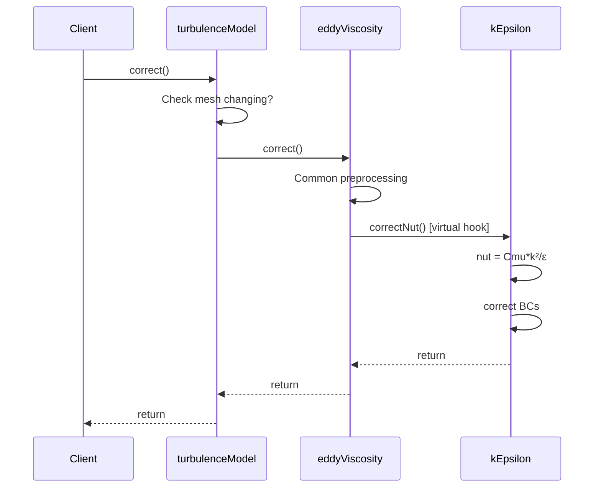
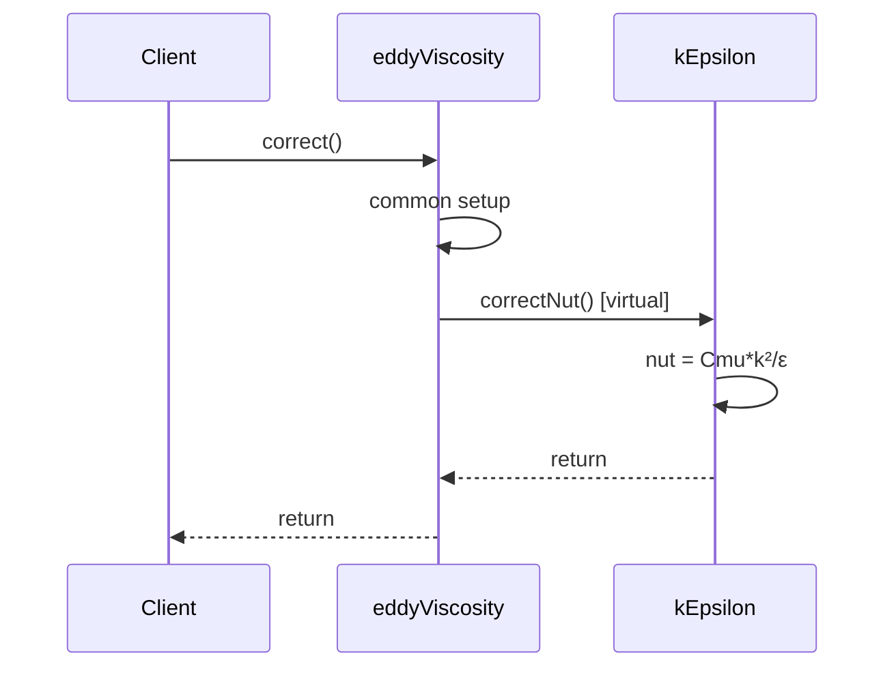

# Template Method Pattern

Fixed Structure, Variable Steps

---

## Learning Objectives

By the end of this section, you will be able to:

- **Understand** the Template Method pattern structure and its "Hollywood Principle"
- **Identify** hook methods and template methods in OpenFOAM source code
- **Distinguish** between inheritance-based (Template Method) and composition-based (Strategy) patterns
- **Apply** Template Method pattern to create extensible CFD solver components
- **Design** proper hook method hierarchies for boundary conditions, turbulence models, and numerical schemes

---

## The Pattern

> **Template Method:** Defines the skeleton of an algorithm in a base class, allowing subclasses to override certain steps without changing the algorithm's structure



**Key:** `templateMethod()` establishes the sequence, subclasses implement details

---

## OpenFOAM Example: turbulenceModel::correct()

### Template Method Call Sequence



### Base Class Template

```cpp
// turbulenceModel.C
void turbulenceModel::correct()
{
    // Step 1: Common preprocessing (all models do this)
    if (mesh_.changing())
    {
        correctNut();
    }
}

// eddyViscosity.C (intermediate class)
void eddyViscosity::correct()
{
    // Call parent
    turbulenceModel::correct();
    
    // Step 2: Update nut (subclass implements)
    correctNut();   // <-- Hook method!
}
```

### Concrete Classes Override Hooks

```cpp
// kEpsilon.C
void kEpsilon::correct()
{
    // Step 1: Call parent chain
    eddyViscosity::correct();
    
    // Step 2: Solve transport equations (k-ε specific)
    solveKEquation();
    solveEpsilonEquation();
    
    // Step 3: Update nut (k-ε specific formula)
    correctNut();
}

void kEpsilon::correctNut()
{
    nut_ = Cmu_ * sqr(k_) / epsilon_;
    nut_.correctBoundaryConditions();
}
```

```cpp
// kOmega.C
void kOmega::correct()
{
    eddyViscosity::correct();
    
    // Different transport equations
    solveKEquation();
    solveOmegaEquation();
    
    correctNut();
}

void kOmega::correctNut()
{
    nut_ = k_ / omega_;   // Different formula!
    nut_.correctBoundaryConditions();
}
```

---

## Types of Hook Methods

| Type | Pure Virtual | Default Impl | OpenFOAM Example | Override Required? |
|:---|:---:|:---:|:---|:---:|
| **Abstract Hook** | ✅ | ❌ | `correctNut()` in eddyViscosity | Always |
| **Optional Hook** | ❌ | ✅ | `kSource()`, `epsilonSource()` | Optional |
| **Concrete Method** | ❌ | ✅ | `bound()`, `printCoeffs()` | Rarely |

**Design Guidelines:**
- **Abstract hooks:** Use when every subclass must provide implementation
- **Optional hooks:** Provide sensible default for common cases
- **Concrete methods:** Final methods that should never be overridden

---

## The "Hook" Methods



**Hooks:** Virtual methods that subclasses **must** or **may** override

---

## Benefits for CFD

| Benefit | How It Helps | OpenFOAM Impact |
|:---|:---|:---|
| **Code Reuse** | Common code stays in base class (no duplication) | 15+ turbulence models share core logic |
| **Consistency** | All models follow same structure | Predictable solver behavior |
| **Extensibility** | Add new models by overriding hooks only | New turbulence model: ~100 lines vs ~500 |
| **Maintenance** | Fix common logic once, affects all models | Bug in `correct()` → fixed everywhere |
| **Enforcement** | Base class controls execution order | Guarantees BCs updated before solving |

---

## Another Example: fvPatchField

```cpp
// fvPatchField.H (Base)
class fvPatchField
{
public:
    // Template method
    virtual void evaluate()
    {
        if (!updated())
        {
            updateCoeffs();  // Hook 1
        }
        
        // Common: update field values
        Field<Type>::operator=
        (
            this->patchInternalField() 
          + gradient() * delta()  // Uses results from hooks
        );
    }
    
protected:
    // Hook: subclasses implement
    virtual void updateCoeffs() = 0;
    virtual tmp<Field<Type>> gradient() const;
};
```

```cpp
// fixedGradientFvPatchField.C
void fixedGradientFvPatchField::updateCoeffs()
{
    // Nothing to update for fixed gradient
}

tmp<Field<scalar>> fixedGradientFvPatchField::gradient() const
{
    return gradient_;  // User-specified gradient
}
```

---

## Applying to Your Own Code

### Example: Custom Boundary Condition Hierarchy

```cpp
class myBoundaryCondition
{
public:
    // Template method - fixed structure
    void apply()
    {
        validate();         // Common: check inputs
        calculateCoeffs();  // Hook: BC-specific calculation
        updateField();      // Common: apply to field
        report();           // Optional hook: logging
    }

protected:
    // Hook: subclasses must implement
    virtual void calculateCoeffs() = 0;
    
    // Optional hook with default (do nothing)
    virtual void report() {}
    
private:
    void validate() { /* common validation */ }
    void updateField() { /* common update */ }
};

class myDirichletBC : public myBoundaryCondition
{
protected:
    void calculateCoeffs() override
    {
        // Dirichlet-specific: set value fraction
        valueFraction_ = 1.0;
        refValue_ = fixedValue_;
    }
    
    void report() override
    {
        Info << "Dirichlet BC applied" << endl;
    }
};

class myNeumannBC : public myBoundaryCondition
{
protected:
    void calculateCoeffs() override
    {
        // Neumann-specific: set gradient
        valueFraction_ = 0.0;
        refGrad_ = specifiedGradient_;
    }
};
```

### Example: Time Stepping Template

```cpp
class timeStepper
{
public:
    // Template method
    void step()
    {
        saveOldTime();       // Common
        calculateDerivs();   // Hook
        updateFields();      // Common
        adjustTimeStep();    // Optional hook
    }

protected:
    virtual void calculateDerivs() = 0;
    virtual void adjustTimeStep() {}
};
```

---

## Concept Check

<details>
<summary><b>1. What's the key difference between Template Method and Strategy patterns?</b></summary>

**Template Method (Inheritance):**
- Fixed algorithm structure
- Some steps vary
- Decision at compile-time
- Base class controls flow

**Strategy (Composition):**
- Entire algorithm can vary
- Decision at runtime
- Context delegates to strategy
- More flexible, more complex

**Rule of thumb:** Use Template Method when you have a "standard procedure" with customizable steps. Use Strategy when you need to swap entire algorithms.
</details>

<details>
<summary><b>2. What is the "Hollywood Principle"?</b></summary>

> "Don't call us, we'll call you."

The base class **calls** subclass methods, not vice versa.

```cpp
// ✅ Correct: Base controls flow
void Base::templateMethod()
{
    step1();              // Base calls
    step2();              // Base calls (virtual)
    step3();              // Base calls (virtual)
}
```

```cpp
// ❌ Wrong: Derived controls flow
void Derived::doSomething()
{
    base->step1();  // Derived calls base
    myStep2();
    base->step3();
}
```

This ensures:
1. Consistent execution order
2. Base class can add steps without breaking subclasses
3. Subclasses focus on their specific behavior
</details>

<details>
<summary><b>3. When should you make a hook method pure virtual vs. providing a default implementation?</b></summary>

**Use pure virtual (`= 0`) when:**
- Every subclass has a different implementation
- There is no sensible default
- Subclasses MUST provide behavior (e.g., `correctNut()`)

**Provide default implementation when:**
- Most subclasses use the same behavior
- The operation is optional
- You want to minimize subclass code (e.g., `report()`)

**Example from OpenFOAM:**
```cpp
// Pure virtual: every BC must implement
virtual void updateCoeffs() = 0;

// Default: few BCs need custom logging
virtual void updateMatrix() { /* default */ }
```
</details>

---

## Exercise

### Beginner
1. **Trace Calls:** Use a debugger to trace `turbulence->correct()` and list all methods called
2. **Identify Hooks:** Find 3 more examples of Template Method in OpenFOAM (hint: check `fvPatchField`, `fvMatrix`)

### Intermediate
3. **Add Hook:** Add a `preCorrect()` hook to turbulence models that gets called before transport equations
4. **Design Exercise:** Design a Template Method hierarchy for time integration schemes (Euler, Runge-Kutta, Crank-Nicolson)

### Advanced
5. **Refactor Code:** Find duplicated code in your solver and extract it into a Template Method
6. **Combine Patterns:** Create a solver that uses Template Method for structure AND Strategy for numerical schemes

---

## Key Takeaways

- ✅ **Template Method = Fixed skeleton, variable steps**
- ✅ **Hollywood Principle:** Base class calls subclass methods, not vice versa
- ✅ **Hook methods** enable customization while enforcing structure
- ✅ **Inheritance-based** (unlike Strategy's composition)
- ✅ **Compile-time decision** (unlike Strategy's runtime)
- ✅ **Ideal for:** Turbulence models, boundary conditions, time steppers
- ✅ **OpenFOAM usage:** `turbulenceModel::correct()`, `fvPatchField::evaluate()`
- ✅ **Benefits:** Code reuse, consistency, enforced structure, easier maintenance

---

## Related Documents

- **Previous:** [Strategy in fvSchemes](01_Strategy_in_fvSchemes.md)
- **Next:** [Singleton MeshObject](03_Singleton_MeshObject.md)
- **Comparison:** See [Pattern Comparison Guide](../Pattern_Comparison_Guide.md) for Template Method vs Strategy detailed comparison