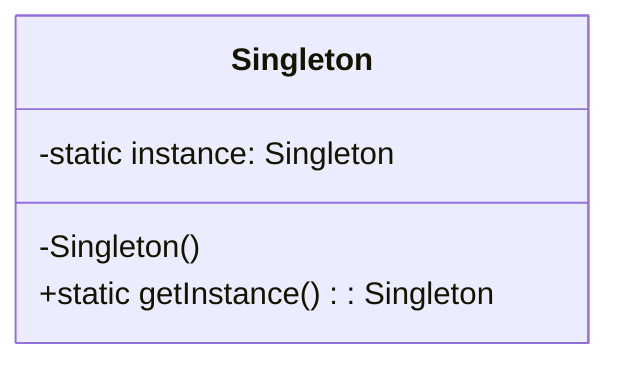
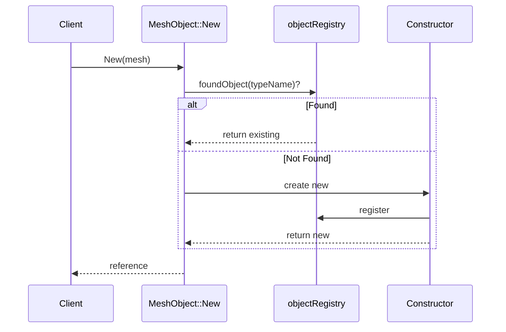
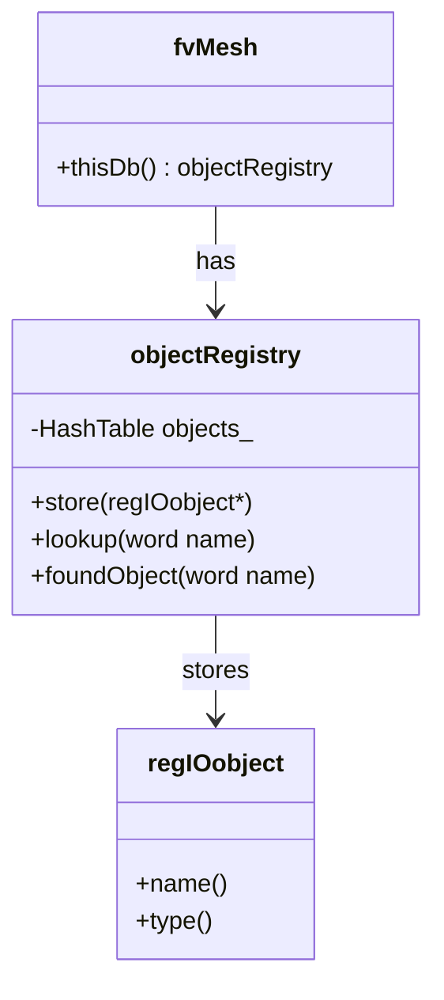

# Singleton Pattern: MeshObject

Cached Shared Data

---

## The Problem

หลาย class ต้องการข้อมูลจาก mesh:
- Cell volumes
- Face areas  
- Distance to wall
- fvSchemes settings

```cpp
// Multiple places need wall distance
volScalarField y = wallDist(mesh).y();  // Read from file? Calculate? Cache?
volScalarField y2 = wallDist(mesh).y(); // Calculate again?? Expensive!
```

---

## The Singleton Pattern

> **Singleton:** Ensure a class has only one instance, and provide global access



**But OpenFOAM's version is smarter — one instance *per mesh*!**

---

## OpenFOAM: MeshObject

```cpp
// Usage
const fvSchemes& schemes = fvSchemes::New(mesh);
const wallDist& wd = wallDist::New(mesh);

// First call: creates and caches
// Subsequent calls: returns cached reference
```

### How It Works



---

## Implementation

```cpp
// MeshObject.H
template<class Mesh, template<class> class MeshObjectType, class Type>
class MeshObject
:
    public MeshObjectType<Mesh>  // Inherits from UpdateableMeshObject, etc.
{
public:
    // The "singleton" accessor
    static const Type& New(const Mesh& mesh)
    {
        // Check if already exists in mesh's registry
        if (!mesh.thisDb().foundObject<Type>(Type::typeName))
        {
            // Create new and store
            return store(new Type(mesh));
        }
        
        // Return existing
        return mesh.thisDb().lookupObject<Type>(Type::typeName);
    }
    
    // Store in registry
    static const Type& store(Type* obj)
    {
        return regIOobject::store(obj);
    }
};
```

---

## Real Example: fvSchemes

```cpp
// fvSchemes.H
class fvSchemes
:
    public MeshObject<fvMesh, UpdateableMeshObject, fvSchemes>,
    public dictionary
{
public:
    TypeName("fvSchemes");
    
    // Constructor (reads from system/fvSchemes)
    fvSchemes(const fvMesh& mesh);
    
    // Accessors
    const dictionary& divScheme(const word& name) const;
    const dictionary& gradScheme(const word& name) const;
    // ...
};
```

```cpp
// Usage in fvm::div
const fvSchemes& schemes = fvSchemes::New(mesh);
word schemeName = schemes.divScheme("div(phi,U)");
```

**File is read ONCE, accessed MANY times!**

---

## Types of MeshObject

| Type | When Updated | Example |
|:---|:---|:---|
| `MoveableMeshObject` | Mesh moves | `volMesh::V()` |
| `UpdateableMeshObject` | File changes | `fvSchemes` |
| `TopologyChangingMeshObject` | Mesh refines | connectivity data |

---

## Benefits

| Benefit | How |
|:---|:---|
| **Performance** | ไม่ต้องคำนวณซ้ำ |
| **Memory** | Share single copy |
| **Consistency** | ทุกที่เห็นข้อมูลเดียวกัน |
| **Auto-cleanup** | Destroyed with mesh |

---

## One Instance Per Mesh (Not Global!)

```cpp
// Different meshes = different instances
const fvSchemes& schemes1 = fvSchemes::New(mesh1);
const fvSchemes& schemes2 = fvSchemes::New(mesh2);

// schemes1 != schemes2 (different meshes)

// Same mesh = same instance
const fvSchemes& schemes1a = fvSchemes::New(mesh1);
const fvSchemes& schemes1b = fvSchemes::New(mesh1);

// schemes1a == schemes1b (same reference!)
```

---

## Object Registry (The Cache)



---

## Creating Your Own MeshObject

```cpp
// myMeshData.H
class myMeshData
:
    public MeshObject<fvMesh, UpdateableMeshObject, myMeshData>
{
    // Cached data
    volScalarField myField_;
    
public:
    TypeName("myMeshData");
    
    // Constructor
    myMeshData(const fvMesh& mesh)
    :
        MeshObject<fvMesh, UpdateableMeshObject, myMeshData>(mesh),
        myField_
        (
            IOobject("myField", mesh.time().timeName(), mesh),
            mesh,
            dimensionedScalar(dimless, 0)
        )
    {
        // Expensive calculation here (done ONCE)
        calculateMyField();
    }
    
    // Accessor
    const volScalarField& field() const { return myField_; }
};
```

```cpp
// Usage
const myMeshData& data = myMeshData::New(mesh);
const volScalarField& field = data.field();  // Cached!
```

---

## Concept Check

<details>
<summary><b>1. ทำไม OpenFOAM ใช้ "one per mesh" แทน global singleton?</b></summary>

**Multi-region simulations:**
- CHT: มี 2+ meshes (fluid, solid)
- แต่ละ mesh ต้องการ settings/data ต่างกัน

**Parallel:**
- Processor patches ต้องการข้อมูลของตัวเอง

**Testing:**
- ง่ายต่อการ mock/replace ต่อ mesh
</details>

<details>
<summary><b>2. `thisDb()` คืออะไร?</b></summary>

`thisDb()` returns `objectRegistry` ของ mesh

```cpp
// fvMesh inherits from objectRegistry
class fvMesh : public polyMesh, public objectRegistry
{
    const objectRegistry& thisDb() const { return *this; }
};
```

Registry = Hash table of name → object
- `foundObject("fvSchemes")` → bool
- `lookupObject<fvSchemes>("fvSchemes")` → reference
</details>

---

## Exercise

1. **List MeshObjects:** เขียน code เพื่อ list ทุก objects ใน mesh registry
2. **Create Custom:** สร้าง MeshObject ที่ cache wall distance squared
3. **Debug Caching:** เพิ่ม Info statement ใน constructor เพื่อยืนยันว่าสร้างแค่ครั้งเดียว

---

## เอกสารที่เกี่ยวข้อง

- **ก่อนหน้า:** [Template Method Pattern](02_Template_Method_Pattern.md)
- **ถัดไป:** [Visitor Pattern](04_Visitor_Pattern.md)
