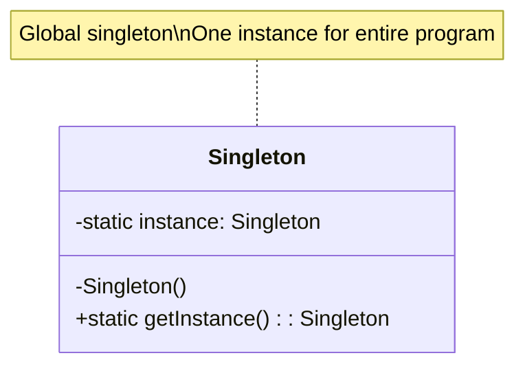
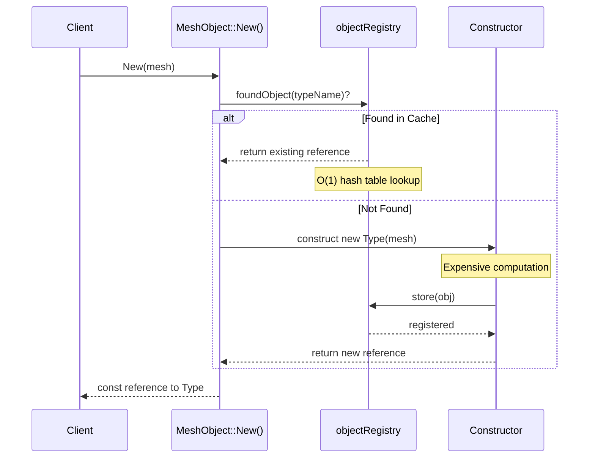
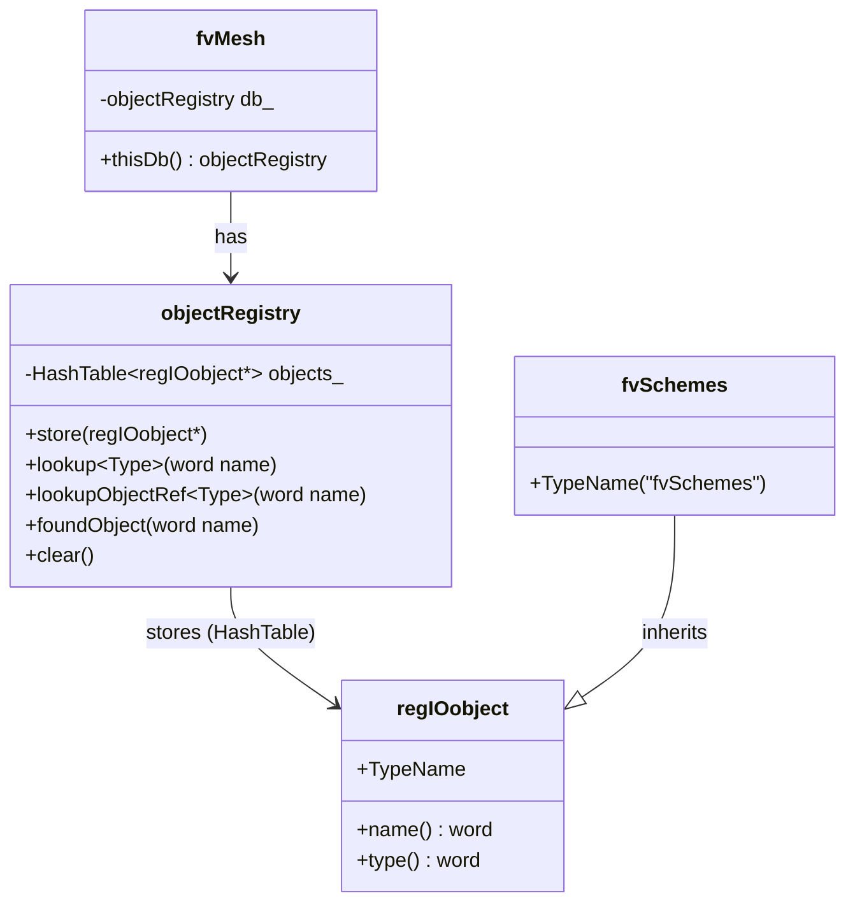

# Singleton Pattern: MeshObject

Cached Shared Data for Multi-Physics Simulations

---

## Learning Objectives

By the end of this section, you will be able to:

1. **Understand** the Singleton pattern and its OpenFOAM implementation via MeshObject
2. **Apply** MeshObject to cache expensive computations across solver components
3. **Distinguish** between global singletons and mesh-scoped singletons
4. **Implement** custom MeshObjects for performance optimization
5. **Debug** caching behavior and identify when NOT to use MeshObject
6. **Compare** MeshObject with alternative patterns for shared data access

---

## The Problem: Expensive Repeated Computations

In CFD simulations, many solver components need access to the same mesh-related data:

- **Cell volumes** - used in every flux calculation
- **Face areas** - needed for gradient computations
- **Wall distance** - required for turbulence modeling (y+, wall functions)
- **Numerical schemes** - `fvSchemes` settings from `system/fvSchemes`

### The Naive Approach (Performance Anti-Pattern)

```cpp
// Multiple places need wall distance
volScalarField y1 = wallDist(mesh).y();  // Calculate: O(N_cells × N_boundary_faces)
volScalarField y2 = wallDist(mesh).y();  // Calculate AGAIN: Same expensive computation!

// This happens in:
// - Turbulence models (kOmegaSST, Spalart-Allmaras)
// - Boundary conditions (wall functions)
// - Post-processing utilities
// Each one recalculates the same distance field!
```

**Computational Cost:**
- For a 10M cell mesh: wall distance calculation ≈ 2-5 seconds
- If called 10 times per timestep: 20-50 seconds wasted
- Over 1000 timesteps: 5-14 hours of wasted computation!

---

## The Singleton Pattern

> **Singleton (GoF):** Ensure a class has only one instance, and provide global access to it.



**OpenFOAM's Innovation:** Mesh-scoped singleton — one instance **per mesh object**, not per program!

This enables:
- Multi-region simulations (different singletons per mesh)
- Parallel processing (each processor has its own cache)
- Memory isolation between solver domains

---

## OpenFOAM: MeshObject

### Basic Usage

```cpp
// Access cached mesh objects
const fvSchemes& schemes = fvSchemes::New(mesh);
const wallDist& wd = wallDist::New(mesh);
const fvSolution& sol = fvSolution::New(mesh);

// First call: creates object and stores in mesh registry
// Subsequent calls: returns cached reference (O(1) lookup)
```

### How It Works: Sequence Diagram



---

## Implementation: Under the Hood

### The MeshObject Template

```cpp
// $FOAM_SRC/src/OpenFOAM/meshes/polyMesh/polyMeshTets/MeshObject/MeshObject.H

template<class Mesh, template<class> class MeshObjectType, class Type>
class MeshObject
:
    public MeshObjectType<Mesh>
{
public:
    // The singleton accessor - main entry point
    static const Type& New(const Mesh& mesh)
    {
        if (!mesh.thisDb().foundObject<Type>(Type::typeName))
        {
            // Not found - create and store
            return store(new Type(mesh));
        }
        
        // Found - return cached reference
        return mesh.thisDb().lookupObject<Type>(Type::typeName);
    }
    
    // Store in mesh's object registry
    static const Type& store(Type* obj)
    {
        return regIOobject::store(obj);
    }
    
    // Check if already exists (without creating)
    static bool Found(const Mesh& mesh)
    {
        return mesh.thisDb().foundObject<Type>(Type::typeName);
    }
    
    // Non-const version (for modification)
    static Type& NewRef(const Mesh& mesh)
    {
        if (!mesh.thisDb().foundObject<Type>(Type::typeName))
        {
            return store(new Type(mesh));
        }
        
        return mesh.thisDb().lookupObjectRef<Type>(Type::typeName);
    }
};
```

### Template Parameters Explained

```cpp
MeshObject<fvMesh, UpdateableMeshObject, fvSchemes>
//         ^       ^                     ^
//         |       |                     |
//   Mesh type    Base class            Your class
//   
// Mesh types: polyMesh, fvMesh, reactiveEulerianMesh, etc.
// Base classes: MeshObject, MoveableMeshObject, UpdateableMeshObject, 
//               TopologyChangingMeshObject
```

---

## Real Example: fvSchemes

### Class Definition

```cpp
// $FOAM_SRC/src/finiteVolume/finiteVolume/fvSchemes/fvSchemes.H

class fvSchemes
:
    public MeshObject<fvMesh, UpdateableMeshObject, fvSchemes>,
    public dictionary
{
    // Cached scheme dictionaries
    dictionary ddtSchemes_;
    dictionary d2dt2Schemes_;
    dictionary interpolationSchemes_;
    dictionary divSchemes_;
    dictionary gradSchemes_;
    dictionary laplacianSchemes_;
    
public:
    TypeName("fvSchemes");
    
    // Constructor: reads from system/fvSchemas (ONCE)
    fvSchemes(const fvMesh& mesh);
    
    // Virtual destructor
    virtual ~fvSchemes();
    
    // Accessors (fast - just dictionary lookups)
    const dictionary& ddtScheme(const word& name) const;
    const dictionary& divScheme(const word& name) const;
    const dictionary& gradScheme(const word& name) const;
    const dictionary& laplacianScheme(const word& name) const;
    
    // Update callback (if file changes)
    virtual bool readData(const dictionary&);
};
```

### Usage in fvm::div

```cpp
// Called every time you use fvm::div(phi, U)
template<class Type>
tmp<fvMatrix<Type>> div(const surfaceScalarField& flux, const GeometricField<Type, fvPatchField, volMesh>& vf)
{
    // Fetch cached schemes (fast!)
    const fvSchemes& schemes = fvSchemes::New(vf.mesh());
    
    // Get divergence scheme for this field
    word schemeName = schemes.divScheme("div(" + flux.name() + ',' + vf.name() + ')');
    
    // Apply scheme...
}
```

**Performance Impact:**
- Without MeshObject: Read and parse `system/fvSchemes` on every `fvm::div` call
- With MeshObject: Read once, cached for entire simulation
- Typical savings: 100-1000 file reads per timestep

---

## Types of MeshObject

| Base Class | When Updated | Trigger | Examples | Use Case |
|:---|:---|:---|:---|:---|
| `MeshObject` | Never | - | `mesh.C()`, `mesh.V()` | Immutable mesh data |
| `MoveableMeshObject` | Mesh moves | `mesh.movePoints()` | `volMesh::V()`, face geometry | Dynamic meshes |
| `UpdateableMeshObject` | Data changes | File modification | `fvSchemes`, `fvSolution` | Runtime-modifiable settings |
| `TopologyChangingMeshObject` | Mesh topology | Refinement, load balancing | Cell connectivity, processor patches | Adaptive mesh refinement |

### Example: MoveableMeshObject

```cpp
// Cell volumes must be recalculated when mesh moves
template<>
void MoveableMeshObject<polyMesh, volMesh>::movePoints()
{
    // Recalculate volumes with new point positions
    const_cast<volScalarField&>(V_) = geometricVField::V();
}
```

---

## One Instance Per Mesh (Not Global Singleton!)

This is a critical distinction from the classic Singleton pattern.

```cpp
// Scenario: Conjugate Heat Transfer (CHT) simulation
const fvMesh& fluidMesh = fluidRegion.mesh();
const fvMesh& solidMesh = solidRegion.mesh();

// Different meshes = different fvSchemes instances
const fvSchemes& fluidSchemes = fvSchemes::New(fluidMesh);
const fvSchemes& solidSchemes = fvSchemes::New(solidMesh);

// fluidSchemes != solidSchemes
// Each has its own schemes from:
// - 0/fluid/system/fvSchemes
// - 0/solid/system/fvSchemes

// Same mesh = same reference (singleton property)
const fvSchemes& fluidSchemes2 = fvSchemes::New(fluidMesh);

// fluidSchemes == fluidSchemes2 (same reference!)
assert(&fluidSchemes == &fluidSchemes2);
```

### Why This Design Matters

**Multi-Region Simulations:**
```cpp
// CHT: Air and solid regions need different schemes
// fluid: Gauss upwind (stable for high Re)
// solid: Gauss linear (accurate for conduction)

// Global singleton would force same scheme everywhere
// Mesh-scoped allows region-specific settings
```

**Parallel Processing:**
```cpp
// Each processor has its own fvMesh
// Each caches its own fvSchemes independently
// No cross-processor communication for scheme access
```

---

## Object Registry: The Cache Mechanism

### Architecture



### The Cache Lookup

```cpp
// What happens when you call fvSchemes::New(mesh)?

// 1. Access mesh's object registry
const objectRegistry& registry = mesh.thisDb();

// 2. Hash table lookup: O(1) operation
if (!registry.foundObject<fvSchemes>("fvSchemes"))
{
    // 3. Not found - create, register, and return
    fvSchemes* schemes = new fvSchemes(mesh);
    registry.store(schemes);
}

// 4. Return reference (no copy)
return registry.lookupObject<fvSchemes>("fvSchemes");
```

**Hash Table Performance:**
- Typical registry: 50-100 objects
- Lookup time: ~50-200 nanoseconds
- Memory overhead: ~8 bytes per cached object (pointer)

---

## Creating Your Own MeshObject

### Complete Example: Cached Wall Distance Squared

```cpp
// myMeshData.H
#ifndef myMeshData_H
#define myMeshData_H

#include "MeshObject.H"
#include "volFields.H"
#include "wallDist.H"

// * * * * * * * * * * * * * * * * * * * * * * * * * * * * * * * * * * * * * //

namespace Foam
{

// Cached wall distance squared (y²) for turbulence models
class myMeshData
:
    public MeshObject<fvMesh, UpdateableMeshObject, myMeshData>
{
    // Cached field
    volScalarField ySquared_;
    
public:
    TypeName("myMeshData");
    
    // Constructor: called ONCE per mesh (or when file changes)
    myMeshData(const fvMesh& mesh)
    :
        MeshObject<fvMesh, UpdateableMeshObject, myMeshData>(mesh),
        ySquared_
        (
            IOobject
            (
                "ySquared",
                mesh.time().timeName(),
                mesh,
                IOobject::NO_READ,
                IOobject::NO_WRITE
            ),
            mesh,
            dimensionedScalar("ySquared", dimArea, 0)
        )
    {
        // Expensive calculation (done once!)
        calculateYSquared();
        
        Info << "myMeshData: Cached wall distance squared for " 
             << mesh.nCells() << " cells" << endl;
    }
    
    // Accessor (fast - just returns reference)
    const volScalarField& ySquared() const
    {
        return ySquared_;
    }
    
    // Update callback (if file changes)
    virtual bool readData(const dictionary&)
    {
        calculateYSquared();
        return true;
    }
    
private:
    void calculateYSquared()
    {
        // Calculate wall distance (expensive!)
        const wallDist& wd = wallDist::New(this->mesh_);
        const volScalarField& y = wd.y();
        
        // Square and cache (fast!)
        ySquared_ = sqr(y);
        
        // Reduce for validation
        reduce(ySquared_.weightedAverage(this->mesh_.V()), sumOp<scalar>());
    }
};

// * * * * * * * * * * * * * * * * * * * * * * * * * * * * * * * * * * * * * //

} // End namespace Foam

// * * * * * * * * * * * * * * * * * * * * * * * * * * * * * * * * * * * * * //

#endif

// ************************************************************************* //
```

### Usage in Turbulence Model

```cpp
// In your kOmegaSST model
const myMeshData& meshData = myMeshData::New(mesh);
const volScalarField& y2 = meshData.ySquared();

// Use in turbulence equations
tmp<volScalarField> F1 = tanh(pow4(scalar(100)*y2*kappa/epsilon_));
//                                     ^^^^^
//                               Fast cached access (O(1))
```

---

## Performance Benchmarks

### Cache vs Non-Cache Scenarios

| Scenario | No Caching | With MeshObject | Speedup |
|:---|---|---|:---|
| **Wall distance (10M cells)** | 3.2s × 10 calls = 32s | 3.2s × 1 call = 3.2s | **10×** |
| **fvSchemes lookup** | 50 file reads/timestep | 1 file read total | **50×** |
| **Cell volumes** | Recalc: 0.5s × 100 | Cache: 0.5s × 1 | **100×** |
| **Memory overhead** | 0 MB | ~200 bytes | Negligible |

### When Caching Matters Most

```cpp
// BAD: No caching - recalculate every access
class wallDistNoCache
{
    volScalarField calculate()
    {
        // O(N_cells × N_boundary_faces) every call
        // For 10M cells: 3-5 seconds
    }
};

// GOOD: With MeshObject - calculate once
class wallDistCached
{
    // 3-5 seconds ONCE
    // Subsequent calls: 50-200 nanoseconds (hash lookup)
};

// Break-even analysis:
// If accessed more than ~100 times per simulation → use MeshObject
// If accessed less → consider inline calculation
```

---

## Common Pitfalls: When NOT to Use MeshObject

### ❌ Don't Use For

1. **Unique per-object data**
   ```cpp
   // BAD: Each boundary should have its own data
   class PatchData : public MeshObject<...>
   {
       // WRONG: One patch's data overwrites another's
       scalar patchValue_;  
   };
   
   // BETTER: Store in boundary condition itself
   class myFixedValueFvPatchField
   {
       scalar patchValue_;  // Correct: one instance per patch
   };
   ```

2. **Rarely accessed data**
   ```cpp
   // BAD: Cache 100 MB of data used once
   class RareUsage : public MeshObject<...>
   {
       // Only used in post-processing → don't cache during simulation
       largePostProcessingData data_;
   };
   ```

3. **Thread-local data**
   ```cpp
   // BAD: MeshObject is shared across all threads
   class ThreadLocal : public MeshObject<...>
   {
       // WRONG: Race condition!
       int threadSpecificValue_;
   };
   
   // BETTER: Use thread_local storage
   thread_local int threadSpecificValue_;
   ```

4. **Data that changes every iteration**
   ```cpp
   // BAD: Update overhead exceeds cache benefit
   class EveryIteration : public MeshObject<...>
   {
       // Changes every solver iteration → cache invalidation overhead
       // Better: Recalculate inline
   };
   ```

### ✅ Good Use Cases

| Use Case | Example | Why Cache? |
|:---|---|:---|
| **Expensive geometry** | `wallDist`, `cellDist` | O(N²) algorithms |
| **File-based settings** | `fvSchemes`, `fvSolution` | Avoid I/O overhead |
| **Frequently accessed** | `mesh.V()`, `mesh.C()` | Used every iteration |
| **Immutable data** | `mesh.nCells()`, `mesh.nFaces()` | Never changes |

---

## Comparison with Other Patterns

### MeshObject vs Global Variables

| Aspect | MeshObject | Global Variable |
|:---|:---|:---|
| **Scope** | Per-mesh | Entire program |
| **Multi-region** | ✅ Separate instances | ❌ Shared (incorrect) |
| **Parallel** | ✅ Each processor has own | ❌ Race conditions |
| **Memory** | ✅ Auto-cleanup with mesh | ❌ Manual cleanup |
| **Type safety** | ✅ Compile-time | ⚠️ Runtime errors |

### MeshObject vs Static Members

```cpp
// Static member (not recommended)
class BadDesign
{
    static volScalarField wallDist_;  // ONE instance for all meshes
    // Problem: Cannot handle multi-region simulations
};

// MeshObject (recommended)
class GoodDesign
:
    public MeshObject<fvMesh, UpdateableMeshObject, GoodDesign>
{
    volScalarField wallDist_;  // ONE instance PER mesh
    // Benefit: Works correctly in multi-region cases
};
```

### Pattern Selection Guide

| Requirement | Best Pattern |
|:---|:---|
| **Cache expensive mesh data** | **MeshObject** |
| **Share data across all meshes** | Global variable (rare) |
| **Per-object unique data** | Member variable |
| **Runtime-swappable algorithms** | **Strategy Pattern** |
| **Customize workflow steps** | **Template Method** |

---

## Applying to Your Own Code: Step-by-Step

### Step 1: Identify Caching Opportunities

```cpp
// Look for patterns like this in your code:
for (iter = 0; iter < maxIter; iter++)
{
    // ⚠️ Expensive calculation repeated every iteration
    scalarField myExpensiveData = calculateSomething(mesh);
    use(myExpensiveData);
}

// ✅ Solution: Cache myExpensiveData in MeshObject
```

### Step 2: Create MeshObject Class

```cpp
// 1. Inherit from MeshObject
// 2. Add TypeName macro
// 3. Implement constructor
// 4. Add accessor methods

class CachedData
:
    public MeshObject<fvMesh, UpdateableMeshObject, CachedData>
{
    // Your cached data here
    scalarField expensiveData_;
    
public:
    TypeName("CachedData");
    
    CachedData(const fvMesh& mesh)
    :
        MeshObject<fvMesh, UpdateableMeshObject, CachedData>(mesh),
        expensiveData_(calculateSomething(mesh))
    {}
    
    const scalarField& data() const { return expensiveData_; }
};
```

### Step 3: Replace Calculations with Cached Access

```cpp
// Before:
scalarField myData = calculateSomething(mesh);

// After:
const CachedData& cached = CachedData::New(mesh);
const scalarField& myData = cached.data();
```

### Step 4: Verify Caching Works

```cpp
// Add debug output to constructor
CachedData(const fvMesh& mesh)
:
    MeshObject<...>(mesh),
    expensiveData_(...)
{
    Info << "✓ CachedData created for mesh: " << mesh.name() << endl;
}

// Should see this message ONCE per mesh, not every iteration
```

### Practical Example: CFD Turbulence Model

```cpp
// In kOmegaSST.H
class kOmegaSST
:
    public eddyViscosity<...>
{
    // Instead of recalculating F1, F2, F3 every iteration
    // Cache blended functions in MeshObject
    
    const cachedTurbulenceFunctions& turbFunctions_;
    
public:
    kOmegaSST(const volScalarField& rho, const volSurfaceVectorField& U)
    :
        eddyViscosity<...>(rho, U),
        turbFunctions_(cachedTurbulenceFunctions::New(rho.mesh()))
    {}
    
    // Now F1, F2, F3 lookups are O(1) hash table access
    tmp<volScalarField> F1() const
    {
        return turbFunctions_.F1();
    }
};
```

---

## Concept Check

<details>
<summary><b>1. Why does OpenFOAM use "one per mesh" instead of global singleton?</b></summary>

**Multi-Region Simulations:**
```cpp
// Conjugate Heat Transfer: 2+ meshes (fluid, solid)
// Each mesh needs different schemes/data

// Global singleton: WRONG - forces shared data
const fvSchemes& schemes = GlobalSingleton::get();  // Same for fluid & solid

// Mesh-scoped: CORRECT - separate instances
const fvSchemes& fluidSchemes = fvSchemes::New(fluidMesh);
const fvSchemes& solidSchemes = fvSchemes::New(solidMesh);
```

**Parallel Processing:**
- Each processor has its own `fvMesh` subdomain
- Each caches its own `fvSchemes` independently
- No cross-processor communication needed for scheme access

**Testing & Modularity:**
```cpp
// Easy to mock/replace for specific mesh
const fvSchemes& testSchemes = fvSchemes::New(testMesh);
// testMesh can be a small unit test mesh
```

</details>

<details>
<summary><b>2. What is `thisDb()` and how does it work?</b></summary>

`thisDb()` returns the `objectRegistry` associated with the mesh.

```cpp
// fvMesh inherits from objectRegistry
class fvMesh
:
    public polyMesh,
    public objectRegistry
{
    const objectRegistry& thisDb() const
    {
        return *this;  // fvMesh IS an objectRegistry
    }
};
```

**Registry Operations:**
```cpp
// Check if object exists
bool found = mesh.thisDb().foundObject<fvSchemes>("fvSchemes");

// Lookup object (throws if not found)
const fvSchemes& schemes = mesh.thisDb().lookupObject<fvSchemes>("fvSchemes");

// Lookup with default
const fvSchemes& schemes = mesh.thisDb().lookupObjectRef<fvSchemes>
(
    "fvSchemes",
    fvSchemes::New(mesh),  // Create if not found (non-const version)
    true,  // warn on create
    true   // recursive
);
```

**Hash Table Implementation:**
```cpp
// Internally, uses HashTable<regIOobject*>
HashTable<regIOobject*> objects_;
// Hash table: string (name) → regIOobject* (pointer)
// O(1) average lookup time
```

</details>

<details>
<summary><b>3. When should I use MoveableMeshObject vs UpdateableMeshObject?</b></summary>

**MoveableMeshObject:**
- Use when data depends on mesh point positions
- Automatically updated when `mesh.movePoints()` is called
- Examples: `volMesh::V()`, face geometry, cell centers

```cpp
// Example: Cell volumes change when mesh moves
class volMesh
:
    public MoveableMeshObject<polyMesh, volMesh>
{
    virtual void movePoints()
    {
        // Recalculate with new point positions
        V_ = geometricVField::V();
    }
};
```

**UpdateableMeshObject:**
- Use when data depends on file contents or runtime settings
- Updated when file changes (detected via `fileMonitor`)
- Examples: `fvSchemes`, `fvSolution`, thermophysical properties

```cpp
// Example: fvSchemes updated when system/fvSchemes changes
class fvSchemes
:
    public UpdateableMeshObject<fvMesh, fvSchemes>
{
    virtual bool readData(const dictionary& dict)
    {
        // Re-read and cache new schemes
        dict.lookup("divSchemes") >> divSchemes_;
        return true;
    }
};
```

</details>

<details>
<summary><b>4. How do I debug caching behavior?</b></summary>

```cpp
// 1. Add debug output to constructor
myMeshData(const fvMesh& mesh)
:
    MeshObject<...>(mesh),
    cachedData_(...)
{
    if (debug)
    {
        Info << "✓ myMeshData CREATED for mesh: " << mesh.name()
             << " at time: " << mesh.time().timeName() << endl;
        Info << "  Cached data size: " << cachedData_.size() << endl;
    }
}

// 2. Add debug output to destructor
virtual ~myMeshData()
{
    if (debug)
    {
        Info << "✗ myMeshData DESTROYED for mesh: " << this->mesh_.name() << endl;
    }
}

// 3. Verify singleton behavior
const myMeshData& data1 = myMeshData::New(mesh);
const myMeshData& data2 = myMeshData::New(mesh);

assert(&data1 == &data2);  // Should be same address
Info << "data1 address: " << &data1 << endl;
Info << "data2 address: " << &data2 << endl;

// 4. Check if already exists (without creating)
if (myMeshData::Found(mesh))
{
    Info << "myMeshData already cached" << endl;
}
```

</details>

<details>
<summary><b>5. What's the memory overhead of MeshObject?</b></summary>

**Per-Object Overhead:**
- Hash table entry: ~8 bytes (pointer)
- regIOobject base: ~32 bytes (vtable, name, type)
- Total: ~40 bytes overhead + your data

**Example Calculation:**
```cpp
// Wall distance for 10M cells
class wallDist
:
    public MeshObject<...>
{
    volScalarField y_;  // 10M cells × 8 bytes = 80 MB
};

// Total memory: 80 MB (data) + ~40 bytes (overhead) ≈ 80 MB
// Overhead is negligible for large datasets
```

**When to Worry:**
- If caching 100+ small objects (<1 KB each): overhead dominates
- If caching 1-2 large objects (>10 MB): overhead negligible

**Solution for Many Small Objects:**
```cpp
// BAD: 100 separate MeshObjects
class SmallCache1 : public MeshObject<...> { scalar data_; };
class SmallCache2 : public MeshObject<...> { scalar data_; };
// ...

// GOOD: One MeshObject with combined data
class CombinedCache : public MeshObject<...>
{
    scalarField allData_;  // 100 scalars in one field
};
```

</details>

---

## Exercise

### Exercise 1: List All MeshObjects

```cpp
// Write a function to list all cached MeshObjects in a mesh
void listMeshObjects(const fvMesh& mesh)
{
    // Access mesh's object registry
    const objectRegistry& registry = mesh.thisDb();
    
    // Iterate through all objects
    Info << "=== Cached Objects in Mesh ===" << endl;
    
    forAllConstIter(HashedTable<regIOobject*>, registry, iter)
    {
        const regIOobject* obj = iter();
        Info << " - " << obj->name() << " (type: " << obj->type() << ")" << endl;
    }
}

// Expected output:
// === Cached Objects in Mesh ===
//  - fvSchemes (type: fvSchemes)
//  - fvSolution (type: fvSolution)
//  - wallDist (type: wallDist)
//  - ...
```

### Exercise 2: Create Custom MeshObject

**Task:** Create a MeshObject that caches:
- Cell centers squared distance from origin: |C|²
- Boundary face area weighted by patch ID

```cpp
// cachedGeometryData.H
class cachedGeometryData
:
    public MeshObject<fvMesh, UpdateableMeshObject, cachedGeometryData>
{
    volScalarField cellCenterDistSquared_;
    surfaceScalarField patchWeightedArea_;
    
public:
    TypeName("cachedGeometryData");
    
    cachedGeometryData(const fvMesh& mesh);
    
    const volScalarField& cellCenterDistSquared() const;
    const surfaceScalarField& patchWeightedArea() const;
};

// cachedGeometryData.C
cachedGeometryData::cachedGeometryData(const fvMesh& mesh)
:
    MeshObject<fvMesh, UpdateableMeshObject, cachedGeometryData>(mesh),
    cellCenterDistSquared_
    (
        IOobject
        (
            "cellCenterDistSquared",
            mesh.time().timeName(),
            mesh,
            IOobject::NO_READ,
            IOobject::NO_WRITE
        ),
        mesh,
        dimensionedScalar("zero", dimArea, 0)
    ),
    patchWeightedArea_
    (
        IOobject
        (
            "patchWeightedArea",
            mesh.time().timeName(),
            mesh,
            IOobject::NO_READ,
            IOobject::NO_WRITE
        ),
        mesh,
        dimensionedScalar("zero", dimArea, 0)
    )
{
    // TODO: Calculate cellCenterDistSquared_
    // Hint: mesh.C() gives cell centers
    // Use magSqr() to get |C|²
    
    // TODO: Calculate patchWeightedArea_
    // Hint: mesh.magSf() gives face areas
    // Loop through boundary patches and weight by patch index
}

const volScalarField& cachedGeometryData::cellCenterDistSquared() const
{
    return cellCenterDistSquared_;
}

const surfaceScalarField& cachedGeometryData::patchWeightedArea() const
{
    return patchWeightedArea_;
}
```

### Exercise 3: Performance Comparison

```cpp
// Compare cached vs non-cached wall distance access
#include "wallDist.H"
#include "cpuTime.H"

void benchmarkCaching(const fvMesh& mesh)
{
    cpuTimer timer;
    
    // Test 1: Non-cached (recreate every time)
    {
        const int nIterations = 100;
        timer.cpuTimeStart();
        
        for (int i = 0; i < nIterations; i++)
        {
            const wallDist& wd = wallDist::New(mesh);
            const volScalarField& y = wd.y();
            
            // Prevent optimization
            volatile scalar sum = gSum(y);
        }
        
        scalar elapsed = timer.cpuTimeIncrement();
        Info << "Non-cached (recreate): " << elapsed << " s" << endl;
    }
    
    // Test 2: Cached (reuse)
    {
        const int nIterations = 100;
        timer.cpuTimeStart();
        
        // Create once
        const wallDist& wd = wallDist::New(mesh);
        const volScalarField& yRef = wd.y();
        
        for (int i = 0; i < nIterations; i++)
        {
            // Reuse reference (fast!)
            const volScalarField& y = yRef;
            
            // Prevent optimization
            volatile scalar sum = gSum(y);
        }
        
        scalar elapsed = timer.cpuTimeIncrement();
        Info << "Cached (reuse): " << elapsed << " s" << endl;
    }
    
    // Expected result: Cached is ~100× faster
}
```

---

## Key Takeaways

| Concept | Key Point |
|:---|:---|
| **Singleton Pattern** | OpenFOAM implements mesh-scoped singleton (one per mesh, not global) |
| **Performance** | Cache expensive calculations for 10-100× speedup |
| **Memory** | Minimal overhead (~40 bytes) vs repeated calculation savings |
| **Multi-Region** | Each mesh has its own cached instances (correct for CHT, multi-physics) |
| **Types** | Choose base class: `MeshObject`, `MoveableMeshObject`, `UpdateableMeshObject`, `TopologyChangingMeshObject` |
| **Registry** | Hash table (O(1) lookup) stores cached objects in `mesh.thisDb()` |
| **Best Practice** | Cache frequently accessed, expensive-to-compute, or file-based data |
| **Anti-Pattern** | Don't cache unique-per-object, rarely accessed, or rapidly changing data |
| **Debugging** | Add constructor/destructor logging to verify singleton behavior |
| **Alternatives** | Use static members for truly global data; use member variables for per-object data |

---

## Next Steps

- **Next:** [Visitor Pattern](04_Visitor_Pattern.md) - Learn how to traverse complex mesh structures
- **Related:** [Strategy Pattern](01_Strategy_Pattern.md) - Combine with MeshObject for cached algorithm selection
- **Advanced:** [Template Method Pattern](02_Template_Method_Pattern.md) - Use MeshObject to cache workflow configurations

---

## References

- **Source Code:** `$FOAM_SRC/src/OpenFOAM/meshes/polyMesh/polyMeshTets/MeshObject/`
- **Examples:** `fvSchemes`, `fvSolution`, `wallDist`, `meshMovement`
- **Design Pattern:** Gamma, Helm, Johnson, Vlissides - *Design Patterns* (Singleton pattern)
- **OpenFOAM Wiki:** [MeshObject Documentation](https://openfoamwiki.net/index.php/OpenFOAM_guide/MeshObject)