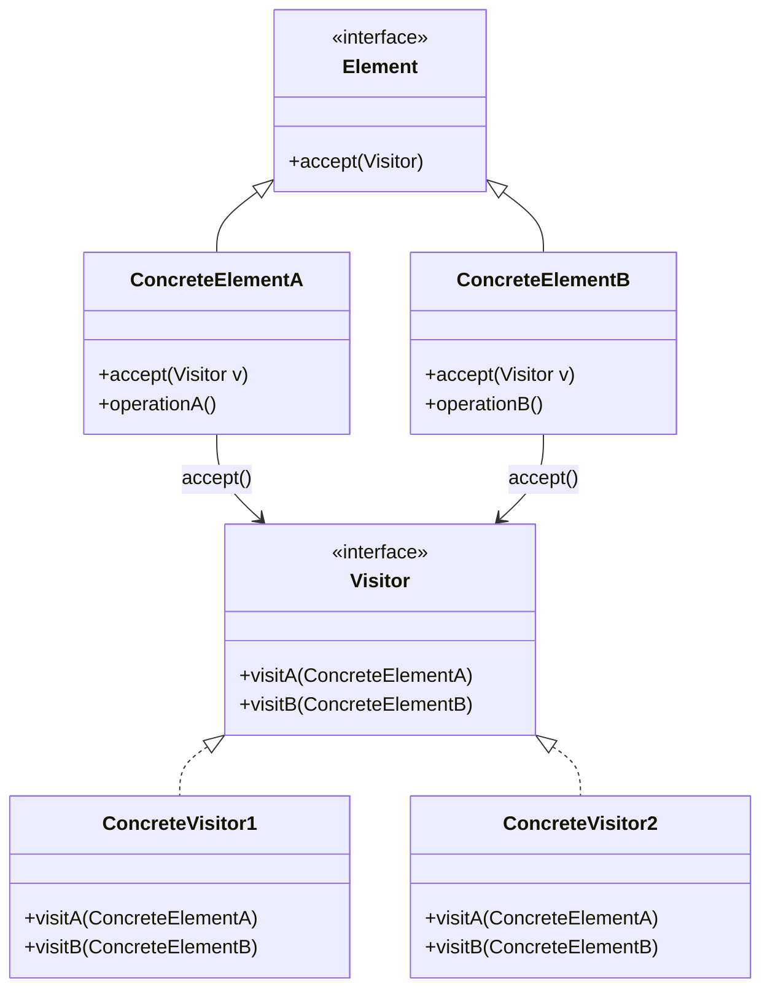

# Visitor Pattern in Field Operations

Separate Operation from Data Structure

---

## Learning Objectives

By the end of this module, you will be able to:

1. **Understand** the core principles of the Visitor Pattern and its classic implementation
2. **Analyze** how OpenFOAM adapts the Visitor Pattern using external functions instead of classic double-dispatch
3. **Evaluate** the trade-offs between method-based and external function approaches
4. **Apply** OpenFOAM's macro-based traversal patterns in custom field operations
5. **Design** extensible field operations without modifying core data structures

---

## 1. The Classic Visitor Pattern

### 1.1 Pattern Definition

> **Visitor:** Define a new operation without changing the classes of the elements on which it operates.

**Problem it solves:** When you have stable data structures but need to frequently add new operations.

### 1.2 Classic Structure



### 1.3 Double Dispatch Mechanism

```cpp
// Classic Visitor implementation
class Visitor {
public:
    virtual void visitA(ElementA* e) = 0;
    virtual void visitB(ElementB* e) = 0;
};

class Element {
public:
    virtual void accept(Visitor* v) = 0;
};

class ElementA : public Element {
public:
    void accept(Visitor* v) override {
        v->visitA(this);  // Double dispatch
    }
};

// Usage
Element* elem = new ElementA();
Visitor* visitor = new ConcreteVisitor();
elem->accept(visitor);  // Calls visitor->visitA()
```

**Key Insight:** The element accepts the visitor, then calls the appropriate visitor method. This enables type-specific behavior without modifying element classes.

---

## 2. OpenFOAM's Adaptation: External Functions

### 2.1 Why OpenFOAM Doesn't Use Classic Visitor

OpenFOAM takes a different approach that maintains the **separation principle** but avoids the complexity of double-dispatch:

| Aspect | Classic Visitor | OpenFOAM Approach |
|:---|:---|:---|
| **Dispatch** | Double dispatch (element accepts visitor) | Single function call |
| **Implementation** | Virtual functions in elements | Template functions |
| **Type Handling** | Overloaded visit methods | Template specialization |
| **Extension** | Add new Visitor subclass | Add new standalone function |
| **Performance** | Virtual function overhead | Compiler inlining |

### 2.2 Core Design: Data vs Operations

```cpp
// ❌ Method approach (what OpenFOAM avoids)
class Field {
    Field sqr() const { ... }       // Bloats the class
    Field sqrt() const { ... }
    Field mag() const { ... }
    Field sin() const { ... }
    Field cos() const { ... }
    Field exp() const { ... }
    Field log() const { ... }
    // ... 100+ methods would be needed
};

// ✅ OpenFOAM's external function approach
template<class Type>
class Field {
    // Only storage and core operations
    Type& operator[](label i);
    label size() const;
    const Type& operator[](label i) const;
};

// Separate operation files (FieldFunctions.C)
template<class Type>
tmp<Field<Type>> sqr(const UList<Type>& f);

template<class Type>
tmp<Field<Type>> sqrt(const UList<Type>& f);

template<class Type>
tmp<Field<Type>> mag(const UList<Type>& f);
```

### 2.3 Benefits of External Functions

1. **Extensibility:** Add operations without touching Field class
2. **Separation of Concerns:** Field manages storage, functions handle math
3. **Generic Programming:** Same function works for all Field types
4. **Performance:** Compiler can inline and optimize
5. **Composability:** Functions can be combined easily

```cpp
// Easy to add new operations
template<class Type>
tmp<Field<Type>> clip(const UList<Type>& f, const Type& min, const Type& max);

template<class Type>
tmp<Field<Type>> normalize(const UList<Type>& f);

// Usage composes naturally
auto result = mag(normalize(clip(field, 0, 1)));
```

---

## 3. Implementation: Macros and Traversals

### 3.1 Function Definition Macros

OpenFOAM uses macros to reduce code duplication:

```cpp
// src/OpenFOAM/fields/Fields/FieldFunctions/FieldFunctions.C

// Define sqr for all field types
UNARY_FUNCTION(Type, Type, sqr, sqr)

// UNARY_FUNCTION macro expands to:
template<class Type>
tmp<Field<Type>> sqr(const UList<Type>& f)
{
    auto tRes = tmp<Field<Type>>::New(f.size());
    Field<Type>& res = tRes.ref();
    
    TFOR_ALL_F_OP_FUNC_F(Type, res, =, ::Foam::sqr, Type, f)
    
    return tRes;
}
```

**Macro Parameters:**
- `Type`: Return type
- `Type`: Input field type
- `sqr`: Function name
- `::Foam::sqr`: Underlying scalar operation

### 3.2 Traversal Macros

The key to performance is the traversal macro:

```cpp
// src/OpenFOAM/fields/Fields/FieldFunctions/FieldFunctionsM.H

#define TFOR_ALL_F_OP_FUNC_F(typeR, fR, OP, FUNC, typeF, fF)  \
    const label _n_ = (fR).size();                             \
    for (label _n##i_ = 0; _n##i_ < _n_; ++_n##i_)             \
    {                                                          \
        (fR)[_n##i_] OP FUNC((fF)[_n##i_]);                   \
    }

// Usage in sqr function:
TFOR_ALL_F_OP_FUNC_F(scalar, res, =, ::Foam::sqr, scalar, f)

// Expands to:
const label _n_ = res.size();
for (label _n_i_ = 0; _n_i_ < _n_; ++_n_i_)
{
    res[_n_i_] = ::Foam::sqr(f[_n_i_]);
}
```

### 3.3 Why Macros? Performance Analysis

<details>
<summary><b>Technical Deep Dive: Macro Benefits</b></summary>

**1. Inlining Opportunities:**
```cpp
// Without macro (function call in loop)
for (label i = 0; i < n; ++i) {
    result[i] = sqrOp(field[i]);  // Function call overhead
}

// With macro (inlined operation)
for (label i = 0; i < n; ++i) {
    result[i] = field[i] * field[i];  // Direct computation
}
```

**2. Compiler Vectorization:**
- Simple, predictable loops → automatic SIMD optimization
- Function calls break vectorization
- Macros generate clean loops that compilers love

**3. Zero-Cost Abstraction:**
- Write operation logic once
- Macro generates optimized code for each type
- No runtime penalty

</details>

---

## 4. Expression Templates: Advanced Application

### 4.1 The Temporary Problem

Consider chained operations:

```cpp
// Naive approach creates temporary objects
Field<scalar> a = ...;
Field<scalar> b = ...;
Field<scalar> c = ...;

// Each operation creates a temporary!
Field<scalar> temp1 = a + b;      // Temporary 1
Field<scalar> temp2 = temp1 * c;   // Temporary 2
Field<scalar> result = mag(temp2); // Temporary 3
```

**Problems:**
- Memory allocation overhead
- Multiple loop traversals
- Cache inefficiency

### 4.2 Expression Template Solution

OpenFOAM delays evaluation:

```cpp
// src/OpenFOAM/fields/Fields/Field/FieldFieldFunctions.H

template<class T1, class T2>
class FieldBinaryOp
{
    const T1& a_;
    const T2& b_;
    
public:
    FieldBinaryOp(const T1& a, const T2& b)
    : a_(a), b_(b) {}
    
    scalar operator[](label i) const
    {
        return a_[i] + b_[i];  // Computed on access
    }
    
    label size() const { return a_.size(); }
};

// Operator returns expression, not result
template<class T1, class T2>
FieldBinaryOp<T1,T2> operator+(const T1& a, const T2& b)
{
    return FieldBinaryOp<T1,T2>(a, b);
}
```

### 4.3 Single-Loop Evaluation

```cpp
// Expression building (no computation)
auto expr = mag((a + b) * c);  // Just builds expression tree

// Final evaluation (single loop)
Field<scalar> result = expr;   // Computes everything in one pass

// Equivalent to:
for (label i = 0; i < result.size(); ++i) {
    result[i] = mag((a[i] + b[i]) * c[i]);  // Single pass!
}
```

**Performance Impact:**
- **Memory:** O(n) instead of O(3n)
- **Loops:** 1 instead of 3
- **Cache:** Better locality

---

## 5. Applying to Your Own Code

### 5.1 Custom Field Operations

When implementing custom field operations:

```cpp
// myFieldFunctions.H
#ifndef myFieldFunctions_H
#define myFieldFunctions_H

#include "Field.H"
#include "tmp.H"

namespace Foam {

// Smooth field with simple averaging
template<class Type>
tmp<Field<Type>> smooth
(
    const UList<Type>& f,
    label iters = 1
)
{
    auto tRes = tmp<Field<Type>>::New(f);
    Field<Type>& res = tRes.ref();
    
    for (label iter = 0; iter < iters; ++iter)
    {
        // Create working copy
        Field<Type> work = res;
        
        // Interior points: average with neighbors
        for (label i = 1; i < f.size() - 1; ++i)
        {
            res[i] = 0.25*work[i-1] + 0.5*work[i] + 0.25*work[i+1];
        }
        // Boundary: keep original
        res[0] = work[0];
        res[f.size()-1] = work[f.size()-1];
    }
    
    return tRes;
}

// Clip values to range
template<class Type>
tmp<Field<Type>> clip
(
    const UList<Type>& f,
    const Type& minVal,
    const Type& maxVal
)
{
    auto tRes = tmp<Field<Type>>::New(f);
    Field<Type>& res = tRes.ref();
    
    forAll(f, i) {
        res[i] = max(minVal, min(maxVal, f[i]));
    }
    
    return tRes;
}

// Normalize to [0,1]
template<class Type>
tmp<Field<Type>> normalize(const UList<Type>& f)
{
    Type minVal = Foam::min(f);
    Type maxVal = Foam::max(f);
    Type range = maxVal - minVal;
    
    auto tRes = tmp<Field<Type>>::New(f);
    Field<Type>& res = tRes.ref();
    
    if (range > SMALL) {
        forAll(f, i) {
            res[i] = (f[i] - minVal) / range;
        }
    } else {
        res = Type(0);
    }
    
    return tRes;
}

} // namespace Foam

#endif
```

### 5.2 Usage Example

```cpp
// customSolver.C
#include "myFieldFunctions.H"

// ... in solver
volScalarField T = ...;

// Chain operations (no temporaries until final assignment)
auto processed = clip(normalize(smooth(T, 5)), 0.0, 1.0);

// Single evaluation loop
volScalarField Tnormalized = processed;
```

### 5.3 Best Practices

1. **Follow naming conventions:** `sqr()`, `mag()`, not `square()`, `magnitude()`
2. **Use tmp smart pointer:** Avoid unnecessary copies
3. **Return by value:** RVO/move semantics handle efficiency
4. **Document complexity:** Note O(n) vs O(n²) operations
5. **Handle boundaries:** Document boundary treatment

---

## 6. Comparison with Related Patterns

### 6.1 Pattern Comparison Matrix

| Pattern | Primary Purpose | OpenFOAM Usage | Extension Point |
|:---|:---|:---|:---|
| **Visitor** | Add operations without changing elements | External field functions | New functions |
| **Strategy** | Select algorithm at runtime | fvSchemes (divScheme, laplacianScheme) | New scheme classes |
| **Template Method** | Define algorithm skeleton, vary steps | Time integration (ODE solver) | Override steps |
| **Factory** | Create objects without specifying concrete types | Run-time selection (New, NewNamed) | New types |

### 6.2 When to Use External Functions vs Other Patterns

**Use External Functions when:**
- Operating on stable data structures
- Adding many independent operations
- Performance is critical (inlining needed)
- Operations don't maintain state

**Use Classic Visitor when:**
- Need to maintain visitor state
- Operations require type-specific behavior
- Complex traversal logic needed

**Use Strategy Pattern when:**
- Selecting between algorithms at runtime
- Algorithms have different complexity/accuracy trade-offs

---

## 7. Common Pitfalls and Debugging

### 7.1 Common Mistakes

**Mistake 1: Returning by value instead of tmp**

```cpp
// ❌ Inefficient (creates copy)
Field<scalar> sqr(const Field<scalar>& f) {
    Field<scalar> result(f.size());
    // ... computation
    return result;  // Copy!
}

// ✅ Efficient (moves or reuses)
tmp<Field<scalar>> sqr(const Field<scalar>& f) {
    auto tRes = tmp<Field<scalar>>::New(f);
    // ... computation
    return tRes;  // Move or reuse
}
```

**Mistake 2: Not handling boundaries**

```cpp
// ❌ Ignores boundary conditions
forAll(f, i) {
    res[i] = 0.5*f[i-1] + 0.5*f[i+1];  // What about i=0?
}

// ✅ Handles boundaries correctly
for (label i = 1; i < f.size()-1; ++i) {
    res[i] = 0.5*f[i-1] + 0.5*f[i+1];
}
res[0] = f[0];  // Boundary treatment
```

### 7.2 Debugging Techniques

**Trace Macro Expansion:**

```bash
# Preprocess to see macro expansion
wmake g++ -E -I$FOAM_SRC/OpenFOAM/lnInclude \
    myFieldFunctions.C > myFieldFunctions.pre.C
```

**Check Generated Code:**

```cpp
// Before preprocessing
TFOR_ALL_F_OP_FUNC_F(scalar, res, =, ::Foam::sqr, scalar, f)

// After preprocessing (simplified)
const label _n_ = res.size();
for (label _n_i_ = 0; _n_i_ < _n_; ++_n_i_) {
    res[_n_i_] = ::Foam::sqr(f[_n_i_]);
}
```

---

## 8. Concept Check

<details>
<summary><b>1. How does OpenFOAM's approach differ from the classic Visitor Pattern?</b></summary>

**Classic Visitor:**
```cpp
element->accept(visitor);  // Double dispatch via virtual functions
visitor->visitA(element);
```

**OpenFOAM:**
```cpp
result = operation(field);  // Single function call, templates
```

**Key Differences:**
- No double dispatch (single function call)
- Templates instead of virtual functions
- No visitor objects (stateless functions)
- Better inlining and optimization opportunities

**Same Principle:**
Both separate operations from data structures for extensibility.
</details>

<details>
<summary><b>2. Why use macros for field traversals instead of inline functions?</b></summary>

**Inline Functions:**
```cpp
inline void applySqr(Field<scalar>& res, const Field<scalar>& f) {
    for (label i = 0; i < f.size(); ++i) {
        res[i] = sqr(f[i]);  // Still a function call
    }
}
```

**Macros:**
```cpp
#define TFOR_ALL_F_OP_FUNC_F(typeR, fR, OP, FUNC, typeF, fF) \
    for (label i = 0; i < (fR).size(); ++i) { \
        (fR)[i] OP FUNC((fF)[i]);  // Directly inlined
    }
```

**Macro Advantages:**
1. **Full inlining:** `FUNC` expands to actual operation
2. **Vectorization:** Clean loops enable SIMD
3. **Zero abstraction cost:** No function call overhead
4. **Type flexibility:** Works with any type combination

**Trade-off:** Harder to debug (preprocess to see expanded code)
</details>

<details>
<summary><b>3. When should you implement a custom field operation as an external function vs a method?</b></summary>

**Use External Function (Recommended):**
```cpp
// ✅ Separate from Field class
tmp<Field<scalar>> myOperation(const Field<scalar>& f);
```
- When operation is general-purpose
- When it doesn't need access to private data
- When it applies to multiple field types
- For better testability and composability

**Use Method:**
```cpp
// ⚠️ Only when necessary
class Field {
    Type* data_;
    label size_;
    
    Type& internalAccess(label i) { return data_[i]; }  // Needs private
};
```
- When operation requires private data access
- When it's core functionality specific to Field
- Rare in OpenFOAM (most things are external)
</details>

---

## 9. Exercises

### Exercise 1: Implement Custom Operations

```cpp
// Implement these operations:

// 1. Gradient using central differences
template<class Type>
tmp<Field<Type>> gradient(const UList<Type>& f);

// 2. Clip values to [min, max]
template<class Type>
tmp<Field<Type>> clip(const UList<Type>& f, const Type& min, const Type& max);

// 3. Apply periodic boundary conditions
template<class Type>
tmp<Field<Type>> applyPeriodic(const UList<Type>& f);

// Test:
Field<scalar> test(100, 0.0);
forAll(test, i) test[i] = sin(i * 0.1);

auto grad = gradient(test);
auto clipped = clip(test, -0.5, 0.5);
```

### Exercise 2: Macro Expansion

```bash
# Investigate macro expansion
cd $FOAM_SRC/OpenFOAM/fields/Fields/FieldFunctions
wclean
wmake g++ -E FieldFunctions.C | grep -A 10 "TFOR_ALL_F_OP_FUNC_F"
```

**Questions:**
1. What does `UNARY_FUNCTION` expand to?
2. How many loop variants are defined?
3. What's the difference between `TFOR_ALL_F_OP_FUNC_F` and `TFOR_ALL_F_OP_F`?

### Exercise 3: Expression Template Chain

```cpp
// Build expression tree
Field<scalar> a(100), b(100), c(100);
// Initialize a, b, c

// Measure performance
auto start = std::chrono::high_resolution_clock::now();

// Version 1: Naive (creates temporaries)
Field<scalar> result1 = ((a + b) * c).mag();

// Version 2: Expression template (no temporaries)
auto expr = ((a + b) * c).mag();
Field<scalar> result2 = expr;

auto end = std::chrono::high_resolution_clock::now();
// Compare timing
```

**Bonus:** Profile with `perf` or Instruments to see loop vectorization.

### Exercise 4: Design Decision

You're implementing a new turbulence model. You need to compute:

1. Strain rate magnitude: `mag(symm(grad(U)))`
2. Vorticity magnitude: `mag(skew(grad(U)))`
3. Production term: `2*nut*magSqr(symm(grad(U)))`

**Questions:**
1. Should these be methods in `turbulenceModel` or external functions?
2. How would you structure the code for reusability?
3. What performance considerations apply?

---

## 10. Key Takeaways

1. **OpenFOAM adapts Visitor Pattern principles** using external functions instead of classic double-dispatch
2. **Separation of data and operations** enables extensibility without modifying core Field classes
3. **Macros enable zero-cost abstractions** by generating clean, vectorizable loops
4. **Expression templates eliminate temporaries** in chained operations through delayed evaluation
5. **Prefer external functions over methods** for field operations to maintain composability
6. **Template metaprogramming powers** OpenFOAM's performance through compile-time optimization
7. **Understanding macro expansion** is essential for debugging field function implementations

---

## 11. Further Reading

- **OpenFOAM Source:** `src/OpenFOAM/fields/Fields/FieldFunctions/`
- **Expression Templates:** Veldhuizen, "Techniques for Scientific C++"
- **Template Metaprogramming:** Abrahams, Gurtovoy "C++ Template Metaprogramming"
- **Related Patterns:** 
  - [Strategy Pattern in fvSchemes](../03_DESIGN_PATTERNS/03_Strategy_Pattern.md)
  - [Template Method Pattern](../03_DESIGN_PATTERNS/02_Template_Method_Pattern.md)

---

## เอกสารที่เกี่ยวข้อง

- **ก่อนหน้า:** [Singleton MeshObject](03_Singleton_MeshObject.md)
- **ถัดไป:** [CRTP Pattern](05_CRTP_Pattern.md)