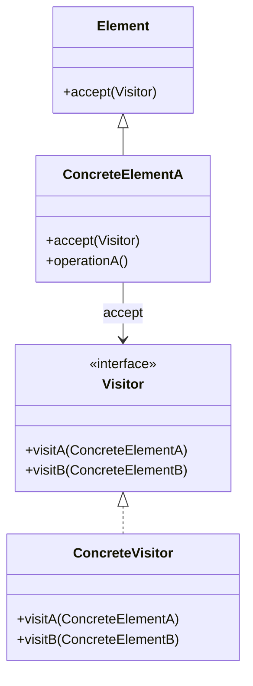

# Visitor Pattern in Field Operations

Separate Operation from Data Structure

---

## The Pattern

> **Visitor:** กำหนด operation ใหม่โดยไม่ต้องแก้ class ของ elements ที่จะ operate



**Key Benefit:** เพิ่ม operation ใหม่ได้โดยไม่แก้ data classes

---

## OpenFOAM's Approach: External Functions

OpenFOAM ไม่ใช้ Visitor Pattern แบบ classic แต่ใช้หลักการเดียวกัน:

```cpp
// Instead of:
class Field {
    Field sqr() { ... }      // Method in class
    Field sqrt() { ... }
    Field mag() { ... }
    // ... 100+ methods??
};

// OpenFOAM uses:
template<class Type>
tmp<Field<Type>> sqr(const UList<Type>& f);  // External function

tmp<Field<Type>> sqrt(const UList<Type>& f);
tmp<Field<Type>> mag(const UList<Type>& f);
```

**Separation:** Data (Field) แยกจาก Operations (functions)

---

## Implementation with Macros

```cpp
// FieldFunctions.C

// Define sqr for all types
UNARY_FUNCTION(Type, Type, sqr, sqr)

// Macro expands to:
template<class Type>
tmp<Field<Type>> sqr(const UList<Type>& f)
{
    auto tRes = tmp<Field<Type>>::New(f.size());
    Field<Type>& res = tRes.ref();
    
    TFOR_ALL_F_OP_FUNC_F(Type, res, =, ::Foam::sqr, Type, f)
    
    return tRes;
}
```

---

## The Traversal Macros

```cpp
// FieldFunctionsM.H

#define TFOR_ALL_F_OP_FUNC_F(typeR, fR, OP, FUNC, typeF, fF)  \
    const label _n_ = (fR).size();                             \
    for (label _i_ = 0; _i_ < _n_; ++_i_)                      \
    {                                                          \
        (fR)[_i_] OP FUNC((fF)[_i_]);                         \
    }

// Usage:
TFOR_ALL_F_OP_FUNC_F(scalar, result, =, ::Foam::sqr, scalar, f)

// Expands to:
for (label i = 0; i < result.size(); ++i)
{
    result[i] = ::Foam::sqr(f[i]);
}
```

> [!NOTE]
> **ทำไมใช้ Macro?**
> - Compiler สามารถ inline และ vectorize ได้
> - Function overhead ลดลง
> - เขียน loop pattern ครั้งเดียว ใช้ได้กับทุก operation

---

## Benefits

| Benefit | How |
|:---|:---|
| **Extensibility** | เพิ่ม function ใหม่โดยไม่แก้ Field class |
| **Separation** | Field ดูแล storage, Functions ดูแล math |
| **Generic** | Function ทำงานกับทุก Field type |
| **Performance** | Compiler optimization |

---

## Comparison: Method vs External

### Method Approach (Not Used)

```cpp
class Field<scalar> {
    Field sqr() const;
    Field sqrt() const;
    Field sin() const;
    Field cos() const;
    // ... hundreds of methods
};

// Problem: Field class เต็มไปด้วย methods!
```

### External Function Approach (Used)

```cpp
class Field<Type> {
    // Only data and core operations
    Type& operator[](label);
    label size();
};

// Separate files
tmp<Field<Type>> sqr(const Field<Type>&);
tmp<Field<Type>> sqrt(const Field<Type>&);
// ... can add more without changing Field
```

---

## Expression Templates (Advanced Visitor)

OpenFOAM ใช้ pattern เดียวกันกับ binary operations:

```cpp
// Instead of creating temporaries:
Field<scalar> c = a + b;  // Creates temp for a+b

// Expression templates delay evaluation:
auto expr = a + b;        // No temporary yet
Field<scalar> c = expr;   // Evaluate in single loop
```

```cpp
// Implementation
template<class T1, class T2>
class FieldBinaryOp
{
    const T1& a_;
    const T2& b_;
public:
    scalar operator[](label i) const
    {
        return a_[i] + b_[i];  // Computed on access
    }
};

template<class T1, class T2>
FieldBinaryOp<T1,T2> operator+(const T1& a, const T2& b)
{
    return FieldBinaryOp<T1,T2>(a, b);
}
```

---

## Applying to Your Own Code

### Custom Field Operations

```cpp
// myFieldFunctions.H

// Add new operation without modifying Field
template<class Type>
tmp<Field<Type>> mySmooth(const Field<Type>& f, label iters)
{
    auto tRes = tmp<Field<Type>>::New(f);
    
    for (label i = 0; i < iters; ++i)
    {
        // Smoothing logic
    }
    
    return tRes;
}

// Usage
volScalarField smoothedT = mySmooth(T, 5);
```

---

## Concept Check

<details>
<summary><b>1. OpenFOAM ใช้ Visitor Pattern อย่างไร?</b></summary>

**ไม่ใช่ classic Visitor** แต่ใช้หลักการเดียวกัน:

- **Data classes (Elements):** `Field<Type>`, `volScalarField`
- **Operations (Visitors):** External functions เช่น `sqr()`, `mag()`

**Advantage:** เพิ่ม operation ใหม่แค่เพิ่ม function ใหม่

```cpp
// Classic Visitor
element.accept(visitor);  // Double dispatch

// OpenFOAM style
result = operation(field);  // Just a function call
```
</details>

<details>
<summary><b>2. ทำไม Macro สำคัญสำหรับ performance?</b></summary>

**Inlining:**
```cpp
// Without macro (function call overhead)
for (i...) { result[i] = sqr(f[i]); }  // Function call each iter

// With macro (inlined)
for (i...) { result[i] = f[i] * f[i]; }  // Direct computation
```

**Vectorization:**
- Loop ที่ simple และ predictable → compiler auto-vectorize
- Function call breaks vectorization
</details>

---

## Exercise

1. **Add Custom Op:** เขียน `clip(field, min, max)` function
2. **Trace Macro:** ใช้ `-E` flag เพื่อดู macro expansion
3. **Benchmark:** เปรียบเทียบ inline function vs macro

---

## เอกสารที่เกี่ยวข้อง

- **ก่อนหน้า:** [Singleton MeshObject](03_Singleton_MeshObject.md)
- **ถัดไป:** [CRTP Pattern](05_CRTP_Pattern.md)
