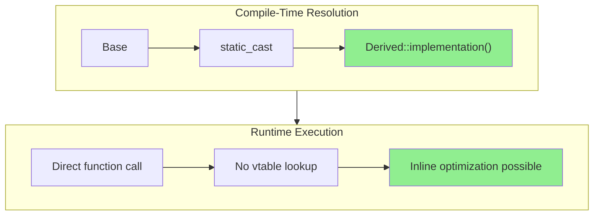

# CRTP: Curiously Recurring Template Pattern

## Zero-Cost Compile-Time Polymorphism

---

## Learning Objectives

By the end of this section, you will be able to:

1. **Understand** the CRTP pattern mechanics and why it enables static polymorphism
2. **Analyze** OpenFOAM's use of CRTP in `GeometricField` and related classes
3. **Apply** CRTP to eliminate virtual function overhead in performance-critical code
4. **Design** mixin classes that add functionality without virtual inheritance
5. **Evaluate** when CRTP is appropriate versus when it's overkill
6. **Compare** CRTP with virtual functions, understanding trade-offs

---

## Key Takeaways

- **CRTP enables compile-time polymorphism** by passing the derived class as a template parameter to its base class
- **Zero runtime cost** - no vtable lookups, functions can be inlined by the compiler
- **OpenFOAM uses CRTP extensively** in `GeometricField` for type-safe field operations
- **Perfect for mixin functionality** - adding capabilities like reference counting, serialization, or cloning
- **Not always worth the complexity** - use when performance matters or for library code
- **Three main use cases:** static polymorphism, mixins, and interface implementation automation

---

## 1. The CRTP Pattern

### 1.1 Basic Definition

> **CRTP (Curiously Recurring Template Pattern):** A C++ idiom where a class derives from a template base class, passing itself as the template parameter.

```cpp
template<class Derived>
class Base {
public:
    void interface() {
        // Cast to derived type and call its implementation
        static_cast<Derived*>(this)->implementation();
    }
};

class Derived : public Base<Derived> {
public:
    void implementation() {
        // Actual implementation
    }
};
```

**The "Curious" Part:** The derived class appears in its own base class specification!

### 1.2 How It Works



**Key Insight:** The base class knows the derived type at compile time through the template parameter. This enables:

1. **Static polymorphism** - Different behavior without virtual functions
2. **Type-safe downcasting** - No `dynamic_cast` needed
3. **Compile-time optimization** - Inlining and devirtualization

---

## 2. CRTP vs Virtual Functions

### 2.1 Performance Comparison

| Aspect | Virtual Functions | CRTP |
|:---|:---|:---|
| **Dispatch mechanism** | vtable lookup (runtime) | `static_cast` (compile-time) |
| **Overhead per call** | 1-3 CPU cycles (indirect jump) | 0 cycles (direct call) |
| **Inlining possible?** | Rarely (call site doesn't know type) | Yes (type known at compile time) |
| **Binary size** | Smaller (one function) | Larger (each instantiation) |
| **Runtime flexibility** | ✅ Can change derived type at runtime | ❌ Type fixed at compilation |
| **Compilation time** | Fast | Slower (more template instantiations) |
| **Error messages** | Clear | Cryptic template errors |

### 2.2 Code Comparison

**Virtual Function Approach:**
```cpp
// Runtime polymorphism
class Field {
public:
    virtual scalar magSqr() const = 0;
    virtual ~Field() = default;
};

class volScalarField : public Field {
    scalar magSqr() const override {
        return Foam::sumSqr(*this);
    }
};

// Usage - requires pointer/reference
void processField(const Field& field) {
    scalar m = field.magSqr();  // vtable lookup
}
```

**CRTP Approach:**
```cpp
// Compile-time polymorphism
template<class Derived>
class FieldBase {
public:
    scalar magSqr() const {
        return static_cast<const Derived*>(this)->magSqrImpl();
    }
};

class volScalarField : public FieldBase<volScalarField> {
public:
    scalar magSqrImpl() const {
        return Foam::sumSqr(*this);
    }
};

// Usage - direct call, can be inlined
void processField(const volScalarField& field) {
    scalar m = field.magSqr();  // Direct call, inlinable
}
```

---

## 3. OpenFOAM Example: GeometricField

### 3.1 The Real Implementation

OpenFOAM's `GeometricField` uses CRTP for type-safe polymorphic behavior:

```cpp
// $FOAM_SRC/OpenFOAM/fields/GeometricFields/GeometricField/GeometricField.H

template<class Type, template<class> class PatchField, class GeoMesh>
class GeometricField
:
    public DimensionedField<Type, GeoMesh>,
    public GeometricMeshObject<GeometricField<Type, PatchField, GeoMesh>>
//  ^^^^^^^^^^^^^^^^^^^^^^^^^^^^^^^^^^^^^^^^^^^^^^^^^^^^^^^^^^^^^^^^^^^^
//  CRTP: Pass this exact type to base template!
{
    // ...
};
```

**Why This Works:**
- `GeometricMeshObject<GeometricField<...>>` receives the complete type
- Base class can provide methods that return the exact derived type
- Enables type-safe field operations without virtual functions

### 3.2 GeometricMeshObject Implementation

```cpp
// Simplified GeometricMeshObject
template<class ObjectType>
class GeometricMeshObject
{
public:
    // Static null object - returns correct derived type!
    static const ObjectType& null()
    {
        static ObjectType nullObject;
        return nullObject;
    }

    // Size delegates to derived class's primitiveField()
    label size() const
    {
        return static_cast<const ObjectType*>(this)->primitiveField().size();
    }

    // Clone returns correct ObjectType (not base!)
    tmp<ObjectType> clone() const
    {
        return tmp<ObjectType>::New(
            *static_cast<const ObjectType*>(this)
        );
    }
};
```

**Benefits:**
1. **Type-safe cloning** - Returns `volScalarField`, not `GeometricField`
2. **No virtual functions** - All calls resolved at compile time
3. **Static null object** - Type-safe singleton access

### 3.3 Field Operation Example

```cpp
// When you write:
volScalarField p(mesh);
volScalarField p2 = p + p;

// What happens (simplified):
template<class Type>
class GeometricField {
    // operator+ returns same type as input (CRTP enables this!)
    auto operator+(const GeometricField& other) const {
        GeometricField result(*this);  // Same type!
        result.primitiveFieldRef() += other.primitiveField();
        return result;
    }
};
```

**Without CRTP:** Would return base type, losing type information

**With CRTP:** Returns exact derived type, preserving type safety

---

## 4. CRTP Use Cases

### 4.1 Static Polymorphism

**Scenario:** Multiple field types with common interface

```cpp
template<class Derived>
class TensorOperations {
public:
    // Common operation available to all derived types
    auto trace() const {
        const auto& self = *static_cast<const Derived*>(this);
        return tr(self);  // OpenFOAM trace function
    }

    auto deviatoric() const {
        const auto& self = *static_cast<const Derived*>(this);
        return dev(self);  // OpenFOAM deviatoric
    }
};

class volSymmTensorField
    : public GeometricField<symmTensor, ...>,
      public TensorOperations<volSymmTensorField>
{
    // Inherits trace(), deviatoric() automatically
};

class surfaceTensorField
    : public GeometricField<tensor, ...>,
      public TensorOperations<surfaceTensorField>
{
    // Inherits trace(), deviatoric() automatically
};
```

### 4.2 Mixin Classes

**Scenario:** Add reference counting to any class

```cpp
template<class Derived>
class ReferenceCounted {
    mutable int refCount_ = 0;

public:
    void addRef() const { ++refCount_; }
    void release() const { if (--refCount_ == 0) delete this; }
    int count() const { return refCount_; }

protected:
    ~ReferenceCounted() = default;  // Protected deletion
};

class MyCustomField
    : public Field<scalar>,
      public ReferenceCounted<MyCustomField>
{
    // Now has reference counting!
};

// Usage
MyCustomField* field = new MyCustomField();
field->addRef();
// ... use field
field->release();  // Auto-delete if count reaches 0
```

### 4.3 Interface Implementation Automation

**Scenario:** Automatically implement operators from one primitive

```cpp
template<class Derived>
class ComparableOperators {
public:
    // Implement != from ==
    bool operator!=(const Derived& other) const {
        return !(*static_cast<const Derived*>(this) == other);
    }

    // Implement > from <
    bool operator>(const Derived& other) const {
        return other < *static_cast<const Derived*>(this);
    }

    // Implement <= from <
    bool operator<=(const Derived& other) const {
        return !(*static_cast<const Derived*>(this) > other);
    }

    // Implement >= from <
    bool operator>=(const Derived& other) const {
        return !(*static_cast<const Derived*>(this) < other);
    }
};

// User only implements == and <
class Vector
    : public ComparableOperators<Vector>
{
public:
    bool operator==(const Vector& other) const { /* ... */ }
    bool operator<(const Vector& other) const { /* ... */ }
    // !=, >, <=, >= are auto-generated!
};
```

---

## 5. When CRTP Is Overkill

### 5.1 Use Virtual Functions Instead When:

| Scenario | Reason |
|:---|:---|
| **Runtime type selection** | Need `fvSchemes` dictionary to pick scheme |
| **Plugin architecture** | Load schemes from shared libraries |
| **Heterogeneous containers** | `List<unique_ptr<turbulenceModel>>` |
| **Simpler code preferred** | Team not experienced with templates |
| **Rarely called functions** | Performance gain negligible |

### 5.2 Example: When NOT to Use CRTP

```cpp
// ❌ BAD: CRTP for runtime-selected schemes
template<class Derived>
class TurbulenceModelBase {
    // Derived type fixed at compile time!
    // Cannot select from dictionary at runtime
};

// ❌ BAD: CRTP for rarely-used utilities
template<class Derived>
class FieldIOHelper {
    // I/O operations are slow anyway
    // Virtual overhead negligible
    // Template complexity not worth it
};

// ✅ GOOD: Virtual for runtime selection
class turbulenceModel {
    declareRunTimeSelectionTable(
        autoPtr,
        turbulenceModel,
        dictionary,
        (const volScalarField& rho, const volVectorField& U, const surfaceScalarField& phi),
        (rho, U, phi)
    );

    virtual tmp<volSymmTensorField> devReff() const = 0;
    // Can select from dictionary at runtime!
};
```

### 5.3 Decision Matrix

| Factor | Use CRTP | Use Virtual |
|:---|:---:|:---:|
| **Called in tight loops** | ✅ | ❌ |
| **Type known at compile time** | ✅ | ❌ |
| **Runtime selection needed** | ❌ | ✅ |
| **Heterogeneous container** | ❌ | ✅ |
| **Library code (reused often)** | ✅ | ⚠️ |
| **Application-specific code** | ⚠️ | ✅ |
| **Team template expertise** | ⚠️ | ✅ |

---

## 6. Applying to Your Own Code

### 6.1 Step-by-Step: Creating a CRTP Base

**Step 1: Identify Common Interface**

```cpp
// You have multiple matrix types with similar operations
class denseMatrix { /* ... */ };
class sparseMatrix { /* ... */ };
class diagonalMatrix { /* ... */ };

// All need: trace(), determinant(), inverse()
```

**Step 2: Create CRTP Base**

```cpp
// matrixOperations.H
template<class Derived>
class matrixOperations {
public:
    auto trace() const {
        const auto& self = *static_cast<const Derived*>(this);
        return self.traceImpl();
    }

    auto determinant() const {
        const auto& self = *static_cast<const Derived*>(this);
        return self.determinantImpl();
    }

    auto inverse() const {
        const auto& self = *static_cast<const Derived*>(this);
        return self.inverseImpl();
    }
};
```

**Step 3: Implement in Derived Classes**

```cpp
class denseMatrix
    : public matrixOperations<denseMatrix>
{
public:
    scalar traceImpl() const {
        // Efficient dense implementation
        scalar sum = 0;
        for (label i = 0; i < n(); ++i) sum += (*this)(i, i);
        return sum;
    }

    scalar determinantImpl() const {
        // LU decomposition
    }

    denseMatrix inverseImpl() const {
        // Gaussian elimination
    }
};

class sparseMatrix
    : public matrixOperations<sparseMatrix>
{
public:
    scalar traceImpl() const {
        // Only iterate non-zero diagonal elements
        scalar sum = 0;
        for (const auto& entry : diagonal_) {
            sum += entry.value;
        }
        return sum;
    }

    scalar determinantImpl() const {
        // Sparse-specific algorithm
    }

    sparseMatrix inverseImpl() const {
        // Sparse approximate inverse
    }
};
```

**Step 4: Use Uniformly**

```cpp
// Same interface for all matrix types
template<class MatrixType>
scalar processMatrix(const MatrixType& mat) {
    scalar t = mat.trace();          // Works for any type!
    scalar d = mat.determinant();
    auto inv = mat.inverse();
    return t / d;
}

// Compiler generates optimized code for each type
denseMatrix A(100, 100);
scalar r1 = processMatrix(A);  // Uses denseMatrix implementations

sparseMatrix B(1000, 1000);
scalar r2 = processMatrix(B);  // Uses sparseMatrix implementations
```

### 6.2 Practical Example: CFD Solver Component

**Scenario:** Custom turbulence model with reusable utilities

```cpp
// turbulenceUtilities.H
template<class Derived>
class turbulenceUtils {
public:
    // Common blending function for all models
    tmp<volScalarField> F1(const volScalarField& CDkOmega) const {
        const auto& self = *static_cast<const Derived*>(this);

        tmp<volScalarField> tF1(
            new volScalarField(
                IOobject("F1", self.mesh().time().timeName(),
                        self.mesh(), IOobject::NO_READ, IOobject::NO_WRITE),
                self.mesh(),
                dimensionedScalar("F1", dimless, 0)
            )
        );

        volScalarField& F1 = tF1.ref();

        // Standard F1 blending (same for kOmega, kOmegaSST, etc.)
        F1 = tanh(pow4(scalar(100) * self.y() * CDkOmega));

        return tF1;
    }
};

// Your custom model
class myCustomModel
    : public turbulenceModel,
      public turbulenceUtils<myCustomModel>
{
    const volScalarField& y() const { return y_; }

    // F1 is inherited from turbulenceUtils!
    // No need to reimplement
};
```

---

## 7. Common Pitfalls

### 7.1 Infinite Recursion

```cpp
// ❌ WRONG: Calls itself, not derived
template<class Derived>
class Base {
public:
    void method() {
        method();  // Infinite recursion!
    }
};

// ✅ CORRECT: Cast to derived first
template<class Derived>
class Base {
public:
    void method() {
        static_cast<Derived*>(this)->method();
    }
};
```

### 7.2 Forgetting to Implement Derived Method

```cpp
// ❌ WRONG: Derived doesn't implement required method
template<class Derived>
class Base {
public:
    void interface() {
        static_cast<Derived*>(this)->implementation();
    }
};

class Derived : public Base<Derived> {
    // Forgot to implement implementation()!
    // Linker error or undefined behavior
};

// ✅ CORRECT: Implement in derived
class Derived : public Base<Derived> {
public:
    void implementation() { /* ... */ }
};
```

### 7.3 Slicing

```cpp
// ⚠️ CAUTION: Slicing loses CRTP benefits
Base<Derived>* ptr = new Derived();
Base<Derived> value = *ptr;  // Slicing! Loses derived part

// ✅ Store by pointer/reference
Base<Derived>* ptr = new Derived();
Base<Derived>& ref = *ptr;
```

---

## 8. Concept Check

<details>
<summary><b>1. Why does OpenFOAM use CRTP in GeometricField instead of virtual functions?</b></summary>

**Performance:**
- Field operations called millions of times per timestep
- vtable lookup (1-3 cycles) × millions = significant overhead
- CRTP enables inlining: 0 cycles overhead

**Type Safety:**
```cpp
// With virtual: Returns base type
virtual GeometricField& operator+(const GeometricField&) const;
// volScalarField + volScalarField → GeometricField& (wrong!)

// With CRTP: Returns exact type
auto operator+(const GeometricField& other) const;
// volScalarField + volScalarField → volScalarField (correct!)
```

**No Runtime Selection Needed:**
- Field type known at compilation
- No dictionary-based selection (unlike turbulence models)
- Template instantiation generates optimized code for each field type
</details>

<details>
<summary><b>2. When should I use CRTP versus virtual functions in my own code?</b></summary>

**Use CRTP when:**
- ✅ Performance-critical inner loops
- ✅ All types known at compile time
- ✅ Building reusable library code
- ✅ Need mixin functionality (reference counting, serialization)

**Use Virtual Functions when:**
- ✅ Need runtime selection (RTS, plugin system)
- ✅ Storing heterogeneous types in container
- ✅ Team lacks template expertise
- ✅ Function called rarely (I/O, initialization)

**Example Decision:**
```cpp
// CRTP: Field algebra (called millions of times)
template<class T>
auto operator+(const Field<T>& a, const Field<T>& b);

// Virtual: Turbulence model selection (called once per timestep)
class turbulenceModel {
    virtual tmp<volSymmTensorField> devReff() const = 0;
};
```
</details>

<details>
<summary><b>3. What happens to the `static_cast` at compile time?</b></summary>

**Optimization:**
```cpp
// Source code
static_cast<Derived*>(this)->method();

// After template instantiation
Derived* d = static_cast<Derived*>(this);
d->method();

// After compiler optimization (this pointer is already Derived*)
// this->method();

// After inlining
// ... method body directly inserted ...
```

**Key Points:**
1. `this` in base class is actually `Derived*` (inheritance layout)
2. `static_cast<Derived*>` is effectively a no-op (just tells compiler the type)
3. Function call becomes direct call (not virtual dispatch)
4. Compiler can inline the implementation

**Verification:**
```bash
# Check assembly
g++ -S -O2 myCode.C
grep "method" myCode.s
# Should see direct CALL, not indirect jump through vtable
```
</details>

---

## 9. Exercises

### Exercise 1: Implement CRTP Arithmetic

```cpp
// Create a CRTP base for arithmetic operations
template<class Derived>
class ArithmeticOps {
public:
    // TODO: Implement operator+ that calls derived's addImpl()
    // TODO: Implement operator* that calls derived's multiplyImpl()
};

class MyVector
    : public ArithmeticOps<MyVector>
{
    scalar data_[3];

public:
    MyVector addImpl(const MyVector& other) const {
        MyVector result;
        for (int i = 0; i < 3; ++i) {
            result.data_[i] = data_[i] + other.data_[i];
        }
        return result;
    }

    MyVector multiplyImpl(scalar s) const {
        MyVector result;
        for (int i = 0; i < 3; ++i) {
            result.data_[i] = data_[i] * s;
        }
        return result;
    }
};

// Test
MyVector v1, v2;
MyVector v3 = v1 + v2;       // Should work!
MyVector v4 = v1 * 2.0;      // Should work!
```

### Exercise 2: Performance Comparison

```cpp
// Benchmark virtual vs CRTP
class VirtualBase {
public:
    virtual scalar compute(scalar x) = 0;
    virtual ~VirtualBase() = default;
};

class VirtualDerived : public VirtualBase {
public:
    scalar compute(scalar x) override { return x * x; }
};

template<class Derived>
class CRTPBase {
public:
    scalar compute(scalar x) {
        return static_cast<Derived*>(this)->computeImpl(x);
    }
};

class CRTPDerived : public CRTPBase<CRTPDerived> {
public:
    scalar computeImpl(scalar x) { return x * x; }
};

// Benchmark loop
const int nIterations = 100000000;
volatile scalar result = 0;

// Test virtual
VirtualBase* v = new VirtualDerived();
auto start = std::chrono::high_resolution_clock::now();
for (int i = 0; i < nIterations; ++i) {
    result += v->compute(i);
}
auto end = std::chrono::high_resolution_clock::now();

// Test CRTP
CRTPDerived c;
start = std::chrono::high_resolution_clock::now();
for (int i = 0; i < nIterations; ++i) {
    result += c.compute(i);
}
end = std::chrono::high_resolution_clock::now();

// Expected: CRTP is 2-10× faster
```

### Exercise 3: Mixin Reference Counter

```cpp
// Create a reference-counted mixin
template<class Derived>
class ReferenceCounted {
    mutable std::atomic<int> refCount_;

public:
    ReferenceCounted() : refCount_(0) {}

    // TODO: Implement addRef(), release(), count()
    // TODO: Delete object when count reaches 0
};

class MyField
    : public Field<scalar>,
      public ReferenceCounted<MyField>
{
    // Inherits reference counting
};

// Test
MyField* field = new MyField();
field->addRef();
field->addRef();
Info << "Count: " << field->count() << endl;  // Should be 2
field->release();  // Count = 1
field->release();  // Count = 0, should auto-delete
```

### Exercise 4: Clone Mixin

```cpp
// Create a mixin that adds clone() functionality
template<class Derived>
class Cloneable {
public:
    auto clone() const {
        return std::unique_ptr<Derived>(
            new Derived(*static_cast<const Derived*>(this))
        );
    }
};

class MyClass
    : public Cloneable<MyClass>
{
    int data_;

public:
    MyClass(int d) : data_(d) {}

    // clone() inherited automatically!
};

// Test
MyClass obj(42);
auto cloned = obj.clone();  // Returns unique_ptr<MyClass>
```

---

## 10. Further Reading

- **OpenFOAM Source:** `$FOAM_SRC/OpenFOAM/fields/GeometricFields/GeometricField/`
- **C++ References:**
  - Meyer, *Effective C++* Item 35: "Consider alternatives to virtual functions"
  - Alexandrescu, *Modern C++ Design* (Loki library)
  - Vandevoorde, Josuttis, *C++ Templates: The Complete Guide*
- **Related Patterns:**
  - [Visitor Pattern](04_Visitor_Pattern.md) - Another compile-time polymorphism technique
  - [Singleton MeshObject](03_Singleton_MeshObject.md) - Uses CRTP for type-safe singleton
  - [Template Method Pattern](02_Template_Method_Pattern.md) - Runtime vs compile-time customization

---

## เอกสารที่เกี่ยวข้อง

- **ก่อนหน้า:** [Visitor Pattern](04_Visitor_Pattern.md)
- **Section ถัดไป:** Return to [Advanced Patterns Overview](00_Overview.md)