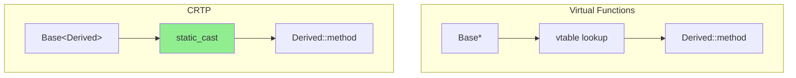

# CRTP: Curiously Recurring Template Pattern

Compile-time Polymorphism

---

## The Pattern

> **CRTP:** A class derives from a template that is parameterized by the derived class itself

```cpp
template<class Derived>
class Base {
    void interface() {
        static_cast<Derived*>(this)->implementation();
    }
};

class Derived : public Base<Derived> {
    void implementation() { /* ... */ }
};
```

**Key:** Base class "รู้" Derived type ตอน compile time!

---

## Why CRTP?

| Virtual Functions | CRTP |
|:---|:---|
| Runtime polymorphism | Compile-time polymorphism |
| vtable lookup overhead | No vtable |
| Cannot inline | Can inline |
| Flexible (runtime) | Fixed at compile time |

**Use CRTP when:** Performance critical + no need for runtime flexibility

---

## OpenFOAM Example: GeometricField

```cpp
template<class Type, template<class> class PatchField, class GeoMesh>
class GeometricField
:
    public DimensionedField<Type, GeoMesh>,
    public GeometricMeshObject<GeometricField<Type, PatchField, GeoMesh>>
//  ^^^^^^^^^^^^^^^^^^^^^^^^^^^^^^^^^^^^^^^^^^^^^^^^^^^^^^^^^^^^^^^^^
//  CRTP: Base template parameterized by this class!
{
    // ...
};
```

---

## How GeometricMeshObject Uses CRTP

```cpp
// GeometricMeshObject.H
template<class ObjectType>
class GeometricMeshObject
{
public:
    // Static polymorphism - no virtual!
    static const ObjectType& null()
    {
        static ObjectType nullObject;
        return nullObject;
    }
    
    // Access derived class methods
    label size() const
    {
        return static_cast<const ObjectType*>(this)->primitiveField().size();
    }
};
```

---

## Another Example: Dimension Checking

```cpp
// dimensioned.H
template<class Type>
class dimensioned
{
    word name_;
    dimensionSet dimensions_;
    Type value_;
    
public:
    // CRTP-style operator that returns correct type
    dimensioned<Type> operator+(const dimensioned<Type>& other) const
    {
        // Dimension check at runtime (could be compile-time with C++20)
        checkDimensions(dimensions_ == other.dimensions_);
        
        return dimensioned<Type>(
            name_,
            dimensions_,
            value_ + other.value_
        );
    }
};
```

---

## Static vs Dynamic Polymorphism



---

## CRTP for Mixins

```cpp
// Mixin: add functionality without vtable

template<class Derived>
class Countable {
    static int count_;
public:
    Countable() { ++count_; }
    ~Countable() { --count_; }
    static int count() { return count_; }
};

class MyField : public Field<scalar>, public Countable<MyField> {
    // MyField now has instance counting!
};

// Usage
Info << "Active fields: " << MyField::count() << endl;
```

---

## CRTP for Default Implementations

```cpp
template<class Derived>
class Comparable {
public:
    bool operator!=(const Derived& other) const {
        return !static_cast<const Derived*>(this)->operator==(other);
    }
    
    bool operator>(const Derived& other) const {
        return other < *static_cast<const Derived*>(this);
    }
    
    bool operator<=(const Derived& other) const {
        return !(other < *static_cast<const Derived*>(this));
    }
    
    bool operator>=(const Derived& other) const {
        return !(*static_cast<const Derived*>(this) < other);
    }
};

class Vector : public Comparable<Vector> {
public:
    bool operator==(const Vector& other) const { /* ... */ }
    bool operator<(const Vector& other) const { /* ... */ }
    // !=, >, <=, >= are automatically generated!
};
```

---

## When to Use CRTP

| Use Case | Example |
|:---|:---|
| **Static polymorphism** | GeometricField base classes |
| **Mixin functionality** | Countable, Printable |
| **Default implementations** | Comparable operators |
| **Type-safe registry** | MeshObject |

---

## Comparison: Virtual vs CRTP

```cpp
// Virtual (Runtime)
class Base {
    virtual void method() = 0;
};
class Derived : public Base {
    void method() override { /* ... */ }
};

void process(Base* obj) {
    obj->method();  // vtable lookup
}
```

```cpp
// CRTP (Compile-time)
template<class D>
class Base {
    void method() {
        static_cast<D*>(this)->methodImpl();
    }
};
class Derived : public Base<Derived> {
    void methodImpl() { /* ... */ }
};

template<class D>
void process(Base<D>* obj) {
    obj->method();  // No vtable, can inline
}
```

---

## Limitations

| Limitation | Reason |
|:---|:---|
| **No runtime switching** | Type fixed at compile time |
| **Code bloat** | Each derived class = new instantiation |
| **Complex syntax** | `static_cast` everywhere |
| **Harder to debug** | Template errors are cryptic |

---

## Concept Check

<details>
<summary><b>1. CRTP vs Virtual Functions: เมื่อไหร่ใช้อะไร?</b></summary>

**ใช้ CRTP เมื่อ:**
- Performance critical (inner loops)
- Types known at compile time
- Want to avoid vtable overhead
- Mixin functionality

**ใช้ Virtual เมื่อ:**
- Need runtime flexibility (plugin system)
- Types determined at runtime (RTS)
- Simpler code preferred
- Runtime configuration needed
</details>

<details>
<summary><b>2. ทำไม GeometricField ใช้ CRTP?</b></summary>

**Performance:**
- Field operations ถูกเรียกล้านครั้ง
- vtable lookup แม้น้อยก็สะสม

**Type safety:**
- Operations return correct type
- `volScalarField + volScalarField` → `volScalarField`

**No need for runtime choice:**
- Field type รู้ตอน compile
- ไม่ต้องการ select type จาก dictionary
</details>

---

## Exercise

1. **Trace Static Cast:** ดูว่า `static_cast` ถูก optimize out อย่างไร
2. **Create Mixin:** สร้าง `Loggable<Derived>` ที่ log ทุก method call
3. **Compare Performance:** Benchmark CRTP vs virtual ใน tight loop

---

## เอกสารที่เกี่ยวข้อง

- **ก่อนหน้า:** [Visitor Pattern](04_Visitor_Pattern.md)
- **Section ถัดไป:** [Performance Engineering](../03_PERFORMANCE_ENGINEERING/00_Overview.md)
