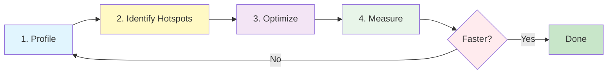
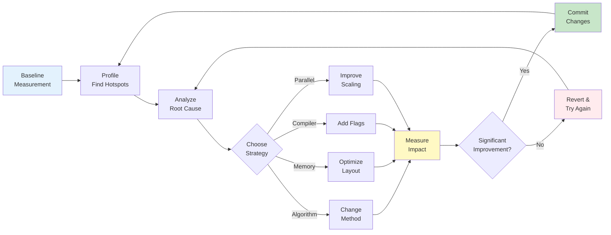

# Performance Engineering — Overview

ทำให้ CFD Code เร็วขึ้น

---

## Learning Objectives

หลังจากอ่านและทำความเข้าใจบทนี้ คุณควรจะสามารถ:

- **[What]** อธิบายแนวคิดและหลักการพื้นฐานของ performance engineering สำหรับ CFD code
- **[Why]** ระบุผลกระทบของปัจจัยต่างๆ ที่มีต่อประสิทธิภาพการทำงานของ CFD solver (cache, memory layout, parallel efficiency)
- **[How]** ใช้เครื่องมือ profiling เพื่อหา bottleneck และวางแผนการ optimization อย่างเป็นระบบ
- **[Strategy]** เลือกใช้เทคนิคที่เหมาะสมในแต่ละระดับ (algorithm, code, compiler) เพื่อเพิ่มประสิทธิภาพ

---

## Prerequisites

ก่อนเรียนหัวข้อนี้ คุณควรมีความเข้าใจในหัวข้อต่อไปนี้:

| Prerequisite | Module | Why Needed |
|:---|:---|:---|
| **Memory Management** | [Module 09.04](../04_MEMORY_MANAGEMENT/00_Overview.md) | เข้าใจ heap vs stack, smart pointers, และ memory ownership pattern |
| **CRTP Pattern** | [Module 09.05](../05_PERFORMANCE_OPTIMIZATION/00_Overview.md) | Static polymorphism สำหรับ zero-cost abstraction |
| **Design Patterns** | [Module 09.03](../03_DESIGN_PATTERNS/00_Overview.md) | โครงสร้างโค้ดที่มีประสิทธิภาพและ maintainability |
| **Template Programming** | [Module 09.01](../01_TEMPLATE_PROGRAMMING/00_Overview.md) | Compile-time optimization และ expression templates |

> [!TIP]
> **Dependency Map:** Performance Engineering → ใช้ความรู้เรื่อง Memory Management + CRTP + Design Patterns เพื่อสร้างโค้ดที่มีประสิทธิภาพสูง

---

## เป้าหมาย

> **เข้าใจวิธีหา bottleneck และ optimize CFD code อย่างเป็นระบบ**

---

## หลักการสำคัญ

> **"Premature optimization is the root of all evil"** — Donald Knuth
>
> **"Profile first, optimize second"**



> [!NOTE]
> **3W Framework Applied:**
> - **What:** วน loop จนกว่าจะได้ผลลัพธ์ที่ต้องการ
> - **Why:** Optimization ที่ผิดจุด เสียเวลาโดยไม่ได้ผล
> - **How:** In-line measurements ตลอดกระบวนการ

---

## Topics ในส่วนนี้

| Topic | Focus | Impact |
|:---|:---|:---:|
| **Profiling Tools** | gprof, perf, valgrind — หา bottleneck | ⭐⭐⭐⭐⭐ |
| **Memory Layout** | Cache optimization, AoS vs SoA | ⭐⭐⭐⭐ |
| **Loop Optimization** | Vectorization, SIMD | ⭐⭐⭐⭐ |
| **Parallel Scaling** | MPI efficiency, Strong/Weak scaling | ⭐⭐⭐⭐⭐ |

---

## Performance Layers

```mermaid
flowchart TB
    subgraph Algorithm [Algorithm Level - Biggest Impact]
        A1[O(n²) → O(n log n)]
        A2[Better preconditioner]
        A3[Improved numerical schemes]
    end
    
    subgraph Code [Code Level - Medium Impact]
        C1[Cache-friendly loops]
        C2[Avoid copies]
        C3[Memory layout optimization]
    end
    
    subgraph Compiler [Compiler Level - Small Impact]
        P1[Vectorization flags]
        P2[Inlining hints]
        P3[Loop unrolling]
    end
    
    Algorithm --> Code --> Compiler
    
    style Algorithm fill:#ffebee
    style Code fill:#fff3e0
    style Compiler fill:#e8f5e9
```

**Rule:** ปรับ Algorithm ก่อน, Code ทีหลัง, ปล่อย Compiler ทำงาน

> [!IMPORTANT]
> **Impact Priority:** Algorithm change (10x-1000x) > Code optimization (2x-10x) > Compiler flags (1.2x-2x)

---

## CFD Performance Characteristics

| Component | % Time | Typical Bottleneck | Optimization Strategy |
|:---|:---:|:---|:---|
| **Linear Solver** | 50-80% | Poor convergence | Better preconditioner, AMG, GPU acceleration |
| **Gradient/Divergence** | 10-20% | Cache misses | Memory layout, loop reordering |
| **Boundary Conditions** | 5-10% | MPI communication | Non-blocking calls, reduced frequency |
| **I/O** | 5-10% | Excessive writes | Larger writeInterval, parallel I/O |
| **Matrix Assembly** | 5-15% | Temporary allocations | Pre-allocated memory, in-place ops |

> [!TIP]
> **Real Data from OpenFOAM:** Typical `simpleFoam` case spends ~70% in GAMG solver, ~15% in fvMatrix assembly, ~10% in boundary updates, ~5% in I/O

---

## Quick Wins

เทคนิคที่ให้ผลเร็วและชัดเจนที่สุด:

1. **Reduce write frequency:** `writeInterval 100;` ไม่ใช่ `1` → **10x faster I/O**
2. **Use GAMG:** แทน BICG สำหรับ pressure → **2-5x faster convergence**
3. **Adjust tolerance:** `relTol 0.01` → stop early, save **30-50% solver time**
4. **Appropriate mesh:** ไม่ต้อง overkill mesh resolution → **2-4x faster runtime**
5. **Compiler flags:** `-O3 -march=native` → **10-20% free speedup**
6. **Decomposition:** Use `scotch` instead of `simple` → **better load balancing**

> [!CAUTION]
> **Common Pitfall:** การลด tolerance มากเกินไปอาจทำให้ผลลัพธ์ไม่ converge หรือได้คำตอบที่ไม่ถูกต้อง ต้องตรวจสอบ residuals อย่างระมัดระวัง

---

## Memory Hierarchy

```
Register     ~1 cycle     (KB)      ⚡ Fastest
L1 Cache     ~4 cycles    (32 KB)   🔥 Very Hot
L2 Cache     ~12 cycles   (256 KB)  🌡️ Hot
L3 Cache     ~40 cycles   (8+ MB)   📍 Warm
RAM          ~200 cycles  (GB)      🐢 Slow
Disk         ~10M cycles  (TB)      🐌 Glacial
```

> [!IMPORTANT]
> **Cache Miss Cost:** 200 cycles = 50-100 floating point operations wasted!
> 
> **Goal:** Keep working set in L1/L2 cache
> - **Spatial locality:** Access adjacent memory contiguously
> - **Temporal locality:** Reuse data before it's evicted

---

## Common Pitfalls

### ❌ Don't Do This:

1. **Micro-optimization without profiling:** 
   ```cpp
   // Bad: ใช้เวลา 2 วัน optimize loop ที่ใช้เวลา 0.1% ของ total
   for (int i=0; i<n; ++i) {
       // manually unrolled, bit hacks, etc.
   }
   ```

2. **Premature abstraction:**
   ```cpp
   // Bad: virtual function calls ใน tight loop
   for (int i=0; i<1000000; ++i) {
       data[i]->compute();  // Virtual call = branch misprediction
   }
   ```

3. **Ignoring memory layout:**
   ```cpp
   // Bad: Array of Structures = cache thrashing
   struct Particle { double x, y, z, vx, vy, vz, m, rho; };
   vector<Particle> particles;  // แต่ละ iteration อ่าน x เท่านั้น
   ```

### ✅ Do This Instead:

1. **Profile first:**
   ```bash
   perf record -g ./solver
   perf report
   # ดูว่า function ไหนใช้เวลามากที่สุด
   ```

2. **Use CRTP for compile-time polymorphism:**
   ```cpp
   // Good: Static dispatch = inlined
   template<typename Derived>
   class Base {
       void compute() { static_cast<Derived*>(this)->computeImpl(); }
   };
   ```

3. **Structure of Arrays:**
   ```cpp
   // Good: Sequential access = cache-friendly
   struct Particles {
       vector<double> x, y, z, vx, vy, vz, m, rho;
   };
   ```

---

## Performance Engineering Workflow



---

## เอกสารที่เกี่ยวข้อง

### ใน Module นี้:

- **ถัดไป:** [Profiling Tools](01_Profiling_Tools.md) — วิธีใช้ gprof, perf, valgrind
- **Memory & Cache:** [Memory Layout Optimization](02_Memory_Layout.md) — AoS vs SoA, cache-aware algorithms
- **Loop Optimization:** [Vectorization & SIMD](03_Loop_Optimization.md) — Auto-vectorization, intrinsics
- **Parallel Scaling:** [MPI Performance](04_Parallel_Scaling.md) — Strong/weak scaling, communication patterns

### จาก Module อื่นๆ:

- **ก่อนหน้า:** [CRTP Pattern](../02_ADVANCED_PATTERNS/05_CRTP_Pattern.md) — Static polymorphism for zero-cost abstraction
- **Memory Management:** [Smart Pointers & Ownership](../04_MEMORY_MANAGEMENT/02_Memory_Syntax_and_Design.md)
- **Design Patterns:** [Strategy Pattern](../03_DESIGN_PATTERNS/03_Strategy_Pattern.md) — Runtime algorithm selection

---

## Key Takeaways

✅ **Profile First, Optimize Second** — ไม่มีการ optimization ที่ดีถ้าไม่รู้ว่าปัญหาอยู่ที่ไหน

✅ **Algorithm > Code > Compiler** — เปลี่ยน algorithm ให้ดีขึ้นให้ก่อน แล้วค่อย optimize โค้ด สุดท้ายค่อยปรับ compiler flags

✅ **Cache is King** — Memory hierarchy เป็น factor สำคัญที่สุดในสมัยปัจจุบัน การ access memory แบบ sequential สำคัญมาก

✅ **Measure Everything** — ทุกการเปลี่ยนแปลงต้องวัดผล ถ้าไม่เร็วขึ้นให้ revert

✅ **Quick Wins Matter** — เรื่องง่ายๆ เช่น `writeInterval`, tolerance, mesh resolution สามารถเพิ่มความเร็วได้ 10x

✅ **Parallel Doesn't Fix All** — Bad algorithm ทำงานช้าเสมอ ไม่ว่าจะใช้ CPU กี่ core

✅ **Real-World Impact** — Performance optimization สามารถลด runtime จากเดือนเป็นวัน หรือจากวันเป็นชั่วโมง ได้จริง

---

## Additional Resources

### Tools:

- **perf:** Linux profiling tool (`perf record`, `perf report`)
- **valgrind/cachegrind:** Cache simulation and profiling
- **gprof:** GCC profiling
- **Intel VTune:** Advanced profiler (proprietary)
- **scalasca:** Parallel profiling for HPC

### Reading:

- **"What Every Programmer Should Know About Memory"** — Ulrich Drepper
- **"Computer Architecture: A Quantitative Approach"** — Hennessy & Patterson
- **OpenFOAM Performance Guide:** [OpenFOAM Documentation](https://www.openfoam.com/documentation)

### Benchmarks:

- **HPC Challenge:** [HPCC Benchmark Suite](https://icl.utk.edu/hpcc/)
- **CFD Benchmarks:** [OpenFOAM Benchmarks](https://www.openfoam.com/documentation/guides/latest/doc/cfd-general.html)