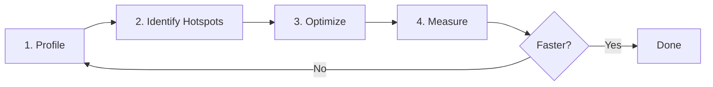

# Performance Engineering — Overview

ทำให้ CFD Code เร็วขึ้น

---

## เป้าหมาย

> **เข้าใจวิธีหา bottleneck และ optimize CFD code อย่างเป็นระบบ**

---

## หลักการสำคัญ

> "Premature optimization is the root of all evil" — Donald Knuth
>
> "Profile first, optimize second"



---

## Topics ในส่วนนี้

| Topic | Focus |
|:---|:---|
| **Profiling Tools** | gprof, perf, valgrind — หา bottleneck |
| **Memory Layout** | Cache optimization, AoS vs SoA |
| **Loop Optimization** | Vectorization, SIMD |
| **Parallel Scaling** | MPI efficiency, Strong/Weak scaling |

---

## Performance Layers

```mermaid
flowchart TB
    subgraph Algorithm [Algorithm Level]
        A1[O(n²) → O(n log n)]
        A2[Better preconditioner]
    end
    
    subgraph Code [Code Level]
        C1[Cache-friendly loops]
        C2[Avoid copies]
    end
    
    subgraph Compiler [Compiler Level]
        P1[Vectorization]
        P2[Inlining]
    end
    
    Algorithm --> Code --> Compiler
```

**Rule:** ปรับ Algorithm ก่อน, Code ทีหลัง, ปล่อย Compiler ทำงาน

---

## CFD Performance Characteristics

| Component | % Time | Optimize How |
|:---|:---:|:---|
| **Linear Solver** | 50-80% | Better preconditioner, AMG |
| **Gradient/Divergence** | 10-20% | Memory layout |
| **Boundary Conditions** | 5-10% | Parallel communication |
| **I/O** | 5-10% | Write less often |

---

## Quick Wins

1. **Reduce write frequency:** `writeInterval 100;` ไม่ใช่ `1`
2. **Use GAMG:** แทน BICG สำหรับ pressure
3. **Adjust tolerance:** `relTol 0.01` → stop early
4. **Appropriate mesh:** ไม่ต้อง overkill mesh resolution

---

## Memory Hierarchy

```
Register     ~1 cycle     (KB)
L1 Cache     ~4 cycles    (32 KB)
L2 Cache     ~12 cycles   (256 KB)
L3 Cache     ~40 cycles   (8+ MB)
RAM          ~200 cycles  (GB)
Disk         ~10M cycles  (TB)
```

> [!IMPORTANT]
> **Cache miss = 200 cycles wasted!**
>
> Goal: Keep data close to CPU

---

## บทเรียนในส่วนนี้

1. **Profiling Tools** — หา bottleneck
2. **Memory & Cache** — Data layout optimization
3. **Loop Optimization** — Vectorization
4. **Parallel Scaling** — MPI efficiency

---

## เอกสารที่เกี่ยวข้อง

- **ก่อนหน้า:** [CRTP Pattern](../02_ADVANCED_PATTERNS/05_CRTP_Pattern.md)
- **ถัดไป:** [Profiling Tools](01_Profiling_Tools.md)
