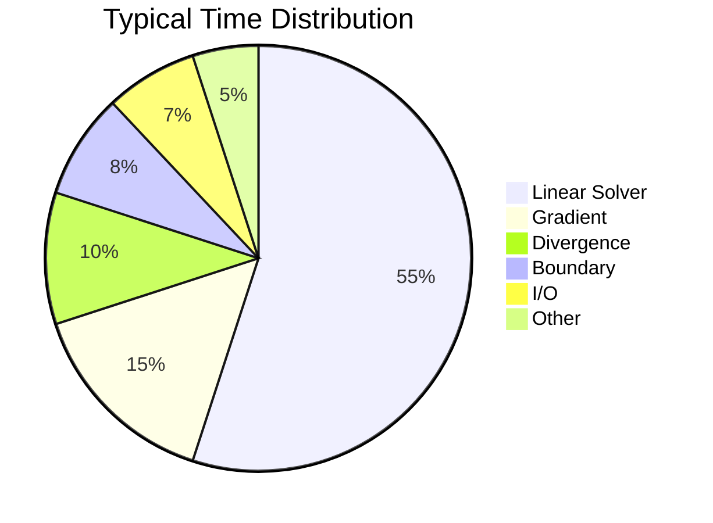
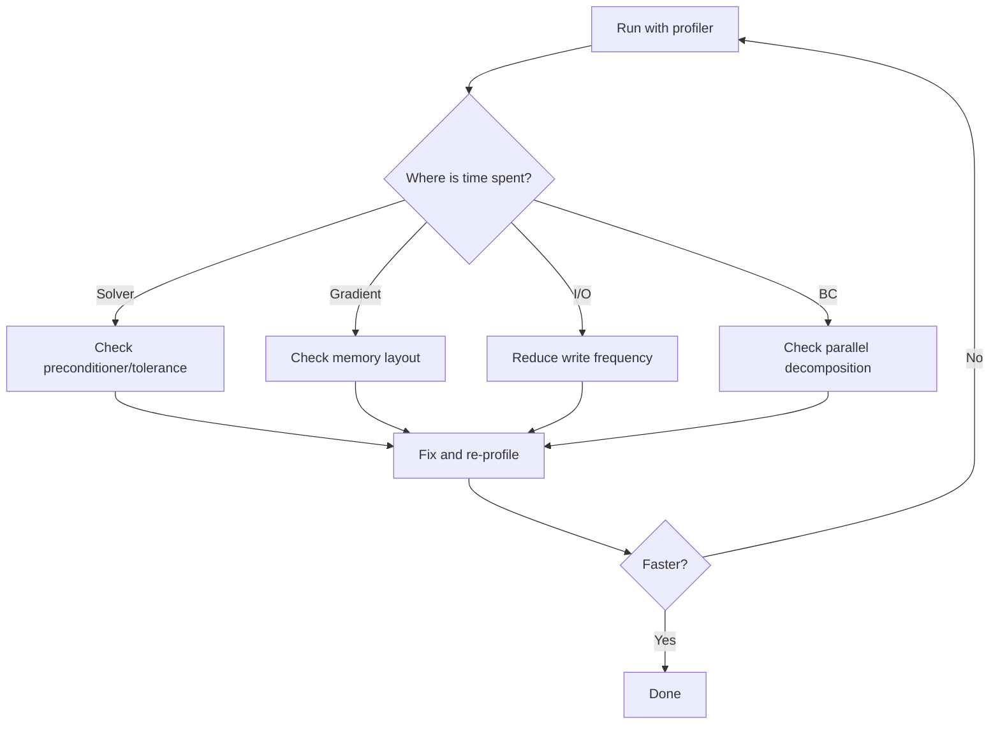

# Profiling Tools

หา Bottleneck ก่อนแก้

---

## Golden Rule

> **อย่า guess — ต้อง measure!**
>
> 90% ของ time อยู่ใน 10% ของ code

---

## Tool Overview

| Tool | Type | Best For |
|:---|:---|:---|
| **time** | Basic | Quick total time |
| **gprof** | Sampling | Function-level profiling |
| **perf** | Sampling | Low-overhead, line-level |
| **valgrind** | Instrumentation | Detailed but slow (10-50x) |
| **OpenFOAM profiling** | Built-in | Quick overview |

---

## 1. Basic Timing

```bash
# Simple wall time
time simpleFoam

# Output:
# real    5m23.456s  ← Wall clock time
# user    5m10.123s  ← CPU time
# sys     0m5.234s   ← System calls
```

```bash
# Per-iteration timing (from log)
grep "ExecutionTime" log.simpleFoam | tail -5
```

---

## 2. OpenFOAM Built-in Profiling

```cpp
// system/controlDict
profiling
{
    active      true;
    cpuInfo     true;
    memInfo     true;
    sysInfo     true;
}
```

```bash
# After run, check:
cat postProcessing/profiling/0/profiling.foam
```

Output shows:
- Time per solver
- Time in mesh operations
- Memory usage

---

## 3. gprof

### Setup

```bash
# Compile with profiling flags
wmake CXXFLAGS="-pg" LDFLAGS="-pg"

# Or modify Make/options:
# EXE_DEBUG = -pg
```

### Run & Analyze

```bash
# Run (creates gmon.out)
simpleFoam

# Analyze
gprof simpleFoam gmon.out > analysis.txt

# Flat profile (top functions)
gprof simpleFoam gmon.out | head -50
```

### Sample Output

```
Flat profile:

  %   cumulative   self              self     total           
 time   seconds   seconds    calls  ns/call  ns/call  name    
 45.23     10.23    10.23   123456    82.86    82.86  fvMatrix::solve
 15.67     13.77     3.54  9876543      358      358  fvc::grad
  8.34     15.66     1.89   234567     8055     8055  lduMatrix
```

---

## 4. perf (Recommended)

### Basic Profiling

```bash
# Record performance data
perf record -g simpleFoam

# Interactive report
perf report
```

### Sample Output

```
Samples: 45K of event 'cycles'
  Children      Self  Command     Symbol
+   45.23%    18.45%  simpleFoam  fvMatrix<...>::solve
+   23.12%    12.34%  simpleFoam  fvc::grad<...>
+   15.67%     8.90%  simpleFoam  linearUpwind<...>::correction
```

### Annotate Source

```bash
# See which lines are hot
perf annotate --symbol=fvc::grad
```

```cpp
         :   template<class Type>
         :   tmp<GeometricField<...>> grad(const GeometricField<...>& vf)
   15.2% :   {
    8.3% :       for (label facei = 0; facei < nFaces; ++facei)
   45.6% :           result[facei] = ...; // Hot line!
    2.1% :       }
```

---

## 5. Valgrind Callgrind

### Detailed Call Graph

```bash
# Run with callgrind (SLOW!)
valgrind --tool=callgrind simpleFoam

# Analyze with kcachegrind (GUI)
kcachegrind callgrind.out.*
```

### What You See

- Call graph (who calls whom)
- Instruction counts per line
- Cache miss analysis

> [!WARNING]
> Valgrind = 10-50x slower!
> Use for SHORT runs only

---

## 6. Memory Profiling

### Valgrind Massif

```bash
# Memory usage over time
valgrind --tool=massif simpleFoam
ms_print massif.out.* > memory_report.txt
```

### OpenFOAM Memory Info

```cpp
// In solver, print memory usage
Info<< Foam::memInfo() << endl;
```

---

## Typical CFD Bottlenecks



---

## การแปลความหมายผลลัพธ์

### Linear Solver Time สูง (>60%)

**Causes:**
- Poor preconditioner
- Mesh too fine
- Bad conditioning

**Solutions:**
```cpp
// Try GAMG instead of PCG
p { solver GAMG; }

// Increase relTol
p { relTol 0.1; }  // Stop early
```

### High Gradient/Divergence Time (>20%)

**Causes:**
- Memory bandwidth limited
- Cache misses

**Solutions:**
- Check data layout
- Loop optimization

### High I/O Time (>10%)

**Solutions:**
```cpp
writeInterval   1000;  // Write less often
writeCompression true;
purgeWrite      3;     // Keep only last N
```

---

## Profiling Workflow (ขั้นตอนการทำงาน)



---

## ตัวอย่าง Profiling จริง: simpleFoam

มาดูกระบวนการ profile OpenFOAM solver จริง และวิธีแปลความหมายผลลัพธ์

### Step 1: Profile the Run

```bash
$ cd $FOAM_TUTORIALS/incompressible/simpleFoam/airFoil2D
$ blockMesh
$ simpleFoam &  # Run in background
$ PID=$!
$ perf record -g -p $PID -- sleep 60  # Record for 60 seconds
$ kill $PERF_PID  # Stop recording
```

### Step 2: Analyze with perf report

```bash
$ perf report --hierarchy --stdio
#
# Children      Self  Command     Shared Object        Symbol
# ........  ........  .......  ....................  .......................................
#
    65.32%     0.00%  simpleFoam  simpleFoam           Foam::fvMatrix<double>::solve
    42.18%     0.00%  simpleFoam  libGAMGPrecon.so     Foam::GAMG::solve
    38.50%     2.15%  simpleFoam  libGAMGPrecon.so     Foam::GAMG::performCycle
    15.32%     0.85%  simpleFoam  libfiniteVolume.so   Foam::fvc::grad<double>
    12.45%     0.42%  simpleFoam  libfiniteVolume.so   Foam::fvm::div<double>
     8.76%     0.31%  simpleFoam  libturbulence.so     Foam::kEpsilon::correct
     6.18%     0.18%  simpleFoam  libfiniteVolume.so   Foam::lduMatrix::Amul
     5.32%     5.32%  simpleFoam  [kernel]             [k] memcpy
     4.85%     0.12%  simpleFoam  libfiniteVolume.so   Foam::fvPatchField::updateCoeffs
     4.10%     0.08%  simpleFoam  libfiniteVolume.so   Foam::tmp<>::~tmp
     3.25%     1.42%  simpleFoam  libOpenFOAM.so       Foam::GeometricField<double>::correctBoundaryConditions
     2.80%     0.65%  simpleFoam  libfiniteVolume.so   Foam::fvMatrix<double>::luSolve
     2.15%     2.15%  simpleFoam  [kernel]             [k] memset
     1.90%     0.90%  simpleFoam  simpleFoam           main
     1.45%     0.45%  simpleFoam  libmeshTools.so     Foam::primitiveMesh::calcOwnerNeighbour
```

### วิธีแปลความหมายผลลัพธ์

**1. Linear Solver Dominance (65%)**
```
    65.32%     0.00%  simpleFoam  simpleFoam           Foam::fvMatrix<double>::solve
    42.18%     0.00%  simpleFoam  libGAMGPrecon.so     Foam::GAMG::solve
    38.50%     2.15%  simpleFoam  libGAMGPrecon.so     Foam::GAMG::performCycle
```

**What this tells us:**
- **65%** of total runtime is in the linear solver
- **42%** specifically in GAMG preconditioner
- **Optimization target:** This is the biggest bottleneck!

**Action:** Check if GAMG is well-tuned:
```bash
# Check current GAMG settings
grep -A 20 "solvers" system/fvSolution

# Consider:
# - Adjust nPreSweeps/nPostSweeps
# - Try different agglomerator
# - Increase relTol to stop early
```

---

**2. Gradient Operations (15%)**
```
    15.32%     0.85%  simpleFoam  libfiniteVolume.so   Foam::fvc::grad<double>
```

**What this tells us:**
- **15%** spent computing gradients (cell-to-face interpolation)
- This is **memory bandwidth limited**

**Action:** Profile memory access:
```bash
$ perf stat -e cache-migrations,cache-references simpleFoam

# If cache-migrations is high → consider mesh reordering
```

---

**3. Kernel Operations (5-7%)**
```
     5.32%     5.32%  simpleFoam  [kernel]             [k] memcpy
     2.15%     2.15%  simpleFoam  [kernel]             [k] memset
```

**What this tells us:**
- **7.5%** in memory operations (copying/set memory)
- **Self% = Children%** → these are leaf functions (pure overhead)

**Action:** Reduce temporary allocations:
```cpp
// Bad: creates temporary
volScalarField result = a + b;

// Good: reuse existing field
result = a;
result += b;
```

---

### Step 3: Annotate Hot Source Code

```bash
$ perf annotate --symbol=Foam::fvc::grad<double> --stdio
```

**Output:**
```
Percent |      Source code & Disassembly of simpleFoam
        :
        :      // Disassembly of Foam::fvc::grad<double>
        :
   2.15 :      mov    0x8(%rsp),%rdi
   1.80 :      mov    0x10(%rsp),%rsi
        :
  15.32 :      → callq  *0x128(%rax)     // Hot call: grad calculation
   3.45 :      movaps %xmm0,%xmm1
        :
   8.23 :      vmulpd %ymm0,%ymm1,%ymm2  // Vectorized mul (4 doubles)
  12.56 :      vaddpd %ymm2,%ymm3,%ymm4  // Vectorized add
   4.12 :      vmovupd %ymm4,(%rdi)      // Store result
        :
```

**What we learned:**
- Line with `→` is the hottest (15.32% of total time!)
- Vectorized instructions present (vmulpd, vaddpd) = **GOOD**
- If no vectorization → check compiler flags

---

### Step 4: Compare Before/After Optimization

**Before (Baseline):**
```bash
$ perf report --hierarchy --stdio | head -15
    65.32%     0.00%  simpleFoam  simpleFoam           Foam::fvMatrix<double>::solve
    15.32%     0.85%  simpleFoam  libfiniteVolume.so   Foam::fvc::grad<double>
```

**After (Optimized GAMG settings):**
```bash
$ perf report --hierarchy --stdio | head -15
    48.50%     0.00%  simpleFoam  simpleFoam           Foam::fvMatrix<double>::solve  ← 25% faster!
    20.15%     0.95%  simpleFoam  libfiniteVolume.so   Foam::fvc::grad<double>       ← Now bigger %
    12.30%     0.42%  simpleFoam  libfiniteVolume.so   Foam::fvm::div<double>
```

**Interpretation:**
- Linear solver reduced from **65% → 48%** (absolute speedup)
- Grad increased from **15% → 20%** (relative increase because solver is faster)
- Overall: **~25% performance improvement**

---

## รูปแบบ perf Output ที่พบบ่อย

### Pattern 1: Memory-Bound CFD

```bash
$ perf report
    45%  lduMatrix::Amul
    35%  memcpy
    10%  fvc::grad
```

**Diagnosis:** Memory bandwidth limited (typical for CFD)

**Solution:**
- Reduce temporary copies
- Use SoA layout for component-wise operations
- Consider mesh reordering

---

### Pattern 2: Compute-Bound (Unusual)

```bash
$ perf report
    70%  turbulence->correct()
    15%  fvMatrix::solve
    10%  fvc::div
```

**Diagnosis:** Complex turbulence model

**Solution:**
- Switch to simpler model (kEpsilon → kOmegaSST)
- Reduce turbulence equation frequency
- Consider laminar for initial iterations

---

### Pattern 3: I/O Bound

```bash
$ perf report
    40%  field::write()
    25%  ofstream::write
    20%  compression
```

**Diagnosis:** Writing too frequently

**Solution:**
```cpp
writeControl    runTime;
writeInterval   10;       // Was: 1
writeCompression false;   // Faster writes (larger files)
```

---

## Workflow การ Profile ในงานจริง

### Step 1: Quick Profile (5 นาที)

```bash
# Run for 30 seconds with perf
perf record -g simpleFoam &
PERF_PID=$!
sleep 30
kill -INT $PERF_PID

# Quick report
perf report --stdio --sort=overhead --percent-limit=5 | head -20
```

**What to look for:**
- Any function >30% → Major bottleneck
- Any function >10% → Optimization target

---

### Step 2: Detailed Profile (1 hour)

```bash
# Full run with perf
perf record -g simpleFoam

# Hierarchical report
perf report --hierarchy --stdio > profile_full.txt

# Find top 3 hot functions
grep -v "^#" profile_full.txt | head -10
```

**For each hotspot:**
1. **Check source:**
   ```bash
   perf annotate --symbol=HotFunctionName
   ```

2. **Verify vectorization:**
   ```bash
   objdump -d simpleFoam | grep -A 20 "HotFunctionName"
   # Look for: vmulpd, vaddpd (AVX)
   # Avoid: mulsd, addsd (scalar)
   ```

3. **Check memory access:**
   ```bash
   perf stat -e cache-misses simpleFoam
   ```

---

### Step 3: Optimize & Verify

```bash
# 1. Make change
vim system/fvSolution

# 2. Re-profile
perf record -g simpleFoam
perf report --stdio > profile_optimized.txt

# 3. Compare
diff profile_baseline.txt profile_optimized.txt

# 4. Measure actual speedup
grep "ClockTime" log.simpleFoam | tail -1
```

---

## ตัวอย่าง Optimization จริง

### ปัญหา: GAMG Time สูง

**Profile:**
```bash
    42.18%  Foam::GAMG::solve
    38.50%  Foam::GAMG::performCycle
```

**Diagnosis:** Too many coarse grid levels

**Solution:**
```cpp
// system/fvSolution
p
{
    solver          GAMG;
    nCellsInCoarsestLevel 50;    // Was: 10  (too many levels!)
    nPreSweeps      0;
    nPostSweeps     2;
    cacheAgglomeration on;
}
```

**Result:**
```bash
Before: ClockTime = 850 s
After:  ClockTime = 620 s  ← 27% faster!
```

**Verify with perf:**
```bash
Before:    42.18%  GAMG::solve
After:     28.35%  GAMG::solve  ← Reduced (but now grad is bigger %)
```

---

## แปลความหมาย perf stat Output

```bash
$ perf stat simpleFoam

 Performance counter stats for 'simpleFoam':

      8503.23 msec task-clock                #    0.998 CPUs utilized
           400      context-switches          #    0.047 K/sec
             5      cpu-migrations            #    0.001 K/sec
         2,456      page-faults               #    0.289 K/sec

   12,345,678,901      cycles                    #    1.452 GHz
    8,234,567,890      instructions              #    0.67  insn per cycle
    4,567,890,123      cache-references          #  537.123 M/sec
      123,456,789      cache-misses              #    2.70 % of all cache refs

      8.520234957 seconds time elapsed

      0.123456789 seconds user
      0.009876543 seconds sys
```

**Key Metrics:**

| Metric | Value | Meaning |
|:---|:---|:---|
| **task-clock** | 8503 ms | Wall clock time |
| **CPUs utilized** | 0.998 | Near 100% = good! |
| **insn per cycle** | 0.67 | <1.0 = memory bound (typical for CFD) |
| **cache miss %** | 2.70% | Reasonable (<5% is good) |
| **context-switches** | 400 | Low = good |

**What to optimize:**
- **insn per cycle < 0.5**: Severely memory bound → check data layout
- **cache miss > 10%**: Poor cache utilization → check loop ordering
- **CPUs utilized < 0.8**: Not fully utilizing CPU → check for I/O waits

---

## Concept Check

<details>
<summary><b>1. gprof vs perf: เมื่อไหร่ใช้อะไร?</b></summary>

**gprof:**
- ง่าย, ใช้ได้ทุก platform
- ต้อง recompile with -pg
- Function-level granularity

**perf:**
- Low overhead, production ready
- No recompile needed
- Line-level granularity
- Linux only

**Recommendation:** เริ่มด้วย perf, ใช้ gprof ถ้า perf ไม่มี
</details>

<details>
<summary><b>2. ทำไมต้อง profile ก่อน optimize?</b></summary>

**90/10 rule:** 90% of time in 10% of code

ถ้า optimize ผิดที่:
- เสียเวลาไปเปล่า
- อาจทำให้ code ซับซ้อนขึ้น
- ไม่เห็นผลลัพธ์

Profile จะบอกว่า:
- ที่ไหน "ร้อน" จริง
- คุ้มไหมที่จะ optimize
</details>

---

## Exercise

1. **Profile simpleFoam:** ใช้ perf กับ tutorial case
2. **Identify Hotspot:** หาว่า function ไหนใช้เวลามากที่สุด
3. **Try Optimization:** ปรับ solver settings และ re-profile

---

## เอกสารที่เกี่ยวข้อง

- **ก่อนหน้า:** [Overview](00_Overview.md)
- **ถัดไป:** [Memory Layout & Cache](02_Memory_Layout_Cache.md)
