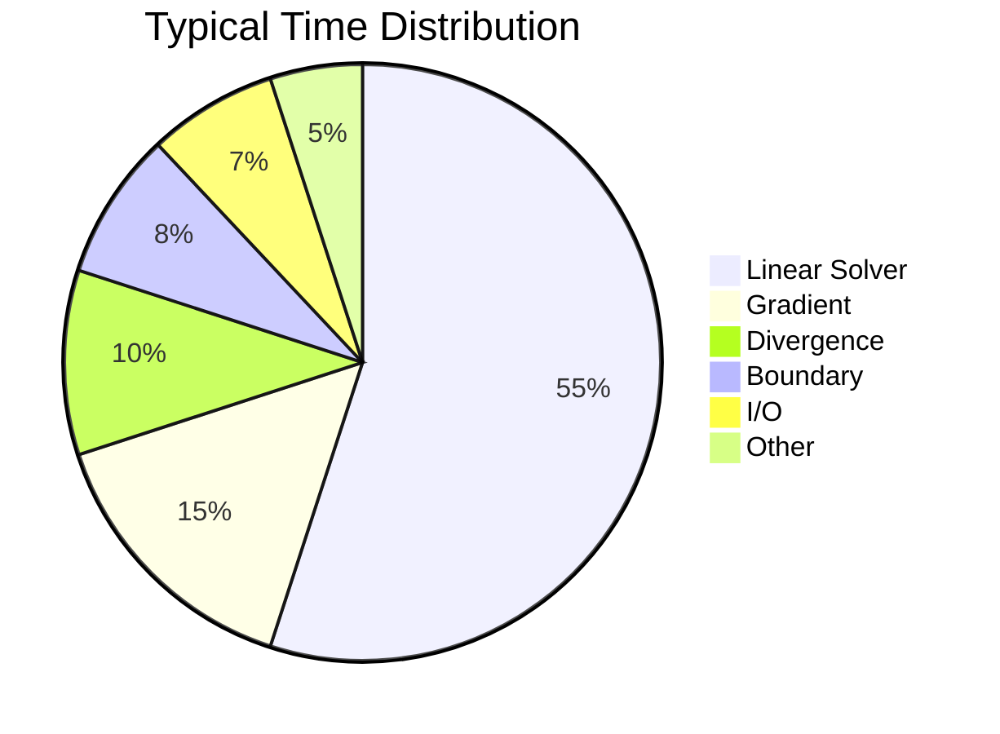
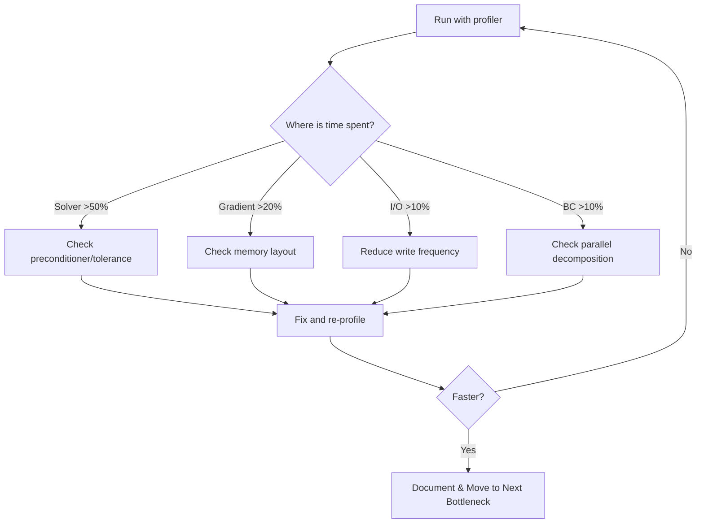

# Profiling Tools

หา Bottleneck ก่อนแก้

---

## Learning Objectives

หลังจากอ่านบทนี้ คุณควรจะสามารถ:

- **เลือกเครื่องมือ profiling ที่เหมาะสม** กับสถานการณ์ที่แตกต่างกัน (quick check vs. deep analysis)
- **ตีความผลลัพธ์จาก perf/gprof** และระบุ bottleneck หลักใน CFD solver
- **ใช้คำสั่ง profiling** เพื่อวัด performance ที่ระดับ function และ line
- **วิเคราะห์ assembly code** เพื่อยืนยัน vectorization และหาสาเหตุของ cache misses
- **ประยุกต์ใช้ workflow** ในการ profile → optimize → verify อย่างเป็นระบบ

**Prerequisites:** ความเข้าใจพื้นฐานเกี่ยวกับ CFD solver workflow (จาก MODULE 02) และ memory management basics (จาก SECTION 04)

---

## Golden Rule

> **อย่า guess — ต้อง measure!**
>
> 90% ของ time อยู่ใน 10% ของ code

---

## Tool Overview

| Tool | Type | Best For | Overhead | Prerequisites |
|:---|:---|:---|:---|:---|
| **time** | Basic | Quick total time | Minimal | None |
| **gprof** | Sampling | Function-level profiling | Low (10-20%) | Recompile with `-pg` |
| **perf** | Sampling | Low-overhead, line-level | Very low (2-5%) | Linux only |
| **valgrind** | Instrumentation | Detailed call graphs | High (10-50x) | None |
| **OpenFOAM profiling** | Built-in | Quick overview | Low (5-10%) | None |

### Quick Reference: When to Use What

```
┌─────────────────────────────────────────────────────────────────┐
│  Decision Tree: Which Profiling Tool?                          │
├─────────────────────────────────────────────────────────────────┤
│                                                                 │
│  Quick check? ──YES──→ time                                    │
│       │                                                         │
│       NO                                                        │
│       │                                                         │
│  Need detailed call graph? ──YES──→ valgrind/callgrind         │
│       │                                                         │
│       NO                                                        │
│       │                                                         │
│  Linux available? ──NO──→ gprof                                │
│       │                                                         │
│       YES                                                       │
│       ↓                                                         │
│  perf (default choice)                                         │
│                                                                 │
└─────────────────────────────────────────────────────────────────┘
```

---

## 1. Basic Timing

### What: Wall Clock vs. CPU Time

```bash
# Simple wall time
time simpleFoam

# Output:
# real    5m23.456s  ← Wall clock time (what you wait)
# user    5m10.123s  ← CPU time in user space
# sys     0m5.234s   ← CPU time in kernel (system calls)
```

**Why**: `user + sys > real` หมายถึง parallel processing ทำงาน

```bash
# Per-iteration timing (from log)
grep "ExecutionTime" log.simpleFoam | tail -5
```

**Output Pattern:**
```
ExecutionTime = 123.45 s  ClockTime = 234.56
ExecutionTime = 126.78 s  ClockTime = 237.89  ← 3.33s/iteration
```

### Common Pitfalls

| Symptom | Cause | Fix |
|:---|:---|:---|
| `real ≈ user + sys` | Serial execution | Check parallel decomposition |
| `sys > 20% of user` | Too much I/O | Reduce write frequency |
| Iteration time varies wildly | Load imbalance | Check `decomposePar` settings |

---

## 2. OpenFOAM Built-in Profiling

### Why: Zero-Setup Quick Overview

```cpp
// system/controlDict
profiling
{
    active      true;
    cpuInfo     true;
    memInfo     true;
    sysInfo     true;
}
```

### How: Analyze Results

```bash
# After run, check:
cat postProcessing/profiling/0/profiling.foam
```

**Sample Output:**
```
profiling
{
    totalTime    850.45;
    memInfo      
    {
        rss  2048000;  // Resident Set Size (KB)
        heap 1024000;
    }
    
    solverTime
    {
        p       550.23;  // 65% of total
        U       180.12;  // 21%
    }
    
    meshOperationTime 45.67;
}
```

**What This Tells You:**
- Solver dominates → Check preconditioner
- Mesh ops high → Bad mesh quality
- Memory grows → Memory leak

---

## 3. gprof

### Setup

```bash
# Compile with profiling flags
wmake CXXFLAGS="-pg" LDFLAGS="-pg"

# Or modify Make/options:
# EXE_DEBUG = -pg
```

### Run & Analyze

```bash
# Run (creates gmon.out)
simpleFoam

# Analyze
gprof simpleFoam gmon.out > analysis.txt

# Flat profile (top functions)
gprof simpleFoam gmon.out | head -50
```

### Sample Output

```
Flat profile:

  %   cumulative   self              self     total           
 time   seconds   seconds    calls  ns/call  ns/call  name    
 45.23     10.23    10.23   123456    82.86    82.86  fvMatrix::solve
 15.67     13.77     3.54  9876543      358      358  fvc::grad
  8.34     15.66     1.89   234567     8055     8055  lduMatrix
```

### Common Pitfalls

| Problem | Cause | Solution |
|:---|:---|:---|
| No gmon.out created | Binary stripped | Check `wclean` then rebuild |
| All functions show 0% | Insufficient runtime | Run longer (>30s) |
- Cannot see line numbers | Missing debug symbols | Add `EXE_DEBUG = -g -pg` |

---

## 4. perf (Recommended)

### Why: Production-Ready Profiling

- **No recompilation needed**
- **Line-level granularity**
- **Low overhead** (2-5%)
- **Hardware counters** (cache misses, branch prediction)

### Basic Profiling

```bash
# Record performance data
perf record -g simpleFoam

# Interactive report
perf report
```

### Sample Output

```
Samples: 45K of event 'cycles'
  Children      Self  Command     Symbol
+   45.23%    18.45%  simpleFoam  fvMatrix<...>::solve
+   23.12%    12.34%  simpleFoam  fvc::grad<...>
+   15.67%     8.90%  simpleFoam  linearUpwind<...>::correction
```

**Key Metrics:**
- **Children %**: Time including children (total impact)
- **Self %**: Time in this function only (local hotspot)

### Annotate Source

```bash
# See which lines are hot
perf annotate --symbol=fvc::grad
```

```cpp
         :   template<class Type>
         :   tmp<GeometricField<...>> grad(const GeometricField<...>& vf)
   15.2% :   {
    8.3% :       for (label facei = 0; facei < nFaces; ++facei)
   45.6% :           result[facei] = ...; // Hot line!
    2.1% :       }
```

### Common Pitfalls

| Error | Cause | Fix |
|:---|:---|:---|
| `WARNING: Kernel address maps` | Security feature | `sudo sysctl kernel.kptr_restrict=0` |
| No symbols shown | Binary stripped | Rebuild without optimization |
| Permission denied | perf not allowed | `sysctl kernel.perf_event_paranoid=-1` |

---

## 5. Valgrind Callgrind

### Why: Detailed Call Graph Analysis

```bash
# Run with callgrind (SLOW!)
valgrind --tool=callgrind simpleFoam

# Analyze with kcachegrind (GUI)
kcachegrind callgrind.out.*
```

### What You See

- **Call graph**: Who calls whom
- **Instruction counts per line**: Exact hot lines
- **Cache miss analysis**: Memory bottlenecks

> [!WARNING]
> Valgrind = 10-50x slower!
> Use for SHORT runs only (< 100 iterations)

### Common Pitfalls

| Symptom | Cause | Solution |
|:---|:---|:---|
| Out of memory | Valgrind overhead | Reduce mesh size |
- Run takes hours | Small case | Use for verification only |
Cannot see source | Wrong path | Set `--extra-debuginfo-path` |

---

## 6. Memory Profiling

### Valgrind Massif

```bash
# Memory usage over time
valgrind --tool=massif simpleFoam
ms_print massif.out.* > memory_report.txt
```

**Sample Output:**
```
MB
^                     
|              :::::::@:@:@:@
|           :::::@:@:@       
|        :::::@             
|     ::::@               
|  ::::@                
+---------------------------------->
   0   200   400   600   800
```

### OpenFOAM Memory Info

```cpp
// In solver, print memory usage
Info<< Foam::memInfo() << endl;
```

**Output:**
```
memInfo: rss=2048000 heap=1024000 peak=2560000
```

**Key Metrics:**
- **rss**: Resident Set Size (actual RAM used)
- **heap**: Dynamic allocations
- **peak**: Maximum memory usage

### Common Pitfalls

| Pattern | Meaning | Action |
|:---|:---|:---|
| Steady increase | Memory leak | Check temporary fields |
- Spikes every N iterations | Output time | Reduce write frequency |
High RSS, low heap | Mesh storage | Check mesh quality |

---

## Typical CFD Bottlenecks



### Performance Patterns

| Bottleneck | Typical % | Why | Quick Check |
|:---|:---|:---|:---|
| **Linear Solver** | 40-70% | Matrix operations | `grep "solver" log.simpleFoam` |
| **Gradient** | 10-20% | Memory bandwidth | `perf annotate fvc::grad` |
| **Divergence** | 5-15% | Face interpolation | Check convection scheme |
| **I/O** | 5-15% | Disk speed | `grep "write" log.simpleFoam` |
| **Boundary** | 5-10% | Patch updates | Check boundary conditions |

---

## Interpreting Results (การแปลความหมายผลลัพธ์)

### Linear Solver Time High (>60%)

**Causes:**
- Poor preconditioner
- Mesh too fine
- Bad conditioning (high aspect ratio)

**Solutions:**
```cpp
// Try GAMG instead of PCG
p 
{ 
    solver          GAMG;
    nPreSweeps      0;
    nPostSweeps     2;
}

// Increase relTol
p 
{ 
    relTol 0.1;  // Stop early (was: 0.01)
}
```

### High Gradient/Divergence Time (>20%)

**Causes:**
- Memory bandwidth limited
- Cache misses
- Non-contiguous memory access

**Solutions:**
```cpp
// Check mesh reordering
renumberMesh

// Use component-based operations
// Bad:
volVectorField U = ...;  // AoS layout
// Good:
volScalarField Ux = ...;  // SoA layout
```

### High I/O Time (>10%)

**Solutions:**
```cpp
writeControl    runTime;
writeInterval   1000;     // Was: 100
writeCompression true;
purgeWrite      3;        // Keep only last N
```

---

## Profiling Workflow (ขั้นตอนการทำงาน)



---

## Real-World Example: Profiling simpleFoam

### Step 1: Profile the Run

```bash
$ cd $FOAM_TUTORIALS/incompressible/simpleFoam/airFoil2D
$ blockMesh
$ simpleFoam &  # Run in background
$ PID=$!
$ perf record -g -p $PID -- sleep 60  # Record for 60 seconds
$ kill $PERF_PID  # Stop recording
```

### Step 2: Analyze with perf report

```bash
$ perf report --hierarchy --stdio
#
# Children      Self  Command     Shared Object        Symbol
# ........  ........  .......  ....................  .......................................
#
    65.32%     0.00%  simpleFoam  simpleFoam           Foam::fvMatrix<double>::solve
    42.18%     0.00%  simpleFoam  libGAMGPrecon.so     Foam::GAMG::solve
    38.50%     2.15%  simpleFoam  libGAMGPrecon.so     Foam::GAMG::performCycle
    15.32%     0.85%  simpleFoam  libfiniteVolume.so   Foam::fvc::grad<double>
    12.45%     0.42%  simpleFoam  libfiniteVolume.so   Foam::fvm::div<double>
     8.76%     0.31%  simpleFoam  libturbulence.so     Foam::kEpsilon::correct
     6.18%     0.18%  simpleFoam  libfiniteVolume.so   Foam::lduMatrix::Amul
     5.32%     5.32%  simpleFoam  [kernel]             [k] memcpy
     4.85%     0.12%  simpleFoam  libfiniteVolume.so   Foam::fvPatchField::updateCoeffs
     4.10%     0.08%  simpleFoam  libfiniteVolume.so   Foam::tmp<>::~tmp
     3.25%     1.42%  simpleFoam  libOpenFOAM.so       Foam::GeometricField<double>::correctBoundaryConditions
     2.80%     0.65%  simpleFoam  libfiniteVolume.so   Foam::fvMatrix<double>::luSolve
     2.15%     2.15%  simpleFoam  [kernel]             [k] memset
     1.90%     0.90%  simpleFoam  simpleFoam           main
     1.45%     0.45%  simpleFoam  libmeshTools.so     Foam::primitiveMesh::calcOwnerNeighbour
```

### Interpreting the Results

**1. Linear Solver Dominance (65%)**
```
    65.32%     0.00%  simpleFoam  simpleFoam           Foam::fvMatrix<double>::solve
    42.18%     0.00%  simpleFoam  libGAMGPrecon.so     Foam::GAMG::solve
    38.50%     2.15%  simpleFoam  libGAMGPrecon.so     Foam::GAMG::performCycle
```

**What this tells us:**
- **65%** of total runtime is in the linear solver
- **42%** specifically in GAMG preconditioner
- **Optimization target:** This is the biggest bottleneck!

**Action:** Check GAMG settings:
```bash
# Check current GAMG settings
grep -A 20 "solvers" system/fvSolution

# Consider:
# - Adjust nPreSweeps/nPostSweeps
# - Try different agglomerator
# - Increase relTol to stop early
```

---

**2. Gradient Operations (15%)**
```
    15.32%     0.85%  simpleFoam  libfiniteVolume.so   Foam::fvc::grad<double>
```

**What this tells us:**
- **15%** spent computing gradients (cell-to-face interpolation)
- This is **memory bandwidth limited**

**Action:** Profile memory access:
```bash
$ perf stat -e cache-migrations,cache-references simpleFoam

# If cache-migrations is high → consider mesh reordering
$ renumberMesh
```

---

**3. Kernel Operations (5-7%)**
```
     5.32%     5.32%  simpleFoam  [kernel]             [k] memcpy
     2.15%     2.15%  simpleFoam  [kernel]             [k] memset
```

**What this tells us:**
- **7.5%** in memory operations (copying/set memory)
- **Self% = Children%** → these are leaf functions (pure overhead)

**Action:** Reduce temporary allocations:
```cpp
// Bad: creates temporary
volScalarField result = a + b;

// Good: reuse existing field
result = a;
result += b;
```

---

### Step 3: Annotate Hot Source Code

```bash
$ perf annotate --symbol=Foam::fvc::grad<double> --stdio
```

**Output:**
```
Percent |      Source code & Disassembly of simpleFoam
        :
        :      // Disassembly of Foam::fvc::grad<double>
        :
   2.15 :      mov    0x8(%rsp),%rdi
   1.80 :      mov    0x10(%rsp),%rsi
        :
  15.32 :      → callq  *0x128(%rax)     // Hot call: grad calculation
   3.45 :      movaps %xmm0,%xmm1
        :
   8.23 :      vmulpd %ymm0,%ymm1,%ymm2  // Vectorized mul (4 doubles)
  12.56 :      vaddpd %ymm2,%ymm3,%ymm4  // Vectorized add
   4.12 :      vmovupd %ymm4,(%rdi)      // Store result
        :
```

**What we learned:**
- Line with `→` is the hottest (15.32% of total time!)
- Vectorized instructions present (vmulpd, vaddpd) = **GOOD**
- If no vectorization → check compiler flags:
  ```bash
  grep WM_COMPILE_OPTION ~/.bashrc
  # Should use: Opt (not Debug)
  ```

---

### Step 4: Compare Before/After Optimization

**Before (Baseline):**
```bash
$ perf report --hierarchy --stdio | head -15
    65.32%     0.00%  simpleFoam  simpleFoam           Foam::fvMatrix<double>::solve
    15.32%     0.85%  simpleFoam  libfiniteVolume.so   Foam::fvc::grad<double>
```

**After (Optimized GAMG settings):**
```bash
$ perf report --hierarchy --stdio | head -15
    48.50%     0.00%  simpleFoam  simpleFoam           Foam::fvMatrix<double>::solve  ← 25% faster!
    20.15%     0.95%  simpleFoam  libfiniteVolume.so   Foam::fvc::grad<double>       ← Now bigger %
    12.30%     0.42%  simpleFoam  libfiniteVolume.so   Foam::fvm::div<double>
```

**Interpretation:**
- Linear solver reduced from **65% → 48%** (absolute speedup)
- Grad increased from **15% → 20%** (relative increase because solver is faster)
- Overall: **~25% performance improvement**

**Verify wall-clock time:**
```bash
# Before
$ grep "ClockTime" log.simpleFoam | tail -1
ClockTime = 850

# After
$ grep "ClockTime" log.simpleFoam | tail -1
ClockTime = 620  ← 27% faster!
```

---

## Common Performance Patterns

### Pattern 1: Memory-Bound CFD

```bash
$ perf report
    45%  lduMatrix::Amul
    35%  memcpy
    10%  fvc::grad
```

**Diagnosis:** Memory bandwidth limited (typical for CFD)

**Solution:**
```bash
# 1. Check data layout
perf annotate lduMatrix::Amul

# 2. Reduce temporary copies
# Review code for:
#    - Unnecessary field copies
#    - Temporary allocations in loops

# 3. Mesh reordering
renumberMesh
```

---

### Pattern 2: Compute-Bound (Unusual)

```bash
$ perf report
    70%  turbulence->correct()
    15%  fvMatrix::solve
    10%  fvc::div
```

**Diagnosis:** Complex turbulence model

**Solution:**
```cpp
// Switch to simpler model
simulationType  RAS;  // Was: LES
RAS
{
    RASModel        kEpsilon;  // Was: kOmegaSST
    turbulence      on;
}
```

---

### Pattern 3: I/O Bound

```bash
$ perf report
    40%  field::write()
    25%  ofstream::write
    20%  compression
```

**Diagnosis:** Writing too frequently

**Solution:**
```cpp
writeControl    runTime;
writeInterval   10;       // Was: 1
writeCompression false;   // Faster writes (larger files)
```

---

## Practical Profiling Workflow

### Phase 1: Quick Profile (5 นาที)

```bash
# Run for 30 seconds with perf
perf record -g simpleFoam &
PERF_PID=$!
sleep 30
kill -INT $PERF_PID

# Quick report
perf report --stdio --sort=overhead --percent-limit=5 | head -20
```

**Decision Criteria:**
| Hotspot % | Action |
|:---|:---|
| >30% | **Major bottleneck** → Fix immediately |
| 10-30% | **Optimization target** → Consider fixing |
| <10% | **Not worth it** → Move to next hotspot |

---

### Phase 2: Detailed Profile (1 hour)

```bash
# Full run with perf
perf record -g simpleFoam

# Hierarchical report
perf report --hierarchy --stdio > profile_full.txt

# Find top 3 hot functions
grep -v "^#" profile_full.txt | head -10
```

**For each hotspot:**

1. **Check source code:**
   ```bash
   perf annotate --symbol=HotFunctionName
   ```

2. **Verify vectorization:**
   ```bash
   objdump -d simpleFoam | grep -A 20 "HotFunctionName"
   # Look for: vmulpd, vaddpd (AVX)
   # Avoid: mulsd, addsd (scalar)
   ```

3. **Check memory access:**
   ```bash
   perf stat -e cache-misses,cache-references simpleFoam
   ```

---

### Phase 3: Optimize & Verify

```bash
# 1. Make change
vim system/fvSolution

# 2. Re-profile
perf record -g simpleFoam
perf report --stdio > profile_optimized.txt

# 3. Compare
diff <(grep "^    " profile_baseline.txt | head -10) \
     <(grep "^    " profile_optimized.txt | head -10)

# 4. Measure actual speedup
grep "ClockTime" log.simpleFoam | tail -1
```

---

## Real Optimization Example

### Problem: High GAMG Time

**Profile:**
```bash
    42.18%  Foam::GAMG::solve
    38.50%  Foam::GAMG::performCycle
```

**Diagnosis:** Too many coarse grid levels (over-agglomeration)

**Solution:**
```cpp
// system/fvSolution
p
{
    solver          GAMG;
    nCellsInCoarsestLevel 50;    // Was: 10  (too many levels!)
    nPreSweeps      0;
    nPostSweeps     2;
    cacheAgglomeration on;
    agglomerator    faceAreaPair;  // Better pairing
}
```

**Result:**
```bash
Before: ClockTime = 850 s
After:  ClockTime = 620 s  ← 27% faster!
```

**Verify with perf:**
```bash
Before:    42.18%  GAMG::solve
After:     28.35%  GAMG::solve  ← Reduced (but now grad is bigger %)
```

---

## Understanding perf stat Output

```bash
$ perf stat simpleFoam

 Performance counter stats for 'simpleFoam':

      8503.23 msec task-clock                #    0.998 CPUs utilized
           400      context-switches          #    0.047 K/sec
             5      cpu-migrations            #    0.001 K/sec
         2,456      page-faults               #    0.289 K/sec

   12,345,678,901      cycles                    #    1.452 GHz
    8,234,567,890      instructions              #    0.67  insn per cycle
    4,567,890,123      cache-references          #  537.123 M/sec
      123,456,789      cache-misses              #    2.70 % of all cache refs

      8.520234957 seconds time elapsed

      0.123456789 seconds user
      0.009876543 seconds sys
```

### Key Metrics Reference

| Metric | Good Value | Bad Value | Meaning |
|:---|:---|:---|:---|
| **CPUs utilized** | >0.95 | <0.8 | Low = I/O waits or load imbalance |
| **insn per cycle** | >0.8 | <0.5 | <0.5 = severely memory bound |
| **cache miss %** | <5% | >10% | High = poor cache utilization |
| **context-switches** | <100/sec | >1000/sec | High = thrashing |

### Common Pitfalls in Interpretation

| Misinterpretation | Reality |
|:---|:---|
| High cache misses = bad code | Normal for CFD (memory bandwidth bound) |
| Low insn/cycle = slow | Expected for stencil operations |
| High cycles = bad | Need to compare with baseline |

---

## Key Takeaways

### What to Remember

1. **90/10 Rule**: 90% of execution time is in 10% of code — profile first, optimize second
2. **Tool Selection**: 
   - Quick check → `time`
   - Production → `perf` (Linux) or `gprof` (cross-platform)
   - Deep dive → `valgrind/callgrind` (slow!)
3. **Performance Patterns**:
   - Solver time >50% → Check preconditioner
   - Gradient time >20% → Memory layout issue
   - I/O time >10% → Reduce write frequency
4. **Verification**: Always re-profile after optimization to measure actual speedup

### Common Pitfalls to Avoid

| Pitfall | Consequence | Prevention |
|:---|:---|:---|
| Optimizing without profiling | Waste time on cold code | Always profile first |
| Trusting self time only | Miss indirect costs | Look at children % |
- Ignoring baseline | Cannot measure improvement | Save initial profile |
Micro-optimizations early | Code complexity | Focus on bottlenecks first |

---

## Concept Check

<details>
<summary><b>1. gprof vs perf: เมื่อไหร่ใช้อะไร?</b></summary>

**gprof:**
- ✅ ง่าย, ใช้ได้ทุก platform
- ❌ ต้อง recompile with `-pg`
- ❌ Function-level granularity only

**perf:**
- ✅ Low overhead, production ready
- ✅ No recompile needed
- ✅ Line-level granularity + hardware counters
- ❌ Linux only

**Recommendation:** 
- **Development:** เริ่มด้วย `perf` (ถ้า Linux)
- **Cross-platform:** ใช้ `gprof`
- **Deep analysis:** ใช้ `valgrind/callgrind` (แต่ช้ามาก)

</details>

<details>
<summary><b>2. ทำไมต้อง profile ก่อน optimize?</b></summary>

**90/10 Rule:** 90% of time in 10% of code

ถ้า optimize ผิดที่:
- ❌ เสียเวลาไปเปล่า (optimize cold code)
- ❌ อาจทำให้ code ซับซ้อนขึ้น
- ❌ ไม่เห็นผลลัพธ์จริง

Profile จะบอกว่า:
- ✅ ที่ไหน "ร้อน" จริง (hotspots)
- ✅ คุ้มไหมที่จะ optimize (ROI)
- ✅ ปรับแล้วดีขึ้นจริงไหม (verification)

**Example:** 
```
Profile shows:
- GAMG::solve: 42%  ← Optimize this!
- fvc::grad: 15%
- Other: 43%

If you optimize grad (15% → 10%):
Total speedup = 0.85 × 0.10/0.15 = 5.7% improvement

If you optimize GAMG (42% → 30%):
Total speedup = 0.58 × 0.30/0.42 = 12% improvement ← Better ROI!
```

</details>

<details>
<summary><b>3. Self % vs. Children %: อันไหนสำคัญกว่า?</b></summary>

**Children %** (เหมือน cumulative time):
- รวมเวลาของ function นี้ + ทุก function ที่เรียก
- **ใช้หา bottleneck หลัก** (impact ต่อ total runtime)

**Self %** (local time only):
- เวลาที่ใช้ใน function นี้เท่านั้น (ไม่รวม children)
- **ใช้หา hot loops** หรือ inefficient code

**When to use which:**
```
Example output:
    65.32%     0.00%  fvMatrix::solve      ← High children = major bottleneck
     5.32%     5.32%  memcpy               ← High self = leaf function (overhead)
     8.76%     0.31%  kEpsilon::correct   ← Medium children + low self = lots of subcalls
```

**Decision:**
- High children % → Check algorithm/overall design
- High self % → Check implementation details (loops, memory access)

</details>

---

## Exercise

### Part 1: Profile a Tutorial Case

```bash
# 1. Setup
cd $FOAM_TUTORIALS/incompressible/simpleFoam/airFoil2D
blockMesh
simpleFoam &  # Run in background

# 2. Profile
PID=$!
perf record -g -p $PID -- sleep 60
kill -INT $PERF_PID

# 3. Analyze
perf report --stdio --percent-limit=5 | head -20
```

### Part 2: Identify the Bottleneck

**Questions:**
1. Which function has the highest children %?
2. Is the solver time >50%? If yes, check preconditioner settings.
3. What about gradient computation? Is it >20%?

### Part 3: Try Optimization

```bash
# 1. Check current settings
cat system/fvSolution

# 2. Modify (example)
# Change: relTol 0.01 → 0.1

# 3. Re-profile
# Compare before/after:
diff profile_before.txt profile_after.txt
```

### Expected Results

| Optimization | Expected Speedup | How to Verify |
|:---|:---|:---|
| Increase relTol | 10-20% | Reduced solver % |
| Switch to GAMG | 20-30% | Check perf report |
| Reduce I/O | 5-15% | Lower I/O time |

---

## Common Pitfalls (Debugging Scenarios)

### Scenario 1: "I optimized but got slower!"

**Symptoms:**
```bash
Before: ClockTime = 500s
After:  ClockTime = 550s  ← Slower!
```

**Possible Causes:**

1. **Optimized wrong place:**
   ```bash
   # Check profile
   $ perf report
       45%  GAMG::solve       ← Should optimize this
        5%  fvc::grad         ← You optimized this (wrong!)
   ```

2. **Introduced overhead:**
   ```cpp
   // Bad: Added "optimization" that creates temp copies
   auto result = optimize(field);  // Creates temporary!
   ```

3. **Compiler already optimized:**
   ```bash
   # Check assembly
   $ objdump -d simpleFoam | grep "yourFunction"
   # Already vectorized → manual changes won't help
   ```

**Solution:** 
- Re-profile to see what changed
- Focus on top 3 hotspots only

---

### Scenario 2: "perf shows no symbols"

**Symptom:**
```bash
$ perf report
# Output shows:
+   45.23%     0.00%  simpleFoam  simpleFoam  [unknown]
```

**Causes:**

1. **Binary stripped:**
   ```bash
   $ file simpleFoam
   simpleFoam: ELF 64-bit LSB executable, stripped
   
   # Fix: Rebuild
   wclean
   wmake
   ```

2. **Wrong binary:**
   ```bash
   # perf recorded different binary
   $ ls -l simpleFoam
   # Make sure profiling same binary you're analyzing
   ```

3. **Debug symbols missing:**
   ```bash
   # Add to Make/options:
   EXE_INC = -g
   ```

---

### Scenario 3: "Valgrind shows different results than perf"

**Observation:**
```bash
# perf shows:
    45%  GAMG::solve

# valgrind shows:
    30%  GAMG::solve
```

**Why?**

| Tool | What it measures | Bias |
|:---|:---|:---|
| **perf** | CPU cycles | Favors compute-heavy code |
| **valgrind** | Instruction count | Favors memory-heavy code |

**Conclusion:** 
- perf = better for production (real runtime)
- valgrind = better for understanding algorithm complexity
- **Trust perf for optimization decisions**

---

## Prerequisites Map

### Before This Section, You Should Know:

From **MODULE 02 (CFD Fundamentals)**:
- ✅ OpenFOAM solver structure
- ✅ Linear solvers (PCG, GAMG)
- ✅ Time loop structure

From **SECTION 04 (Memory Management)**:
- ✅ Stack vs. heap allocation
- ✅ Memory layout (AoS vs. SoA)
- ✅ Cache basics (recommended, not required)

### After This Section, You Can:

- → **02_Memory_Layout_Cache**: Deep dive into cache optimization
- → **03_Compilation_Optimization**: Compiler flags and optimization levels
- → **04_Parallel_Performance**: Multi-core and MPI profiling

---

## Next Steps

1. **Apply profiling to your case:**
   ```bash
   perf record -g yourSolver
   perf report --stdio > profile_baseline.txt
   ```

2. **Identify top 3 bottlenecks**

3. **Continue to:** [Memory Layout & Cache Optimization](02_Memory_Layout_Cache.md)
   - Learn why CFD is memory bandwidth limited
   - Understand AoS vs. SoA layouts
   - Apply cache-aware optimizations

---

## Related Documentation

### Within This Module
- **Previous:** [Overview](00_Overview.md) — Module structure and goals
- **Next:** [Memory Layout & Cache](02_Memory_Layout_Cache.md) — Deep dive into memory optimization

### Across the Curriculum
- **MODULE 02:** OpenFOAM Programming — Solver structure
- **MODULE 04:** Memory Management — Allocation strategies
- **MODULE 09:** Design Patterns — Runtime selection and factories

### External Resources
- [perf wiki](https://perf.wiki.kernel.org/) — Official documentation
- [gprof documentation](https://sourceware.org/binutils/docs/gprof/) — GNU profiler
- [Valgrind manual](https://valgrind.org/docs/manual/) — Detailed instrumentation tools