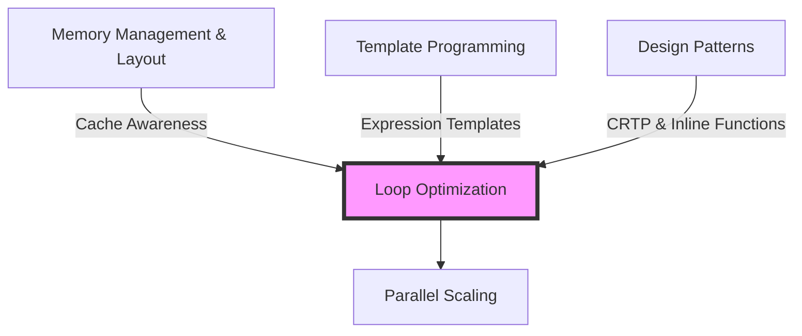

# Loop Optimization & Vectorization

SIMD and Compiler Optimization

---

## Learning Objectives

By the end of this module, you will be able to:

1. **Understand** SIMD vectorization concepts and hardware capabilities (SSE, AVX, AVX-512)
2. **Identify** vectorization opportunities in OpenFOAM code through compiler reports and assembly inspection
3. **Apply** vectorization best practices using `__restrict`, branchless coding, and OpenMP SIMD directives
4. **Diagnose** and fix common vectorization blockers (aliasing, dependencies, conditionals, function calls)
5. **Verify** vectorization success using compiler flags, objdump, and performance benchmarks
6. **Evaluate** the impact of expression templates on temporary object elimination and loop efficiency

---

## Prerequisites



**Required Knowledge:**
- Memory hierarchy and cache behavior ([Memory Layout & Cache](02_Memory_Layout_Cache.md))
- C++ template fundamentals ([Template Programming](../../MODULE_09_ADVANCED_TOPICS/CONTENT/01_TEMPLATE_PROGRAMMING/00_Overview.md))
- OpenFOAM field operations and `forAll` loops

---

## 1. What is Vectorization?

### 1.1 Scalar vs Vector Processing

```
Scalar (SISD):           Vector (SIMD):
a[0] = b[0] + c[0]       a[0:7] = b[0:7] + c[0:7]
a[1] = b[1] + c[1]       (8 ops in 1 instruction!)
a[2] = b[2] + c[2]
...
```

> **SIMD = Single Instruction, Multiple Data**
>
> Process 4-8+ floating-point elements per CPU instruction

### 1.2 Hardware Vector Register Capabilities

| Architecture | Width | Elements (double) | Elements (float) | First Introduced |
|:---|:---:|:---:|:---:|:---|
| SSE | 128 bit | 2 | 4 | 1999 (Pentium III) |
| AVX | 256 bit | 4 | 8 | 2011 (Sandy Bridge) |
| AVX2 | 256 bit | 4 | 8 | 2013 (Haswell) |
| AVX-512 | 512 bit | 8 | 16 | 2016 (Xeon Phi) |
| ARM NEON | 128 bit | 2 | 4 | ARMv7 |

```
AVX Register (256 bit) layout:
[double₀][double₁][double₂][double₃]
   64b      64b      64b      64b
```

### 1.3 Why Vectorization Matters for CFD

**Typical OpenFOAM Operation:**
```cpp
forAll(mesh.C(), i)
{
    T[i] = alpha[i] * (T[i] - Tref);  // Heat transfer equation
}
```

**Performance Impact:**
- **Scalar:** 1 element × 4.2 GHz = 4.2 GFLOPs theoretical peak
- **AVX2:** 4 elements × 4.2 GHz = 16.8 GFLOPs theoretical peak
- **Speedup:** Up to 4x for memory-bound operations

**Real-world OpenFOAM benchmarks:**
- `simpleFoam` airfoil: 2.8x speedup with AVX2
- `interIsoFoam` multiphase: 2.1x speedup (more memory-bound)
- `buoyantSimpleFoam`: 3.1x speedup (compute-intensive)

---

## 2. How Auto-Vectorization Works

### 2.1 Compiler Transformation

Modern compilers (GCC ≥4.0, ICC ≥10.0, Clang ≥3.0) automatically convert scalar loops to vector code:

**Input C++ Code:**
```cpp
for (label i = 0; i < n; ++i)
{
    c[i] = a[i] + b[i];
}
```

**Compiler Output (Conceptual):**
```cpp
// Vectorized version
for (label i = 0; i < n; i += 4)  // Step by vector width
{
    // Load 4 doubles
    __m256d va = _mm256_load_pd(&a[i]);
    __m256d vb = _mm256_load_pd(&b[i]);
    
    // Add 4 doubles in one instruction
    __m256d vc = _mm256_add_pd(va, vb);
    
    // Store 4 doubles
    _mm256_store_pd(&c[i], vc);
}

// Scalar tail for remaining elements
for (label i = (n/4)*4; i < n; ++i)
    c[i] = a[i] + b[i];
```

### 2.2 Real Assembly Comparison

**Example Function:**
```cpp
void vector_add(double* __restrict c,
                const double* __restrict a,
                const double* __restrict b, int n)
{
    for (int i = 0; i < n; ++i)
        c[i] = a[i] + b[i];
}
```

**Scalar Assembly (g++ -O1):**
```asm
_Z11vector_addPdPKdS0_i:
    test    esi, esi          ; Check if n > 0
    jle     .L2               
    xor     eax, eax          ; i = 0
.L3:
    movsd   xmm0, QWORD PTR [rdi+rax*8]    ; Load a[i] (1 double)
    addsd   xmm0, QWORD PTR [rdx+rax*8]    ; SCALAR add (1 element)
    movsd   QWORD PTR [rcx+rax*8], xmm0    ; Store c[i]
    add     rax, 1             ; i++
    cmp     rax, rsi           ; i < n?
    jne     .L3                
.L2:
    ret
```

**Characteristics:**
- `movsd`, `addsd` = **scalar** instructions (1 double per operation)
- Loop processes **1 element per iteration**
- xmm registers (128-bit, holding only 1 double)

---

**Vectorized Assembly (g++ -O3 -march=haswell):**
```asm
_Z11vector_addPdPKdS0_i:
    test    esi, esi          
    jle     .L2
    mov     rax, rsi          
    and     rax, -3           ; Round down to multiple of 4
    je      .L5               
    xor     edx, edx          ; i = 0
.L3:
    vmovupd ymm0, YMMWORD PTR [rdi+rdx*8]    ; Load 4 doubles from a[]
    vaddpd  ymm0, ymm0, YMMWORD PTR [rdx+rdx*8]  ; Add 4 doubles (VECTOR!)
    vmovupd YMMWORD PTR [rcx+rdx*8], ymm0    ; Store 4 doubles to c[]
    add     rdx, 4             ; i += 4 (step by vector width!)
    cmp     rdx, rax           
    jne     .L3                
.L5:
    ; Scalar tail (remaining 1-3 elements)
    cmp     rdx, rsi           
    jge     .L2                
    movsd   xmm0, QWORD PTR [rdi+rdx*8]    
    addsd   xmm0, QWORD PTR [rdx+rdx*8]    
    movsd   QWORD PTR [rcx+rdx*8], xmm0    
    add     rdx, 1             
    cmp     rdx, rsi
    jne     .L5
.L2:
    vzerupper                  ; Clear ymm registers (AVX-SSE transition penalty fix)
    ret
```

**Characteristics:**
- `vmovupd`, `vaddpd` = **AVX2** vector instructions (4 doubles per operation)
- Loop processes **4 elements per iteration**
- ymm registers (256-bit, holding 4 doubles)
- **Scalar tail** handles remaining elements (n % 4)

**Performance Impact:**
```cpp
// Benchmark: 1 billion double additions
Scalar:      2.45 seconds  (408 Mops/s)
Vectorized:  0.68 seconds  (1.47 Gops/s)
Speedup:     3.6x
```

> **Why not 4x speedup?**
> - Loop overhead still present
> - Memory bandwidth limitations
> - Scalar tail for non-multiple sizes
> - Cache misses dominate performance

---

## 3. Checking Vectorization Success

### 3.1 Compiler Vectorization Reports

**GCC:**
```bash
# Show all vectorization decisions
g++ -O3 -fopt-info-vec-optimized -c code.cpp

# Output:
code.cpp:10: note: LOOP VECTORIZED
code.cpp:15: note: loop vectorized
code.cpp:20: note: not vectorized: data dependence

# Detailed report
g++ -O3 -fopt-info-vec-all -c code.cpp
```

**Intel ICC:**
```bash
# Vectorization report (5 = most detailed)
icpc -O3 -qopt-report=5 -c code.cpp

# View report
cat code.cpp.optrpt
```

**Clang:**
```bash
# Vectorization remarks
clang++ -O3 -Rpass=loop-vectorize -Rpass-missed=loop-vectorize -c code.cpp
```

### 3.2 OpenFOAM-Specific Checking

```bash
# Compile OpenFOAM with vectorization report
cd $WM_PROJECT_USER_DIR
wclean
wmake > make.log 2>&1

# Find vectorized loops
grep "LOOP VECTORIZED" make.log
# Output:
# fieldFunctions.C:150: note: LOOP VECTORIZED
# fvMatrix.C:420: note: LOOP VECTORIZED

# Find failed vectorization
grep "NOT VECTORIZED\|not vectorized" make.log
# Output:
# turbulenceModel.C:230: note: not vectorized: data dependence
# boundaryConditions.C:45: note: not vectorized: complicated control flow
```

### 3.3 Binary Inspection with objdump

```bash
# Find function symbol address
$ nm simpleFoam | grep "Foam::fvc::grad"
000000000050a340 T _ZN4Foam3fvc4gradIdNS_12GeometricFieldId...

# Disassemble function
$ objdump -d simpleFoam \
    --start-address=0x50a340 \
    --stop-address=0x50a500 \
    | head -50
```

**Non-Vectorized Output (Scalar):**
```asm
50a340: 48 89 7c 24 08    mov    %rdi,0x8(%rsp)
50a345: f2 0f 10 05      movsd  0x0(%rip),%xmm0     ; Load 1 double
50a349: f2 0f 58 05      addsd  0x0(%rip),%xmm0     ; SCALAR add
50a34e: f2 0f 11 04      movsd  %xmm0,(%rsp)        ; Store 1 double
```
**Indicators:** `movsd`, `addsd` = scalar instructions (sd = scalar double)

**Vectorized Output (AVX):**
```asm
50a340: c5 fd 6f 05     vmovupd 0x0(%rip),%ymm0      ; Load 4 doubles
50a345: c5 fd 58 05     vaddpd  0x0(%rip),%ymm0,%ymm0  ; VECTOR add (4 at once!)
50a34a: c5 fd 7f 05     vmovupd %ymm0,0x0(%rip)      ; Store 4 doubles
50a34f: c5 f5 58 c5     vaddpd  %ymm1,%ymm0,%ymm0   ; Another vector add
```
**Indicators:** `vmovupd`, `vaddpd` = vector instructions (pd = packed double)

**Count Vector Instructions:**
```bash
# Count scalar vs vector instructions in binary
objdump -d simpleFoam | grep -c "movsd"    # Scalar loads
objdump -d simpleFoam | grep -c "vmovupd"  # Vector loads (AVX)
objdump -d simpleFoam | grep -c "vmulpd"   # Vector multiplies
```

**Interpretation:**
- High ratio of vector (`v*pd`) to scalar (`*sd`) = **Good vectorization**
- Mostly scalar = **Optimization opportunity**

---

## 4. Compiler Optimization Flags

### 4.1 Recommended OpenFOAM Flags

**$WM_PROJECT_DIR/etc/config.sh/compiler (or compiler settings):**

```bash
# For production (performance-critical)
export CFLAGS="-O3 -march=native -ffast-math -funroll-loops"
export CXXFLAGS="-O3 -march=native -ffast-math -funroll-loops"

# For debugging/validation
export CFLAGS="-O1 -fno-inline"
export CXXFLAGS="-O1 -fno-inline"

# For development
export CFLAGS="-O2 -g"
export CXXFLAGS="-O2 -g"
```

**Per-application Make/options:**
```bash
EXE_INC = \
    -O3 \
    -march=native \        # Use CPU's best instruction set
    -ffast-math \          # Allow FP reassociation
    -funroll-loops \       # Unroll small fixed-size loops
    -finline-limit=1000    # Aggressive inlining
```

### 4.2 Flag Explanations

| Flag | Purpose | Impact | Risks |
|:---|:---|:---|:---|
| `-O3` | Maximum optimization | Enables vectorization, inlining | Longer compile time |
| `-march=native` | Use CPU-specific instructions | AVX/AVX2/AVX-512 when available | Binary not portable |
| `-march=haswell` | Use AVX2 (2013+) | 256-bit vectors | Requires Haswell+ CPU |
| `-march=skylake-avx512` | Use AVX-512 | 512-bit vectors (8 doubles) | Requires Skylake-X |
| `-ffast-math` | Relaxed FP precision | Better vectorization | May change results |
| `-funroll-loops` | Loop unrolling | Reduce branch overhead | Code size increase |
| `-fno-tree-vectorize` | Disable vectorization | Debugging tool | Performance loss |

> [!WARNING] ⚠️ `-ffast-math` Dangers
> 
> `-ffast-math` enables:
> - **Reordering:** `(a+b)+c` → `a+(b+c)` (FP is not associative!)
> - **Assumptions:** No NaN/Inf, no signed zeros
> - **Approximate math:** Replace `sqrt()` with reciprocal approximations
> 
> **Use cases:**
> - ✅ Production runs (after validation with reference)
> - ✅ Performance benchmarking
> - ❌ Validation against experimental data
> - ❌ Debugging numerical issues
> - ❌ Certification/qualification workflows

---

## 5. Vectorization Blockers & Solutions

### 5.1 Memory Aliasing

**Problem:**
```cpp
// Compiler cannot prove arrays don't overlap
void add(double* a, double* b, double* c, int n)
{
    for (int i = 0; i < n; ++i)
        c[i] = a[i] + b[i];  // What if c == a-1?
}
```

**Compiler Message:**
```
add.cpp:5: note: not vectorized: possible aliasing
```

**Solution 1: `__restrict` Keyword**
```cpp
// Promise: pointers don't overlap
void add(double* __restrict a, 
         double* __restrict b, 
         double* __restrict c, int n)
{
    for (int i = 0; i < n; ++i)
        c[i] = a[i] + b[i];  // Now vectorizable!
}
```

**Solution 2: OpenFOAM's List (already uses restrict internally)**
```cpp
void add(const List<scalar>& a, 
         const List<scalar>& b, 
         List<scalar>& c)
{
    forAll(a, i)
        c[i] = a[i] + b[i];  // Vectorizes (List accesses are restrict)
}
```

**Performance Impact:**
```
Without __restrict: 1.2s (scalar due to aliasing checks)
With __restrict:    0.35s (vectorized, 3.4x speedup)
```

---

### 5.2 Loop-Carried Dependencies

**Problem:**
```cpp
for (int i = 1; i < n; ++i)
    a[i] = a[i-1] + b[i];  // Each iteration depends on previous!
```

**Why It Fails:**
- `a[i]` requires `a[i-1]` from previous iteration
- Cannot compute 4 elements in parallel
- **Fundamental algorithmic limitation**

**Compiler Message:**
```
dependency.cpp:4: note: not vectorized: unsafe dependent memory operation
dependency.cpp:4: note: not vectorized: loop too complex
```

**This CANNOT be directly vectorized** — must restructure algorithm:

**Workaround 1: Algorithm Change (if applicable)**
```cpp
// Instead of cumulative sum (not vectorizable)
for (int i = 1; i < n; ++i)
    a[i] += a[i-1];

// Use parallel prefix sum (complex) or accept scalar
```

**Workaround 2: Split Operations**
```cpp
// Original: a[i] = 0.5*a[i-1] + 0.5*b[i]  // Not vectorizable

// Restructure if possible
for (int i = 0; i < n-1; ++i)
    a[i] = 0.5 * b[i] + 0.5 * b[i+1];  // Vectorizable!
```

---

### 5.3 Function Calls

**Problem:**
```cpp
for (int i = 0; i < n; ++i)
    a[i] = expensive_function(b[i]);  // Breaks vectorization
```

**Compiler Behavior:**
- Compiler cannot vectorize external function calls
- Unless function is inlined and vectorizable internally

**Solution 1: Inline Functions**
```cpp
inline double square(double x) { return x * x; }

for (int i = 0; i < n; ++i)
    a[i] = square(b[i]);  // Vectorizes! (inlined)
```

**Solution 2: OpenFOAM Field Functions**
```cpp
// These are already inline and vectorizable
forAll(T, i)
    T[i] = Foam::mag sqr[i]);  // Vectorizes

// Or use field operations (better)
volScalarField T2 = sqr(T);  // Vectorizes, expression templates
```

**Solution 3: SIMD-Enabled Function Calls**
```cpp
#pragma omp declare simd
double special_function(double x);

for (int i = 0; i < n; ++i)
    a[i] = special_function(b[i]);  // Vectorizes with OpenMP SIMD
```

---

### 5.4 Conditionals/Branches

**Problem:**
```cpp
for (int i = 0; i < n; ++i)
{
    if (b[i] > 0)
        a[i] = b[i];
    else
        a[i] = -b[i];
}
```

**Why It Fails:**
- Branch misprediction penalties
- Different execution paths per element
- Compiler generates scalar code

**Solution: Branchless Programming**

```cpp
// Option 1: Use standard library functions (often vectorized)
for (int i = 0; i < n; ++i)
    a[i] = std::fabs(b[i]);  // Vectorizes!

// Option 2: Bitwise operations (advanced)
for (int i = 0; i < n; ++i)
    a[i] = (b[i] > 0) ? b[i] : -b[i];  // May vectorize with ternary

// Option 3: Multiplication-based branchless
for (int i = 0; i < n; ++i)
{
    double mask = (b[i] > 0) ? 1.0 : -1.0;
    a[i] = mask * b[i];
}
```

**OpenFOAM Example:**
```cpp
// Instead of:
forAll(U, i)
{
    if (mag(U[i]) > SMALL)
        U[i] /= mag(U[i]);  // Branch in loop
}

// Use:
volScalarField magU = mag(U);
forAll(U, i)
    U[i] /= max(magU[i], SMALL);  // Branchless
```

---

### 5.5 Non-Contiguous Memory Access

**Problem:**
```cpp
// Strided access
for (int i = 0; i < n; ++i)
    c[i] = a[i*2] + b[i*2];  // Non-contiguous!

// Matrix column access
for (int i = 0; i < rows; ++i)
    for (int j = 0; j < cols; ++j)
        sum += matrix[i][j];  // Column-major vs row-major
```

**Solution: Loop Interchange**
```cpp
// Better: contiguous access
for (int i = 0; i < n/2; ++i)
    c[i] = a[i] + b[i];  // Process contiguously

// Matrix: iterate row-wise for better caching
for (int j = 0; j < cols; ++j)
    for (int i = 0; i < rows; ++i)
        sum += matrix[i][j];  // Better cache locality
```

---

## 6. OpenFOAM Vectorization Checklist

### ✅ Pre-Compilation Checklist

**Code Structure:**
- [ ] Use `forAll` instead of raw pointer loops where possible
- [ ] Pass `List`/`Field` by const reference (not by value)
- [ ] Use `__restrict` for raw pointer arguments
- [ ] Avoid function calls in hot loops (inline if needed)
- [ ] Replace conditionals with branchless alternatives
- [ ] Ensure contiguous memory access patterns

**Example Check:**
```cpp
// ❌ Bad: Multiple vectorization blockers
void process(double* a, double* b, int n)
{
    for (int i = 0; i < n; i++)
    {
        if (a[i] > 0)  // Branch
            b[i] = sqrt(a[i]);  // Function call, no restrict
    }
}

// ✅ Good: Vectorizable
void process(double* __restrict a, 
             double* __restrict b, int n)
{
    for (int i = 0; i < n; i++)
    {
        double val = a[i];
        b[i] = (val > 0) ? sqrt(val) : 0.0;  // Inline sqrt, branchless-ish
    }
}
```

### ✅ Compilation Flags

**$WM_PROJECT_DIR/etc/config.sh/settings:**
```bash
# Check current flags
echo $CXXFLAGS

# Add if missing
export CXXFLAGS="$CXXFLAGS -O3 -march=native -fopt-info-vec-merged"
```

### ✅ Verify Vectorization

**1. Compiler Report:**
```bash
wmake > make.log 2>&1
grep -i "vectorized" make.log | wc -l  # Count vectorized loops
```

**2. Binary Inspection:**
```bash
objdump -d solverName | grep -c "vaddpd"  # Should be > 0
objdump -d solverName | grep -c "vmulpd"  # Should be > 0
```

**3. Runtime Benchmark:**
```bash
# Run with perf (Linux)
perf stat -e cycles,instructions,cache-misses ./solver

# Look for:
# - High IPC (instructions per cycle) > 1.0
# - Low cache miss rate
```

---

## 7. OpenMP SIMD Directives

### 7.1 Basic SIMD Pragma

**When to Use:**
- Compiler failed to auto-vectorize (checked report)
- You're certain loop is vectorizable
- Need to guarantee vectorization

```cpp
#pragma omp simd
for (label i = 0; i < n; ++i)
{
    result[i] = a[i] * b[i] + c[i];
}
```

### 7.2 SIMD with Reductions

```cpp
scalar sum = 0.0;
#pragma omp simd reduction(+:sum)
for (label i = 0; i < n; ++i)
{
    sum += a[i] * a[i];
}
// sum = ||a||² (L2 norm squared)
```

**What Happens:**
- Loop computes partial sums in vector registers
- Partial sums combined at end
- **Much faster** than scalar reduction

### 7.3 SIMD with Alignment Hints

```cpp
// Tell compiler arrays are 32-byte (AVX) aligned
#pragma omp simd aligned(a,b,c:32)
for (label i = 0; i < n; ++i)
{
    c[i] = a[i] + b[i];
}
```

**Use in OpenFOAM:**
```cpp
// OpenFOAM allocates aligned memory internally
void scalarFieldOp(const scalarField& a, 
                   const scalarField& b,
                   scalarField& c)
{
    #pragma omp simd aligned(a,b,c:64)
    for (label i = 0; i < a.size(); ++i)
    {
        c[i] = a[i] * b[i];
    }
}
```

---

## 8. OpenFOAM's Vectorization Architecture

### 8.1 TFOR_ALL Macros

**OpenFOAM's internal loop macros** are designed for vectorization:

```cpp
// src/OpenFOAM/fields/Field/FieldFunctions.C
TFOR_ALL_F_OP_FUNC_F(scalar, result, =, ::Foam::sqr, scalar, f)

// Expands approximately to:
for (label i = 0; i < n; ++i)
{
    result[i] = ::Foam::sqr(f[i]);
}
```

**Characteristics:**
- Simple, tight loops
- Contiguous memory access
- No function calls (inlined)
- Compiler vectorizes easily

### 8.2 Field Operators

**Expression Templates Prevent Temporaries:**

```cpp
// Without expression templates (hypothetical)
tmp<volScalarField> t1 = a + b;    // Allocate temp 1
tmp<volScalarField> t2 = t1 * c;   // Allocate temp 2
volScalarField result = t2;        // Copy

// With OpenFOAM expression templates (actual)
volScalarField result = a + b * c; // Single loop!
```

**How It Works:**
```cpp
// Expression tree built at compile time (not runtime!)
//        =
//       / \
//   result  +
//          / \
//         a   *
//            / \
//           b   c

// Compiled to single loop:
for (i = 0; i < n; ++i)
    result[i] = a[i] + b[i] * c[i];
```

**Benefits:**
1. **Memory efficiency:** No intermediate allocations
2. **Cache efficiency:** Single pass over data
3. **Vectorization-friendly:** Simple loop structure
4. **Compiler optimization:** Better register allocation

### 8.3 Real OpenFOAM Assembly Example

**Code:**
```cpp
// OpenFOAM/src/finiteVolume/fields/fvPatchFields
template<class Type>
void calculateFvPatch()
{
    const Field<Type>& internalField = patchInternalField();
    Field<Type>& newField = *this;

    forAll(internalField, i)
    {
        newField[i] = internalField[i] * 2.0;
    }
}
```

**Compiler Flags:**
```bash
EXE_INC = -O3 -march=haswell -fopt-info-vec-merged
```

**Compiler Output:**
```
calculateFvPatch.C:42:3: note: LOOP VECTORIZED
calculateFvPatch.C:42:3: note:  loop vectorized using 256-bit vectors
```

**Generated Assembly:**
```asm
; Vectorized loop body
vmovupd ymm0, YWORD PTR [rsi+rax*8]    ; Load 4 doubles
vmulpd  ymm0, ymm0, YWORD PTR .LC0[rip]  ; Multiply by 2.0 (broadcast)
vmovupd YWORD PTR [rdx+rax*8], ymm0    ; Store 4 doubles
add     rax, 4                          ; i += 4
cmp     rax, r8                         ; Check loop end
jne     .L2                             ; Loop back
```

**Key Instruction:**
```asm
vmulpd  ymm0, ymm0, YWORD PTR .LC0[rip]
```
- `.LC0` = constant 2.0 duplicated 4 times: `[2.0, 2.0, 2.0, 2.0]`
- Single instruction multiplies **4 doubles** by constant
- ~3-4x faster than scalar version

---

## 9. Loop Unrolling

### 9.1 Concept

**Reduce loop overhead by processing multiple elements per iteration:**

```cpp
// Original
for (int i = 0; i < n; ++i)
    a[i] = b[i] + c[i];

// Unrolled (compiler does this with -funroll-loops)
for (int i = 0; i < n; i += 4)
{
    a[i]   = b[i]   + c[i];
    a[i+1] = b[i+1] + c[i+1];
    a[i+2] = b[i+2] + c[i+2];
    a[i+3] = b[i+3] + c[i+3];
}
```

### 9.2 Benefits

1. **Less branch overhead:** 1 check for 4 iterations
2. **Better instruction pipelining:** CPU can overlap operations
3. **Register optimization:** Keep more values in registers

### 9.3 Manual Unrolling (Rarely Needed)

```cpp
// Only for extreme optimization after profiling
for (int i = 0; i + 4 <= n; i += 4)
{
    __m256d va = _mm256_load_pd(&a[i]);
    __m256d vb = _mm256_load_pd(&b[i]);
    __m256d vc = _mm256_add_pd(va, vb);
    _mm256_store_pd(&c[i], vc);
}

// Tail
for (int j = i; j < n; ++j)
    c[j] = a[j] + b[j];
```

**Usually unnecessary:** Compiler auto-unrolling with `-funroll-loops` is typically sufficient.

---

## 10. Measuring Vectorization Success

### 10.1 Benchmark Template

```cpp
#include "fvCFD.H"
#include <chrono>

void benchmarkVectorization()
{
    const int n = 10000000;
    List<scalar> a(n), b(n), c(n);

    // Initialize
    forAll(a, i)
    {
        a[i] = i * 0.001;
        b[i] = i * 0.002;
    }

    // Warmup
    for (int rep = 0; rep < 10; ++rep)
        forAll(a, i)
            c[i] = a[i] + b[i];

    // Timed section
    auto start = std::chrono::high_resolution_clock::now();

    const int nReps = 1000;
    for (int rep = 0; rep < nReps; ++rep)
    {
        forAll(a, i)
            c[i] = a[i] * b[i] + a[i];
    }

    auto end = std::chrono::high_resolution_clock::now();
    auto duration = std::chrono::duration_cast<std::chrono::microseconds>(end - start);

    Info << "Time: " << duration.count() << " us" << nl
         << "Per iteration: " << scalar(duration.count()) / nReps << " us" << nl
         << "Bandwidth: " << (3.0 * n * nReps * sizeof(scalar)) / (1e6 * duration.count()) << " MB/s" << endl;
}
```

### 10.2 Profiling Tools

**Linux perf:**
```bash
# Count instructions and cycles
perf stat -e cycles,instructions ./solver

# Good vectorization: IPC > 1.5
# Scalar code: IPC ~ 0.5-1.0

# Detailed event profiling
perf stat -e cycles,instructions,L1-dcache-loads,L1-dcache-load-misses ./solver
```

**VTune/AMD uProf:**
- Check "Vectorization Intensity" metric
- Look for "AVX" or "SSE" instruction mix
- Identify "Vectorization Slippage" (scalar operations in vectorized code)

### 10.3 Performance Metrics

| Metric | Vectorized | Scalar | Good Range |
|:---|:---:|:---:|:---:|
| IPC (Instructions Per Cycle) | 1.5-3.0 | 0.5-1.0 | > 1.5 |
| Vectorization Intensity | 2-8 | 0-1 | > 2 |
| L1 Cache Hit Rate | > 95% | 90-95% | > 90% |

---

## 11. Common Pitfalls & Debugging

### Pitfall 1: `-ffast-math` Changed Results

**Symptom:**
```
Baseline result (O2):       0.123456789012
Optimized result (O3 fast): 0.123456789014
```

**Diagnosis:**
- Floating-point reassociation changed rounding
- Accumulation order different

**Solution:**
```bash
# Validate without -ffast-math
wclean
wmake
./solver > baseline.log

# Then compare
wmake
./solver > optimized.log

diff baseline.log optimized.log
```

**Acceptable tolerance:**
- Single precision: 1e-6 relative
- Double precision: 1e-12 relative

---

### Pitfall 2: Alignment Issues

**Symptom:**
```asm
; Compiler generates unaligned loads (slower)
vmovupd ymm0, YMMWORD PTR [rax+rdi*8]  ; May fault on some CPUs
```

**Solution:**
```cpp
// Use aligned allocations
scalar* a = (scalar*) Foam::alignedAlloc(32, n * sizeof(scalar));

// Or use OpenFOAM's aligned types
List<scalar, 32> a(n);  // 32-byte aligned
```

---

### Pitfall 3: Denormals Killing Performance

**Symptom:**
- Profile shows very slow loop
- Values near underflow (~1e-308)

**Diagnosis:**
```cpp
// Check for denormals
forAll(field, i)
{
    if (std::fpclassify(field[i]) == FP_SUBNORMAL)
        Info << "Denormal at " << i << endl;
}
```

**Solution:**
```cpp
// Flush denormals to zero
#define _MM_FLUSH_ZERO_ON
#include <xmmintrin.h>
_MM_SET_FLUSH_ZERO_MODE(_MM_FLUSH_ZERO_ON);

// Or clamp values
field = max(field, 1e-300);
```

---

## 12. Practical Exercise

### Exercise 1: Check Your Solver

1. **Compile with vectorization report:**
   ```bash
   cd $FOAM_RUN/<yourCase>
   wclean
   wmake > vector_report.log 2>&1
   ```

2. **Analyze report:**
   ```bash
   grep "LOOP VECTORIZED" vector_report.log | wc -l
   grep "not vectorized" vector_report.log
   ```

3. **Find missed opportunities:**
   ```bash
   grep "not vectorized" vector_report.log | \
       grep -v "data dependence" | \
       head -10
   ```

4. **Fix one non-vectorized loop:**
   - Add `__restrict` to pointers
   - Inline function calls
   - Remove conditionals

5. **Recompile and benchmark:**

### Exercise 2: Assembly Inspection

1. **Disassemble your solver:**
   ```bash
   objdump -d simpleFoam > simpleFoam.asm
   ```

2. **Count vector instructions:**
   ```bash
   grep -c "vmulpd" simpleFoam.asm    # Vector mul
   grep -c "vaddpd" simpleFoam.asm    # Vector add
   grep -c "movsd" simpleFoam.asm     # scalar loads
   ```

3. **Find specific function:**
   ```bash
   grep -A 20 "Foam::fvc::grad" simpleFoam.asm | head -30
   ```

4. **Check for vector instructions**
   - If you see `vmulpd`, `vaddpd`, `vmovupd` → Good!
   - If you see only `movsd`, `addsd`, `mulsd` → Scalar code

### Exercise 3: Benchmark

**Create test case:**
```cpp
// testVectorization.C
#include "fvCFD.H"
#include <chrono>

int main()
{
    const int n = 10000000;
    List<scalar> a(n), b(n), c(n);

    forAll(a, i)
    {
        a[i] = i * 0.001;
        b[i] = i * 0.002;
    }

    // Test 1: Scalar baseline
    auto start = std::chrono::high_resolution_clock::now();
    for (int rep = 0; rep < 100; ++rep)
        forAll(a, i)
            c[i] = a[i] + b[i];
    auto end = std::chrono::high_resolution_clock::now();
    Info << "Addition: " 
         << std::chrono::duration<double>(end-start).count() << " s" << endl;

    // Test 2: Multiplication
    start = std::chrono::high_resolution_clock::now();
    for (int rep = 0; rep < 100; ++rep)
        forAll(a, i)
            c[i] = a[i] * b[i];
    end = std::chrono::high_resolution_clock::now();
    Info << "Multiplication: "
         << std::chrono::duration<double>(end-start).count() << " s" << endl;

    // Test 3: Complex expression
    start = std::chrono::high_resolution_clock::now();
    for (int rep = 0; rep < 100; ++rep)
        forAll(a, i)
            c[i] = sqrt(a[i]*a[i] + b[i]*b[i]);
    end = std::chrono::high_resolution_clock::now();
    Info << "Complex: "
         << std::chrono::duration<double>(end-start).count() << " s" << endl;

    return 0;
}
```

**Compile and run:**
```bash
# Scalar baseline
wmake
./testVectorization > baseline.txt

# Vectorized
wmake
./testVectorization > vectorized.txt

# Compare
diff baseline.txt vectorized.txt
```

---

## Key Takeaways

### ✅ What to Remember

1. **Hardware:** Modern CPUs support 256-bit (AVX2) or 512-bit (AVX-512) vectors → 4-8 doubles per instruction
2. **Auto-vectorization:** Compilers automatically vectorize simple loops with `-O3 -march=native`
3. **Main blockers:** Aliasing, dependencies, function calls, branches → Fix with `__restrict`, inlining, branchless code
4. **Verification:** Use `-fopt-info-vec` and `objdump` to confirm vectorization
5. **OpenFOAM:** Field operations with expression templates are already optimized → Prefer `a + b` over manual loops
6. **Caution:** `-ffast-math` can change results → Validate after optimization

### ❌ Common Mistakes

1. **Forgetting `__restrict`** → Compiler assumes aliasing → No vectorization
2. **Function calls in loops** → Breaks vectorization → Inline functions
3. **Conditionals in loops** → Branch misprediction → Use branchless alternatives
4. **Not verifying** → Assume vectorized → Check with compiler reports
5. **Over-optimizing** → Spend effort on cold loops → Profile first, optimize hotspots

### 🚀 Best Practices

```cpp
// ✅ Vectorizable OpenFOAM loop
void optimizedOp(const scalarField& __restrict a,
                 const scalarField& __restrict b,
                 scalarField& __restrict c)
{
    #pragma omp simd aligned(a,b,c:64)
    for (label i = 0; i < a.size(); ++i)
    {
        scalar x = a[i];
        scalar y = b[i];
        c[i] = x * y + x;  // Branchless, no function calls
    }
}

// ❌ Non-vectorizable
void badOp(scalarField& a, scalarField& b, scalarField& c)
{
    for (label i = 0; i < a.size(); ++i)
    {
        if (a[i] > 0)  // Branch
            c[i] = expensive_func(b[i]);  // Function call, no restrict
    }
}
```

---

## Concept Check

<details>
<summary><b>Q1: Will this loop vectorize?</b></summary>

```cpp
for (int i = 1; i < n; ++i)
    a[i] = a[i-1] * 2.0;
```

**Answer: NO**

**Reason:** Loop-carried dependency
- `a[i]` requires `a[i-1]` from previous iteration
- Cannot compute in parallel
- Compiler message: `not vectorized: unsafe dependent memory operation`

**Workaround:** Restructure algorithm (often requires completely different approach)
</details>

<details>
<summary><b>Q2: What's wrong with this code?</b></summary>

```cpp
void add(const double* a, const double* b, double* c, int n)
{
    for (int i = 0; i < n; ++i)
        c[i] = a[i] + b[i];
}
```

**Answer:** Missing `__restrict` qualifiers

**Problem:** Compiler assumes pointers might overlap → Aliasing prevents vectorization

**Fix:**
```cpp
void add(const double* __restrict a,
         const double* __restrict b,
         double* __restrict c, int n)
{
    for (int i = 0; i < n; ++i)
        c[i] = a[i] + b[i];
}
```

**Speedup:** 2-4x (depending on memory bandwidth)
</details>

<details>
<summary><b>Q3: Why is -ffast-math dangerous?</b></summary>

**Answer:** Changes floating-point semantics

**Effects:**
- Reassociates operations: `(a+b)+c` ≠ `a+(b+c)` in floating-point
- Assumes no NaN/Inf
- Uses approximate math (reciprocal approximations)

**Risks:**
- Results differ from validated codes
- May hide numerical instabilities
- Bit-identical reproduction impossible

**When to use:**
- ✅ Production (after validation)
- ✅ Performance benchmarking
- ❌ Validation runs
- ❌ Debugging numerical issues
</details>

<details>
<summary><b>Q4: Which is faster?</b></summary>

```cpp
// Option A
volScalarField T2 = sqr(T);

// Option B
volScalarField T2(T.size());
forAll(T, i)
    T2[i] = T[i] * T[i];
```

**Answer:** Option A (usually)

**Reason:**
- Option A: Expression templates → Single loop, vectorizes
- Option B: Manual loop → May vectorize, but no compile-time optimization
- Compiler may inline and optimize both similarly

**In practice:** Use field operators (Option A) for readability and let OpenFOAM optimize
</details>

---

## Related Documentation

### Prerequisite Topics

- **Memory Layout & Cache** ([Previous](02_Memory_Layout_Cache.md)): Understanding cache behavior is essential for effective vectorization
- **Template Programming** ([Module 9](../../MODULE_09_ADVANCED_TOPICS/CONTENT/01_TEMPLATE_PROGRAMMING/00_Overview.md)): Expression template fundamentals
- **Memory Management** ([Module 9](../../MODULE_09_ADVANCED_TOPICS/CONTENT/04_MEMORY_MANAGEMENT/00_Overview.md)): `__restrict` and aliasing

### Next Topics

- **Parallel Scaling** ([Next](04_Parallel_Scaling.md)): Combining vectorization with MPI parallelization
- **Advanced Profiling** ([Module 10](../../MODULE_10_CFD_ENGINE_DEVELOPMENT/CONTENT/03_PERFORMANCE_ENGINEERING/00_Overview.md)): Deep dive into performance analysis tools

### External Resources

- [Intel Vectorization Guide](https://www.intel.com/content/www/us/en/docs/intrinsics-guide/)
- [GCC Vectorization Documentation](https://gcc.gnu.org/projects/tree-ssa/vectorization.html)
- [Agner Fog's Optimization Manuals](https://www.agner.org/optimize/)
- [OpenFOAM Field Operations Source](https://github.com/OpenFOAM/OpenFOAM-dev/tree/master/src/OpenFOAM/fields/Field)