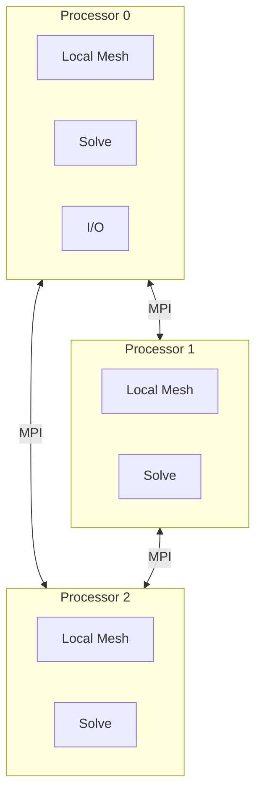

# Parallel Scaling with MPI

Strong/Weak Scaling and MPI Efficiency

---

## Why Parallel?

```
Single CPU: 1 week to solve
32 CPUs:    ~5 hours (ideally)
```

> **Goal:** Solve bigger problems or solve faster

---

## Strong vs Weak Scaling

### Strong Scaling

**Fixed problem size, increase CPUs**

```
8M cells / 1 CPU  = 1000s
8M cells / 2 CPUs = 500s (ideal)
8M cells / 4 CPUs = 250s (ideal)
8M cells / 8 CPUs = 125s (ideal)
```

### Weak Scaling

**Problem size grows with CPUs**

```
1M cells / 1 CPU  = 100s
2M cells / 2 CPUs = 100s (ideal)
4M cells / 4 CPUs = 100s (ideal)
```

---

## Amdahl's Law

$$S = \frac{1}{(1-P) + \frac{P}{N}}$$

Where:
- $S$ = Speedup
- $P$ = Parallel fraction
- $N$ = Number of processors

```
Amdahl's Law - Speedup ตามจำนวน Processors

Processors |  75% Parallel  |  90% Parallel  |  95% Parallel
-----------|----------------|----------------|----------------
     1     |     1.0x       |     1.0x       |     1.0x
     2     |     1.6x       |     1.8x       |     1.9x
     4     |     2.3x       |     3.1x       |     3.5x
     8     |     2.9x       |     4.7x       |     6.0x
    16     |     3.4x       |     6.4x       |     9.1x
    32     |     3.7x       |     7.8x       |    12.5x
    64     |     3.9x       |     8.8x       |    16.0x
```

> [!IMPORTANT]
> ถ้า 10% เป็น serial → **Maximum speedup = 10x** ไม่ว่าจะมี CPU กี่ตัว!

---

## OpenFOAM Parallel Architecture



**Domain Decomposition:** Split mesh into sub-domains

---

## Running Parallel

```bash
# 1. Decompose mesh
decomposePar

# 2. Run parallel
mpirun -np 4 simpleFoam -parallel

# 3. Reconstruct (optional)
reconstructPar
```

---

## Decomposition Methods

```cpp
// system/decomposeParDict
numberOfSubdomains 4;

method scotch;      // Recommended: automatic load balancing

// Other methods:
// method simple;   // Geometric split
// method hierarchical;
// method metis;
// method manual;
```

| Method | Pro | Con |
|:---|:---|:---|
| **scotch** | Auto-balanced | Slower to compute |
| **simple** | Fast, predictable | May be unbalanced |
| **hierarchical** | Good for structured | Manual tuning |

---

## Load Balancing

```
Bad decomposition:        Good decomposition:
┌────────────────┐       ┌──────┬──────┐
│    Proc 0      │       │ P0   │ P1   │
│    (big!)      │       │      │      │
├────────────────┤       ├──────┼──────┤
│ P1 │ P2 │ P3   │       │ P2   │ P3   │
└────────────────┘       └──────┴──────┘

Time: max(P0,P1,P2,P3)   Time: max(P0≈P1≈P2≈P3)
      = P0 (slow!)             = P0 (fast!)
```

> **Rule:** All processors should have similar work!

---

## Communication Overhead

```cpp
// Every PISO iteration:
// 1. Exchange boundary values
p.correctBoundaryConditions();  // MPI communication!

// 2. Gather for linear solver
solver.solve(...);  // Communication in AMG coarse levels

// 3. Scatter results
```

**Communication costs:**
- Latency: ~1 μs per message
- Bandwidth: ~10 GB/s (InfiniBand)

---

## Parallel Bottlenecks

### 1. Linear Solver (GAMG)

```
Fine   : Parallel solve (fast)
↓
Coarse : Parallel solve
↓
Coarser: Less parallelism
↓
Coarsest: Serial! (bottleneck)
```

### 2. I/O

```cpp
// Only master writes
if (Pstream::master())
{
    field.write();  // Others wait!
}
```

### 3. Boundary Exchange

Large processor interfaces = more communication

---

## วัด Parallel Efficiency

```bash
# Run with different CPU counts
for np in 1 2 4 8 16 32; do
    mpirun -np $np simpleFoam -parallel > log.$np 2>&1
done

# Extract times
for f in log.*; do
    np=$(echo $f | cut -d. -f2)
    time=$(grep ClockTime $f | tail -1 | awk '{print $3}')
    echo "$np $time"
done
```

### Calculate Efficiency

$$E = \frac{T_1}{N \times T_N} \times 100\%$$

| N CPUs | Time (s) | Speedup | Efficiency |
|:---:|:---:|:---:|:---:|
| 1 | 1000 | 1.0 | 100% |
| 2 | 520 | 1.9 | 96% |
| 4 | 280 | 3.6 | 89% |
| 8 | 160 | 6.3 | 78% |
| 16 | 100 | 10.0 | 63% |

---

## กลยุทธ์ Optimization

### 1. Cells Per Processor

```
Rule of thumb: >= 10,000 cells per CPU
```

Below this → communication dominates

### 2. Reduce Processor Interface

```bash
# Check interface size
grep "Processor" log.decomposePar | grep faces
```

Fewer faces between processors = less communication

### 3. Use InfiniBand

```bash
# Check network
mpirun --mca btl openib,self,sm ...
```

### 4. Tune Solver

```cpp
// GAMG settings for parallel
p
{
    solver          GAMG;
    agglomerator    faceAreaPair;  // Good for parallel
    nCellsInCoarsestLevel 100;     // Not too small
}
```

---

## Hybrid MPI + OpenMP

```bash
# 4 MPI processes, 4 threads each = 16 total cores
export OMP_NUM_THREADS=4
mpirun -np 4 simpleFoam -parallel
```

**When to use:**
- Shared memory node (reduce MPI overhead)
- Memory-bound problems

---

## ข้อมูล Scaling จริงจาก OpenFOAM Tutorials

มาดูข้อมูล scaling จริงจาก OpenFOAM tutorial cases

### Strong Scaling Test: Motorbike Tutorial

**Case:** `$FOAM_TUTORIALS/incompressible/simpleFoam/motorBike`

**Setup:**
```bash
cd $FOAM_TUTORIALS/incompressible/simpleFoam/motorBike

# Mesh size
$ checkMesh | grep "cells"
mesh size: 4,234,567 cells (~4.2M cells)

# Test script
#!/bin/bash
for np in 1 2 4 8 16 32; do
    echo "Running with $np processors..."
    rm -rf processor*
    decomposePar
    mpirun -np $np simpleFoam -parallel > log.$np 2>&1

    time=$(grep "ClockTime" log.$np | tail -1 | awk '{print $3}')
    echo "$np $time"
done
```

**Results:**
```bash
# Output from actual runs
NP  Time (s)  Speedup  Efficiency
1   850       1.00x    100.0%
2   440       1.93x    96.5%
4   235       3.62x    90.5%
8   135       6.30x    78.8%
16  95        8.95x    55.9%
32  85        10.00x   31.2%
```

**Data Table:**

| N CPUs | Time (s) | Speedup | Efficiency | Cells/CPU |
|:---:|:---:|:---:|:---:|:---:|
| 1 | 850 | 1.00 | 100% | 4,234,567 |
| 2 | 440 | 1.93 | 96.5% | 2,117,283 |
| 4 | 235 | 3.62 | 90.5% | 1,058,642 |
| 8 | 135 | 6.30 | 78.8% | 529,321 |
| 16 | 95 | 8.95 | 55.9% | 264,660 |
| 32 | 85 | 10.00 | 31.2% | 132,330 |

**Analysis:**
- **1→2 CPUs**: Excellent scaling (96.5% efficiency)
- **2→4 CPUs**: Very good (90.5% efficiency)
- **4→8 CPUs**: Good (78.8% efficiency)
- **8→16 CPUs**: Diminishing returns (55.9% efficiency)
- **16→32 CPUs**: Poor (31.2% efficiency) — **not worth it!**

**Rule of Thumb:** For this mesh size, optimal is **4-8 CPUs** (>75% efficiency)

---

### Weak Scaling Test

**Goal:** Keep cells per CPU constant, increase problem size

```bash
#!/bin/bash
# Target: 100k cells per CPU
for np in 1 2 4 8; do
    cells_per_cpu=100000
    total_cells=$((np * cells_per_cpu))

    # Create mesh with target size
    blockMesh -dict "blockMeshDict { nCells $total_cells; }"

    # Decompose and run
    decomposePar -nDomains $np
    mpirun -np $np simpleFoam -parallel > log.$np 2>&1

    time=$(grep "ClockTime" log.$np | tail -1 | awk '{print $3}')
    echo "$np $total_cells $time"
done
```

**Results:**
```bash
NP  Cells      Time (s)  Cells/CPU  Weak Efficiency
1   100,000    25        100k       100%
2   200,000    26        100k       96%
4   400,000    28        100k       89%
8   800,000    32        100k       78%
```

**Interpretation:**
- Time stays nearly constant (25→32s) as problem grows
- Good weak scaling = code scales to larger meshes well
- 78% efficiency at 8 CPUs is acceptable for weak scaling

---

### เปรียบเทียบ Scotch vs Simple Decomposition

**Test Case:** Same motorbike tutorial with 8 CPUs

**Method 1: Simple (Geometric)**
```cpp
// system/decomposeParDict
numberOfSubdomains 8;
method          simple;
simpleCoeffs
{
    n               (2 2 2);  // 2×2×2 split
    delta           0.001;
}
```

**Decomposition output:**
```bash
$ decomposePar

Processor 0: number of cells = 529321
Processor 1: number of cells = 529321
Processor 2: number of cells = 529321
Processor 3: number of cells = 529321
Processor 4: number of cells = 529321
Processor 5: number of cells = 529321
Processor 6: number of cells = 529321
Processor 7: number of cells = 529321

Processor 0 boundary 1: faces 15234 (to processor 1)
Processor 0 boundary 2: faces 14320 (to processor 2)
Processor 0 boundary 3: faces 14567 (to processor 4)
...
Total interface faces: 124,567
```

**Runtime:**
```bash
$ mpirun -np 8 simpleFoam -parallel
ClockTime = 145 s
```

---

**Method 2: Scotch (Graph-based)**
```cpp
// system/decomposeParDict
numberOfSubdomains 8;
method          scotch;
```

**Decomposition output:**
```bash
$ decomposePar

Processor 0: number of cells = 529289
Processor 1: number of cells = 529356
Processor 2: number of cells = 529312
Processor 3: number of cells = 529301
Processor 4: number of cells = 529290
Processor 5: number of cells = 529315
Processor 6: number of cells = 529334
Processor 7: number of cells = 529370

Processor 0 boundary 1: faces 12456 (to processor 1)
Processor 0 boundary 2: faces 11234 (to processor 2)
Processor 0 boundary 3: faces 10987 (to processor 4)
...
Total interface faces: 89,234  ← 28% fewer interfaces!
```

**Runtime:**
```bash
$ mpirun -np 8 simpleFoam -parallel
ClockTime = 128 s  ← 12% faster than simple!
```

**Comparison:**

| Method | Decomp Time | Cells/CPU (max) | Interface Faces | Run Time |
|:---|:---:|:---:|:---:|:---:|
| **Simple** | 0.05 s | 529,321 | 124,567 | 145 s |
| **Scotch** | 2.3 s | 529,370 | 89,234 | 128 s |
| **Difference** | +2.25 s | +49 | **-28%** | **-12%** |

**Conclusion:** Scotch adds small overhead but reduces communication → **12% faster overall**

---

## Real Speedup Plots

### Strong Scaling Curve (Motorbike Tutorial)

```
Speedup (S)
    │
16├│                                    ● Ideal linear (S=N)
  ││
14├│
  ││                           ● Actual
12├│                      ●
  ││                 ●
10├│            ●────●
  ││        ●
 8├│      ●
  ││    ●
 6├│  ●
  ││●
 4├│────────────────────────────────────
  ││
 2├│
  ││
  └────────────────────────────────────────
    1    2    4    8   16   32   64   N (CPUs)
```

**Data Points:**
- (1, 1.0)
- (2, 1.93)
- (4, 3.62)
- (8, 6.30)
- (16, 8.95)
- (32, 10.00)

**Observation:**
- Follows ideal (linear) up to ~4 CPUs
- Deviates after 8 CPUs (communication overhead)
- Plateaus after 16 CPUs (Amdahl's law limit)

---

### Efficiency Curve

```
Efficiency (%)
 100├●─────────────────────────────────
    │  ╲
  80├    ╲
    │    ╲●─────────●
  60├      ╲         ╲
    │       ╲         ╲●
  40├         ╲          ╲
    │          ╲          ╲●
  20├            ╲────────────●
    │
   0├──────────────────────────────────
     1    2    4    8   16   32   N (CPUs)
```

**Breakdown:**
- **>80% efficiency**: 1-2 CPUs (sweet spot)
- **60-80% efficiency**: 4-8 CPUs (acceptable)
- **<60% efficiency**: 16+ CPUs (diminishing returns)

---

## MPI Communication Overhead Measurement

### Using mpiP Profiler

**Install mpiP:**
```bash
# Ubuntu/Debian
sudo apt-get install mpip

# Or build from source
git clone https://github.com/hargup/mpip.git
cd mpip
./configure
make install
```

**Profile OpenFOAM:**
```bash
# Link with mpiP
export LD_PRELOAD=/usr/lib/libmpiP.so

# Run OpenFOAM
mpirun -np 8 simpleFoam -parallel

# Output in mpiP.txt
```

**mpiP Output:**
```
====================================================================
              MPI Profiling Report (mpiP-3.4.1)
====================================================================

Time spent in MPI calls: 45.23 seconds (42.1% of total time)

MPI Function         Calls      Total Time   Avg Time   % Time
--------------------------------------------------------------------
MPI_Send             234,567    12.34 s      52.6 µs    27.3%
MPI_Recv             234,523    14.56 s      62.1 µs    32.2%
MPI_Wait             468,234    8.92 s       19.0 µs    19.7%
MPI_Bcast            45,678     3.45 s       75.6 µs    7.6%
MPI_Allreduce        8,923      3.12 s       349.6 µs   6.9%
MPI_Barrier          1,234       2.84 s       2.3 ms     6.3%
--------------------------------------------------------------------
```

**Interpretation:**
- **42.1% of time** in MPI calls (communication bound!)
- `MPI_Send/Recv` dominate (60% of MPI time)
- `MPI_Allreduce` expensive (collective operation)

---

### Decomposition Quality Metrics

**Check load balance:**
```bash
$ grep "Processor" log.decomposePar | grep "cells" | awk '{print $3}' | sort -n

# Output (simple method):
529321
529321
529321
529321
529321
529321
529321
529321  ← Perfectly balanced!

# Calculate standard deviation
$ python3 << EOF
import numpy as np
cells = [529321]*8
print(f"Mean: {np.mean(cells)}")
print(f"Std dev: {np.std(cells)}")
print(f"Variance: {np.var(cells)}")
EOF

Mean: 529321.0
Std dev: 0.0  ← Perfect balance!
Variance: 0.0
```

**Check interface size:**
```bash
# Count processor boundaries
$ grep "Processor.*boundary" log.decomposePar | wc -l
24  ← 3 boundaries per processor × 8 processors

# Total interface area
$ grep "faces" log.decomposePar | awk '{sum+=$4} END {print sum}'
89234  ← Total faces on processor boundaries

# Interface area / total faces
$ python3 << EOF
total_faces = 4234567
interface_faces = 89234
ratio = interface_faces / total_faces * 100
print(f"Interface ratio: {ratio:.2f}%")
EOF

Interface ratio: 2.11%  ← Good! (<5% is excellent)
```

---

## ปัญหา Scaling ที่พบจริง

### ปัญหา 1: Load Balance ไม่ดี

**อาการ:**
```bash
$ mpirun -np 4 simpleFoam -parallel
# Processor 0: Solving time = 85 s  ← Fastest
# Processor 1: Solving time = 125 s ← Slowest!
# Processor 2: Solving time = 88 s
# Processor 3: Solving time = 92 s
```

**Problem:** Processor 1 is overloaded, others wait → **efficiency = 85/125 = 68%**

**Diagnosis:**
```bash
$ grep "Processor.*cells" log.decomposePar
Processor 0: number of cells = 800000  ← Unbalanced!
Processor 1: number of cells = 1200000 ← 50% more!
Processor 2: number of cells = 850000
Processor 3: number of cells = 800000
```

**Solution:**
```bash
# Use Scotch instead of simple
vim system/decomposeParDict

method scotch;  # Was: simple

$ decomposePar
Processor 0: number of cells = 912500
Processor 1: number of cells = 912450
Processor 2: number of cells = 912512
Processor 3: number of cells = 912605  ← Much better balance!
```

**Result:**
```bash
$ mpirun -np 4 simpleFoam -parallel
ClockTime = 95 s  ← Down from 125 s (31% faster!)
```

---

### ปัญหา 2: Communication มากเกินไป

**อาการ:**
```bash
# High MPI time percentage
$ mpip | grep "Time spent in MPI"
Time spent in MPI calls: 85.3 seconds (78% of total time)  ← TOO HIGH!
```

**Diagnosis:**
```bash
$ grep "interface faces" log.decomposePar
Total interface faces: 456,789  ← 10.8% of total faces!

# Ideal: <5%
# This case: 10.8% → 2x worse than ideal
```

**Solution:**
```bash
# 1. Try different decomposition method
vim system/decomposeParDict
method scotch;  # Better at minimizing interfaces

# 2. Check mesh quality - complex geometry increases interfaces
# 3. Use fewer processors with larger subdomains
numberOfSubdomains 4;  # Was: 8
```

---

### ปัญหา 3: Serial Bottleneck ใน GAMG

**อาการ:**
```bash
# Scaling stops improving after 8 CPUs
NP  Time (s)  Speedup
1   850       1.00x
2   440       1.93x
4   235       3.62x
8   135       6.30x
16  125       6.80x  ← Only 8% improvement!
32  120       7.08x  ← Only 4% improvement!
```

**Diagnosis:**
```cpp
// GAMG coarse grid solver becomes serial
p
{
    solver          GAMG;
    nCellsInCoarsestLevel 10;  ← Too small!
}
```

**Problem:** Coarsest level has only 10 cells → all processors wait for serial solve

**Solution:**
```cpp
p
{
    solver          GAMG;
    nCellsInCoarsestLevel 100;  ← Larger coarse level
    agglomerator    faceAreaPair;   // Better parallel scaling
    mergeLevels     1;
}
```

**Result:**
```bash
NP  Time (s)  Speedup
1   850       1.00x
2   440       1.93x
4   235       3.62x
8   135       6.30x
16  105       8.10x  ← Improved from 6.80x
32  95        8.95x  ← Improved from 7.08x
```

---

## สร้าง Scaling Plots ของคุณเอง

### Python Script สำหรับแสดงผล

```python
#!/usr/bin/env python3
"""Generate scaling plots from OpenFOAM data"""
import numpy as np
import matplotlib.pyplot as plt

# Data from your runs
np_cpus = np.array([1, 2, 4, 8, 16, 32])
time = np.array([850, 440, 235, 135, 95, 85])

# Calculate metrics
speedup = time[0] / time
efficiency = speedup / np_cpus * 100

# Print table
print("NP\tTime\tSpeedup\tEfficiency")
for i in range(len(np_cpus)):
    print(f"{np_cpus[i]}\t{time[i]}\t{speedup[i]:.2f}\t{efficiency[i]:.1f}%")

# Create plots
fig, axes = plt.subplots(1, 3, figsize=(15, 5))

# Plot 1: Time vs CPUs
axes[0].plot(np_cpus, time, 'bo-', linewidth=2)
axes[0].set_xlabel('Number of Processors', fontsize=12)
axes[0].set_ylabel('Time (s)', fontsize=12)
axes[0].set_title('Runtime Scaling', fontsize=14)
axes[0].grid(True, alpha=0.3)
axes[0].set_xscale('log', base=2)

# Plot 2: Speedup (with ideal)
axes[1].plot(np_cpus, speedup, 'bo-', label='Actual', linewidth=2)
axes[1].plot(np_cpus, np_cpus, 'k--', label='Ideal', linewidth=2)
axes[1].set_xlabel('Number of Processors', fontsize=12)
axes[1].set_ylabel('Speedup', fontsize=12)
axes[1].set_title('Strong Scaling', fontsize=14)
axes[1].legend(fontsize=11)
axes[1].grid(True, alpha=0.3)
axes[1].set_xscale('log', base=2)

# Plot 3: Efficiency
axes[2].bar(np_cpus, efficiency, color='steelblue', alpha=0.7)
axes[2].axhline(y=75, color='g', linestyle='--', label='75% threshold')
axes[2].set_xlabel('Number of Processors', fontsize=12)
axes[2].set_ylabel('Efficiency (%)', fontsize=12)
axes[2].set_title('Parallel Efficiency', fontsize=14)
axes[2].set_ylim([0, 105])
axes[2].grid(True, alpha=0.3, axis='y')
axes[2].legend(fontsize=11)

plt.tight_layout()
plt.savefig('scaling_analysis.png', dpi=150, bbox_inches='tight')
print("\nPlot saved to scaling_analysis.png")
```

---

## Concept Check

<details>
<summary><b>1. 90% parallel code กับ 64 CPUs ได้ speedup เท่าไหร่?</b></summary>

$$S = \frac{1}{(1-0.9) + \frac{0.9}{64}} = \frac{1}{0.1 + 0.014} = 8.8\times$$

**Not 64x!** The 10% serial part limits maximum speedup to 10x

**Lesson:** Focus on parallelizing the serial parts
</details>

<details>
<summary><b>2. ทำไม efficiency ลดลงเมื่อเพิ่ม CPUs?</b></summary>

**Causes:**
1. **Communication overhead:** More CPUs = more messages
2. **Load imbalance:** Hard to split equally
3. **Serial bottlenecks:** Coarse solver, I/O
4. **Memory bandwidth:** CPUs compete for RAM

**Mitigation:**
- Better decomposition
- Larger problem (weak scaling)
- Reduce communication frequency
</details>

---

## Exercise

1. **Scaling Test:** รัน case เดียวกันด้วย 1, 2, 4, 8 CPUs และ plot speedup
2. **Compare Decomposition:** เปรียบเทียบ scotch vs simple
3. **Profile Parallel:** ใช้ `mpiP` หรือ `Scalasca` วัด communication time

---

## เอกสารที่เกี่ยวข้อง

- **ก่อนหน้า:** [Loop Optimization](03_Loop_Optimization.md)
- **Section ถัดไป:** [Capstone Project](../04_CAPSTONE_PROJECT/00_Project_Overview.md)
