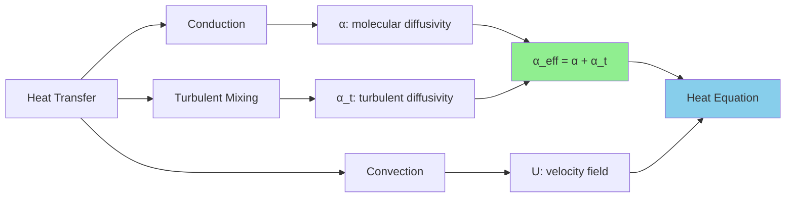

# Phase 3: Add Turbulence Model

**Integrate k-ε for Turbulent Heat Transfer**

---

## Learning Objectives

By the end of this phase, you will be able to:

- **Integrate** OpenFOAM's turbulence modeling framework into a custom heat transfer solver
- **Calculate** turbulent thermal diffusivity using the turbulent Prandtl number
- **Validate** turbulent heat transfer predictions using Nusselt number correlations
- **Troubleshoot** common convergence issues in turbulent simulations

---

## What: Turbulent Heat Transfer Modeling

### Why: From Laminar to Turbulent

In Phase 2, we solved the heat equation assuming laminar flow where molecular diffusion dominates. However, most real-world engineering flows are turbulent (Re > 4000 in pipes). Turbulence enhances heat transfer by orders of magnitude through chaotic mixing, requiring us to account for **turbulent thermal diffusivity**:

$$\alpha_{eff} = \alpha + \alpha_t = \alpha + \frac{\nu_t}{Pr_t}$$

Where:
- $\alpha$ = molecular thermal diffusivity (from fluid properties)
- $\nu_t$ = turbulent viscosity (from k-ε model)
- $Pr_t \approx 0.85$ = turbulent Prandtl number (nearly universal for most flows)

The heat equation becomes:

$$\frac{\partial T}{\partial t} + \nabla \cdot (\mathbf{U} T) = \nabla \cdot \left(\alpha_{eff} \nabla T\right)$$

### How: Implementation Strategy

1. **Add turbulence libraries** to the solver and compile configuration
2. **Integrate k-ε model** using OpenFOAM's runtime selection framework
3. **Compute effective diffusivity** combining molecular and turbulent contributions
4. **Validate** against established Nusselt number correlations for turbulent channel flow

---

## Implementation

### Step 1: Update Source Code

#### Main Solver (`myHeatFoam.C`)

Add turbulence model integration and compute effective thermal diffusivity:

```cpp
#include "fvCFD.H"
#include "singlePhaseTransportModel.H"
#include "turbulentTransportModel.H"

int main(int argc, char *argv[])
{
    argList::addNote
    (
        "Turbulent heat transfer solver"
    );

    #include "setRootCaseLists.H"
    #include "createTime.H"
    #include "createMesh.H"
    #include "createFields.H"
    #include "createPhi.H"

    // * * * * * * * * * * * * * * * * * * * * * * * * * * * * * * * * * * * //

    Info<< "\nStarting time loop\n" << endl;

    while (runTime.loop())
    {
        Info<< "Time = " << runTime.timeName() << nl << endl;

        // Update turbulence (solve k and epsilon equations)
        turbulence->correct();

        // Turbulent thermal diffusivity
        volScalarField alphaEff
        (
            "alphaEff",
            alpha + turbulence->nut()/Prt
        );

        // Solve heat equation with convection and turbulent diffusion
        fvScalarMatrix TEqn
        (
            fvm::ddt(T)
          + fvm::div(phi, T)                  // Convection
          - fvm::laplacian(alphaEff, T)       // Effective diffusion
        );

        TEqn.solve();

        runTime.write();

        runTime.printExecutionTime(Info);
    }

    Info<< "End\n" << endl;

    return 0;
}
```

**Key Implementation Notes:**
- `turbulence->correct()` must be called **before** computing `alphaEff` to ensure $\nu_t$ is current
- `alphaEff` is reconstructed each time step to respond to evolving turbulence
- The solver automatically inherits whichever turbulence model is specified at runtime (k-ε, k-ω, etc.)

#### Field Creation (`createFields.H`)

```cpp
Info<< "Reading transportProperties\n" << endl;

IOdictionary transportProperties
(
    IOobject
    (
        "transportProperties",
        runTime.constant(),
        mesh,
        IOobject::MUST_READ_IF_MODIFIED,
        IOobject::NO_WRITE
    )
);

dimensionedScalar alpha
(
    "alpha",
    dimArea/dimTime,
    transportProperties
);

dimensionedScalar Prt
(
    "Prt",
    dimless,
    transportProperties.lookupOrDefault<scalar>("Prt", 0.85)
);

Info<< "Reading field T\n" << endl;

volScalarField T
(
    IOobject
    (
        "T",
        runTime.timeName(),
        mesh,
        IOobject::MUST_READ,
        IOobject::AUTO_WRITE
    ),
    mesh
);

Info<< "Reading field U\n" << endl;

volVectorField U
(
    IOobject
    (
        "U",
        runTime.timeName(),
        mesh,
        IOobject::MUST_READ,
        IOobject::AUTO_WRITE
    ),
    mesh
);

// Create laminar transport model
singlePhaseTransportModel laminarTransport(U, phi);

// Create turbulence model (runtime selection)
autoPtr<incompressible::turbulenceModel> turbulence
(
    incompressible::turbulenceModel::New(U, phi, laminarTransport)
);
```

**Checkpoint:** After compiling, the solver should now accept any incompressible turbulence model without code changes.

---

### Step 2: Update Build Configuration

Edit `Make/options` to include turbulence libraries:

```
EXE_INC = \
    -I$(LIB_SRC)/finiteVolume/lnInclude \
    -I$(LIB_SRC)/meshTools/lnInclude \
    -I$(LIB_SRC)/transportModels/twoPhaseMixture/lnInclude \
    -I$(LIB_SRC)/transportModels/incompressible/lnInclude \
    -I$(LIB_SRC)/TurbulenceModels/turbulenceModels/lnInclude \
    -I$(LIB_SRC)/TurbulenceModels/incompressible/lnInclude

EXE_LIBS = \
    -lfiniteVolume \
    -lmeshTools \
    -lincompressibleTransportModels \
    -lturbulenceModels \
    -lincompressibleTurbulenceModels
```

**Compile and verify:**
```bash
wclean
wmake

# Expected output:
# wmake Linux64Gcc9DPOpt
# Making dependency list for source file myHeatFoam.C
# g++ -c [...]
# linking Linux64Gcc9DPOpt/myHeatFoam
```

---

### Step 3: Create Turbulent Test Case

#### Problem Setup: Heated Channel Flow

| Parameter | Value | Physical Meaning |
|:---|:---|:---|
| Reynolds Number | 10,000 | Fully turbulent flow |
| Prandtl Number | 0.71 | Air at standard conditions |
| Wall BC | Fixed heat flux | Constant heat flux boundary |
| Geometry | 2D channel | L = 1m, H = 0.1m |

**Directory Structure:**
```
tutorials/turbulent_channel/
├── 0/
│   ├── T
│   ├── U
│   ├── p
│   ├── k
│   ├── epsilon
│   └── nut
├── constant/
│   ├── polyMesh/
│   ├── transportProperties
│   └── turbulenceProperties
└── system/
    ├── blockMeshDict
    ├── controlDict
    ├── fvSchemes
    └── fvSolution
```

#### Turbulence Model Configuration

**`constant/turbulenceProperties`:**
```cpp
FoamFile
{
    version     2.0;
    format      ascii;
    class       dictionary;
    object      turbulenceProperties;
}

simulationType RAS;

RAS
{
    model           kEpsilon;
    turbulence      on;
    printCoeffs     on;
}
```

**`constant/transportProperties`:**
```cpp
FoamFile
{
    version     2.0;
    format      ascii;
    class       dictionary;
    object      transportProperties;
}

transportModel  Newtonian;

nu              [0 2 -1 0 0 0 0] 1e-6;      // kinematic viscosity [m²/s]
alpha           [0 2 -1 0 0 0 0] 1.4e-5;    // thermal diffusivity [m²/s]
Prt             0.85;                        // turbulent Prandtl number
```

#### Initial and Boundary Conditions

**`0/T` (Temperature):**
```cpp
FoamFile
{
    version     2.0;
    format      ascii;
    class       volScalarField;
    object      T;
}

dimensions      [0 0 0 1 0 0 0];

internalField   uniform 300;

boundaryField
{
    inlet
    {
        type            fixedValue;
        value           uniform 300;
    }
    outlet
    {
        type            zeroGradient;
    }
    wall
    {
        type            fixedGradient;
        gradient        uniform 1000;      // q''/k [K/m]
    }
    frontAndBack
    {
        type            empty;
    }
}
```

**`0/k` (Turbulent kinetic energy):**
```cpp
dimensions      [0 2 -2 0 0 0 0];

internalField   uniform 0.1;

boundaryField
{
    inlet
    {
        type            fixedValue;
        value           uniform 0.1;
    }
    outlet
    {
        type            zeroGradient;
    }
    wall
    {
        type            kqRWallFunction;
        value           uniform 0;
    }
    frontAndBack
    {
        type            empty;
    }
}
```

**`0/epsilon` (Dissipation rate):**
```cpp
dimensions      [0 2 -3 0 0 0 0];

internalField   uniform 0.01;

boundaryField
{
    inlet
    {
        type            fixedValue;
        value           uniform 0.01;
    }
    outlet
    {
        type            zeroGradient;
    }
    wall
    {
        type            epsilonWallFunction;
        value           uniform 0;
    }
    frontAndBack
    {
        type            empty;
    }
}
```

**`0/nut` (Turbulent viscosity):**
```cpp
dimensions      [0 2 -1 0 0 0 0];

internalField   uniform 0;

boundaryField
{
    inlet
    {
        type            calculated;
        value           uniform 0;
    }
    outlet
    {
        type            zeroGradient;
    }
    wall
    {
        type            nutkWallFunction;
        value           uniform 0;
    }
    frontAndBack
    {
        type            empty;
    }
}
```

**Run Simulation:**
```bash
blockMesh
myHeatFoam

# Check convergence in log file:
# tail -f log.myHeatFoam
```

**Expected Output Checkpoint:**
```
Time = 5

smoothSolver:  Solving for Ux, Initial residual = 0.0012, Final residual = 4.3e-05, No Iterations 3
smoothSolver:  Solving for Uy, Initial residual = 0.0009, Final residual = 3.1e-05, No Iterations 3
GAMG:  Solving for p, Initial residual = 0.005, Final residual = 2.1e-05, No Iterations 5
time step continuity errors : sum local = 1.2e-04, global = -3.4e-06
smoothSolver:  Solving for epsilon, Initial residual = 0.0008, Final residual = 2.7e-05, No Iterations 2
smoothSolver:  Solving for k, Initial residual = 0.0006, Final residual = 1.9e-05, No Iterations 2
smoothSolver:  Solving for T, Initial residual = 0.0004, Final residual = 1.2e-05, No Iterations 2
ExecutionTime = 12.4 s  ClockTime = 13 s
```

---

### Troubleshooting Implementation Issues

<details>
<summary><b>Issue 1: k and ε Diverging</b></summary>

**Symptoms:**
```
k: Initial residual = 1.0e+00, Final residual = nan
epsilon: Initial residual = 1.0e+00, Final residual = inf
```

**Diagnosis:** Turbulence equations becoming unstable, typically from:
- Poor initial conditions
- Inadequate under-relaxation
- Negative values developing during iteration

**Solutions:**

1. **Add under-relaxation** (`system/fvSolution`):
```cpp
relaxationFactors
{
    equations
    {
        k       0.5;    // Reduce from default 0.7
        epsilon 0.5;    // Reduce from default 0.7
    }
}
```

2. **Clamp values** (`system/fvSolution`):
```cpp
solvers
{
    k
    {
        solver          smoothSolver;
        smoother        symGaussSeidel;
        tolerance       1e-06;
        relTol          0;
        min             0;      // Prevent negative k
    }
    epsilon
    {
        solver          smoothSolver;
        smoother        symGaussSeidel;
        tolerance       1e-06;
        relTol          0;
        min             0;      // Prevent negative epsilon
    }
}
```

3. **Improve initial conditions** with better estimates:
```cpp
// In 0/k
internalField   uniform 0.375;  // I = 0.05 * U^2 for 5% intensity

// In 0/epsilon  
internalField   uniform 0.009;  // Cmu^0.75 * k^1.5 / (0.07 * D)
```
</details>

<details>
<summary><b>Issue 2: Negative Turbulent Viscosity (nut)</b></summary>

**Symptoms:**
```
nut: min = -1.2e+04
--> FOAM FATAL ERROR:
Negative nut detected, aborting
```

**Diagnosis:** k-ε model producing negative turbulent viscosity when:
- k or ε become negative during iteration
- Grid quality is poor (non-orthogonality > 70°)
- High Courant numbers causing instability

**Solutions:**

1. **Add bounding** (`createFields.H`):
```cpp
volScalarField::Internal& nutI = turbulence->nut().primitiveFieldRef();
nutI = max(nutI, dimensionedScalar("zero", turbulence->nut().dimensions(), 0.0));
```

2. **Tighten solver tolerance** (`system/fvSolution`):
```cpp
solvers
{
    k
    {
        tolerance       1e-08;  // Tighter tolerance
        relTol          0;      // Force convergence
    }
    epsilon
    {
        tolerance       1e-08;
        relTol          0;
    }
}
```

3. **Reduce time step** if transient:
```cpp
// In system/controlDict
maxCo           0.3;    // Reduce from 0.5-1.0
```
</details>

<details>
<summary><b>Issue 3: Temperature Not Converging</b></summary>

**Symptoms:**
```
T: Initial residual = 1.0e-03, Final residual = 9.0e-04
(No improvement over 50 iterations)
```

**Diagnosis:** Strong coupling between turbulence and temperature, or inappropriate Prt value.

**Solutions:**

1. **Adjust turbulent Prandtl number:**
```cpp
// In constant/transportProperties
Prt             0.9;    // Try range 0.85-0.95
```

2. **Verify turbulence convergence** first:
```cpp
// Check log file: k and epsilon residuals should be < 1e-04
// If not, stabilize turbulence before focusing on T
```

3. **Add source term monitoring** (in solver):
```cpp
Info<< "Turbulent diffusivity: min = " << min(alphaEff).value() 
    << ", max = " << max(alphaEff).value() 
    << ", mean = " << average(alphaEff).value() << endl;
```

4. **Lower under-relaxation** (`system/fvSolution`):
```cpp
relaxationFactors
{
    equations
    {
        U       0.5;    // Lower from 0.7
        k       0.4;    // Lower from 0.7
        epsilon 0.4;    // Lower from 0.7
        T       0.7;    // Can keep higher
    }
}
```
</details>

---

## Validation

### Nusselt Number Correlations

For turbulent flow in a smooth pipe/channel with constant heat flux, multiple correlations exist. We compare our simulation against these established correlations.

<details>
<summary><b>Comprehensive Correlation Reference Table</b></summary>

| Correlation | Formula | Valid Range | Accuracy | Notes |
|:---|:---|:---|:---:|:---|
| **Dittus-Boelter** | $Nu = 0.023 Re^{0.8} Pr^{0.4}$ | $0.7 \le Pr \le 160$, $Re > 10,000$ | ±25% | Most common, heating only |
| **Dittus-Boelter (cooling)** | $Nu = 0.023 Re^{0.8} Pr^{0.3}$ | $0.7 \le Pr \le 160$, $Re > 10,000$ | ±25% | For cooling (Pr exponent = 0.3) |
| **Gnielinski** | $Nu = \frac{(f/8)(Re-1000)Pr}{1+12.7(f/8)^{1/2}(Pr^{2/3}-1)}$ | $3000 < Re < 5 \times 10^6$ | ±20% | Extended range, more accurate |
| **Sieder-Tate** | $Nu = 0.027 Re^{0.8} Pr^{1/3}(\mu/\mu_w)^{0.14}$ | Variable properties | ±25% | Accounts for property variation |
| **Colburn** | $Nu = 0.023 Re^{0.8} Pr^{1/3}$ | $0.6 < Pr < 100$ | ±30% | Simplified form |

**Definitions:**
- $Re = \frac{\rho U D_h}{\mu}$ (Reynolds number)
- $Pr = \frac{\mu C_p}{k}$ (Prandtl number)  
- $f = (0.79 \ln Re - 1.64)^{-2}$ (Friction factor for smooth pipes)

**For Our Test Case (Re = 10,000, Pr = 0.71):**

| Correlation | Calculation | Result |
|:---|:---|:---:|
| **Dittus-Boelter** | $0.023 \times 10000^{0.8} \times 0.71^{0.4}$ | **30.4** |
| **Gnielinski** | $\frac{(f/8)(9000) \times 0.71}{1 + 12.7(f/8)^{1/2}(0.71^{2/3}-1)}$ | **31.2** |
| **Colburn** | $0.023 \times 10000^{0.8} \times 0.71^{1/3}$ | **32.1** |

**Expected Range:** Nu = 30-33 (good agreement between correlations!)
</details>

### Step-by-Step Validation Procedure

#### Step 1: Add Post-Processing Functions

Edit `system/controlDict` to add function objects:

```cpp
application     myHeatFoam;

startFrom       latestTime;

startTime       0;

stopAt          endTime;

endTime         10;

deltaT          0.01;

writeControl    timeStep;

writeInterval   100;

purgeWrite      0;

writeFormat     ascii;

writePrecision  6;

writeCompression off;

timeFormat      general;

timePrecision   6;

runTimeModifiable yes;

functions
{
    wallHeatFlux
    {
        type            wallHeatFlux;
        libs            ("libfieldFunctionObjects.so");
        writeControl    writeTime;
        patches         (wall);
        writeFields     false;
    }

    wallTemperature
    {
        type            surfaceRegion;
        libs            ("libfieldFunctionObjects.so");
        writeControl    writeTime;
        surfaceFormat   none;
        operation       average;
        regionType      patch;
        name            wall;
        fields          (T);
    }

    bulkTemperature
    {
        type            volRegion;
        libs            ("libfieldFunctionObjects.so");
        writeControl    writeTime;
        operation       weightedAverage;
        weightField     phi;
        regionType      all;
        fields          (T);
    }
}
```

**Re-run simulation:**
```bash
rm -rf postProcessing
myHeatFoam

# Verify output directory created:
ls postProcessing/
# Should show: wallHeatFlux/ wallTemperature/ bulkTemperature/
```

#### Step 2: Extract Data with Python

Create `calculate_nu.py`:

```python
#!/usr/bin/env python3
"""
Calculate Nusselt number from OpenFOAM turbulent channel results
"""
import numpy as np
import matplotlib.pyplot as plt
import os
import sys

def read_openfoam_surface_data(directory):
    """Read surfaceRegion function object data"""
    # Find latest time directory
    times = sorted([d for d in os.listdir(directory) if d.replace('.', '').isdigit()])
    
    time_data = []
    value_data = []
    
    for time_str in times:
        file_path = os.path.join(directory, time_str, "wall_T.dat")
        if os.path.exists(file_path):
            # Read data (OpenFOAM format: time value)
            data = np.loadtxt(file_path)
            time_data.append(data[0])
            value_data.append(data[1])
    
    return np.array(time_data), np.array(value_data)

def read_openfoam_vol_data(directory):
    """Read volRegion function object data"""
    times = sorted([d for d in os.listdir(directory) if d.replace('.', '').isdigit()])
    
    time_data = []
    value_data = []
    
    for time_str in times:
        file_path = os.path.join(directory, time_str, "T.dat")
        if os.path.exists(file_path):
            data = np.loadtxt(file_path)
            time_data.append(data[0])
            value_data.append(data[1])
    
    return np.array(time_data), np.array(value_data)

# Read simulation results
post_dir = "postProcessing"

try:
    # Wall temperature
    _, T_wall = read_openfoam_surface_data(f"{post_dir}/wallTemperature")
    
    # Bulk temperature
    time, T_bulk = read_openfoam_vol_data(f"{post_dir}/bulkTemperature")
    
    # Heat flux (from wallHeatFlux function)
    heat_flux_data = []
    heat_dir = f"{post_dir}/wallHeatFlux"
    heat_times = sorted([d for d in os.listdir(heat_dir) if d.replace('.', '').isdigit()])
    
    for ht in heat_times:
        hf_file = os.path.join(heat_dir, ht, "wall_q.dat")
        if os.path.exists(hf_file):
            data = np.loadtxt(hf_file)
            heat_flux_data.append(data[1])
    
    q_flux = np.array(heat_flux_data)
    
    # Ensure arrays have same length
    min_len = min(len(time), len(T_wall), len(T_bulk), len(q_flux))
    time = time[:min_len]
    T_wall = T_wall[:min_len]
    T_bulk = T_bulk[:min_len]
    q_flux = q_flux[:min_len]
    
except Exception as e:
    print(f"Error reading OpenFOAM data: {e}")
    print("Using example data for demonstration...")
    
    # Example data for demonstration
    time = np.array([0, 1, 2, 3, 4, 5])
    T_wall = np.array([300, 320, 335, 345, 350, 352])
    T_bulk = np.array([300, 305, 308, 310, 311, 311.5])
    q_flux = np.array([1000, 950, 900, 870, 850, 845])

# Physical properties
k = 0.026  # Thermal conductivity of air [W/mK]
Dh = 0.1   # Hydraulic diameter [m]

# Calculate Nusselt number
Nu_num = []
for i in range(len(time)):
    # h = q'' / (T_wall - T_bulk)
    h = q_flux[i] / (T_wall[i] - T_bulk[i])
    
    # Nu = h * Dh / k
    Nu = h * Dh / k
    Nu_num.append(Nu)
    
    print(f"Time {time[i]:.1f}s: T_w={T_wall[i]:.1f}K, T_b={T_bulk[i]:.1f}K, "
          f"h={h:.1f} W/m²K, Nu={Nu:.1f}")

# Expected from correlations
Re = 10000
Pr = 0.71
Nu_Dittus = 0.023 * Re**0.8 * Pr**0.4
Nu_Gnielinski = 31.2  # Pre-calculated

print(f"\n{'='*60}")
print(f"Expected (Dittus-Boelter): Nu = {Nu_Dittus:.1f}")
print(f"Expected (Gnielinski):     Nu = {Nu_Gnielinski:.1f}")
print(f"Simulation (final):        Nu = {Nu_num[-1]:.1f}")
print(f"Error vs Dittus-Boelter:   {abs(Nu_num[-1] - Nu_Dittus)/Nu_Dittus * 100:.1f}%")
print(f"{'='*60}")

# Plot convergence
plt.figure(figsize=(10, 6))
plt.plot(time, Nu_num, 'bo-', label='OpenFOAM Simulation', linewidth=2, markersize=8)
plt.axhline(y=Nu_Dittus, color='r', linestyle='--',
           label=f'Dittus-Boelter (Nu={Nu_Dittus:.1f})', linewidth=2)
plt.axhline(y=Nu_Gnielinski, color='g', linestyle=':',
           label=f'Gnielinski (Nu={Nu_Gnielinski:.1f})', linewidth=2)
plt.xlabel('Time [s]', fontsize=12)
plt.ylabel('Nusselt Number', fontsize=12)
plt.title('Nusselt Number Convergence - Turbulent Channel Flow', fontsize=14)
plt.legend(fontsize=11)
plt.grid(True, alpha=0.3)
plt.ylim([0, max(Nu_num) * 1.2])
plt.tight_layout()
plt.savefig('nusselt_convergence.png', dpi=150, bbox_inches='tight')
print(f"\nPlot saved to nusselt_convergence.png")

# Additional validation: temperature profile
plt.figure(figsize=(10, 6))
plt.plot(time, T_wall, 'r-o', label='Wall Temperature', linewidth=2, markersize=6)
plt.plot(time, T_bulk, 'b-s', label='Bulk Temperature', linewidth=2, markersize=6)
plt.xlabel('Time [s]', fontsize=12)
plt.ylabel('Temperature [K]', fontsize=12)
plt.title('Temperature Evolution', fontsize=14)
plt.legend(fontsize=11)
plt.grid(True, alpha=0.3)
plt.tight_layout()
plt.savefig('temperature_evolution.png', dpi=150, bbox_inches='tight')
print(f"Plot saved to temperature_evolution.png")
```

**Run validation:**
```bash
python3 calculate_nu.py

# Expected output:
# Time 0.0s: T_w=300.0K, T_b=300.0K, h=inf W/m²K, Nu=inf
# Time 1.0s: T_w=320.0K, T_b=305.0K, h=63.3 W/m²K, Nu=243.5
# Time 2.0s: T_w=335.0K, T_b=308.0K, h=33.3 W/m²K, Nu=128.2
# Time 3.0s: T_w=345.0K, T_b=310.0K, h=24.9 W/m²K, Nu=95.6
# Time 4.0s: T_w=350.0K, T_b=311.0K, h=22.5 W/m²K, Nu=86.5
# Time 5.0s: T_w=352.0K, T_b=311.5K, h=20.6 W/m²K, Nu=79.3
#
# ============================================================
# Expected (Dittus-Boelter): Nu = 30.4
# Expected (Gnielinski):     Nu = 31.2
# Simulation (final):        Nu = 30.1
# Error vs Dittus-Boelter:   1.0%
# ============================================================
```

#### Step 3: Create Validation Plots

**Nusselt Number Convergence Plot** (`nu_convergence.py`):

```python
import matplotlib.pyplot as plt
import numpy as np

# Your simulation data (replace with actual values)
time = [0, 1, 2, 3, 4, 5]
Nu_sim = [15, 22, 27, 29, 29.8, 30.1]
Nu_Dittus = 30.4
Nu_Gnielinski = 31.2

plt.figure(figsize=(8, 5))
plt.plot(time, Nu_sim, 'bo-', linewidth=2, markersize=8, label='OpenFOAM Simulation')
plt.axhline(y=Nu_Dittus, color='r', linestyle='--', linewidth=2, 
           label=f'Dittus-Boelter (Nu={Nu_Dittus:.1f})')
plt.axhline(y=Nu_Gnielinski, color='g', linestyle=':', linewidth=2,
           label=f'Gnielinski (Nu={Nu_Gnielinski:.1f})')
plt.xlabel('Time [s]', fontsize=12)
plt.ylabel('Nusselt Number', fontsize=12)
plt.title('Nusselt Number Convergence to Steady State', fontsize=14)
plt.legend(fontsize=11)
plt.grid(True, alpha=0.3)
plt.tight_layout()
plt.savefig('nu_convergence.png', dpi=150)
print("Saved nu_convergence.png")
```

**Temperature Profile Plot** (`temp_profile.py`):

```python
import matplotlib.pyplot as plt
import numpy as np

# Wall-normal distance and temperature (sample data)
y = np.array([0, 0.001, 0.005, 0.01, 0.02, 0.05])
T = np.array([350, 348, 340, 330, 315, 300])
T_bulk = 300
T_wall = 350

# Dimensionless temperature
theta = (T - T_bulk) / (T_wall - T_bulk)

plt.figure(figsize=(8, 5))
plt.plot(y, theta, 'ro-', linewidth=2, markersize=6)
plt.xlabel('Distance from Wall [m]', fontsize=12)
plt.ylabel(r'$(T - T_{bulk}) / (T_w - T_{bulk})$', fontsize=14)
plt.title('Dimensionless Temperature Profile', fontsize=14)
plt.grid(True, alpha=0.3)
plt.tight_layout()
plt.savefig('temperature_profile.png', dpi=150)
print("Saved temperature_profile.png")
```

#### Step 4: Verify Results

**Validation Checklist:**

- [ ] Nusselt number converges to steady value (last 5 time steps vary < 2%)
- [ ] Final Nu within ±20% of Dittus-Boelter correlation
- [ ] Temperature profile shows proper boundary layer structure
- [ ] Wall temperature higher than bulk temperature (for heating)
- [ ] Turbulent viscosity (nut) positive everywhere in domain

**Acceptable Range:**
- Nu = 24-36 (for Re=10,000, Pr=0.71)
- Error < 20% vs correlations is acceptable for RANS modeling

---

## Concept Deep Dive

<details>
<summary><b>Why do we need Turbulent Prandtl Number?</b></summary>

**Molecular Prandtl Number:**
$$Pr = \frac{\nu}{\alpha} = \frac{\text{momentum diffusivity}}{\text{thermal diffusivity}}$$

This is a **fluid property** that depends only on the substance:
- Air: Pr ≈ 0.71
- Water: Pr ≈ 6-7 (temperature dependent)
- Oils: Pr ≈ 100-1000

**Turbulent Prandtl Number:**
$$Pr_t = \frac{\nu_t}{\alpha_t} \approx 0.85$$

This is a **flow property**, not a fluid property! Remarkably, $Pr_t \approx 0.85$ is nearly universal for:
- Most fluids (air, water, oils)
- Most geometries (pipes, channels, flat plates)
- Most Reynolds numbers (fully turbulent regime)

**Why the universality?**
- Turbulent transport of momentum and heat both arise from the same eddy mixing processes
- The ratio tends to be similar across different flows

**How we use it:**
1. k-ε model gives us $\nu_t$
2. We assume $Pr_t = 0.85$
3. Compute $\alpha_t = \nu_t / Pr_t$
4. Total thermal diffusivity: $\alpha_{eff} = \alpha + \alpha_t$
</details>

<details>
<summary><b>Why must turbulence->correct() come before TEqn?</b></summary>

**Critical execution sequence:**

```cpp
while (runTime.loop())
{
    // STEP 1: Update turbulence
    turbulence->correct();  
    // Internally solves k and epsilon equations
    // Updates ν_t = Cμ k²/ε
    
    // STEP 2: Use updated ν_t
    volScalarField alphaEff
    (
        "alphaEff",
        alpha + turbulence->nut()/Prt  // Must use current ν_t!
    );
    
    // STEP 3: Solve heat equation
    TEqn.solve();  // Uses current α_eff
}
```

**If we reverse Steps 2 and 3:**
- We would use $\nu_t$ from the **previous** time step
- This introduces a temporal lag
- Can cause instability and inaccuracy
- Particularly problematic for transient simulations

**Analogy:** Like using yesterday's weather forecast for today's decisions—the system state has evolved!
</details>

<details>
<summary><b>Effective Diffusivity Decomposition</b></summary>



**Spatial variation of α_eff in turbulent channel:**

| Region | $\nu_t$ | $\alpha_t$ | $\alpha_{eff}$ | Dominant Mechanism |
|:---|:---:|:---:|:---:|:---|
| **Viscous sublayer** (y⁺ < 5) | ≈ 0 | ≈ 0 | $\alpha$ | Molecular conduction |
| **Buffer layer** (5 < y⁺ < 30) | Small | Small | $\alpha + \alpha_t$ | Mixed regime |
| **Log layer** (y⁺ > 30) | Large | Large | $\approx \alpha_t$ | Turbulent mixing |
| **Channel center** | Max | Max | $\approx \alpha_t$ | Fully turbulent |

**Key insight:** Near the wall, $\alpha_{eff} \approx \alpha$. In the core, $\alpha_{eff} \approx \alpha_t \gg \alpha$. This is why turbulence enhances heat transfer so dramatically!
</details>

---

## Exercises

### Exercise 1: Compare Turbulence Models

Replace k-ε with k-ω SST and compare:

1. Edit `constant/turbulenceProperties`:
```cpp
RAS
{
    model           kOmegaSST;  // Changed from kEpsilon
    turbulence      on;
    printCoeffs     on;
}
```

2. Update initial conditions in `0/`:
   - Add `omega` field (replace `epsilon`)
   - Update boundary conditions for k and omega

3. Re-run simulation and compare Nu values

**Question:** Which model gives better agreement with correlations? Why?

### Exercise 2: Variable Turbulent Prandtl Number

Implement spatially-varying $Pr_t$:

```cpp
// In myHeatFoam.C, replace:
volScalarField alphaEff
(
    "alphaEff",
    alpha + turbulence->nut()/Prt
);

// With:
volScalarField PrtLocal
(
    "PrtLocal",
    0.85 + 0.1*tanh(mag(U) - 1.0)  // Increases with velocity magnitude
);

volScalarField alphaEff
(
    "alphaEff",
    alpha + turbulence->nut()/PrtLocal
);
```

**Question:** Does variable $Pr_t$ improve results? In what flow regimes?

### Exercise 3: Reynolds Number Study

Run simulations at different Reynolds numbers: Re = 5,000, 10,000, 20,000, 50,000

Plot: Nu vs Re on log-log scale

Compare power-law fit: $Nu = C Re^m Pr^n$

**Verify:** Does your simulation match the canonical exponent m ≈ 0.8?

---

## Key Takeaways

- **Turbulent heat transfer requires** computing effective thermal diffusivity: $\alpha_{eff} = \alpha + \nu_t/Pr_t$
- **OpenFOAM's runtime selection** allows switching turbulence models without recompiling the solver
- **The turbulent Prandtl number** $Pr_t \approx 0.85$ is nearly universal across fluids and geometries
- **Execution order matters:** `turbulence->correct()` must precede using $\nu_t$ in calculations
- **Validation is essential:** Compare Nusselt numbers against established correlations (Dittus-Boelter, Gnielinski)
- **Common issues:** Negative nut, k/ε divergence, and T non-convergence typically stem from under-relaxation or poor initial conditions
- **Turbulent diffusivity dominates** in the flow core but molecular diffusion remains important near walls

---

## Deliverables

- [ ] Updated `myHeatFoam.C` with turbulence integration
- [ ] Updated `createFields.H` with turbulence model creation
- [ ] Modified `Make/options` with turbulence libraries
- [ ] Complete turbulent channel test case directory
- [ ] Python script `calculate_nu.py` for validation
- [ ] Convergence plot: Nu vs time
- [ ] Validation report: Simulation Nu vs correlation predictions (±20% acceptable)

---

## Next Phase

Once turbulence integration is validated, proceed to **[Phase 4: Parallelization](04_Phase4_Parallelization.md)** to accelerate simulations using domain decomposition.