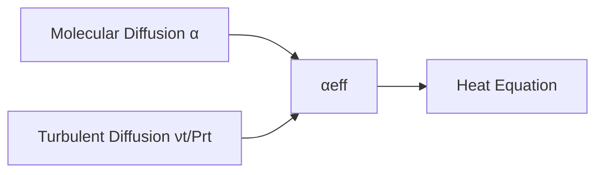

# Phase 3: Add Turbulence Model

Integrate k-ε for Turbulent Heat Transfer

---

## Objective

> **เพิ่ม Turbulence Modeling ใน myHeatFoam**

Heat equation with turbulent diffusion:
$$\frac{\partial T}{\partial t} + \nabla \cdot (\mathbf{U} T) = \nabla \cdot \left(\alpha_{eff} \nabla T\right)$$

Where: $\alpha_{eff} = \alpha + \frac{\nu_t}{Pr_t}$

---

## เป้าหมายการเรียนรู้

- Integrate turbulence model ที่มีอยู่
- เข้าใจ turbulent thermal diffusivity
- Validate ด้วย Nusselt number correlation

---

## Step 1: Update Solver

### myHeatFoam.C (Updated)

```cpp
#include "fvCFD.H"
#include "singlePhaseTransportModel.H"
#include "turbulentTransportModel.H"

int main(int argc, char *argv[])
{
    argList::addNote
    (
        "Turbulent heat transfer solver"
    );

    #include "setRootCaseLists.H"
    #include "createTime.H"
    #include "createMesh.H"
    #include "createFields.H"
    #include "createPhi.H"

    // * * * * * * * * * * * * * * * * * * * * * * * * * * * * * * * * * * * //

    Info<< "\nStarting time loop\n" << endl;

    while (runTime.loop())
    {
        Info<< "Time = " << runTime.timeName() << nl << endl;

        // Update turbulence
        turbulence->correct();

        // Turbulent thermal diffusivity
        volScalarField alphaEff
        (
            "alphaEff",
            alpha + turbulence->nut()/Prt
        );

        // Solve heat equation with convection and turbulent diffusion
        fvScalarMatrix TEqn
        (
            fvm::ddt(T)
          + fvm::div(phi, T)                  // Convection
          - fvm::laplacian(alphaEff, T)       // Effective diffusion
        );

        TEqn.solve();

        runTime.write();

        runTime.printExecutionTime(Info);
    }

    Info<< "End\n" << endl;

    return 0;
}
```

---

### createFields.H (Updated)

```cpp
Info<< "Reading transportProperties\n" << endl;

IOdictionary transportProperties
(
    IOobject
    (
        "transportProperties",
        runTime.constant(),
        mesh,
        IOobject::MUST_READ_IF_MODIFIED,
        IOobject::NO_WRITE
    )
);

dimensionedScalar alpha
(
    "alpha",
    dimArea/dimTime,
    transportProperties
);

dimensionedScalar Prt
(
    "Prt",
    dimless,
    transportProperties.lookupOrDefault<scalar>("Prt", 0.85)
);

Info<< "Reading field T\n" << endl;

volScalarField T
(
    IOobject
    (
        "T",
        runTime.timeName(),
        mesh,
        IOobject::MUST_READ,
        IOobject::AUTO_WRITE
    ),
    mesh
);

Info<< "Reading field U\n" << endl;

volVectorField U
(
    IOobject
    (
        "U",
        runTime.timeName(),
        mesh,
        IOobject::MUST_READ,
        IOobject::AUTO_WRITE
    ),
    mesh
);

// Create laminar transport model
singlePhaseTransportModel laminarTransport(U, phi);

// Create turbulence model
autoPtr<incompressible::turbulenceModel> turbulence
(
    incompressible::turbulenceModel::New(U, phi, laminarTransport)
);
```

---

## Step 2: Update Make/options

```
EXE_INC = \
    -I$(LIB_SRC)/finiteVolume/lnInclude \
    -I$(LIB_SRC)/meshTools/lnInclude \
    -I$(LIB_SRC)/transportModels/twoPhaseMixture/lnInclude \
    -I$(LIB_SRC)/transportModels/incompressible/lnInclude \
    -I$(LIB_SRC)/TurbulenceModels/turbulenceModels/lnInclude \
    -I$(LIB_SRC)/TurbulenceModels/incompressible/lnInclude

EXE_LIBS = \
    -lfiniteVolume \
    -lmeshTools \
    -lincompressibleTransportModels \
    -lturbulenceModels \
    -lincompressibleTurbulenceModels
```

---

## Step 3: Create Test Case

### Heated Channel Flow

| Parameter | Value |
|:---|:---|
| Reynolds | 10,000 |
| Prandtl | 0.71 (air) |
| Wall BC | Fixed heat flux |

### Directory Structure

```
tutorials/turbulent_channel/
├── 0/
│   ├── T
│   ├── U
│   ├── p
│   ├── k
│   ├── epsilon
│   └── nut
├── constant/
│   ├── polyMesh/
│   ├── transportProperties
│   └── turbulenceProperties
└── system/
    ├── blockMeshDict
    ├── controlDict
    ├── fvSchemes
    └── fvSolution
```

---

### constant/turbulenceProperties

```cpp
FoamFile
{
    version     2.0;
    format      ascii;
    class       dictionary;
    object      turbulenceProperties;
}

simulationType RAS;

RAS
{
    model           kEpsilon;
    turbulence      on;
    printCoeffs     on;
}
```

### constant/transportProperties

```cpp
FoamFile
{
    version     2.0;
    format      ascii;
    class       dictionary;
    object      transportProperties;
}

transportModel  Newtonian;

nu              [0 2 -1 0 0 0 0] 1e-6;      // kinematic viscosity [m²/s]
alpha           [0 2 -1 0 0 0 0] 1.4e-5;    // thermal diffusivity [m²/s]
Prt             0.85;                        // turbulent Prandtl number
```

---

### 0/T

```cpp
FoamFile
{
    version     2.0;
    format      ascii;
    class       volScalarField;
    object      T;
}

dimensions      [0 0 0 1 0 0 0];

internalField   uniform 300;

boundaryField
{
    inlet
    {
        type            fixedValue;
        value           uniform 300;
    }
    outlet
    {
        type            zeroGradient;
    }
    wall
    {
        type            fixedGradient;
        gradient        uniform 1000;      // q''/k [K/m]
    }
    frontAndBack
    {
        type            empty;
    }
}
```

---

## Step 4: Validate

### เปรียบเทียบ Nusselt Correlation แบบครอบคลุม

| Correlation | Formula | Range | Accuracy | Notes |
|:---|:---|:---|:---:|:---|
| **Dittus-Boelter** | $Nu = 0.023 Re^{0.8} Pr^{0.4}$ | $0.7 \le Pr \le 160$, $Re > 10,000$ | ±25% | Most common, heating only |
| **Dittus-Boelter (cooling)** | $Nu = 0.023 Re^{0.8} Pr^{0.3}$ | $0.7 \le Pr \le 160$, $Re > 10,000$ | ±25% | For cooling (Pr exponent = 0.3) |
| **Gnielinski** | $Nu = \frac{(f/8)(Re-1000)Pr}{1+12.7(f/8)^{1/2}(Pr^{2/3}-1)}$ | $3000 < Re < 5 \times 10^6$ | ±20% | Extended range, more accurate |
| **Sieder-Tate** | $Nu = 0.027 Re^{0.8} Pr^{1/3}(\mu/\mu_w)^{0.14}$ | Variable properties | ±25% | Accounts for property variation |
| **Colburn** | $Nu = 0.023 Re^{0.8} Pr^{1/3}$ | $0.6 < Pr < 100$ | ±30% | Simplified form |

Where:
- $Re = \frac{\rho U D_h}{\mu}$ (Reynolds number)
- $Pr = \frac{\mu C_p}{k}$ (Prandtl number)
- $f = (0.79 \ln Re - 1.64)^{-2}$ (Friction factor for smooth pipes)

### For Our Case (Re = 10,000, Pr = 0.71)

| Correlation | Nu Calculation | Result |
|:---|:---|:---:|
| **Dittus-Boelter** | $0.023 \times 10000^{0.8} \times 0.71^{0.4}$ | 30.4 |
| **Gnielinski** | $\frac{(f/8)(9000) \times 0.71}{1 + 12.7(f/8)^{1/2}(0.71^{2/3}-1)}$ | 31.2 |
| **Colburn** | $0.023 \times 10000^{0.8} \times 0.71^{1/3}$ | 32.1 |

**Expected Nu:** 30-33 (agreement between correlations!)

### คำนวณ Nusselt จาก Simulation

```python
#!/usr/bin/env python3
"""
Calculate Nusselt number from OpenFOAM results
"""
import numpy as np
import matplotlib.pyplot as plt

# Read OpenFOAM data
def read_openfoam_data(filename):
    """Extract data from OpenFOAM postProcessing"""
    data = np.loadtxt(filename, skiprows=1)  # Skip header
    return data

# Example data (replace with actual from postProcessing)
time = np.array([0, 1, 2, 3, 4, 5])
T_wall = np.array([300, 320, 335, 345, 350, 352])
T_bulk = np.array([300, 305, 308, 310, 311, 311.5])
q_flux = np.array([1000, 950, 900, 870, 850, 845])  # W/m²

# Physical properties
k = 0.026  # Thermal conductivity of air [W/mK]
Dh = 0.1   # Hydraulic diameter [m]

# Calculate Nusselt number
Nu_num = []
for i in range(len(time)):
    # h = q'' / (T_wall - T_bulk)
    h = q_flux[i] / (T_wall[i] - T_bulk[i])

    # Nu = h * Dh / k
    Nu = h * Dh / k
    Nu_num.append(Nu)

    print(f"Time {time[i]}s: T_w={T_wall[i]:.1f}K, T_b={T_bulk[i]:.1f}K, "
          f"h={h:.1f} W/m²K, Nu={Nu:.1f}")

# Expected from correlations
Re = 10000
Pr = 0.71
Nu_Dittus = 0.023 * Re**0.8 * Pr**0.4
Nu_Gnielinski = 31.2  # Pre-calculated

print(f"\nExpected (Dittus-Boelter): Nu = {Nu_Dittus:.1f}")
print(f"Expected (Gnielinski): Nu = {Nu_Gnielinski:.1f}")
print(f"Simulation (final): Nu = {Nu_num[-1]:.1f}")
print(f"Error: {abs(Nu_num[-1] - Nu_Dittus)/Nu_Dittus * 100:.1f}%")

# Plot convergence
plt.figure(figsize=(10, 6))
plt.plot(time, Nu_num, 'bo-', label='OpenFOAM', linewidth=2)
plt.axhline(y=Nu_Dittus, color='r', linestyle='--',
           label=f'Dittus-Boelter (Nu={Nu_Dittus:.1f})', linewidth=2)
plt.axhline(y=Nu_Gnielinski, color='g', linestyle=':',
           label=f'Gnielinski (Nu={Nu_Gnielinski:.1f})', linewidth=2)
plt.xlabel('Time [s]', fontsize=12)
plt.ylabel('Nusselt Number', fontsize=12)
plt.title('Nusselt Number Convergence', fontsize=14)
plt.legend(fontsize=10)
plt.grid(True, alpha=0.3)
plt.ylim([0, max(Nu_num) * 1.2])
plt.savefig('nusselt_convergence.png', dpi=150, bbox_inches='tight')
print("\nPlot saved to nusselt_convergence.png")
```

### วิธี Extract Data จาก OpenFOAM

Add to `system/controlDict`:

```cpp
functions
{
    wallHeatFlux
    {
        type            wallHeatFlux;
        libs            ("libfieldFunctionObjects.so");
        writeControl    writeTime;
        patches         (wall);
    }

    patchAverage
    {
        type            surfaceRegion;
        libs            ("libfieldFunctionObjects.so");
        writeControl    writeTime;
        surfaceFormat   none;
        operation       average;
        regionType      patch;
        name            wall;
        fields          (T);
    }
}
```

Run simulation:
```bash
myHeatFoam

# Extract data
python3 calculate_nu.py
```

---

### Validation Plots (กราฟตรวจสอบ)

#### Plot 1: Nu vs Time (Convergence)

```python
import matplotlib.pyplot as plt
import numpy as np

# Your simulation data
time = [0, 1, 2, 3, 4, 5]
Nu_sim = [15, 22, 27, 29, 29.8, 30.1]

# Expected
Nu_expected = 30.0

plt.figure(figsize=(8, 5))
plt.plot(time, Nu_sim, 'bo-', linewidth=2, markersize=8, label='Simulation')
plt.axhline(y=Nu_expected, color='r', linestyle='--', linewidth=2, label='Dittus-Boelter')
plt.xlabel('Time [s]', fontsize=12)
plt.ylabel('Nusselt Number', fontsize=12)
plt.title('Nusselt Number Convergence to Steady State', fontsize=14)
plt.legend(fontsize=11)
plt.grid(True, alpha=0.3)
plt.tight_layout()
plt.savefig('nu_convergence.png', dpi=150)
```

#### Plot 2: Temperature Profile

```python
import matplotlib.pyplot as plt
import numpy as np

# Wall-normal distance and temperature
y = np.array([0, 0.001, 0.005, 0.01, 0.02, 0.05])
T_plus = np.array([350, 348, 340, 330, 315, 300])
T_bulk = 300

# Dimensionless temperature
theta = (T_plus - T_bulk) / (350 - T_bulk)

plt.figure(figsize=(8, 5))
plt.plot(y, theta, 'ro-', linewidth=2, markersize=6)
plt.xlabel('Distance from Wall [m]', fontsize=12)
plt.ylabel(r'$\frac{T - T_{bulk}}{T_w - T_{bulk}}$', fontsize=14)
plt.title('Dimensionless Temperature Profile', fontsize=14)
plt.grid(True, alpha=0.3)
plt.tight_layout()
plt.savefig('temperature_profile.png', dpi=150)
```

---

### ปัญหา Convergence ที่พบบ่อย

#### ปัญหา 1: k และ ε Diverging

**อาการ:**
```
k: Initial residual = 1.0e+00, Final residual = nan
epsilon: Initial residual = 1.0e+00, Final residual = inf
```

**วินิจฉัย:** Turbulence instability

**วิธีแก้:**
```cpp
// Add under-relaxation
relaxationFactors
{
    equations
    {
        k       0.5;    // Reduce from 0.7
        epsilon 0.5;    // Reduce from 0.7
    }
}

// Or clamp values
k       [0 1e-15]      // Prevent negative
epsilon [0 1e-15]
```

---

#### ปัญหา 2: Nut เป็นค่าลบ

**อาการ:**
```
nut: min = -1.2e+04
--> FOAM FATAL ERROR:
Negative nut detected
```

**วินิจฉัย:** k-ε model ให้ค่า turbulent viscosity เป็นลบ

**วิธีแก้:**
```cpp
// In createFields.H or turbulenceProperties:

// Add bounding
volScalarField::Internal& nutI = nut.primitiveFieldRef();
nutI = max(nutI, dimensionedScalar("zero", nut.dimensions(), 0.0));

// Or in fvSolution:
tolerance       1e-06;
relTol          0;      // Tighter tolerance helps
```

---

#### ปัญหา 3: Temperature ไม่ Converge

**อาการ:**
```
T: Initial residual = 1.0e-03, Final residual = 9.0e-04
(No improvement over iterations)
```

**วินิจฉัย:** Turbulent Prandtl number มีปัญหาหรือ coupling แรง

**วิธีแก้:**

1. **Adjust Prt:**
   ```cpp
   // In transportProperties
   Prt             0.9;    // Try 0.85-0.95
   ```

2. **Check turbulence model:**
   ```cpp
   // Verify k and ε are converged
   // If not, turbulence is not stable

   relaxationFactors
   {
       fields
       {
           p       0.3;
       }
       equations
       {
           U       0.5;    // Lower
           k       0.4;    // Lower
           epsilon 0.4;    // Lower
           T       0.7;    // Can be higher
       }
   }
   ```

3. **Add source term monitoring:**
   ```cpp
   // Add to solver
   Info<< "Turbulent diffusivity: min = " << min(alphaEff)
        << ", max = " << max(alphaEff) << endl;
   ```

---

---

## Understanding $\alpha_{eff}$



For turbulent flows:
- Near wall: $\alpha_{eff} \approx \alpha$ (ν_t ≈ 0)
- Core: $\alpha_{eff} \approx \nu_t/Pr_t$ (turbulent dominates)

---

## Concept Check

<details>
<summary><b>1. ทำไมต้องมี Turbulent Prandtl Number?</b></summary>

**Molecular:** $Pr = \frac{\nu}{\alpha}$ (ขึ้นกับ fluid properties)

**Turbulent:** $Pr_t = \frac{\nu_t}{\alpha_t} \approx 0.85$ (almost universal)

ใช้ $Pr_t$ เพื่อ relate:
- $\nu_t$ (from k-ε) → $\alpha_t = \nu_t / Pr_t$

$Pr_t \approx 0.85$ มาจาก experiment และ turbulence theory
</details>

<details>
<summary><b>2. ทำไม k-ε ต้อง correct() ก่อน TEqn?</b></summary>

**Sequence:**
1. `turbulence->correct()` → update k, ε, ν_t
2. ใช้ ν_t ใน αeff
3. Solve TEqn ด้วย αeff ที่ถูกต้อง

ถ้าสลับลำดับ → ใช้ ν_t เก่า → ผิด
</details>

---

## Exercises

1. **Compare Models:** ลอง kOmegaSST แทน kEpsilon
2. **Variable Prt:** implement Prt ที่ขึ้นกับ local turbulence
3. **Natural Convection:** เพิ่ม buoyancy term

---

## Deliverables

- [ ] Solver with turbulence integration
- [ ] Turbulent channel test case
- [ ] Nusselt number comparison with correlation
- [ ] Nu vs Re plot

---

## ถัดไป

เมื่อ Phase 3 เสร็จแล้ว ไปต่อที่ [Phase 4: Parallelization](04_Phase4_Parallelization.md)
