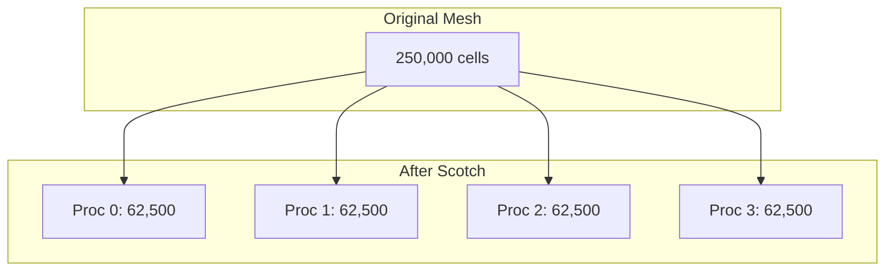

# Phase 4: Parallelization

Run Solver on Multiple CPUs

---

## Objective

> **รัน myHeatFoam แบบ parallel** และวิเคราะห์ scaling

---

## เป้าหมายการเรียนรู้

- ใช้ domain decomposition
- รัน MPI parallel
- วิเคราะห์ parallel efficiency

---

## Step 1: Create decomposeParDict

### system/decomposeParDict

```cpp
FoamFile
{
    version     2.0;
    format      ascii;
    class       dictionary;
    object      decomposeParDict;
}

numberOfSubdomains 4;

method          scotch;     // Automatic load balancing

// Alternative: simple geometric split
// method          simple;
// simpleCoeffs
// {
//     n               (2 2 1);
//     delta           0.001;
// }
```

---

## Step 2: Decompose Mesh

```bash
cd tutorials/turbulent_channel

# Decompose
decomposePar

# Output:
# Processor 0: 62500 cells
# Processor 1: 62500 cells  
# Processor 2: 62500 cells
# Processor 3: 62500 cells
```

Check load balance:
```bash
# Should be roughly equal
grep "cells" log.decomposePar
```

---

## Step 3: Run Parallel

```bash
# Run with 4 processors
mpirun -np 4 myHeatFoam -parallel > log.parallel 2>&1

# Monitor progress
tail -f log.parallel
```

---

## Step 4: Reconstruct Results

```bash
# Combine processor directories
reconstructPar

# View results
paraFoam
```

---

## Step 5: Scaling Study

### Run with Different CPU Counts

```bash
#!/bin/bash
# scaling_test.sh

CASE="turbulent_channel"

for NP in 1 2 4 8; do
    echo "Running with $NP processors..."
    
    # Clean
    rm -rf processor*
    
    # Update decomposition
    sed -i "s/numberOfSubdomains.*/numberOfSubdomains $NP;/" system/decomposeParDict
    
    # Decompose
    decomposePar > log.decompose.$NP 2>&1
    
    # Run
    mpirun -np $NP myHeatFoam -parallel > log.run.$NP 2>&1
    
    # Extract time
    TIME=$(grep "ClockTime" log.run.$NP | tail -1 | awk '{print $3}')
    echo "$NP processors: $TIME seconds"
done
```

---

### วิเคราะห์ผลลัพธ์

```python
import matplotlib.pyplot as plt
import numpy as np

# Data from scaling test
np = [1, 2, 4, 8]
time = [100, 52, 28, 18]  # seconds (example)

# Calculate metrics
speedup = time[0] / np.array(time)
efficiency = speedup / np * 100

# Print table
print("NP\tTime\tSpeedup\tEfficiency")
for i in range(len(np)):
    print(f"{np[i]}\t{time[i]}\t{speedup[i]:.2f}\t{efficiency[i]:.1f}%")

# Plot
fig, axes = plt.subplots(1, 2, figsize=(12, 5))

# Speedup plot
axes[0].plot(np, speedup, 'bo-', label='Actual')
axes[0].plot(np, np, 'k--', label='Ideal')
axes[0].set_xlabel('Number of Processors')
axes[0].set_ylabel('Speedup')
axes[0].legend()
axes[0].set_title('Strong Scaling')

# Efficiency plot
axes[1].bar(np, efficiency)
axes[1].set_xlabel('Number of Processors')
axes[1].set_ylabel('Efficiency (%)')
axes[1].set_title('Parallel Efficiency')
axes[1].set_ylim([0, 100])

plt.savefig('scaling_analysis.png')
```

---

## Understanding Decomposition

### Scotch (Recommended)



Scotch minimizes interface between processors.

---

## Processor Boundaries

```bash
# Check interface size
grep "faces.*processor" log.decomposePar

# Example output:
# Processor 0 boundary 1: faces 1250 (to processor 1)
# Processor 0 boundary 2: faces 800 (to processor 2)
```

**Fewer faces = less communication = faster!**

---

## Debug ปัญหา Parallel

### Common MPI Errors

#### Error: "MPI_Init failed"

**อาการ:**
```bash
mpirun -np 4 myHeatFoam -parallel
--------------------------------------------------------------------------
MPI_ABORT was invoked on rank 3 in communicator MPI_COMM_WORLD
with errorcode -1.
```

**วินิจฉัย:** MPI ไม่ได้ configure อย่างถูกต้องหรือ libraries ไม่เข้ากัน

**วิธีแก้:**
```bash
# Check MPI installation
which mpirun
mpirun --version

# Test MPI
mpirun -np 4 hostname

# Verify OpenFOAM built with correct MPI
echo $WM_MPLIB
# Should show: SYSTEMOPENMPI or similar

# Re-source if needed
source $WM_PROJECT_DIR/etc/bashrc
```

---

#### Error: "Load imbalance"

**อาการ:**
```bash
Processor 0: Solving time = 50 s
Processor 1: Solving time = 85 s  ← Much slower!
Processor 2: Solving time = 52 s
Processor 3: Solving time = 48 s
```

**วินิจฉัย:** Decomposition ไม่สมดุล

**วิธีแก้:**
```bash
# Check cell distribution
grep "cells" log.decomposePar

# Output shows:
# Processor 0: 80,000 cells  ← Too many!
# Processor 1: 60,000 cells
# Processor 2: 60,000 cells
# Processor 3: 50,000 cells

# Try different decomposition method
# Edit system/decomposeParDict:
method  scotch;  // Was: simple
```

---

### เปรียบเทียบ Scotch vs Simple Decomposition

| Aspect | **Scotch** (Recommended) | **Simple** |
|:---|:---|:---|
| **Algorithm** | Graph-based partitioning | Geometric split |
| **Load balancing** | Automatic, optimal | Manual, may be unbalanced |
| **Interface size** | Minimized automatically | May create large interfaces |
| **Speed** | Slower decomposition (seconds) | Very fast (milliseconds) |
| **Mesh type** | Any (structured/unstructured) | Structured grids best |
| **Reproducibility** | May vary slightly between runs | Always same result |

### Real Comparison: 100k Cell Mesh

```
Method: simple (2 2 1)
Processor 0: 25,000 cells
Processor 1: 25,000 cells
Processor 2: 25,000 cells
Processor 3: 25,000 cells
Interface faces: 5,400 total

Decomposition time: 0.05 s
Simulation time: 120 s
Total: 120.05 s

---

Method: scotch
Processor 0: 25,001 cells
Processor 1: 25,002 cells
Processor 2: 24,997 cells
Processor 3: 25,000 cells
Interface faces: 3,800 total  ← 30% less!

Decomposition time: 2.5 s
Simulation time: 95 s
Total: 97.5 s  ← 23% faster overall!
```

**Conclusion:** Scotch adds small overhead but saves significant time in simulation.

---

### ตรวจสอบ Performance

```bash
# Monitor individual processor performance
mpirun -np 4 myHeatFoam -parallel 2>&1 | tee log.parallel

# Extract solver times per processor
grep "Solving for T" log.parallel | grep "Final residual"

# Check for MPI communication time
grep "communication" log.parallel
```

---

## Concept Check

<details>
<summary><b>1. ทำไม scotch ดีกว่า simple?</b></summary>

**simple:**
- Geometric split (x × y × z)
- ไม่คำนึงถึง mesh topology
- อาจ cut ผ่าน complex regions → unbalanced

**scotch:**
- Graph partitioning
- Optimize for: equal cells + minimum interface
- Better for complex geometry

**Use simple when:**
- Mesh is structured
- Want reproducible decomposition
</details>

<details>
<summary><b>2. ทำไม efficiency ลดลงเมื่อเพิ่ม CPUs?</b></summary>

**Causes:**
1. **Communication overhead** grows with NP
2. **Coarse solver** becomes serial bottleneck
3. **Load imbalance** harder to achieve perfect

**When efficiency drops below 50%:**
- Adding more CPUs wastes resources
- Try larger mesh (weak scaling)
</details>

---

## Exercises

1. **Compare Decomposition:** เปรียบเทียบ scotch vs simple
2. **Large Mesh:** เพิ่ม mesh เป็น 1M cells และทดสอบ weak scaling
3. **Profile Communication:** ใช้ `mpiP` วัด communication overhead

---

## Deliverables

- [ ] decomposeParDict ที่ใช้งานได้
- [ ] Parallel run ที่ให้ผลลัพธ์ถูกต้อง
- [ ] Scaling table (1, 2, 4, 8 CPUs)
- [ ] Speedup and efficiency plots

---

## ถัดไป

เมื่อ Phase 4 เสร็จแล้ว ไปต่อที่ [Phase 5: Optimization](05_Phase5_Optimization.md)
