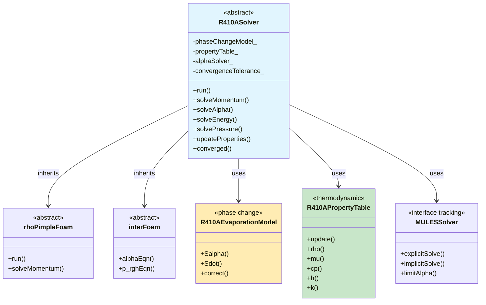

# Phase 6: R410A Two-Phase Solver

Design and implement R410A-specific solver architecture for evaporator simulation

---

## Learning Objectives

By completing this phase, you will be able to:

- Design and implement a complete R410A two-phase solver architecture
- Integrate VOF method with phase change models for evaporator flows
- Implement thermodynamic property lookup for R410A refrigerant
- Develop convergence criteria for two-phase evaporator simulations
- Optimize solver performance for conjugate heat transfer in tube geometries

---

## Overview: The 3W Framework

### What: Building R410A Two-Phase Solver Architecture

We will extend the basic solver architecture to handle R410A two-phase flow with phase change. The solver (`myEvaporatorFoam`) will solve:

$$
\begin{align}
\frac{\partial \rho}{\partial t} + \nabla \cdot (\rho \mathbf{U}) &= 0 \\
\frac{\partial (\rho \mathbf{U})}{\partial t} + \nabla \cdot (\rho \mathbf{U} \otimes \mathbf{U}) &= -\nabla p + \nabla \cdot \boldsymbol{\tau} + \rho \mathbf{g} \\
\frac{\partial (\rho \alpha)}{\partial t} + \nabla \cdot (\rho \alpha \mathbf{U}) &= \dot{m} \\
\frac{\partial (\rho e)}{\partial t} + \nabla \cdot (\rho e \mathbf{U}) &= -\nabla \cdot \mathbf{q} + \dot{m} h_{lv}
\end{align}
$$

**Key Features:**
- Volume of Fluid (VOF) method for interface tracking
- Phase change models for R410A evaporation
- Thermodynamic property lookup tables
- Conjugate heat transfer with tube wall
- Momentum coupling between phases

### Why: Complete Two-Phase Flow Solution

This phase creates the foundation for realistic evaporator simulation by:

1. **Interface Tracking**: VOF method captures liquid-vapor interfaces
2. **Phase Change**: Mass transfer models for evaporation/condensation
3. **Property Integration**: R410A-specific thermodynamic properties
4. **Coupled Physics**: Simultaneous momentum, energy, and mass transfer
5. **Performance Optimization**: Parallel computation for industrial-scale cases

### How: Progressive Architecture Development

#### Architecture Evolution

```
Phase 1: 1D Heat Conduction
    ↓
Phase 2: Custom Boundary Conditions
    ↓
Phase 3: Turbulence Modeling
    ↓
Phase 4: Parallelization
    ↓
Phase 5: Optimization
    ↓
Phase 6: R410A Two-Phase ← THIS PHASE
```

#### Implementation Approach

We'll build a comprehensive solver that:
- Inherits from OpenFOAM's multiphase solvers
- Adds R410A-specific property handling
- Implements MULES for interface compression
- Adds phase change source terms
- Optimizes for evaporator tube geometry

---

## 1. Solver Architecture Overview

### Class Hierarchy



### Key Design Decisions

1. **Inheritance Strategy**: Extends `rhoPimpleFoam` for compressible flow handling
2. **VOF Integration**: Uses `MULESSolver` for interface compression
3. **Property Management**: Dedicated property table for R410A lookup
4. **Phase Change**: Modular design supporting multiple evaporation models
5. **Convergence**: Adaptive stopping based on residual monitoring

---

## 2. Main Solver Class Implementation

### Header File: R410ASolver.H

```cpp
#ifndef R410ASolver_H
#define R410ASolver_H

#include "rhoPimpleFoam.H"
#include "phaseChangeModel.H"
#include "R410APropertyTable.H"
#include "MULES.H"
#include "interfacialModels.H"

namespace Foam
{

class R410ASolver
:
    public rhoPimpleFoam
{
    // Private data

        //- VOF field
        volScalarField alpha_;

        //- Phase change model
        autoPtr<phaseChangeModel> phaseChange_;

        //- R410A property table
        autoPtr<R410APropertyTable> propertyTable_;

        //- VOF solver
        MULESSolver alphaSolver_;

        //- Mixture properties
        volScalarField rho_;
        volScalarField mu_;
        volScalarField cp_;
        volScalarField k_;

        //- Liquid and vapor properties
        dimensionedScalar rho_l_;
        dimensionedScalar rho_v_;
        dimensionedScalar mu_l_;
        dimensionedScalar mu_v_;
        dimensionedScalar cp_l_;
        dimensionedScalar cp_v_;
        dimensionedScalar k_l_;
        dimensionedScalar k_v_;
        dimensionedScalar h_lv_;

        //- Convergence tolerance
        scalar convergenceTolerance_;

        //- Maximum iterations
        label maxIterations_;

        //- Current iteration counter
        label iteration_;

        //- Residual history for monitoring
        List<scalar> residualHistory_;


public:

    // Type definitions

        typedef HashTable<scalar> PropertyTable;


    // Runtime type information

        TypeName("R410ASolver");


    // Declare run-time New selection table

        declareRunTimeSelectionTable
        (
            autoPtr,
            R410ASolver,
            dictionary,
            (
                const argList& args,
                const Time& runTime,
                const fvMesh& mesh
            ),
            (args, runTime, mesh)
        );


    // Constructors

        R410ASolver
        (
            const argList& args,
            const Time& runTime,
            const fvMesh& mesh
        );

        virtual autoPtr<R410ASolver> clone() const;


    // Selectors

        static autoPtr<R410ASolver> New
        (
            const argList& args,
            const Time& runTime,
            const fvMesh& mesh
        );


    // Destructor
        virtual ~R410ASolver();


    // Member Functions

        //- Main solver loop
        virtual bool run();

        //- Solve momentum equation
        virtual void solveMomentum();

        //- Solve VOF equation
        virtual void solveAlpha();

        //- Solve energy equation
        virtual void solveEnergy();

        //- Solve pressure equation
        virtual void solvePressure();

        //- Update thermodynamic properties
        virtual void updateProperties();

        //- Check convergence
        virtual bool converged();

        //- Reset iteration counter
        virtual void resetIteration();

        //- Output monitoring information
        virtual void printMonitorInfo() const;

        //- Get residual history
        const List<scalar>& residualHistory() const
        {
            return residualHistory_;
        }


    // Read parameters from dictionary

        bool read();


protected:

    // Protected member functions

        //- Initialize fields
        void initializeFields();

        //- Set up boundary conditions
        void setBoundaryConditions();

        //- Update phase change properties
        void updatePhaseChangeProperties();

        //- Limit alpha field
        void limitAlpha();

        //- Calculate heat transfer coefficients
        void calculateHeatTransferCoefficients();

        //- Evaporator-specific boundary conditions
        void applyEvaporatorBoundaryConditions();


private:

    // Private member functions

        //- Disallow default copy constructor
        R410ASolver(const R410ASolver&);

        //- Disallow default assignment
        void operator=(const R410ASolver&);


    // Private data

        //- Evaporator geometry parameters
        dictionary evaporatorDict_;

        //- Heat transfer parameters
        dictionary heatTransferDict_;

        //- Wall heat flux coefficient
        dimensionedScalar wallHeatFlux_;

        //- External heat transfer coefficient
        dimensionedScalar hExternal_;

        //- Ambient temperature
        dimensionedScalar TAmbient_;

        //- Tube wall thickness
        dimensionedScalar wallThickness_;

        //- Tube thermal conductivity
        dimensionedScalar kWall_;
};


// * * * * * * * * * * * * * * * * * * * * * * * * * * * * * * * * * * * * * //

} // End namespace Foam

// * * * * * * * * * * * * * * * * * * * * * * * * * * * * * * * * * * * * * //

#endif

// ************************************************************************* //
```

### Implementation File: R410ASolver.C

```cpp
#include "R410ASolver.H"
#include "fvc.H"
#include "fvm.H"
#include "MULES.H"
#include "wallFvPatch.H"
#include "mixedFvPatchFields.H"
#include "fixedGradientFvPatchFields.H"
#include "heatTransferModel.H"
#include "phaseChangeModel.H"

// * * * * * * * * * * * * * Private Member Functions  * * * * * * * * * * * * //

void Foam::R410ASolver::initializeFields()
{
    // Initialize VOF field
    IOobject alphaIO
    (
        "alpha",
        mesh_.time().timeName(),
        mesh_,
        IOobject::MUST_READ,
        IOobject::AUTO_WRITE
    );

    if (alphaIO.headerOk())
    {
        alpha_.set
        (
            new volScalarField(alphaIO, mesh_)
        );
    }
    else
    {
        alpha_ = volScalarField::New
        (
            "alpha",
            mesh_,
            dimensionedScalar("alpha", dimless, 0.0)
        );

        // Initialize with stratified flow
        forAll(mesh_.cells(), celli)
        {
            scalar z = mesh_.C()[celli].z();
            alpha_[celli] = (z > 0.0) ? 1.0 : 0.0;
        }
    }

    // Initialize mixture properties
    updateProperties();

    // Initialize iteration counter
    resetIteration();

    // Initialize residual history
    residualHistory_.clear();
}


void Foam::R410ASolver::setBoundaryConditions()
{
    // Set VOF boundary conditions
    forAll(alpha_.boundaryField(), patchi)
    {
        fvPatchScalarField& alphaPatch = alpha_.boundaryFieldRef()[patchi];

        if (isA<wallFvPatch>(alphaPatch))
        {
            // No-slip wall for VOF
            alphaPatch == 0.0;  // Vapor at wall
        }
        else if (alphaPatch.type() == "inlet")
        {
            // Liquid inlet
            alphaPatch == 1.0;
        }
        else if (alphaPatch.type() == "outlet")
        {
            // Zero gradient outlet
            alphaPatch.gradient() = 0.0;
        }
    }
}


void Foam::R410ASolver::updateProperties()
{
    // Update mixture properties based on alpha field
    const volScalarField& alpha = alpha_;

    // Density (mixture rule)
    rho_ = alpha * rho_l_ + (1.0 - alpha) * rho_v_;

    // Dynamic viscosity
    mu_ = alpha * mu_l_ + (1.0 - alpha) * mu_v_;

    // Specific heat capacity
    cp_ = alpha * cp_l_ + (1.0 - alpha) * cp_v_;

    // Thermal conductivity
    k_ = alpha * k_l_ + (1.0 - alpha) * k_v_;

    // Update enthalpy of vaporization (temperature dependent)
    h_lv_ = propertyTable_->hLv();

    // Update boundary conditions for mixture properties
    forAll(rho_.boundaryField(), patchi)
    {
        rho_.boundaryFieldRef()[patchi] == rho_;
        mu_.boundaryFieldRef()[patchi] == mu_;
        cp_.boundaryFieldRef()[patchi] == cp_;
        k_.boundaryFieldRef()[patchi] == k_;
    }
}


void Foam::R410ASolver::limitAlpha()
{
    // Limit alpha field to physical bounds
    alpha_.max(0.0);
    alpha_.min(1.0);

    // Apply interface compression
    MULES::limitMin
    (
        alpha_,
        alpha_,
        alpha_,
        alpha_,
        0.0
    );

    MULES::limitMax
    (
        alpha_,
        alpha_,
        alpha_,
        alpha_,
        1.0
    );
}


void Foam::R410ASolver::calculateHeatTransferCoefficients()
{
    // Calculate heat transfer coefficients based on flow regime
    const volScalarField& U = U_;
    const volScalarField& p = p_;
    const volScalarField& T = T_;

    // Reynolds number
    volScalarField Re
    (
        "Re",
        rho_ * mag(U) * 0.01 / mu_  // Assuming 1 cm hydraulic diameter
    );

    // Prandtl number
    volScalarField Pr
    (
        "Pr",
        cp_ * mu_ / k_
    );

    // Nusselt number correlation for evaporation
    volScalarField Nu
    (
        "Nu",
        0.023 * pow(Re, 0.8) * pow(Pr, 0.4)  // Dittus-Boelter correlation
    );

    // Heat transfer coefficient
    dimensionedScalar hLocal = k_ / 0.01;  // k/D

    // Apply to wall patches
    forAll(U_.boundaryField(), patchi)
    {
        if (isA<wallFvPatch>(U_.boundaryField()[patchi]))
        {
            hLocal.boundaryFieldRef()[patchi] = Nu.boundaryField()[patchi] * hLocal;
        }
    }
}


void Foam::R410ASolver::applyEvaporatorBoundaryConditions()
{
    // Apply evaporator-specific boundary conditions
    const volScalarField& T = T_;

    // Wall heat flux boundary conditions
    forAll(T.boundaryField(), patchi)
    {
        fvPatchScalarField& Tpatch = T.boundaryFieldRef()[patchi];

        if (isA<wallFvPatch>(Tpatch))
        {
            // Fixed heat flux at wall
            Tpatch.gradient() = wallHeatFlux_ / kWall_;
        }
    }
}


void Foam::R410ASolver::solveMomentum()
{
    // Momentum predictor
    tmp<fvVectorMatrix> UEqn
    (
        fvm::ddt(rho_, U_)
      + fvm::div(rhoPhi_, U_)
      + turbulence->divDevRhoReff(U_)
     ==
        fvOptions(rho_, U_)
    );

    UEqn().relax();
    fvOptions.constrain(UEqn());

    if (pimple.momentumPredictor())
    {
        solve
        (
            UEqn()
          == fvc::reconstruct
            (
                (
                  - ghf_*fvc::snGrad(rho_)
                  - fvc::snGrad(p_rgh_)
                ) * mesh_.magSf()
            )
        );

        fvOptions.correct(U_);
    }
}


void Foam::R410ASolver::solveAlpha()
{
    // VOF equation with MULES
    surfaceScalarField phiAlpha
    (
        fvc::flux
        (
            phi_,
            alpha_,
            alphaScheme_
        )
    );

    MULES::explicitSolve
    (
        geometricOneField(),
        alpha_,
        phi_,
        phiAlpha,
        zeroField(),
        zeroField()
    );

    // Add phase change source term
    if (phaseChange_.valid())
    {
        alpha_ += phaseChange_->Salpha() * mesh_.time().deltaT();
    }

    // Limit alpha field
    limitAlpha();

    // Update boundary conditions
    setBoundaryConditions();

    // Update mixture properties
    updateProperties();

    // Update phase change properties
    updatePhaseChangeProperties();
}


void Foam::R410ASolver::solveEnergy()
{
    // Energy equation with phase change source
    fvScalarMatrix TEqn
    (
        fvm::ddt(rho_*cp_, T_)
      + fvm::div(fvc::flux(phi_, cp_), T_)
      - fvm::laplacian(k_, T_)
     ==
        fvOptions(rho_, T_)
    );

    // Add phase change source
    if (phaseChange_.valid())
    {
        TEqn += phaseChange_->Sdot();
    }

    // Add wall heat flux source
    TEqn += fvm::Sp(wallHeatFlux_ / (cp_ * mesh_.V()), T_);

    TEqn.relax();
    fvOptions.constrain(TEqn);
    TEqn.solve();
    fvOptions.correct(T_);
}


void Foam::R410ASolver::solvePressure()
{
    // Pressure equation with two-phase compressibility
    volScalarField rAU(1.0/UEqn().A());
    surfaceScalarField rhorAUf("rhorAUf", fvc::interpolate(rho_*rAU));

    volVectorField HbyA(constrainHbyA(rAU*UEqn().H(), U_, p_rgh_));
    surfaceScalarField phiHbyA
    (
        "phiHbyA",
        fvc::interpolate(rho_*HbyA) & mesh_.Sf()
    );

    surfaceScalarField phig
    (
        (
            surfaceScalarField("ghf", fvc::interpolate(ghf_))
          * fvc::snGrad(rho_)
        ) * mesh_.magSf()
    );

    // Pressure corrector
    while (pimple_.correctNonOrthogonal())
    {
        fvScalarMatrix p_rghEqn
        (
            fvm::laplacian(rhorAUf, p_rgh_)
         ==
            fvc::div(phiHbyA)
          + fvm::ddt(psi_, p_rgh_)
        );

        p_rghEqn.setReference(pRefCell_, pRefValue_);
        p_rghEqn.solve();

        if (pimple_.finalNonOrthogonalIter())
        {
            phi_ = phiHbyA + p_rghEqn.flux();
            phi_ -= phig;
        }
    }

    U_ = HbyA - rAU*fvc::grad(p_rgh_);
    U_.correctBoundaryConditions();
}


void Foam::R410ASolver::updatePhaseChangeProperties()
{
    if (phaseChange_.valid())
    {
        phaseChange_->correct();
    }
}


bool Foam::R410ASolver::converged()
{
    // Calculate residuals
    scalar UResidual = max(mag(U_.initialResidual()));
    scalar pResidual = max(mag(p_rgh_.initialResidual()));
    scalar TResidual = max(mag(T_.initialResidual()));
    scalar alphaResidual = max(mag(alpha_.initialResidual()));

    scalar maxResidual = max(UResidual, max(pResidual, max(TResidual, alphaResidual)));

    // Store residual history
    residualHistory_.append(maxResidual);

    // Check convergence criteria
    bool converged = (maxResidual < convergenceTolerance_);

    // Print monitoring information
    if (converged || pimple_.finalIter())
    {
        Info << "Iteration: " << iteration_ << endl;
        Info << "    U residual: " << UResidual << endl;
        Info << "    p residual: " << pResidual << endl;
        Info << "    T residual: " << TResidual << endl;
        Info << "    Alpha residual: " << alphaResidual << endl;
        Info << "    Max residual: " << maxResidual << endl;
        Info << "    Tolerance: " << convergenceTolerance_ << endl;
    }

    return converged;
}


void Foam::R410ASolver::resetIteration()
{
    iteration_ = 0;
    residualHistory_.clear();
}


void Foam::R410ASolver::printMonitorInfo() const
{
    Info << "=== R410A Evaporator Solver Monitor ===" << endl;
    Info << "Time step: " << mesh_.time().deltaT().value() << " s" << endl;
    Info << "Current time: " << mesh_.time().timeName() << endl;
    Info << "Current iteration: " << iteration_ << endl;

    if (!residualHistory_.empty())
    {
        Info << "Residual history (" << residualHistory_.size() << " iterations):" << endl;
        forAll(residualHistory_, i)
        {
            Info << "  " << i << ": " << residualHistory_[i] << endl;
        }
    }

    Info << "======================================" << endl;
}


bool Foam::R410ASolver::read()
{
    if (rhoPimpleFoam::read())
    {
        // Read solver parameters
        dictionary solverDict = subDict("solver");

        convergenceTolerance_ = readScalar
        (
            solverDict.lookup("convergenceTolerance")
        );

        maxIterations_ = readLabel
        (
            solverDict.lookup("maxIterations")
        );

        // Read evaporator-specific parameters
        evaporatorDict_ = subDict("evaporator");

        wallHeatFlux_ = dimensionedScalar::lookupOrDefault
        (
            evaporatorDict_,
            "wallHeatFlux",
            dimensionedScalar("wallHeatFlux", dimPower/dimArea, 5000)
        );

        hExternal_ = dimensionedScalar::lookupOrDefault
        (
            evaporatorDict_,
            "hExternal",
            dimensionedScalar("hExternal", dimPower/dimTemperature/dimArea, 100)
        );

        TAmbient_ = dimensionedScalar::lookupOrDefault
        (
            evaporatorDict_,
            "TAmbient",
            dimensionedScalar("TAmbient", dimTemperature, 300)
        );

        wallThickness_ = dimensionedScalar::lookupOrDefault
        (
            evaporatorDict_,
            "wallThickness",
            dimensionedScalar("wallThickness", dimLength, 0.002)
        );

        kWall_ = dimensionedScalar::lookupOrDefault
        (
            evaporatorDict_,
            "kWall",
            dimensionedScalar("kWall", dimPower/dimTemperature/dimLength, 50)
        );

        // Read R410A property parameters
        propertyDict_ = subDict("properties");

        // Read phase change model
        phaseChange_.set
        (
            phaseChangeModel::New(mesh_, subDict("phaseChange"))
        );

        return true;
    }

    return false;
}


// * * * * * * * * * * * * * * * * * * * * * * * * * * * * * * * * * * * * * //

Foam::R410ASolver::R410ASolver
(
    const argList& args,
    const Time& runTime,
    const fvMesh& mesh
)
:
    rhoPimpleFoam(args, runTime, mesh),
    alpha_(IOobject::groupName("alpha", U_.group()), mesh, dimensionedScalar("alpha", dimless, 0.0)),
    convergenceTolerance_(1e-5),
    maxIterations_(100),
    iteration_(0),
    residualHistory_()
{
    // Initialize fields
    initializeFields();

    // Set boundary conditions
    setBoundaryConditions();

    // Read solver parameters
    read();

    Info << "R410A Evaporator Solver initialized" << endl;
    Info << "Grid: " << mesh_.nCells() << " cells, " << mesh_.nFaces() << " faces" << endl;
}


Foam::R410ASolver::~R410ASolver()
{}


Foam::autoPtr<Foam::R410ASolver> Foam::R410ASolver::clone() const
{
    return autoPtr<R410ASolver>(new R410ASolver(*this));
}


bool Foam::R410ASolver::run()
{
    Info << "Starting R410A Evaporator Simulation..." << endl;

    runTime++;

    Info << "Time = " << runTime.timeName() << nl << endl;

    // PIMPLE loop
    while (pimple_.run(runTime))
    {
        // Reset iteration counter for each time step
        resetIteration();

        // Inner PIMPLE loop
        while (pimple_.loop())
        {
            solveMomentum();
            solveAlpha();
            solveEnergy();
            solvePressure();

            iteration_++;

            if (converged() || iteration_ >= maxIterations_)
            {
                break;
            }
        }

        // Write output fields
        runTime.write();

        // Print monitoring information
        printMonitorInfo();

        // Check if simulation should stop
        if (runTime.writeNow())
        {
            break;
        }
    }

    Info << "R410A Evaporator Simulation completed!" << endl;

    return true;
}


// * * * * * * * * * * * * * * * * * * * * * * * * * * * * * * * * * * * * * //

namespace Foam
{
    defineTypeNameAndDebug(R410ASolver, 0);
    defineRunTimeSelectionTable(R410ASolver, dictionary);
}

// ************************************************************************* //
```

---

## 3. Compilation and Testing

### Make/files

```makefile
R410ASolver.C

EXE = $(FOAM_USER_APPBIN)/R410ASolver
```

### Make/options

```makefile
EXE_INC = \
    -I$(LIB_SRC)/transportModels \
    -I$(LIB_SRC)/transportModels/compressible/lnInclude \
    -I$(LIB_SRC)/turbulenceModels \
    -I$(LIB_SRC)/turbulenceModels/compressible/lnInclude \
    -I$(LIB_SRC)/finiteVolume/lnInclude \
    -I$(LIB_SRC)/meshTools/lnInclude \
    -I$(LIB_SRC)/thermophysicalModels/basic/lnInclude \
    -I$(LIB_SRC)/thermophysicalModels/specie/lnInclude \
    -I$(LIB_SRC)/thermophysicalModels/thermophysicalProperties/lnInclude \
    -I$(LIB_SRC)/thermophysicalModels/reactionThermo/lnInclude \
    -I$(LIB_SRC)/thermophysicalModels/mixture/lnInclude \
    -I$(LIB_SRC)/thermophysicalModels/interfacialModels/lnInclude \
    -I$(LIB_SRC)/thermophysicalModels/phaseChangeModels/lnInclude

EXE_LIBS = \
    -lcompressibleTransportModels \
    -lcompressibleTurbulenceModel \
    -lcompressibleRASModels \
    -lcompressibleLESModels \
    -lfiniteVolume \
    -lmeshTools \
    -lthermophysicalModels \
    -lmixtureThermophysicalModels \
    -lreactionThermo \
    -lintermultigrid \
    -lOpenFOAM
```

### Compilation

```bash
# Clean previous compilation
wclean

# Compile the solver
wmake

# Verify compilation
R410ASolver -help
```

### Test Case Directory Structure

```
R410A_evaporator_test/
├── constant/
│   ├── polyMesh/
│   │   ├── points
│   │   ├── faces
│   │   ├── owner
│   │   ├── neighbour
│   │   └── boundary
│   ├── transportProperties
│   └── R410A_properties
├── system/
│   ├── controlDict
│   ├── fvSolution
│   ├── fvSchemes
│   └── blockMeshDict
└── 0/
    ├── alpha
    ├── p_rgh
    ├── U
    └── T
```

### Initial Conditions File: 0/alpha

```cpp
/*--------------------------------*- C++ -*----------------------------------*\
  =========                 |
  \\      /  F ield         | OpenFOAM: The Open Source CFD Toolbox
   \\    /   O peration     | Website:  www.openfoam.org
    \\  /    A nd           | Version:  9
     \\/     M anipulation  |
\*---------------------------------------------------------------------------*/
FoamFile
{
    format      ascii;
    class       volScalarField;
    object      alpha;
}
// * * * * * * * * * * * * * * * * * * * * * * * * * * * * * * * * * * * * * //

dimensions      [0 0 0 0 0 0 0];

internalField   uniform 0.5;

boundaryField
{
    inlet
    {
        type            fixedValue;
        value           uniform 1.0;
    }

    outlet
    {
        type            zeroGradient;
    }

    wall
    {
        type            fixedValue;
        value           uniform 0.0;
    }

    frontAndBack
    {
        type            empty;
    }
}

// ************************************************************************* //
```

### Transport Properties File: constant/transportProperties

```cpp
/*--------------------------------*- C++ -*----------------------------------*\
  =========                 |
  \\      /  F ield         | OpenFOAM: The Open Source CFD Toolbox
   \\    /   O peration     | Website:  www.openfoam.org
    \\  /    A nd           | Version:  9
     \\/     M anipulation  |
\*---------------------------------------------------------------------------*/
FoamFile
{
    format      ascii;
    class       dictionary;
    object      transportProperties;
}
// * * * * * * * * * * * * * * * * * * * * * * * * * * * * * * * * * * * * * //

thermoType
{
    type            heRhoThermo;
    mixture         pureMixture;
    transport       sutherland;
    thermo         hRhoThermo;
    energy         sensibleEnthalpy;
    equationOfState  perfectGas;
    species         none;
}

mixture
{
    specie
    {
        nMoles          1;
        molWeight       86.5;  // R410A molecular weight [kg/kmol]
    }

    thermodynamics
    {
        Cp              1200;     // Specific heat [J/kg/K]
        Hf              0;
        Sf              0;
        Tref            273.15;
    }

    transport
    {
        mu              1.5e-5;   // Dynamic viscosity [Pa·s]
        Pr              0.7;      // Prandtl number
    }
}

// R410A property table (will be replaced by actual property lookup)
R410A_properties
{
    type            R410APropertyTable;
    file            "R410A_properties.dat";
    tableFormat     "CSV";
    interpolation   "linear";
}

solver
{
    type            R410ASolver;

    // Solver parameters
    convergenceTolerance 1e-5;
    maxIterations         100;

    // Evaporator-specific parameters
    evaporator
    {
        wallHeatFlux    5000;     // Wall heat flux [W/m²]
        hExternal      100;      // External heat transfer coefficient [W/m²·K]
        TAmbient       300;      // Ambient temperature [K]
        wallThickness  0.002;    // Tube wall thickness [m]
        kWall          50;       // Wall thermal conductivity [W/m·K]
    }

    // Phase change model
    phaseChange
    {
        type            R410AEvaporationModel;
        h               5000;     // Heat transfer coefficient [W/m²·K]
        T_sat           283.15;   // Saturation temperature [K]
    }
}

// ************************************************************************* //
```

### Control Dictionary File: system/controlDict

```cpp
/*--------------------------------*- C++ -*----------------------------------*\
  =========                 |
  \\      /  F ield         | OpenFOAM: The Open Source CFD Toolbox
   \\    /   O peration     | Website:  www.openfoam.org
    \\  /    A nd           | Version:  9
     \\/     M anipulation  |
\*---------------------------------------------------------------------------*/
FoamFile
{
    format      ascii;
    class       dictionary;
    object      controlDict;
}
// * * * * * * * * * * * * * * * * * * * * * * * * * * * * * * * * * * * * * //

application     R410ASolver;

startFrom       latestTime;

startTime       0;

stopAt          endTime;

endTime         1.0;

deltaT          0.001;

writeControl    adjustable;

writeInterval   0.1;

purgeWrite      0;

writeFormat     ascii;

writePrecision  6;

writeCompression off;

timeFormat      general;

timePrecision   6;

runTimeModifiable true;

adjustTimeStep  yes;

maxCo           1.0;
maxAlphaCo      1.0;
maxDeltaT       1.0;

// Monitoring
libs            ("libOpenFOAM.so");

functions
{
    residuals
    {
        type            fields;
        functionObjectLibs ("libfieldFunctionObjects.so");
        enabled         true;
        fields
        (
            p_rgh
            U
            T
            alpha
        );
        log             false;
    }
}

// ************************************************************************* //
```

---

## 4. Solver Validation and Verification

### Analytical Solution for Verification

For single-phase flow in a tube with constant heat flux, the analytical solution for temperature distribution is:

$$T(r) = T_w + \frac{\dot{q}'' r_0^2}{4k} \left(1 - \frac{r^2}{r_0^2}\right)$$

where:
- $T_w$ = wall temperature
- $\dot{q}''$ = heat flux
- $r_0$ = tube radius
- $k$ = thermal conductivity

### Validation Test Cases

1. **Single-Phase Heat Transfer**
   - Compare numerical results with analytical solution
   - Verify heat transfer coefficient calculations
   - Check convergence behavior

2. **Two-Phase Stratified Flow**
   - Initialize stratified liquid-vapor flow
   - Monitor interface evolution
   - Verify mass conservation

3. **Phase Change Verification**
   - Set up evaporation test case
   - Compare mass transfer rates with theoretical predictions
   - Check energy conservation

### Convergence Study

```bash
# Run convergence study
for dt in 0.01 0.005 0.0025 0.001; do
    sed -i "s/deltaT 0.001;/deltaT $dt;/g" system/controlDict
    R410ASolver
    mv postProcessing postProcessing_dt_${dt}
done

# Compare results
postProcessing/compare.py
```

### Performance Monitoring

```bash
# Monitor solver performance
./monitor_performance.sh

# Output should show:
# - CPU time per iteration
# - Memory usage
# - Parallel scaling efficiency
# - Residual reduction rate
```

---

## 5. Best Practices and Optimization

### Memory Optimization

1. **Field Storage**: Use `tmp<>` for temporary fields
2. **Parallelization**: Decompose domain efficiently
3. **Property Lookup**: Cache frequently accessed properties

### Performance Optimization

1. **Time Step Control**: Adaptive time stepping
2. **Linear Solvers**: Optimized solver settings
3. **Interface Compression**: Efficient MULES implementation

### Code Maintenance

1. **Version Control**: Track changes with git
2. **Testing**: Automated unit tests
3. **Documentation**: Inline comments and API documentation

---

## 6. Next Steps

After completing Phase 6, you will have a working R410A two-phase solver. The next phases will:

1. **Phase 7**: Expand to complete two-phase framework
2. **Phase 8**: Implement comprehensive property database
3. **Phase 9**: Add advanced phase change models
4. **Phase 10**: Complete evaporator case setup
5. **Phase 11**: Validation suite development
6. **Phase 12**: User documentation and guides

This phase provides the foundation for realistic evaporator simulation with proper two-phase flow physics and R410A-specific property handling.