# Phase 7: Two-Phase Flow Framework

Design and implement complete two-phase flow framework for R410A evaporator simulation

---

## Learning Objectives

By completing this phase, you will be able to:

- Design and implement a comprehensive two-phase flow framework
- Develop modular phase change models for R410A evaporation
- Create thermodynamic property lookup system for refrigerants
- Implement advanced interface tracking algorithms
- Build extensible framework for future model extensions

---

## Overview: The 3W Framework

### What: Comprehensive Two-Phase Framework Development

We will extend the R410A solver architecture to create a complete two-phase framework that handles:

1. **Interface Tracking**: VOF method with interface compression
2. **Phase Change**: Multiple evaporation and condensation models
3. **Property Management**: Thermodynamic property database
4. **Interfacial Forces**: Surface tension, drag, and lift forces
5. **Heat Transfer**: Evaporative and convective heat transfer

The framework will be modular and extensible, allowing easy addition of new models.

### Why: Industry-Standard Two-Phase Simulation

This phase creates a production-ready framework that:

1. **Scalability**: Handles from simple stratified flows to complex annular flows
2. **Accuracy**: Multiple phase change models for different flow regimes
3. **Flexibility**: Easy to extend with new models and physics
4. **Validation**: Rigorous testing against analytical and experimental data
5. **Performance**: Optimized for industrial-scale evaporator simulations

### How: Modular Architecture Development

We'll build the framework using OpenFOAM's multiphase architecture principles:

1. **Base Classes**: Abstract interfaces for all models
2. **Concrete Implementations**: Specific R410A models
3. **Factory Pattern**: Runtime model selection
4. **Composition Framework**: Model composition and configuration

---

## 1. Framework Architecture Overview

### Complete Architecture Diagram

```mermaid
graph TB
    subgraph "R410A Solver"
        A[R410ASolver]
        A --> B[Main Control]
        A --> C[Momentum Solver]
        A --> D[VOF Solver]
        A --> E[Energy Solver]
        A --> F[Property Manager]
    end

    subgraph "Phase Change Models"
        G[phaseChangeModel]
        G --> H[R410AEvaporationModel]
        G --> I[R410ACondensationModel]
        G --> J[EvaporationNucleateModel]
        G --> K[EvaporationFilmModel]
        G --> L[BoilingModel]
    end

    subgraph "Property System"
        M[R410APropertyTable]
        M --> N[ThermodynamicProperties]
        M --> O[TransportProperties]
        M --> P[PhaseEquilibrium]
        M --> Q[PropertyInterpolation]
    end

    subgraph "Interface Models"
        R[interfacialModels]
        R --> S[surfaceTensionModel]
        R --> T[dragModel]
        R --> U[liftModel]
        R --> V[virtualMassModel]
    end

    subgraph "Numerical Methods"
        W[MULESSolver]
        W --> X[interfaceCompression]
        W --> Y[limiting]
        W --> Z[fluxCorrection]
    end

    A --> G
    A --> M
    A --> R
    A --> W

    style A fill:#e3f2fd
    style G fill:#f3e5f5
    style M fill:#e8f5e8
    style R fill:#fff3e0
    style W fill:#fce4ec
```



### Key Design Principles

1. **Modularity**: Each component is independent and replaceable
2. **Extensibility**: New models can be added without modifying existing code
3. **Performance**: Efficient memory usage and computation
4. **Maintainability**: Clear interfaces and documentation
5. **Testability**: Components can be unit tested independently

---

## 2. Phase Change Model Base Class

### Header: phaseChangeModel.H

```cpp
#ifndef phaseChangeModel_H
#define phaseChangeModel_H

#include "volFields.H"
#include "surfaceFields.H"
#include "runTimeSelectionTables.H"
#include "thermodynamicProperties.H"

namespace Foam
{

class phaseChangeModel
{
protected:

    // Protected data

        //- Reference to mesh
        const fvMesh& mesh_;

        //- Reference to thermophysical properties
        autoPtr<thermodynamicProperties> thermo_;

        //- Liquid and vapor density fields
        const volScalarField& rho_l_;
        const volScalarField& rho_v_;

        //- Liquid and vapor enthalpy fields
        const volScalarField& h_l_;
        const volScalarField& h_v_;

        //- Saturation temperature field
        volScalarField T_sat_;

        //- Latent heat of vaporization
        volScalarField h_lv_;

        //- Mass transfer coefficient
        dimensionedScalar K_;

        //- Model coefficients
        dictionary coeffDict_;


    // Protected member functions

        //- Update saturation temperature
        void updateSaturationTemperature();

        //- Update latent heat of vaporization
        void updateLatentHeat();

        //- Calculate mass transfer rate
        virtual scalar massTransferRate
        (
            const scalar& alpha,
            const scalar& T,
            const scalar& p,
            const vector& U
        ) const = 0;

        //- Limit mass transfer rate
        scalar limitMassTransferRate
        (
            const scalar& mDot,
            const scalar& alpha
        ) const;


public:

    //- Runtime type information
    TypeName("phaseChangeModel");


    // Declare run-time New selection table

        declareRunTimeSelectionTable
        (
            autoPtr,
            phaseChangeModel,
            dictionary,
            (
                const fvMesh& mesh,
                const dictionary& dict,
                const volScalarField& alpha,
                const thermodynamicProperties& thermo
            ),
            (mesh, dict, alpha, thermo)
        );


    // Constructors

        phaseChangeModel
        (
            const fvMesh& mesh,
            const dictionary& dict,
            const volScalarField& alpha,
            const thermodynamicProperties& thermo
        );

        virtual autoPtr<phaseChangeModel> clone() const = 0;


    // Selectors

        static autoPtr<phaseChangeModel> New
        (
            const fvMesh& mesh,
            const dictionary& dict,
            const volScalarField& alpha,
            const thermodynamicProperties& thermo
        );


    //- Destructor
        virtual ~phaseChangeModel();


    // Member Functions

        //- Mass transfer rate [kg/m³/s]
        virtual tmp<volScalarField> Salpha() const = 0;

        //- Energy source term [W/m³]
        virtual tmp<volScalarField> Sdot() const = 0;

        //- Update model coefficients
        virtual void correct();

        //- Read model parameters
        virtual bool read();

        //- Return model name
        virtual word modelName() const = 0;

        //- Return true if model is active
        virtual bool active() const;

        //- Set active/inactive
        virtual void setActive(const bool active);

        //- Get mass transfer coefficient
        dimensionedScalar K() const
        {
            return K_;
        }

        //- Get saturation temperature field
        const volScalarField& T_sat() const
        {
            return T_sat_;
        }

        //- Get latent heat field
        const volScalarField& h_lv() const
        {
            return h_lv_;
        }


    // Friend classes
        friend class R410AEvaporationModel;
        friend class R410ACondensationModel;
        friend class EvaporationNucleateModel;
        friend class EvaporationFilmModel;
};


// * * * * * * * * * * * * * * * * * * * * * * * * * * * * * * * * * * * * * //

} // End namespace Foam

// * * * * * * * * * * * * * * * * * * * * * * * * * * * * * * * * * * * * * //

#endif

// ************************************************************************* //
```

### Implementation: phaseChangeModel.C

```cpp
#include "phaseChangeModel.H"
#include "fvc.H"
#include "fvm.H"
#include "surfaceFields.H"
#include "interpolationCellPoint.H"

// * * * * * * * * * * * * * * * * * * * * * * * * * * * * * * * * * * * * * //

namespace Foam
{

// * * * * * * * * * * * * * Private Member Functions  * * * * * * * * * * * * //

void Foam::phaseChangeModel::updateSaturationTemperature()
{
    // Update saturation temperature based on pressure
    const volScalarField& p = thermo_->p();

    // Antoine equation for R410A
    // log10(P) = A - B/(T + C)
    // where P in bar, T in K
    scalar A = 4.01367;
    scalar B = 1045.0;
    scalar C = -31.0;

    // Convert pressure to bar
    volScalarField p_bar
    (
        IOobject::groupName("p_bar", p.group()),
        p / 1e5
    );

    // Calculate saturation temperature
    T_sat_ = (B / (A - log10(p_bar))) - C;
}


void Foam::phaseChangeModel::updateLatentHeat()
{
    // Update latent heat of vaporization
    // Watson correlation: h_lv = h_lv,Tn * ((Tn - Tc)/(T - Tc))^0.38
    scalar Tn = 273.15;  // Reference temperature [K]
    scalar Tc = 344.65;  // Critical temperature [K] for R410A
    scalar h_lv_Tn = 2.0e5;  // Latent heat at reference [J/kg]

    const volScalarField& T = thermo_->T();

    h_lv_ = h_lv_Tn * pow((Tn - Tc) / (T - Tc), 0.38);

    // Ensure positive values
    h_lv_.max(0.0);
}


Foam::scalar Foam::phaseChangeModel::massTransferRate
(
    const scalar& alpha,
    const scalar& T,
    const scalar& p,
    const vector& U
) const
{
    // Base mass transfer rate calculation
    // This will be overridden by specific models

    // Simple approach: rate proportional to deviation from saturation
    scalar T_sat_local = T_sat_[0];  // Use local saturation temperature

    if (T > T_sat_local)
    {
        // Evaporation
        return K_.value() * (T - T_sat_local) * alpha * rho_l_[0];
    }
    else
    {
        // Condensation
        return -K_.value() * (T_sat_local - T) * (1.0 - alpha) * rho_v_[0];
    }
}


Foam::scalar Foam::phaseChangeModel::limitMassTransferRate
(
    const scalar& mDot,
    const scalar& alpha
) const
{
    // Limit mass transfer rate to prevent unphysical values
    scalar maxEvap = alpha * rho_l_[0] / mesh_.time().deltaT().value();
    scalar maxCond = (1.0 - alpha) * rho_v_[0] / mesh_.time().deltaT().value();

    return sign(mDot) * mag(min(mag(mDot), maxEvap + maxCond));
}


// * * * * * * * * * * * * * * * * * * * * * * * * * * * * * * * * * * * * * //

Foam::phaseChangeModel::phaseChangeModel
(
    const fvMesh& mesh,
    const dictionary& dict,
    const volScalarField& alpha,
    const thermodynamicProperties& thermo
)
:
    mesh_(mesh),
    thermo_(thermo.clone()),
    rho_l_(thermo_->rho_l()),
    rho_v_(thermo_->rho_v()),
    h_l_(thermo_->h_l()),
    h_v_(thermo_->h_v()),
    T_sat_(IOobject::groupName("T_sat", alpha.group()), mesh, dimensionedScalar("T_sat", dimTemperature, 273.15)),
    h_lv_(IOobject::groupName("h_lv", alpha.group()), mesh, dimensionedScalar("h_lv", dimEnergy/dimMass, 2.0e5)),
    K_(dict.lookupOrDefault("K", dimensionedScalar("K", dimless/dimTime, 1.0))),
    coeffDict_(dict.subOrEmptyDict("phaseChange"))
{
    // Update saturation temperature and latent heat
    updateSaturationTemperature();
    updateLatentHeat();

    Info << "Phase change model initialized" << endl;
    Info << "  Mass transfer coefficient: " << K_.value() << " 1/s" << endl;
}


Foam::phaseChangeModel::~phaseChangeModel()
{}


Foam::autoPtr<Foam::phaseChangeModel> Foam::phaseChangeModel::clone() const
{
    NotImplemented;
    return autoPtr<phaseChangeModel>(nullptr);
}


Foam::autoPtr<Foam::phaseChangeModel> Foam::phaseChangeModel::New
(
    const fvMesh& mesh,
    const dictionary& dict,
    const volScalarField& alpha,
    const thermodynamicProperties& thermo
)
{
    word modelType(dict.lookup("type"));

    Info << "Selecting phase change model: " << modelType << endl;

    modelsConstructorTable::iterator cstrIter = modelsConstructorTable_.find(modelType);

    if (cstrIter == modelsConstructorTable_.end())
    {
        FatalErrorInFunction
            << "Unknown phase change model type " << modelType
            << ", available models are:" << endl
            << modelsConstructorTable_.sortedToc()
            << exit(FatalError);
    }

    return autoPtr<phaseChangeModel>
    (
        cstrIter()(mesh, dict, alpha, thermo)
    );
}


void Foam::phaseChangeModel::correct()
{
    // Update model coefficients if needed
    updateSaturationTemperature();
    updateLatentHeat();
}


bool Foam::phaseChangeModel::read()
{
    // Read model parameters
    K_ = dimensionedScalar::lookupOrDefault("K", dimless/dimTime, 1.0);

    return true;
}


bool Foam::phaseChangeModel::active() const
{
    // Check if model is active
    return true;  // Default: always active
}


void Foam::phaseChangeModel::setActive(const bool active)
{
    // Set model active/inactive
    // This will be used to turn off certain models in certain conditions
}


// * * * * * * * * * * * * * * * * * * * * * * * * * * * * * * * * * * * * * //

} // End namespace Foam

// ************************************************************************* //
```

---

## 3. R410A Evaporation Model

### Header: R410AEvaporationModel.H

```cpp
#ifndef R410AEvaporationModel_H
#define R410AEvaporationModel_H

#include "phaseChangeModel.H"
#include "thermodynamicProperties.H"

namespace Foam
{

class R410AEvaporationModel
:
    public phaseChangeModel
{
    // Private data

        //- Heat transfer coefficient
        dimensionedScalar h_;

        //- Activation temperature
        dimensionedScalar T_activation_;

        //- Maximum evaporation rate
        dimensionedScalar maxEvapRate_;

        //- Evaporation model type
        word modelType_;

        //- Interface area density
        volScalarField a_;

        //- Bubble departure diameter
        dimensionedScalar d_bubble_;

        nucleationSiteModel nucleation_;


    // Private member functions

        //- Calculate interface area density
        void calculateInterfaceArea();

        //- Calculate nucleation site density
        void calculateNucleationSites();

        //- Calculate heat transfer coefficient
        dimensionedScalar calculateHeatTransferCoefficient
        (
            const scalar& Re,
            const scalar& Pr,
            const scalar& Ja
        ) const;

        //- Calculate mass transfer rate for nucleate boiling
        scalar nucleateBoilingMassTransfer
        (
            const scalar& alpha,
            const scalar& T,
            const scalar& p,
            const vector& U
        ) const;

        //- Calculate mass transfer rate for film boiling
        scalar filmBoilingMassTransfer
        (
            const scalar& alpha,
            const scalar& T,
            const scalar& p,
            const vector& U
        ) const;


public:

    //- Runtime type information
    TypeName("R410AEvaporationModel");

    //- Constructor
    R410AEvaporationModel
    (
        const fvMesh& mesh,
        const dictionary& dict,
        const volScalarField& alpha,
        const thermodynamicProperties& thermo
    );

    //- Destructor
    virtual ~R10AEvaporationModel();


    // Member Functions

        virtual tmp<volScalarField> Salpha() const;

        virtual tmp<volScalarField> Sdot() const;

        virtual void correct();

        virtual word modelName() const
        {
            return "R410AEvaporationModel";
        }

        virtual bool read();

        //- Get heat transfer coefficient
        dimensionedScalar h() const
        {
            return h_;
        }

        //- Get interface area density
        const volScalarField& a() const
        {
            return a_;
        }


    // Friend classes
        friend class nucleationSiteModel;
};


// * * * * * * * * * * * * * * * * * * * * * * * * * * * * * * * * * * * * * //

} // End namespace Foam

// ************************************************************************* //
```

### Implementation: R410AEvaporationModel.C

```cpp
#include "R410AEvaporationModel.H"
#include "fvc.H"
#include "fvm.H"
#include "surfaceFields.H"
#include "interpolationCellPoint.H"
#include "wallFvPatch.H"
#include "specie.H"
#include "thermodynamicTransportModel.H"

// * * * * * * * * * * * * * Private Member Functions  * * * * * * * * * * * * //

void Foam::R410AEvaporationModel::calculateInterfaceArea()
{
    // Calculate interface area density using gradient of alpha
    const volScalarField& alpha = mesh_.lookupObject<volScalarField>("alpha");

    volScalarField gradAlpha(fvc::grad(alpha));

    // Interface area density = |∇α|
    a_ = mag(gradAlpha);

    // Limit to reasonable values
    a_.max(0.0);
    a_.min(1e6);  // Maximum 1e6 m²/m³
}


void Foam::R410AEvaporationModel::calculateNucleationSites()
{
    // Calculate nucleation site density based on wall superheat
    const volScalarField& T = thermo_->T();

    volScalarField deltaT(T - T_sat_);

    // Only calculate where deltaT > 0 (superheated)
    volScalarField superheat(pos(deltaT));

    // nucleation site density ∝ deltaT^2
    scalar N0 = 1e6;  // Base nucleation site density [sites/m²]
    scalar C = 1.0;   // Coefficient

    nucleation_.n() = N0 * pow(C * deltaT, 2.0) * superheat;
}


Foam::dimensionedScalar Foam::R10AEvaporationModel::calculateHeatTransferCoefficient
(
    const scalar& Re,
    const scalar& Pr,
    const scalar& Ja
) const
{
    // Rohsenow correlation for nucleate boiling
    // h = μ_l * h_fg * (q'' / (μ_l * h_fg * σ / (σ * ρ_l * c_p,l * ΔT^3)))^0.33

    if (Re < 1e3)
    {
        // Natural convection
        return 0.025 * k_l_ * pow(Re, 0.8) * pow(Pr, 0.4) / 0.01;  // Assuming 1 cm diameter
    }
    else
    {
        // Forced convection with nucleate boiling
        return 0.023 * k_l_ * pow(Re, 0.8) * pow(Pr, 0.4) * (1.0 + 3.1e-6 * Ja);
    }
}


Foam::scalar Foam::R410AEvaporationModel::nucleateBoilingMassTransfer
(
    const scalar& alpha,
    const scalar& T,
    const scalar& p,
    const vector& U
) const
{
    // Nucleate boiling mass transfer rate
    scalar deltaT = max(T - T_sat_[0], 0.0);

    if (deltaT < SMALL)
    {
        return 0.0;
    }

    // Calculate heat flux
    dimensionedScalar q
    (
        "q",
        dimPower/dimArea,
        h_.value() * deltaT
    );

    // Mass transfer rate from heat flux
    scalar mDot = q.value() / h_lv_[0];

    // Limit by available liquid
    mDot = min(mDot, alpha * rho_l_[0] / mesh_.time().deltaT().value());

    return mDot;
}


Foam::scalar Foam::R410AEvaporationModel::filmBoilingMassTransfer
(
    const scalar& alpha,
    const scalar& T,
    const scalar& p,
    const vector& U
) const
{
    // Film boiling mass transfer rate
    scalar deltaT = max(T - T_sat_[0], 0.0);

    if (deltaT < SMALL)
    {
        return 0.0;
    }

    // Film boiling heat transfer coefficient (Bromley correlation)
    scalar k_v = 0.02;  // Vapor thermal conductivity [W/m·K]
    scalar mu_v = 1.5e-5;  // Vapor viscosity [Pa·s]
    scalar rho_v = 50.0;  // Vapor density [kg/m³]
    scalar g = 9.81;  // Gravity [m/s²]

    // Characteristic length for film boiling
    scalar L = sqrt(sigma_ / (g * (rho_l_[0] - rho_v)));

    // Bromley correlation
    dimensionedScalar h_film
    (
        "h_film",
        dimPower/dimTemperature/dimArea,
        0.62 * k_v * pow(g * rho_v * (rho_l_[0] - rho_v) * h_lv_[0] / (mu_v * L), 0.25)
    );

    // Heat flux
    dimensionedScalar q
    (
        "q",
        dimPower/dimArea,
        h_film.value() * deltaT
    );

    // Mass transfer rate
    scalar mDot = q.value() / h_lv_[0];

    // Limit by available liquid
    mDot = min(mDot, alpha * rho_l_[0] / mesh_.time().deltaT().value());

    return mDot;
}


// * * * * * * * * * * * * * * * * * * * * * * * * * * * * * * * * * * * * * //

Foam::R410AEvaporationModel::R410AEvaporationModel
(
    const fvMesh& mesh,
    const dictionary& dict,
    const volScalarField& alpha,
    const thermodynamicProperties& thermo
)
:
    phaseChangeModel(mesh, dict, alpha, thermo),
    h_(dict.lookupOrDefault("h", dimPower/dimTemperature/dimArea, 5000)),
    T_activation_(dict.lookupOrDefault("T_activation", dimTemperature, 285.0)),
    maxEvapRate_(dict.lookupOrDefault("maxEvapRate", dimMass/dimTime/dimVol, 100)),
    modelType_(dict.lookupOrDefault("modelType", word, "nucleate")),
    a_(IOobject::groupName("a", alpha.group()), mesh, dimensionedScalar("a", dimless/dimLength, 0)),
    d_bubble_(dict.lookupOrDefault("d_bubble", dimLength, 1e-3)),
    nucleation_(mesh, dict.subDict("nucleation"))
{
    Info << "R410A Evaporation Model initialized" << endl;
    Info << "  Model type: " << modelType_ << endl;
    Info << "  Heat transfer coefficient: " << h_.value() << " W/m²/K" << endl;
    Info << "  Activation temperature: " << T_activation_.value() << " K" << endl;

    // Calculate initial interface area
    calculateInterfaceArea();
}


Foam::R410AEvaporationModel::~R410AEvaporationModel()
{}


Foam::tmp<Foam::volScalarField> Foam::R410AEvaporationModel::Salpha() const
{
    const volScalarField& alpha = mesh_.lookupObject<volScalarField>("alpha");
    const volScalarField& T = thermo_->T();

    tmp<volScalarField> tSalpha
    (
        new volScalarField
        (
            IOobject
            (
                "Salpha",
                mesh_.time().timeName(),
                mesh_,
                IOobject::NO_READ,
                IOobject::NO_WRITE
            ),
            mesh_,
            dimensionedScalar("Salpha", dimMass/dimTime/dimVol, 0)
        )
    );

    volScalarField& Salpha = tSalpha.ref();

    // Calculate mass transfer rate based on model type
    forAll(mesh_.cells(), celli)
    {
        scalar alpha_cell = alpha[celli];
        scalar T_cell = T[celli];
        vector U_cell = U_[celli];

        scalar mDot = 0.0;

        if (modelType_ == "nucleate")
        {
            mDot = nucleateBoilingMassTransfer(alpha_cell, T_cell, p_[celli], U_cell);
        }
        else if (modelType_ == "film")
        {
            mDot = filmBoilingMassTransfer(alpha_cell, T_cell, p_[celli], U_cell);
        }
        else
        {
            // Default: simple evaporation model
            mDot = K_.value() * max(T_cell - T_sat_[celli], 0.0) * alpha_cell * rho_l_[celli];
        }

        // Limit mass transfer rate
        mDot = limitMassTransferRate(mDot, alpha_cell);

        Salpha[celli] = mDot;
    }

    // Apply boundary conditions
    forAll(alpha.boundaryField(), patchi)
    {
        if (isA<wallFvPatch>(alpha.boundaryField()[patchi]))
        {
            // Enhanced evaporation at walls
            const fvPatchScalarField& alphaPatch = alpha.boundaryField()[patchi];
            const fvPatchScalarField& TPatch = T.boundaryField()[patchi];

            forAll(alphaPatch, facei)
            {
                scalar alpha_face = alphaPatch[facei];
                scalar T_face = TPatch[facei];

                // Wall heat flux enhancement
                scalar wall_mDot = h_.value() * max(T_face - T_activation_, 0.0) / h_lv_[0];
                wall_mDot = min(wall_mDot, alpha_face * rho_l_[0] / mesh_.time().deltaT().value());

                Salpha.boundaryFieldRef()[patchi][facei] = wall_mDot;
            }
        }
    }

    return tSalpha;
}


Foam::tmp<Foam::volScalarField> Foam::R410AEvaporationModel::Sdot() const
{
    const volScalarField& alpha = mesh_.lookupObject<volScalarField>("alpha");
    const volScalarField& T = thermo_->T();

    tmp<volScalarField> tSdot
    (
        new volScalarField
        (
            IOobject
            (
                "Sdot",
                mesh_.time().timeName(),
                mesh_,
                IOobject::NO_READ,
                IOobject::NO_WRITE
            ),
            mesh_,
            dimensionedScalar("Sdot", dimEnergy/dimTime/dimVol, 0)
        )
    );

    volScalarField& Sdot = tSdot.ref();

    // Energy source term = mass transfer rate * latent heat
    Sdot = Salpha() * h_lv_;

    return tSdot;
}


void Foam::R410AEvaporationModel::correct()
{
    // Update model coefficients
    phaseChangeModel::correct();

    // Calculate interface area
    calculateInterfaceArea();

    // Calculate nucleation sites
    calculateNucleationSites();

    // Update heat transfer coefficient based on local conditions
    const volScalarField& U = U_;
    const volScalarField& T = thermo_->T();

    // Calculate Reynolds number
    volScalarField Re
    (
        "Re",
        rho_l_ * mag(U) * 0.01 / mu_l_  // Assuming 1 cm diameter
    );

    // Calculate Prandtl number
    volScalarField Pr
    (
        "Pr",
        cp_l_ * mu_l_ / k_l_
    );

    // Calculate Jakob number
    volScalarField Ja
    (
        "Ja",
        rho_l_ * cp_l_ * (T - T_sat_) / h_lv_
    );

    // Update heat transfer coefficient
    forAll(mesh_.cells(), celli)
    {
        h_.value() = calculateHeatTransferCoefficient
        (
            Re[celli],
            Pr[celli],
            Ja[celli]
        );
    }
}


bool Foam::R410AEvaporationModel::read()
{
    // Read model parameters
    h_ = dimensionedScalar::lookupOrDefault("h", dimPower/dimTemperature/dimArea, 5000);
    T_activation_ = dimensionedScalar::lookupOrDefault("T_activation", dimTemperature, 285.0);
    maxEvapRate_ = dimensionedScalar::lookupOrDefault("maxEvapRate", dimMass/dimTime/dimVol, 100);
    modelType_ = word(dict.lookupOrDefault("modelType", "nucleate"));
    d_bubble_ = dimensionedScalar::lookupOrDefault("d_bubble", dimLength, 1e-3);

    return true;
}


// * * * * * * * * * * * * * * * * * * * * * * * * * * * * * * * * * * * * * //

} // End namespace Foam

// ************************************************************************* //
```

---

## 4. R410A Property Table System

### Header: R410APropertyTable.H

```cpp
#ifndef R410APropertyTable_H
#define R410APropertyTable_H

#include "volFields.H"
#include "surfaceFields.H"
#include "thermophysicalProperties.H"
#include "interpolationTable.H"
#include "HashTable.H"

namespace Foam
{

class R410APropertyTable
:
    public thermophysicalProperties
{
    // Private data

        //- Temperature range
        dimensionedScalar T_min_;
        dimensionedScalar T_max_;

        //- Pressure range
        dimensionedScalar p_min_;
        dimensionedScalar p_max_;

        PropertyTable rho_table_;
        PropertyTable mu_table_;
        PropertyTable k_table_;
        PropertyTable cp_table_;
        PropertyTable h_table_;
        PropertyTable h_lv_table_;

        //- Flag for interpolation method
        word interpolationMethod_;

        //- Cache for interpolated values
        mutable HashTable<scalar> valueCache_;

        //- Cache update counter
        mutable label cacheUpdateCounter_;


    // Private member functions

        //- Load property tables from file
        void loadPropertyTables();

        //- Clear value cache
        void clearCache() const;

        //- Get cached value or compute
        scalar getCachedValue
        (
            const word& property,
            const scalar& T,
            const scalar& p
        ) const;

        //- Compute property value without cache
        scalar computeProperty
        (
            const word& property,
            const scalar& T,
            const scalar& p
        ) const;

        //- Check if (T,p) is within table bounds
        bool withinBounds(const scalar& T, const scalar& p) const;

        extrapolateProperty
        (
            const word& property,
            const scalar& T,
            const scalar& p
        ) const;


public:

    //- Runtime type information
    TypeName("R410APropertyTable");

    //- Constructors

        R410APropertyTable
        (
            const fvMesh& mesh,
            const dictionary& dict
        );

        R410APropertyTable
        (
            const fvMesh& mesh,
            const dictionary& dict,
            const word& phaseName
        );


    //- Destructor
        ~R410APropertyTable();


    // Member Functions

        //- Update properties based on current T and p
        void update();

        //- Density [kg/m³]
        tmp<volScalarField> rho() const;

        //- Viscosity [Pa·s]
        tmp<volScalarField> mu() const;

        //- Thermal conductivity [W/m·K]
        tmp<volScalarField> k() const;

        //- Specific heat capacity [J/kg·K]
        tmp<volScalarField> cp() const;

        //- Enthalpy [J/kg]
        tmp<volScalarField> h() const;

        //- Latent heat [J/kg]
        tmp<volScalarField> hLv() const;

        //- Saturation temperature [K]
        tmp<volScalarField> Tsat() const;

        //- Saturation pressure [Pa]
        tmp<volScalarField> psat() const;

        //- Vapor pressure [Pa]
        tmp<volScalarField> pv() const;

        //- Liquid density field
        const volScalarField& rho_l() const;

        //- Vapor density field
        const volScalarField& rho_v() const;

        //- Liquid viscosity field
        const volScalarField& mu_l() const;

        //- Vapor viscosity field
        const volScalarField& mu_v() const;

        //- Liquid thermal conductivity field
        const volScalarField& k_l() const;

        //- Vapor thermal conductivity field
        const volScalarField& k_v() const;

        //- Liquid specific heat field
        const volScalarField& cp_l() const;

        //- Vapor specific heat field
        const volScalarField& cp_v() const;

        //- Liquid enthalpy field
        const volScalarField& h_l() const;

        //- Vapor enthalpy field
        const volScalarField& h_v() const;

        //- Pressure field
        const volScalarField& p() const;

        //- Temperature field
        const volScalarField& T() const;

        //- Update property tables from file
        bool updatePropertyTables();

        //- Get interpolation method
        word interpolationMethod() const
        {
            return interpolationMethod_;
        }

        //- Set interpolation method
        void setInterpolationMethod(const word& method)
        {
            interpolationMethod_ = method;
            clearCache();
        }

        //- Get property table statistics
        void printTableStatistics() const;

        //- Check if tables are loaded
        bool tablesLoaded() const
        {
            return (rho_table_.size() > 0);
        }

        //- Get number of table entries
        label nTableEntries() const
        {
            return rho_table_.size();
        }


    // Friend classes
        friend class R410AEvaporationModel;
        friend class R410ACondensationModel;
        friend class EvaporationNucleateModel;
};


// * * * * * * * * * * * * * * * * * * * * * * * * * * * * * * * * * * * * * //

} // End namespace Foam

// * * * * * * * * * * * * * * * * * * * * * * * * * * * * * * * * * * * * * //

#endif

// ************************************************************************* //
```

### Implementation: R410APropertyTable.C (partial)

```cpp
#include "R410APropertyTable.H"
#include "fvc.H"
#include "fvm.H"
#include "surfaceFields.H"
#include "IOmanip.H"
#include "interpolationCellPoint.H"
#include "specie.H"
#include "thermodynamicTransportModel.H"

// * * * * * * * * * * * * * Private Member Functions  * * * * * * * * * * * * //

void Foam::R410APropertyTable::loadPropertyTables()
{
    // Load property tables from files
    // These tables should be generated from REFPROP or similar database

    Info << "Loading R410A property tables..." << endl;

    // Temperature and pressure ranges
    T_min_ = dimensionedScalar("T_min", dimTemperature, 250.0);
    T_max_ = dimensionedScalar("T_max", dimTemperature, 350.0);
    p_min_ = dimensionedScalar("p_min", dimPressure, 100000.0);
    p_max_ = dimensionedScalar("p_max", dimPressure, 5000000.0);

    // Load density table (T, P) -> rho [kg/m³]
    rho_table_.load("constant/R410A/rho_table.csv");

    // Load viscosity table (T, P) -> mu [Pa·s]
    mu_table_.load("constant/R410A/mu_table.csv");

    // Load thermal conductivity table (T, P) -> k [W/m·K]
    k_table_.load("constant/R410A/k_table.csv");

    // Load specific heat table (T, P) -> cp [J/kg·K]
    cp_table_.load("constant/R410A/cp_table.csv");

    // Load enthalpy table (T, P) -> h [J/kg]
    h_table_.load("constant/R410A/h_table.csv");

    // Load latent heat table (T, P) -> h_lv [J/kg]
    h_lv_table_.load("constant/R410A/h_lv_table.csv");

    Info << "Property tables loaded successfully" << endl;
    Info << "  Density table size: " << rho_table_.size() << " entries" << endl;
    Info << "  Viscosity table size: " << mu_table_.size() << " entries" << endl;
    Info << "  Thermal conductivity table size: " << k_table_.size() << " entries" << endl;
    Info << "  Specific heat table size: " << cp_table_.size() << " entries" << endl;
    Info << "  Enthalpy table size: " << h_table_.size() << " entries" << endl;
    Info << "  Latent heat table size: " << h_lv_table_.size() << " entries" << endl;
}


void Foam::R410APropertyTable::clearCache() const
{
    valueCache_.clear();
    cacheUpdateCounter_++;
}


Foam::scalar Foam::R410APropertyTable::getCachedValue
(
    const word& property,
    const scalar& T,
    const scalar& p
) const
{
    // Create cache key
    word cacheKey = property + "_" + word(T) + "_" + word(p);

    // Check if value is cached
    if (valueCache_.found(cacheKey))
    {
        return valueCache_[cacheKey];
    }

    // Compute value
    scalar value = computeProperty(property, T, p);

    // Cache the value
    valueCache_.insert(cacheKey, value);

    return value;
}


Foam::scalar Foam::R410APropertyTable::computeProperty
(
    const word& property,
    const scalar& T,
    const scalar& p
) const
{
    // Check bounds
    if (!withinBounds(T, p))
    {
        // Extrapolate or use default values
        return extrapolateProperty(property, T, p);
    }

    // Interpolate from table
    if (property == "rho")
    {
        return rho_table_.interpolate(T, p);
    }
    else if (property == "mu")
    {
        return mu_table_.interpolate(T, p);
    }
    else if (property == "k")
    {
        return k_table_.interpolate(T, p);
    }
    else if (property == "cp")
    {
        return cp_table_.interpolate(T, p);
    }
    else if (property == "h")
    {
        return h_table_.interpolate(T, p);
    }
    else if (property == "h_lv")
    {
        return h_lv_table_.interpolate(T, p);
    }
    else
    {
        // Unknown property
        FatalErrorInFunction
            << "Unknown property: " << property
            << exit(FatalError);
    }

    return 0.0;
}


bool Foam::R410APropertyTable::withinBounds(const scalar& T, const scalar& p) const
{
    return (T >= T_min_.value() && T <= T_max_.value() &&
            p >= p_min_.value() && p <= p_max_.value());
}


Foam::scalar Foam::R410APropertyTable::extrapolateProperty
(
    const word& property,
    const scalar& T,
    const scalar& p
) const
{
    // Simple extrapolation for out-of-bounds values
    scalar value = 0.0;

    if (property == "rho")
    {
        if (T < T_min_.value())
        {
            value = rho_table_.interpolate(T_min_.value(), p);
        }
        else if (T > T_max_.value())
        {
            value = rho_table_.interpolate(T_max_.value(), p);
        }

        if (p < p_min_.value())
        {
            value = rho_table_.interpolate(T, p_min_.value());
        }
        else if (p > p_max_.value())
        {
            value = rho_table_.interpolate(T, p_max_.value());
        }
    }
    // ... similar for other properties

    return value;
}


// * * * * * * * * * * * * * * * * * * * * * * * * * * * * * * * * * * * * * //

Foam::R410APropertyTable::R410APropertyTable
(
    const fvMesh& mesh,
    const dictionary& dict
)
:
    thermophysicalProperties(mesh, dict),
    T_min_(dict.lookupOrDefault("T_min", dimensionedScalar("T_min", dimTemperature, 250.0))),
    T_max_(dict.lookupOrDefault("T_max", dimensionedScalar("T_max", dimTemperature, 350.0))),
    p_min_(dict.lookupOrDefault("p_min", dimensionedScalar("p_min", dimPressure, 100000.0))),
    p_max_(dict.lookupOrDefault("p_max", dimensionedScalar("p_max", dimPressure, 5000000.0))),
    interpolationMethod_(dict.lookupOrDefault("interpolationMethod", word("linear"))),
    valueCache_(),
    cacheUpdateCounter_(0)
{
    // Load property tables
    loadPropertyTables();

    // Initialize fields
    initializeFields();
}


Foam::R410APropertyTable::~R410APropertyTable()
{}


void Foam::R410APropertyTable::initializeFields()
{
    // Initialize property fields
    // These will be updated based on current T and p
}


void Foam::R410APropertyTable::update()
{
    // Update properties based on current T and p
    clearCache();

    // Update liquid and vapor properties
    updateLiquidProperties();
    updateVaporProperties();

    // Update mixture properties
    updateMixtureProperties();
}


// * * * * * * * * * * * * * * * * * * * * * * * * * * * * * * * * * * * * * //

} // End namespace Foam

// ************************************************************************* //
```

---

## 5. Interfacial Models Framework

### Header: interfacialModels.H

```cpp
#ifndef interfacialModels_H
#define interfacialModels_H

#include "volFields.H"
#include "surfaceFields.H"
#include "runTimeSelectionTables.H"

namespace Foam
{

class interfacialModel
{
protected:

    // Protected data

        //- Reference to mesh
        const fvMesh& mesh_;

        //- Model coefficients
        dictionary coeffDict_;

        //- Surface tension coefficient
        dimensionedScalar sigma_;

        //- Interface tracking field
        volScalarField alpha_;

        //- Interface normal field
        volVectorField n_;


    // Protected member functions

        //- Calculate interface normal
        void calculateInterfaceNormal();

        //- Limit interface normal
        void limitInterfaceNormal();

        //- Calculate interface curvature
        volScalarField calculateCurvature() const;

        //- Calculate interfacial area
        scalar calculateInterfacialArea() const;


public:

    //- Runtime type information
    TypeName("interfacialModel");


    // Declare run-time New selection table

        declareRunTimeSelectionTable
        (
            autoPtr,
            interfacialModel,
            dictionary,
            (
                const fvMesh& mesh,
                const dictionary& dict,
                const volScalarField& alpha
            ),
            (mesh, dict, alpha)
        );


    // Constructors

        interfacialModel
        (
            const fvMesh& mesh,
            const dictionary& dict,
            const volScalarField& alpha
        );

        virtual autoPtr<interfacialModel> clone() const = 0;


    // Selectors

        static autoPtr<interfacialModel> New
        (
            const fvMesh& mesh,
            const dictionary& dict,
            const volScalarField& alpha
        );


    //- Destructor
        virtual ~interfacialModel();


    // Member Functions

        //- Calculate surface tension force
        virtual tmp<volVectorField> surfaceTensionForce() const = 0;

        //- Calculate drag force
        virtual tmp<volVectorField> dragForce() const = 0;

        //- Calculate lift force
        virtual tmp<volVectorField> liftForce() const = 0;

        //- Calculate virtual mass force
        virtual tmp<volVectorField> virtualMassForce() const = 0;

        //- Update model coefficients
        virtual void correct();

        //- Read model parameters
        virtual bool read();

        //- Get surface tension coefficient
        dimensionedScalar sigma() const
        {
            return sigma_;
        }

        //- Get interface normal field
        const volVectorField& n() const
        {
            return n_;
        }

        //- Get interface curvature field
        volScalarField curvature() const
        {
            return calculateCurvature();
        }
};


// * * * * * * * * * * * * * * * * * * * * * * * * * * * * * * * * * * * * * //

class surfaceTensionModel
:
    public interfacialModel
{
public:

    //- Runtime type information
    TypeName("surfaceTensionModel");

    //- Constructor
    surfaceTensionModel
    (
        const fvMesh& mesh,
        const dictionary& dict,
        const volScalarField& alpha
    );

    //- Destructor
    virtual ~surfaceTensionModel();

    //- Calculate surface tension force
    virtual tmp<volVectorField> surfaceTensionForce() const;
};


// * * * * * * * * * * * * * * * * * * * * * * * * * * * * * * * * * * * * * //

class dragModel
:
    public interfacialModel
{
public:

    //- Runtime type information
    TypeName("dragModel");

    //- Constructor
    dragModel
    (
        const fvMesh& mesh,
        const dictionary& dict,
        const volScalarField& alpha
    );

    //- Destructor
    virtual ~dragModel();

    //- Calculate drag force
    virtual tmp<volVectorField> dragForce() const;

    //- Get drag coefficient
    virtual tmp<volScalarField> dragCoefficient() const = 0;
};


// * * * * * * * * * * * * * * * * * * * * * * * * * * * * * * * * * * * * * //

class liftModel
:
    public interfacialModel
{
public:

    //- Runtime type information
    TypeName("liftModel");

    //- Constructor
    liftModel
    (
        const fvMesh& mesh,
        const dictionary& dict,
        const volScalarField& alpha
    );

    //- Destructor
    virtual ~liftModel();

    //- Calculate lift force
    virtual tmp<volVectorField> liftForce() const;

    //- Get lift coefficient
    virtual tmp<volScalarField> liftCoefficient() const = 0;
};


// * * * * * * * * * * * * * * * * * * * * * * * * * * * * * * * * * * * * * //

} // End namespace Foam

// * * * * * * * * * * * * * * * * * * * * * * * * * * * * * * * * * * * * * //

#endif

// ************************************************************************* //
```

---

## 6. Testing and Validation

### Unit Test Framework

```cpp
// File: tests/test_phaseChangeModel.C

#include "fvCFD.H"
#include "phaseChangeModel.H"
#include "R410APropertyTable.H"

void testPhaseChangeModel()
{
    // Create simple 1D mesh
    Foam::simpleRegIOobject<Foam::fvMesh> mesh
    (
        Foam::IOobject
        (
            "mesh",
            Foam::Time().timeName(),
            Foam::runTime,
            Foam::IOobject::MUST_READ
        )
    );

    // Create R410A property table
    Foam::R410APropertyTable properties(mesh, Foam::dictionary());

    // Create alpha field
    Foam::volScalarField alpha
    (
        IOobject::groupName("alpha", U_.group()),
        mesh,
        dimensionedScalar("alpha", Foam::dimless, 0.5)
    );

    // Create phase change model
    Foam::autoPtr<Foam::phaseChangeModel> pcm
    (
        Foam::phaseChangeModel::New(mesh, Foam::dictionary(), alpha, properties)
    );

    // Test mass transfer rate
    Foam::tmp<Foam::volScalarField> Salpha = pcm->Salpha();

    // Test energy source
    Foam::tmp<Foam::volScalarField> Sdot = pcm->Sdot();

    // Test convergence
    bool converged = pcm->converged();

    // Print results
    Info << "Phase change model test completed" << endl;
    Info << "  Max Salpha: " << max(Salpha()).value() << endl;
    Info << "  Max Sdot: " << max(Sdot()).value() << endl;
    Info << "  Converged: " << converged << endl;
}


int main(int argc, char *argv[])
{
    Foam::time runTime(Foam::Time::controlDictName, argc, argv);

    testPhaseChangeModel();

    return 0;
}
```

### Integration Tests

```bash
# Run integration tests
./test_phaseChangeModel
./test_R410APropertyTable
./test_interfacialModels
./test_MULESSolver

# Output should show:
# - All tests passed
# - Performance metrics
# - Memory usage
```

---

## 7. Performance Optimization

### Memory Optimization

1. **Field Storage**: Use `tmp<>` for temporary fields
2. **Cache Management**: Implement LRU cache for property tables
3. **Parallelization**: Optimize for distributed memory

### Computational Optimization

1. **Time Stepping**: Adaptive time stepping based on CFL
2. **Linear Solvers**: Optimized solver settings
3. **Interface Tracking**: Efficient MULES implementation

### Performance Monitoring

```bash
# Monitor performance
./performance_monitor.sh

# Monitor:
# - CPU time per iteration
# - Memory usage
# - Cache hit rate
# - Parallel scaling efficiency
```

---

## 8. Next Steps

After completing Phase 7, you will have a comprehensive two-phase framework for R410A evaporator simulation. The remaining phases will:

1. **Phase 8**: Complete property database implementation
2. **Phase 9**: Advanced phase change models
3. **Phase 10**: Evaporator case setup
4. **Phase 11**: Validation suite
5. **Phase 12**: User documentation

This phase provides the foundation for realistic two-phase flow simulation with proper physics, thermodynamics, and interfacial forces.