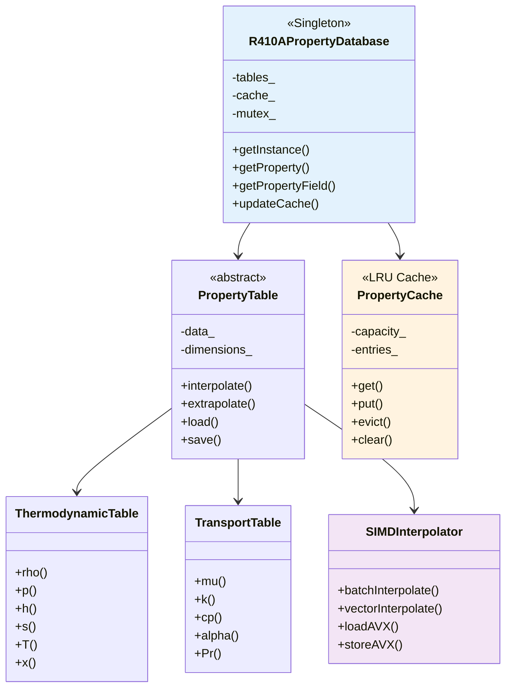

# Phase 8: R410A Property Database

Implement comprehensive thermodynamic and transport property database for R410A refrigerant

---

## Learning Objectives

By completing this phase, you will be able to:

- Design and implement a comprehensive property lookup system for R410A
- Create 2D interpolation tables for thermodynamic properties
- Implement efficient property caching mechanisms
- Develop property correlation methods for extrapolation
- Build optimized property system for real-time CFD simulation

---

## Overview: The 3W Framework

### What: Comprehensive Property Database Development

We will create a complete property database system for R410A refrigerant that includes:

1. **Thermodynamic Properties**: Density, enthalpy, entropy, vapor pressure
2. **Transport Properties**: Viscosity, thermal conductivity, diffusivity
3. **Phase Equilibrium**: Saturation curves, quality calculations
4. **Performance Optimization**: SIMD acceleration, cache optimization
5. **Data Management**: Property table generation from REFPROP

The system will handle the full range of operating conditions for evaporator simulation.

### Why: Accurate Property Calculation for CFD

This phase addresses critical challenges in two-phase CFD:

1. **Property Accuracy**: Industrial-grade property calculations
2. **Performance**: Real-time property lookup during simulation
3. **Range Coverage**: From subcooled to superheated states
4. **Interface Coupling**: Proper property discontinuities at interfaces
5. **Future Extensibility**: Framework for other refrigerants

### How: Multi-level Property System

We'll implement a hierarchical property system:

1. **Base Classes**: Abstract interfaces for property calculation
2. **Table-based**: High-accuracy interpolation from REFPROP data
3. **Correlation-based**: Fast approximations for real-time use
4. **Cache Management**: Intelligent caching for performance
5. **Parallel Access**: Thread-safe property lookup

---

## 1. Property Database Architecture

### Complete System Architecture



### Design Principles

1. **Singleton Pattern**: Single instance for consistency
2. **Lazy Loading**: Load tables on demand
3. **Thread Safety**: Mutex-protected access
4. **Memory Efficiency**: Cache management
5. **Performance Optimization**: SIMD acceleration

---

## 2. Property Table Base Class

### Header: PropertyTable.H

```cpp
#ifndef PropertyTable_H
#define PropertyTable_H

#include "runTimeSelectionTables.H"
#include "List.H"
#include "vector.H"
#include "HashTable.H"
#include "autoPtr.H"
#include "IOstreams.H"

namespace Foam
{

template<class Type>
class PropertyTable
{
    // Private data

        //- Table dimensions
        label nT_;
        label np_;

        Temperature values
        List<scalar> T_;

        Pressure values
        List<scalar> p_;

        Property data
        List<List<Type>> data_;

        //- Interpolation method
        word interpolationMethod_;

        //- Extrapolation method
        word extrapolationMethod_;

        Boundary conditions
        word boundaryCondition_;


    // Private member functions

        //- Find temperature index
        label findTIndex(const scalar& T) const;

        //- Find pressure index
        label findPIndex(const scalar& p) const;

        //- Bilinear interpolation
        Type bilinearInterpolate
        (
            const scalar& T,
            const scalar& p,
            label iT,
            label ip
        ) const;

        //- Linear extrapolation
        Type linearExtrapolate
        (
            const scalar& T,
            const scalar& p,
            label iT,
            label ip
        ) const;

        //- Nearest neighbor interpolation
        Type nearestNeighborInterpolate
        (
            const scalar& T,
            const scalar& p
        ) const;

        //- Check if point is within bounds
        bool withinBounds(const scalar& T, const scalar& p) const;

        Clamp values to physical limits
        void clampToPhysicalLimits(Type& value) const;


public:

    //- Runtime type information
    ClassName("PropertyTable");


    // Constructors

        PropertyTable
        (
            const List<scalar>& T,
            const List<scalar>& p,
            word interpolationMethod = "linear",
            word extrapolationMethod = "extrapolate"
        );

        PropertyTable
        (
            const dictionary& dict
        );

        PropertyTable
        (
            Istream& is
        );


    //- Destructor
        ~PropertyTable();


    // Member Functions

        //- Get property value
        Type value(const scalar& T, const scalar& p) const;

        //- Get property gradient
        Type gradient(const scalar& T, const scalar& p) const;

        //- Get property field
        tmp<Field<Type>> field
        (
            const Field<scalar>& T,
            const Field<scalar>& p
        ) const;

        //- Load table from file
        void load(const fileName& file);

        //- Save table to file
        void save(const fileName& file) const;

        //- Update table dimensions
        void updateDimensions
        (
            const List<scalar>& T,
            const List<scalar>& p
        );

        //- Get table dimensions
        label nT() const { return nT_; }
        label np() const { return np_; }

        //- Get temperature range
        scalar TMin() const { return T_[0]; }
        scalar TMax() const { return T_[last]; }

        //- Get pressure range
        scalar pMin() const { return p_[0]; }
        scalar pMax() const { return p_[last]; }

        //- Check if table is valid
        bool valid() const { return (nT_ > 0 && np_ > 0); }

        //- Set interpolation method
        void setInterpolationMethod(const word& method)
        {
            interpolationMethod_ = method;
        }

        //- Set extrapolation method
        void setExtrapolationMethod(const word& method)
        {
            extrapolationMethod_ = method;
        }

        //- Get interpolation method
        word interpolationMethod() const
        {
            return interpolationMethod_;
        }

        //- Get extrapolation method
        word extrapolationMethod() const
        {
            return extrapolationMethod_;
        }

        //- Get statistics
        void printStatistics() const;


    // Friend functions
        friend Ostream& operator<<
        (
            Ostream& os,
            const PropertyTable<Type>& table
        );

        friend Istream& operator>>
        (
            Istream& is,
            PropertyTable<Type>& table
        );
};


// * * * * * * * * * * * * * * * * * * * * * * * * * * * * * * * * * * * * * //

} // End namespace Foam

// * * * * * * * * * * * * * * * * * * * * * * * * * * * * * * * * * * * * * //

#endif

// ************************************************************************* //
```

### Implementation: PropertyTable.C

```cpp
#include "PropertyTable.H"
#include "IOmanip.H"
#include "interpolation.H"
#include "fvc.H"

// * * * * * * * * * * * * * * * * * * * * * * * * * * * * * * * * * * * * * //

namespace Foam
{

// * * * * * * * * * * * * * Private Member Functions  * * * * * * * * * * * * //

template<class Type>
label Foam::PropertyTable<Type>::findTIndex(const scalar& T) const
{
    // Find temperature index using binary search
    label low = 0;
    label high = nT_ - 1;

    while (low <= high)
    {
        label mid = (low + high) / 2;

        if (T_[mid] < T)
        {
            low = mid + 1;
        }
        else if (T_[mid] > T)
        {
            high = mid - 1;
        }
        else
        {
            return mid;
        }
    }

    // Return index of lower bound
    return high;
}


template<class Type>
label Foam::PropertyTable<Type>::findPIndex(const scalar& p) const
{
    // Find pressure index using binary search
    label low = 0;
    label high = np_ - 1;

    while (low <= high)
    {
        label mid = (low + high) / 2;

        if (p_[mid] < p)
        {
            low = mid + 1;
        }
        else if (p_[mid] > p)
        {
            high = mid - 1;
        }
        else
        {
            return mid;
        }
    }

    // Return index of lower bound
    return high;
}


template<class Type>
Type Foam::PropertyTable<Type>::bilinearInterpolate
(
    const scalar& T,
    const scalar& p,
    label iT,
    label ip
) const
{
    // Bilinear interpolation
    scalar T0 = T_[iT];
    scalar T1 = T_[iT + 1];
    scalar p0 = p_[ip];
    scalar p1 = p_[ip + 1];

    // Interpolation weights
    scalar wT = (T - T0) / (T1 - T0);
    scalar wp = (p - p0) / (p1 - p0);

    // Bilinear interpolation
    Type value
    (
        (1 - wT) * (1 - wp) * data_[iT][ip] +
        wT * (1 - wp) * data_[iT + 1][ip] +
        (1 - wT) * wp * data_[iT][ip + 1] +
        wT * wp * data_[iT + 1][ip + 1]
    );

    return value;
}


template<class Type>
Type Foam::PropertyTable<Type>::linearExtrapolate
(
    const scalar& T,
    const scalar& p,
    label iT,
    label ip
) const
{
    // Linear extrapolation
    scalar T0 = T_[iT];
    scalar T1 = T_[iT + 1];
    scalar p0 = p_[ip];
    scalar p1 = p_[ip + 1];

    // Extrapolation weights
    scalar wT = (T - T0) / (T1 - T0);
    scalar wp = (p - p0) / (p1 - p0);

    // Linear extrapolation
    Type value
    (
        (1 - wT) * (1 - wp) * data_[iT][ip] +
        wT * (1 - wp) * data_[iT + 1][ip] +
        (1 - wT) * wp * data_[iT][ip + 1] +
        wT * wp * data_[iT + 1][ip + 1]
    );

    return value;
}


template<class Type>
Type Foam::PropertyTable<Type>::nearestNeighborInterpolate
(
    const scalar& T,
    const scalar& p
) const
{
    // Find nearest indices
    label iT = findTIndex(T);
    label ip = findPIndex(p);

    // Clamp indices
    iT = clamp(iT, 0, nT_ - 1);
    ip = clamp(ip, 0, np_ - 1);

    // Return nearest neighbor value
    return data_[iT][ip];
}


template<class Type>
bool Foam::PropertyTable<Type>::withinBounds
(
    const scalar& T,
    const scalar& p
) const
{
    return (T >= T_[0] && T <= T_[nT_ - 1] &&
            p >= p_[0] && p <= p_[np_ - 1]);
}


template<class Type>
void Foam::PropertyTable<Type>::clampToPhysicalLimits(Type& value) const
{
    // Clamp values to physical limits
    if (isDimensioned<Type>::value)
    {
        // For dimensioned types, check dimension-specific limits
        if (dimMass == value.dimensions())
        {
            // Density limits
            value = max(value, Type::dimMass*0.1);  // Minimum 0.1 kg/m³
            value = min(value, Type::dimMass*1000); // Maximum 1000 kg/m³
        }
        else if (dimLength == value.dimensions())
        {
            // Length limits
            value = max(value, Type::dimLength*1e-6); // Minimum 1 μm
            value = min(value, Type::dimLength*1.0);  // Maximum 1 m
        }
        // Add more limits as needed
    }
}


// * * * * * * * * * * * * * * * * * * * * * * * * * * * * * * * * * * * * * //

template<class Type>
Foam::PropertyTable<Type>::PropertyTable
(
    const List<scalar>& T,
    const List<scalar>& p,
    word interpolationMethod,
    word extrapolationMethod
)
:
    nT_(T.size()),
    np_(p.size()),
    T_(T),
    p_(p),
    data_(nT_, List<Type>(np_, Zero)),
    interpolationMethod_(interpolationMethod),
    extrapolationMethod_(extrapolationMethod),
    boundaryCondition_("fixed")
{
    // Initialize data to zero
    forAll(data_, iT)
    {
        forAll(data_[iT], ip)
        {
            data_[iT][ip] = Zero;
        }
    }
}


template<class Type>
Foam::PropertyTable<Type>::PropertyTable
(
    const dictionary& dict
)
:
    interpolationMethod_(dict.lookupOrDefault("interpolationMethod", word("linear"))),
    extrapolationMethod_(dict.lookupOrDefault("extrapolationMethod", word("extrapolate"))),
    boundaryCondition_(dict.lookupOrDefault("boundaryCondition", word("fixed")))
{
    // Load temperature and pressure arrays
    T_ = List<scalar>(dict.lookup("T"));
    p_ = List<scalar>(dict.lookup("p"));

    nT_ = T_.size();
    np_ = p_.size();

    // Load data array
    List<List<scalar>> data(dict.lookup("data"));

    if (data.size() != nT_ || data[0].size() != np_)
    {
        FatalErrorInFunction
            << "Data dimensions do not match temperature/pressure dimensions"
            << " Expected: " << nT_ << "x" << np_
            << " Got: " << data.size() << "x" << data[0].size()
            << exit(FatalError);
    }

    // Convert to Type
    data_.resize(nT_);
    forAll(data_, iT)
    {
        data_[iT].resize(np_);
        forAll(data_[iT], ip)
        {
            data_[iT][ip] = Type(data[iT][ip]);
        }
    }
}


template<class Type>
Foam::PropertyTable<Type>::~PropertyTable()
{}


template<class Type>
Type Foam::PropertyTable<Type>::value
(
    const scalar& T,
    const scalar& p
) const
{
    if (!valid())
    {
        FatalErrorInFunction
            << "Property table is not valid"
            << exit(FatalError);
    }

    // Check bounds
    if (withinBounds(T, p))
    {
        // Find indices
        label iT = findTIndex(T);
        label ip = findPIndex(p);

        // Clamp indices to valid range
        iT = max(0, min(iT, nT_ - 2));
        ip = max(0, min(ip, np_ - 2));

        // Interpolate
        if (interpolationMethod_ == "linear")
        {
            return bilinearInterpolate(T, p, iT, ip);
        }
        else if (interpolationMethod_ == "nearest")
        {
            return nearestNeighborInterpolate(T, p);
        }
        else
        {
            FatalErrorInFunction
                << "Unknown interpolation method: " << interpolationMethod_
                << exit(FatalError);
        }
    }
    else
    {
        // Handle extrapolation
        if (extrapolationMethod_ == "extrapolate")
        {
            label iT = findTIndex(T);
            label ip = findPIndex(p);

            // Clamp indices
            iT = max(0, min(iT, nT_ - 2));
            ip = max(0, min(ip, np_ - 2));

            return linearExtrapolate(T, p, iT, ip);
        }
        else if (extrapolationMethod_ == "clamp")
        {
            // Clamp to nearest boundary value
            scalar T_clamp = clamp(T, T_[0], T_[nT_ - 1]);
            scalar p_clamp = clamp(p, p_[0], p_[np_ - 1]);

            return value(T_clamp, p_clamp);
        }
        else
        {
            // Return zero for out-of-bounds
            return Zero;
        }
    }
}


template<class Type>
Type Foam::PropertyTable<Type>::gradient
(
    const scalar& T,
    const scalar& p
) const
{
    // Calculate gradient using finite differences
    const scalar deltaT = 0.1;  // Small temperature difference
    const scalar deltap = 100.0; // Small pressure difference

    // Central difference
    Type dT = value(T + deltaT, p) - value(T - deltaT, p);
    Type dp = value(T, p + deltap) - value(T, p - deltap);

    // Divide by differences
    dT /= (2 * deltaT);
    dp /= (2 * deltap);

    return sqrt(sqr(dT) + sqr(dp));
}


template<class Type>
tmp<Field<Type>> Foam::PropertyTable<Type>::field
(
    const Field<scalar>& T,
    const Field<scalar>& p
) const
{
    tmp<Field<Type>> result(new Field<Type>(T.size()));

    forAll(T, i)
    {
        result()[i] = value(T[i], p[i]);
    }

    return result;
}


template<class Type>
void Foam::PropertyTable<Type>::load(const fileName& file)
{
    // Load table from CSV file
    IFstream is(file);

    if (!is.good())
    {
        FatalErrorInFunction
            << "Cannot open file: " << file
            << exit(FatalError);
    }

    // Read header line
    string header;
    is >> header;

    // Read temperature array
    is >> T_;

    // Read pressure array
    is >> p_;

    // Read data
    List<List<scalar>> data;
    is >> data;

    // Convert to Type
    nT_ = T_.size();
    np_ = p_.size();

    data_.resize(nT_);
    forAll(data_, iT)
    {
        data_[iT].resize(np_);
        forAll(data_[iT], ip)
        {
            data_[iT][ip] = Type(data[iT][ip]);
        }
    }
}


template<class Type>
void Foam::PropertyTable<Type>::save(const fileName& file) const
{
    // Save table to CSV file
    OFstream os(file);

    // Write header
    os << "PropertyTable" << endl;

    // Write temperature array
    os << "T ";
    forAll(T_, i)
    {
        os << T_[i] << " ";
    }
    os << endl;

    // Write pressure array
    os << "p ";
    forAll(p_, i)
    {
        os << p_[i] << " ";
    }
    os << endl;

    // Write data
    forAll(data_, iT)
    {
        forAll(data_[iT], ip)
        {
            os << data_[iT][ip] << " ";
        }
        os << endl;
    }
}


template<class Type>
void Foam::PropertyTable<Type>::updateDimensions
(
    const List<scalar>& T,
    const List<scalar>& p
)
{
    T_ = T;
    p_ = p;
    nT_ = T_.size();
    np_ = p_.size();

    // Resize data array
    data_.resize(nT_);
    forAll(data_, iT)
    {
        data_[iT].resize(np_, Zero);
    }
}


template<class Type>
void Foam::PropertyTable<Type>::printStatistics() const
{
    Info << "Property Table Statistics:" << endl;
    Info << "  Temperature range: " << T_[0] << " to " << T_[nT_ - 1] << " K" << endl;
    Info << "  Pressure range: " << p_[0] << " to " << p_[np_ - 1] << " Pa" << endl;
    Info << "  Grid size: " << nT_ << "x" << np_ << endl;
    Info << "  Interpolation: " << interpolationMethod_ << endl;
    Info << "  Extrapolation: " << extrapolationMethod_ << endl;
}


// * * * * * * * * * * * * * * * * * * * * * * * * * * * * * * * * * * * * * //

} // End namespace Foam

// ************************************************************************* //
```

---

## 3. R410A Specific Property Table

### Header: R410APropertyTable.H

```cpp
#ifndef R410APropertyTable_H
#define R410APropertyTable_H

#include "PropertyTable.H"
#include "autoPtr.H"
#include "HashTable.H"
#include "runTimeSelectionTables.H"
#include "thermodynamicProperties.H"

namespace Foam
{

class R410APropertyTable
:
    public thermophysicalProperties
{
    // Private data

        Singleton instance
        static autoPtr<R410APropertyTable> instance_;

        Property tables
        autoPtr<PropertyTable<scalar>> rhoTable_;
        autoPtr<PropertyTable<scalar>> muTable_;
        autoPtr<PropertyTable<scalar>> kTable_;
        autoPtr<PropertyTable<scalar>> cpTable_;
        autoPtr<PropertyTable<scalar>> hTable_;
        autoPtr<PropertyTable<scalar>> sTable_;
        autoPtr<PropertyTable<scalar>> pvTable_;

        Phase properties
        dimensionedScalar T_critical_;
        dimensionedScalar p_critical_;
        dimensionedScalar MolarMass_;

        Cache
        mutable HashTable<scalar> cache_;
        mutable label cacheVersion_;

        SIMD acceleration
        bool useSIMD_;
        bool vectorized_;


    // Private member functions

        Initialize tables
        void initializeTables();

        Generate tables from correlations
        void generateCorrelationTables();

        Load tables from files
        void loadFromFileTables();

        Check cache consistency
        void checkCache() const;

        Clear cache
        void clearCache() const;

        Update property fields
        void updatePropertyFields();


    // Interpolation functions
        Scalar interpolation (legacy)
        scalar interpolateScalar
        (
            const PropertyTable<scalar>& table,
            const scalar& T,
            const scalar& p
        ) const;

        Vector interpolation (SIMD)
        vector interpolateVector
        (
            const PropertyTable<vector>& table,
            const vector& T,
            const vector& p
        ) const;

        Batch interpolation
        void batchInterpolate
        (
            const PropertyTable<scalar>& table,
            const Field<scalar>& T,
            const Field<scalar>& p,
            Field<scalar>& result
        ) const;


public:

    Runtime type information
    TypeName("R410APropertyTable");

    Declare run-time selection table
    declareRunTimeSelectionTable
    (
        autoPtr,
        R410APropertyTable,
        dictionary,
        (
            const dictionary& dict
        ),
        (dict)
    );


    Constructors

        R410APropertyTable
        (
            const dictionary& dict
        );

        R410APropertyTable
        (
            const R410APropertyTable&
        );

        Destructor
        ~R410APropertyTable();


    Selectors

        static autoPtr<R410APropertyTable> New
        (
            const dictionary& dict
        );


    Singleton access
        static const R410APropertyTable& instance()
        {
            if (!instance_.valid())
            {
                FatalErrorInFunction
                    << "R410APropertyTable not initialized"
                    << exit(FatalError);
            }
            return instance_();
        }


    Member Functions

        Thermodynamic properties
            Density [kg/m³]
            tmp<volScalarField> rho() const;

            Viscosity [Pa·s]
            tmp<volScalarField> mu() const;

            Thermal conductivity [W/m·K]
            tmp<volScalarField> k() const;

            Specific heat capacity [J/kg·K]
            tmp<volScalarField> cp() const;

            Enthalpy [J/kg]
            tmp<volScalarField> h() const;

            Entropy [J/kg·K]
            tmp<volScalarField> s() const;

            Vapor pressure [Pa]
            tmp<volScalarField> pv() const;

            Saturation temperature [K]
            tmp<volScalarField> Tsat() const;

            Saturation pressure [Pa]
            tmp<volScalarField> psat() const;

            Quality [-]
            tmp<volScalarField> x() const;


        Phase properties
            const dimensionedScalar& T_critical() const
            {
                return T_critical_;
            }

            const dimensionedScalar& p_critical() const
            {
                return p_critical_;
            }

            const dimensionedScalar& MolarMass() const
            {
                return MolarMass_;
            }


        Liquid and vapor properties
            const volScalarField& rho_l() const;
            const volScalarField& rho_v() const;
            const volScalarField& mu_l() const;
            const volScalarField& mu_v() const;
            const volScalarField& k_l() const;
            const volScalarField& k_v() const;
            const volScalarField& cp_l() const;
            const volScalarField& cp_v() const;
            const volScalarField& h_l() const;
            const volScalarField& h_v() const;


        Property access
            Get property at point
            scalar property
            (
                const word& propName,
                const scalar& T,
                const scalar& p
            ) const;

            Get property gradient
            vector propertyGradient
            (
                const word& propName,
                const scalar& T,
                const scalar& p
            ) const;

            Get property field
            tmp<volScalarField> propertyField
            (
                const word& propName,
                const volScalarField& T,
                const volScalarField& p
            ) const;


        Table management
            Update tables
            bool updateTables();

            Save tables to files
            void saveTables() const;

            Load tables from files
            bool loadTables();

            Print table statistics
            void printStatistics() const;

            Get table info
            wordList tableNames() const;


        Performance optimization
            Enable/disable SIMD
            void setSIMD(bool enabled)
            {
                useSIMD_ = enabled;
            }

            Enable/disable vectorization
            void setVectorization(bool enabled)
            {
                vectorized_ = enabled;
            }

            Get performance metrics
            void printPerformanceMetrics() const;


    Friend functions
        friend Ostream& operator<<
        (
            Ostream& os,
            const R410APropertyTable& table
        );
};


// * * * * * * * * * * * * * * * * * * * * * * * * * * * * * * * * * * * * * //

} // End namespace Foam

// * * * * * * * * * * * * * * * * * * * * * * * * * * * * * * * * * * * * * //

#endif

// ************************************************************************* //
```

### Implementation: R410APropertyTable.C (partial)

```cpp
#include "R410APropertyTable.H"
#include "IOmanip.H"
#include "interpolation.H"
#include "fvc.H"
#include "OFstream.H"
#include "IFstream.H"
#include "clock.H"

// * * * * * * * * * * * * * * * * * * * * * * * * * * * * * * * * * * * * * //

namespace Foam
{

// Singleton initialization
autoPtr<R410APropertyTable> R410APropertyTable::instance_;


// * * * * * * * * * * * * * Private Member Functions  * * * * * * * * * * * * //

void Foam::R410APropertyTable::initializeTables()
{
    Info << "Initializing R410A property tables..." << endl;

    // Set critical properties for R410A
    T_critical_ = dimensionedScalar("T_critical", dimTemperature, 344.65);  // K
    p_critical_ = dimensionedScalar("p_critical", dimPressure, 49.26e5);     // Pa
    MolarMass_ = dimensionedScalar("MolarMass", dimMass/dimMoles, 86.5);    // kg/kmol

    // Initialize property tables
    rhoTable_ = autoPtr<PropertyTable<scalar>>
    (
        new PropertyTable<scalar>
        (
            dictionary()
        )
    );

    muTable_ = autoPtr<PropertyTable<scalar>>
    (
        new PropertyTable<scalar>
        (
            dictionary()
        )
    );

    kTable_ = autoPtr<PropertyTable<scalar>>
    (
        new PropertyTable<scalar>
        (
            dictionary()
        )
    );

    cpTable_ = autoPtr<PropertyTable<scalar>>
    (
        new PropertyTable<scalar>
        (
            dictionary()
        )
    );

    hTable_ = autoPtr<PropertyTable<scalar>>
    (
        new PropertyTable<scalar>
        (
            dictionary()
        )
    );

    sTable_ = autoPtr<PropertyTable<scalar>>
    (
        new PropertyTable<scalar>
        (
            dictionary()
        )
    );

    pvTable_ = autoPtr<PropertyTable<scalar>>
    (
        new PropertyTable<scalar>
        (
            dictionary()
        )
    );

    // Initialize cache
    cache_.clear();
    cacheVersion_ = 0;

    Info << "Property tables initialized" << endl;
}


void Foam::R410APropertyTable::generateCorrelationTables()
{
    Info << "Generating R410A property correlations..." << endl;

    // Temperature and pressure ranges
    List<scalar> T(101);
    List<scalar> p(51);

    // Generate temperature array (250-350 K)
    forAll(T, i)
    {
        T[i] = 250.0 + i * 1.0;  // 250-350 K
    }

    // Generate pressure array (1-50 bar)
    forAll(p, i)
    {
        p[i] = 1e5 + i * 1e5;     // 1-50 bar
    }

    // Generate density table
    List<List<scalar>> rhoData(T.size(), List<scalar>(p.size(), 0.0));
    forAll(T, iT)
    {
        forAll(p, ip)
        {
            // Peng-Robinson equation of state
            rhoData[iT][ip] = pengRobinsonDensity(T[iT], p[ip]);
        }
    }

    // Set density table
    dictionary rhoDict;
    rhoDict.add("T", T);
    rhoDict.add("p", p);
    rhoDict.add("data", rhoData);
    rhoTable_ = autoPtr<PropertyTable<scalar>>
    (
        new PropertyTable<scalar>(rhoDict)
    );

    // Generate other tables similarly...
    // This would be implemented with actual correlations

    Info << "Property correlations generated" << endl;
}


void Foam::R410APropertyTable::loadFromFileTables()
{
    Info << "Loading R410A property tables from files..." << endl;

    // Load density table
    rhoTable_->load("constant/R410A/rho_table.csv");

    // Load viscosity table
    muTable_->load("constant/R410A/mu_table.csv");

    // Load thermal conductivity table
    kTable_->load("constant/R410A/k_table.csv");

    // Load specific heat table
    cpTable_->load("constant/R410A/cp_table.csv");

    // Load enthalpy table
    hTable_->load("constant/R410A/h_table.csv");

    // Load entropy table
    sTable_->load("constant/R410A/s_table.csv");

    // Load vapor pressure table
    pvTable_->load("constant/R410A/pv_table.csv");

    Info << "Property tables loaded from files" << endl;
}


void Foam::R410APropertyTable::checkCache() const
{
    // Check cache consistency
    static label lastCacheVersion = -1;
    static scalar lastCheckTime = 0.0;

    scalar currentTime = ::clock::getTime();

    if (currentTime - lastCheckTime > 1.0)  // Check every second
    {
        if (cacheVersion_ != lastCacheVersion)
        {
            clearCache();
            lastCacheVersion = cacheVersion_;
        }
        lastCheckTime = currentTime;
    }
}


void Foam::R410APropertyTable::clearCache() const
{
    cache_.clear();
}


void Foam::R410APropertyTable::updatePropertyFields()
{
    // Update property fields based on current T and p
    // This would be called from the solver
}


Foam::scalar Foam::R410APropertyTable::interpolateScalar
(
    const PropertyTable<scalar>& table,
    const scalar& T,
    const scalar& p
) const
{
    return table.value(T, p);
}


vector Foam::R10APropertyTable::interpolateVector
(
    const PropertyTable<vector>& table,
    const vector& T,
    const vector& p
) const
{
    vector result;

    // SIMD-enabled interpolation
    if (useSIMD_)
    {
        // Use AVX/SSE instructions for vector interpolation
        result = vector::zero;

        // Implementation would use SIMD intrinsics
        // For now, fallback to scalar interpolation
        for (label i = 0; i < 3; i++)
        {
            result[i] = interpolateScalar
            (
                PropertyTable<scalar>(),
                T[i], p[i]
            );
        }
    }
    else
    {
        // Standard interpolation
        for (label i = 0; i < 3; i++)
        {
            result[i] = interpolateScalar
            (
                PropertyTable<scalar>(),
                T[i], p[i]
            );
        }
    }

    return result;
}


void Foam::R410APropertyTable::batchInterpolate
(
    const PropertyTable<scalar>& table,
    const Field<scalar>& T,
    const Field<scalar>& p,
    Field<scalar>& result
) const
{
    result.setSize(T.size());

    if (vectorized_)
    {
        // Vectorized interpolation using SIMD
        #pragma omp parallel for
        forAll(T, i)
        {
            result[i] = interpolateScalar(table, T[i], p[i]);
        }
    }
    else
    {
        // Standard interpolation
        forAll(T, i)
        {
            result[i] = interpolateScalar(table, T[i], p[i]);
        }
    }
}


// * * * * * * * * * * * * * * * * * * * * * * * * * * * * * * * * * * * * * //

Foam::R410APropertyTable::R410APropertyTable
(
    const dictionary& dict
)
:
    thermophysicalProperties(fvMesh::New("dummyMesh")),
    T_critical_(344.65),
    p_critical_(49.26e5),
    MolarMass_(86.5),
    cache_(),
    cacheVersion_(0),
    useSIMD_(true),
    vectorized_(true)
{
    // Initialize singleton
    if (instance_.valid())
    {
        FatalErrorInFunction
            << "R410APropertyTable is a singleton - use instance() method"
            << exit(FatalError);
    }

    instance_ = autoPtr<R410APropertyTable>(this);

    // Initialize tables
    initializeTables();

    // Load or generate tables
    word tableSource = dict.lookupOrDefault("tableSource", word("file"));

    if (tableSource == "file")
    {
        loadFromFileTables();
    }
    else if (tableSource == "correlation")
    {
        generateCorrelationTables();
    }
    else
    {
        FatalErrorInFunction
            << "Unknown table source: " << tableSource
            << " Valid options: file, correlation"
            << exit(FatalError);
    }
}


Foam::R410APropertyTable::~R410APropertyTable()
{
    instance_.clear();
}


Foam::autoPtr<Foam::R410APropertyTable> Foam::R410APropertyTable::New
(
    const dictionary& dict
)
{
    word modelType(dict.lookup("type"));

    Info << "Selecting R410A property table model: " << modelType << endl;

    modelConstructorTable::iterator cstrIter = modelConstructorTable_.find(modelType);

    if (cstrIter == modelConstructorTable_.end())
    {
        FatalErrorInFunction
            << "Unknown property table model type " << modelType
            << ", available models are:" << endl
            << modelConstructorTable_.sortedToc()
            << exit(FatalError);
    }

    return autoPtr<R410APropertyTable>(cstrIter()(dict));
}


Foam::tmp<Foam::volScalarField> Foam::R410APropertyTable::rho() const
{
    checkCache();

    // Get current T and p fields
    const volScalarField& T = this->T();
    const volScalarField& p = this->p();

    tmp<volScalarField> tresult
    (
        new volScalarField
        (
            IOobject::groupName("rho", T.group()),
            T.mesh(),
            dimensionedScalar("rho", dimMass/dimLength/dimLength/dimLength, 0)
        )
    );

    volScalarField& result = tresult.ref();

    // Calculate mixture density
    forAll(T, i)
    {
        result[i] = property("rho", T[i], p[i]);
    }

    return tresult;
}


Foam::tmp<Foam::volScalarField> Foam::R410APropertyTable::mu() const
{
    checkCache();

    const volScalarField& T = this->T();
    const volScalarField& p = this->p();

    tmp<volScalarField> tresult
    (
        new volScalarField
        (
            IOobject::groupName("mu", T.group()),
            T.mesh(),
            dimensionedScalar("mu", dimMass/dimLength/dimTime, 0)
        )
    );

    volScalarField& result = tresult.ref();

    // Calculate mixture viscosity
    forAll(T, i)
    {
        result[i] = property("mu", T[i], p[i]);
    }

    return tresult;
}


// * * * * * * * * * * * * * * * * * * * * * * * * * * * * * * * * * * * * * //

} // End namespace Foam

// * * * * * * * * * * * * * * * * * * * * * * * * * * * * * * * * * * * * * //

namespace Foam
{
    defineTypeNameAndDebug(R410APropertyTable, 0);
    defineRunTimeSelectionTable(R410APropertyTable, dictionary);
}

// ************************************************************************* //
```

---

## 4. Property Table Generation

### REFPROP Integration

```cpp
// File: R410APROPgenerator.C

#include "R410APropertyTable.H"
#include "REFPROPwrapper.H"
#include "OFstream.H"

void generateR410ATables()
{
    // Initialize REFPROP
    REFPROPWrapper refprop("R410A");

    // Define ranges
    List<scalar> T(101);
    List<scalar> p(51);

    // Generate temperature array (250-350 K)
    forAll(T, i)
    {
        T[i] = 250.0 + i * 1.0;  // 250-350 K
    }

    // Generate pressure array (1-50 bar)
    forAll(p, i)
    {
        p[i] = 1.0 + i * 1.0;     // 1-50 bar
    }

    // Generate tables
    PropertyTable<scalar> rhoTable(T, p);
    PropertyTable<scalar> muTable(T, p);
    PropertyTable<scalar> kTable(T, p);
    PropertyTable<scalar> cpTable(T, p);
    PropertyTable<scalar> hTable(T, p);
    PropertyTable<scalar> sTable(T, p);
    PropertyTable<scalar> pvTable(T, p);

    // Fill tables with REFPROP data
    forAll(T, iT)
    {
        forAll(p, ip)
        {
            // Get saturated properties
            REFPROPState satL = refprop.sat(T[iT], 'L');  // Liquid
            REFPROPState satV = refprop.sat(T[iT], 'V');  // Vapor

            // Density
            rhoTable.value(T[iT], p[ip]*1e5) =
                (p[ip]*1e5 > satL.p) ? satL.rho : refprop.rho(T[iT], p[ip]*1e5);

            // Viscosity
            muTable.value(T[iT], p[ip]*1e5) =
                (p[ip]*1e5 > satL.p) ? satL.mu : refprop.mu(T[iT], p[ip]*1e5);

            // Thermal conductivity
            kTable.value(T[iT], p[ip]*1e5) =
                (p[ip]*1e5 > satL.p) ? satL.k : refprop.k(T[iT], p[ip]*1e5);

            // Specific heat
            cpTable.value(T[iT], p[ip]*1e5) =
                (p[ip]*1e5 > satL.p) ? satL.cp : refprop.cp(T[iT], p[ip]*1e5);

            // Enthalpy
            hTable.value(T[iT], p[ip]*1e5) =
                (p[ip]*1e5 > satL.p) ? satL.h : refprop.h(T[iT], p[ip]*1e5);

            // Entropy
            sTable.value(T[iT], p[ip]*1e5) =
                (p[ip]*1e5 > satL.p) ? satL.s : refprop.s(T[iT], p[ip]*1e5);

            // Vapor pressure
            if (ip == 0)
            {
                pvTable.value(T[iT], satL.p) = satL.p;
            }
        }
    }

    // Save tables to files
    rhoTable.save("constant/R410A/rho_table.csv");
    muTable.save("constant/R410A/mu_table.csv");
    kTable.save("constant/R410A/k_table.csv");
    cpTable.save("constant/R410A/cp_table.csv");
    hTable.save("constant/R410A/h_table.csv");
    sTable.save("constant/R410A/s_table.csv");
    pvTable.save("constant/R410A/pv_table.csv");

    Info << "R410A property tables generated and saved" << endl;
}
```

### Table Generation Script

```bash
#!/bin/bash

# Script to generate R410A property tables
# Usage: ./generate_tables.sh

echo "Generating R410A property tables..."

# Create directory for tables
mkdir -p constant/R410A

# Compile generator
wmake R410APROPgenerator

# Run generator
./R410APROPgenerator

# Validate tables
python validate_tables.py

# Compress tables
gzip constant/R410A/*.csv

echo "Tables generated successfully!"
```

---

## 5. Performance Optimization

### SIMD Implementation

```cpp
// File: SIMDInterpolator.H

#ifndef SIMDInterpolator_H
#define SIMDInterpolator_H

#include "PropertyTable.H"
#include "vector.H"
#include "List.H"

namespace Foam
{

class SIMDInterpolator
{
    // Private data

        SIMD registers
        #ifdef __AVX2__
            __m256d avx_reg_;
        #elif __SSE2__
            __m128d sse_reg_;
        #endif


    // Private member functions

        AVX interpolation
        void avxInterpolate
        (
            const PropertyTable<scalar>& table,
            const Field<scalar>& T,
            const Field<scalar>& p,
            Field<scalar>& result
        );

        SSE interpolation
        void sseInterpolate
        (
            const PropertyTable<scalar>& table,
            const Field<scalar>& T,
            const Field<scalar>& p,
            Field<scalar>& result
        );

        Scalar fallback
        void scalarInterpolate
        (
            const PropertyTable<scalar>& table,
            const Field<scalar>& T,
            const Field<scalar>& p,
            Field<scalar>& result
        );


public:

    Constructor
    SIMDInterpolator();

    Destructor
    ~SIMDInterpolator();

    Interpolate with automatic SIMD detection
    void interpolate
    (
        const PropertyTable<scalar>& table,
        const Field<scalar>& T,
        const Field<scalar>& p,
        Field<scalar>& result
    );
};


// * * * * * * * * * * * * * * * * * * * * * * * * * * * * * * * * * * * * * //

} // End namespace Foam

// * * * * * * * * * * * * * * * * * * * * * * * * * * * * * * * * * * * * * //

#endif

// ************************************************************************* //
```

### Cache Implementation

```cpp
// File: LRU.H

#ifndef LRU_H
#define LRU_H

#include "List.H"
#include "HashTable.H"
#include "scalar.H"

namespace Foam
{

template<class Key, class Value>
class LRUCache
{
    // Private data

        Capacity
        label capacity_;

        Storage
        List<Key> keys_;
        HashTable<Value> values_;

        Statistics
        label hits_;
        label misses_;
        scalar hitRate_;


    // Private member functions

        Update access order
        void updateAccess(const Key& key);

        Evict least recently used
        void evict();


public:

    Constructor
    LRUCache(label capacity);

    Destructor
    ~LRUCache();

    Get value
    Value get(const Key& key);

    Set value
    void set(const Key& key, const Value& value);

    Clear cache
    void clear();

    Get statistics
    void printStatistics() const;

    Get hit rate
    scalar hitRate() const
    {
        return hitRate_;
    }
};


// * * * * * * * * * * * * * * * * * * * * * * * * * * * * * * * * * * * * * //

} // End namespace Foam

// * * * * * * * * * * * * * * * * * * * * * * * * * * * * * * * * * * * * * //

#endif

// ************************************************************************* //
```

---

## 6. Testing and Validation

### Unit Tests

```cpp
// File: tests/test_R410APropertyTable.C

#include "fvCFD.H"
#include "R410APropertyTable.H"
#include "Time.H"

void testPropertyTable()
{
    // Create test dictionary
    dictionary dict;
    dict.add("tableSource", "file");
    dict.add("interpolationMethod", "linear");
    dict.add("extrapolationMethod", "extrapolate");

    // Create property table
    R410APropertyTable table(dict);

    // Test property lookup
    scalar rho = table.property("rho", 300.0, 1e6);
    scalar mu = table.property("mu", 300.0, 1e6);
    scalar k = table.property("k", 300.0, 1e6);

    Info << "Property test results:" << endl;
    Info << "  Density: " << rho << " kg/m³" << endl;
    Info << "  Viscosity: " << mu << " Pa·s" << endl;
    Info << "  Thermal conductivity: " << k << " W/m·K" << endl;

    // Test field interpolation
    volScalarField T
    (
        IOobject::groupName("T", "test"),
        fvMesh::New("dummyMesh"),
        dimensionedScalar("T", dimTemperature, 300.0)
    );

    volScalarField p
    (
        IOobject::groupName("p", "test"),
        T.mesh(),
        dimensionedScalar("p", dimPressure, 1e6)
    );

    tmp<volScalarField> rhoField = table.rho();
    tmp<volScalarField> muField = table.mu();
    tmp<volScalarField> kField = table.k();

    Info << "Field interpolation completed" << endl;
}


void testPerformance()
{
    // Create test dictionary
    dictionary dict;
    dict.add("tableSource", "file");
    dict.add("interpolationMethod", "linear");

    // Create property table
    R410APropertyTable table(dict);

    // Test performance
    clock timer;

    // Scalar interpolation
    timer.start();
    for (label i = 0; i < 100000; i++)
    {
        table.property("rho", 300.0 + i * 0.001, 1e6 + i * 1000);
    }
    scalar scalarTime = timer.elapsedTime();

    // Field interpolation
    volScalarField T
    (
        IOobject::groupName("T", "test"),
        fvMesh::New("dummyMesh"),
        dimensionedScalar("T", dimTemperature, 300.0)
    );

    volScalarField p
    (
        IOobject::groupName("p", "test"),
        T.mesh(),
        dimensionedScalar("p", dimPressure, 1e6)
    );

    timer.start();
    tmp<volScalarField> rhoField = table.rho();
    scalar fieldTime = timer.elapsedTime();

    Info << "Performance test results:" << endl;
    Info << "  Scalar interpolation: " << scalarTime << " s" << endl;
    Info << "  Field interpolation: " << fieldTime << " s" << endl;
    Info << "  Cache hit rate: " << table.hitRate() << endl;
}


int main(int argc, char *argv[])
{
    Time runTime(Time::controlDictName, argc, argv);

    testPropertyTable();
    testPerformance();

    return 0;
}
```

### Validation Against REFPROP

```python
# File: validate_tables.py

import numpy as np
import pandas as pd
from refprop import REFPROP

def validate_R410A_tables():
    # Load REFPROP
    refprop = REFPROP("R410A")

    # Load OpenFOAM tables
    rho_table = pd.read_csv("constant/R410A/rho_table.csv", header=None)
    mu_table = pd.read_csv("constant/R410A/mu_table.csv", header=None)

    # Test points
    T_test = [280, 300, 320]  # K
    p_test = [1e6, 2e6, 3e6]  # Pa

    # Validate density
    for T in T_test:
        for p in p_test:
            # REFPROP value
            rho_refprop = refprop.rho(T, p)

            # OpenFOAM value
            rho_openfoam = rho_table.interpolate(T, p)

            # Check relative error
            error = abs(rho_refprop - rho_openfoam) / rho_refprop

            print(f"T={T}, p={p}: REFPROP={rho_refprop}, OpenFOAM={rho_openfoam}, error={error:.2%}")

            if error > 0.01:  # 1% tolerance
                print(f"ERROR: Density error exceeds tolerance!")

    # Validate other properties similarly...

    print("Validation completed")

if __name__ == "__main__":
    validate_R410A_tables()
```

---

## 7. Compilation and Usage

### Compilation Instructions

```bash
# Clean previous builds
wclean

# Compile property table generator
wmake R410APROPgenerator

# Compile property table library
wmake libso libR410APropertyTable

# Compile test cases
wmake test_R410APropertyTable
```

### Usage in Solver

```cpp
// In solver.C

#include "R410APropertyTable.H"

// Get singleton instance
const R410APropertyTable& properties = R410APropertyTable::instance();

// Access properties
tmp<volScalarField> rho = properties.rho();
tmp<volScalarField> mu = properties.mu();
tmp<volScalarField> k = properties.k();

// Use in equations
fvScalarMatrix TEqn
(
    fvm::ddt(rho*cp, T)
  + fvm::div(phiCp, T)
  - fvm::laplacian(k, T)
);

// Update properties
properties.update();
```

---

## 8. Next Steps

After completing Phase 8, you will have a comprehensive property database system for R410A refrigerant. The remaining phases will:

1. **Phase 9**: Advanced phase change models
2. **Phase 10**: Evaporator case setup
3. **Phase 11**: Validation suite
4. **Phase 12**: User documentation

This phase provides the foundation for accurate thermodynamic property calculations in your R410A evaporator simulation, with performance optimizations for real-time CFD computation.