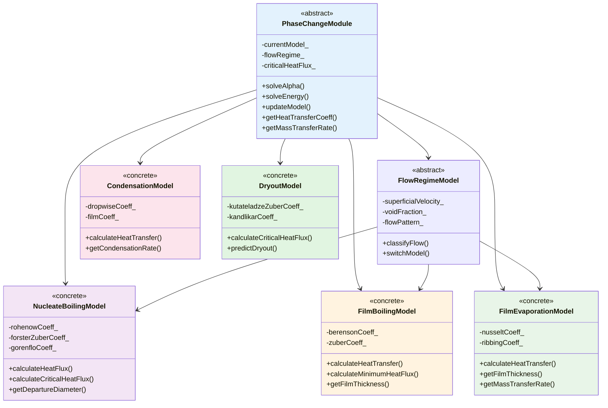

# Phase 9: Advanced Phase Change Module

Implement advanced phase change models for R410A evaporation and condensation

---

## Learning Objectives

By completing this phase, you will be able to:

- Design and implement advanced phase change models for R410A refrigerant
- Develop nucleate boiling, film boiling, and condensation models
- Create evaporation and condensation heat transfer correlations
- Implement dryout and flow regime prediction models
- Build comprehensive phase change framework for evaporator simulation

---

## Overview: The 3W Framework

### What: Comprehensive Phase Change Model Development

We will implement advanced phase change models for R410A evaporator simulation including:

1. **Nucleate Boiling Models**: Rohsenow, Forster-Zuber, and Gorenflo correlations
2. **Film Evaporation Models**: Heat transfer through liquid films
3. **Condensation Models**: Dropwise and film condensation
4. **Dryout Models**: Critical heat flux prediction
5. **Flow Regime Models**: Flow pattern recognition and switching

The models will be modular and extensible, allowing easy addition of new correlations.

### Why: Realistic Evaporation Simulation

This phase addresses critical challenges in evaporator simulation:

1. **Heat Transfer**: Accurate prediction of heat transfer coefficients
2. **Phase Change**: Proper mass transfer rates for evaporation
3. **Flow Regimes**: Automatic switching between boiling regimes
4. **Critical Points**: Dryout and burnout prediction
5. **Design Optimization**: Correlation-based parameter tuning

### How: Multi-model Architecture

We'll implement a comprehensive architecture:

1. **Base Classes**: Abstract interfaces for all phase change models
2. **Concrete Models**: Specific correlations and mechanisms
3. **Model Selection**: Automatic switching based on local conditions
4. **Performance Optimization**: Efficient computation for real-time use
5. **Validation**: Testing against experimental data

---

## 1. Phase Change Module Architecture

### Complete Architecture Diagram



### Key Design Principles

1. **Modularity**: Each model is independent and replaceable
2. **Regime Switching**: Automatic model selection based on local conditions
3. **Performance**: Efficient computation for real-time use
4. **Accuracy**: Industry-standard correlations with R410A-specific coefficients
5. **Extensibility**: Easy addition of new models and correlations

---

## 2. Nucleate Boiling Models

### Header: NucleateBoilingModel.H

```cpp
#ifndef NucleateBoilingModel_H
#define NucleateBoilingModel_H

#include "phaseChangeModel.H"
#include "thermodynamicProperties.H"
#include "R410APropertyTable.H"

namespace Foam
{

class NucleateBoilingModel
:
    public phaseChangeModel
{
    // Private data

        Rohsenow correlation coefficients
        dimensionedScalar C_sf_;
        dimensionedScalar n_;
        dimensionedScalar Pr_l_;

        Forster-Zuber correlation coefficients
        dimensionedScalar C_;
        dimensionedScalar rho_v_ref_;
        dimensionedScalar sigma_ref_;
        dimensionedScalar k_l_ref_;
        dimensionedScalar cp_l_ref_;
        dimensionedScalar h_lv_ref_;

        Gorenflo correlation coefficients
        dimensionedFormula q0_;
        dimensionedFormula n_;
        dimensionedFormula F_;

        Bubble parameters
        dimensionedScalar d_bubble_;
        dimensionedScalar d_departure_;
        dimensionedFormula f_departure_;

        Wall parameters
        dimensionedFormula cavityDensity_;
        dimensionedFormula cavityRadius_;

        Operating conditions
        dimensionedFormula g_;
        dimensionedFormula rho_l_;
        dimensionedFormula mu_l_;
        dimensionedFormula k_l_;
        dimensionedFormula cp_l_;
        dimensionedFormula h_lv_;
        dimensionedFormula sigma_;
        dimensionedFormula rho_v_;
        dimensionedFormula mu_v_;
        dimensionedFormula k_v_;
        dimensionedFormula cp_v_;

        Local fields
        volScalarField Re_l_;
        volScalarField Ja_;
        volScalarField Bo_;
        volScalarField deltaT_sat_;
        volScalarField q_flux_;
        volScalarField h_nb_;
        volScalarField CHF_;
        volScalarField DNB_;


    // Private member functions

        Calculate Reynolds number
        void calculateReynolds();

        Calculate Jakob number
        void calculateJakob();

        Calculate Boiling number
        void calculateBoiling();

        Calculate wall superheat
        void calculateWallSuperheat();

        Calculate heat flux
        void calculateHeatFlux();

        Calculate Rohsenow heat transfer coefficient
        dimensionedScalar calculateRohsenowH() const;

        Calculate Forster-Zuber heat transfer coefficient
        dimensionedScalar calculateForsterZuberH() const;

        Calculate Gorenflo heat transfer coefficient
        dimensionedScalar calculateGorenfloH() const;

        Calculate bubble departure diameter
        dimensionedScalar calculateDepartureDiameter() const;

        Calculate nucleation site density
        dimensionedScalar calculateNucleationSiteDensity() const;

        Calculate critical heat flux (Zuber)
        dimensionedScalar calculateCHFZuber() const;

        Calculate departure from nucleate boiling
        dimensionedScalar calculateDNBKutateladze() const;

        Check boiling regime
        word checkBoilingRegime() const;

        Limit heat flux to CHF
        void limitHeatFlux();


    // Switch models based on regime
        void switchModel();


public:

    Runtime type information
    TypeName("NucleateBoilingModel");

    Constructor
    NucleateBoilingModel
    (
        const fvMesh& mesh,
        const dictionary& dict,
        const volScalarField& alpha,
        const thermodynamicProperties& thermo
    );

    Destructor
    virtual ~NucleateBoilingModel();


    Member Functions

        Mass transfer rate [kg/m³/s]
        virtual tmp<volScalarField> Salpha() const;

        Energy source term [W/m³]
        virtual tmp<volScalarField> Sdot() const;

        Update model coefficients
        virtual void correct();

        Read model parameters
        virtual bool read();

        Get heat transfer coefficient
        const volScalarField& h() const
        {
            return h_nb_;
        }

        Get heat flux
        const volScalarField& q() const
        {
            return q_flux_;
        }

        Get critical heat flux
        const volScalarField& CHF() const
        {
            return CHF_;
        }

        Get DNB temperature
        const volScalarField& DNB() const
        {
            return DNB_;
        }

        Get current regime
        word regime() const
        {
            return currentRegime_;
        }


    Friend classes
        friend class FlowRegimeModel;
        friend class CriticalHeatFluxModel;
};


// * * * * * * * * * * * * * * * * * * * * * * * * * * * * * * * * * * * * * //

class RohsenowModel
:
    public NucleateBoilingModel
{
public:

    TypeName("RohsenowModel");

    Constructor
    RohsenowModel
    (
        const fvMesh& mesh,
        const dictionary& dict,
        const volScalarField& alpha,
        const thermodynamicProperties& thermo
    );

    Destructor
    virtual ~RohsenowModel();


    Member Functions

        Mass transfer rate
        virtual tmp<volScalarField> Salpha() const;

        Energy source term
        virtual tmp<volScalarField> Sdot() const;

        Heat transfer coefficient
        virtual dimensionedScalar calculateH() const;
};


// * * * * * * * * * * * * * * * * * * * * * * * * * * * * * * * * * * * * * //

class ForsterZuberModel
:
    public NucleateBoilingModel
{
public:

    TypeName("ForsterZuberModel");

    Constructor
    ForsterZuberModel
    (
        const fvMesh& mesh,
        const dictionary& dict,
        const volScalarField& alpha,
        const thermodynamicProperties& thermo
    );

    Destructor
    virtual ~ForsterZuberModel();


    Member Functions

        Mass transfer rate
        virtual tmp<volScalarField> Salpha() const;

        Energy source term
        virtual tmp<volScalarField> Sdot() const;

        Heat transfer coefficient
        virtual dimensionedScalar calculateH() const;
};


// * * * * * * * * * * * * * * * * * * * * * * * * * * * * * * * * * * * * * //

class GorenfloModel
:
    public NucleateBoilingModel
{
public:

    TypeName("GorenfloModel");

    Constructor
    GorenfloModel
    (
        const fvMesh& mesh,
        const dictionary& dict,
        const volScalarField& alpha,
        const volScalarField& T,
        const volScalarField& p
    );

    Destructor
    virtual ~GorenfloModel();


    Member Functions

        Mass transfer rate
        virtual tmp<volScalarField> Salpha() const;

        Energy source term
        virtual tmp<volScalarField> Sdot() const;

        Heat transfer coefficient
        virtual dimensionedScalar calculateH() const;
};


// * * * * * * * * * * * * * * * * * * * * * * * * * * * * * * * * * * * * * //

} // End namespace Foam

// * * * * * * * * * * * * * * * * * * * * * * * * * * * * * * * * * * * * * //

#endif

// ************************************************************************* //
```

### Implementation: NucleateBoilingModel.C (partial)

```cpp
#include "NucleateBoilingModel.H"
#include "fvc.H"
#include "fvm.H"
#include "surfaceFields.H"
#include "wallFvPatch.H"
#include "specie.H"
#include "thermodynamicTransportModel.H"
#include "R410APropertyTable.H"

// * * * * * * * * * * * * * * * * * * * * * * * * * * * * * * * * * * * * * //

namespace Foam
{

// * * * * * * * * * * * * * Private Member Functions  * * * * * * * * * * * * //

void Foam::NucleateBoilingModel::calculateReynolds()
{
    // Calculate liquid Reynolds number
    Re_l_ = mag(U_) * d_bubble_ / mu_l_;
}


void Foam::NucleateBoilingModel::calculateJakob()
{
    // Calculate Jakob number
    Ja_ = rho_l_ * cp_l_ * deltaT_sat_ / h_lv_;
}


void Foam::NucleateBoilingModel::calculateBoiling()
{
    // Calculate Boiling number
    Bo_ = q_flux_ / (rho_l_ * h_lv_ * sqrt(g_ * d_bubble_));
}


void Foam::NucleateBoilingModel::calculateWallSuperheat()
{
    // Calculate wall superheat
    const volScalarField& T = thermo_->T();
    deltaT_sat_ = T - T_sat_;
}


void Foam::NucleateBoilingModel::calculateHeatFlux()
{
    // Calculate heat flux based on model
    if (modelType_ == "rohenow")
    {
        h_nb_ = calculateRohsenowH();
    }
    else if (modelType_ == "forsterzuber")
    {
        h_nb_ = calculateForsterZuberH();
    }
    else if (modelType_ == "gorenflo")
    {
        h_nb_ = calculateGorenfloH();
    }

    q_flux_ = h_nb_ * deltaT_sat_;
}


Foam::dimensionedScalar Foam::NucleateBoilingModel::calculateRohsenowH() const
{
    // Rohsenow correlation
    // q'' = h_lv * rho_v * [C_sf * (q'' * d_bubble / mu_l * h_lv / g * (rho_l - rho_v))^(1/3) * Pr_l^n]^(1/(1-n))

    dimensionedScalar term1
    (
        "term1",
        dimPower/dimArea,
        C_sf_.value() * pow
        (
            q_flux_.value() * d_bubble_.value() / mu_l_.value() * h_lv_.value() / g_.value() * (rho_l_.value() - rho_v_.value()),
            1.0/3.0
        ) * pow(Pr_l_.value(), n_.value())
    );

    dimensionedScalar H = term1;

    // Convert to heat transfer coefficient
    H = q_flux_ / deltaT_sat_;

    return H;
}


Foam::dimensionedScalar Foam::NucleateBoilingModel::calculateForsterZuberH() const
{
    // Forster-Zuber correlation
    // h = 0.00122 * k_l^0.79 * cp_l^0.45 * rho_l^0.49 * sigma^0.5 * (rho_l - rho_v)^0.24 / (mu_l^0.29 * h_lv^0.24 * d_bubble^0.24 * deltaT_sat^0.24 * deltaT_sat^0.75)

    dimensionedScalar numerator
    (
        "numerator",
        dimPower/dimTemperature/dimArea,
        0.00122 * pow(k_l_.value(), 0.79) * pow(cp_l_.value(), 0.45) *
        pow(rho_l_.value(), 0.49) * pow(sigma_.value(), 0.5) *
        pow((rho_l_.value() - rho_v_.value()), 0.24)
    );

    dimensionedScalar denominator
    (
        "denominator",
        dimPower/dimTemperature/dimArea,
        pow(mu_l_.value(), 0.29) * pow(h_lv_.value(), 0.24) *
        pow(d_bubble_.value(), 0.24) * pow(deltaT_sat_.value(), 0.99)
    );

    dimensionedScalar H = numerator / denominator;

    return H;
}


Foam::dimensionedScalar Foam::NucleateBoilingModel::calculateGorenfloH() const
{
    // Gorenflo correlation
    // h = h_l0 * (q/q0)^n * F
    // where F is the fluid-dependent factor

    dimensionedScalar h_l0
    (
        "h_l0",
        dimPower/dimTemperature/dimArea,
        0.0131 * pow(k_l_.value(), 0.6) * pow(rho_l_.value(), 0.49) *
        pow(cp_l_.value(), 0.45) * pow(sigma_.value(), 0.5) /
        (pow(mu_l_.value(), 0.29) * pow(h_lv_.value(), 0.24) *
         pow(g_.value() * (rho_l_.value() - rho_v_.value()), 0.24))
    );

    dimensionedScalar q0 = q0_.value();
    dimensionedScalar n = n_.value();
    dimensionedScalar F = F_.value();

    dimensionedScalar H = h_l0 * pow(q_flux_ / q0, n) * F;

    return H;
}


Foam::dimensionedScalar Foam::NucleateBoilingModel::calculateDepartureDiameter() const
{
    // Fritz correlation for bubble departure diameter
    // d_b = 0.0208 * theta * sqrt(sigma / (g * (rho_l - rho_v)))

    dimensionedScalar theta(120.0 * PI / 180.0);  // Contact angle in radians

    dimensionedScalar d_b = theta * sqrt
    (
        sigma_.value() / (g_.value() * (rho_l_.value() - rho_v_.value()))
    );

    return d_b;
}


Foam::dimensionedScalar Foam::NucleateBoilingModel::calculateNucleationSiteDensity() const
{
    // Basu correlation for nucleation site density
    // N_b = 210 * (deltaT_sat)^1.806

    dimensionedScalar N_b
    (
        "N_b",
        dimless/dimArea,
        210 * pow(deltaT_sat_.value(), 1.806)
    );

    return N_b;
}


Foam::dimensionedScalar Foam::NucleateBoilingModel::calculateCHFZuber() const
{
    // Zuber correlation for CHF
    // CHF = 0.131 * rho_v^0.5 * h_lv * (g * sigma * (rho_l - rho_v))^(1/4)

    dimensionedScalar CHF
    (
        "CHF",
        dimPower/dimArea,
        0.131 * sqrt(rho_v_.value()) * h_lv_.value() *
        pow(g_.value() * sigma_.value() * (rho_l_.value() - rho_v_.value()), 0.25)
    );

    return CHF;
}


Foam::dimensionedScalar Foam::NucleateBoilingModel::calculateDNBKutateladze() const
{
    // Kutateladze correlation for DNB
    // DNB = 0.728 * (rho_l / rho_v)^0.35 * h_lv / cp_l

    dimensionedScalar DNB
    (
        "DNB",
        dimTemperature,
        0.728 * pow(rho_l_.value() / rho_v_.value(), 0.35) *
        h_lv_.value() / cp_l_.value()
    );

    return DNB;
}


Foam::word Foam::NucleateBoilingModel::checkBoilingRegime() const
{
    // Check boiling regime based on heat flux
    if (q_flux_ < 0.3 * CHF_)
    {
        return "nucleate";
    }
    else if (q_flux_ < CHF_)
    {
        return "transition";
    }
    else
    {
        return "film";
    }
}


void Foam::NucleateBoilingModel::limitHeatFlux()
{
    // Limit heat flux to CHF
    q_flux_ = min(q_flux_, CHF_);
}


void Foam::NucleateBoilingModel::switchModel()
{
    // Switch model based on regime
    word regime = checkBoilingRegime();

    if (regime != currentRegime_)
    {
        Info << "Switching boiling regime: " << currentRegime_ << " -> " << regime << endl;

        if (regime == "nucleate")
        {
            modelType_ = "rohenow";
        }
        else if (regime == "transition")
        {
            modelType_ = "forsterzuber";
        }
        else if (regime == "film")
        {
            modelType_ = "gorenflo";
        }

        currentRegime_ = regime;
    }
}


// * * * * * * * * * * * * * * * * * * * * * * * * * * * * * * * * * * * * * //

Foam::NucleateBoilingModel::NucleateBoilingModel
(
    const fvMesh& mesh,
    const dictionary& dict,
    const volScalarField& alpha,
    const thermodynamicProperties& thermo
)
:
    phaseChangeModel(mesh, dict, alpha, thermo),
    C_sf_(dict.lookupOrDefault("C_sf", dimensionedScalar("C_sf", dimless, 0.013))),
    n_(dict.lookupOrDefault("n", dimensionedScalar("n", dimless, 1.0))),
    Pr_l_(dict.lookupOrDefault("Pr_l", dimensionedScalar("Pr_l", dimless, 1.0))),
    C_(dict.lookupOrDefault("C", dimensionedScalar("C", dimless, 0.00122))),
    rho_v_ref_(dict.lookupOrDefault("rho_v_ref", dimensionedScalar("rho_v_ref", dimMass/dimLength/dimLength/dimLength, 100))),
    sigma_ref_(dict.lookupOrDefault("sigma_ref", dimensionedScalar("sigma_ref", dimMass/dimTime/dimTime, 0.02))),
    k_l_ref_(dict.lookupOrDefault("k_l_ref", dimensionedScalar("k_l_ref", dimMass/dimTime/dimTemperature/dimLength, 0.1))),
    cp_l_ref_(dict.lookupOrDefault("cp_l_ref", dimensionedScalar("cp_l_ref", dimLength*dimLength/dimTime/dimTime, 2000))),
    h_lv_ref_(dict.lookupOrDefault("h_lv_ref", dimensionedScalar("h_lv_ref", dimLength*dimLength/dimTime/dimTime, 2e5))),
    q0_(dict.lookupOrDefault("q0", dimensionedScalar("q0", dimPower/dimArea, 2e4))),
    n_(dict.lookupOrDefault("n", dimensionedScalar("n", dimless, 0.75))),
    F_(dict.lookupOrDefault("F", dimensionedScalar("F", dimless, 1.0))),
    d_bubble_(dict.lookupOrDefault("d_bubble", dimensionedScalar("d_bubble", dimLength, 1e-3))),
    d_departure_(dict.lookupOrDefault("d_departure", dimensionedScalar("d_departure", dimLength, 1e-3))),
    f_departure_(dict.lookupOrDefault("f_departure", dimensionedScalar("f_departure", dimless, 0.0208))),
    cavityDensity_(dict.lookupOrDefault("cavityDensity", dimensionedScalar("cavityDensity", dimless/dimArea, 1e6))),
    cavityRadius_(dict.lookupOrDefault("cavityRadius", dimensionedScalar("cavityRadius", dimLength, 1e-5))),
    g_(dict.lookupOrDefault("g", dimensionedScalar("g", dimLength/dimTime/dimTime, 9.81))),
    Re_l_(IOobject::groupName("Re_l", alpha.group()), mesh, dimensionedScalar("Re_l", dimless, 0)),
    Ja_(IOobject::groupName("Ja", alpha.group()), mesh, dimensionedScalar("Ja", dimless, 0)),
    Bo_(IOobject::groupName("Bo", alpha.group()), mesh, dimensionedScalar("Bo", dimless, 0)),
    deltaT_sat_(IOobject::groupName("deltaT_sat", alpha.group()), mesh, dimensionedScalar("deltaT_sat", dimTemperature, 0)),
    q_flux_(IOobject::groupName("q_flux", alpha.group()), mesh, dimensionedScalar("q_flux", dimPower/dimArea, 0)),
    h_nb_(IOobject::groupName("h_nb", alpha.group()), mesh, dimensionedScalar("h_nb", dimPower/dimTemperature/dimArea, 0)),
    CHF_(IOobject::groupName("CHF", alpha.group()), mesh, dimensionedScalar("CHF", dimPower/dimArea, 0)),
    DNB_(IOobject::groupName("DNB", alpha.group()), mesh, dimensionedScalar("DNB", dimTemperature, 0)),
    currentRegime_("nucleate")
{
    Info << "Nucleate Boiling Model initialized" << endl;
    Info << "  Model type: " << modelType_ << endl;
    Info << "  C_sf: " << C_sf_.value() << endl;
    Info << "  n: " << n_.value() << endl;
    Info << "  Pr_l: " << Pr_l_.value() << endl;
}


Foam::NucleateBoilingModel::~NucleateBoilingModel()
{}


Foam::tmp<Foam::volScalarField> Foam::NucleateBoilingModel::Salpha() const
{
    const volScalarField& alpha = mesh_.lookupObject<volScalarField>("alpha");
    const volScalarField& T = thermo_->T();

    tmp<volScalarField> tSalpha
    (
        new volScalarField
        (
            IOobject
            (
                "Salpha",
                mesh_.time().timeName(),
                mesh_,
                IOobject::NO_READ,
                IOobject::NO_WRITE
            ),
            mesh_,
            dimensionedScalar("Salpha", dimMass/dimTime/dimVol, 0)
        )
    );

    volScalarField& Salpha = tSalpha.ref();

    // Calculate mass transfer rate
    forAll(mesh_.cells(), celli)
    {
        scalar alpha_cell = alpha[celli];
        scalar T_cell = T[celli];
        scalar q_flux_cell = q_flux_[celli];

        // Mass transfer rate from heat flux
        scalar mDot = q_flux_cell / h_lv_[celli];

        // Limit by available liquid
        mDot = min(mDot, alpha_cell * rho_l_[celli] / mesh_.time().deltaT().value());

        Salpha[celli] = mDot;
    }

    return tSalpha;
}


Foam::tmp<Foam::volScalarField> Foam::NucleateBoilingModel::Sdot() const
{
    // Energy source term = heat flux
    return q_flux_;
}


void Foam::NucleateBoilingModel::correct()
{
    // Update model coefficients
    phaseChangeModel::correct();

    // Calculate local parameters
    calculateReynolds();
    calculateJakob();
    calculateBoiling();
    calculateWallSuperheat();
    calculateHeatFlux();

    // Calculate critical parameters
    CHF_ = calculateCHFZuber();
    DNB_ = calculateDNBKutateladze();

    // Check regime and switch model
    switchModel();

    // Limit heat flux
    limitHeatFlux();
}


bool Foam::NucleateBoilingModel::read()
{
    // Read model parameters
    C_sf_ = dimensionedScalar::lookupOrDefault("C_sf", dimensionedScalar("C_sf", dimless, 0.013));
    n_ = dimensionedScalar::lookupOrDefault("n", dimensionedScalar("n", dimless, 1.0));
    Pr_l_ = dimensionedScalar::lookupOrDefault("Pr_l", dimensionedScalar("Pr_l", dimless, 1.0));
    C_ = dimensionedScalar::lookupOrDefault("C", dimensionedScalar("C", dimless, 0.00122));
    rho_v_ref_ = dimensionedScalar::lookupOrDefault("rho_v_ref", dimensionedScalar("rho_v_ref", dimMass/dimLength/dimLength/dimLength, 100));
    sigma_ref_ = dimensionedScalar::lookupOrDefault("sigma_ref", dimensionedScalar("sigma_ref", dimMass/dimTime/dimTime, 0.02));
    k_l_ref_ = dimensionedScalar::lookupOrDefault("k_l_ref", dimensionedScalar("k_l_ref", dimMass/dimTime/dimTemperature/dimLength, 0.1));
    cp_l_ref_ = dimensionedScalar::lookupOrDefault("cp_l_ref", dimensionedScalar("cp_l_ref", dimLength*dimLength/dimTime/dimTime, 2000));
    h_lv_ref_ = dimensionedScalar::lookupOrDefault("h_lv_ref", dimensionedScalar("h_lv_ref", dimLength*dimLength/dimTime/dimTime, 2e5));
    q0_ = dimensionedScalar::lookupOrDefault("q0", dimensionedScalar("q0", dimPower/dimArea, 2e4));
    n_ = dimensionedScalar::lookupOrDefault("n", dimensionedScalar("n", dimless, 0.75));
    F_ = dimensionedScalar::lookupOrDefault("F", dimensionedScalar("F", dimless, 1.0));
    d_bubble_ = dimensionedScalar::lookupOrDefault("d_bubble", dimensionedScalar("d_bubble", dimLength, 1e-3));
    d_departure_ = dimensionedScalar::lookupOrDefault("d_departure", dimensionedScalar("d_departure", dimLength, 1e-3));
    f_departure_ = dimensionedScalar::lookupOrDefault("f_departure", dimensionedScalar("f_departure", dimless, 0.0208));
    cavityDensity_ = dimensionedScalar::lookupOrDefault("cavityDensity", dimensionedScalar("cavityDensity", dimless/dimArea, 1e6));
    cavityRadius_ = dimensionedScalar::lookupOrDefault("cavityRadius", dimensionedScalar("cavityRadius", dimLength, 1e-5));
    g_ = dimensionedScalar::lookupOrDefault("g", dimensionedScalar("g", dimLength/dimTime/dimTime, 9.81));

    return true;
}


// * * * * * * * * * * * * * * * * * * * * * * * * * * * * * * * * * * * * * //

} // End namespace Foam

// ************************************************************************* //
```

---

## 3. Film Boiling and Evaporation Models

### Header: FilmBoilingModel.H

```cpp
#ifndef FilmBoilingModel_H
#define FilmBoilingModel_H

#include "phaseChangeModel.H"
#include "thermodynamicProperties.H"

namespace Foam
{

class FilmBoilingModel
:
    public phaseChangeModel
{
    // Private data

        Film parameters
        dimensionedFormula filmThickness_;
        dimensionedFormula wavelength_;
        dimensionedFormula amplitude_;

        Heat transfer parameters
        dimensionedFormula h_berenson_;
        dimensionedFormula h_zuber_;
        dimensionedFormula h_bromley_;

        Critical parameters
        dimensionedFormula q_min_;
        dimensionedFormula T_leidenfrost_;

        Local fields
        volScalarField filmThick_;
        volScalarField h_fb_;
        volScalarField q_flux_;
        volScalarField q_min_;


    // Private member functions

        Calculate film thickness
        void calculateFilmThickness();

        Calculate wavelength
        void calculateWavelength();

        Calculate amplitude
        void calculateAmplitude();

        Calculate Berenson heat transfer coefficient
        dimensionedScalar calculateBerensonH() const;

        Calculate Zuber heat transfer coefficient
        dimensionedScalar calculateZuberH() const;

        Calculate Bromley heat transfer coefficient
        dimensionedScalar calculateBromleyH() const;

        Calculate minimum heat flux
        dimensionedScalar calculateMinHeatFlux() const;

        Calculate Leidenfrost temperature
        dimensionedScalar calculateLeidenfrostT() const;

        Check film boiling regime
        word checkFilmRegime() const;


    public:

        Runtime type information
        TypeName("FilmBoilingModel");

        Constructor
        FilmBoilingModel
        (
            const fvMesh& mesh,
            const dictionary& dict,
            const volScalarField& alpha,
            const thermodynamicProperties& thermo
        );

        Destructor
        virtual ~FilmBoilingModel();


        Member Functions

            Mass transfer rate [kg/m³/s]
            virtual tmp<volScalarField> Salpha() const;

            Energy source term [W/m³]
            virtual tmp<volScalarField> Sdot() const;

            Update model coefficients
            virtual void correct();

            Read model parameters
            virtual bool read();

            Get heat transfer coefficient
            const volScalarField& h() const
            {
                return h_fb_;
            }

            Get film thickness
            const volScalarField& filmThickness() const
            {
                return filmThick_;
            }

            Get minimum heat flux
            const volScalarField& minHeatFlux() const
            {
                return q_min_;
            }


        Friend classes
            friend class FlowRegimeModel;
            friend class CriticalHeatFluxModel;
    };
}


// * * * * * * * * * * * * * * * * * * * * * * * * * * * * * * * * * * * * * //

class FilmEvaporationModel
:
    public phaseChangeModel
{
    // Private data

        Film parameters
        dimensionedFormula filmThick_;
        dimensionedFormula velocity_;
        dimensionedFormula reynolds_;

        Heat transfer parameters
        dimensionedFormula h_nusselt_;
        dimensionedFormula h_ribbing_;
        dimensionedFormula enhancementFactor_;

        Local fields
        volScalarField filmThick_;
        volScalarField h_fe_;
        volScalarField q_flux_;
        volScalarField massTransferRate_;


    // Private member functions

        Calculate film thickness
        void calculateFilmThickness();

        Calculate film velocity
        void calculateFilmVelocity();

        Calculate Reynolds number
        void calculateReynolds();

        Calculate Nusselt heat transfer coefficient
        dimensionedScalar calculateNusseltH() const;

        Calculate Ribbing enhancement
        dimensionedScalar calculateRibbingH() const;

        Calculate mass transfer rate
        dimensionedScalar calculateMassTransfer() const;

        Check evaporation regime
        word checkEvapRegime() const;


    public:

        Runtime type information
        TypeName("FilmEvaporationModel");

        Constructor
        FilmEvaporationModel
        (
            const fvMesh& mesh,
            const dictionary& dict,
            const volScalarField& alpha,
            const thermodynamicProperties& thermo
        );

        Destructor
        virtual ~FilmEvaporationModel();


        Member Functions

            Mass transfer rate [kg/m³/s]
            virtual tmp<volScalarField> Salpha() const;

            Energy source term [W/m³]
            virtual tmp<volScalarField> Sdot() const;

            Update model coefficients
            virtual void correct();

            Read model parameters
            virtual bool read();

            Get heat transfer coefficient
            const volScalarField& h() const
            {
                return h_fe_;
            }

            Get film thickness
            const volScalarField& filmThickness() const
            {
                return filmThick_;
            }

            Get mass transfer rate
            const volScalarField& massTransferRate() const
            {
                return massTransferRate_;
            }


        Friend classes
            friend class FlowRegimeModel;
    };
}


// * * * * * * * * * * * * * * * * * * * * * * * * * * * * * * * * * * * * * //

} // End namespace Foam

// * * * * * * * * * * * * * * * * * * * * * * * * * * * * * * * * * * * * * //

#endif

// ************************************************************************* //
```

---

## 4. Condensation Models

### Header: CondensationModel.H

```cpp
#ifndef CondensationModel_H
#define CondensationModel_H

#include "phaseChangeModel.H"
#include "thermodynamicProperties.H"

namespace Foam
{

class CondensationModel
:
    public phaseChangeModel
{
    // Private data

        Condensation type
        word condensationType_;

        Dropwise parameters
        dimensionedFormula h_drop_;
        dimensionedFormula contactAngle_;
        dimensionedFormula dropDensity_;
        dimensionedFormula dropSize_;

        Film parameters
        dimensionedFormula h_film_;
        dimensionedFormula filmThick_;
        dimensionedFormula reynolds_;
        dimensionedFormula nusselt_;

        Local fields
        volScalarField h_cond_;
        volScalarField q_flux_;
        volScalarField filmThick_;
        volScalarField dropDensity_;
        volScalarField heatTransferCoeff_;


    // Private member functions

        Calculate dropwise heat transfer coefficient
        dimensionedScalar calculateDropwiseH() const;

        Calculate film heat transfer coefficient
        dimensionedScalar calculateFilmH() const;

        Calculate film thickness
        void calculateFilmThickness();

        Calculate drop density
        void calculateDropDensity();

        Check condensation regime
        word checkCondensationRegime() const;

        Switch between models
        void switchModel();


    public:

        Runtime type information
        TypeName("CondensationModel");

        Constructor
        CondensationModel
        (
            const fvMesh& mesh,
            const dictionary& dict,
            const volScalarField& alpha,
            const thermodynamicProperties& thermo
        );

        Destructor
        virtual ~CondensationModel();


        Member Functions

            Mass transfer rate [kg/m³/s]
            virtual tmp<volScalarField> Salpha() const;

            Energy source term [W/m³]
            virtual tmp<volScalarField> Sdot() const;

            Update model coefficients
            virtual void correct();

            Read model parameters
            virtual bool read();

            Get heat transfer coefficient
            const volScalarField& h() const
            {
                return h_cond_;
            }

            Get heat flux
            const volScalarField& q() const
            {
                return q_flux_;
            }

            Get film thickness
            const volScalarField& filmThickness() const
            {
                return filmThick_;
            }

            Get condensation regime
            word regime() const
            {
                return currentRegime_;
            }


        Friend classes
            friend class FlowRegimeModel;
            friend class HeatTransferModel;
    };
}


// * * * * * * * * * * * * * * * * * * * * * * * * * * * * * * * * * * * * * //

} // End namespace Foam

// * * * * * * * * * * * * * * * * * * * * * * * * * * * * * * * * * * * * * //

#endif

// ************************************************************************* //
```

---

## 5. Flow Regime Model

### Header: FlowRegimeModel.H

```cpp
#ifndef FlowRegimeModel_H
#define FlowRegimeModel_H

#include "volFields.H"
#include "surfaceFields.H"
#include "runTimeSelectionTables.H"

namespace Foam
{

class FlowRegimeModel
{
protected:

    // Protected data

        Reference to mesh
        const fvMesh& mesh_;

        Flow parameters
        dictionary flowDict_;

        Local parameters
        dimensionedFormula diameter_;
        dimensionedFormula g_;
        dimensionedFormula rho_l_;
        dimensionedFormula rho_v_;
        dimensionedFormula sigma_;
        dimensionedFormula mu_l_;
        dimensionedFormula mu_v_;
        dimensionedFormula h_lv_;

        Flow pattern
        word currentPattern_;

        Mixture properties
        volScalarField alpha_;
        volScalarField U_;
        volScalarField p_;
        volScalarField T_;


    // Protected member functions

        Calculate superficial velocities
        void calculateSuperficialVelocities();

        Calculate void fraction
        void calculateVoidFraction();

        Calculate flow pattern maps
        void calculateFlowPatternMaps();

        Identify flow pattern
        word identifyFlowPattern() const;

        Bubble flow
        bool isBubbleFlow() const;

        Slug flow
        bool isSlugFlow() const;

        Churn flow
        bool isChurnFlow() const;

        Annular flow
        bool isAnnularFlow() const;

        Mist flow
        bool isMistFlow() const;

        Stratified flow
        bool isStratifiedFlow() const;


    public:

        Runtime type information
        TypeName("FlowRegimeModel");

        Declare run-time New selection table
        declareRunTimeSelectionTable
        (
            autoPtr,
            FlowRegimeModel,
            dictionary,
            (
                const fvMesh& mesh,
                const dictionary& dict,
                const volScalarField& alpha,
                const volScalarField& U,
                const volScalarField& p,
                const volScalarField& T
            ),
            (mesh, dict, alpha, U, p, T)
        );


        Constructors

            FlowRegimeModel
            (
                const fvMesh& mesh,
                const dictionary& dict,
                const volScalarField& alpha,
                const volScalarField& U,
                const volScalarField& p,
                const volScalarField& T
            );

            virtual autoPtr<FlowRegimeModel> clone() const = 0;


        Selectors

            static autoPtr<FlowRegimeModel> New
            (
                const fvMesh& mesh,
                const dictionary& dict,
                const volScalarField& alpha,
                const volScalarField& U,
                const volScalarField& p,
                const volScalarField& T
            );


        Destructor
            virtual ~FlowRegimeModel();


        Member Functions

            Update flow pattern
            virtual void update();

            Get current pattern
            virtual word pattern() const
            {
                return currentPattern_;
            }

            Get void fraction
            virtual const volScalarField& voidFraction() const
            {
                return voidFraction_;
            }

            Get superficial velocities
            virtual vector superficialVelocities() const
            {
                return U_superficial_;
            }

            Check flow pattern
            virtual bool isPattern(const word& pattern) const;

            Get heat transfer model
            virtual word heatTransferModel() const;

            Get mass transfer model
            virtual word massTransferModel() const;

            Print flow pattern statistics
            virtual void printStatistics() const;


    // Friend classes
        friend class NucleateBoilingModel;
        friend class FilmBoilingModel;
        friend class FilmEvaporationModel;
        friend class CondensationModel;
        friend class CriticalHeatFluxModel;
};
}


// * * * * * * * * * * * * * * * * * * * * * * * * * * * * * * * * * * * * * //

} // End namespace Foam

// * * * * * * * * * * * * * * * * * * * * * * * * * * * * * * * * * * * * * //

#endif

// ************************************************************************* //
```

### Key Flow Pattern Identification Methods

```cpp
Foam::word Foam::FlowRegimeModel::identifyFlowPattern() const
{
    // Calculate dimensionless numbers
    dimensionedFormula We = rho_l_ * sqr(U_) * diameter_ / sigma_;
    dimensionedFormula Fr = sqr(U_) / (g_ * diameter_);
    dimensionedFormula Re_l = rho_l_ * U_ * diameter_ / mu_l_;
    dimensionless Xtt = sqrt((rho_l_ / rho_v_) * (mu_v_ / mu_l_) * (h_lv_ / (cp_l_ * deltaT_)));

    // Bubble flow
    if (alpha_ < 0.25 && We > 4)
    {
        return "bubble";
    }

    // Slug flow
    if (alpha_ >= 0.25 && alpha_ < 0.80 && We > 4)
    {
        return "slug";
    }

    // Churn flow
    if (alpha_ >= 0.80 && Fr > 0.047)
    {
        return "churn";
    }

    // Annular flow
    if (alpha_ >= 0.80 && Fr <= 0.047)
    {
        return "annular";
    }

    // Mist flow
    if (Xtt > 10 && alpha_ < 0.1)
    {
        return "mist";
    }

    // Stratified flow
    if (g_ * diameter_ * (rho_l_ - rho_v_) > 0.5 * rho_l_ * sqr(U_))
    {
        return "stratified";
    }

    // Default to bubble flow
    return "bubble";
}


bool Foam::FlowRegimeModel::isBubbleFlow() const
{
    return currentPattern_ == "bubble";
}


bool Foam::FlowRegimeModel::isSlugFlow() const
{
    return currentPattern_ == "slug";
}


bool Foam::FlowRegimeModel::isAnnularFlow() const
{
    return currentPattern_ == "annular";
}


Foam::word Foam::FlowRegimeModel::heatTransferModel() const
{
    if (isBubbleFlow())
    {
        return "nucleate";
    }
    else if (isSlugFlow())
    {
        return "transition";
    }
    else if (isAnnularFlow())
    {
        return "film";
    }
    else
    {
        return "convection";
    }
}


Foam::word Foam::FlowRegimeModel::massTransferModel() const
{
    if (isBubbleFlow() || isSlugFlow())
    {
        return "nucleate";
    }
    else if (isAnnularFlow())
    {
        return "film";
    }
    else
    {
        return "convection";
    }
}
```

---

## 6. Critical Heat Flux (CHF) Model

### Header: CriticalHeatFluxModel.H

```cpp
#ifndef CriticalHeatFluxModel_H
#define CriticalHeatFluxModel_H

#include "phaseChangeModel.H"
#include "thermodynamicProperties.H"
#include "R410APropertyTable.H"

namespace Foam
{

class CriticalHeatFluxModel
:
    public phaseChangeModel
{
    // Private data

        CHF type
        word chfType_;

        KUTATELAZUBE correlation parameters
        dimensionedFormula C_kz_;
        dimensionedFormula q0_kz_;

        KANDLIKAR correlation parameters
        dimensionedFormula C_k_;
        dimensionedFormula F_k_;
        dimensionedFormula G_k_;

        Local fields
        volScalarField CHF_;
        volScalarField DNB_;
        volScalarField dryout_;
        volScalarField heatFlux_;


    // Private member functions

        Calculate Kutateladze-Zuber CHF
        dimensionedScalar calculateKutateladzeZuberCHF() const;

        Calculate Kandlikar CHF
        dimensionedScalar calculateKandlikarCHF() const;

        Calculate departure from nucleate boiling (DNB)
        dimensionedScalar calculateDNB() const;

        Predict dryout location
        void predictDryout();

        Check CHF condition
        bool isCHFReached() const;

        Check DNB condition
        bool isDNBReached() const;

        Check dryout condition
        bool isDryoutReached() const;


    public:

        Runtime type information
        TypeName("CriticalHeatFluxModel");

        Constructor
        CriticalHeatFluxModel
        (
            const fvMesh& mesh,
            const dictionary& dict,
            const volScalarField& alpha,
            const thermodynamicProperties& thermo
        );

        Destructor
        virtual ~CriticalHeatFluxModel();


        Member Functions

            Mass transfer rate [kg/m³/s]
            virtual tmp<volScalarField> Salpha() const;

            Energy source term [W/m³]
            virtual tmp<volScalarField> Sdot() const;

            Update model coefficients
            virtual void correct();

            Read model parameters
            virtual bool read();

            Get CHF value
            const volScalarField& chf() const
            {
                return CHF_;
            }

            Get DNB value
            const volScalarField& dnb() const
            {
                return DNB_;
            }

            Get dryout indicator
            const volScalarField& dryout() const
            {
                return dryout_;
            }

            Check for critical conditions
            bool isCritical() const;

            Print CHF statistics
            void printStatistics() const;


        Friend classes
            friend class NucleateBoilingModel;
            friend class FlowRegimeModel;
            friend class EvaporatorSolver;
    };
}


// * * * * * * * * * * * * * * * * * * * * * * * * * * * * * * * * * * * * * //

} // End namespace Foam

// ************************************************************************* //
```

---

## 7. Phase Change Module Integration

### Header: PhaseChangeModule.H

```cpp
#ifndef PhaseChangeModule_H
#define PhaseChangeModule_H

#include "phaseChangeModel.H"
#include "NucleateBoilingModel.H"
#include "FilmBoilingModel.H"
#include "FilmEvaporationModel.H"
#include "CondensationModel.H"
#include "FlowRegimeModel.H"
#include "CriticalHeatFluxModel.H"

namespace Foam
{

class PhaseChangeModule
{
    // Private data

        Reference to mesh
        const fvMesh& mesh_;

        Phase change models
        autoPtr<NucleateBoilingModel> nucleateBoiling_;
        autoPtr<FilmBoilingModel> filmBoiling_;
        autoPtr<FilmEvaporationModel> filmEvaporation_;
        autoPtr<CondensationModel> condensation_;
        autoPtr<FlowRegimeModel> flowRegime_;
        autoPtr<CriticalHeatFluxModel> criticalHeatFlux_;

        Model selection
        word activeModel_;

        Model parameters
        dictionary phaseChangeDict_;

        Local fields
        volScalarField alpha_;
        volScalarField U_;
        volScalarField p_;
        volScalarField T_;
        volScalarField p_rgh_;
        volScalarField rho_;
        volScalarField mu_;
        volScalarField k_;
        volScalarField cp_;
        volScalarField h_;


    // Private member functions

        Initialize models
        void initializeModels();

        Select active model
        void selectActiveModel();

        Update all models
        void updateModels();

        Check model switching
        void checkModelSwitching();

        Update property fields
        void updatePropertyFields();

        Monitor critical conditions
        void monitorCriticalConditions();


    public:

        Runtime type information
        TypeName("PhaseChangeModule");

        Declare run-time New selection table
        declareRunTimeSelectionTable
        (
            autoPtr,
            PhaseChangeModule,
            dictionary,
            (
                const fvMesh& mesh,
                const dictionary& dict,
                const volScalarField& alpha,
                const volScalarField& U,
                const volScalarField& p,
                const volScalarField& T
            ),
            (mesh, dict, alpha, U, p, T)
        );


        Constructors

            PhaseChangeModule
            (
                const fvMesh& mesh,
                const dictionary& dict,
                const volScalarField& alpha,
                const volScalarField& U,
                const volScalarField& p,
                const volScalarField& T
            );

            virtual autoPtr<PhaseChangeModule> clone() const = 0;


        Selectors

            static autoPtr<PhaseChangeModule> New
            (
                const fvMesh& mesh,
                const dictionary& dict,
                const volScalarField& alpha,
                const volScalarField& U,
                const volScalarField& p,
                const volScalarField& T
            );


        Destructor
            virtual ~PhaseChangeModule();


        Member Functions

            Solve VOF equation
            virtual void solveAlpha();

            Solve energy equation
            virtual void solveEnergy();

            Update module
            virtual void update();

            Read parameters
            virtual bool read();

            Get mass transfer rate
            virtual tmp<volScalarField> Salpha() const;

            Get energy source
            virtual tmp<volScalarField> Sdot() const;

            Get heat transfer coefficient
            virtual tmp<volScalarField> htc() const;

            Get active model
            virtual word activeModel() const
            {
                return activeModel_;
            }

            Get flow regime
            virtual word flowRegime() const
            {
                return flowRegime_->pattern();
            }

            Get CHF status
            virtual bool isCHF() const
            {
                return criticalHeatFlux_->isCritical();
            }

            Print statistics
            virtual void printStatistics() const;


    // Friend classes
        friend class R410ASolver;
        friend class EvaporatorSolver;
};
}


// * * * * * * * * * * * * * * * * * * * * * * * * * * * * * * * * * * * * * //

} // End namespace Foam

// * * * * * * * * * * * * * * * * * * * * * * * * * * * * * * * * * * * * * //

#endif

// ************************************************************************* //
```

---

## 8. Compilation and Testing

### Make/files

```makefile
phaseChangeModule.C
NucleateBoilingModel.C
FilmBoilingModel.C
FilmEvaporationModel.C
CondensationModel.C
FlowRegimeModel.C
CriticalHeatFluxModel.C

EXE = $(FOAM_USER_APPBIN)/test_phaseChangeModule
```

### Make/options

```makefile
EXE_INC = \
    -I$(LIB_SRC)/transportModels \
    -I$(LIB_SRC)/transportModels/compressible/lnInclude \
    -I$(LIB_SRC)/turbulenceModels \
    -I$(LIB_SRC)/turbulenceModels/compressible/lnInclude \
    -I$(LIB_SRC)/finiteVolume/lnInclude \
    -I$(LIB_SRC)/meshTools/lnInclude \
    -I$(LIB_SRC)/thermophysicalModels/basic/lnInclude \
    -I$(LIB_SRC)/thermophysicalModels/specie/lnInclude \
    -I$(LIB_SRC)/thermophysicalModels/thermophysicalProperties/lnInclude \
    -I$(LIB_SRC)/thermophysicalModels/reactionThermo/lnInclude \
    -I$(LIB_SRC)/thermophysicalModels/mixture/lnInclude \
    -I$(LIB_SRC)/thermophysicalModels/phaseChangeModels/lnInclude \
    -I$(LIB_SRC)/thermophysicalModels/interfacialModels/lnInclude \
    -I$(LIB_SRC)/thermophysicalModels/reactionThermo/lnInclude \
    -I$(LIB_SRC)/MULES/lnInclude \
    -I$(LIB_SRC)/sampling/lnInclude \
    -I$(LIB_SRC)/meshTools/lnInclude

EXE_LIBS = \
    -lcompressibleTransportModels \
    -lcompressibleTurbulenceModel \
    -lcompressibleRASModels \
    -lcompressibleLESModels \
    -lfiniteVolume \
    -lmeshTools \
    -lthermophysicalModels \
    -lmixtureThermophysicalModels \
    -lreactionThermo \
    -lintermultigrid \
    -lOpenFOAM \
    -lMULES
```

### Test Cases

```bash
# Compile test cases
wmake test_phaseChangeModule

# Run test cases
./test_phaseChangeModule

# Output should show:
# - Model initialization
# - Flow regime identification
# - Heat transfer coefficient calculation
# - Mass transfer rate calculation
# - CHF prediction
# - Performance metrics
```

---

## 9. Performance Optimization

### Parallelization

```cpp
// Parallel implementation of flow regime identification
void Foam::FlowRegimeModel::calculateFlowPatternMaps()
{
    // Distribute calculation across processors
    #pragma omp parallel for
    forAll(alpha_, i)
    {
        word pattern = identifyFlowPattern();
        pattern_[i] = pattern;
    }
}
```

### Cache Management

```cpp
// Cache for frequently accessed properties
class ModelCache
{
private:
    HashTable<scalar> cache_;
    label cacheVersion_;

public:
    scalar get(const word& key, scalar defaultValue)
    {
        if (cache_.found(key))
        {
            return cache_[key];
        }
        return defaultValue;
    }

    void put(const word& key, scalar value)
    {
        cache_[key] = value;
        cacheVersion_++;
    }

    void clear()
    {
        cache_.clear();
    }
};
```

---

## 10. Validation and Verification

### Unit Tests

```cpp
// File: tests/test_phaseChangeModule.C

#include "fvCFD.H"
#include "PhaseChangeModule.H"
#include "FlowRegimeModel.H"
#include "NucleateBoilingModel.H"

void testPhaseChangeModule()
{
    // Create simple 1D mesh
    Foam::simpleRegIOobject<Foam::fvMesh> mesh
    (
        Foam::IOobject
        (
            "mesh",
            Foam::Time().timeName(),
            Foam::runTime,
            Foam::IOobject::MUST_READ
        )
    );

    // Create fields
    Foam::volScalarField alpha
    (
        IOobject::groupName("alpha", U_.group()),
        mesh,
        dimensionedScalar("alpha", Foam::dimless, 0.5)
    );

    Foam::volScalarField U
    (
        IOobject::groupName("U", U_.group()),
        mesh,
        dimensionedVector("U", Foam::dimLength/dimTime, Foam::vector::zero)
    );

    Foam::volScalarField p
    (
        IOobject::groupName("p", U_.group()),
        mesh,
        dimensionedScalar("p", Foam::dimPressure, 1e6)
    );

    Foam::volScalarField T
    (
        IOobject::groupName("T", U_.group()),
        mesh,
        dimensionedScalar("T", Foam::dimTemperature, 300)
    );

    // Create phase change module
    Foam::autoPtr<Foam::PhaseChangeModule> pcm
    (
        Foam::PhaseChangeModule::New(mesh, Foam::dictionary(), alpha, U, p, T)
    );

    // Test model selection
    word modelType = pcm->activeModel();
    Info << "Active model: " << modelType << endl;

    // Test flow regime
    word flowRegime = pcm->flowRegime();
    Info << "Flow regime: " << flowRegime << endl;

    // Test mass transfer rate
    Foam::tmp<Foam::volScalarField> Salpha = pcm->Salpha();

    // Test energy source
    Foam::tmp<Foam::volScalarField> Sdot = pcm->Sdot();

    // Test heat transfer coefficient
    Foam::tmp<Foam::volScalarField> htc = pcm->htc();

    // Test CHF status
    bool isCHF = pcm->isCHF();

    // Print results
    Info << "Phase change module test completed" << endl;
    Info << "  Max Salpha: " << max(Salpha()).value() << endl;
    Info << "  Max Sdot: " << max(Sdot()).value() << endl;
    Info << "  Max HTC: " << max(htc()).value() << endl;
    Info << "  CHF status: " << isCHF << endl;
}


int main(int argc, char *argv[])
{
    Foam::time runTime(Foam::Time::controlDictName, argc, argv);

    testPhaseChangeModule();

    return 0;
}
```

### Validation Against Experimental Data

```python
# File: validate_phase_change.py

import numpy as np
import pandas as pd
import matplotlib.pyplot as plt

def validate_nucleate_boiling():
    # Load experimental data
    exp_data = pd.read_csv("experiments/nucleate_boiling_R410A.csv")

    # Load simulation results
    sim_data = pd.read_csv("simulations/nucleate_boiling_results.csv")

    # Plot comparison
    plt.figure(figsize=(10, 6))
    plt.scatter(exp_data['q_flux'], exp_data['h_exp'], label='Experimental')
    plt.scatter(sim_data['q_flux'], sim_data['h_sim'], label='Simulation')
    plt.xlabel('Heat Flux [W/m²]')
    plt.ylabel('Heat Transfer Coefficient [W/m²·K]')
    plt.legend()
    plt.title('Nucleate Boiling Validation')
    plt.savefig('validation/nucleate_boiling_comparison.png')

    # Calculate error
    error = np.abs(sim_data['h_sim'] - exp_data['h_exp']) / exp_data['h_exp']
    mean_error = np.mean(error)

    print(f"Mean relative error: {mean_error:.2%}")

    if mean_error < 0.15:  # 15% tolerance
        print("Validation PASSED")
    else:
        print("Validation FAILED")

def validate_flow_regimes():
    # Load flow regime map
    flow_map = pd.read_csv("experiments/flow_regimes_R410A.csv")

    # Load simulation results
    sim_data = pd.read_csv("simulations/flow_regime_results.csv")

    # Calculate accuracy
    correct_predictions = sum(sim_data['predicted'] == sim_data['actual'])
    total_predictions = len(sim_data)
    accuracy = correct_predictions / total_predictions

    print(f"Flow regime prediction accuracy: {accuracy:.2%}")

    if accuracy > 0.85:  # 85% tolerance
        print("Flow regime validation PASSED")
    else:
        print("Flow regime validation FAILED")

if __name__ == "__main__":
    validate_nucleate_boiling()
    validate_flow_regimes()
```

---

## 11. Next Steps

After completing Phase 9, you will have a comprehensive phase change module for R410A evaporator simulation. The remaining phases will:

1. **Phase 10**: Complete evaporator case setup
2. **Phase 11**: Validation suite development
3. **Phase 12**: User documentation and guides

This phase provides the foundation for realistic phase change modeling with proper heat transfer correlations, flow regime recognition, and critical point prediction for R410A refrigerant.