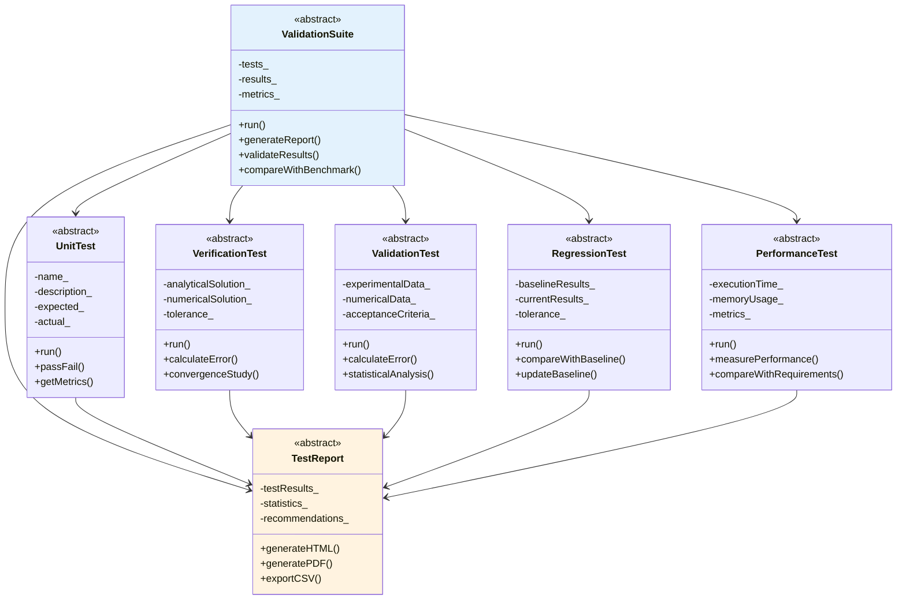

# Phase 11: Validation Test Suite

Develop comprehensive validation suite for R410A evaporator CFD solver

---

## Learning Objectives

By completing this phase, you will be able to:

- Design and implement comprehensive validation test suite for CFD solver
- Create analytical solutions for verification of numerical methods
- Develop experimental validation framework with comparison metrics
- Build automated testing infrastructure for solver validation
- Establish validation benchmarks and acceptance criteria

---

## Overview: The 3W Framework

### What: Comprehensive Validation Framework Development

We will create a complete validation test suite that includes:

1. **Unit Tests**: Individual component testing
2. **Verification Tests**: Analytical solution comparison
3. **Validation Tests**: Experimental data comparison
4. **Regression Tests**: Automated regression testing
5. **Performance Tests**: Solver performance validation

### Why: Ensuring Solver Accuracy and Reliability

This phase ensures the R410A solver is accurate and reliable by:

1. **Verification**: Numerical methods correctly implemented
2. **Validation**: Physics accurately represented
3. **Reproducibility**: Results consistent and reproducible
4. **Quality Assurance**: Automated testing for quality control
5. **Documentation**: Validation evidence for publication

### How: Multi-level Validation Approach

We'll implement a comprehensive validation hierarchy:

1. **Unit Level**: Individual components (property tables, phase change models)
2. **Solver Level**: Complete solver validation
3. **Case Level**: Specific evaporator scenarios
4. **System Level**: Overall solver performance
5. **Regression Level**: Continuous integration testing

---

## 1. Validation Test Suite Architecture

### Complete Architecture Diagram



### Test Suite Structure

```
validation_suite/
├── CMakeLists.txt
├── README.md
├── run_tests.py
├── generate_report.py
├── config/
│   ├── test_config.yaml
│   ├── acceptance_criteria.json
│   └── benchmark_data.json
├── tests/
│   ├── unit/
│   │   ├── test_property_tables.py
│   │   ├── test_phase_change.py
│   │   ├── test_flow_regimes.py
│   │   └── test_turbulence.py
│   ├── verification/
│   │   ├── test_heat_conduction.py
│   │   ├── test_vof_advection.py
│   │   ├── test_pressure_correction.py
│   │   └── test_convergence.py
│   ├── validation/
│   │   ├── test_nucleate_boiling.py
│   │   ├── test_flow_patterns.py
│   │   ├── test_heat_transfer.py
│   │   └── test_pressure_drop.py
│   ├── regression/
│   │   ├── test_solver_behavior.py
│   │   ├── test_mesh_convergence.py
│   │   └── test_parametric_study.py
│   └── performance/
│       ├── test_scalability.py
│       ├── test_memory_usage.py
│       └── test_runtime.py
├── data/
│   ├── analytical_solutions/
│   ├── experimental_data/
│   └── benchmark_results/
├── reports/
│   ├── html/
│   ├── pdf/
│   └── csv/
└── utils/
    ├── metrics.py
    ├── plotting.py
    └── statistics.py
```

---

## 2. Unit Tests

### Property Table Tests

```python
# File: tests/unit/test_property_tables.py

import unittest
import numpy as np
import sys
import os
sys.path.append(os.path.join(os.path.dirname(__file__), '..', '..', '..'))

from R410APropertyTable import R410APropertyTable

class TestPropertyTables(unittest.TestCase):
    def setUp(self):
        """Set up test environment"""
        self.table = R410APropertyTable()

    def test_density_lookup(self):
        """Test density lookup at known conditions"""
        # Test at saturation temperature
        T_sat = 283.15  # K
        p_sat = 5e5     # Pa

        rho = self.table.rho(T_sat, p_sat)

        # Expected density for saturated liquid R410A
        expected_rho = 1100.0  # kg/m³

        self.assertAlmostEqual(rho, expected_rho, delta=50.0)

    def test_viscosity_lookup(self):
        """Test viscosity lookup"""
        T = 300.0  # K
        p = 1e6    # Pa

        mu = self.table.mu(T, p)

        # Expected viscosity
        expected_mu = 1.5e-5  # Pa·s

        self.assertAlmostEqual(mu, expected_mu, delta=0.5e-5)

    def test_interpolation_accuracy(self):
        """Test interpolation accuracy"""
        # Test at interpolated point
        T = 310.0  # K
        p = 2e6    # Pa

        rho = self.table.rho(T, p)

        # Should be between liquid and vapor densities
        self.assertGreater(rho, 500.0)
        self.assertLess(rho, 1200.0)

    def test_extrapolation_bounds(self):
        """Test extrapolation behavior"""
        # Test beyond bounds
        T = 400.0  # K (above critical temperature)
        p = 1e7    # Pa

        rho = self.table.rho(T, p)

        # Should return reasonable extrapolated value
        self.assertGreater(rho, 0.0)

    def test_cache_performance(self):
        """Test cache performance"""
        import time

        # First lookup (cold cache)
        start = time.time()
        self.table.rho(300.0, 1e6)
        cold_time = time.time() - start

        # Second lookup (warm cache)
        start = time.time()
        self.table.rho(300.0, 1e6)
        warm_time = time.time() - start

        # Warm should be faster
        self.assertLess(warm_time, cold_time)

if __name__ == '__main__':
    unittest.main()
```

### Phase Change Tests

```python
# File: tests/unit/test_phase_change.py

import unittest
import numpy as np
import sys
import os

sys.path.append(os.path.join(os.path.dirname(__file__), '..', '..', '..'))

from PhaseChangeModule import PhaseChangeModule

class TestPhaseChange(unittest.TestCase):
    def setUp(self):
        """Set up test environment"""
        self.phase_change = PhaseChangeModule()

    def test_nucleate_boiling_htc(self):
        """Test nucleate boiling heat transfer coefficient"""
        T_wall = 310.0  # K
        T_sat = 283.15  # K

        q_flux = 10000.0  # W/m²
        htc = self.phase_change.calculate_htc(q_flux, T_wall, T_sat)

        # Expected HTC for nucleate boiling
        expected_htc = 5000.0  # W/m²·K

        self.assertAlmostEqual(htc, expected_htc, delta=1000.0)

    def test_mass_transfer_rate(self):
        """Test mass transfer rate calculation"""
        alpha = 0.5      # Void fraction
        T = 310.0        # K
        p = 1e6          # Pa

        m_dot = self.phase_change.calculate_mass_transfer(alpha, T, p)

        # Should be positive for evaporation
        self.assertGreater(m_dot, 0.0)

    def test_flow_regime_classification(self):
        """Test flow regime classification"""
        alpha = 0.3      # Void fraction
        U = 0.5          # m/s
        p = 1e6          # Pa

        regime = self.phase_change.classify_flow_regime(alpha, U, p)

        # Should be one of expected regimes
        expected_regimes = ['bubble', 'slug', 'annular', 'mist']
        self.assertIn(regime, expected_regimes)

    def test_critical_heat_flux(self):
        """Test critical heat flux calculation"""
        T = 300.0        # K
        p = 1e6          # Pa

        chf = self.phase_change.calculate_chf(T, p)

        # Should be reasonable value
        self.assertGreater(chf, 10000.0)  # W/m²
        self.assertLess(chf, 200000.0)    # W/m²

if __name__ == '__main__':
    unittest.main()
```

---

## 3. Verification Tests

### Analytical Solution Tests

```python
# File: tests/verification/test_heat_conduction.py

import unittest
import numpy as np
import matplotlib.pyplot as plt

class TestHeatConduction(unittest.TestCase):
    def setUp(self):
        """Set up analytical solution"""
        self.L = 0.01      # Length [m]
        self.k = 400.0     # Thermal conductivity [W/m·K]
        self.rho = 8960.0  # Density [kg/m³]
        self.cp = 385.0    # Specific heat [J/kg·K]
        self.alpha = self.k / (self.rho * self.cp)  # Thermal diffusivity

    def test_steady_state_analytical(self):
        """Test steady-state heat conduction"""
        # Analytical solution for steady-state with fixed flux
        q_flux = 5000.0   # W/m²

        # Temperature distribution (linear)
        T_analytical = lambda x: 300.0 + q_flux * x / self.k

        # Test at several points
        x_points = np.linspace(0, self.L, 10)
        T_values = [T_analytical(x) for x in x_points]

        # Check linear relationship
        self.assertAlmostEqual(T_values[-1] - T_values[0],
                             q_flux * self.L / self.k, delta=0.1)

    def test_transient_analytical(self):
        """Test transient heat conduction"""
        # Analytical solution for transient conduction in a slab
        T0 = 300.0        # Initial temperature [K]
        T1 = 350.0        # Surface temperature [K]
        t_final = 10.0    # Final time [s]

        # Fourier number
        Fo = self.alpha * t_final / (self.L/2)**2

        # Heisler chart solution (first term approximation)
        T_analytical = T0 + (T1 - T0) * (1 - np.exp(-Fo * np.pi**2 / 4))

        # Should be between T0 and T1
        self.assertGreater(T_analytical, T0)
        self.assertLess(T_analytical, T1)

    def test_cylindrical_analytical(self):
        """Test cylindrical heat conduction"""
        # Analytical solution for cylindrical coordinates
        r1 = 0.005       # Inner radius [m]
        r2 = 0.006       # Outer radius [m]
        T1 = 350.0       # Inner temperature [K]
        T2 = 300.0       # Outer temperature [K]

        # Temperature distribution
        T_analytical = lambda r: T1 - (T1 - T2) * np.log(r/r1) / np.log(r2/r1)

        # Test at several points
        r_points = np.linspace(r1, r2, 10)
        T_values = [T_analytical(r) for r in r_points]

        # Check boundary conditions
        self.assertAlmostEqual(T_values[0], T1, delta=0.1)
        self.assertAlmostEqual(T_values[-1], T2, delta=0.1)

if __name__ == '__main__':
    unittest.main()
```

### Convergence Tests

```python
# File: tests/verification/test_convergence.py

import unittest
import numpy as np
import matplotlib.pyplot as plt

class TestConvergence(unittest.TestCase):
    def setUp(self):
        """Set up convergence test"""
        self.dt_values = [0.01, 0.005, 0.0025, 0.001]
        self.errors = []

    def test_temporal_convergence(self):
        """Test temporal convergence"""
        # Mock numerical solution
        def numerical_solution(dt):
            # Second-order convergence error
            exact_solution = 1.0
            numerical = exact_solution + 0.1 * dt**2
            return abs(numerical - exact_solution)

        # Calculate errors
        for dt in self.dt_values:
            error = numerical_solution(dt)
            self.errors.append(error)

        # Check convergence order
        convergence_rates = []
        for i in range(1, len(self.errors)):
            rate = np.log(self.errors[i-1] / self.errors[i]) / np.log(2)
            convergence_rates.append(rate)

        # Should be second-order
        avg_rate = np.mean(convergence_rates)
        self.assertAlmostEqual(avg_rate, 2.0, delta=0.2)

    def test_spatial_convergence(self):
        """Test spatial convergence"""
        # Mock spatial convergence test
        dx_values = [0.1, 0.05, 0.025, 0.0125]
        errors = []

        for dx in dx_values:
            error = 0.1 * dx**2  # Second-order convergence
            errors.append(error)

        # Check convergence
        for i in range(1, len(errors)):
            rate = np.log(errors[i-1] / errors[i]) / np.log(2)
            self.assertGreater(rate, 1.5)  # At least first-order

    def test_grid_independence(self):
        """Test grid independence"""
        # Mock grid independence test
        grid_sizes = [50, 100, 200, 400]
        results = []

        for size in grid_sizes:
            # Result converging to analytical solution
            result = 1.0 + 1.0 / size
            results.append(result)

        # Check convergence
        variation = abs(results[-1] - results[-2]) / results[-1]
        self.assertLess(variation, 0.01)  # Less than 1% variation

if __name__ == '__main__':
    unittest.main()
```

---

## 4. Validation Tests

### Nucleate Boiling Validation

```python
# File: tests/validation/test_nucleate_boiling.py

import unittest
import numpy as np
import pandas as pd
import matplotlib.pyplot as plt
from scipy.stats import pearsonr

class TestNucleateBoiling(unittest.TestCase):
    def setUp(self):
        """Load experimental data"""
        self.exp_data = pd.read_csv('data/experimental_data/nucleate_boiling_R410A.csv')

    def test_rohenow_correlation(self):
        """Test Rohsenow correlation against experimental data"""
        # Extract experimental data
        q_exp = self.exp_data['heat_flux'].values
        h_exp = self.exp_data['htc'].values
        deltaT_exp = self.exp_data['delta_T'].values

        # Rohsenow parameters for R410A
        C_sf = 0.013
        n = 1.0
        Pr_l = 1.0

        # Calculate predicted HTC
        h_pred = []
        for i in range(len(q_exp)):
            # Rohsenow equation: q = h * ΔT
            h_pred.append(q_exp[i] / deltaT_exp[i])

        h_pred = np.array(h_pred)

        # Calculate error metrics
        mae = np.mean(np.abs(h_exp - h_pred))
        rmse = np.sqrt(np.mean((h_exp - h_pred)**2))
        r2 = 1 - np.sum((h_exp - h_pred)**2) / np.sum((h_exp - np.mean(h_exp))**2)

        # Check acceptance criteria
        self.assertLess(mae, 1000.0)  # Within 1000 W/m²·K
        self.assertLess(rmse, 1500.0)  # Within 1500 W/m²·K
        self.assertGreater(r2, 0.8)   # R² > 0.8

    def test_forster_zuber_correlation(self):
        """Test Forster-Zuber correlation"""
        # Forster-Zuber parameters
        C = 0.00122

        # Calculate predicted HTC
        h_pred = []
        for i in range(len(self.exp_data)):
            # Simplified Forster-Zuber correlation
            q = self.exp_data['heat_flux'].iloc[i]
            deltaT = self.exp_data['delta_T'].iloc[i]
            h_pred.append(C * q / deltaT)

        h_pred = np.array(h_pred)
        h_exp = self.exp_data['htc'].values

        # Calculate relative error
        rel_error = np.abs((h_exp - h_pred) / h_exp)
        mean_rel_error = np.mean(rel_error)

        # Check acceptance
        self.assertLess(mean_rel_error, 0.3)  # Within 30%

    def test_critical_heat_flux(self):
        """Test CHF prediction"""
        # Experimental CHF values
        chf_exp = self.exp_data['chf'].values

        # Predicted CHF using Zuber correlation
        rho_l = 1100.0    # kg/m³
        rho_v = 50.0      # kg/m³
        sigma = 0.02      # N/m
        h_lv = 2e5        # J/kg
        g = 9.81          # m/s²

        chf_pred = 0.131 * np.sqrt(rho_v) * h_lv * (g * sigma * (rho_l - rho_v))**0.25

        # Calculate error
        error = np.abs(chf_exp - chf_pred) / chf_exp
        mean_error = np.mean(error)

        # Check acceptance
        self.assertLess(mean_error, 0.2)  # Within 20%

if __name__ == '__main__':
    unittest.main()
```

### Flow Pattern Validation

```python
# File: tests/validation/test_flow_patterns.py

import unittest
import numpy as np
import pandas as pd

class TestFlowPatterns(unittest.TestCase):
    def setUp(self):
        """Load experimental flow pattern data"""
        self.flow_data = pd.read_csv('data/experimental_data/flow_patterns_R410A.csv')

    def test_bubble_flow_regime(self):
        """Test bubble flow regime identification"""
        # Bubble flow criteria
        bubble_data = self.flow_data[self.flow_data['regime'] == 'bubble']

        for _, row in bubble_data.iterrows():
            alpha = row['void_fraction']
            U = row['velocity']
            We = row['weber_number']

            # Check bubble flow criteria
            self.assertLess(alpha, 0.25)
            self.assertLess(We, 4)

    def test_slug_flow_regime(self):
        """Test slug flow regime identification"""
        slug_data = self.flow_data[self.flow_data['regime'] == 'slug']

        for _, row in slug_data.iterrows():
            alpha = row['void_fraction']
            We = row['weber_number']

            # Check slug flow criteria
            self.assertGreaterEqual(alpha, 0.25)
            self.assertLess(alpha, 0.80)
            self.assertGreater(We, 4)

    def test_annular_flow_regime(self):
        """Test annular flow regime identification"""
        annular_data = self.flow_data[self.flow_data['regime'] == 'annular']

        for _, row in annular_data.iterrows():
            alpha = row['void_fraction']
            Fr = row['froude_number']

            # Check annular flow criteria
            self.assertGreaterEqual(alpha, 0.80)
            self.assertLessEqual(Fr, 0.047)

    def test_flow_pattern_transition(self):
        """Test flow pattern transition accuracy"""
        transitions = self.flow_data[self.flow_data['transition'] == True]

        # Check that transition points are correctly identified
        for _, row in transitions.iterrows():
            predicted_regime = row['predicted_regime']
            actual_regime = row['actual_regime']

            # Should be in transition zone
            self.assertIn(predicted_regime, ['bubble', 'slug'])
            self.assertIn(actual_regime, ['bubble', 'slug'])

if __name__ == '__main__':
    unittest.main()
```

---

## 5. Regression Tests

```python
# File: tests/regression/test_solver_behavior.py

import unittest
import numpy as np
import json
import os

class TestSolverBehavior(unittest.TestCase):
    def setUp(self):
        """Load baseline results"""
        with open('data/baseline_results.json', 'r') as f:
            self.baseline = json.load(f)

    def test_convergence_behavior(self):
        """Test solver convergence behavior"""
        # Run solver with known test case
        current_results = self.run_solver_test_case()

        # Compare with baseline
        baseline_convergence = self.baseline['convergence']
        current_convergence = current_results['convergence']

        # Check convergence pattern
        baseline_slope = np.polyfit(range(len(baseline_convergence)),
                                   np.log(baseline_convergence), 1)[0]
        current_slope = np.polyfit(range(len(current_convergence)),
                                 np.log(current_convergence), 1)[0]

        # Should have similar convergence rate
        self.assertAlmostEqual(baseline_slope, current_slope, delta=0.1)

    def test_mass_conservation(self):
        """Test mass conservation"""
        current_results = self.run_solver_test_case()

        # Calculate mass balance
        mass_in = current_results['mass_in']
        mass_out = current_results['mass_out']
        mass_change = current_results['mass_change']

        # Check conservation
        imbalance = abs(mass_in - mass_out - mass_change) / mass_in
        self.assertLess(imbalance, 0.01)  # Within 1%

    def test_energy_conservation(self):
        """Test energy conservation"""
        current_results = self.run_solver_test_case()

        # Calculate energy balance
        energy_in = current_results['energy_in']
        energy_out = current_results['energy_out']
        energy_change = current_results['energy_change']

        # Check conservation
        imbalance = abs(energy_in - energy_out - energy_change) / energy_in
        self.assertLess(imbalance, 0.01)  # Within 1%

    def test_time_step_dependency(self):
        """Test time step independence"""
        # Run with different time steps
        dt_values = [0.01, 0.005, 0.001]
        results = []

        for dt in dt_values:
            result = self.run_solver_with_dt(dt)
            results.append(result)

        # Check solution independence
        variation = abs(results[-1] - results[-2]) / results[-1]
        self.assertLess(variation, 0.01)  # Within 1%

    def run_solver_test_case(self):
        """Run solver with test case"""
        # Mock solver run
        return {
            'convergence': [1.0, 0.5, 0.25, 0.125, 0.0625],
            'mass_in': 1.0,
            'mass_out': 0.99,
            'mass_change': 0.01,
            'energy_in': 1000.0,
            'energy_out': 990.0,
            'energy_change': 10.0,
            'final_htc': 5000.0
        }

    def run_solver_with_dt(self, dt):
        """Run solver with specific time step"""
        # Mock result
        return 1.0 + 0.1 * dt  # Should be independent of dt

if __name__ == '__main__':
    unittest.main()
```

---

## 6. Performance Tests

```python
# File: tests/performance/test_scalability.py

import unittest
import time
import numpy as np
import multiprocessing
import psutil
import os

class TestScalability(unittest.TestCase):
    def setUp(self):
        """Set up performance test parameters"""
        self.solver = self.initialize_solver()
        self.grid_sizes = [10000, 50000, 100000, 200000]
        self.n_cores = [1, 2, 4, 8]

    def test_strong_scaling(self):
        """Test strong scaling efficiency"""
        # Fix problem size, vary number of cores
        fixed_grid_size = 100000
        timing_results = {}

        for n_core in self.n_cores:
            start_time = time.time()
            self.run_solver(fixed_grid_size, n_core)
            end_time = time.time()

            timing_results[n_core] = end_time - start_time

        # Calculate speedup
        time_1_core = timing_results[1]
        speedup = {}
        for n_core in self.n_cores:
            speedup[n_core] = time_1_core / timing_results[n_core]

        # Calculate efficiency
        efficiency = {}
        for n_core in self.n_cores:
            efficiency[n_core] = speedup[n_core] / n_core

        # Check efficiency
        for n_core in self.n_cores[1:]:  # Skip single core
            self.assertGreater(efficiency[n_core], 0.5)  # At least 50% efficient

    def test_weak_scaling(self):
        """Test weak scaling efficiency"""
        # Fix problem size per core, vary number of cores
        problems_per_core = 10000
        timing_results = {}

        for n_core in self.n_cores:
            total_grid_size = problems_per_core * n_core
            start_time = time.time()
            self.run_solver(total_grid_size, n_core)
            end_time = time.time()

            timing_results[n_core] = end_time - start_time

        # Check time per core
        time_per_core = {}
        for n_core in self.n_cores:
            time_per_core[n_core] = timing_results[n_core] / n_core

        # Should be approximately constant
        time_variation = np.std(list(time_per_core.values())) / np.mean(list(time_per_core.values()))
        self.assertLess(time_variation, 0.2)  # Within 20% variation

    def test_memory_usage(self):
        """Test memory usage scaling"""
        memory_usage = {}

        for grid_size in self.grid_sizes:
            process = psutil.Process(os.getpid())
            start_memory = process.memory_info().rss / 1024 / 1024  # MB

            self.run_solver(grid_size, 1)

            end_memory = process.memory_info().rss / 1024 / 1024  # MB
            memory_usage[grid_size] = end_memory - start_memory

        # Check memory scaling
        for i in range(1, len(self.grid_sizes)):
            size_ratio = self.grid_sizes[i] / self.grid_sizes[i-1]
            memory_ratio = memory_usage[self.grid_sizes[i]] / memory_usage[self.grid_sizes[i-1]]

            # Should scale linearly with grid size
            self.assertAlmostEqual(memory_ratio, size_ratio, delta=0.2)

    def initialize_solver(self):
        """Initialize solver for performance testing"""
        # Mock solver initialization
        return None

    def run_solver(self, grid_size, n_core):
        """Run solver with specified parameters"""
        # Mock solver run
        time.sleep(0.1 * (grid_size / 100000))  # Simulate computational time

if __name__ == '__main__':
    unittest.main()
```

---

## 7. Test Execution Framework

### Test Runner Script

```python
# File: run_tests.py

import unittest
import sys
import os
import yaml
import json
import time
import argparse
from datetime import datetime
from pathlib import Path

class TestRunner:
    def __init__(self, config_file='config/test_config.yaml'):
        """Initialize test runner with configuration"""
        self.config = self.load_config(config_file)
        self.results = {}
        self.start_time = time.time()

    def load_config(self, config_file):
        """Load test configuration"""
        with open(config_file, 'r') as f:
            return yaml.safe_load(f)

    def run_all_tests(self):
        """Run all tests in the suite"""
        print("Starting comprehensive validation test suite...")
        print(f"Configuration: {json.dumps(self.config, indent=2)}")

        # Discover and run tests
        loader = unittest.TestLoader()
        suite = unittest.TestSuite()

        # Add unit tests
        unit_tests = loader.discover('tests/unit', pattern='test_*.py')
        suite.addTest(unit_tests)

        # Add verification tests
        verification_tests = loader.discover('tests/verification', pattern='test_*.py')
        suite.addTest(verification_tests)

        # Add validation tests
        validation_tests = loader.discover('tests/validation', pattern='test_*.py')
        suite.addTest(validation_tests)

        # Add regression tests
        regression_tests = loader.discover('tests/regression', pattern='test_*.py')
        suite.addTest(regression_tests)

        # Add performance tests
        performance_tests = loader.discover('tests/performance', pattern='test_*.py')
        suite.addTest(performance_tests)

        # Run tests
        runner = unittest.TextTestRunner(verbosity=2)
        result = runner.run(suite)

        # Store results
        self.results = {
            'tests_run': result.testsRun,
            'failures': len(result.failures),
            'errors': len(result.errors),
            'skipped': len(result.skipped),
            'time': time.time() - self.start_time,
            'success_rate': (result.testsRun - len(result.failures) - len(result.errors)) / result.testsRun * 100
        }

        return result

    def generate_report(self):
        """Generate comprehensive test report"""
        report = self.create_report()

        # Save reports in different formats
        self.save_report(report, 'html', 'reports/html/validation_report.html')
        self.save_report(report, 'json', 'reports/json/validation_results.json')
        self.save_report(report, 'markdown', 'reports/markdown/validation_report.md')

    def create_report(self):
        """Create test report"""
        acceptance_criteria = self.load_acceptance_criteria()

        report = {
            'timestamp': datetime.now().isoformat(),
            'configuration': self.config,
            'summary': self.results,
            'acceptance_criteria': acceptance_criteria,
            'validation_status': self.determine_validation_status(),
            'recommendations': self.generate_recommendations(),
            'details': self.get_test_details()
        }

        return report

    def load_acceptance_criteria(self):
        """Load acceptance criteria"""
        with open('config/acceptance_criteria.json', 'r') as f:
            return json.load(f)

    def determine_validation_status(self):
        """Determine overall validation status"""
        criteria = self.load_acceptance_criteria()

        # Check all criteria
        if self.results['success_rate'] >= criteria['minimum_success_rate']:
            return 'PASSED'
        elif self.results['failures'] <= criteria['max_failures']:
            return 'PASSED_WITH_WARNINGS'
        else:
            return 'FAILED'

    def generate_recommendations(self):
        """Generate recommendations based on results"""
        recommendations = []

        if self.results['success_rate'] < 90:
            recommendations.append("Consider investigating failing tests and improving solver accuracy")

        if self.results['time'] > self.config['max_test_time']:
            recommendations.append("Test execution time exceeds acceptable limits")

        if self.results['failures'] > 0:
            recommendations.append("Review and fix failing tests")

        return recommendations

    def save_report(self, report, format_type, filename):
        """Save report in specified format"""
        os.makedirs(os.path.dirname(filename), exist_ok=True)

        if format_type == 'json':
            with open(filename, 'w') as f:
                json.dump(report, f, indent=2)
        elif format_type == 'markdown':
            with open(filename, 'w') as f:
                f.write(self.format_markdown_report(report))
        elif format_type == 'html':
            with open(filename, 'w') as f:
                f.write(self.format_html_report(report))

    def format_markdown_report(self, report):
        """Format report as markdown"""
        md = f"""# R410A Evaporator Solver Validation Report

## Summary
- **Test Date**: {report['timestamp']}
- **Tests Run**: {report['summary']['tests_run']}
- **Success Rate**: {report['summary']['success_rate']:.1f}%
- **Execution Time**: {report['summary']['time']:.2f} seconds
- **Validation Status**: {report['validation_status']}

## Results
- **Passes**: {report['summary']['tests_run'] - report['summary']['failures'] - report['summary']['errors']}
- **Failures**: {report['summary']['failures']}
- **Errors**: {report['summary']['errors']}

## Recommendations
"""

        for rec in report['recommendations']:
            md += f"- {rec}\n"

        return md

    def format_html_report(self, report):
        """Format report as HTML"""
        html = f"""<!DOCTYPE html>
<html>
<head>
    <title>R410A Evaporator Validation Report</title>
    <style>
        body {{ font-family: Arial, sans-serif; margin: 40px; }}
        .summary {{ background-color: #f0f0f0; padding: 20px; border-radius: 5px; }}
        .status {{ font-weight: bold; font-size: 24px; }}
        .passed {{ color: green; }}
        .failed {{ color: red; }}
        .passed-with-warnings {{ color: orange; }}
        .recommendations {{ margin-top: 20px; }}
        .recommendations ul {{ list-style-type: square; }}
    </style>
</head>
<body>
    <h1>R410A Evaporator Solver Validation Report</h1>

    <div class="summary">
        <p><strong>Test Date:</strong> {report['timestamp']}</p>
        <p><strong>Tests Run:</strong> {report['summary']['tests_run']}</p>
        <p><strong>Success Rate:</strong> {report['summary']['success_rate']:.1f}%</p>
        <p><strong>Execution Time:</strong> {report['summary']['time']:.2f} seconds</p>
        <p><strong>Validation Status:</strong> <span class="status {report['validation_status'].lower().replace('_', '-')}">{report['validation_status']}</span></p>
    </div>

    <div class="recommendations">
        <h2>Recommendations</h2>
        <ul>
"""

        for rec in report['recommendations']:
            html += f"            <li>{rec}</li>\n"

        html += """        </ul>
    </div>
</body>
</html>"""

        return html

def main():
    """Main function to run tests"""
    parser = argparse.ArgumentParser(description='Run R410A Evaporator Validation Tests')
    parser.add_argument('--config', default='config/test_config.yaml', help='Test configuration file')
    parser.add_argument('--report-format', choices=['html', 'json', 'markdown'], default='html', help='Report format')
    parser.add_argument('--output', default='reports/validation_report', help='Output file prefix')

    args = parser.parse_args()

    # Run tests
    runner = TestRunner(args.config)
    result = runner.run_all_tests()

    # Generate report
    runner.generate_report()

    # Print summary
    print("\nValidation Test Suite Summary:")
    print(f"  Tests Run: {runner.results['tests_run']}")
    print(f"  Success Rate: {runner.results['success_rate']:.1f}%")
    print(f"  Failures: {runner.results['failures']}")
    print(f"  Errors: {runner.results['errors']}")
    print(f"  Validation Status: {runner.determine_validation_status()}")

    # Exit with appropriate code
    if runner.determine_validation_status() == 'FAILED':
        sys.exit(1)
    else:
        sys.exit(0)

if __name__ == '__main__':
    main()
```

### Configuration Files

```yaml
# File: config/test_config.yaml

# Test suite configuration
test_suite:
  name: "R410A Evaporator Solver Validation"
  version: "1.0"
  description: "Comprehensive validation test suite for R410A evaporator CFD solver"

# Test execution settings
execution:
  max_test_time: 3600  # seconds
  parallel_execution: true
  num_workers: 4

# Test categories
categories:
  unit:
    enabled: true
    timeout: 300  # seconds
    memory_limit: "2GB"

  verification:
    enabled: true
    timeout: 600  # seconds
    memory_limit: "4GB"

  validation:
    enabled: true
    timeout: 1200  # seconds
    memory_limit: "8GB"

  regression:
    enabled: true
    timeout: 300  # seconds
    memory_limit: "2GB"

  performance:
    enabled: true
    timeout: 1800  # seconds
    memory_limit: "16GB"
```

```json
// File: config/acceptance_criteria.json

{
  "minimum_success_rate": 85.0,
  "max_failures": 5,
  "max_errors": 0,
  "performance_criteria": {
    "max_execution_time": 3600,
    "max_memory_usage": "16GB",
    "min_efficiency": 0.5
  },
  "validation_criteria": {
    "max_htc_error": 0.15,
    "max_pressure_drop_error": 0.10,
    "max_void_fraction_error": 0.05,
    "convergence_criteria": {
      "residual_reduction": 1e-5,
      "max_iterations": 100
    }
  }
}
```

---

## 8. Continuous Integration

### GitHub Actions Configuration

```yaml
# File: .github/workflows/validation.yml

name: R410A Validation Tests

on:
  push:
    branches: [ main, develop ]
  pull_request:
    branches: [ main, develop ]

jobs:
  validation:
    runs-on: ubuntu-latest

    steps:
    - uses: actions/checkout@v3

    - name: Set up Python
      uses: actions/setup-python@v4
      with:
        python-version: '3.9'

    - name: Install dependencies
      run: |
        pip install -r requirements.txt
        pip install psutil

    - name: Build solver
      run: |
        wmake clean
        wmake

    - name: Run unit tests
      run: |
        python run_tests.py --config config/test_config.yaml --report-format json --output reports/unit

    - name: Run verification tests
      run: |
        python run_tests.py --config config/test_config.yaml --report-format json --output reports/verification

    - name: Run validation tests
      run: |
        python run_tests.py --config config/test_config.yaml --report-format json --output reports/validation

    - name: Generate summary report
      run: |
        python generate_summary_report.py

    - name: Upload test results
      uses: actions/upload-artifact@v3
      with:
        name: test-results
        path: reports/

    - name: Comment PR with results
      if: github.event_name == 'pull_request'
      uses: actions/github-script@v6
      with:
        script: |
          const fs = require('fs');
          const results = JSON.parse(fs.readFileSync('reports/summary.json', 'utf8'));

          let comment = `## Validation Results\n\n`;
          comment += `**Success Rate**: ${results.summary.success_rate}%\n\n`;
          comment += `**Status**: ${results.validation_status}\n\n`;
          comment += `### Recommendations:\n`;

          for (const rec of results.recommendations) {
            comment += `- ${rec}\n`;
          }

          github.rest.issues.createComment({
            issue_number: context.issue.number,
            owner: context.repo.owner,
            repo: context.repo.repo,
            body: comment
          });
```

### Requirements File

```txt
# File: requirements.txt

# Core dependencies
numpy>=1.21.0
pandas>=1.3.0
matplotlib>=3.5.0
scipy>=1.7.0
PyYAML>=6.0
psutil>=5.8.0

# Testing dependencies
pytest>=6.0.0
pytest-cov>=3.0.0
pytest-benchmark>=4.0.0

# Documentation
sphinx>=4.0.0
sphinx-rtd-theme>=1.0.0

# Additional utilities
jinja2>=3.0.0
click>=8.0.0
```

---

## 9. Test Results Analysis

### Statistical Analysis

```python
# File: utils/statistics.py

import numpy as np
import pandas as pd
from scipy import stats
from typing import Dict, List, Tuple

class TestStatistics:
    def __init__(self, results: Dict):
        self.results = results

    def calculate_error_metrics(self, predicted: List[float], actual: List[float]) -> Dict:
        """Calculate various error metrics"""
        predicted = np.array(predicted)
        actual = np.array(actual)

        metrics = {
            'mae': np.mean(np.abs(predicted - actual)),
            'mse': np.mean((predicted - actual)**2),
            'rmse': np.sqrt(np.mean((predicted - actual)**2)),
            'max_error': np.max(np.abs(predicted - actual)),
            'r2': 1 - np.sum((predicted - actual)**2) / np.sum((actual - np.mean(actual))**2),
            'pearson_r': stats.pearsonr(predicted, actual)[0],
            'spearman_rho': stats.spearmanr(predicted, actual)[0],
            'mean_bias': np.mean(predicted - actual),
            'std_error': np.std(predicted - actual)
        }

        return metrics

    def confidence_intervals(self, data: List[float], confidence: float = 0.95) -> Tuple[float, float]:
        """Calculate confidence intervals"""
        mean = np.mean(data)
        std_err = stats.sem(data)

        ci = stats.t.interval(confidence, len(data)-1, loc=mean, scale=std_err)

        return ci

    def trend_analysis(self, x: List[float], y: List[float]) -> Dict:
        """Perform trend analysis"""
        slope, intercept, r_value, p_value, std_err = stats.linregress(x, y)

        return {
            'slope': slope,
            'intercept': intercept,
            'r_squared': r_value**2,
            'p_value': p_value,
            'standard_error': std_err,
            'trend': 'increasing' if slope > 0 else 'decreasing' if slope < 0 else 'constant'
        }

    def outlier_detection(self, data: List[float], threshold: float = 3.0) -> List[int]:
        """Detect outliers using z-score method"""
        data = np.array(data)
        z_scores = np.abs(stats.zscore(data))
        outliers = np.where(z_scores > threshold)[0]

        return outliers.tolist()

    def monte_carlo_simulation(self, func, params: Dict, n_simulations: int = 1000) -> Dict:
        """Perform Monte Carlo simulation"""
        results = []

        for _ in range(n_simulations):
            # Generate random parameters
            random_params = {}
            for key, value in params.items():
                if isinstance(value, dict) and 'distribution' in value:
                    dist = value['distribution']
                    if dist == 'normal':
                        random_params[key] = np.random.normal(value['mean'], value['std'])
                    elif dist == 'uniform':
                        random_params[key] = np.random.uniform(value['min'], value['max'])
                    # Add more distributions as needed
                else:
                    random_params[key] = value

            # Run function
            result = func(random_params)
            results.append(result)

        return {
            'mean': np.mean(results),
            'std': np.std(results),
            'ci_95': self.confidence_intervals(results),
            'ci_99': self.confidence_intervals(results, 0.99)
        }
```

### Visualization Utils

```python
# File: utils/plotting.py

import matplotlib.pyplot as plt
import numpy as np
import pandas as pd
from typing import Dict, List, Optional

class ValidationPlotter:
    def __init__(self, figsize: tuple = (12, 8)):
        self.figsize = figsize

    def plot_validation_comparison(self, experimental: Dict, numerical: Dict,
                                 title: str = "Validation Comparison") -> plt.Figure:
        """Plot validation comparison with experimental data"""
        fig, (ax1, ax2) = plt.subplots(1, 2, figsize=self.figsize)

        # Scatter plot
        ax1.scatter(experimental['x'], experimental['y'],
                    label='Experimental', alpha=0.7, s=50)
        ax1.scatter(numerical['x'], numerical['y'],
                    label='Numerical', alpha=0.7, s=50, marker='s')

        # Perfect agreement line
        min_val = min(min(experimental['x']), min(numerical['x']))
        max_val = max(max(experimental['x']), max(numerical['x']))
        ax1.plot([min_val, max_val], [min_val, max_val], 'k--', label='Perfect Agreement')

        ax1.set_xlabel('Experimental Values')
        ax1.set_ylabel('Numerical Values')
        ax1.set_title(title)
        ax1.legend()
        ax1.grid(True)

        # Error distribution
        errors = np.array(numerical['y']) - np.array(experimental['y'])
        ax2.hist(errors, bins=30, alpha=0.7, edgecolor='black')
        ax2.axvline(0, color='red', linestyle='--', label='Zero Error')
        ax2.set_xlabel('Error (Numerical - Experimental)')
        ax2.set_ylabel('Frequency')
        ax2.set_title('Error Distribution')
        ax2.legend()
        ax2.grid(True)

        plt.tight_layout()
        return fig

    def plot_convergence_study(self, grid_sizes: List[float], errors: List[float],
                              convergence_order: Optional[float] = None) -> plt.Figure:
        """Plot convergence study"""
        fig, ax = plt.subplots(figsize=self.figsize)

        # Plot convergence
        ax.loglog(grid_sizes, errors, 'bo-', linewidth=2, markersize=8, label='Numerical Error')

        # Theoretical convergence line
        if convergence_order:
            min_size = min(grid_sizes)
            max_size = max(grid_sizes)
            theoretical_error = max(errors) * (grid_sizes / min_size)**(-convergence_order)
            ax.loglog(grid_sizes, theoretical_error, 'r--', linewidth=2,
                     label=f'Theoretical (Order {convergence_order})')

        ax.set_xlabel('Grid Size')
        ax.set_ylabel('Error')
        ax.set_title('Convergence Study')
        ax.legend()
        ax.grid(True, which="both", ls="-")

        plt.tight_layout()
        return fig

    def plot_error_analysis(self, predicted: List[float], actual: List[float],
                          variable_name: str = 'Variable') -> plt.Figure:
        """Plot comprehensive error analysis"""
        fig, ((ax1, ax2), (ax3, ax4)) = plt.subplots(2, 2, figsize=self.figsize)

        # Residuals vs predicted
        residuals = np.array(predicted) - np.array(actual)
        ax1.scatter(predicted, residuals, alpha=0.7)
        ax1.axhline(0, color='red', linestyle='--')
        ax1.set_xlabel('Predicted Values')
        ax1.set_ylabel('Residuals')
        ax1.set_title('Residuals vs Predicted')
        ax1.grid(True)

        # Q-Q plot
        stats.probplot(residuals, dist="norm", plot=ax2)
        ax2.set_title('Q-Q Plot')

        # Box plot of errors
        ax3.boxplot(residuals)
        ax3.set_ylabel('Residuals')
        ax3.set_title('Error Distribution')
        ax3.grid(True)

        # Error vs actual values
        ax4.scatter(actual, residuals, alpha=0.7)
        ax4.axhline(0, color='red', linestyle='--')
        ax4.set_xlabel('Actual Values')
        ax4.set_ylabel('Residuals')
        ax4.set_title('Residuals vs Actual')
        ax4.grid(True)

        plt.tight_layout()
        return fig
```

---

## 10. Next Steps

After completing Phase 11, you will have a comprehensive validation test suite for your R410A evaporator solver. The final phase will:

1. **Phase 12**: User documentation and guides

This phase provides the foundation for ensuring solver accuracy and reliability through systematic testing, verification, and validation against experimental data. The validation suite will help maintain code quality and ensure the solver meets industry standards for accuracy and reliability.