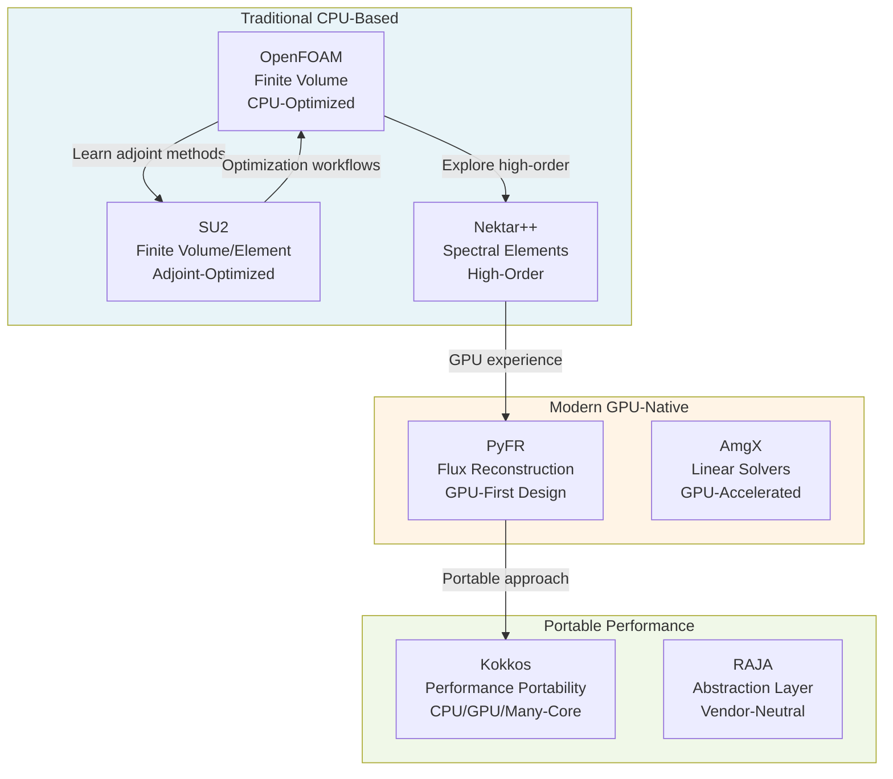

# Beyond OpenFOAM — Overview

Looking Beyond the Framework

---

## Learning Objectives

**What will learners gain from this module?**

By completing this module, you will be able to:

1. **Understand Alternative CFD Architectures**
   - Compare design philosophies of different frameworks (SU2, Nektar++, PyFR)
   - Identify when to choose alternatives over OpenFOAM
   - Apply architectural insights to improve your own code design

2. **Navigate GPU Computing Landscape**
   - Distinguish between GPU-native and portable approaches
   - Evaluate CUDA, OpenCL, and Kokkos for CFD applications
   - Understand performance trade-offs between CPU and GPU implementations

3. **Leverage Modern C++ Features**
   - Apply C++17/20 features specifically for CFD development
   - Write more maintainable and performant CFD code
   - Future-proof your CFD codebase

4. **Make Informed Technology Choices**
   - Assess framework suitability for specific problem types
   - Plan migration strategies from CPU to GPU architectures
   - Integrate modern C++ practices into existing OpenFOAM workflows

---

## Prerequisites

**Before starting this module, learners should have:**

1. **Completed Phase 5 of the Capstone Project**
   - Understanding of OpenFOAM optimization techniques
   - Experience with performance profiling and bottleneck identification

2. **Strong C++ Foundation**
   - Comfortable with C++11/14 features
   - Understanding of template metaprogramming basics
   - Familiarity with memory management in scientific computing

3. **CFD Fundamentals**
   - Knowledge of numerical methods (FVM, FEM, spectral methods)
   - Understanding of turbulence modeling
   - Experience with solver development

4. **Basic HPC Awareness**
   - Familiarity with parallel computing concepts (MPI, OpenMP)
   - Understanding of cache hierarchies and memory bandwidth
   - Experience running simulations on multi-core systems

---

## Why Look Beyond OpenFOAM?

### **What:** Understanding the broader CFD ecosystem

OpenFOAM is powerful, but it's not the only tool in the computational engineer's arsenal. Modern CFD development spans multiple architectures, programming models, and hardware platforms.

### **Why:** Three compelling reasons

1. **Alternative Architectures Expand Your Problem-Solving Toolkit**
   - Each framework embodies different design philosophies
   - Learning alternatives reveals OpenFOAM's strengths and weaknesses
   - Cross-pollination of ideas leads to better code architecture
   - **Practical benefit:** Choose the right tool for each job

2. **GPU Computing Represents the Future of HPC**
   - Traditional CPU-only approaches hit performance ceilings
   - GPU acceleration offers 10-100x speedups for suitable problems
   - Modern supercomputers increasingly rely on GPU architectures
   - **Practical benefit:** Future-proof your skillset and code

3. **Modern C++ Enables Cleaner, Faster Code**
   - C++17/20 features eliminate boilerplate and reduce bugs
   - Better abstraction without performance penalty
   - Industry-standard CFD codes increasingly adopt modern practices
   - **Practical benefit:** Write more maintainable, performant code

### **How:** This module's approach

| Component | Approach | Outcome |
|:---|:---|:---|
| **Alternative Frameworks** | Deep-dive tutorials with working code | Hands-on comparison of architectures |
| **GPU Computing** | Progressive learning from CUDA to Kokkos | Portable performance skills |
| **Modern C++** | CFD-specific examples and patterns | Immediate applicability to your projects |

---

## Module Topics

| Topic | Focus | Key Questions Answered |
|:---|:---|:---|
| **Alternative Frameworks** | SU2, Nektar++, PyFR | When should I use these instead of OpenFOAM? |
| **GPU Computing** | CUDA, OpenCL, Kokkos | How do I make my code GPU-ready? |
| **Modern C++** | C++17/20 features for CFD | What new tools does C++ offer for CFD? |

---

## CFD Landscape Overview

**Key Insights from the Landscape:**

- **Traditional frameworks** excel on CPU clusters with mature ecosystems
- **GPU-native frameworks** rewrite the rules for data movement and parallelism
- **Portable solutions** aim for write-once, run-anywhere performance

---

## What You'll Learn from Each Framework

| Framework | Key Lesson | Best For |
|:---|:---|:---|
| **SU2** | Adjoint-based optimization, continuous adjoint methods | Aerodynamic shape optimization |
| **Nektar++** | High-order spectral element methods, modal expansions | High-accuracy simulations |
| **PyFR** | GPU-first architecture, flux reconstruction | Time-dependent flows on GPUs |
| **Kokkos** | Performance portability, abstraction without cost | Cross-platform HPC development |
| **AmgX** | GPU linear solvers, algebraic multigrid | Large-scale linear systems |

---

## Module Structure

This module consists of three comprehensive units:

### 1. **Alternative Architectures**
- Deep-dive into SU2, Nektar++, and PyFR
- Hands-on tutorials with working code examples
- Comparative analysis of design patterns
- **Deliverable:** Working implementation in one alternative framework

### 2. **GPU Computing**
- Progressive learning path:
  - CUDA fundamentals for CFD
  - OpenCL portable approach
  - Kokkos performance portability
- Practical exercises with measurable speedups
- **Deliverable:** GPU-accelerated CFD kernel

### 3. **Modern C++ for CFD**
- C++17/20 features applied to CFD problems
- Template improvements, constexpr, parallel algorithms
- Memory management and ownership patterns
- **Deliverable:** Refactored CFD code using modern practices

---

## Learning Path Recommendations

Choose your path based on your goals:

| Goal | Recommended Focus | Skip |
|:---|:---|:---|
| **Research Engineer** | Alternative Architectures + Modern C++ | Deep GPU details |
| **HPC Developer** | GPU Computing + Kokkos | Framework comparisons |
| **Code Architect** | All three sections equally | — |
| **Application Engineer** | Alternative Architectures only | GPU internals |

---

## Key Takeaways

**Essential points to remember:**

1. **No Single Framework is Best**
   - OpenFOAM excels in flexibility and extensibility
   - SU2 dominates adjoint optimization workflows
   - Nektar++ provides superior high-order accuracy
   - PyFR demonstrates GPU-native design principles

2. **GPU Computing is Non-Optional for Modern HPC**
   - Performance gains of 10-100x are achievable
   - CUDA offers performance but ties you to NVIDIA
   - Kokkos/RAJA provide portable alternatives
   - The learning curve is steep but necessary

3. **Modern C++ is a Force Multiplier**
   - Reduces boilerplate, improves readability
   - Enables zero-cost abstractions
   - Makes template code less error-prone
   - Future-proofs your CFD codebase

4. **Cross-Pollination Drives Innovation**
   - Techniques learned in one framework apply elsewhere
   - Understanding alternatives deepens OpenFOAM mastery
   - The best CFD developers are framework-agnostic

---

## Practical Exercises

This module includes hands-on work:

1. **Framework Setup & Comparison** (Alternative Architectures)
   - Install and run SU2 tutorial case
   - Compare solver architecture with OpenFOAM
   - Implement simple boundary condition in both

2. **GPU Kernel Development** (GPU Computing)
   - Write and optimize CUDA kernel for Laplacian
   - Port to Kokkos for portability
   - Benchmark on CPU vs GPU

3. **Modern C++ Refactoring** (Modern C++)
   - Modernize legacy CFD code with C++17/20
   - Replace raw pointers with smart pointers
   - Apply constexpr for compile-time optimizations

---

## Related Documentation

### Prerequisites
- **Previous Module:** [Phase 5: Optimization](../04_CAPSTONE_PROJECT/05_Phase5_Optimization.md)
  - Optimization techniques, profiling, and performance tuning

### This Module
- **Next:** [01: Alternative Architectures](01_Alternative_Architectures.md)
  - Deep dive into SU2, Nektar++, PyFR with hands-on tutorials

### Further Reading
- **GPU Programming:** [02: GPU Computing](02_GPU_Computing.md)
- **Modern C++:** [03: Modern C++ for CFD](03_Modern_CPP_for_CFD.md)

---

**Next Steps:** Begin with [Alternative Architectures](01_Alternative_Architectures.md) to explore the broader CFD ecosystem, or jump directly to the section most relevant to your work.