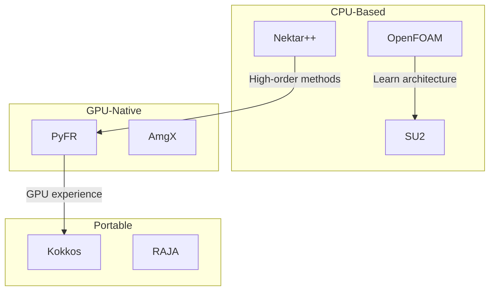

# Beyond OpenFOAM — Overview

มองไปข้างหน้า

---

## เป้าหมาย

> **เห็นทางเลือกและอนาคตของ CFD Development**

---

## ทำไมต้องมองนอก OpenFOAM?

1. **Alternative architectures:** แต่ละ framework มี design philosophy ต่างกัน
2. **GPU computing:** Future of HPC
3. **Modern C++:** Language evolves

---

## Topics ในส่วนนี้

| Topic | Focus |
|:---|:---|
| **Alternative Frameworks** | SU2, Nektar++, PyFR |
| **GPU Computing** | CUDA, OpenCL, Kokkos |
| **Modern C++** | C++17/20 features for CFD |

---

## Landscape Overview

---

## What to Learn from Each

| Framework | Key Lesson |
|:---|:---|
| **SU2** | Adjoint methods, optimization |
| **Nektar++** | High-order spectral elements |
| **PyFR** | GPU-first architecture |
| **Kokkos** | Performance portability |

---

## บทเรียนในส่วนนี้

1. **Alternative Architectures** — CFD frameworks อื่นๆ
2. **GPU Computing** — CUDA, OpenCL, and portable solutions
3. **Modern C++ for CFD** — C++17/20 features

---

## เอกสารที่เกี่ยวข้อง

- **ก่อนหน้า:** [Phase 5: Optimization](../04_CAPSTONE_PROJECT/05_Phase5_Optimization.md)
- **ถัดไป:** [Alternative Architectures](01_Alternative_Architectures.md)
