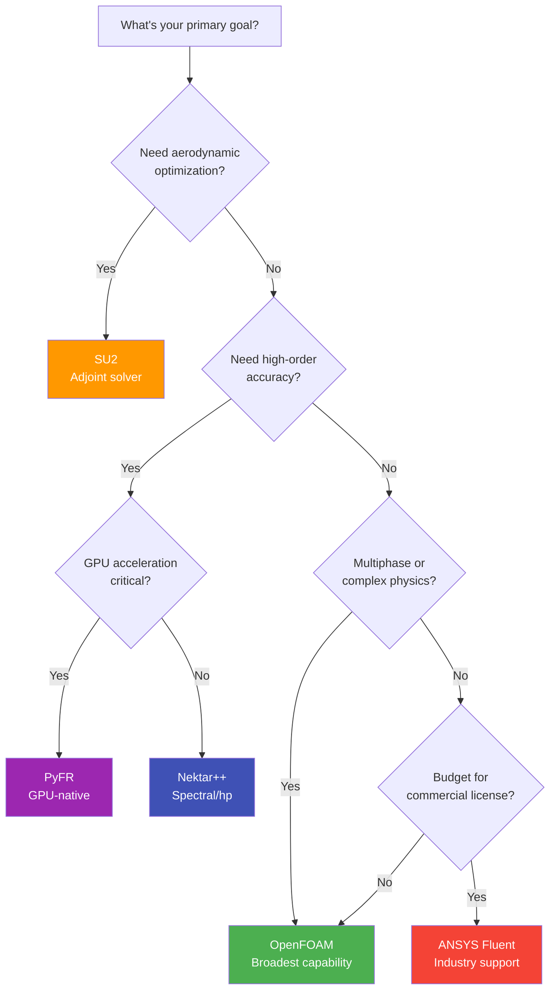

# Alternative CFD Frameworks: Introduction and Comparison

**Learn from the design of others**

---

## Learning Objectives

By the end of this module, you will be able to:

1. **Compare** major CFD frameworks across multiple dimensions (method, language, architecture)
2. **Identify** the right tool for specific application domains
3. **Explain** trade-offs between numerical methods and computational approaches
4. **Evaluate** commercial vs open-source CFD software strategies
5. **Apply** the 3W Framework (What/Why/When) to framework selection

---

## What is This Module?

> **"Each framework has a different philosophy" — learn from them all**

This module introduces alternative CFD frameworks beyond OpenFOAM, explaining what each tool does best and when to choose it. Understanding different architectures teaches valuable design lessons and expands your problem-solving toolkit.

**Why learn multiple frameworks?**

- **No universal best tool:** Each framework optimizes for different use cases
- **Design patterns transfer:** Learning SU2's adjoint architecture teaches optimization patterns applicable to OpenFOAM
- **Career flexibility:** Different industries use different tools (aerospace → SU2, automotive → OpenFOAM, research → Nektar++/PyFR)
- **Innovation:** Cross-pollination of ideas (e.g., PyFR's GPU design influences OpenFOAM GPU extensions)

**When should you explore alternatives?**

- **Research phase:** Evaluating tools for a new project
- **Performance瓶颈:** OpenFOAM solver doesn't meet requirements
- **Specific capabilities needed:** Adjoint optimization, GPU acceleration, high-order accuracy
- **Learning tool:** Understanding solver internals by comparing implementations

---

## Overview

The CFD landscape extends far beyond OpenFOAM. This section provides:

1. **Framework comparison:** Quantitative and qualitative comparison of major CFD tools
2. **Commercial vs open-source:** Decision framework for tool selection
3. **Architecture analysis:** Data structures, extensibility mechanisms, design patterns
4. **Deep-dive tutorials:** Hands-on guides for SU2, Nektar++, and PyFR

---

## Framework Comparison Table

| Framework | Language | Mesh | Method | Primary Strength | Typical Applications |
|:---|:---|:---|:---|:---|:---|
| **OpenFOAM** | C++ | Unstructured | FVM | Extensibility & versatility | General CFD, multiphase, heat transfer |
| **SU2** | C++/Python | Unstructured | FVM/FEM | Aerodynamic optimization | Shape optimization, adjoint methods |
| **Nektar++** | C++ | Unstructured | Spectral/hp | High-order accuracy | DNS/LES, verification, acoustics |
| **PyFR** | Python/C | Unstructured | Flux Reconstruction | GPU-native computing | GPU acceleration, high-order research |
| **ANSYS Fluent** | C | Any | FVM | Industry validation | Industrial flows, regulated industries |

---

## Commercial vs Open Source

| Aspect | Commercial (Fluent) | Open Source (OpenFOAM/SU2/PyFR) |
|:---|:---|:---|
| **Support** | Vendor support, SLA-backed | Community forums, best-effort |
| **Validation** | Extensive industry validation | User responsibility |
| **Customization** | Limited (UDF only) | Unlimited (full source) |
| **Cost** | $10k-$50k/year | Free (Apache 2.0 / GPL) |
| **Learning** | Black box, GUI-driven | Full source, code-driven |
| **Innovation** | Conservative, stable | Cutting-edge, experimental |

### When to Choose Commercial

- **Required by contract:** Aerospace/automotive validation often mandates specific tools
- **Need support:** 24/7 support critical for production environments
- **Limited CFD expertise:** Team lacks deep solver knowledge
- **Standard workflows:** Well-established industrial processes

### When to Choose Open Source

- **Custom physics needed:** Multiphase, specialized BCs, novel models
- **Budget constraints:** Startup, academic, or research funding limits
- **Learning tool:** Understanding solver internals
- **HPC optimization:** Custom GPU acceleration, algorithm innovation

---

## Architecture Philosophies

### Data Structures Comparison

**What:** Different frameworks organize data differently, affecting performance and usability.

**Why:** Data layout determines memory access patterns, GPU compatibility, and code expressiveness.

**When:** Designing new solvers or optimizing existing ones.

```cpp
// OpenFOAM: Object-oriented, field-based
volScalarField T(mesh);
T = T + dt * dTdt;  // Operator overloading for expressiveness
// Pros: Clean syntax, intuitive
// Cons: Indirect data layout, cache misses

// SU2: Procedural, array-based (C-style)
double* Temperature;
for (i = 0; i < nPoints; i++)
    Temperature[i] += dt * dTdt[i];
// Pros: Direct memory access, cache-friendly
// Cons: Verbose, error-prone

// PyFR: Array-based, GPU-optimized
# Stored as [nElements × nSolutionPoints × nVariables]
# Explicit data layout for cache/GPU coherence
# Pros: GPU-native, explicit data layout
# Cons: Requires GPU for performance
```

### Extensibility Mechanisms

**What:** How frameworks allow users to add custom models and boundary conditions.

**Why:** Determines how easily you can customize the solver for novel physics.

**When:** Implementing custom turbulence models, BCs, or numerical schemes.

```cpp
// OpenFOAM: Run-Time Selection (RTS)
autoPtr<turbulenceModel> model = turbulenceModel::New(name);
// String → Object factory pattern at runtime
// Pros: No recompilation, flexible
// Cons: Runtime overhead, complex setup

// SU2: Compile-time switches
switch (Kind_Turb_Model) {
    case SST: ...
    case SA: ...
}
// Rebuild required for changes
// Pros: Zero runtime overhead, straightforward
// Cons: Recompilation needed, less flexible

// Nektar++: Template-based
ExpansionType = std::make_shared<ExpList>(...);
// Compile-time polymorphism with flexibility
// Pros: Type-safe, performant
// Cons: Longer compile times
```

### Key Architectural Lessons

| Framework | Design Lesson | Application to OpenFOAM |
|:---|:---|:---|
| **OpenFOAM** | C++ metaprogramming, run-time selection | Baseline for comparison |
| **SU2** | Adjoint solver integration, clean separation | Add optimization capabilities |
| **Nektar++** | High-order methods, p-refinement | Spectral element extensions |
| **PyFR** | GPU-first design, data layout optimization | GPU offloading strategies |

---

## Decision Framework: Choosing the Right Tool



---

## Key Takeaways

### What (3W Framework)

- **Multiple frameworks exist** with different strengths: OpenFOAM (general), SU2 (optimization), Nektar++ (high-order accuracy), PyFR (GPU acceleration)
- **Architecture matters:** Data structures and extensibility models determine how easily you can customize the solver
- **Open source ≠ free:** Total cost includes learning time, hardware, and maintenance effort

### Why

- **No universal best tool:** Each framework optimizes for different use cases
- **Learning from design:** Understanding SU2's adjoint architecture teaches optimization patterns applicable to OpenFOAM
- **GPU acceleration:** PyFR demonstrates how to redesign for GPUs from the ground up, not just port existing code

### When

- **Use OpenFOAM:** General-purpose, multiphase, complex BCs, large community needed
- **Use SU2:** Aerodynamic shape optimization, adjoint methods, compressible flows
- **Use Nektar++:** DNS/LES, high-order accuracy, spectral methods, verification studies
- **Use PyFR:** GPU acceleration, high-order methods, research flexibility
- **Use Commercial:** Industry validation required, support contract needed, regulatory compliance

---

## Concept Check

<details>
<summary><b>1. OpenFOAM vs SU2: When to use each?</b></summary>

**OpenFOAM:**
- General-purpose CFD with broad physics coverage
- Need extensive customization (new models, BCs, numerics)
- Industrial applications (multiphase, heat transfer, conjugate problems)
- CPU-based HPC clusters

**SU2:**
- Aerodynamic shape optimization is the priority
- Need efficient adjoint solver for gradient computation
- Compressible flows with shocks (supersonic, hypersonic)
- Prefer C++ codebase similar to OpenFOAM
- Willing to sacrifice some multiphysics for optimization focus

**Bottom line:** Use SU2 for optimization-focused problems; use OpenFOAM for general CFD with complex physics.
</details>

<details>
<summary><b>2. Why invest time learning multiple frameworks?</b></summary>

**Design patterns transfer:** Learning SU2's adjoint architecture informs optimization code in any framework

**Tool selection:** Knowing 3+ frameworks prevents "when all you have is a hammer, everything looks like a nail"

**Career flexibility:** Different industries use different tools (aerospace → SU2, automotive → OpenFOAM, research → Nektar++)

**Innovation:** Cross-pollination of ideas (e.g., PyFR's GPU design influences OpenFOAM GPU extensions)

**Time investment:** Core CFD concepts transfer; only syntax and APIs differ
</details>

<details>
<summary><b>3. What's the trade-off between high-order methods (Nektar++, PyFR) and traditional FVM (OpenFOAM)?</b></summary>

**FVM (2nd order - OpenFOAM, SU2):**
- **Pros:** Robust, handles discontinuities, extensive turbulence models
- **Cons:** Error ~ h² (halve mesh → 4x accurate), needs many cells for high accuracy
- **Best for:** Industrial flows, complex geometries, turbulence modeling

**High-order (3rd-6th order - Nektar++, PyFR):**
- **Pros:** Error ~ h^(p+1) with exponential convergence for smooth solutions, fewer cells needed
- **Cons:** Expensive per element, struggles with discontinuities, limited turbulence models
- **Best for:** DNS/LES, smooth flows, verification, boundary layers, acoustics

**Key insight:** High-order achieves 100x better accuracy with 10x fewer elements for smooth problems, but FVM remains king for complex, turbulent, industrial flows.
</details>

---

## Related Documents

- **Next:** [SU2 Tutorial](01b_SU2_Tutorial.md) - Deep dive into adjoint-based optimization
- **Next:** [Nektar++ Overview](01c_Nektar_Plus_Plus.md) - High-order spectral methods
- **Next:** [PyFR Tutorial](01d_PyFR_Tutorial.md) - GPU-native CFD with Python
- **Next:** [Benchmark Comparison](01e_Benchmark_Comparison.md) - Quantitative performance analysis
- **After:** [GPU Computing](02_GPU_Computing.md) - GPU programming for OpenFOAM