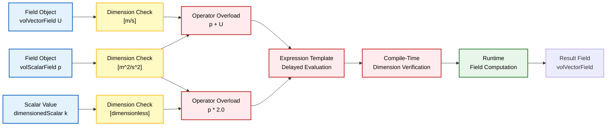
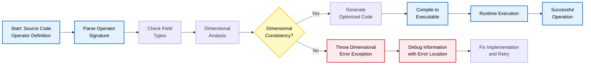
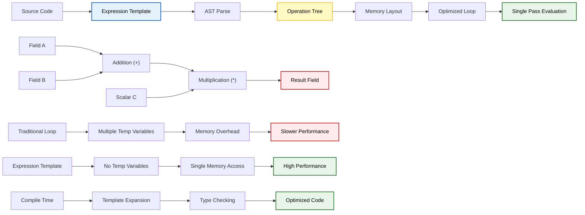
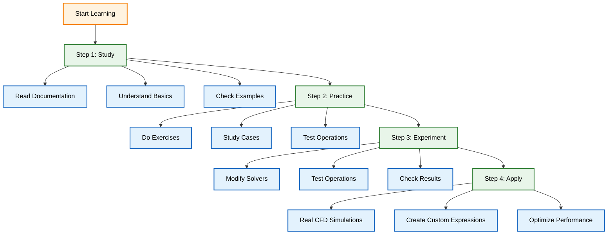

# โมดูล 2: พื้นฐาน OpenFOAM - ภาพรวมส่วนที่ 6.2

## 📋 ภาพรวม: พีชคณิตฟิลด์พื้นฐานและการดำเนินการ

ส่วนนี้ครอบคลุม **การดำเนินการทางพีชคณิตฟิลด์พื้นฐาน** รวมถึงเลขคณิต การโอเวอร์โหลดตัวดำเนินการ และข้อควรพิจารณาด้านประสิทธิภาพ

เราจะสำรวจว่า OpenFOAM ช่วยให้สามารถแสดงนิพจน์ทางคณิตศาสตร์ที่เข้าใจง่าย เช่น `U + V` และ `p * 2.0` ได้อย่างไรผ่านการโอเวอร์โหลดตัวดำเนินการ C++ ในขณะที่ยังคงรักษาความสอดคล้องของมิติและประสิทธิภาพไว้





## 🎯 วัตถุประสงค์การเรียนรู้

- **เชี่ยวชาญ** การดำเนินการทางคณิตศาสตร์พื้นฐานบนฟิลด์ (การบวก, การลบ, การคูณ, การหาร)
- **เข้าใจ** รูปแบบการโอเวอร์โหลดตัวดำเนินการในคลาสฟิลด์ของ OpenFOAM
- **เรียนรู้** การตรวจสอบมิติและการบังคับใช้ความสอดคล้อง
- **เพิ่มประสิทธิภาพ** การดำเนินการพื้นฐานผ่าน expression templates
- **ประยุกต์ใช้** เทคนิคการประกอบและการแยกส่วนฟิลด์ (field composition and decomposition)

## 📚 หัวข้อที่จะครอบคลุม

### 1. การดำเนินการทางคณิตศาสตร์

#### การบวกและการลบฟิลด์
- **การบวกฟิลด์**: `U + V` → ผลรวมของสองฟิลด์เวกเตอร์
- **การลบฟิลด์**: `U - V` → ผลต่างของสองฟิลด์เวกเตอร์
- **การบวก/ลบสเกลาร์**: `p + 1000` → การเปลี่ยนแปลงค่าความดัน

#### การดำเนินการคูณและการหาร
- **การคูณสเกลาร์-ฟิลด์**: `2.0 * U` → การคูณเวกเตอร์ด้วยสเกลาร์
- **การคูณฟิลด์-ฟิลด์**: `U & V` → การดอทโปรดักต์ของเวกเตอร์
- **การหารฟิลด์ด้วยสเกลาร์**: `U / 2.0` → การปรับขนาดเวกเตอร์

#### ความสอดคล้องของมิติ
- **มิติเดิม**: `[m/s] + [m/s] = [m/s]` ✅ สอดคล้อง
- **มิติไม่สอดคล้อง**: `[m/s] + [Pa]` ❌ เกิดข้อผิดพลาดรันไทม์

### 2. การโอเวอร์โหลดตัวดำเนินการ (Operator Overloading)

#### รูปแบบการโอเวอร์โหลดตัวดำเนินการของ OpenFOAM

**ตารางการโอเวอร์โหลดตัวดำเนินการ**

| ตัวดำเนินการ | ความหมาย | ประเภทฟิลด์ | ตัวอย่าง |
|------------|------------|-------------|-----------|
| `+` | การบวก | เวกเตอร์/สเกลาร์ | `U + V` |
| `-` | การลบ | เวกเตอร์/สเกลาร์ | `U - V` |
| `*` | การคูณสเกลาร์ | ทุกประเภท | `2.0 * U` |
| `/` | การหารสเกลาร์ | ทุกประเภท | `U / 2.0` |
| `&` | ดอทโปรดักต์ | เวกเตอร์ | `U & V` |
| `^` | ครอสโปรดักต์ | เวกเตอร์ | `U ^ V` |

#### การนำตัวดำเนินการที่กำหนดเองไปใช้
- **การสร้าง**: กำหนดฟังก์ชันตัวดำเนินการใหม่
- **การโอเวอร์โหลด**: ปรับแต่งตัวดำเนินการที่มีอยู่
- **การตรวจสอบ**: ตรวจสอบความสอดคล้องของมิติ

#### การจัดการข้อผิดพลาด
- **ข้อผิดพลาดมิติ**: การแจ้งเตือนเมื่อมิติไม่สอดคล้อง
- **ข้อผิดพลาดชนิด**: การตรวจสอบชนิดข้อมูลที่ไม่ตรงกัน
- **การดีบัก**: การติดตามตำแหน่งข้อผิดพลาด





### 3. การตรวจสอบมิติ (Dimensional Checking)

#### ระบบการวิเคราะห์มิติของ OpenFOAM
- **ชุดมิติพื้นฐาน**: มวล `[M]`, ความยาว `[L]`, เวลา `[T]`, อุณหภูมิ `[Θ]`, ปริมาณสาร `[N]`
- **การแปลง**: แปลงมิติซับซ้อนเป็นพื้นฐาน
- **การตรวจสอบ**: ตรวจสอบความสอดคล้องในแต่ละการดำเนินการ

#### ตารางชุดมิติและความสอดคล้องของหน่วย

| ปริมาณ | สัญลักษณ์ | มิติ | หน่วย SI | ตัวอย่างตัวแปร OpenFOAM |
|----------|------------|-----------|-----------|---------------------------|
| ความเร็ว | $U$ | $[L T^{-1}]$ | m/s | `U`, `V` |
| ความดัน | $p$ | $[M L^{-1} T^{-2}]$ | Pa | `p`, `p_rgh` |
| ความหนาแน่น | $\rho$ | $[M L^{-3}]$ | kg/m³ | `rho` |
| ความหนืด | $\mu$ | $[M L^{-1} T^{-1}]$ | Pa·s | `mu` |

#### การตรวจสอบมิติขณะรันไทม์
- **การตรวจสอบ**: ก่อนการดำเนินการทุกครั้ง
- **ข้อความแสดงข้อผิดพลาด**: แจ้งตำแหน่งและสาเหตุ
- **การแก้ไข**: แนะนำวิธีแก้ไขที่เป็นไปได้

#### รูปแบบข้อผิดพลาดด้านมิติที่พบบ่อย
- **การบวกมิติต่างกัน**: `[m/s] + [Pa]`
- **การคูณผิดประเภท**: `vector * vector` (ควรเป็น `vector & vector`)
- **การละเว้นการตรวจสอบ**: ปิดการตรวจสอบมิติในโค้ดผลิตภัณฑ์

### 4. การประกอบฟิลด์ (Field Composition)

#### การสร้างนิพจน์ฟิลด์ที่ซับซ้อน
- **นิพจน์ซ้อน**: `(U + V) & (U - V)`
- **ฟังก์ชันคณิตศาสตร์**: `mag(U)`, `sqrt(p)`
- **การผสมผสาน**: `rho * U` (มวลต่อหน่วยปริมาณ)

#### เทคนิคการแยกส่วนฟิลด์
- **การแยกส่วน**: `magSqr(U)` → $|\mathbf{U}|^2$
- **การสกัด**: `U.component(0)` → $U_x$
- **การแปลง**: `vectorField(U)`

#### การดำเนินการฟิลด์แบบซ้อนกัน

**OpenFOAM Code Implementation:**
```cpp
// ตัวอย่างนิพจน์ซ้อนที่ซับซ้อน
volVectorField U = ...;
volScalarField p = ...;
volScalarField rho = ...;

// การประกอบฟิลด์
volScalarField kineticEnergy = 0.5 * rho * magSqr(U);
volVectorField momentum = rho * U;
volScalarField totalPressure = p + 0.5 * rho * magSqr(U);
```

#### Expression templates เพื่อการประเมินผลที่มีประสิทธิภาพ
- **การประเมินล่าชัน**: ไม่สร้างตัวแปรชั่วคราว
- **การเพิ่มประสิทธิภาพ**: การจัดรูปแบบใหม่ของลูป
- **การประหยัดหน่วยความจำ**: ลดการใช้หน่วยความจำชั่วคราว





### 5. การเพิ่มประสิทธิภาพ (Performance Optimization)

#### รูปแบบการเข้าถึงหน่วยความจำในการดำเนินการฟิลด์
- **การเข้าถึงต่อเนื่อง**: การเข้าถึงหน่วยความจำตามลำดับ
- **การแคช**: การใช้ประโยชน์จากการแคชข้อมูล
- **การทำนาย**: การทำนายการเข้าถึงหน่วยความจำล่วงหน้า

#### โอกาสในการทำ Vectorization
- **การดำเนินการเวกเตอร์**: การใช้คำสั่ง SIMD
- **การขนาน**: การประมวลผลข้อมูลหลายตัวพร้อมกัน
- **การเพิ่มประสิทธิภาพ**: การใช้ความสามารถของฮาร์ดแวร์

#### กลยุทธ์การเพิ่มประสิทธิภาพแคช
- **การจัดระเบียบข้อมูล**: การจัดเรียงข้อมูลให้เข้าถึงได้ง่าย
- **การแบ่งบล็อก**: การแบ่งข้อมูลเป็นบล็อกเล็กๆ
- **การทำ prefetch**: การนำข้อมูลมาไว้ในแคชล่วงหน้า

#### การกำจัดตัวแปรชั่วคราวผ่าน expression templates
- **การสร้างตัวแปร**: หลีกเลี่ยงการสร้างตัวแปรชั่วคราว
- **การจัดการหน่วยความจำ**: การจัดการหน่วยความจำอัตโนมัติ
- **การปรับปรุงประสิทธิภาพ**: การลดภาระการจัดการหน่วยความจำ

## 🔗 โครงสร้างโมดูล

ส่วนนี้เป็นส่วนหนึ่งของ **โมดูล 2: พื้นฐาน OpenFOAM** และต่อยอดจาก:

- **ส่วนที่ 6.1**: Foundation Primitives และชนิดข้อมูลพื้นฐานของ OpenFOAM
- **ส่วนที่ 6.3**: การดำเนินการแคลคูลัสเวกเตอร์ (gradient, divergence, curl)
- **ส่วนที่ 6.4**: พีชคณิตเทนเซอร์สำหรับการดำเนินการขั้นสูง


```mermaid
graph LR
    A["Module 2: OpenFOAM Basics"]
    B["Section 6.1:<br/>Foundation Primitives"]
    C["Section 6.2:<br/>Field Algebra Operations"]
    D["Section 6.3:<br/>Vector Calculus<br/>(gradient, divergence, curl)"]
    E["Section 6.4:<br/>Tensor Algebra for<br/>Advanced Operations"]
    F["Foundation:<br/>Data Types and Fields"]
    G["Core Operations:<br/>Addition, Multiplication"]
    H["Mathematical Tools:<br/>∇, ∇⋅, ∇×"]
    I["Advanced Mathematics:<br/>Tensors and Complex Ops"]
    J["Solver Development:<br/>Momentum Equations"]
    K["Utility Functions:<br/>Field Manipulation"]
    L["Research Applications:<br/>Advanced Physics"]
    
    A --> B
    A --> C
    A --> D
    A --> E
    B --> F
    C --> G
    D --> H
    E --> I
    F --> J
    G --> J
    H --> K
    I --> L
    
    %% Styling Definitions
classDef process fill:#e3f2fd,stroke:#1565c0,stroke-width:2px,color:#000;
classDef decision fill:#fff9c4,stroke:#fbc02d,stroke-width:2px,color:#000;
classDef terminator fill:#ffebee,stroke:#c62828,stroke-width:2px,color:#000;
classDef storage fill:#e8f5e9,stroke:#2e7d32,stroke-width:2px,color:#000;
classDef io fill:#f3e5f5,stroke:#7b1fa2,stroke-width:2px,color:#000;
    
    class A process;
    class B,C,D,E decision;
    class F,G,H,I storage;
    class J,K,L io;
}
```


## 🛠️ การประยุกต์ใช้ในทางปฏิบัติ

การดำเนินการทางพีชคณิตฟิลด์เป็นพื้นฐานสำหรับ:

### การพัฒนา Solver
- **การนำสมการโมเมนตัม**: `rho * U` → การคำนวณแรงเฉื่อย
- **สมการพลังงาน**: `0.5 * rho * magSqr(U)` → พลังงานจลน์
- **การแก้สมการ**: การรวมเทอมต่างๆ ในสมการ

### Boundary Conditions
- **การสร้างเงื่อนไข**: `U & n` → ความเร็วตามปกติ
- **การคำนวณ**: `magSqr(U)` → กำลังสองของความเร็ว
- **การผสมผสาน**: การใช้หลายฟิลด์ในเงื่อนไขขอบเขต

### Post-processing
- **การคำนวณปริมาณที่ได้มา**: `sqrt(2/3) * mag(U)` → ความเร็วรวม
- **การวินิจฉัย**: `magSqr(U) / (2 * k)` → การตรวจสอบสมดุล
- **การแสดงผล**: การสร้างฟิลด์สเกลาร์จากเวกเตอร์

### Visualization
- **การสร้างฟิลด์สเกลาร์**: `mag(U)` → ขนาดของความเร็ว
- **การแสดงเวกเตอร์**: `U & n` → องค์ประกอบตามปกติ
- **การผสมสี**: `p + 0.5 * rho * magSqr(U)` → ความดันรวม

## 📖 เส้นทางการเรียนรู้

### ขั้นตอนที่ 1: ศึกษา
- **อ่านเอกสาร**: ศึกษาเอกสารพีชคณิตฟิลด์โดยละเอียด
- **ทำความเข้าใจ**: ทำความเข้าใจหลักการพื้นฐาน
- **ตรวจสอบ**: ตรวจสอบตัวอย่างโค้ดในเอกสาร

### ขั้นตอนที่ 2: ฝึกหัด
- **ทำแบบฝึกหัด**: ทำแบบฝึกหัดเชิงปฏิบัติ
- **กรณีตัวอย่าง**: ศึกษากรณีตัวอย่างต่างๆ
- **ทดสอบ**: ทดสอบการดำเนินการกับฟิลด์จริง

### ขั้นตอนที่ 3: ทดลอง
- **ปรับเปลี่ยน solvers**: แก้ไข solvers ที่มีอยู่
- **ทดสอบการดำเนินการ**: ทดสอบการดำเนินการฟิลด์ใน solver
- **ตรวจสอบผล**: ตรวจสอบผลลัพธ์ที่ได้

### ขั้นตอนที่ 4: ประยุกต์ใช้
- **การจำลองจริง**: ประยุกต์ใช้ในการจำลอง CFD จริง
- **สร้างนิพจน์**: สร้างนิพจน์ฟิลด์ที่กำหนดเอง
- **เพิ่มประสิทธิภาพ**: เพิ่มประสิทธิภาพการคำนวณ





## 🎯 เกณฑ์ความสำเร็จ

เมื่อสิ้นสุดส่วนนี้ คุณควรจะสามารถ:

### ✅ ทักษะด้านการเขียนโค้ด
- **เขียนนิพจน์ทางคณิตศาสตร์**: ใช้ชนิดข้อมูลฟิลด์ของ OpenFOAM เขียนนิพจน์ที่เป็นธรรมชาติ
- **ใช้ตัวดำเนินการ**: ใช้ตัวดำเนินการที่โอเวอร์โหลดอย่างถูกต้อง
- **สร้างนิพจน์ซับซ้อน**: สร้างนิพจน์ที่ซ้อนกันและซับซ้อน

### ✅ ความเข้าใจด้านทฤษฎี
- **ทำความเข้าใจ**: เข้าใจว่าการโอเวอร์โหลดตัวดำเนินการช่วยให้โค้ด CFD สะอาดได้อย่างไร
- **การตรวจสอบมิติ**: ทำความเข้าใจระบบการตรวจสอบมิติของ OpenFOAM
- **ประสิทธิภาพ**: เข้าใจหลักการของ expression templates

### ✅ ทักษะด้านการดีบัก
- **ดีบักความไม่สอดคล้อง**: ดีบักความไม่สอดคล้องของมิติในการดำเนินการฟิลด์
- **การตรวจสอบข้อผิดพลาด**: ตรวจสอบและแก้ไขข้อผิดพลาดจากการใช้ตัวดำเนินการ
- **การทดสอบ**: ทดสอบนิพจน์ทางคณิตศาสตร์ที่ซับซ้อน

### ✅ ทักษะด้านการเพิ่มประสิทธิภาพ
- **เพิ่มประสิทธิภาพนิพจน์**: ปรับปรุงประสิทธิภาพของนิพจน์ฟิลด์
- **การจัดการหน่วยความจำ**: จัดการหน่วยความจำอย่างมีประสิทธิภาพ
- **การขนาน**: ใช้ความสามารถของฮาร์ดแวร์ให้เป็นประโยชน์

### ✅ ทักษะด้านการประยุกต์ใช้
- **ประยุกต์ใช้เทคนิค**: ประยุกต์ใช้เทคนิคพีชคณิตฟิลด์ในการจำลอง CFD จริง
- **การพัฒนา solver**: พัฒนา solver โดยใช้เทคนิคที่เรียนรู้
- **การสร้าง boundary condition**: สร้าง boundary condition ที่ซับซ้อน

## 📊 ตัวอย่างการประยุกต์ใช้

### ตัวอย่างที่ 1: การคำนวณพลังงานจลน์

**OpenFOAM Code Implementation:**
```cpp
volVectorField U(mesh);
volScalarField rho(mesh);

// การคำนวณพลังงานจลน์ต่อหน่วยปริมาณ
volScalarField kineticEnergy = 0.5 * rho * magSqr(U);

// แสดงผลลัพธ์
Info << "Total kinetic energy: " << sum(kineticEnergy * mesh.V()) << endl;
```

### ตัวอย่างที่ 2: การคำนวณความเร็วรวม

**OpenFOAM Code Implementation:**
```cpp
volVectorField U(mesh);

// ความเร็วรวม (สำหรับการแสดงผล)
volScalarField Utotal = mag(U);

// ความเร็วตามแนวปกติ
volVectorField n = mesh.Sf()/mesh.magSf();
volScalarField Un = U & n;
```

### ตัวอย่างที่ 3: การสร้าง boundary condition แบบกำหนดเอง

**OpenFOAM Code Implementation:**
```cpp
// ตัวอย่าง boundary condition ที่ใช้การดำเนินการฟิลด์
if (isA<fixedValueFvPatchScalarField>(this->T()))
{
    const fixedValueFvPatchScalarField& Tp = 
        refCast<const fixedValueFvPatchScalarField>(this->T());
    
    // การคำนวณ gradient ของอุณหภูมิ
    scalarField gradT = Tp.snGrad();
    
    // การใช้ในการคำนวณค่าความร้อน
    this->refValue() = k * gradT;
}
```

---

**ส่วนถัดไป**: ดำเนินการต่อที่ [6.3 Vector Calculus Operations](../03_VECTOR_CALCULUS_OPERATIONS/00_Overview.md) สำหรับการดำเนินการ gradient, divergence และ curl

---

*ส่วนนี้เป็นรากฐานทางคณิตศาสตร์สำหรับการคำนวณ CFD ทั้งหมดใน OpenFOAM โดยเชื่อมโยงช่องว่างระหว่างสมการทางฟิสิกส์และการนำไปใช้ในการคำนวณ*
