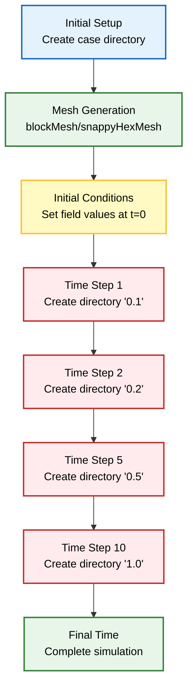
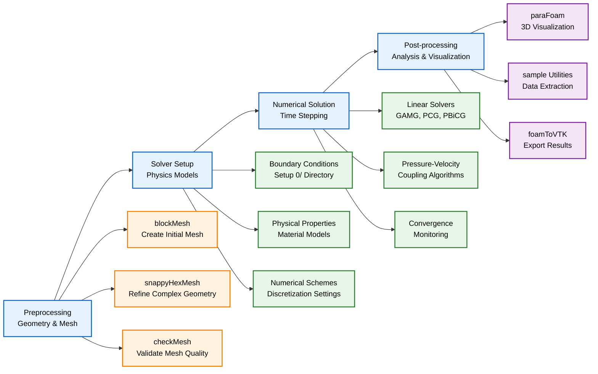

# โครงสร้าง Case ของ OpenFOAM

## ภาพรวม

OpenFOAM ทำงานบนโครงสร้างไดเรกทอรี Case ที่เป็นมาตรฐาน ซึ่งจัดระเบียบไฟล์อินพุตที่จำเป็นทั้งหมด, Boundary Condition และพารามิเตอร์การจำลอง 

**โครงสร้างแบบลำดับชั้น** นี้ช่วยให้การจัดการการจำลอง CFD เป็นไปอย่างเป็นระบบ ตั้งแต่ Preprocessing ไปจนถึงการหาผลลัพธ์ (Solution) และ Post-processing

```mermaid
graph TD
    A["OpenFOAM Case Structure"] --> B["0/"]
    A --> C["constant/"]
    A --> D["system/"]
    
    B --> B1["Initial Conditions"]
    B --> B2["Boundary Conditions"]
    B --> B3["Time-dependent Fields"]
    
    B1 --> B1a["Velocity Field 'U'"]
    B1 --> B1b["Pressure Field 'p'"]
    B1 --> B1c["Temperature Field 'T'"]
    B1 --> B1d["Turbulence Fields"]
    
    B2 --> B2a["Inlet/Outlet BCs"]
    B2 --> B2b["Wall BCs"]
    B2 --> B2c["Symmetry BCs"]
    
    C --> C1["Mesh Data"]
    C --> C2["Physical Properties"]
    C --> C3["Thermophysical Models"]
    C --> C4["Transport Properties"]
    
    C1 --> C1a["polyMesh/"]
    C1a --> C1a1["points"]
    C1a --> C1a2["faces"]
    C1a --> C1a3["owner"]
    C1a --> C1a4["neighbour"]
    
    C2 --> C2a["g"]
    C2 --> C2b["transportProperties"]
    C2 --> C2c["thermophysicalProperties"]
    
    D --> D1["Solver Control"]
    D --> D2["Numerical Schemes"]
    D --> D3["Solution Control"]
    D --> D4["Output Control"]
    
    D1 --> D1a["controlDict"]
    D1a --> D1a1["Time stepping"]
    D1a --> D1a2["Write intervals"]
    D1a --> D1a3["Solver selection"]
    
    D2 --> D2a["fvSchemes"]
    D2a --> D2a1["Grad schemes"]
    D2a --> D2a2["Div schemes"]
    D2a --> D2a3["Laplace schemes"]
    
    D3 --> D3a["fvSolution"]
    D3a --> D3a1["Solver settings"]
    D3a --> D3a2["Relaxation factors"]
    D3a --> D3a3["PISO/SIMPLE controls"]
    
    D4 --> D4a["outputControl"]
    D4 --> D4b["writePrecision"]
    D4 --> D4c["purgeWrite"]
    
    classDef root fill:#f3e5f5,stroke:#4a148c,stroke-width:3px,color:#000;
    classDef maindir fill:#e3f2fd,stroke:#1565c0,stroke-width:2px,color:#000;
    classDef subdir fill:#fff3e0,stroke:#e65100,stroke-width:2px,color:#000;
    classDef file fill:#e8f5e9,stroke:#2e7d32,stroke-width:2px,color:#000;
    classDef detail fill:#fff9c4,stroke:#fbc02d,stroke-width:2px,color:#000;
    
    class A root;
    class B,C,D maindir;
    class B1,B2,B3,C1,C2,C3,C4,D1,D2,D3,D4 subdir;
    class B1a,B1b,B1c,B1d,B2a,B2b,B2c,C1a,C2a,C2b,C2c,D1a,D2a,D3a,D4a,D4b,D4c file;
    class B1a1,B1a2,B1a3,B1a4,D1a1,D1a2,D1a3,D2a1,D2a2,D2a3,D3a1,D3a2,D3a3 detail;
```





## โครงสร้างไดเรกทอรี

Case ของ OpenFOAM โดยทั่วไปจะประกอบด้วยโครงสร้างไดเรกทอรีสามระดับ:

```
caseName/
├── 0/           # Initial conditions and boundary conditions
├── constant/    # Time-independent data
└── system/      # Simulation control parameters
```

---

## ไดเรกทอรี `0/`

**บรรจุ** ข้อมูล Field ที่ขึ้นกับเวลาและ Boundary Condition ที่กำหนดสถานะเริ่มต้นของการจำลอง

### ประเภทของ Field ที่พบบ่อย

- **Velocity Field (สนามความเร็ว)**: ไฟล์ `U` ซึ่งบรรจุการกระจายความเร็วเริ่มต้น
- **Pressure Field (สนามความดัน)**: ไฟล์ `p` ซึ่งกำหนดเงื่อนไขความดัน
- **Temperature Field (สนามอุณหภูมิ)**: ไฟล์ `T` สำหรับการจำลองทางความร้อน
- **Turbulence Fields (สนามความปั่นป่วน)**: `k`, `omega`, `epsilon`, `nuTilda` สำหรับ Turbulence Modeling
- **Phase Fractions (สัดส่วนเฟส)**: `alpha.phaseName` สำหรับ Multiphase Simulations

### โครงสร้างไฟล์ Field มาตรฐาน

```
FoamFile
{
    version     2.0;
    format      ascii;
    class       volScalarField;  // or volVectorField, volTensorField
    object      p;
}
// * * * * * * * * * * * * * * * * * * * * * * * * * * * * * * * //

dimensions      [0 2 -2 0 0 0 0];  // Pressure dimensions: [M L^-1 T^-2]

internalField   uniform 0;          // Initial field value

boundaryField
{
    inlet
    {
        type            fixedValue;
        value           uniform 101325;  // Pa
    }
    outlet
    {
        type            zeroGradient;
    }
    walls
    {
        type            noSlip;         // For velocity
    }
}
```

**การบูรณาการกับ OpenFOAM Code Implementation:**

```cpp
// OpenFOAM Code Implementation: Field Reading
// src/OpenFOAM/fields/volFields/volScalarField/volScalarField.H

volScalarField p
(
    IOobject
    (
        "p",
        runTime.timeName(),
        mesh,
        IOobject::MUST_READ,
        IOobject::AUTO_WRITE
    ),
    mesh
);

// โครงสร้างนี้แสดงถึงการอ่านไฟล์ Field จากไดเรกทอรี 0/
```

---

## ไดเรกทอรี `constant/`

**บรรจุ** ข้อมูลที่ไม่ขึ้นกับเวลา ซึ่งคงที่ตลอดการจำลอง

### ข้อมูล Mesh

- **polyMesh/**: การนิยาม Mesh ที่สมบูรณ์ รวมถึง:
  - `points`: พิกัด Vertex
  - `faces`: การเชื่อมต่อของ Face
  - `owner`: ข้อมูลการเป็นเจ้าของ Cell
  - `neighbour`: ความสัมพันธ์ของ Cell ข้างเคียง
  - `boundary`: การนิยาม Boundary Patch

### คุณสมบัติทางกายภาพ

- **transportProperties**: ความหนืดและความหนาแน่นของของไหล
- **thermophysicalProperties**: คุณสมบัติทางเทอร์โมไดนามิกส์สำหรับสมการพลังงาน
- **turbulenceProperties**: การตั้งค่า Turbulence Model
- **g**: เวกเตอร์ความเร่งโน้มถ่วง

#### ตัวอย่าง `transportProperties`

```
FoamFile
{
    version     2.0;
    format      ascii;
    class       dictionary;
    object      transportProperties;
}
// * * * * * * * * * * * * * * * * * * * * * * * * * * * * * * * //

transportModel  Newtonian;

nu              [0 2 -1 0 0 0 0] 1e-6;  // Kinematic viscosity [m^2/s]
rho             [1 -3 0 0 0 0 0] 1000;  // Density [kg/m^3]
```

**การบูรณาการกับ OpenFOAM Code Implementation:**

```cpp
// OpenFOAM Code Implementation: Property Reading
// src/transportModels/incompressible/transportModel/transportModel.H

const dimensionedScalar& nu() const
{
    return nu_;
}

// โครงสร้างนี้แสดงถึงการอ่านคุณสมบัติทางกายภาพจาก constant/
```

---

## ไดเรกทอรี `system/`

**บรรจุ** พารามิเตอร์ควบคุมการจำลองที่ควบคุมการหาผลลัพธ์เชิงตัวเลข (Numerical Solution)

### Control Dictionary (`controlDict`)

**กำหนด** Time-stepping, การควบคุมเอาต์พุต และการตั้งค่า Solver

```
FoamFile
{
    version     2.0;
    format      ascii;
    class       dictionary;
    object      controlDict;
}
// * * * * * * * * * * * * * * * * * * * * * * * * * * * * * * * //

application     icoFoam;                    // Solver name

startFrom       startTime;                  // Start time
startTime       0;                          // Initial time value
stopAt          endTime;                    // Stop condition
endTime         10;                        // Final time value

deltaT          0.001;                      // Time step size

writeControl    timeStep;                   // Output frequency
writeInterval   100;                        // Output every N steps
purgeWrite      0;                          // Keep all time directories

functions
{
    // Field averaging and monitoring
}
```

### Discretization Schemes (`fvSchemes`)

**ระบุ** วิธีการ Discretization เชิงตัวเลข

```
FoamFile
{
    version     2.0;
    format      ascii;
    class       dictionary;
    object      fvSchemes;
}
// * * * * * * * * * * * * * * * * * * * * * * * * * * * * * * * //

ddtSchemes
{
    default         Euler;                  // Temporal discretization
}

gradSchemes
{
    default         Gauss linear;           // Gradient calculation
}

divSchemes
{
    default         Gauss linear;
    div(phi,U)      Gauss limitedLinearV 1; // Convection term
}

laplacianSchemes
{
    default         Gauss linear corrected; // Diffusion term
}

interpolationSchemes
{
    default         linear;
}

snGradSchemes
{
    default         corrected;
}
```

#### ตารางเปรียบเทียบ Discretization Schemes

| Scheme | ความแม่นยำ | ข้อดี | ข้อเสีย | กรณีที่เหมาะสม |
|--------|-------------|---------|---------|----------------|
| Gauss linear | 2nd order | เสถียร | Diffusive | ทั่วไป |
| Gauss limitedLinearV | 2nd order | คงเสถียรบวก | ซับซ้อน | Convection-dominant |
| Gauss upwind | 1st order | เสถียรมาก | Numerical diffusion | สำหรับ test |
| Gauss linear corrected | 2nd order | แม่นยำ | อาจไม่เสถียร | Diffusion-dominant |

**การบูรณาการกับ OpenFOAM Code Implementation:**

```cpp
// OpenFOAM Code Implementation: Discretization Schemes
// src/finiteVolume/finiteVolume/fvSchemes/fvSchemes.C

// Scheme selection based on fvSchemes dictionary
tmp<surfaceInterpolationScheme<Type> > interpolationScheme
(
    const surfaceScalarField& faceFlux,
    const tmp<fv::convectionScheme<Type> >& cs
)
{
    return interpolationScheme<Type>(mesh, faceFlux, cs);
}

// โครงสร้างนี้แสดงถึงการเลือก discretization scheme จาก fvSchemes
```

### Solution Control (`fvSolution`)

**ควบคุม** Linear Solver และ Solution Algorithm

```
FoamFile
{
    version     2.0;
    format      ascii;
    class       dictionary;
    object      fvSolution;
}
// * * * * * * * * * * * * * * * * * * * * * * * * * * * * * * * //

solvers
{
    p
    {
        solver          GAMG;                      // Geometric-algebraic multigrid
        tolerance       1e-6;
        relTol          0.01;
        smoother        GaussSeidel;
        nPreSweeps      0;
        nPostSweeps     2;
        cacheAgglomeration true;
    }

    U
    {
        solver          smoothSolver;
        smoother        GaussSeidel;
        tolerance       1e-5;
        relTol          0;
    }
}

SIMPLE
{
    nNonOrthogonalCorrectors 0;                    // Non-orthogonal correction loops
    pRefCell        0;                             // Pressure reference cell
    pRefValue       0;                             // Reference pressure value
}
```

#### ตารางเปรียบเทียบ Linear Solvers

| Solver | ประเภท | ความเร็ว | หน่วยความจำ | กรณีที่เหมาะสม |
|--------|--------|----------|-------------|----------------|
| GAMG | Multigrid | เร็วมาก | ปานกลาง | Pressure, Poisson |
| smoothSolver | Iterative | ปานกลาง | ต่ำ | Velocity |
| PCG | Conjugate Gradient | เร็ว | ต่ำ | Symmetric matrices |
| PBiCGStab | BiCG Stabilized | เร็ว | ต่ำ | Non-symmetric |

**การบูรณาการกับ OpenFOAM Code Implementation:**

```cpp
// OpenFOAM Code Implementation: SIMPLE Algorithm
// src/finiteVolume/cfdTools/general/include/SIMPLEControls.H

// SIMPLE algorithm control parameters
int nNonOrthogonalCorrectors = SIMPLEDict.lookupOrDefault<int>("nNonOrthogonalCorrectors", 0);

// โครงสร้างนี้แสดงถึงการควบคุม SIMPLE algorithm จาก fvSolution
```

---

## ไฟล์และสคริปต์เพิ่มเติม

### สคริปต์ `Allrun`

**สคริปต์** สำหรับรันการจำลองแบบอัตโนมัติ

```bash
#!/bin/bash
cd ${0%/*} || exit 1    # Run from this directory

. $WM_PROJECT_DIR/bin/tools/RunFunctions    # Tutorial run functions

# Mesh generation
runApplication blockMesh

# Initial field decomposition (for parallel runs)
runApplication decomposePar

# Run solver
runApplication icoFoam

# Reconstruct parallel results
runApplication reconstructPar
```

### สคริปต์ `Allclean`

**สคริปต์** สำหรับลบไฟล์ที่สร้างขึ้น

```bash
#!/bin/bash
cd ${0%/*} || exit 1

# Remove time directories
rm -rf 0

# Remove mesh files
rm -rf constant/polyMesh

# Remove log files
rm -rf log.*

# Remove processor directories (parallel runs)
rm -rf processor*
```

---

## ไดเรกทอรีเวลา





ระหว่างการรันการจำลอง OpenFOAM จะสร้างไดเรกทอรีเวลาที่มีตัวเลขกำกับ ซึ่งบรรจุข้อมูล Field ณ Time Step ต่างๆ:

```
caseName/
├── 0/           # Initial conditions
├── 0.1/         # Time step data
├── 0.2/
├── 0.3/
├── ...
├── 1.0/         # Later time steps
└── 10.0/        # Final time
```

**การบูรณาการกับ OpenFOAM Code Implementation:**

```cpp
// OpenFOAM Code Implementation: Time Directory Management
// src/OpenFOAM/db/Time/Time.C

// Create time directories for output
void Time::setTime(const instant& inst, const label newIndex)
{
    timeIndex_ = newIndex;
    timeValue_ = inst.value();
    timeName_ = inst.name();
    
    // Create directory if it doesn't exist
    if (!isDir(path()))
    {
        mkDir(path());
    }
}

// โครงสร้างนี้แสดงถึงการจัดการไดเรกทอรีเวลาของ OpenFOAM
```

---

## การใช้งาน Boundary Condition

OpenFOAM รองรับ Boundary Condition ประเภทต่างๆ อย่างครอบคลุม

### Boundary Condition สำหรับความเร็ว

- **fixedValue**: การกระจายความเร็วที่กำหนดไว้ล่วงหน้า
- **noSlip**: ความเร็วเป็นศูนย์ที่ผนัง ($\mathbf{u} = \mathbf{0}$)
- **slip**: ความเร็วแนวฉากเป็นศูนย์, แรงเฉือนเป็นศูนย์
- **zeroGradient**: $\frac{\partial \mathbf{u}}{\partial \mathbf{n}} = 0$
- **inletOutlet**: การรวมกันของเงื่อนไข Inlet และ Outlet

### Boundary Condition สำหรับความดัน

- **fixedValue**: ความดันที่กำหนดไว้ล่วงหน้า
- **zeroGradient**: $\frac{\partial p}{\partial \mathbf{n}} = 0$
- **totalPressure**: การระบุ Total Pressure

### Boundary Condition สำหรับความร้อน

- **fixedTemperature**: อุณหภูมิที่กำหนดไว้ล่วงหน้า
- **fixedHeatFlux**: Heat Flux ที่กำหนดไว้ล่วงหน้า ($-\mathbf{q} \cdot \mathbf{n} = q_0$)
- **adiabatic**: Heat Flux เป็นศูนย์ ($\mathbf{q} \cdot \mathbf{n} = 0$)

**การบูรณาการกับ OpenFOAM Code Implementation:**

```cpp
// OpenFOAM Code Implementation: Boundary Conditions
// src/OpenFOAM/fields/fvPatchFields/basic/fixedValue/fixedValueFvPatchField.H

template<class Type>
class fixedValueFvPatchField
:
    public fvPatchField<Type>
{
    // Fixed value boundary condition
    virtual void updateCoeffs()
    {
        if (this->updated())
        {
            return;
        }
        
        // Assign fixed value
        fvPatchField<Type>::operator==(fixedValue_);
        
        fvPatchField<Type>::updateCoeffs();
    }
};

// โครงสร้างนี้แสดงถึงการ implement boundary condition ใน OpenFOAM
```

---

## ข้อตกลงรูปแบบไฟล์

OpenFOAM ใช้รูปแบบไฟล์ที่เป็นมาตรฐาน

### โครงสร้างส่วนหัว (Header)

ไฟล์ทั้งหมดเริ่มต้นด้วย `FoamFile` dictionary:

```
FoamFile
{
    version     2.0;                  // File format version
    format      ascii;                // File encoding (ascii/binary)
    class       volVectorField;       // Field type
    location    "0";                  // Directory location
    object      U;                    // Field name
}
```

### คอมเมนต์

- คอมเมนต์บรรทัดเดียวใช้ `//`
- คอมเมนต์หลายบรรทัดใช้ `/* ... */`
- รองรับคอมเมนต์สไตล์ C++

### หน่วยและมิติ

ปริมาณทางกายภาพใช้การวิเคราะห์มิติ (Dimensional Analysis) ด้วยมิติพื้นฐาน:

- `[M]` - มวล
- `[L]` - ความยาว
- `[T]` - เวลา
- `[θ]` - อุณหภูมิ
- `[I]` - กระแสไฟฟ้า
- `[N]` - ปริมาณสาร
- `[J]` - ความเข้มของการส่องสว่าง

ตัวอย่าง Kinematic Viscosity: `$\nu = 1.0 \times 10^{-6} \text{ m}^2/\text{s} = [0 \, 2 \, -1 \, 0 \, 0 \, 0 \, 0]$`

**การบูรณาการกับ OpenFOAM Code Implementation:**

```cpp
// OpenFOAM Code Implementation: File I/O
// src/OpenFOAM/db/IOstreams/IOstreams/IOdictionary.H

class IOdictionary
:
    public dictionary,
    public IOobject
{
    // Read dictionary from file
    virtual bool read()
    {
        if (IOobject::readHeader(type()))
        {
            return readData(readStream(type()));
        }
        return false;
    }
};

// โครงสร้างนี้แสดงถึงการอ่านไฟล์ dictionary ใน OpenFOAM
```

---

## การบูรณาการ Workflow





**โครงสร้าง Case** ผสานรวมเข้ากับ Workflow ของ OpenFOAM:

### ขั้นตอนการทำงาน

1.  **Preprocessing**: การสร้าง Mesh ใน `constant/polyMesh/`
2.  **Initialization**: การนิยาม Field ในไดเรกทอรี `0/`
3.  **Solution**: ควบคุมโดย `system/` dictionaries
4.  **Post-processing**: การวิเคราะห์ผลลัพธ์จากไดเรกทอรีเวลา
5.  **Visualization**: การใช้ `paraFoam` สำหรับการแสดงผล 3D

### ขั้นตอนการทำงานแบบละเอียด

**Algorithm: OpenFOAM Workflow**

```
Algorithm OpenFOAMWorkflow:
Input: Case structure (0/, constant/, system/)
Output: Simulation results

1. Preprocessing Phase:
   1.1 Create mesh using blockMesh
   1.2 Mesh quality check using checkMesh
   1.3 Decompose mesh for parallel runs (optional)

2. Initialization Phase:
   2.1 Load initial fields from 0/ directory
   2.2 Apply boundary conditions
   2.3 Validate field dimensions and consistency

3. Solution Phase:
   3.1 Setup time stepping from controlDict
   3.2 Initialize solver from application setting
   3.3 For each time step:
       - Apply discretization schemes from fvSchemes
       - Solve using linear solvers from fvSolution
       - Apply convergence criteria
       - Write output based on writeControl settings

4. Post-processing Phase:
   4.1 Parse log files for convergence information
   4.2 Extract field data from time directories
   4.3 Calculate derived quantities and statistics

5. Visualization Phase:
   5.1 Convert data to VTK format using foamToVTK
   5.2 Launch paraFoam for 3D visualization
   5.3 Generate plots and animations

Return simulation results and analysis
```

**การบูรณาการกับ OpenFOAM Code Implementation:**

```cpp
// OpenFOAM Code Implementation: Main Solver Loop
// applications/solvers/incompressible/icoFoam/icoFoam.C

int main(int argc, char *argv[])
{
    // Initialize OpenFOAM environment
    #include "setRootCase.H"
    #include "createTime.H"
    #include "createMesh.H"
    #include "createFields.H"
    #include "initContinuityErrs.H"

    // Time loop
    while (runTime.loop())
    {
        #include "CourantNo.H"
        
        // Momentum predictor
        #include "UEqn.H"
        
        // Pressure-velocity coupling (PISO)
        #include "pEqn.H"
        
        // Correct velocity
        U.correctBoundaryConditions();
        
        runTime.write();
    }

    Info<< "End\n" << endl;
    return 0;
}

// โครงสร้างนี้แสดงถึงการ implement main solver loop ของ OpenFOAM
```

**โครงสร้างที่เป็นมาตรฐานนี้** ช่วยให้มั่นใจถึงความสามารถในการทำซ้ำ (Reproducibility), อำนวยความสะดวกในการทำงานอัตโนมัติ และนำเสนอแนวทางที่เป็นระบบในการจัดการการจำลอง CFD
