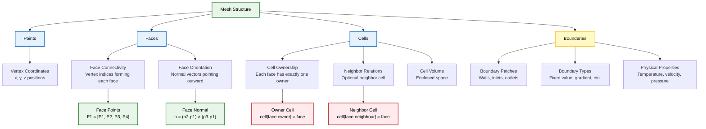

```mermaid
graph TD
    A["OpenFOAM Case Structure"] --> B["0/ Directory"]
    A --> C["constant/ Directory"]
    A --> D["system/ Directory"]
    
    B --> B1["U<br/>Velocity Field"]
    B --> B2["p<br/>Pressure Field"]
    B --> B3["T<br/>Temperature Field"]
    B --> B4["k<br/>Turbulent Kinetic Energy"]
    B --> B5["epsilon<br/>Dissipation Rate"]
    
    C --> C1["polyMesh<br/>Mesh Data"]
    C --> C2["transportProperties<br/>Fluid Properties"]
    C --> C3["turbulenceProperties<br/>Turbulence Model"]
    C --> C4["thermophysicalProperties<br/>Thermodynamics"]
    
    D --> D1["controlDict<br/>Solver Control"]
    D --> D2["fvSchemes<br/>Discretization Schemes"]
    D --> D3["fvSolution<br/>Linear Solver Settings"]
    D --> D4["decomposeParDict<br/>Parallel Decomposition"]
    
    classDef directory fill:#e3f2fd,stroke:#1565c0,stroke-width:2px,color:#000;
    classDef field fill:#e8f5e9,stroke:#2e7d32,stroke-width:2px,color:#000;
    classDef config fill:#fff9c4,stroke:#fbc02d,stroke-width:2px,color:#000;
    classDef root fill:#ffebee,stroke:#c62828,stroke-width:2px,color:#000;
    
    class A root;
    class B,C,D directory;
    class B1,B2,B3,B4,B5 field;
    class C1,C2,C3,C4,D1,D2,D3,D4 config;
```

## บทนํา

OpenFOAM ใช้โครงสร้างไดเรกทอรีมาตรฐานสำหรับการจำลอง CFD ทั้งหมด ซึ่งเรียกว่า "cases" การทำความเข้าใจโครงสร้างนี้เป็น **สิ่งสำคัญพื้นฐาน** สำหรับการทำงานกับ OpenFOAM อย่างมีประสิทธิภาพ

ส่วนนี้จะให้ภาพรวมที่ครอบคลุมของการจัดระเบียบไดเรกทอรี OpenFOAM case และวัตถุประสงค์ของแต่ละไดเรกทอรี

## ภาพรวมโครงสร้าง OpenFOAM Case

OpenFOAM case ถูกจัดระเบียบออกเป็น **สามไดเรกทอรีหลัก** ที่บรรจุข้อมูลที่จำเป็นทั้งหมดสำหรับการจำลอง CFD:

```
case/
├── 0/           # เงื่อนไขเริ่มต้นและเงื่อนไขขอบเขต
├── constant/    # Mesh และคุณสมบัติทางกายภาพ
└── system/      # การควบคุม Solver และการตั้งค่าเชิงตัวเลข
```





---

## ไดเรกทอรี 0/

ไดเรกทอรี `0/` บรรจุ **เงื่อนไขเริ่มต้น** และ **เงื่อนไขขอบเขต** สำหรับตัวแปร field ทั้งหมด

ปริมาณทางกายภาพแต่ละรายการ (ความเร็ว, ความดัน, อุณหภูมิ, เป็นต้น) มีไฟล์ของตัวเองในไดเรกทอรีนี้

ไฟล์เหล่านี้กำหนด:
- **ค่า field เริ่มต้น** ตลอดทั้งโดเมน
- **ประเภทและค่าของ Boundary condition** ที่ขอบเขตของ Mesh
- **รูปแบบการประมาณค่า Field** (Field interpolation schemes)

### ไฟล์ field หลัก

| ชื่อไฟล์ | ประเภท | คำอธิบาย |
|-----------|--------|-----------|
| `U` | Vector field | ความเร็วของของไหล |
| `p` | Scalar field | ความดัน |
| `T` | Scalar field | อุณหภูมิ (สำหรับการจำลองความร้อน) |
| `k`, `omega`, `epsilon` | Scalar fields | ตัวแปรของ Turbulence model |
| `alpha.phaseName` | Scalar field | สัดส่วนเฟส (สำหรับ Multiphase flow) |

---

## ไดเรกทอรี constant/

ไดเรกทอรี `constant/` บรรจุ **ข้อมูลที่ไม่ขึ้นกับเวลา** และ **ข้อมูล Mesh**

### ข้อมูล Mesh

#### โครงสร้าง `polyMesh/`

บรรจุคำจำกัดความของ Mesh ที่สมบูรณ์:

- **`points`**: พิกัดจุดยอดของ Mesh (Mesh vertex coordinates)
- **`faces`**: การเชื่อมต่อของหน้า Mesh (Mesh face connectivity)
- **`owner`**: การเป็นเจ้าของ Cell สำหรับหน้า (Cell ownership for faces)
- **`neighbour`**: ความสัมพันธ์ของ Cell ข้างเคียง (Cell neighbor relationships)
- **`boundary`**: คำจำกัดความของ Boundary patch





### คุณสมบัติทางกายภาพ

| ชื่อไฟล์ | คำอธิบาย |
|-----------|-----------|
| `transportProperties` | ความหนืดและความหนาแน่นของของไหล |
| `thermophysicalProperties` | โมเดลและคุณสมบัติทางเทอร์โมไดนามิก |
| `turbulenceProperties` | การตั้งค่า Turbulence model |
| `g` | เวกเตอร์แรงโน้มถ่วง (ถ้ามี) |
| `environmentalProperties` | พารามิเตอร์สิ่งแวดล้อม |

---

## ไดเรกทอรี system/

ไดเรกทอรี `system/` บรรจุ **การควบคุม Solver** และ **การตั้งค่า Numerical scheme**

### พารามิเตอร์ควบคุม

| ชื่อไฟล์ | วัตถุประสงค์ |
|-----------|-------------|
| `controlDict` | การควบคุม Time stepping และ Output |
| `fvSchemes` | Discretization schemes สำหรับ Spatial derivative |
| `fvSolution` | การตั้งค่า Linear solver และการควบคุม Algorithm |
| `decomposeParDict` | การกำหนดค่า Parallel processing |
| `setFieldsDict` | ข้อกำหนดการเริ่มต้น Field |

---

## ไดเรกทอรีเวลา (Time Directories)

ในระหว่างการจำลองแบบ **Transient**, OpenFOAM จะสร้างไดเรกทอรีเวลาเพิ่มเติม (เช่น `0.1/`, `0.2/`, `1/`, `2/`)

ไดเรกทอรีเหล่านี้:
- บรรจุ **ข้อมูล Field** ที่ Time step ที่กำหนด
- มีโครงสร้างเหมือนกับไดเรกทอรี `0/`
- บรรจุ **ค่า Field ที่คำนวณได้** แทนที่จะเป็นเงื่อนไขเริ่มต้น


---

## บริบททางคณิตศาสตร์

ในการ Discretization แบบ **Finite volume**, โดเมนการคำนวณ $\Omega$ จะถูกแบ่งออกเป็น Control volume $V_P$ รอบจุดศูนย์กลาง Cell แต่ละจุด $P$

ค่า Field ที่เก็บไว้ในไดเรกทอรีเวลาแสดงถึงการประมาณค่าแบบ Discrete ของ Continuous field $\phi(\mathbf{x},t)$ ณ เวลา $t_n$ ที่กำหนด:

$$\phi_P^n \approx \phi(\mathbf{x}_P, t_n)$$

โดยที่:
- $\phi_P^n$ = ค่า field ที่จุดศูนย์กลาง cell $P$ ในเวลา $t_n$
- $\mathbf{x}_P$ = พิกัดของจุดศูนย์กลาง cell $P$
- $t_n$ = เวลาใน time step ที่ $n$

ข้อมูล Mesh ใน `constant/polyMesh/` กำหนดความสัมพันธ์ทางเรขาคณิตที่จำเป็นในการคำนวณ Flux ระหว่าง Cell ข้างเคียงโดยใช้ Gauss divergence theorem:

$$\int_{V_P} \nabla \cdot \mathbf{F} \, \mathrm{d}V = \sum_{f} \mathbf{F}_f \cdot \mathbf{S}_f$$

โดยที่:
- $V_P$ = ปริมาตรของ cell $P$
- $\mathbf{F}$ = Vector field ใดๆ
- $\mathbf{F}_f$ = ค่า field ที่หน้า $f$
- $\mathbf{S}_f$ = เวกเตอร์พื้นที่ผิวของหน้า $f$

---

## หลักการตั้งชื่อไฟล์มาตรฐาน

OpenFOAM ใช้หลักการตั้งชื่อที่สอดคล้องกัน:

| ประเภทไฟล์ | รูปแบบการตั้งชื่อ | ตัวอย่าง |
|-------------|-------------------|-----------|
| Field | ใช้ชื่อตัวแปร | `U`, `p`, `T` |
| Property | ลงท้ายด้วย `Properties` | `transportProperties` |
| Control | ลงท้ายด้วย `Dict` | `controlDict` |
| Mesh | ใช้ชื่อที่สื่อความหมาย | `points`, `faces`, `boundary` |

---

## ขั้นตอนการทำงานของ Case

ขั้นตอนการทำงานโดยทั่วไปประกอบด้วย:

1. **การสร้างโครงสร้างไดเรกทอรี**
2. **การสร้าง Mesh** ใน `constant/polyMesh/`
3. **การตั้งค่า Initial condition** ใน `0/`
4. **การกำหนดค่า Solver** ใน `system/`
5. **การรัน Solver**
6. **การประมวลผลผลลัพธ์** จาก Time directory

### ขั้นตอนการทำงานแบบ Step-by-Step

```
Algorithm: OpenFOAM Case Setup
Input: Problem domain and physics
Output: Ready-to-run simulation

1. CREATE directory structure:
   mkdir case
   mkdir case/0 case/constant case/system

2. GENERATE mesh:
   - Run blockMesh/snappyHexMesh
   - Store in constant/polyMesh/

3. SETUP initial conditions:
   - Create field files in 0/
   - Define boundary conditions

4. CONFIGURE solver:
   - Set controlDict parameters
   - Choose discretization schemes
   - Configure linear solvers

5. EXECUTE simulation:
   - Run solver application
   - Monitor convergence

6. POST-PROCESS results:
   - Analyze time directories
   - Visualize with paraFoam
```

---

## ข้อดีของโครงสร้างมาตรฐาน

โครงสร้างที่เป็นมาตรฐานนี้ช่วยให้ OpenFOAM utilities สามารถ:

- **ค้นหาและประมวลผลไฟล์** ที่เหมาะสมสำหรับการจำลอง CFD ใดๆ ได้โดยอัตโนมัติ
- **ใช้เครื่องมือเดียวกัน** กับแอปพลิเคชันต่างๆ ได้โดยไม่ต้องแก้ไข
- **รับประกันความสม่ำเสมอ** ในการจัดการข้อมูลระหว่าง solvers ต่างๆ
- **สนับสนุนการทำงานแบบขนาน** ผ่านโครงสร้างข้อมูลที่เป็นระเบียบ

**นี่คือรากฐาน** ที่ทำให้ OpenFOAM เป็นแพลตฟอร์ม CFD ที่ยืดหยุ่นและขยายได้
