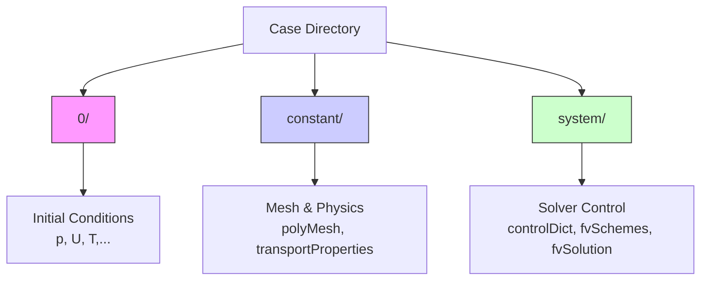
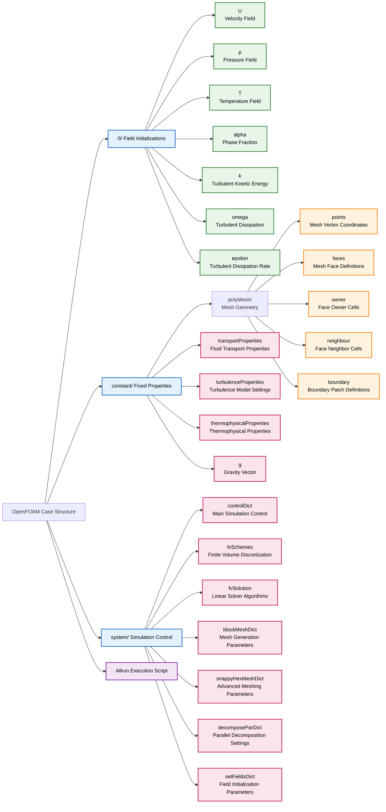
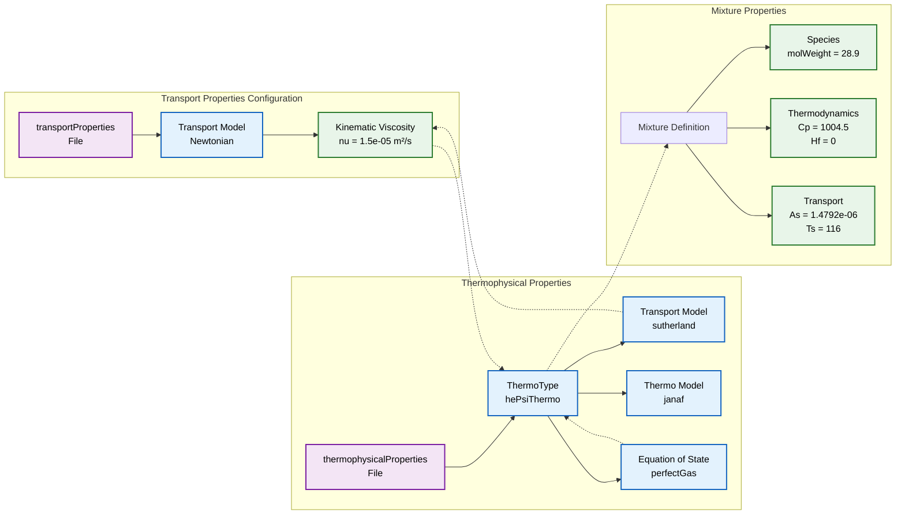
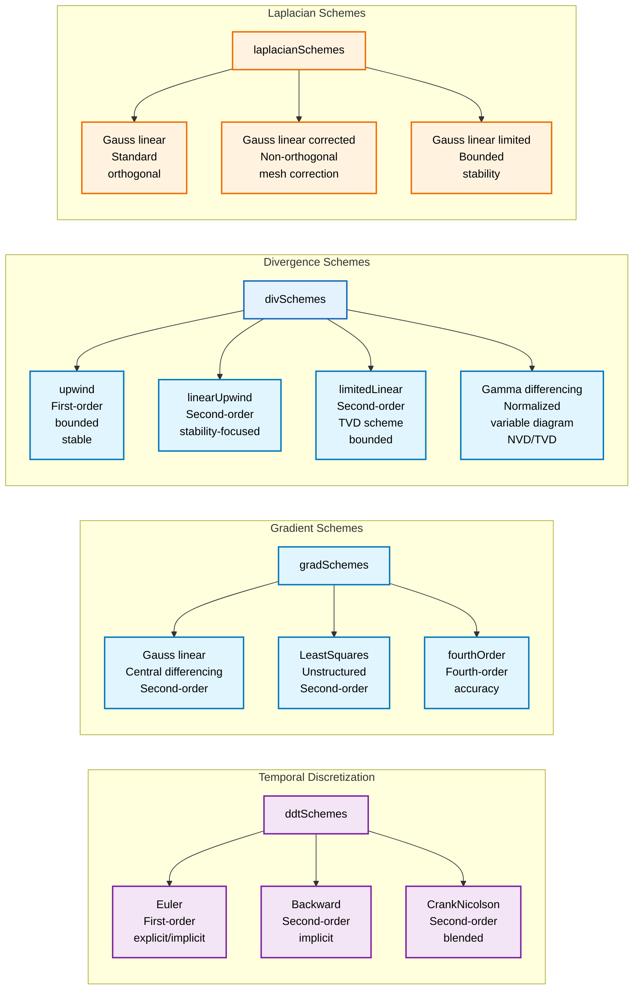

# โครงสร้างของ OpenFOAM Case

ทุกกรณีการจำลอง (simulation case) คือไดเรกทอรีที่ประกอบด้วยชุดของไดเรกทอรีย่อยและไฟล์ข้อความ OpenFOAM ไม่ใช้ไฟล์อินพุตไบนารีเพียงไฟล์เดียว

## สามองค์ประกอบหลักของไดเรกทอรี

Case ที่น้อยที่สุด *ต้อง* มีสามไดเรกทอรีนี้:



### 1. ไดเรกทอรี `0/` (เวลา = 0)
**วัตถุประสงค์**: จัดเก็บสถานะเริ่มต้นของ Field
- **เนื้อหา**: หนึ่งไฟล์ต่อหนึ่งตัวแปร (เช่น `p` สำหรับ Pressure, `U` สำหรับ Velocity)
- **หน้าที่**: กำหนดค่าเริ่มต้นภายในโดเมน (`internalField`) และ Boundary Condition ที่ขอบ (`boundaryField`)

### 2. ไดเรกทอรี `constant/`
**วัตถุประสงค์**: จัดเก็บข้อมูลที่ไม่เปลี่ยนแปลง (โดยปกติ) ระหว่างการจำลอง
- **`polyMesh/`**: ไดเรกทอรีย่อยที่ประกอบด้วยการกำหนด Grid (Points, Faces, Cells)
- **`transportProperties`**: คุณสมบัติของไหล เช่น Viscosity ($\nu$) หรือ Density ($\rho$)
- **`turbulenceProperties`**: การตั้งค่าสำหรับ Turbulence Model (เช่น $k$-$\epsilon$)

### 3. ไดเรกทอรี `system/`
**วัตถุประสงค์**: ควบคุม *วิธีการ* ดำเนินการจำลอง
- **`controlDict`**: ไฟล์ควบคุม "หลัก" กำหนดเวลาเริ่มต้น, เวลาสิ้นสุด, Time-step ($\Delta t$) และช่วงเวลาการเขียนข้อมูล
- **`fvSchemes`**: Discretization schemes ทางคณิตศาสตร์ (เช่น Upwind, Central Differencing)
- **`fvSolution`**: การตั้งค่า Linear Solver (เช่น Tolerances, Relaxation factors)
- **`blockMeshDict`**: อินพุตสำหรับ Mesh Generator ในตัว (เป็นทางเลือก แต่พบบ่อย)

## โครงสร้างโดยละเอียดของ OpenFOAM Case ที่สมบูรณ์

### ลำดับชั้นของไฟล์ Case
```
case_directory/
├── 0/                           # Initial field data (time = 0)
│   ├── p                        # Pressure field
│   ├── U                        # Velocity field
│   ├── T                        # Temperature field
│   ├── k                        # Turbulent kinetic energy
│   ├── epsilon                  # Turbulent dissipation rate
│   ├── nut                      # Turbulent viscosity
│   └── alphat                   # Turbulent thermal diffusivity
├── constant/                    # Time-independent data
│   ├── polyMesh/                # Mesh definition
│   │   ├── points               # Mesh vertex coordinates
│   │   ├── faces                # Mesh face connectivity
│   │   ├── owner                # Face owner cells
│   │   ├── neighbour            # Face neighbor cells
│   │   └── boundary             # Boundary patch definitions
│   ├── transportProperties      # Fluid transport properties
│   ├── turbulenceProperties     # Turbulence model settings
│   ├── thermophysicalProperties # Thermophysical properties
│   └── g                        # Gravity vector
├── system/                      # Simulation control settings
│   ├── controlDict              # Main simulation control
│   ├── fvSchemes                # Finite volume discretization
│   ├── fvSolution               # Linear solver algorithms
│   ├── blockMeshDict            # Mesh generation parameters
│   ├── snappyHexMeshDict        # Advanced meshing parameters
│   ├── decomposeParDict         # Parallel decomposition settings
│   └── setFieldsDict            # Field initialization parameters
└── Allrun                       # Automated execution script
```





## ไดเรกทอรี `0/`: การกำหนดค่าเริ่มต้นของ Field

ไฟล์ Field แต่ละไฟล์ในไดเรกทอรี `0/` มีโครงสร้างที่สอดคล้องกัน นี่คือตัวอย่าง Field ของ Pressure ทั่วไป:

```cpp
FoamFile
{
    version     2.0;
    format      ascii;
    class       volScalarField;
    object      p;
}
// * * * * * * * * * * * * * * * * //

dimensions [0 2 -2 0 0 0 0];

internalField uniform 0;

boundaryField
{
    inlet
    {
        type            fixedValue;
        value           uniform 101325;
    }
    outlet
    {
        type            zeroGradient;
    }
    walls
    {
        type            noSlip;
    }
    symmetry
    {
        type            symmetryPlane;
    }
}
```

**องค์ประกอบหลัก:**
- **Header**: ข้อมูลรูปแบบไฟล์และประเภท Field
- **Dimensions**: หน่วยทางกายภาพในรูปแบบ [mass length time temperature moles current] ของ OpenFOAM
- **Internal Field**: ค่าเริ่มต้นภายในโดเมนการคำนวณ
- **Boundary Field**: เงื่อนไขที่ใช้กับแต่ละ Boundary Patch

## ไดเรกทอรี `constant/`: คุณสมบัติทางกายภาพ

### Transport Properties
```cpp
FoamFile
{
    version     2.0;
    format      ascii;
    class       dictionary;
    location    "constant";
    object      transportProperties;
}
// * * * * * * * * * * * * * * * * //

transportModel  Newtonian;

nu              [0 2 -1 0 0 0 0] 1.5e-05;  // Kinematic viscosity [m²/s]
```

### Thermophysical Properties
```cpp
FoamFile
{
    version     2.0;
    format      ascii;
    class       dictionary;
    location    "constant";
    object      thermophysicalProperties;
}
// * * * * * * * * * * * * * * * * //

thermoType
{
    type            hePsiThermo;
    mixture         pureMixture;
    transport       sutherland;
    thermo          janaf;
    energy          sensibleEnthalpy;
    equationOfState perfectGas;
    specie          specie;
}

mixture
{
    specie
    {
        molWeight       28.9;
    }
    thermodynamics
    {
        Cp              1004.5;
        Hf              0;
    }
    transport
    {
        As              1.4792e-06;
        Ts              116;
    }
}
```





## ไดเรกทอรี `system/`: การควบคุมเชิงตัวเลข

### controlDict - การควบคุมการจำลองหลัก
```cpp
FoamFile
{
    version     2.0;
    format      ascii;
    class       dictionary;
    location    "system";
    object      controlDict;
}
// * * * * * * * * * * * * * * * * //

application     simpleFoam;
startFrom       startTime;
startTime       0;
stopAt          endTime;
endTime         1000;
deltaT          1;
writeControl    timeStep;
writeInterval   100;
purgeWrite      0;
runTimeModifiable true;

functions
{
    probeFields
    {
        type            probes;
        fields          (p U);
        probeLocations  ((0.1 0.1 0.01) (0.2 0.2 0.01));
        writeFields     false;
    }
}
```

### fvSchemes - Discretization Schemes
```cpp
FoamFile
{
    version     2.0;
    format      ascii;
    class       dictionary;
    location    "system";
    object      fvSchemes;
}
// * * * * * * * * * * * * * * * * //

ddtSchemes
{
    default         steadyState;
}

gradSchemes
{
    default         Gauss linear;
    grad(p)         Gauss linear;
    grad(U)         Gauss linear;
}

divSchemes
{
    default         none;
    div(phi,U)      bounded Gauss upwind;
    div(phi,k)      bounded Gauss upwind;
    div(phi,epsilon) bounded Gauss upwind;
    div((nuEff*dev2(T(grad(U))))) Gauss linear;
}

laplacianSchemes
{
    default         Gauss linear corrected;
}

interpolationSchemes
{
    default         linear;
}

snGradSchemes
{
    default         corrected;
}
```





### fvSolution - การตั้งค่า Linear Solver
```cpp
FoamFile
{
    version     2.0;
    format      ascii;
    class       dictionary;
    location    "system";
    object      fvSolution;
}
// * * * * * * * * * * * * * * * * //

solvers
{
    p
    {
        solver          GAMG;
        tolerance       1e-06;
        relTol          0.01;
        smoother        GaussSeidel;
        nPreSweeps      0;
        nPostSweeps     2;
        cacheAgglomeration true;
    }
    
    U
    {
        solver          smoothSolver;
        smoother        GaussSeidel;
        tolerance       1e-05;
        relTol          0;
    }
    
    "(k|epsilon|nut)"
    {
        solver          smoothSolver;
        smoother        GaussSeidel;
        tolerance       1e-05;
        relTol          0;
    }
}

SIMPLE
{
    nNonOrthogonalCorrectors 0;
    pRefCell        0;
    pRefValue       0;
}

relaxationFactors
{
    fields
    {
        p               0.3;
    }
    equations
    {
        U               0.7;
        k               0.7;
        epsilon         0.7;
    }
}
```

## ขั้นตอนการสร้าง Case

### ขั้นตอนที่ 1: การสร้างโครงสร้างไดเรกทอรี
```bash
mkdir -p my_case/{0,constant,system}
cd my_case
```

### ขั้นตอนที่ 2: การสร้าง Mesh
สำหรับรูปทรงเรขาคณิตอย่างง่ายโดยใช้ blockMesh:
```bash
cp $FOAM_TUTORIALS/incompressible/icoFoam/cavity/system/blockMeshDict system/
blockMesh
```

### ขั้นตอนที่ 3: การกำหนดค่าเริ่มต้นของ Field
สร้าง Initial Condition ตามประเภท Boundary:
```bash
cp $FOAM_TUTORIALS/incompressible/icoFoam/cavity/0/* 0/
```

### ขั้นตอนที่ 4: แก้ไขคุณสมบัติทางฟิสิกส์
แก้ไข Transport Properties, Turbulence Model และอื่นๆ:
```bash
vim constant/transportProperties
vim constant/turbulenceProperties
```

### ขั้นตอนที่ 5: กำหนดค่าการตั้งค่า Solver
ปรับพารามิเตอร์ควบคุม, Numerical Schemes และ Tolerances:
```bash
vim system/controlDict
vim system/fvSchemes
vim system/fvSolution
```

## ประเภทของ Boundary Condition ที่พบบ่อย

### Velocity Boundary Conditions
```cpp
// Fixed value (Dirichlet)
inlet
{
    type            fixedValue;
    value           uniform (10 0 0);  // [m/s]
}

// Zero gradient (Neumann)
outlet
{
    type            zeroGradient;
}

// No-slip wall
walls
{
    type            noSlip;
}

// Symmetry plane
symmetry
{
    type            symmetryPlane;
}
```

### Pressure Boundary Conditions
```cpp
// Fixed value
outlet
{
    type            fixedValue;
    value           uniform 0;  // Gauge pressure
}

// Zero gradient (typical for pressure outlet)
inlet
{
    type            zeroGradient;
}

// Calculated (derived from velocity field)
walls
{
    type            calculated;
    value           uniform 0;
}
```

## ไฟล์ Case เพิ่มเติม

### decompositionDict (การประมวลผลแบบขนาน)
```cpp
FoamFile
{
    version     2.0;
    format      ascii;
    class       dictionary;
    location    "system";
    object      decomposeParDict;
}
// * * * * * * * * * * * * * * * * //

numberOfSubdomains 8;

method          hierarchical;
// method          metis;
// method          scotch;

hierarchicalCoeffs
{
    n               (2 4 1);
    delta           0.001;
    order           xyz;
}
```

### setFieldsDict (การกำหนดค่าเริ่มต้นของ Field)
```cpp
FoamFile
{
    version     2.0;
    format      ascii;
    class       dictionary;
    location    "system";
    object      setFieldsDict;
}
// * * * * * * * * * * * * * * * * //

defaultFieldValues
{
    volScalarFieldValue alpha.water 0;
}

regions
{
    boxToCell
    {
        box (0 0 0) (0.5 0.5 0.1);
        fieldValues
        {
            volScalarFieldValue alpha.water 1;
        }
    }
}
```

## รายการตรวจสอบการตรวจสอบ Case

### การตรวจสอบก่อนการจำลอง
1. **Directory Structure**: ตรวจสอบว่ามีไดเรกทอรีที่จำเป็นทั้งหมด
2. **Mesh Quality**: รัน `checkMesh` และตรวจสอบสถิติ
3. **Boundary Consistency**: ตรวจสอบว่า Mesh Boundary ตรงกับ Field Boundary
4. **Dimensional Consistency**: ตรวจสอบ Dimensions ของ Field ทั้งหมด
5. **Physical Properties**: ตรวจสอบว่าคุณสมบัติของไหลมีความสมเหตุสมผล

### การตรวจสอบระหว่างการจำลอง
1. **การลู่เข้า (Convergence)**: ตรวจสอบ Residual ผ่าน `solverInfo` หรือ Log files
2. **ความเสถียร (Stability)**: ตรวจสอบหาความไม่เสถียรเชิงตัวเลขหรือการลู่ออก
3. **ความสมเหตุสมผลทางกายภาพ**: ตรวจสอบว่าค่า Field ยังคงมีความหมายทางกายภาพ
4. **การอนุรักษ์มวล (Mass Conservation)**: ตรวจสอบสมดุลมวลรวมหากเกี่ยวข้อง

โครงสร้าง Case ที่ครอบคลุมนี้เป็นรากฐานสำหรับการจำลอง OpenFOAM ทั้งหมด เพื่อให้มั่นใจถึงการจัดระเบียบที่เหมาะสมและการทำซ้ำผลลัพธ์ของการศึกษา CFD
