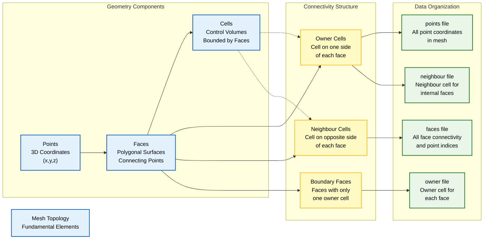

# การวิเคราะห์โครงสร้าง Directory โดยละเอียดใน OpenFOAM

## Directory ที่เกี่ยวข้องกับเวลา (`0/`, `0.1/`, `100/`)

OpenFOAM ใช้โครงสร้าง Directory ที่อิงตามเวลาสำหรับการจัดเก็บผลลัพธ์การ Simulation โดยจะสร้าง Directory ใหม่ที่มีชื่อตามเวลาปัจจุบันของ Simulation

**วิธีการนี้ช่วยให้:**
- การจัดระเบียบข้อมูลตามช่วงเวลามีความชัดเจน
- อำนวยความสะดวกในการเข้าถึงข้อมูล ณ ช่วงเวลาที่กำหนด
- รองรับการวิเคราะห์ผลลัพธ์แบบ Temporal

```mermaid
graph TD
    Root["OpenFOAM Case Directory"] --> Time0["0/"]
    Root --> Time01["0.1/"]
    Root --> Time02["0.2/"]
    Root --> Time03["..."]
    Root --> Time10["1.0/"]
    
    Time0 --> FieldU["U<br/><i>Velocity Field</i>"]
    Time0 --> FieldP["p<br/><i>Pressure Field</i>"]
    Time0 --> FieldT["T<br/><i>Temperature Field</i>"]
    Time0 --> FieldK["k<br/><i>Turbulence Kinetic Energy</i>"]
    Time0 --> FieldEpsilon["epsilon<br/><i>Dissipation Rate</i>"]
    
    Time01 --> U01["U"]
    Time01 --> P01["p"]
    Time01 --> T01["T"]
    Time01 --> K01["k"]
    Time01 --> E01["epsilon"]
    
    Time02 --> U02["U"]
    Time02 --> P02["p"]
    Time02 --> T02["T"]
    Time02 --> K02["k"]
    Time02 --> E02["epsilon"]
    
    Time10 --> U10["U"]
    Time10 --> P10["p"]
    Time10 --> T10["T"]
    Time10 --> K10["k"]
    Time10 --> E10["epsilon"]
    
    classDef root fill:#f3e5f5,stroke:#7b1fa2,stroke-width:3px,color:#000;
    classDef timeDir fill:#e8eaf6,stroke:#3949ab,stroke-width:2px,color:#000;
    classDef field fill:#e1f5fe,stroke:#0288d1,stroke-width:2px,color:#000;
    
    class Root root;
    class Time0,Time01,Time02,Time03,Time10 timeDir;
    class FieldU,FieldP,FieldT,FieldK,FieldEpsilon,U01,P01,T01,K01,E01,U02,P02,T02,K02,E02,U10,P10,T10,K10,E10 field;
```





### Directory สำหรับเงื่อนไขเริ่มต้น (`0/`)

Directory `0/` บรรจุ **Initial Conditions** สำหรับ Field ทั้งหมดในการ Simulation

**โครงสร้างหลัก:**
- แต่ละ Physical Field (velocity, pressure, temperature) มีไฟล์ของตัวเอง
- กำหนดการกระจายตัวเชิงพื้นที่ ณ จุดเริ่มต้นของ Simulation
- มีโครงสร้างที่สอดคล้องกันทั้งหมด

### Directory ของ Time Step

ระหว่างการดำเนินการ Simulation, OpenFOAM จะสร้าง Directory สำหรับแต่ละ Time Step โดยอัตโนมัติ

**การสร้าง Directory ขึ้นอยู่กับ:**
- การตั้งค่า `writeControl` ใน `system/controlDict`
- ช่วงเวลาปกติ (เช่น ทุก 0.1 วินาที)
- ตามจำนวน Time Step ที่กำหนด (เช่น ทุก 100 Time Step)

### โครงสร้างไฟล์ Field

ไฟล์ Field แต่ละไฟล์ประกอบด้วย:

- **`dimensions`**: หน่วยทางกายภาพในระบบ `[mass length time temperature quantity moles]`
- **`internalField`**: Initial Conditions สำหรับภายใน computational domain
- **`boundaryField`**: ข้อกำหนด Boundary Condition สำหรับแต่ละ Mesh patch

**ตัวอย่างไฟล์ Field สำหรับ velocity (`0/U`):**
```cpp
FoamFile
{
    version     2.0;
    format      ascii;
    class       volVectorField;
    object      U;
}
dimensions      [0 1 -1 0 0 0 0];  // Units: m/s

internalField   uniform (0 0 0);   // Initial velocity: zero everywhere

boundaryField
{
    inlet
    {
        type            fixedValue;
        value           uniform (10 0 0);  // Inlet velocity: 10 m/s in x-direction
    }
    outlet
    {
        type            zeroGradient;       // Neumann BC: ∂U/∂n = 0
    }
    walls
    {
        type            noSlip;            // No-slip condition: U = 0
    }
    symmetry
    {
        type            symmetryPlane;     // Symmetry boundary
    }
}
```

## Directory `constant/`

Directory `constant/` บรรจุข้อมูลที่ **ไม่เปลี่ยนแปลงตามเวลา** ซึ่งคงที่ตลอดการ Simulation

**ข้อมูลประกอบด้วย:**
- Mesh topology
- Physical Properties  
- Model Parameters

### Directory `constant/polyMesh/`

Directory นี้บรรจุ **Mesh topology พื้นฐาน** ที่กำหนด Geometry ของ computational domain

**ข้อควรระวัง:** โดยทั่วไปไฟล์เหล่านี้จะถูกสร้างขึ้นโดยอัตโนมัติด้วย Meshing Utilities และ **ไม่ควรแก้ไขด้วยตนเอง**





#### ไฟล์ Mesh หลัก

| ไฟล์ | คำอธิบาย | หน้าที่หลัก |
|-------|-----------|-------------|
| **`points`** | พิกัด Cartesian ของ Mesh vertices | กำหนดตำแหน่ง (x, y, z) ของทุกจุดใน mesh |
| **`faces`** | รายการ Mesh faces | กำหนดขอบเขตของแต่ละ cell ด้วยลำดับ points |
| **`owner`** | Cell ownership ของแต่ละ face | กำหนด cell ที่เป็น "เจ้าของ" face (ตามทิศทาง normal) |
| **`neighbour`** | Cell adjacency | แสดง cell ข้างเคียงสำหรับ interior faces |
| **`boundary`** | Boundary patches | กำหนดชนิดและคุณสมบัติของ boundary patches |

**คำอธิบายเพิ่มเติม:**

- **`points`**: แต่ละจุดถูกกำหนดด้วยพิกัด (x, y, z) สัมพัทธ์กับจุดกำเนิดของระบบพิกัด

- **`faces`**: แต่ละ Face ถูกกำหนดด้วยลำดับของจุดที่ประกอบกันเป็นขอบเขต สามารถเป็นรูปสามเหลี่ยม สี่เหลี่ยม หรือรูปหลายเหลี่ยม

- **`owner`/`neighbour`**: กำหนดความสัมพันธ์การเชื่อมต่อระหว่าง Cell กับ Face (Boundary Faces ไม่มี Neighbour)

- **`boundary`**: ข้อกำหนดประกอบด้วย:
  - ตัวระบุชื่อ (Name identifier)
  - ประเภท (Type) (เช่น wall, patch, symmetryPlane, cyclic)
  - จำนวน Faces ที่ประกอบกัน
  - ดัชนีเริ่มต้นและขนาดของ Face

- **`facesZones`** และ **`pointZones`**: การกำหนด Zone เสริมสำหรับการจัดการ Mesh และ Specialized Boundary Conditions

### Physical Properties

Subdirectories เพิ่มเติมใน `constant/` อาจประกอบด้วย:

| ไฟล์ | คำอธิบาย | การใช้งาน |
|-------|-----------|-------------|
| **`transportProperties`** | ความหนืดและความหนาแน่นของ Fluid | กำหนดค่า ν, ρ สำหรับการไหลของของไหล |
| **`thermophysicalProperties`** | Thermodynamic properties | สำหรับ Heat Transfer Simulations |
| **`turbulenceProperties`** | สัมประสิทธิ์ Turbulence Model | ค่าการตั้งค่า k-ε, k-ω, ฯลฯ |
| **`reactionProperties`** | พารามิเตอร์ปฏิกิริยาเคมี | สำหรับ Combustion Simulations |

## Directory `system/`

Directory `system/` ทำหน้าที่เป็น **ศูนย์ควบคุม** สำหรับการ Simulation โดยบรรจุไฟล์ Configuration ที่ควบคุม:

- **Numerical Methods**
- **Solver Behavior**
- **Execution Parameters**

```mermaid
graph TD
    subgraph "System Directory Configuration"
        controlDict["controlDict<br/><i>Main simulation controller</i>"]
        fvSchemes["fvSchemes<br/><i>Numerical schemes</i>"]
        fvSolution["fvSolution<br/><i>Solver settings</i>"]
        decomposeParDict["decomposeParDict<br/><i>Parallel processing</i>"]
    end
    
    subgraph "Control Parameters"
        timeControl["Time control<br/><i>start, end, deltaT</i>"]
        writeControl["Write control<br/><i>output frequency</i>"]
        functions["Functions<br/><i>probes, sampling</i>"]
        libs["Libraries<br/><i>dynamic loading</i>"]
    end
    
    subgraph "Numerical Methods"
        timeScheme["Time schemes<br/><i>Euler, backward, CrankNicolson</i>"]
        gradScheme["Gradient schemes<br/><i>Gauss, leastSquares</i>"]
        divScheme["Divergence schemes<br/><i>upwind, linear, limited</i>"]
        laplacianScheme["Laplacian schemes<br/><i>Gauss linear corrected</i>"]
    end
    
    subgraph "Solver Configuration"
        solvers["Linear solvers<br/><i>GAMG, PCG, smoothSolver</i>"]
        preconditioner["Preconditioners<br/><i>DIC, GAMG, none</i>"]
        tolerance["Convergence<br/><i>tolerance, relTol</i>"]
        relaxation["Relaxation factors<br/><i>under-relaxation</i>"]
    end
    
    subgraph "Parallel Processing"
        method["Decomposition method<br/><i>simple, hierarchical, metis</i>"]
        numberOfSubdomains["Number of processors<br/><i>np</i>"]
        weights["Processor weights<br/><i>load balancing</i>"]
    end
    
    controlDict --> timeControl
    controlDict --> writeControl
    controlDict --> functions
    controlDict --> libs
    
    fvSchemes --> timeScheme
    fvSchemes --> gradScheme
    fvSchemes --> divScheme
    fvSchemes --> laplacianScheme
    
    fvSolution --> solvers
    fvSolution --> preconditioner
    fvSolution --> tolerance
    fvSolution --> relaxation
    
    decomposeParDict --> method
    decomposeParDict --> numberOfSubdomains
    decomposeParDict --> weights
    
    style controlDict fill:#e3f2fd,stroke:#1565c0,stroke-width:2px,color:#000;
    style fvSchemes fill:#e3f2fd,stroke:#1565c0,stroke-width:2px,color:#000;
    style fvSolution fill:#e3f2fd,stroke:#1565c0,stroke-width:2px,color:#000;
    style decomposeParDict fill:#e3f2fd,stroke:#1565c0,stroke-width:2px,color:#000;
    style timeControl fill:#fff9c4,stroke:#fbc02d,stroke-width:2px,color:#000;
    style writeControl fill:#fff9c4,stroke:#fbc02d,stroke-width:2px,color:#000;
    style functions fill:#fff9c4,stroke:#fbc02d,stroke-width:2px,color:#000;
    style libs fill:#fff9c4,stroke:#fbc02d,stroke-width:2px,color:#000;
    style timeScheme fill:#e8f5e9,stroke:#2e7d32,stroke-width:2px,color:#000;
    style gradScheme fill:#e8f5e9,stroke:#2e7d32,stroke-width:2px,color:#000;
    style divScheme fill:#e8f5e9,stroke:#2e7d32,stroke-width:2px,color:#000;
    style laplacianScheme fill:#e8f5e9,stroke:#2e7d32,stroke-width:2px,color:#000;
    style solvers fill:#ffebee,stroke:#c62828,stroke-width:2px,color:#000;
    style preconditioner fill:#ffebee,stroke:#c62828,stroke-width:2px,color:#000;
    style tolerance fill:#ffebee,stroke:#c62828,stroke-width:2px,color:#000;
    style relaxation fill:#ffebee,stroke:#c62828,stroke-width:2px,color:#000;
    style method fill:#f3e5f5,stroke:#7b1fa2,stroke-width:2px,color:#000;
    style numberOfSubdomains fill:#f3e5f5,stroke:#7b1fa2,stroke-width:2px,color:#000;
    style weights fill:#f3e5f5,stroke:#7b1fa2,stroke-width:2px,color:#000;
```





### `system/controlDict` - ตัวควบคุมหลักของ Simulation

ไฟล์นี้ควบคุมการดำเนินการ Simulation โดยรวมและการจัดการ Output

```cpp
FoamFile
{
    version     2.0;
    format      ascii;
    class       dictionary;
    object      controlDict;
}

application     simpleFoam;           // Solver selection
startFrom       startTime;            // Start condition
startTime       0;                    // Beginning simulation time
stopAt          endTime;              // Stop condition
endTime         1000;                 // Final simulation time
deltaT          0.001;                // Time step size
writeControl   timeStep;             // Output trigger
writeInterval  100;                  // Output frequency
purgeWrite     0;                    // Number of old time directories to keep
runTimeModifiable true;             // Allow runtime modification
functions
{
    // Additional function objects for monitoring and post-processing
}
```

**Parameters หลัก:**
- *`application`*: Solver ที่ใช้ (simpleFoam, icoFoam, pimpleFoam, ฯลฯ)
- *`startFrom`*: เงื่อนไขการเริ่มต้น (startTime/latestTime/firstTime)
- *`stopAt`*: เงื่อนไขการสิ้นสุด (endTime/writeNow/nextWrite/noStopNow)
- *`writeControl`*: การควบคุมการเขียนผลลัพธ์
- *`purgeWrite`*: จำนวน time directory ที่เก็บไว้ (0 = เก็บทั้งหมด)

### `system/fvSchemes` - การควบคุม Numerical Discretization

ไฟล์นี้ระบุ **Discretization Schemes** สำหรับ Differential Operators ต่างๆ

```cpp
FoamFile
{
    version     2.0;
    format      ascii;
    class       dictionary;
    object      fvSchemes;
}

ddtSchemes
{
    default         Euler;           // Temporal discretization
}

gradSchemes
{
    default         Gauss linear;    // Gradient calculation
}

divSchemes
{
    default         Gauss upwind;    // Default divergence scheme
    div(phi,U)      Gauss limitedLinearV 1;  // Convection with TVD
    div(phi,k)      Gauss upwind;    // Turbulent kinetic energy
    div(phi,epsilon) Gauss upwind;   // Dissipation rate
}

laplacianSchemes
{
    default         Gauss linear corrected;  // Diffusion with correction
}

interpolationSchemes
{
    default         linear;
}

snGradSchemes
{
    default         corrected;
}
```

**Discretization Schemes ทั่วไป:**

| Scheme Type | Options | คำอธิบาย | ความแม่นยำ |
|-------------|---------|-----------|-------------|
| **Temporal** | Euler, backward, CrankNicolson | การ discretize ค่าอนุพันธ์ตามเวลา | First/Second Order |
| **Gradient** | Gauss linear, leastSquares, fourthGrad | การคำนวณ gradient | First/Second/Fourth Order |
| **Divergence** | upwind, limitedLinear, linear | การ discretize ค่า divergence | First/Second Order |
| **Laplacian** | Gauss linear, corrected, uncorrected | การ discretize ค่า Laplacian | Second Order |

### `system/fvSolution` - การควบคุม Solver และ Algorithm

ไฟล์นี้กำหนดค่า **Linear Solvers**, **Convergence Criteria** และ **Pressure-Velocity Coupling Algorithms**

```cpp
FoamFile
{
    version     2.0;
    format      ascii;
    class       dictionary;
    object      fvSolution;
}

solvers
{
    p
    {
        solver          GAMG;              // Generalized geometric-algebraic multigrid
        tolerance       1e-06;             // Convergence tolerance
        relTol          0.1;               // Relative tolerance reduction
        smoother        GaussSeidel;       // Smoother for multigrid
        nPreSweeps      0;
        nPostSweeps     2;
        cacheAgglomerator true;
    }
    
    U
    {
        solver          PBiCGStab;         // Stabilized biconjugate gradient
        preconditioner  DILU;              // Diagonal incomplete LU
        tolerance       1e-05;
        relTol          0;
    }
}

SIMPLE
{
    nNonOrthogonalCorrectors 0;            // Non-orthogonal mesh corrections
    nCorrectors      2;                    // Number of pressure-velocity corrections
    nAlphaCorr       1;                    // Volume fraction corrections (multiphase)
    nEnergyCorrectors 1;                   // Energy equation corrections
    
    relaxationFactors                     // Under-relaxation for stability
    {
        fields
        {
            p               0.3;           // Pressure under-relaxation
            U               0.7;           // Momentum under-relaxation
            k               0.7;           // Turbulence under-relaxation
            epsilon         0.7;           // Dissipation under-relaxation
        }
    }
}

PIMPLE
{
    momentumPredictor   yes;              // Solve momentum equation predictor
    turbulentTransport  yes;              // Solve turbulence transport
    nOuterCorrectors    1;                // PIMPLE outer correctors
    nCorrectors        2;                 // PISO pressure correctors
    nNonOrthogonalCorrectors 0;           // Mesh non-orthogonality corrections
    pRefCell           0;                 // Reference cell for pressure
    pRefValue          0;                 // Reference pressure value
}
```

**Linear Solers ทั่วไป:**

| Solver | ประเภท | ความเร็ว | ความจำ | การใช้งาน |
|--------|--------|---------|-------|-----------|
| **GAMG** | Multigrid | เร็วมาก | ปานกลาง | Pressure, large systems |
| **PBiCGStab** | Krylov | เร็ว | น้อย | Velocity, asymmetric matrices |
| **PCG** | Krylov | เร็ว | น้อย | Symmetric positive definite |
| **SmoothSolver** | Iterative | ปานกลาง | น้อย | General purpose, diagonal dominant |

### Algorithm Flow

#### SIMPLE Algorithm (Steady-state)
1. **Guess pressure field** $p^{n}$
2. **Solve momentum equation** for velocity $U^{*}$
3. **Calculate mass fluxes** $\phi^{*}$
4. **Solve pressure correction equation** for $p'$
5. **Correct pressure**: $p^{n+1} = p^{n} + p'$
6. **Correct velocity** and mass fluxes
7. **Apply under-relaxation** and repeat until convergence

#### PISO Algorithm (Transient)
1. **Predict velocity field** using current pressure
2. **Solve momentum equation** for intermediate velocity
3. **Solve pressure correction** (multiple correctors)
4. **Correct velocity** and pressure
5. **Repeat pressure correction** steps if needed

### ไฟล์ Configuration เพิ่มเติม

ขึ้นอยู่กับประเภทของ Simulation อาจจำเป็นต้องมีไฟล์เพิ่มเติม:

| ไฟล์ | วัตถุประสงค์ | ประเภท Simulation |
|-------|---------------|------------------|
| **`system/setFieldsDict`** | การสร้าง Initial Field | Multiphase Flows |
| **`system/decomposeParDict`** | Domain Decomposition | Parallel Processing |
| **`system/fvOptions`** | Source Terms และ Modeling Options | Specialized Physics |
| **`system/topoSetDict`** | การสร้าง Cell/Face Set | Mesh Management |

## สรุปโครงสร้าง Directory

โครงสร้าง Directory ที่ครอบคลุมนี้ช่วยให้สามารถ **ควบคุมทุกแง่มุมของ CFD Simulation** ได้อย่างแม่นยำ:

- **Numerical Methods** ผ่าน `system/fvSchemes` และ `system/fvSolution`
- **Physical Modeling** ผ่าน `constant/` properties
- **Temporal Control** ผ่าน time directories
- **Execution Management** ผ่าน `system/controlDict`

**ข้อดีของโครงสร้างนี้:**
- การจัดระเบียบที่ชัดเจน
- ความสามารถในการทำซ้ำ (Reproducibility)
- การควบคุมรายละเอียดทุกขั้นตอน
- การสนับสนุนการพัฒนาและแก้ไข
