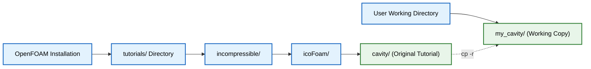
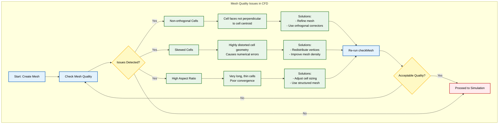
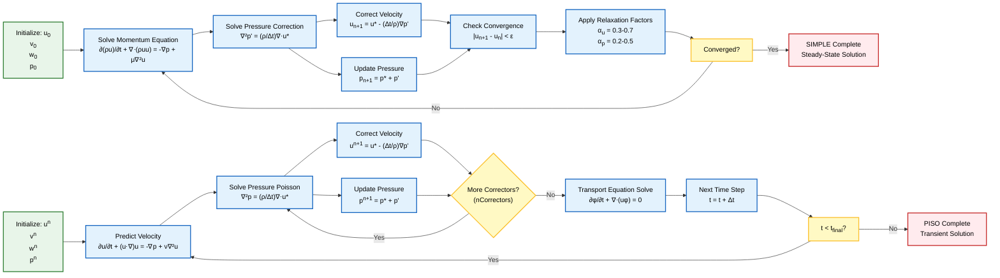

## แนวทางปฏิบัติที่ดีที่สุด

### 1. ห้ามแก้ไข Tutorial ต้นฉบับเด็ดขาด

**กฎพื้นฐาน**: คัดลอกกรณีศึกษา (tutorial cases) ไปยังไดเรกทอรีทำงานเสมอก่อนทำการแก้ไข

**เหตุผลที่สำคัญ:**
- **การรักษาสื่ออ้างอิง**: Tutorial ต้นฉบับทำหน้าที่เป็นตัวอย่างการทำงานและการเปรียบเทียบพื้นฐาน
- **การควบคุมเวอร์ชัน**: ช่วยให้การติดตั้ง OpenFOAM สะอาดสำหรับการอัปเดตในอนาคต
- **ความปลอดภัยในการเรียนรู้**: หากการแก้ไขของคุณทำให้ Case เสียหาย คุณสามารถเริ่มต้นใหม่ได้เสมอ





**การคัดลอก Tutorial:**
```bash
# Copy tutorial to working directory
cp -r $FOAM_TUTORIALS/incompressible/icoFoam/cavity my_cavity
cd my_cavity

# Copy tutorial for any solver
cp -r $FOAM_TUTORIALS/<category>/<solver>/<case> <your_case_name>
```

### 2. ควบคุม Time Step และ Courant Number

**Courant number (Co)** มีความสำคัญอย่างยิ่งต่อเสถียรภาพเชิงตัวเลข (numerical stability) ในการจำลองแบบชั่วคราว (transient simulations):

$$\text{Co} = \frac{|\mathbf{u}| \Delta t}{\Delta x}$$

**นิยามตัวแปร:**
- $|\mathbf{u}|$ = ขนาดความเร็วของไหล (flow velocity magnitude)
- $\Delta t$ = ขนาด time step
- $\Delta x$ = ขนาดเซลล์ mesh ในทิศทางการไหล

**แนวทางปฏิบัติ:**
- **Co < 1.0**: จำเป็นสำหรับ explicit schemes และแนะนำสำหรับเสถียรภาพทั่วไป
- **Co < 0.5**: สำหรับการไหลที่ซับซ้อนหรือฟิสิกส์ที่ละเอียดอ่อน
- **Co < 0.1**: สำหรับการไหลแบบชั่วคราวสูง (highly transient) หรือการไหลแบบสั่น (oscillatory flows)

**การตั้งค่า Time Step ใน OpenFOAM:**
```cpp
// In system/controlDict
application     icoFoam;
startFrom       startTime;
startTime       0;
stopAt          endTime;
endTime         0.5;
deltaT          0.005;  // Adjust based on Co number
maxCo           0.5;    // Maximum allowed Courant number
adjustTimeStep  yes;    // Auto-adjust based on Co
```

**การตรวจสอบ Courant Number:**
```bash
# Add to system/controlDict for automatic time step adjustment
maxCo          0.5;
maxDeltaT      1;
adjustTimeStep yes;
```

### 3. ทำความสะอาดผลลัพธ์การจำลอง

**กฎการจัดการ Case**: รักษาสภาพไดเรกทอรีทำงานให้สะอาด และลบผลลัพธ์เก่าออกก่อนทำการรันใหม่

**การล้างข้อมูล Case ทั้งหมด:**
```bash
# Remove all time directories (0, 1, 2, etc.)
rm -rf [0-9]*
# Remove post-processing files
rm -rf postProcessing
# Remove processor directories (parallel runs)
rm -rf processor*
# Remove logs
rm -rf log*
```

**เครื่องมือเฉพาะของ OpenFOAM:**
```bash
# Clean all cases in current directory tree
foamCleanTutorials .

# Clean specific case
foamCleanCase .

# Clean but preserve mesh
foamCleanCase -latestTime
```

**โครงสร้างไดเรกทอรีทำงานที่ปลอดภัย:**
```
project/
├── original_tutorial/    # อ้างอิง (อ่านอย่างเดียว)
├── case_01_basic/        # การนำไปใช้ครั้งแรก
├── case_02_refined/      # เวอร์ชันที่ปรับปรุง
├── case_03_final/        # ผลลัพธ์สุดท้าย
└── backup_cases/         # เก็บขั้นตอนสำคัญ
```

### 4. การตรวจสอบคุณภาพ Mesh

**กฎการตรวจสอบ**: ตรวจสอบคุณภาพ Mesh เสมอก่อนทำการจำลอง

**คำสั่งตรวจสอบ Mesh:**
```bash
# Basic mesh check
checkMesh

# Detailed analysis with output file
checkMesh > mesh_report.txt

# Check for specific issues
checkMesh -allGeometry -allTopology
```





**เมตริกคุณภาพที่สำคัญ:**

| เมตริก | ขีดจำกัดที่แนะนำ | ขีดจำกัดที่เหมาะสม | คำอธิบาย |
|---------|-------------------|------------------|----------|
| Max Non-orthogonality | < 70° | < 50° | ความไม่ตั้งฉากของเซลล์ mesh |
| Max Skewness | < 4 | < 1 | ความเบี้ยวของเซลล์ |
| Aspect Ratio | < 1000 | ขึ้นอยู่กับการใช้งาน | อัตราส่วนของขนาดเซลล์ |
| Min Volume | > 0 | > 0.001 | ปริมาตรขั้นต่ำของเซลล์ |

### 5. การเลือกและการตั้งค่า Solver

**การเลือก Solver ที่เหมาะสม:**

| Solver | ประเภทการไหล | อัลกอริทึม | การใช้งาน |
|--------|---------------|-------------|-----------|
| simpleFoam | Steady incompressible | SIMPLE | การไหลคงตัว ลามินาร์หรือเทอร์บูลันซ์ |
| pimpleFoam | Transient incompressible | PISO/PIMPLE | การไหลขึ้นกับเวลา ความเร็วสูง |
| icoFoam | Transient incompressible laminar | PISO | การไหลลามินาร์ขึ้นกับเวลา |





**การเชื่อมโยงความดัน-ความเร็ว (Pressure-Velocity Coupling):**

```cpp
// SIMPLE (steady) - การผ่อนความเร็ว
relaxationFactors
{
    fields
    {
        p               0.3;    // ความดัน: การผ่อนค่าสูง
    }
    equations
    {
        U               0.7;    // ความเร็ว: การผ่อนค่าต่ำ
        k               0.7;    // พลังงานความปั่นป่วน
        epsilon         0.7;    // การสลายตัวของความปั่นป่วน
    }
}

// PISO (transient) - การแก้ไขซ้ำ
PISO
{
    nCorrectors     2;                    // จำนวนรอบการแก้ไขความดัน
    nNonOrthogonalCorrectors 0;           // การแก้ไขความไม่ตั้งฉาก
    pRefCell        0;                    // Reference cell
    pRefValue       0;                    // Reference pressure
}
```

### 6. การตรวจสอบและการลู่เข้า (Convergence)

**ขั้นตอนการตรวจสอบประสิทธิภาพ Solver:**

```bash
# Run with real-time output
icoFoam | tee log.icoFoam

# Monitor residuals in real-time
tail -f log.icoFoam | grep -i "initial residual"
```

**เกณฑ์การลู่เข้า (Convergence Criteria):**

| ประเภทการจำลอง | เกณฑ์การลู่เข้า | การตรวจสอบเพิ่มเติม |
|---------------|---------------|-------------------|
| **Steady-State** | Residuals ลดลง 3-4 อันดับความสำคัญ | ตัวแปรทางกายภาพคงตัว |
| **Transient** | ผลลัพธ์เสถียรตลอดหลาย Time Step | พลังงานรักษาคงที่ |
| **ทั้งสองประเภท** | ตรวจสอบ Drag, Lift, Pressure drop | สมดุลมวล/พลังงาน |

### 7. การจัดทำเอกสารและความสามารถในการทำซ้ำ (Reproducibility)

**การจัดทำเอกสาร Case:**
```bash
# Create README for each case
cat > README.md << EOF
# Case: Flow Past Cylinder
## Physics
- Re = 100
- Incompressible flow
## Mesh
- Cells: 50,000
- Max non-orthogonality: 65°
## Settings
- Solver: icoFoam
- Co_max: 0.5
- End time: 10s
## Results
- Cd = 1.35
- Strouhal number = 0.164
EOF
```

**การควบคุมเวอร์ชันสำหรับ Case:**
```bash
# Initialize git for case management
git init
git add .
git commit -m "Initial case setup - baseline mesh and boundary conditions"

# Track important changes
git add system/controlDict
git commit -m "Reduced time step for improved stability (Co < 0.3)"
```

**Checklist การจัดเตรียม Case:**
- [ ] คัดลอก tutorial ไปยังไดเรกทอรีทำงาน
- [ ] ตรวจสอบคุณภาพ mesh ด้วย `checkMesh`
- [ ] ตั้งค่า Courant number และ time step ที่เหมาะสม
- [ ] เลือก solver และอัลกอริทึมที่เหมาะสม
- [ ] สร้างเอกสารประกอบ case
- [ ] ตั้งค่าการควบคุมเวอร์ชัน
- [ ] ล้างข้อมูลก่อนรันใหม่
- [ ] ตรวจสอบการลู่เข้าระหว่างการรัน
