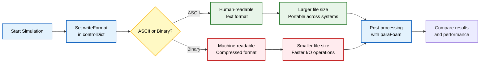
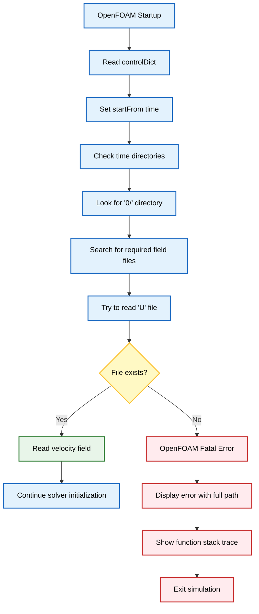

## แบบฝึกหัด

### แบบฝึกหัดที่ 1: สำรวจ System Dictionaries

**วัตถุประสงค์**: ระบุและทำความเข้าใจ dictionary การกำหนดค่าเพิ่มเติมในกรณีตัวอย่าง (tutorial cases) ของ OpenFOAM

**งาน**: ไปยังกรณีตัวอย่างที่มีอยู่ (existing tutorial case) และตรวจสอบเนื้อหาของไดเรกทอรี `system/` แสดงรายการไฟล์ทั้งหมดที่มีอยู่ และให้ความสนใจเป็นพิเศษกับ dictionary ที่นอกเหนือจาก `controlDict`, `fvSchemes` และ `fvSolution` มาตรฐาน

**สิ่งที่คาดว่าจะพบ**: นอกจาก dictionary มาตรฐานแล้ว คุณอาจพบ:

| ชื่อ Dictionary | หน้าที่หลัก | การใช้งาน |
|-----------------|--------------|--------------|
| `snappyHexMeshDict` | การปรับแต่ง mesh อัตโนมัติ | การสร้าง mesh รอบ geometry ที่ซับซ้อน |
| `decomposeParDict` | การแยกส่วนแบบขนาน | การตั้งค่า parallel computation |
| `setFieldsDict` | การเริ่มต้น field | การกำหนดค่าเริ่มต้นของ fields |
| `topoSetDict` | การดำเนินการทาง topological | การสร้าง cell sets/zones |
| `surfaceAddDict` | การเพิ่ม surface mesh | การรวม surface geometry |
| `refineMeshDict` | การปรับแต่ง mesh | การกำหนดเกณฑ์ dynamic mesh |
| `dynamicMeshDict` | การเคลื่อนที่ของ mesh | การควบคุม mesh motion |
| `blockMeshDict` | การสร้าง mesh เริ่มต้น | การสร้าง base mesh |

```mermaid
graph TD
    A["OpenFOAM System Directory"]
    A --> B["controlDict<br/>Simulation control<br/>Time stepping, output"]
    A --> C["fvSchemes<br/>Discretization schemes<br/>Temporal & spatial derivatives"]
    A --> D["fvSolution<br/>Solver settings<br/>Algorithms & tolerances"]
    A --> E["blockMeshDict<br/>Base mesh generation<br/>Simple geometries"]
    A --> F["snappyHexMeshDict<br/>Automatic mesh refinement<br/>Complex geometries"]
    A --> G["decomposeParDict<br/>Domain decomposition<br/>Parallel computing"]
    A --> H["setFieldsDict<br/>Field initialization<br/>Initial conditions"]
    A --> I["topoSetDict<br/>Topological operations<br/>Cell sets & zones"]
    A --> J["surfaceAddDict<br/>Surface mesh addition<br/>Geometry import"]
    A --> K["refineMeshDict<br/>Mesh refinement criteria<br/>Dynamic adaptation"]
    A --> L["dynamicMeshDict<br/>Mesh motion control<br/>Moving boundaries"]

    %% Styling Definitions
    classDef standard fill:#e3f2fd,stroke:#1565c0,stroke-width:2px,color:#000;
    classDef mesh fill:#e8f5e9,stroke:#2e7d32,stroke-width:2px,color:#000;
    classDef solver fill:#fff9c4,stroke:#fbc02d,stroke-width:2px,color:#000;
    classDef preprocessing fill:#ffebee,stroke:#c62828,stroke-width:2px,color:#000;
    
    class B,C,D standard;
    class E,F,I,J,K,L mesh;
    class G,H preprocessing;
```





**ประเด็นการเรียนรู้ที่สำคัญ**:
- **หน้าที่เฉพาะ**: dictionary แต่ละรายการมีหน้าที่เฉพาะในการ preprocessing หรือ solution control
- **การตั้งชื่อ**: ชื่อ dictionary มักจะลงท้ายด้วย "Dict" ตามหลักการของ OpenFOAM
- **ความเฉพาะทาง**: solvers เฉพาะทางอาจต้องใช้ไฟล์ dictionary ที่ไม่ซ้ำกัน
- **การกำหนดค่าขั้นสูง**: การทำความเข้าใจเนื้อหาของ dictionary ช่วยให้สามารถกำหนดค่า case ขั้นสูงได้

---

### แบบฝึกหัดที่ 2: แก้ไขรูปแบบไฟล์เอาต์พุต

**วัตถุประสงค์**: ตรวจสอบผลกระทบของรูปแบบไฟล์ที่แตกต่างกันต่อขนาดและความสามารถในการพกพา (portability) ของ simulation output

**งาน**: แก้ไขรายการ `writeFormat` ในไฟล์ `controlDict` จาก `ascii` เป็น `binary` รัน simulation และเปรียบเทียบขนาดไฟล์ระหว่างเอาต์พุต ASCII และ binary ในไดเรกทอรีเวลา (time directories)

**การเปลี่ยนแปลงโค้ด**:
```cpp
// In system/controlDict
writeFormat    binary;  // Change from ascii
```





**ผลลัพธ์ที่คาดหวัง**:

| รูปแบบ | ขนาดไฟล์ | การอ่าน | ความเข้ากันได้ | เหมาะสำหรับ |
|---------|------------|------------|---------------|--------------|
| **Binary** | ลดลง 30-70% | ต้องใช้โปรแกรม | จำกัด | Simulations ขนาดใหญ่ |
| **ASCII** | ใหญ่กว่า | มนุษย์อ่านได้ | สูง | Debugging และทดสอบ |

**คำสั่งวิเคราะห์**:
```bash
# Compare directory sizes
du -sh 0/ 0.1/ 0.2/  # ASCII format case
du -sh 0/ 0.1/ 0.2/  # Binary format case

# Examine file content differences
head -c 100 0.1/U_ascii
head -c 100 0.1/U_binary
```

**ประเด็นการเรียนรู้ที่สำคัญ**:
- **ประสิทธิภาพ**: Binary format ให้ประสิทธิภาพในการจัดเก็บสำหรับ simulations ขนาดใหญ่
- **Debugging**: ASCII format ช่วยให้การ debugging และการตรวจสอบด้วยตนเองง่ายขึ้น
- **Compatibility**: การเลือก format ส่งผลต่อความเข้ากันได้ในการ post-processing
- **Transient Cases**: ข้อควรพิจารณาในการจัดเก็บมีความสำคัญอย่างยิ่งสำหรับ transient simulations

---

### แบบฝึกหัดที่ 3: การตรวจสอบข้อผิดพลาดผ่านการจัดการไฟล์

**วัตถุประสงค์**: ทำความเข้าใจกลไกการค้นหาไฟล์ (file discovery mechanisms) และการจัดการข้อผิดพลาด (error handling) ของ OpenFOAM ผ่านการทำให้ case เสียหายโดยเจตนา

**งาน**: เปลี่ยนชื่อไฟล์ initial velocity field `0/U` เป็น `0/U_backup` และลองรัน incompressible solver บันทึกข้อความแสดงข้อผิดพลาดที่แน่นอนและวิเคราะห์ลำดับความล้มเหลว

**รูปแบบข้อผิดพลาดที่คาดหวัง**:
```bash
--> FOAM FATAL ERROR:
    cannot open file
file: /path/to/case/0/U at line 0.
    From function virtual void Foam::regIOobject::readStream()
    in file db/regIOobject/regIOobjectRead.C at line 73.
FOAM exiting
```





**ขั้นตอนการวิเคราะห์**:

1. **File Discovery**:
   - OpenFOAM ค้นหาไดเรกทอรี `0/` ก่อนสำหรับ initial conditions
   - หลังจาก initial time, solver จะมองหาใน time directories ถัดไป

2. **Required Fields**:
   - solver แต่ละตัวคาดหวัง fields เฉพาะตามหลักฟิสิกส์
   - การขาด fields ทำให้เกิดการยุติการทำงานทันที

3. **Error Propagation**:
   - ระบบรายงานข้อผิดพลาดโดยละเอียด
   - แสดงแหล่งที่มาของข้อผิดพลาดแบบ exact

**คำสั่งกู้คืน**:
```bash
# Restore the original file
mv 0/U_backup 0/U

# Alternative: Copy from another time directory
cp 0.1/U 0/U
```

**ส่วนขยาย**:
- **ทดสอบ fields อื่น**: เปลี่ยนชื่อไฟล์ที่จำเป็นอื่นๆ (`p`, `k`, `epsilon`) และสังเกตข้อความแสดงข้อผิดพลาดที่แตกต่างกัน
- **Incomplete Files**: สร้าง field files ที่ไม่สมบูรณ์โดยไม่มี boundary conditions
- **Syntax Testing**: แนะนำ syntax errors ใน field definitions เพื่อวิเคราะห์ parsing failures

**ประเด็นการเรียนรู้ที่สำคัญ**:
- **Error Patterns**: OpenFOAM ให้การรายงานข้อผิดพลาดโดยละเอียดสำหรับ missing files
- **Troubleshooting**: การทำความเข้าใจ error patterns ช่วยเร่งการ troubleshooting
- **File Conventions**: File naming conventions ถูกบังคับใช้อย่างเคร่งครัด
- **Boundary Conditions**: ความสมบูรณ์ของ Boundary condition เป็นสิ่งจำเป็นสำหรับการ case initialization
