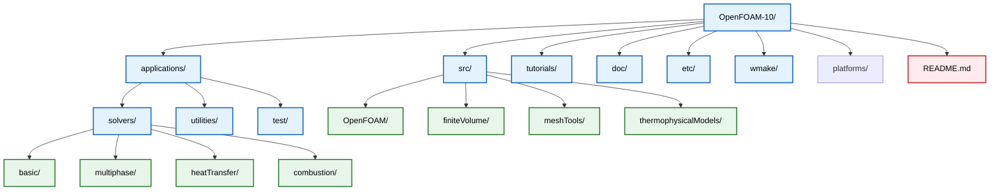
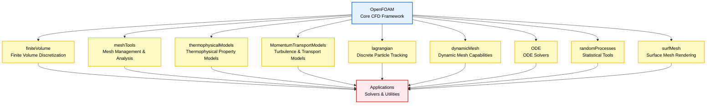
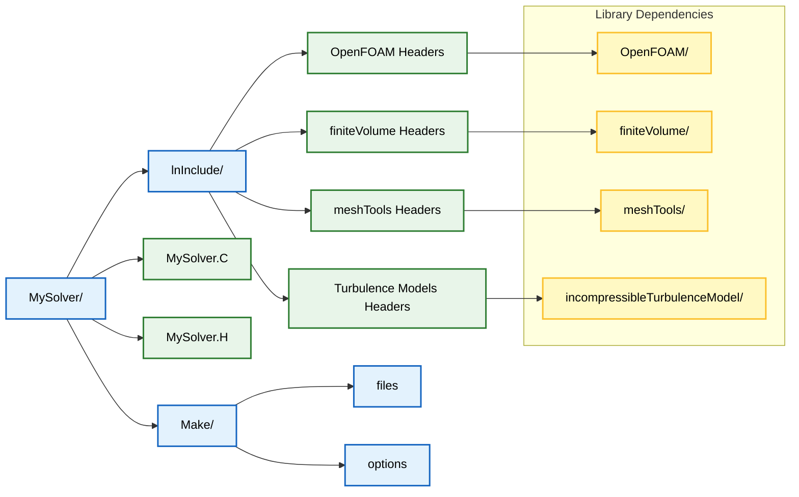

# 2.2 การจัดระเบียบไฟล์ใน OpenFOAM

OpenFOAM ใช้โครงสร้างการจัดระเบียบไฟล์แบบลำดับชั้นที่แยก **source code**, **libraries**, **applications** และ **configuration files** ออกเป็นไดเรกทอรีเชิงตรรกะ การทำความเข้าใจการจัดระเบียบนี้เป็นสิ่งสำคัญสำหรับการนำทางและแก้ไข codebase ได้อย่างมีประสิทธิภาพ

## โครงสร้างไดเรกทอรี Root

ที่ระดับบนสุดของ OpenFOAM-10 โครงสร้างไดเรกทอรีจะถูกจัดระเบียบเป็นส่วนประกอบหลักหลายส่วน:

```
OpenFOAM-10/
├── applications/          # Solvers และ utilities
├── src/                  # Source code สำหรับ libraries
├── tutorials/            # Tutorial cases และตัวอย่าง
├── doc/                  # ไฟล์เอกสารประกอบ
├── etc/                  # Configuration และ templates
├── wmake/                # ไฟล์ระบบ Build
├── platforms/            # Code เฉพาะแพลตฟอร์ม
└── README.md            # ข้อมูลทั่วไป
```





## โครงสร้างไดเรกทอรี Applications

ไดเรกทอรี `applications/` ประกอบด้วยโปรแกรมที่สามารถ execute ได้ทั้งหมด และแบ่งออกเป็น:

```
applications/
├── solvers/              # CFD solvers จัดเรียงตามหลักฟิสิกส์
│   ├── basic/           # Basic solvers (icoFoam, simpleFoam, etc.)
│   ├── compressible/    # Compressible flow solvers
│   ├── heatTransfer/    # Heat transfer solvers
│   ├── multiphase/      # Multiphase flow solvers
│   └── stressAnalysis/  # Structural mechanics solvers
└── utilities/           # Pre/post-processing utilities
    ├── mesh/            # เครื่องมือสร้างและจัดการ Mesh
    ├── preProcessing/   # Utilities สำหรับการตั้งค่า Case
    ├── postProcessing/  # เครื่องมือวิเคราะห์ผลลัพธ์
    └── parallel/        # Utilities สำหรับการประมวลผลแบบขนาน
```

### ประเภทของ Solvers ตามหมวดหมู่

| หมวดหมู่ | ตัวอย่าง Solvers | คำอธิบาย |
|-----------|-------------------|-----------|
| **Basic** | `icoFoam`, `simpleFoam`, `pimpleFoam` | กระแสไม่บีบอัดพื้นฐาน |
| **Compressible** | `rhoSimpleFoam`, `sonicFoam` | กระแสอัดตัว |
| **Heat Transfer** | `buoyantBoussinesqSimpleFoam` | ถ่ายเทความร้อน |
| **Multiphase** | `interFoam`, `multiphaseEulerFoam` | หลายเฟส |
| **Stress Analysis** | `solidDisplacementFoam` | วิเคราะห์ความเค้น |

## การจัดระเบียบ Source Code

ไดเรกทอรี `src/` ประกอบด้วย **core libraries** ที่เป็นรากฐานของ OpenFOAM:

```
src/
├── OpenFOAM/            # Core CFD framework และ field classes
├── finiteVolume/        # Finite volume discretization
├── meshTools/          # การจัดการและวิเคราะห์ Mesh
├── thermophysicalModels/ # Thermophysical property models
├── MomentumTransportModels/ # Turbulence และ transport models
├── lagrangian/          # Discrete particle tracking
├── dynamicMesh/         # ความสามารถในการเคลื่อนที่ของ Mesh
├── ODE/                # Ordinary differential equation solvers
├── randomProcesses/     # เครื่องมือทางสถิติ
└── surfMesh/           # การแสดงผล Surface mesh
```





## โครงสร้างไฟล์ Case

OpenFOAM case โดยทั่วไปจะใช้โครงสร้างไดเรกทอรีที่เป็นมาตรฐาน:

```
caseDirectory/
├── 0/                   # Initial conditions สำหรับทุก fields
│   ├── U               # Velocity field
│   ├── p               # Pressure field
│   ├── T               # Temperature field
│   └── otherFields     # ตัวแปร field เพิ่มเติม
├── constant/           # ข้อมูลที่ไม่ขึ้นกับเวลา
│   ├── polyMesh/       # ไฟล์ Mesh (points, faces, cells)
│   ├── transportProperties # คุณสมบัติของ Fluid
│   ├── turbulenceProperties # การตั้งค่า Turbulence model
│   └── thermophysicalProperties # คุณสมบัติทาง Thermophysical
└── system/             # พารามิเตอร์ควบคุมการจำลอง
    ├── controlDict     # การควบคุม Time stepping และ output
    ├── fvSchemes       # Discretization schemes
    ├── fvSolution      # การตั้งค่า Solver และ tolerances
    └── decomposeParDict # การตั้งค่า Parallel decomposition
```

### รายละเอียดไฟล์ในแต่ละไดเรกทอรี

#### **ไดเรกทอรี `0/` (Initial Conditions):**
- `U`: Velocity field (`volVectorField`)
- `p`: Pressure field (`volScalarField`)
- `T`: Temperature field (`volScalarField`)
- ไฟล์ boundary conditions อื่นๆ ตามที่จำลองต้องการ

#### **ไดเรกทอรี `constant/` (Time-Independent Data):**
- `polyMesh/`: โครงสร้าง mesh ประกอบด้วย `points`, `faces`, `cells`, `boundary`
- `transportProperties`: คุณสมบัติของ fluid (viscosity, density)
- `turbulenceProperties`: การตั้งค่า turbulence model
- `thermophysicalProperties`: คุณสมบัติทาง thermodynamics

#### **ไดเรกทอรี `system/` (Control Parameters):**
- `controlDict`: ควบคุม time stepping, write interval, solver selection
- `fvSchemes`: temporal และ spatial discretization schemes
- `fvSolution`: solver tolerances, algorithms, relaxation factors

## โครงสร้างไฟล์ Make

แต่ละ library และ application มีไดเรกทอรี `Make/` พร้อมคำแนะนำในการ build:

```
Make/
├── files               # รายชื่อ source files ที่จะ compile
└── options             # Compiler flags และ dependencies
```

### ตัวอย่าง Make/files:
```
MySolver.C
EXE = $(FOAM_APPBIN)/MySolver
```

### ตัวอย่าง Make/options:
```
EXE_INC = \
    -I$(LIB_SRC)/finiteVolume/lnInclude \
    -I$(LIB_SRC)/meshTools/lnInclude \
    -I$(LIB_SRC)/turbulenceModels/incompressible/turbulenceModel

EXE_LIBS = \
    -lfiniteVolume \
    -lmeshTools \
    -lincompressibleTurbulenceModel
```

## การจัดระเบียบ Header File

OpenFOAM ใช้การรวม header file อย่างกว้างขวางด้วย **symbolic links** ที่สร้างขึ้นในไดเรกทอรี `lnInclude/`:

```
MySolver/
├── lnInclude/          # Symbolic links ไปยัง headers ที่จำเป็น
├── MySolver.C          # ไฟล์ source หลัก
├── MySolver.H          # การประกาศ Class
└── Make/               # Build configuration
```





## Library Dependencies

การจัดระเบียบแบบลำดับชั้นสร้างสายโซ่การพึ่งพาที่ชัดเจน:

1. **Utilities และ containers** พื้นฐานใน `OpenFOAM/`
2. **Numerical methods** ใน `finiteVolume/`
3. **Physics models** ใน libraries เฉพาะทาง
4. **Application-specific code** สร้างขึ้นบน libraries เหล่านี้

### ลำดับชั้นการพึ่งพา:
```
Applications
    ↓
Physics Models (thermophysicalModels, MomentumTransportModels)
    ↓
Numerical Methods (finiteVolume, meshTools)
    ↓
Core Framework (OpenFOAM)
```

## เคล็ดลับการนำทาง

### 1. Source Location:
```bash
find $WM_PROJECT_DIR -name "*.H" -o -name "*.C"
```

### 2. Include Path:
Headers มักจะอยู่ใน `$FOAM_SRC/<library>/<subdirectory>/`

### 3. Executables:
- **Solvers**: `$FOAM_APPBIN/`
- **Utilities**: `$FOAM_APPBIN/`

### 4. Libraries:
Compiled libraries จะอยู่ใน `$FOAM_LIBBIN/`

### 5. การค้นหาที่มีประสิทธิภาผล:

| การค้นหา | คำสั่ง | คำอธิบาย |
|-----------|---------|-----------|
| หาไฟล์ header | `find $FOAM_SRC -name "fvMesh.H"` | ค้นหา header จำเพาะ |
| หา source code | `grep -r "class fvMesh" $FOAM_SRC` | ค้นหา class definition |
| ตรวจสอบ dependencies | `ldd $(which simpleFoam)` | ดู library dependencies |

โครงสร้างการจัดระเบียบนี้ช่วยอำนวยความสะดวกในการพัฒนาแบบ **modular**, การนำ code กลับมาใช้ใหม่ และการบำรุงรักษา OpenFOAM codebase ที่กว้างขวาง
