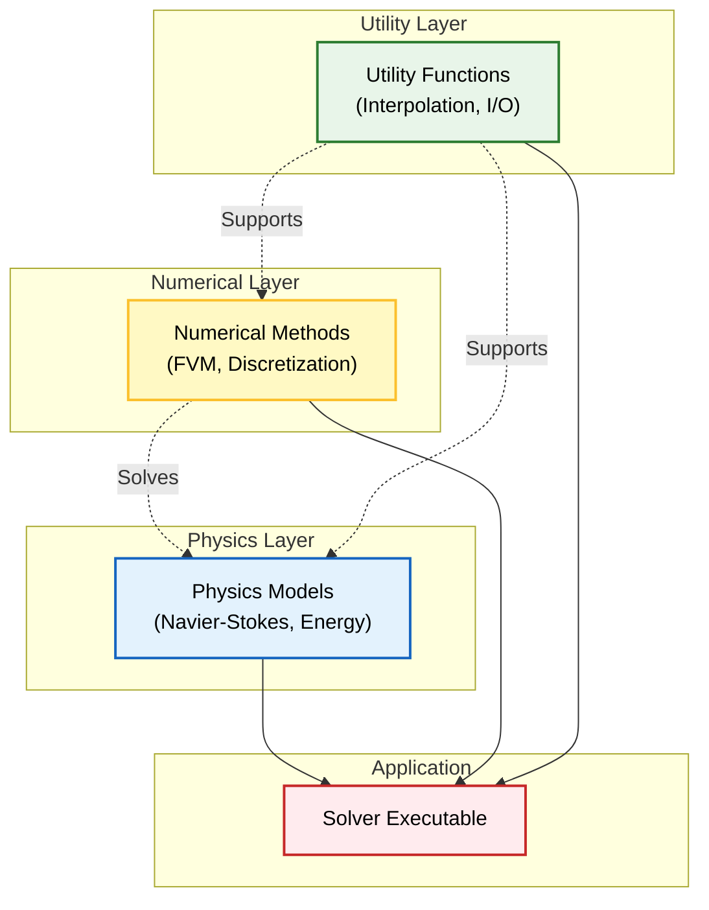

# บทนำ: โครงสร้าง OpenFOAM

## 📁 สถาปัตยกรรมแบบโมดูลาร์

**OpenFOAM ไม่ใช่โปรแกรมเดี่ยว** แต่เป็นชุดรวมที่ครอบคลุมของ **C++ libraries, applications, และ utilities** ที่ออกแบบมาสำหรับการจำลองพลศาสตร์ของไหลเชิงคำนวณ (CFD)

### 🎯 ประโยชน์ของสถาปัตยกรรมโมดูลาร์

- **ประสิทธิภาพสูง**: ผู้ใช้สามารถปรับแต่ง solvers และนำ physics models ใหม่มาใช้
- **ยืดหยุ่น**: ขยายฟังก์ชันการทำงานสำหรับการวิจัยหรือ applications ทางวิศวกรรมเฉพาะทาง
- **พัฒนาร่วมกันได้**: ส่งเสริมการนำ code กลับมาใช้ใหม่และการทำงานเป็นทีม

```mermaid
graph TD
    A["OpenFOAM Framework"]
    B["Core Libraries"]
    C["Applications"]
    D["Utilities"]
    
    A --> B
    A --> C
    A --> D
    
    B --> E["OpenFOAM/"]
    B --> F["finiteVolume/"]
    B --> G["meshTools/"]
    B --> H["thermophysicalModels/"]
    
    E --> E1["Field Management"]
    E --> E2["Linear Algebra"]
    E --> E3["CFD Classes"]
    
    F --> F1["Finite Volume Method"]
    F --> F2["Boundary Conditions"]
    
    C --> I["Solvers/"]
    C --> J["Test Applications"]
    
    I --> I1["Basic Solvers"]
    I --> I2["Multiphase Solvers"]
    I --> I3["Heat Transfer"]
    I --> I4["Combustion Solvers"]
    
    I1 --> I11["icoFoam"]
    I1 --> I12["simpleFoam"]
    I1 --> I13["pimpleFoam"]
    
    D --> K["Pre-processing"]
    D --> L["Post-processing"]
    D --> M["Mesh Generation"]
    
    K --> K1["blockMesh"]
    K --> K2["snappyHexMesh"]
    
    L --> L1["paraFoam"]
    L --> L2["sample"]
    
    M --> M1["decomposePar"]
    M --> M2["reconstructPar"]
    
    %% Styling Definitions
    classDef process fill:#e3f2fd,stroke:#1565c0,stroke-width:2px,color:#000;
    classDef decision fill:#fff9c4,stroke:#fbc02d,stroke-width:2px,color:#000;
    classDef terminator fill:#ffebee,stroke:#c62828,stroke-width:2px,color:#000;
    classDef storage fill:#e8f5e9,stroke:#2e7d32,stroke-width:2px,color:#000;
    
    class A,B,C,D process;
    class E,F,G,H decision;
    class I,J,K,L,M terminator;
    class E1,E2,E3,F1,F2,I1,I2,I3,I4,K1,K2,L1,L2,M1,M2 storage;
```





## 📂 โครงสร้าง Directory หลัก

### 🔧 Core Libraries (`src/`)

**`src/`** ประกอบด้วย core libraries ที่เป็นรากฐานของ framework:

| Component | คำอธิบาย | หน้าที่หลัก |
|-----------|-------------|--------------|
| **CFD Classes พื้นฐาน** | คลาสพื้นฐานสำหรับ CFD | การจัดการ mesh, fields, และ solvers |
| **Field Management** | ระบบการจัดการ fields | จัดการ pressure, velocity, temperature fields |
| **Linear Algebra Solvers** | Solvers สำหรับระบบสมการเชิงเส้น | แก้ไขปัญหาทางคณิตศาสตร์ |
| **Mesh Utilities** | เครื่องมือสำหรับการจัดการ mesh | สร้างและแก้ไข mesh |

### 🚀 Applications (`applications/`)

**`applications/`** แบ่งย่อยออกเป็น:

#### 1. **Solvers**

| ประเภท | Solvers | การใช้งาน |
|--------|---------|-------------|
| **Multiphase** | `multiphaseEulerFoam`, `interFoam` | การจำลองการไหลหลายเฟส |
| **Heat Transfer** | `buoyantBoussinesqSimpleFoam`, `reactingFoam` | การถ่ายเทความร้อนและปฏิกิริยาเคมี |
| **Basic Flow** | `icoFoam`, `simpleFoam`, `pimpleFoam` | การไหลพื้นฐานและความปั่นป่วน |

#### 2. **Utilities**

- **Pre-processing**: เครื่องมือเตรียมข้อมูล (mesh generation)
- **Post-processing**: เครื่องมือวิเคราะห์ผลลัพธ์
- **Mesh Management**: เครื่องมือจัดการ mesh


```mermaid
graph LR
    %% OpenFOAM Architecture: src/ and applications/ relationship
    
    %% Core Libraries
    subgraph Sources ["src/ Core Libraries"]
        FOAM["OpenFOAM<br/>Field Management"]
        FV["finiteVolume<br/>FVM Implementation"]
        Mesh["meshTools<br/>Mesh Utilities"]
        Thermo["thermophysicalModels<br/>Thermodynamics"]
        Turb["MomentumTransportModels<br/>Turbulence Models"]
        Lagr["lagrangian<br/>Particle Tracking"]
    end
    
    %% Applications
    subgraph Apps ["applications/"]
        subgraph Solvers ["Solvers"]
            Basic["Basic Flow<br/>icoFoam, simpleFoam"]
            Multi["Multiphase<br/>multiphaseEulerFoam"]
            Heat["Heat Transfer<br/>buoyantBoussinesqSimpleFoam"]
            React["Reacting Flow<br/>reactingFoam"]
        end
        
        subgraph Utils ["Utilities"]
            Pre["Pre-processing<br/>blockMesh, snappyHexMesh"]
            Post["Post-processing<br/>paraFoam, foamToVTK"]
            MeshUtil["Mesh Management<br/>decomposePar, refineMesh"]
        end
    end
    
    %% Connections
    Basic --> FOAM
    Basic --> FV
    Basic --> Turb
    
    Multi --> FOAM
    Multi --> FV
    Multi --> Lagr
    
    Heat --> FOAM
    Heat --> FV
    Heat --> Thermo
    
    React --> FOAM
    React --> FV
    React --> Thermo
    React --> Lagr
    
    Pre --> Mesh
    Post --> FV
    MeshUtil --> Mesh
    
    %% Styling
    classDef sourceLib fill:#e3f2fd,stroke:#1565c0,stroke-width:2px,color:#000;
    classDef solver fill:#fff9c4,stroke:#fbc02d,stroke-width:2px,color:#000;
    classDef utility fill:#e8f5e9,stroke:#2e7d32,stroke-width:2px,color:#000;
    classDef subgraph fill:#f3e5f5,stroke:#7b1fa2,stroke-width:2px,color:#000;
    
    class FOAM,FV,Mesh,Thermo,Turb,Lagr sourceLib;
    class Basic,Multi,Heat,React solver;
    class Pre,Post,MeshUtil utility;
    class Sources,Solvers,Utils subgraph;
```


## 🎯 การนำทาง Codebase อย่างมีประสิทธิภาพ

### ตัวอย่างการค้นหาตำแหน่งที่เกี่ยวข้อง:

| งานที่ต้องการทำ | Directory ที่ต้องสำรวจ | ตัวอย่างไฟล์/solver |
|-------------------|------------------------|----------------------|
| แก้ไข turbulence modeling | `src/TurbulenceModels/` | `kOmegaSST`, `kEpsilon` |
| ทำงานกับ multiphase flow | `applications/solvers/multiphase/` | `multiphaseEulerFoam`, `interFoam` |
| พัฒนา heat transfer | `applications/solvers/heatTransfer/` | `buoyantSimpleFoam` |
| สร้าง custom utilities | `applications/utilities/` | `customMeshGenerator` |

## 💡 หลักการทำงานร่วมกัน

สถาปัตยกรรมของ OpenFOAM แยกส่วนประกอบต่างๆ ออกจากกัน:

### 🔄 การแยกส่วนประกอบ

1. **Physics Models** → สมการทางฟิสิกส์ (Navier-Stokes, energy equation)
2. **Numerical Methods** → วิธีการแก้สมการ (Finite Volume Method)
3. **Utility Functions** → เครื่องมือช่วยเหลือ (interpolation, integration)

### ✅ ข้อดีของการแยกส่วน

- ✅ พัฒนา ทดสอบ และบำรุงรักษาได้อย่างอิสระ
- ✅ สถาปัตยกรรมที่สะอาดและมีระเบียบ
- ✅ ง่ายต่อการติดตามและแก้ไขข้อผิดพลาด



## 🌟 สรุป

แม้โครงสร้าง OpenFOAM จะซับซ้อนในตอนแรก แต่เมื่อคุ้นเคยแล้วจะกลายเป็น **ทรัพย์สินอันทรงพลัง** ที่ช่วยให้:

- 🔍 **ค้นหาตัวอย่างที่เกี่ยวข้อง** สำหรับการอ้างอิง
- 🚀 **ใช้ประโยชน์จาก code ที่มีอยู่** ได้อย่างมีประสิทธิภาพ
- 🤝 **มีส่วนร่วมในการขยายฟังก์ชันการทำงาน** ที่มีความหมายต่อ CFD community

สถาปัตยกรรมแบบโมดูลาร์นี้เป็นหัวใจสำคัญที่ทำให้ OpenFOAM เป็นเครื่องมือ CFD ที่ทรงพลังและยืดหยุ่นสำหรับการวิจัยและการพัฒนาในอุตสาหกรรม
