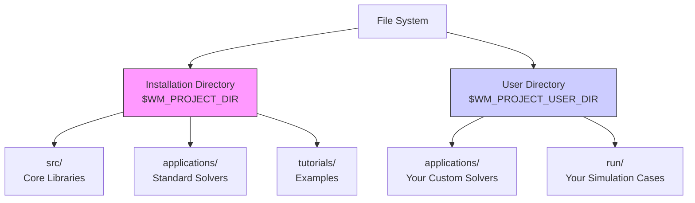
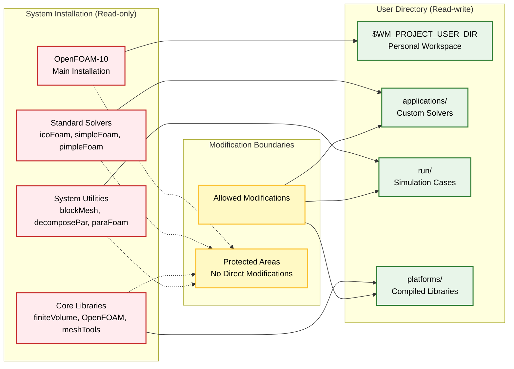
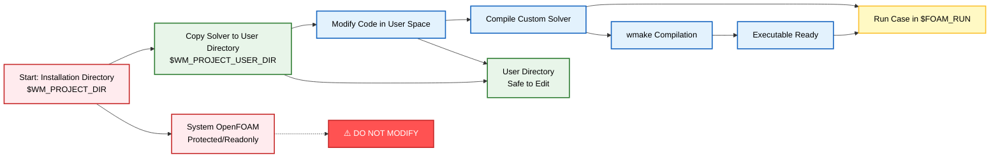

# 🏗️ โครงสร้างไดเรกทอรี OpenFOAM: ระบบ vs. ผู้ใช้

## 🌍 สองโลกหลักของ OpenFOAM

OpenFOAM แบ่งจักรวาลของมันออกเป็นสองส่วนหลักคือ **Installation** (ระบบ) และ **User** (ผู้ใช้)



---

## 📁 1. ไดเรกทอรีการติดตั้ง: `$WM_PROJECT_DIR`

**คือการติดตั้ง OpenFOAM ระดับระบบ** ประกอบด้วยไลบรารีหลัก, Solvers มาตรฐาน, Utilities และ Tutorials

- **ตำแหน่งทั่วไป**: `/opt/openfoam10` หรือ `/usr/local/openfoam10`
- **ลักษณะ**: Read-only (ของระบบ)
- **วัตถุประสงค์**: เก็บรักษาการติดตั้งหลักที่สมบูรณ์และไม่เปลี่ยนแปลง

### 📂 ไดเรกทอรีย่อยที่สำคัญใน `$WM_PROJECT_DIR`:

| ไดเรกทอรีย่อย | คำอธิบาย | ตัวอย่าง |
|---|---|---|
| `src/` | ไลบรารีหลักของ OpenFOAM | OpenFOAM, finiteVolume, meshTools |
| `applications/` | Solvers มาตรฐานและ Utilities | simpleFoam, icoFoam, multiphaseEulerFoam |
| `tutorials/` | Tutorial Cases สำหรับการเรียนรู้ | ชุดตัวอย่างที่แสดงฟิสิกส์ต่างๆ |
| `etc/` | ไฟล์ Configuration และ Environment | สคริปต์ตั้งค่าและเทมเพลต |
| `wmake/` | ระบบ Build และกฎการคอมไพล์ | ระบบคอมไพล์ของ OpenFOAM |

---

## 👤 2. ไดเรกทอรีผู้ใช้: `$WM_PROJECT_USER_DIR`

**คือพื้นที่ทำงานส่วนตัว** สำหรับการพัฒนา OpenFOAM และงาน Simulation

- **ตำแหน่งเริ่มต้น**: `$HOME/OpenFOAM/$USER-10`
- **ลักษณะ**: Read-write (พื้นที่ส่วนตัว)
- **วัตถุประสงค์**: พัฒนาโค้ดและทำงานโดยไม่กระทบการติดตั้งหลัก

### 📂 ไดเรกทอรีย่อยที่สำคัญใน `$WM_PROJECT_USER_DIR`:

| ไดเรกทอรีย่อย | คำอธิบาย | การใช้งาน |
|---|---|---|
| `applications/` | Custom Solvers และ Utilities | พัฒนา solver ใหม่หรือแก้ไข solver มีอยู่ |
| `run/` | Simulation Cases และการศึกษา | ทำการจำลอง CFD Cases |
| `platforms/` | ไลบรารีและ Executables ที่คอมไพล์ | ผลลัพธ์การคอมไพล์สำหรับผู้ใช้โดยเฉพาะ |

---

## 🎯 3. เหตุผลสำคัญของการแยกส่วน

| เหตุผล | ประโยชน์ที่ได้รับ |
|---|---|
| **การติดตั้งที่สะอาด** | การติดตั้งหลักไม่เปลี่ยนแปลง สามารถอัปเดตได้ง่าย |
| **ความปลอดภัย** | โค้ดที่ปรับแต่งยังคงอยู่ระหว่างการอัปเดต OpenFOAM |
| **การทำงานร่วมกัน** | ผู้ใช้หลายคนใช้การติดตั้งเดียวกันได้ในขณะที่มีพื้นที่ทำงานแยก |
| **ความสามารถในการพกพา** | ไดเรกทอรีผู้ใช้สามารถสำรองข้อมูลหรือย้ายระหว่างระบบได้ |
| **การควบคุมเวอร์ชัน** | ควบคุมเวอร์ชันโค้ดได้โดยไม่กระทบการติดตั้งหลัก |





---

## 🔧 4. ขั้นตอนการทำงานกับโครงสร้างนี้

### 4.1 ใช้ Solvers มาตรฐาน
- รันตรงจากการติดตั้งหลัก
- ไม่ต้องคัดลอกหรือแก้ไข
- เหมาะสำหรับการใช้งานทั่วไป

### 4.2 แก้ไข Solvers ที่มีอยู่
1. คัดลอกจาก `$WM_PROJECT_DIR/applications/` → `$WM_PROJECT_USER_DIR/applications/`
2. ทำการแก้ไขในไดเรกทอรีผู้ใช้
3. คอมไพล์ในพื้นที่ส่วนตัว

### 4.3 สร้าง Solvers ใหม่
- พัฒนาโดยตรงใน `$WM_PROJECT_USER_DIR/applications/`
- ไม่กระทบการติดตั้งหลัก
- สามารถทดสอบและพัฒนาอย่างอิสระ

### 4.4 ศึกษาตัวอย่าง (Tutorial Cases)
1. คัดลอกจาก `$WM_PROJECT_DIR/tutorials/` → `$WM_PROJECT_USER_DIR/run/`
2. ทำการทดลองและแก้ไข
3. เรียนรู้จากตัวอย่างที่มีอยู่

---

## 🌡️ 5. ตัวแปรสภาพแวดล้อมที่สำคัญ

| ตัวแปร | คำอธิบาย | ตัวอย่างค่า |
|---|---|---|
| `$WM_PROJECT_DIR` | ชี้ไปยังไดเรกทอรีการติดตั้ง | `/opt/openfoam10` |
| `$WM_PROJECT_USER_DIR` | ชี้ไปยังพื้นที่ทำงานผู้ใช้ | `/home/user/OpenFOAM/user-10` |
| `$FOAM_RUN` | ตัวย่อสำหรับ run directory | `/home/user/OpenFOAM/user-10/run` |
| `$FOAM_APP` | ชี้ไปยัง applications directory | ขึ้นอยู่กับ context |
| `$FOAM_TUTORIALS` | ชี้ไปยัง tutorials directory | `/opt/openfoam10/tutorials` |

---

## 💻 6. ตัวอย่างเชิงปฏิบัติ

### 6.1 การตรวจสอบตัวแปรสภาพแวดล้อม
```bash
# หลังจาก source environment ของ OpenFOAM
echo $WM_PROJECT_DIR      # ผลลัพธ์: /opt/openfoam10
echo $WM_PROJECT_USER_DIR # ผลลัพธ์: /home/user/OpenFOAM/user-10
echo $FOAM_RUN            # ผลลัพธ์: /home/user/OpenFOAM/user-10/run
```

### 6.2 การสร้าง case ใหม่ใน run directory
```bash
cd $FOAM_RUN
cp -r $WM_PROJECT_DIR/tutorials/incompressible/icoFoam/cavity/cavity .
cd cavity
blockMesh
icoFoam
```

### 6.3 การคัดลอกและแก้ไข solver
```bash
# คัดลอก solver ไปยังพื้นที่ผู้ใช้
cp -r $WM_PROJECT_DIR/applications/solvers/incompressible/icoFoam $WM_PROJECT_USER_DIR/applications/

# ทำการแก้ไขในพื้นที่ส่วนตัว
cd $WM_PROJECT_USER_DIR/applications/icoFoam
# แก้ไข code ได้เลย!
```

---

## ⚠️ 7. ข้อควรระวังและเคล็ดลับ

> **เคล็ดลับมืออาชีพ:** ⚠️ **ห้ามแก้ไขไฟล์ใน `$WM_PROJECT_DIR` โดยเด็ดขาด**  
> ควรคัดลอกไปยัง `$WM_PROJECT_USER_DIR` ก่อนทำการแก้ไขเสมอ

### ✅ ข้อดีของการทำตามกฎนี้:
- **การติดตั้งของคุณสะอาดเสมอ**
- **รับประกันว่าการแก้ไขของคุณจะยังคงอยู่หลังการอัปเดต**
- **สามารถย้อนกลับไปยังโค้ดต้นฉบับได้ง่าย**
- **การแชร์โค้ดกับผู้อื่นทำได้สะดวก**





---

## 📊 8. สรุปโครงสร้างการทำงานที่ดี

### 🔄 การทำงานแบบมาตรฐาน (Standard Workflow)
```
1. Start → OpenFOAM Environment Setup
2. Create Case → $WM_PROJECT_USER_DIR/run/
3. Run Simulation → Using standard solvers
4. Analyze Results → Post-processing utilities
```

### 🛠️ การพัฒนาแบบปลอดภัย (Safe Development)
```
1. Need Customization?
2. Copy from $WM_PROJECT_DIR/applications/ → $WM_PROJECT_USER_DIR/applications/
3. Modify in user space
4. Build and test
5. Deploy when ready
```

การแยกส่วนนี้ไม่เพียงแต่ช่วยให้จัดการโค้ดได้ดีขึ้น แต่ยังเป็นหลักการทางวิศวกรรมซอฟต์แวร์ที่ดีที่ช่วยให้ระบบ OpenFOAM มีเสถียรภาพและสามารถพัฒนาได้อย่างยั่งยืน
