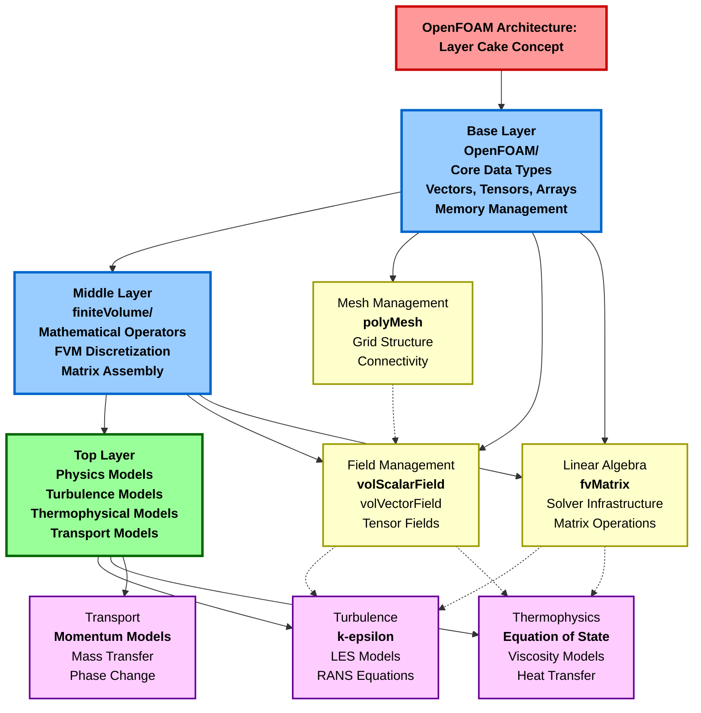
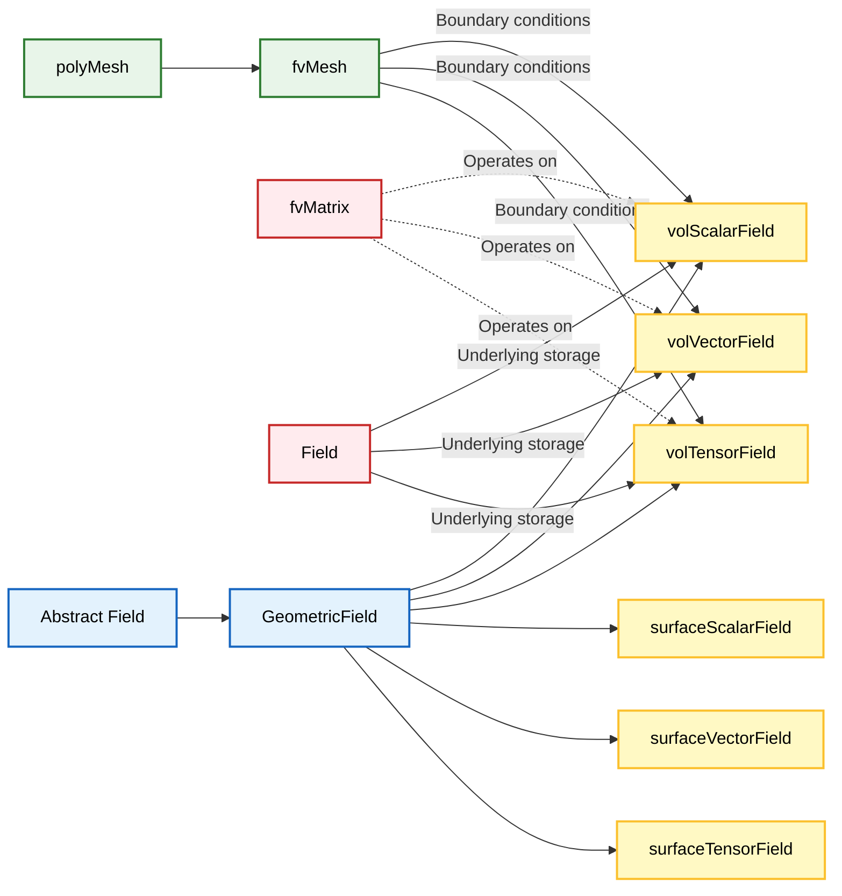
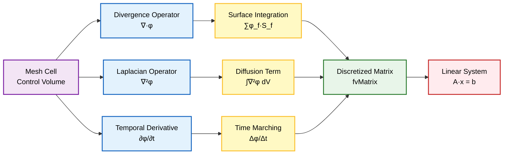
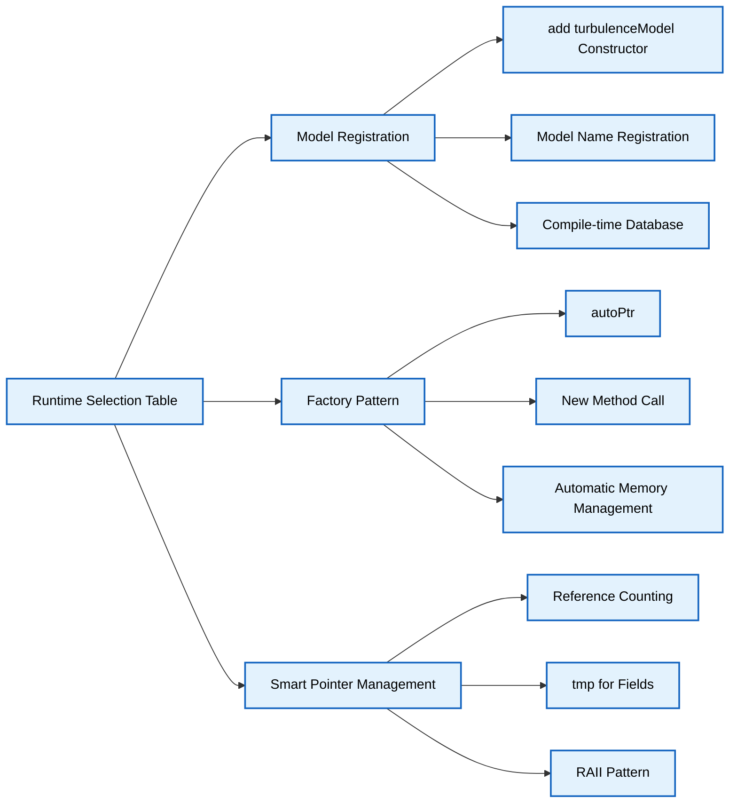
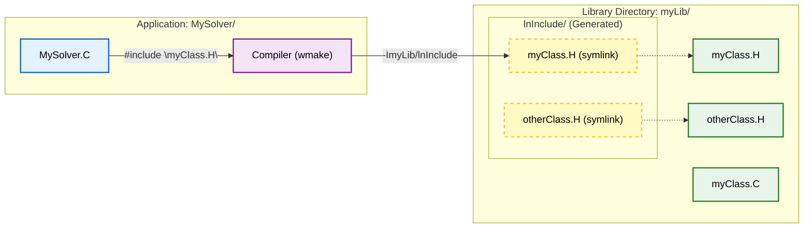
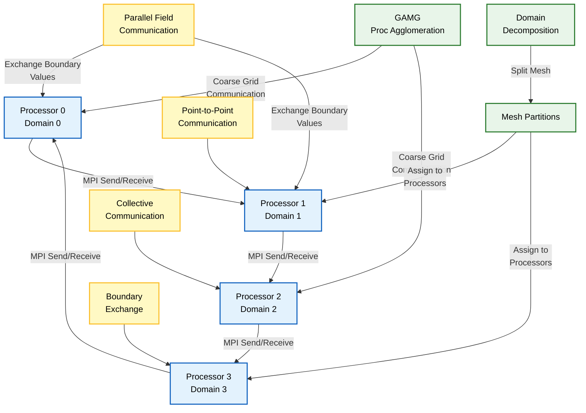

## 1. ซอร์สโค้ด (`src/`)

นี่คือหัวใจหลักของ OpenFOAM หากคุณต้องการเข้าใจ *ว่า* `k-epsilon` ทำงานอย่างไร หรือ `fvOptions` ถูกนำไปใช้งานอย่างไร ให้ดูที่นี่

### การวิเคราะห์โครงสร้าง

| ไดเรกทอรี | วัตถุประสงค์ | เนื้อหาหลัก |
| :--- | :--- | :--- |
| **`OpenFOAM/`** | **รากฐาน** | การจัดการ Mesh (`polyMesh`), Fields (`volScalarField`), Matrices (`fvMatrix`) |
| **`finiteVolume/`** | **คณิตศาสตร์** | Discretization schemes (`fvm::div`), Boundary conditions |
| **`turbulenceModels/`** | **ฟิสิกส์** | RANS (`kEpsilon`), LES (`Smagorinsky`) |
| **`thermophysicalModels/`** | **คุณสมบัติ** | Viscosity, specific heat, สมการสถานะ (equations of state) |





### แนวคิดแบบ "เค้กหลายชั้น"

ลองนึกภาพ OpenFOAM เป็นชั้นๆ ดังนี้:

1.  **ชั้นล่างสุด**: `OpenFOAM/` (ประเภทข้อมูลพื้นฐาน เช่น Vectors, Tensors, Arrays)
2.  **ชั้นกลาง**: `finiteVolume/` (ตัวดำเนินการทางคณิตศาสตร์ของ FVM)
3.  **ชั้นบนสุด**: `turbulenceModels/`, `transportModels/` (ตรรกะทางฟิสิกส์)

### ไดเรกทอรี `OpenFOAM/` - รากฐาน

ไดเรกทอรี `OpenFOAM/` ประกอบด้วยส่วนประกอบพื้นฐานของกรอบการทำงาน CFD ทั้งหมด

#### คลาสหลักใน `OpenFOAM/`

**Fields และ Algebra:**
- `volScalarField`, `volVectorField`, `volTensorField`: คลาส Template สำหรับจัดเก็บค่า Field ที่จุดศูนย์กลางเซลล์
- `surfaceScalarField`, `surfaceVectorField`: Fields ที่กำหนดไว้ที่หน้าเซลล์สำหรับการคำนวณ Flux
- `fvMatrix<Type>`: คลาส Finite Volume Matrix ที่แสดงถึงสมการที่ถูก Discretize

**การจัดการ Mesh:**
- `polyMesh`: โครงสร้างข้อมูล Mesh หลักที่ประกอบด้วยจุด, หน้า และเซลล์
- `fvMesh`: ส่วนขยายของ polyMesh พร้อมฟังก์ชัน Finite Volume เพิ่มเติม
- `primitiveMesh`: คลาสพื้นฐานสำหรับการดำเนินการ Mesh Topology

**Mathematical Objects:**
- `Vector<Type>`, `Tensor<Type>`: คลาส Vector และ Tensor ทางคณิตศาสตร์
- `Field<Type>`: คอนเทนเนอร์ Field ทั่วไปพร้อมการจัดการหน่วยความจำอัตโนมัติ
- `List<Type>`, `DynamicList<Type>`: คลาสคอนเทนเนอร์ที่มีประสิทธิภาพ





### ไดเรกทอรี `finiteVolume/` - คณิตศาสตร์ FVM

Finite Volume Method ถูกนำมาใช้ที่นี่ผ่านระบบที่ซับซ้อนของ Discretization Operators และ Schemes

#### Discretization Operators ที่สำคัญ

**Gradient Operators:**
```cpp
// Gauss gradient theorem implementation
template<class Type>
tmp<GeometricField<Type, fvPatchField, volMesh>>
grad(const GeometricField<Type, fvsPatchField, surfaceMesh>& ssf)
{
    return fv::gradScheme<Type>::New
    (
        ssf.mesh(), ssf.mesh().gradScheme("grad(" + ssf.name() + ')')
    )().grad(ssf);
}
```

**Divergence Operators:**
```cpp
// Finite volume divergence
template<class Type>
tmp<fvMatrix<Type>>
div(const surfaceScalarField& flux,
    const GeometricField<Type, fvPatchField, volMesh>& vf,
    const word& name)
{
    return fv::divScheme<Type>::New
    (
        vf.mesh(), 
        vf.mesh().divScheme("div(" + flux.name() + ',' + vf.name() + ')')
    )()->fvcDiv(flux, vf);
}
```

**Laplacian Operators:**
```cpp
// Diffusion term discretization
template<class Type>
tmp<fvMatrix<Type>>
laplacian(const GeometricField<Type, fvPatchField, volMesh>& vf)
{
    return fv::laplacianScheme<Type, Type>::New
    (
        vf.mesh(),
        vf.mesh().laplacianScheme("laplacian(" + vf.name() + ')')
    )()->fvmLaplacian(vf);
}
```

**Temporal Derivatives:**
```cpp
// Time derivative discretization
template<class Type>
tmp<fvMatrix<Type>>
ddt(const GeometricField<Type, fvPatchField, volMesh>& vf)
{
    return fv::ddtScheme<Type>::New
    (
        vf.mesh(),
        vf.mesh().ddtScheme("ddt(" + vf.name() + ')')
    )()->fvmDdt(vf);
}
```





### ไดเรกทอรี `turbulenceModels/` - การนำฟิสิกส์ไปใช้งาน

ไดเรกทอรีนี้ประกอบด้วยแนวทางการสร้างแบบจำลอง Turbulence ที่หลากหลาย ตั้งแต่ RANS ไปจนถึง LES Models

#### RANS Models - Reynolds-Averaged Navier-Stokes

**k-epsilon Model:**
Standard k-epsilon Model แก้สมการ Transport สองสมการสำหรับพลังงานจลน์ Turbulence $k$ และอัตราการสลายตัว $\epsilon$:

$$\rho \frac{\partial k}{\partial t} + \rho \mathbf{u} \cdot \nabla k = \nabla \cdot \left[ \left(\mu + \frac{\mu_t}{\sigma_k}\right) \nabla k \right] + P_k - \rho \epsilon$$

$$\rho \frac{\partial \epsilon}{\partial t} + \rho \mathbf{u} \cdot \nabla \epsilon = \nabla \cdot \left[ \left(\mu + \frac{\mu_t}{\sigma_\epsilon}\right) \nabla \epsilon \right] + C_{1\epsilon} \frac{\epsilon}{k} P_k - C_{2\epsilon} \rho \frac{\epsilon^2}{k}$$

โดยที่ Eddy Viscosity คำนวณได้ดังนี้:
$$\mu_t = \rho C_\mu \frac{k^2}{\epsilon}$$

*คำจำกัดความ:*
- * $k$ = พลังงานจลน์ของ Turbulence (Turbulent kinetic energy)
- * $\epsilon$ = อัตราการสลายตัวของพลังงานจลน์ (Dissipation rate)
- * $\mu_t$ = Eddy viscosity (ความหนืดที่เกิดจาก turbulence)
- * $P_k$ = Production term ของพลังงานจลน์
- * $C_\mu$, $C_{1\epsilon}$, $C_{2\epsilon}$, $\sigma_k$, $\sigma_\epsilon$ = ค่าคงที่ของโมเดล

**โครงสร้างการนำไปใช้งาน:**
```cpp
// kEpsilon.H - Key class definition
template<class BasicTurbulenceModel>
class kEpsilon
:
    public eddyViscosity<RASModel<BasicTurbulenceModel>>
{
    // Private data
    volScalarField k_;      // Turbulent kinetic energy
    volScalarField epsilon_; // Dissipation rate
    
    // Model coefficients
    dimensionedScalar Cmu_;
    dimensionedScalar C1_;
    dimensionedScalar C2_;
    dimensionedScalar sigmaEpsilon_;
    dimensionedScalar sigmaK_;
};
```

#### LES Models - Large Eddy Simulation

**Smagorinsky Model:**
Smagorinsky Model คำนวณ Subgrid-scale Turbulent Viscosity ได้ดังนี้:

$$\mu_t = \rho (C_s \Delta)^2 |\bar{S}|$$

โดยที่ $|\bar{S}| = \sqrt{2\bar{S}_{ij}\bar{S}_{ij}}$ คือขนาดของ Strain Rate Tensor และ $\Delta$ คือความกว้างของ Filter

*คำจำกัดความ:*
- * $C_s$ = ค่าสัมประสิทธิ์ Smagorinsky
- * $\Delta$ = ความกว้างของ Filter (Filter width)
- * $|\bar{S}|$ = ขนาดของ Strain rate tensor
- * $\bar{S}_{ij}$ = Component ของ Strain rate tensor

```cpp
// Smagorinsky.H
template<class BasicTurbulenceModel>
class Smagorinsky
:
    public LESeddyViscosity<BasicTurbulenceModel>
{
    // Smagorinsky coefficient
    dimensionedScalar Cs_;
    
    // Subgrid-scale turbulent viscosity
    volScalarField nut_;
    
    // Strain rate magnitude
    volScalarField magS_;
};
```





```mermaid
graph TD
    A["RANS Approach"] --> B["Time-averaging<br/>All turbulent scales"]
    A --> C["Models all scales<br/>No resolution needed"]
    A --> D["Computational efficiency<br/>Lower cost"]
    
    E["LES Approach"] --> F["Spatial filtering<br/>Large scales resolved"]
    E --> G["Small scales modeled<br/>SGS model"]
    E --> H["Higher accuracy<br/>Higher computational cost"]
    
    I["Filtering Process"] --> J["Large Eddies<br/>> Filter size<br/>Directly Resolved"]
    I --> K["Small Eddies<br/>< Filter size<br/>Modeled with SGS"]
    
    L["Mathematical Filter"] --> M["Filtered variable:<br/>Φ̄ = ∫ G(Φ) dV"]
    L --> N["Filter function G<br/>determines cutoff"]
    
    classDef process fill:#e3f2fd,stroke:#1565c0,stroke-width:2px,color:#000;
    classDef decision fill:#fff9c4,stroke:#fbc02d,stroke-width:2px,color:#000;
    classDef terminator fill:#ffebee,stroke:#c62828,stroke-width:2px,color:#000;
    classDef storage fill:#e8f5e9,stroke:#2e7d32,stroke-width:2px,color:#000;
    
    class A,E,I,L process;
    class B,C,D,F,G,H,J,K,M,N storage;
```

### ไดเรกทอรี `thermophysicalModels/` - คุณสมบัติทางกายภาพ

ไดเรกทอรีนี้จะนำ Model สำหรับคุณสมบัติของของไหลที่ขึ้นอยู่กับสถานะทางเทอร์โมไดนามิกส์ไปใช้งาน

#### Property Models

**Viscosity Models:**
- `constTransport`: Viscosity คงที่
- `ArrheniusViscosity`: Viscosity ที่ขึ้นกับอุณหภูมิโดยใช้สมการ Arrhenius
- `polynomialTransport`: Viscosity ในรูปฟังก์ชันพหุนามของอุณหภูมิ

**Equation of State Models:**
- `perfectGas`: $\rho = \frac{p}{RT}$
- `incompressible`: ความหนาแน่นคงที่
- `icoPolynomial`: ของไหล Incompressible ที่มีคุณสมบัติขึ้นกับอุณหภูมิ

**Specific Heat Models:**
```cpp
// Temperature-dependent specific heat
template<class Thermo>
class hPolynomialThermo
{
    // Polynomial coefficients
    const polynomialTable CpCoeffs_;
    
    // Specific heat calculation
    tmp<volScalarField> Cp(const volScalarField& T) const
    {
        return CpCoeffs_.value(T);
    }
};
```

### รูปแบบสถาปัตยกรรมโค้ด

#### Template Metaprogramming

OpenFOAM ใช้ C++ Templates อย่างกว้างขวางสำหรับ Compile-time Polymorphism:

```cpp
// Generic field operations
template<class Type>
class GeometricField
{
    // Type-safe field operations
    void operator+=(const GeometricField<Type>&);
    void operator*=(const dimensioned<Type>&);
    
    // Boundary condition handling
    BoundaryField<Type> boundaryField_;
};
```

#### Runtime Selection Mechanism

OpenFOAM ใช้กลไกการเลือก Runtime ที่ซับซ้อนสำหรับการเลือก Model ในขณะ Runtime:

```cpp
// Runtime selection base class
class turbulenceModel
{
public:
    // Declare runtime type selection
    declareRunTimeSelectionTable
    (
        autoPtr,
        turbulenceModel,
        turbulenceModel,
        (
            const volVectorField& U,
            const surfaceScalarField& phi,
            transportModel& transport
        ),
        (U, phi, transport)
    );
    
    // Selection function
    static autoPtr<turbulenceModel> New
    (
        const volVectorField& U,
        const surfaceScalarField& phi,
        transportModel& transport
    );
};
```

#### Smart Pointer Management

OpenFOAM ใช้ Smart Pointers แบบ Reference-counted สำหรับการจัดการหน่วยความจำอัตโนมัติ:

```cpp
// Reference-counted pointer types
template<class T>
class autoPtr
{
    T* ptr_;
    bool typeAutoPtr_;
    
public:
    // Automatic destruction when out of scope
    ~autoPtr()
    {
        if (ptr_ && typeAutoPtr_)
        {
            delete ptr_;
        }
    }
};

// Temporary field management
template<class T>
class tmp
{
    T* ptr_;
    bool isTmp_;
    
public:
    // Automatic reference counting
    tmp(const tmp<T>& t);
    ~tmp();
};
```





### ทำความเข้าใจระบบ Build

OpenFOAM ใช้ระบบ Build แบบกำหนดเองที่อิงตาม `wmake` ซึ่งจัดการ Dependencies และการ Compile

#### โครงสร้างไฟล์ Make

```make
# files - List of source files to compile
MySolver.C
MyModel.C

# options - Compilation flags and dependencies
EXE = $(FOAM_APPBIN)/MySolver
EXE_INC = \
    -I$(LIB_SRC)/finiteVolume/lnInclude \
    -I$(LIB_SRC)/meshTools/lnInclude

EXE_LIBS = \
    -lfiniteVolume \
    -lmeshTools
```

#### การจัดการ Include Path

เครื่องมือ `wmakeLnInclude` สร้าง Symbolic Links ไปยังไฟล์ Header ทั้งหมดในไดเรกทอรี `lnInclude`:

```bash
# Create lnInclude for a library
wmakeLnInclude myLib
```

สิ่งนี้จะสร้าง `myLib/lnInclude/` พร้อม Symbolic Links ไปยังไฟล์ `.H` ทั้งหมด ทำให้สามารถ Include ได้ดังนี้:
```cpp
#include "myClass.H"  // Found in myLib/lnInclude/myClass.H
```



### ข้อควรพิจารณาด้านประสิทธิภาพ

#### รูปแบบการเข้าถึงหน่วยความจำ

OpenFOAM ได้รับการปรับให้เหมาะสมสำหรับการเข้าถึงหน่วยความจำที่มีประสิทธิภาพ Cache:

```cpp
// Contiguous memory storage for fields
template<class Type>
class Field
{
    Type* v_;  // Raw pointer สำหรับการเข้าถึงหน่วยความจำโดยตรง
    
public:
    // Efficient element access
    inline const Type& operator[](const label i) const
    {
        return v_[i];
    }
};
```

#### การประมวลผลแบบขนาน

กรอบการทำงานรองรับการทำ Parallelization แบบ Distributed Memory โดยใช้ MPI:

```cpp
// Parallel communication
template<class Type>
class GAMGProcAgglomeration
{
    // Processor communication
    void communicate(const List<Type>& field);
    
    // Domain decomposition
    void decompose(polyMesh& mesh);
};
```




