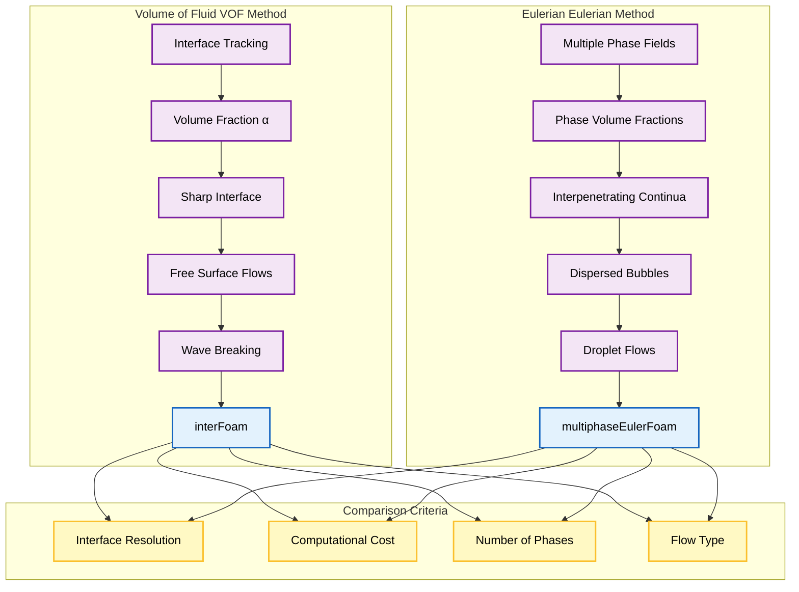
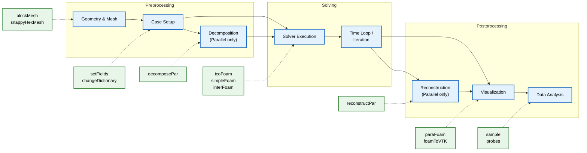
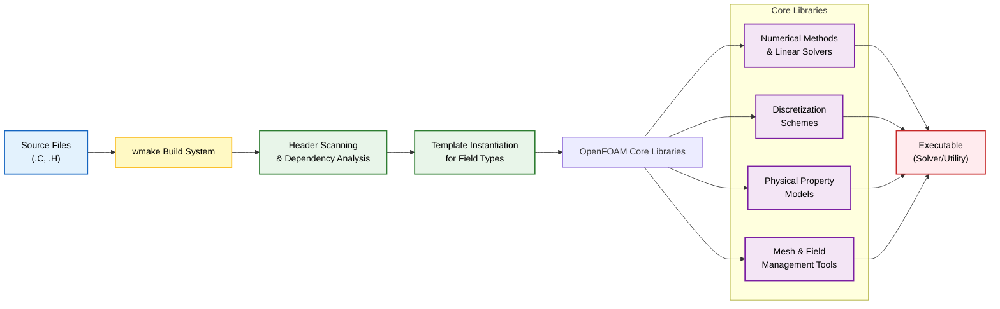

## 2. แอปพลิเคชัน (`applications/`)

ไดเรกทอรี `applications/` เป็นที่ตั้งของโปรแกรมปฏิบัติการจริงที่ผู้ใช้ใช้ทำการจำลอง CFD และงานที่เกี่ยวข้อง โดยแบ่งออกเป็น **สองประเภทหลัก** คือ **Solver** และ **Utility**

---

### แอปพลิเคชัน Solver

**Solver** คือโปรแกรมเฉพาะทางที่ใช้อัลกอริทึมเชิงตัวเลขเพื่อแก้ปัญหาทางฟิสิกส์เฉพาะเจาะจง

#### **Solver สำหรับการไหลแบบอัดตัวไม่ได้ (Incompressible Flow Solvers)**

| ชื่อ Solver | ลักษณะการทำงาน | ประเภทการจำลอง | ความเร็วการไหล |
|--------------|-------------------|------------------|------------------|
| **icoFoam** | แก้ปัญหาการไหลแบบ Laminar ที่อัดตัวไม่ได้ โดยใช้ **PISO Algorithm** | Transient | ต่ำ |
| **simpleFoam** | ใช้ **SIMPLE Algorithm** สำหรับการไหลแบบ Turbulent | Steady-state | กลางถึงสูง |
| **pimpleFoam** | ผสมผสาน PISO และ SIMPLE | Transient ที่มี Time step ขนาดใหญ่ | หลากหลาย |

#### **Solver สำหรับการไหลแบบอัดตัวได้ (Compressible Flow Solvers)**

| ชื่อ Solver | ลักษณะการทำงาน | ประเภทการจำลอง | ชนิดของการไหล |
|--------------|-------------------|------------------|------------------|
| **rhoSimpleFoam** | Solver แบบ Steady-state พร้อมคุณสมบัติทางเทอร์โมไดนามิกส์ | Steady-state | Turbulent อัดตัวได้ |
| **rhoPimpleFoam** | เวอร์ชัน Transient ของ rhoSimpleFoam | Transient | Turbulent อัดตัวได้ |
| **rhoCentralFoam** | ใช้ **Central Differencing Scheme** | Transient | อัดตัวได้ความเร็วสูง |

#### **Solver สำหรับการไหลแบบหลายเฟส (Multiphase Flow Solvers)**

| ชื่อ Solver | วิธีการ | จำนวนเฟส | ลักษณะการไหล |
|--------------|-----------|-----------|--------------|
| **interFoam** | **Volume of Fluid (VOF)** | 2 เฟส | อัดตัวไม่ได้ |
| **multiphaseEulerFoam** | **Eulerian Approach** | มากกว่า 2 เฟส | กระจายตัว |
| **twoPhaseEulerFoam** | **Eulerian Approach** | 2 เฟส | ก๊าซ-ของเหลว |





---

### แอปพลิเคชัน Utility

**Utility** คือเครื่องมือสนับสนุนสำหรับขั้นตอนการทำงาน CFD ตั้งแต่การเตรียมข้อมูลจนถึงการวิเคราะห์ผลลัพธ์

#### **การสร้างและจัดการ Mesh (Mesh Generation and Manipulation)**

| ชื่อ Utility | ฟังก์ชันหลัก | ผลลัพธ์ |
|--------------|----------------|----------|
| **blockMesh** | สร้าง **Hexahedral Mesh** ที่มีโครงสร้าง | Block Definition Dictionary |
| **snappyHexMesh** | สร้างรูปทรงเรขาคณิตซับซ้อนรอบ STL Surface | Refined Complex Mesh |
| **refineMesh** | ปรับปรุง Mesh ในพื้นที่ที่มีอยู่ | Dynamic Mesh Refinement |
| **decomposePar** | แยก Mesh สำหรับการคำนวณแบบขนาน | Domain Decomposition |

#### **การประมวลผลและแปลงข้อมูล (Data Processing and Conversion)**

| ชื่อ Utility | ฟังก์ชันหลัก | รูปแบบ Output |
|--------------|----------------|----------------|
| **foamToVTK** | แปลง Field ของ OpenFOAM | **VTK Format** สำหรับ ParaView |
| **sample** | ดึงค่า Field ตามแนวเส้น/พื้นผิว/ปริมาตร | Data Points สำหรับวิเคราะห์ |
| **probes** | ตรวจสอบการเปลี่ยนแปลงของ Field ณ จุดที่กำหนด | Time Series Data |

#### **การจัดการ Case (Case Management)**

| ชื่อ Utility | ฟังก์ชันหลัก | ประโยชน์ |
|--------------|----------------|----------|
| **foamCloneCase** | ทำสำเนาไดเรกทอรี Case | ทดสอบ Parameter ต่างๆ |
| **removeCase** | ลบ Simulation Case อย่างปลอดภัย | จัดการพื้นที่ |
| **paraFoam** | เปิด ParaView พร้อมโหลดข้อมูล OpenFOAM | การแสดงผลแบบ Real-time |



---

### สถาปัตยกรรมของแอปพลิเคชัน

แต่ละแอปพลิเคชันมีโครงสร้างที่สอดคล้องกันดังนี้:

```
applicationName/
├── Make/
│   ├── files      # รายการไฟล์ Source
│   └── options    # แฟล็กการคอมไพล์
├── applicationName.C    # จุดเริ่มต้นของโปรแกรมหลัก
└── [other source files] # โมเดลทางฟิสิกส์และ Algorithm
```

#### **โครงสร้างไฟล์ Source หลัก**

ไฟล์ Source หลักโดยทั่วไปประกอบด้วย:

1. **การ Include Header และการประกาศ Namespace**
2. **การเริ่มต้น Field และ Mesh**
3. **การกำหนด Time Loop**
4. **Algorithm การเชื่อมโยงความดัน-ความเร็ว (Pressure-velocity coupling Algorithm)**
5. **การรวมโมเดลทางฟิสิกส์**
6. **เกณฑ์การลู่เข้า (Convergence Criteria) และการควบคุม Output**

#### **Algorithm การเชื่อมโยงความดัน-ความเร็ว**

**PISO Algorithm (Pressure-Implicit with Splitting of Operators):**
```
Step 1: แก้สมการโมเมนตัมแบบชั่วคราว
Step 2: แก้สมการแก้ไขความดัน
Step 3: แก้ไขความเร็วจากความดันใหม่
Step 4: ทำซ้ำขั้นตอน 2-3 จนกว่าจะลู่เข้า
```

**SIMPLE Algorithm (Semi-Implicit Method for Pressure-Linked Equations):**
```
Step 1: แก้สมการโมเมนตัม
Step 2: แก้สมการแก้ไขความดัน
Step 3: แก้ไขความเร็วจากความดันใหม่
Step 4: ทำซ้ำจนกว่าจะลู่เข้า (Steady-state)
```

---

### การรวมระบบ Build

แอปพลิเคชันใช้ระบบ Build **`wmake`** ที่กำหนดเองของ OpenFOAM ซึ่งมีคุณสมบัติดังนี้:

- **การติดตาม Dependency อัตโนมัติ** ผ่านการสแกน Header
- **การสร้าง Instance ของ Template** สำหรับ Field ประเภทต่างๆ
- **การสนับสนุนการคอมไพล์แบบขนาน**
- **ความเข้ากันได้ข้ามแพลตฟอร์ม**

#### **กระบวนการ Build**

กระบวนการ Build จะเชื่อมโยงแอปพลิเคชันกับ **ไลบรารีหลักของ OpenFOAM**:

- **วิธีการเชิงตัวเลขและ Linear Solver**
- **Discretization Scheme**
- **โมเดลคุณสมบัติทางกายภาพ**
- **เครื่องมือจัดการ Mesh และ Field**





**สถาปัตยกรรมแบบ Modular** นี้ช่วยให้นักพัฒนาสามารถสร้าง **Solver ที่กำหนดเอง** ได้ โดยการเลือกโมเดลทางฟิสิกส์และ Numerical Scheme ที่เหมาะสมจาก Framework ของ OpenFOAM
