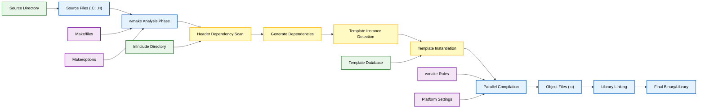
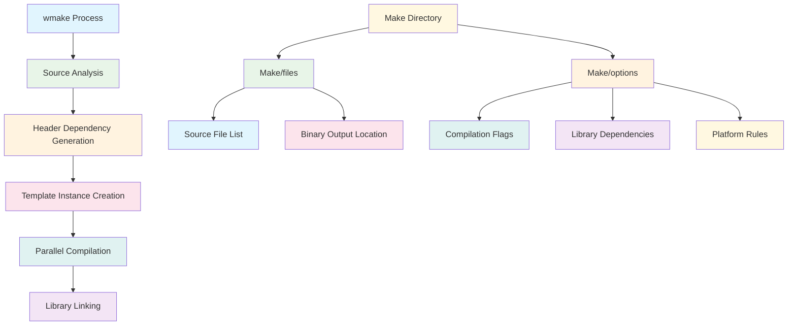
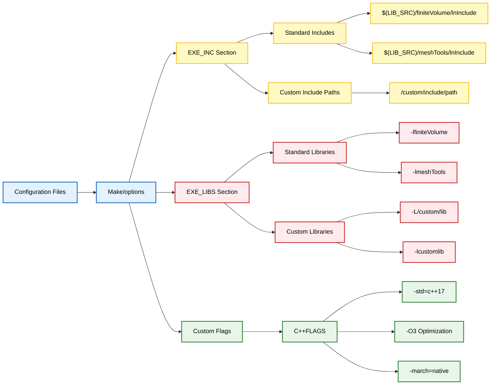

## 3. ระบบการสร้าง (Build System) (`wmake`)

OpenFOAM ใช้ `wmake` (ซึ่งเป็น Wrapper ของ `make`) ในการคอมไพล์โค้ด **Solver หรือ Library ที่กำหนดเองทุกตัวจะต้องมีไดเรกทอรี `Make/`**

### สถาปัตยกรรมของระบบการสร้าง `wmake`

ระบบ `wmake` คือสภาพแวดล้อมการสร้างที่ OpenFOAM กำหนดเอง ซึ่งขยายฟังก์ชันการทำงานของ `make` มาตรฐาน

**ความแตกต่างจาก `make` ทั่วไป:**
- จัดการการพึ่งพาของไฟล์ Header โดยอัตโนมัติ
- จัดการการสร้าง Template Instance  
- มีกฎการคอมไพล์ที่เป็นมาตรฐานในแพลตฟอร์มและ Compiler ที่แตกต่างกัน





#### ขั้นตอนการทำงานของ `wmake`

1. **การวิเคราะห์ไฟล์ Source**: `wmake` จะสแกนไฟล์ Source ทั้งหมดเพื่อระบุการพึ่งพาในการคอมไพล์

2. **การสร้างการพึ่งพาของ Header**: สร้างไฟล์ Dependency เพื่อให้แน่ใจว่ามีการคอมไพล์ใหม่ที่ถูกต้องเมื่อ Header เปลี่ยนแปลง

3. **การสร้าง Template Instance**: จัดการการคอมไพล์ C++ Template สำหรับคลาส Template ที่กว้างขวางของ OpenFOAM

4. **การคอมไพล์แบบขนาน**: รองรับการคอมไพล์แบบ Multi-threaded เพื่อการสร้างที่เร็วขึ้น

5. **การจัดการ Library**: จัดการการเชื่อมโยง (linking) กับระบบนิเวศ Library ที่กว้างขวางของ OpenFOAM โดยอัตโนมัติ

### โครงสร้างไดเรกทอรี `Make/`

ภายในโฟลเดอร์ใดๆ ที่สามารถคอมไพล์ได้ใน OpenFOAM คุณจะพบไดเรกทอรี `Make/` ซึ่งมีไฟล์ที่จำเป็นอย่างน้อยสองไฟล์





#### `Make/files`

ไฟล์ `files` จะบอก Compiler ว่า **จะคอมไพล์อะไร** และ **จะวางไฟล์ Binary ไว้ที่ไหน**

```bash
# Source files to compile - list all .C files
simpleFoam.C        # The main source file for the simpleFoam solver

# Where to save the executable
EXE = $(FOAM_APPBIN)/simpleFoam  # Output directory for applications
```

สำหรับ Library โครงสร้างจะแตกต่างกันเล็กน้อย:

```bash
# Library source files
MomentumTransportModel.C
turbulentTransportModel.C
laminarTransportModel.C

# Where to create the library
LIB = $(FOAM_LIBBIN)/libMomentumTransportModels
```

ตัวแปรสภาพแวดล้อม:
- `$(FOAM_APPBIN)`: ตำแหน่งมาตรฐานสำหรับ Application
- `$(FOAM_LIBBIN)`: ตำแหน่งมาตรฐานสำหรับ Library

#### `Make/options`

ไฟล์ `options` จะบอก Compiler ว่า **จะหาไฟล์ Header (`.H`) ได้จากที่ไหน** และจะเชื่อมโยงกับ Library ใดบ้าง

```bash
# Include paths for header files
EXE_INC = \
    -I$(LIB_SRC)/finiteVolume/lnInclude   # Include Finite Volume method headers
    -I$(LIB_SRC)/meshTools/lnInclude     # Include mesh manipulation tools
    -I$(LIB_SRC)/thermophysicalModels/basic/lnInclude  # Thermophysical models

# Libraries to link against
EXE_LIBS = \
    -lfiniteVolume                        # Link against libfiniteVolume.so
    -lmeshTools                          # Link against libmeshTools.so
    -lthermophysicalModels               # Link against thermophysical models
```

ไดเรกทอรี `lnInclude` มี **Symbolic Link** ไปยังไฟล์ Header ที่จำเป็นทั้งหมด ซึ่งสร้างโดย Utility `wmakeLnInclude`

### คุณสมบัติขั้นสูงของ `wmake`

#### การจัดการ Dependency

`wmake` สร้างไฟล์ Dependency (`.dep`) โดยอัตโนมัติ ซึ่งติดตาม Dependency ของไฟล์ Header

```bash
# Automatic dependency generation
wmake dependency file for simpleFoam.C: simpleFoam.dep
# Tracks dependencies like:
simpleFoam.o: simpleFoam.C \
    $(LIB_SRC)/finiteVolume/lnInclude/fvMesh.H \
    $(LIB_SRC)/finiteVolume/lnInclude/volFields.H \
    $(LIB_SRC)/OpenFOAM/lnInclude/GeometricFields.H
```

#### การคอมไพล์เฉพาะแพลตฟอร์ม

`wmake` รองรับ Compiler และแพลตฟอร์มที่หลากหลายผ่านระบบกฎ (rules system)

```bash
# Platform detection in wmake rules
include $(GENERAL_RULES)/general
include $(RULES)/c++    # C++ compilation rules
include $(RULES)/c++$(WM_COMPILE_OPTION)  # Compiler-specific options
include $(RULES)/general
```

#### ตัวแปรควบคุมการคอมไพล์

| ตัวแปร | คำอธิบาย | ค่าตัวอย่าง |
|---------|-----------|-------------|
| `WM_COMPILE_OPTION` | โหมดการคอมไพล์ | `Opt` (Optimized), `Debug` |
| `WM_NCOMPPROCS` | จำนวน Process ขนาน | `8` |
| `WM_COMPILER` | Compiler ที่ใช้ | `Gcc`, `Clang` |

### การดำเนินการ `wmake` ทั่วไป

#### คำสั่งคอมไพล์พื้นฐาน

| คำสั่ง | คำอธิบาย | ตัวอย่างการใช้งาน |
|---------|-----------|----------------|
| `wmake` | คอมไพล์ในไดเรกทอรีปัจจุบัน | คอมไพล์ solver หรือ library ปัจจุบัน |
| `wmake clean && wmake` | บังคับคอมไพล์ใหม่ทั้งหมด | ใช้เมื่อต้องการ rebuild ซ้ำ |
| `wmake -j 4` | คอมไพล์แบบขนาน 4 process | เพิ่มความเร็วในการคอมไพล์ |
| `wmakeLnInclude` | สร้าง header links เท่านั้น | อัปเดตการเชื่อมโยง header |

#### การคอมไพล์ทั่วทั้งระบบ

```bash
# Compile entire OpenFOAM installation
./Allwmake

# Compile only libraries
cd src && ./Allwmake

# Compile only applications
cd applications && ./Allwmake
```

#### การดำเนินการล้างไฟล์

```bash
# Clean object files in current directory
wclean

# Clean all object files and dependencies
wclean all

# Remove all lnInclude directories system-wide
wcleanLnIncludeAll
```

### การวินิจฉัยระบบการสร้าง

เมื่อการคอมไพล์ล้มเหลว `wmake` จะให้ข้อความแสดงข้อผิดพลาดโดยละเอียด

#### **Header หายไป**
ตรวจสอบ Include Path ใน `Make/options`

```bash
# Error: fatal error: 'fvMesh.H' file not found
# Solution: Add -I$(LIB_SRC)/finiteVolume/lnInclude to EXE_INC
```

#### **ข้อผิดพลาดในการเชื่อมโยง (Link Errors)**
ตรวจสอบชื่อ Library ใน `Make/options`

```bash
# Error: undefined reference to 'Foam::fvMesh::fvMesh()'
# Solution: Add -lfiniteVolume to EXE_LIBS
```

#### **การสร้าง Template Instance**
ตรวจสอบให้แน่ใจว่า Template Dependency ถูกต้อง

```bash
# Error: template instantiation failed
# Solution: Check that all template headers are accessible through lnInclude
```

### การกำหนดค่าการสร้างแบบกำหนดเอง

สำหรับความต้องการในการพัฒนาที่เฉพาะเจาะจง คุณสามารถสร้างการกำหนดค่าการสร้างแบบกำหนดเองได้:

```bash
# Custom compilation flags
EXE_INC = \
    -I$(LIB_SRC)/finiteVolume/lnInclude \
    -I$(LIB_SRC)/meshTools/lnInclude \
    -I/custom/include/path  # Custom include path

C++FLAGS = -std=c++17 -O3 -march=native  # Custom compiler flags

EXE_LIBS = \
    -lfiniteVolume \
    -lmeshTools \
    -L/custom/lib -lcustomlib  # Custom library
```





สถาปัตยกรรมระบบการสร้างแบบโมดูลาร์นี้ช่วยให้ OpenFOAM สามารถจัดการความซับซ้อนของการพัฒนาซอฟต์แวร์ CFD ขนาดใหญ่ ในขณะที่ยังคงรักษาความสามารถในการพกพาข้ามสภาพแวดล้อมการประมวลผลที่แตกต่างกัน
