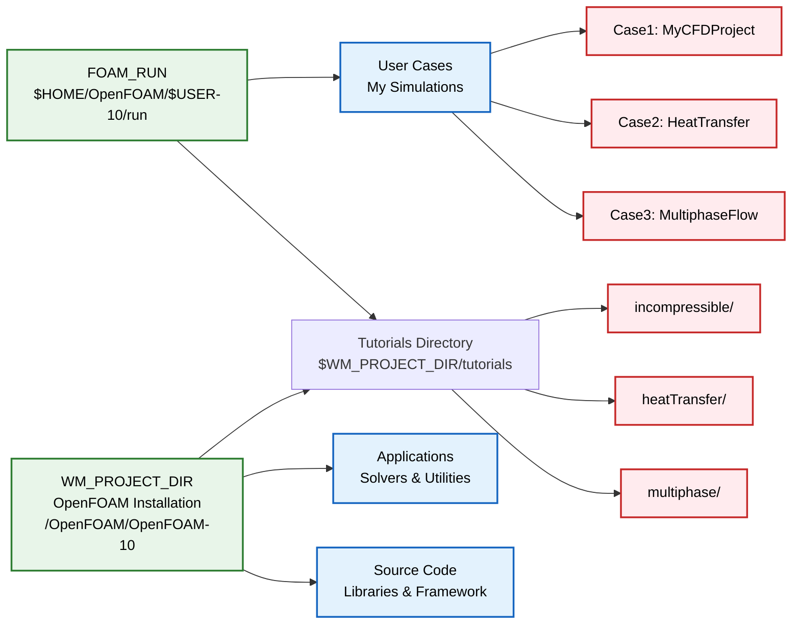
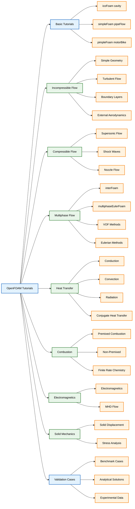

# รายการตรวจสอบสรุป

## 📂 ภาพรวมโครงสร้างไดเรกทอรีของ OpenFOAM

รายการตรวจสอบนี้สรุปเค้าโครงไดเรกทอรีพื้นฐานของการติดตั้ง OpenFOAM ซึ่งให้คำแนะนำที่จำเป็นสำหรับการสำรวจ codebase และการจัดระเบียบงานของคุณ

---

## 1. ไดเรกทอรี Simulations: `$FOAM_RUN`

ตัวแปรสภาพแวดล้อม `$FOAM_RUN` ชี้ไปยังไดเรกทอรีการทำงานหลักของคุณ ซึ่งเป็นที่ที่ทำการจำลอง CFD โดยทั่วไปจะอยู่ที่ `$HOME/OpenFOAM/$USER-10/run` สำหรับการติดตั้ง OpenFOAM-10 มาตรฐาน

### คุณสมบัติหลัก

- **เฉพาะผู้ใช้ (User-specific)**: ผู้ใช้แต่ละคนมีไดเรกทอรี `$FOAM_RUN` ของตนเอง
- **ตำแหน่งเริ่มต้น (Default location)**: สร้างขึ้นโดยอัตโนมัติเมื่อคุณ source สภาพแวดล้อม OpenFOAM
- **การจัดการ Case (Case management)**: Case การจำลองทั้งหมดของผู้ใช้ควรจัดระเบียบภายในไดเรกทอรีนี้
- **การแยกเวอร์ชัน (Version isolation)**: เก็บข้อมูลการจำลองแยกต่างหากจากไฟล์การติดตั้ง OpenFOAM





### รูปแบบการใช้งานทั่วไป

```bash
# Navigate to your run directory
cd $FOAM_RUN

# Create a new case directory
mkdir mySimulationCase
cd mySimulationCase

# Copy tutorial cases for modification
cp -r $WM_PROJECT_DIR/tutorials/incompressible/simpleFoam/pitzDaily .
```

---

## 2. ไดเรกทอรี Source Code: `$WM_PROJECT_DIR/src`

นี่คือหัวใจของ OpenFOAM ซึ่งเป็นที่อยู่ของไลบรารีหลัก, เฟรมเวิร์ก และคลาสพื้นฐานทั้งหมด การทำความเข้าใจโครงสร้างนี้เป็นสิ่งสำคัญสำหรับนักพัฒนาที่ทำงานกับ codebase C++ ของ OpenFOAM

### ส่วนประกอบหลัก

| ส่วนประกอบ | คำอธิบาย | ฟังก์ชันหลัก |
|-------------|-------------|----------------|
| **`OpenFOAM/`** | คลาส C++ พื้นฐาน | การคำนวณ tensor, การจัดการ field, linear algebra solvers, mesh operations, parallel processing |
| **`finiteVolume/`** | วิธีการ finite volume | discretization, การคำนวณ flux, gradient schemes, numerical interpolation |
| **`meshTools/`** | เครื่องมือ Mesh | การสร้าง Mesh, utilities สำหรับการปรับเปลี่ยน, topology operations, geometric calculations |
| **`thermophysicalModels/`** | รุ่น Thermodynamic | thermodynamic property models, transport properties, equation of state |
| **`lagrangian/`** | รุ่น Lagrangian | discrete particle tracking, parcel dynamics, dispersed phase modeling |
| **`MomentumTransportModels/`** | รุ่นการขนส่งโมเมนตัม | turbulence modeling (RANS, LES, DES), wall functions, transport closures |

### ขั้นตอนการพัฒนา

```bash
# Navigate to source directory
cd $WM_PROJECT_DIR/src

# Build all libraries
./Allwmake

# Build specific library
cd finiteVolume
wmake
```

---

## 3. ไดเรกทอรี Applications: `$WM_PROJECT_DIR/applications`

ประกอบด้วย executables ทั้งหมดที่ผู้ใช้เข้าถึงได้ รวมถึง Solvers, Utilities และเครื่องมือพิเศษที่ประกอบเป็นระบบนิเวศของ OpenFOAM

### Application Categories

#### **Solvers (`applications/solvers/`)**

CFD Solvers เฉพาะทางฟิสิกส์ จัดเรียงตามโดเมนการใช้งาน

| ประเภทการไหล | Solvers | คำอธิบาย |
|----------------|---------|-------------|
| **Incompressible flow** | `icoFoam`, `simpleFoam`, `pimpleFoam` | การไหลแบบอัดตัวไม่ได้ (laminar, steady-state turbulent, transient) |
| **Multiphase flow** | `multiphaseEulerFoam`, `interFoam`, `reactingMultiphaseEulerFoam` | การไหลหลายเฟส |
| **Heat transfer** | `buoyantBoussinesqSimpleFoam`, `reactingFoam` | การถ่ายเทความร้อน |
| **Solid mechanics** | `solidDisplacementFoam`, `thermalStressFoam` | กลศาสตร์ของแข็ง |
| **Electromagnetics** | `electrostaticFoam`, `magneticFoam` | แม่เหล็กไฟฟ้า |

#### **Utilities (`applications/utilities/`)**

เครื่องมือ Pre-processing, Post-processing และการจัดการ Case

| ประเภท | Utilities | ฟังก์ชัน |
|---------|-----------|------------|
| **Mesh generation** | `blockMesh`, `snappyHexMesh`, `refineMesh` | การสร้างและปรับปรุง Mesh |
| **Decomposition** | `decomposePar`, `reconstructPar` | การประมวลผลขนาน |
| **Post-processing** | `paraFoam`, `foamToVTK`, `sample` | การวิเคราะห์ผลลัพธ์ |
| **Data manipulation** | `mapFields`, `mergeMeshes`, `collapseEdges` | การจัดการข้อมูล |

### รูปแบบการพัฒนา

```bash
# Build all applications
cd $WM_PROJECT_DIR/applications
./Allwmake

# Build specific solver
cd solvers/incompressible/simpleFoam
wmake

# Find applications by keyword
find $WM_PROJECT_DIR/applications -name "*Foam" | grep -i turbulent
```

---

## 4. ไดเรกทอรี Tutorial: `$WM_PROJECT_DIR/tutorials`

ชุดรวม Case CFD ที่สมบูรณ์แบบ ซึ่งแสดงความสามารถของ OpenFOAM ในโดเมนฟิสิกส์ต่างๆ, เทคนิคการ Meshing และการกำหนดค่า Solver

### การจัดระเบียบ Tutorial

- **Basic tutorials**: บทนำแบบทีละขั้นตอนสำหรับผู้เริ่มต้น
- **Physics-specific**: จัดเรียงตามโดเมนการใช้งาน (multiphase, heat transfer, combustion)
- **Advanced cases**: รูปทรงเรขาคณิตที่ซับซ้อน, Boundary Conditions เฉพาะทาง, การศึกษาการปรับให้เหมาะสม
- **Validation cases**: ปัญหา Benchmark ที่มี analytical solutions หรือข้อมูลจากการทดลอง





### ขั้นตอนการเรียนรู้

```bash
# Navigate to tutorials
cd $WM_PROJECT_DIR/tutorials

# Copy and run a basic case
cp -r incompressible/icoFoam/cavity $FOAM_RUN
cd $FOAM_RUN/cavity
blockMesh
icoFoam
paraFoam

# Explore by physics category
ls tutorials/multiphase/
ls tutorials/heatTransfer/
ls tutorials/compression/
```

---

## 🎯 แนวทางการใช้งานจริง

### การจัดการ Path

ควรใช้ environment variables แทน hardcoded paths เสมอ:

```bash
# Correct approach
cd $FOAM_RUN
cp -r $WM_PROJECT_DIR/tutorials/incompressible/simpleFoam/pitzDaily .

# Avoid hardcoded paths
# cd /opt/openfoam10/tutorials/incompressible/simpleFoam/pitzDaily
```

### การจัดระเบียบ Case

จัดโครงสร้างงานจำลองของคุณภายใน `$FOAM_RUN`:

```
$FOAM_RUN/
├── heatTransfer/
│   ├── roomVentilation/
│   └── electronicsCooling/
├── multiphase/
│   ├── bubbleColumn/
│   └── pipeFlow/
└── validation/
    ├── backwardFacingStep/
    └── lidDrivenCavity/
```

### ขั้นตอนการพัฒนา

สำหรับการพัฒนา Solver แบบกำหนดเอง:

1. **ศึกษา Solvers ที่มีอยู่**: ตรวจสอบ Solvers ที่คล้ายกันใน `$WM_PROJECT_DIR/applications/solvers/`
2. **ทำความเข้าใจ Dependencies**: ตรวจสอบไลบรารีที่จำเป็นใน `$WM_PROJECT_DIR/src/`
3. **ปรับเปลี่ยนทีละน้อย**: คัดลอกและปรับเปลี่ยน Solvers ที่มีอยู่ แทนที่จะเริ่มต้นจากศูนย์
4. **ทดสอบอย่างละเอียด**: ตรวจสอบความถูกต้องกับ tutorial cases หรือ analytical solutions

### แนวปฏิบัติที่ดีที่สุด

- **แยกการจำลองออกจากกัน**: ห้ามทำงานโดยตรงใน `$WM_PROJECT_DIR/tutorials/`
- **การควบคุมเวอร์ชัน (Version control)**: ใช้ git สำหรับการจัดการ Case และการปรับเปลี่ยนโค้ด
- **เอกสารประกอบ (Documentation)**: จัดทำไฟล์ README สำหรับ Solvers แบบกำหนดเองและ Case ที่ซับซ้อน
- **กลยุทธ์การสำรองข้อมูล (Backup strategies)**: สำรองข้อมูล `$FOAM_RUN` และการพัฒนาโค้ดที่กำหนดเองเป็นประจำ
